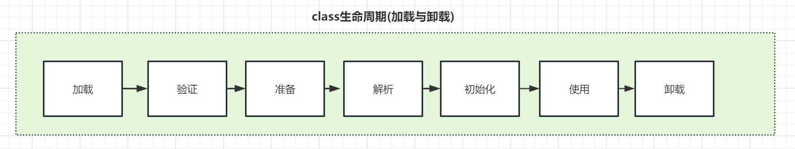

# 1.JVM基础

[JVM学习笔记【推荐】，可以快速学习基本知识点](https://www.kancloud.cn/luoyoub/jvm-note)

## 1.基础介绍

### 1.1. 什么是虚拟机

JVM是Java Virtual Machine（Java虚拟机）的缩写，JVM是一种用于计算设备的规范，它是一个虚构出来的计算机，是通过在实际的计算机上仿真模拟各种计算机功能来实现的。
Java语言的一个非常重要的特点就是与平台的无关性。而使用Java虚拟机是实现这一特点的关键。
一般的高级语言如果要在不同的平台上运行，至少需要编译成不同的目标代码。
而引入Java语言虚拟机后，Java语言在不同平台上运行时不需要重新编译。

Java语言使用Java虚拟机屏蔽了与具体平台相关的信息，使得Java语言编译程序只需生成在Java虚拟机上运行的目标代码（字节码），就可以在多种平台上不加修改地运行。
Java虚拟机在执行字节码时，把字节码解释成具体平台上的机器指令执行。这就是Java的能够“一次编译，到处运行”的原因。

### 1.2. Java的历史

- 1995.5 Oak -> Java1.0 Write once run anywhere
- 1996.1 jdk 1.0 jvm Sun Classic VM
- 1996.9首届javaOne大会
- 1997.2jdk1.1 内部类反射 jar文件格式，jdbc, Javabeans，rmi
- 1998 1.2 J2SE j2EE j2ME swing jit Hotspot VM
- 2000.5 jdk 1.3 Timer java2d
- 2002 2 jdk 1.4 Struts, Hibernate, Spring l.X，正则表达式，Nio，日志，XML解析
- 2004.9 jdk1.5 自动装箱拆箱，泛型.注解，枚举，变长参数，增强for循环 Spring2.x Spring4.x
- 2006 jdk1.6。 分为 EE、Se、Me三个版本，提供脚本语言支持，提供编译api以及http服务器api
- 2009 jdk 1.7 收购sun 74亿
- 2010年11月，由于Oracle公司对于Java社群的不友善，因此Apache扬言将退出 JCP（现在已经形同虚设了）
- 2014年3月18日，Oracle公司发表Java SE 8
- 2017年9月21日，Oracle公司发表Java SE 9
- 2018年3月21日，Oracle公司发表Java SE 10
- 2018年9月25日，Java SE 11发布
- 之后开启一年发布2个大版本的节奏。

### 1.3. 常见JDK

通常说的JDK指的是Oracle jdk， JVM是Sun Hotspot。而常说的OpenJDK是Oracle jdk的开源版本。但是OracleJDK商用许可证的协议经常变卦；稳妥起见，还是使用OpenJDK的发行版进行项目开发比较好。

OpenJDK是Java SE规范的开源参考实现，但它只是源代码。二进制发行版由不同的供应商提供，这些发行版在许可证、商业支持、支持的平台和更新频率方面有所不同，甚至JVM、GC也是不同。

在当前的JDK发布模式下，计划每六个月，即3月和9月发布一次具有新主要版本号的新功能版本。此外，还有季度错误修复更新。每三年，9月的版本将是长期支持（LTS）版本，LTS至少会更新三年。

各厂商的发行版。

- OpenJDK：
  - 介绍：Oracle构建的开源发行版。每个版本最多提供6个月的更新，所以官网提供的版本不是最新的。如果用于生产的话，不推荐使用。
  - 官网：[http://openjdk.java.net/](http://openjdk.java.net/)
  - 源码：[https://github.com/openjdk/jdk](https://github.com/openjdk/jdk)

- Zulu：【重要】支持M1
  - 介绍：Azul 是 全球最大的 OpenJDK商业版提供商。100% 基于 Java 的 OpenJDK。推荐使用。商业版提供市场是最优秀的C4垃圾回收器。
  - 官网：[https://www.azul.com/zh-hans/](https://www.azul.com/zh-hans/)

- 毕昇：
  - 介绍：华为基于OpenJDK开发，是一个高性能、可用于生产环境的OpenJDK发行版，并在ARM架构上进行了性能优化。
  - 官网：[https://www.hikunpeng.com/developer/devkit/compiler/jdk](https://www.hikunpeng.com/developer/devkit/compiler/jdk)

- Amazon Corretto
  - 介绍：Java 开发工具包 (OpenJDK) 的免费、多平台、生产就绪型发行版。推荐使用。
  - 官网：[https://aws.amazon.com/cn/corretto/](https://aws.amazon.com/cn/corretto/)
    
- 阿里的dragonwell8源码
  - 介绍：生产就绪型Open JDK 发行版，提供长期支持，包括性能增强和安全修复。
  - 源码：[https://github.com/alibaba/dragonwell8](https://github.com/alibaba/dragonwell8)
  - [重塑云上的 Java 语言](https://developer.aliyun.com/article/738123)

- 腾讯的 KonaJdk
  - 介绍：OpenJDK的发行版，并且针对大数据，机器学习和云计算等场景进行了独特的优化，在高性能及安全性方面多有建树。
  - 源码：[https://github.com/Tencent/TencentKona-8](https://github.com/Tencent/TencentKona-8)
  - 使用指南：[https://cloud.tencent.com/document/product/1149/38537](https://cloud.tencent.com/document/product/1149/38537)

- GraalVM
  - 介绍：GraalVM由Oracle开发，它基于OpenJDK，但包括一个新的高性能编译器和一个新的多语言虚拟机（可以执行用不同编程语言编写的代码）

### 1.4.常见JVM

Java Virtual Machine不关心运行在其内部的程序到底是何种语言编写的，它只关心“字节码”文件。JVM是编程语言无关的，并不会单纯地与Java语言“绑定”，只要其他编程语言的编译结果满足并包含JVM的内部指令集，符号以及其他辅助信息，就能被JVM识别并装载运行。

- Sun Classic VM。jdk1.0，Sun公司于1996年发布的第一款商用JVM，纯解释执行，如果使用JIT编译器，就需要进行外挂 sun workstop JIT。
- Exact VM。jdk1.2提供。它具备了现代高性能虚拟机的雏形：热点探测、编译器与解释器混合工作模式。准确式内存管理，性能比 Classic VM 明显提高。
- HotSpot VM。jdk1.3时作为默认的虚拟机。Longview Technologies 公司设计，被 Sun 收购，沿用至今。特点就是是热点代码探测技术，实现即时编译。1.8时整合了JRockit的特性。
- JRockit VM。由BEA公司开发，它专注于服务器应用，不包含解释器，全部代码都靠即时编译器编译后执行。 被 Oracle 收购，特性被整合到HotSpot VM
- J9 VM。由IBM公司开发，它广泛用于IBM的各种Java产品。已经停止。
- Liquid VM，基于 JRockit 开发用，不需要操作系统，用于专属硬件平台。已经停止。
- Zing VM。从HoSpot VM fork出来的发行版。Azul提供了被称为无时延的垃圾回收器PGC和 C4，性能比HoSpot ZGC更强，支持 TB 级内存，低延迟速预热，可保证暂停时间持续稳定在 10 ms 内。后续被更名为zulujdk，作为商业收费。
- Apache Harmony。IBM和Intel联合开发的开源JVM，由于未JCP认证，最终于2011年退役。虽然Apache Harmony未被大规模商用，但它的Java类库代码被吸纳进了Andriod SDK。已经停止。
- taobaoVM（淘宝专用，对Hotspot进行了深度定制）
- Microsoft JVM，微软开发的 Windows 下的 Java 虚拟机，因被起诉已停止。

### 1.5.JVM语言

JVM可以运行字节码，一开始只是用来运行Java程序。但是Java再后期的发展中，Java的冗余、规范多等问题越发的突出，出现其他语音也是编译成class字节码可以运行在jvm中。这一类计算机语言也被称为jvm语言。
- Sacla
- Kotlin
- Groovy
- JPython
- JRuby

### 1.6.Java命令

```java
// 1.Hello.java
package com.demo;

import org.apache.commons.lang3.StringUtils;

import com.demo.util.Common;

public class Hello {
    public static void main(String[] args) {
        String str = "Hello!你好！";
        System.out.println(str);
        System.out.println(Common.isEmpty(str));
        System.out.println(StringUtils.isEmpty(str));
    }
}

// 2.Common.java
package com.demo.util;

public class Common {
    public static boolean isEmpty(Object obj) {
        return obj == null || (obj instanceof String && "".equals(obj.toString().trim()));
    }
}
```

1.编译命令
```shell
javac -cp ./commons-lang3-3.1.jar -d . -encoding UTF-8 ./com/demo/Hello.java ./com/demo/util/Common.java

- -cp。classpath的缩写，window上分号“;” 分隔，linux上是分号“:”分隔。不支持通配符，需要列出所有jar包，用一点“.”代表当前路径。
- -d 指定放置生成的类文件(.class)的位置。若此选项省略，默认在当前目录下生成.class文件，并且不会生成包文件夹；
    当前目录可以用“.”来表示，即：javac -d . Hello.java（在当前目录生成com/demo/Hello.class）。
- -encoding 指定源文件使用的字符编码。
```

2.执行命令
```shell
1. 执行类： java [-options] class [args...]
2. 执行jar：java [-options] -jar jarfile [args...]

执行编译后的class
java -cp .:./commons-lang3-3.1.jar com.demo.Hello
```

### 1.7.JVM主要子系统
- 类加载器子系统（Class Loader Subsystem）：类加载机制
- 运行时数据区（Runtime Data Area）：内存管理与垃圾回收
- 执行引擎（Execution Engine）：解释器与编译器

## 2.编译器与解释器

### 2.1.介绍
- 解释器-Interpreter：执行java字节码,HotSpot中只有一个没有具体的名字。虽然叫做解释器，但并非对源码逐行解释执行。
  例如Java的解释器会将Java字节码翻译为JVM中的指令，然后被执行。不同于其他解释型语言，Java的前后端编译时分开的，而js,python的是在执行过程中进行的。
- 编译器-Compiler: 将字节码编译为机器码。HotSpot有两个即时编译器，分别称为Client Compiler和Server Compiler，习惯上将前者称为C1，后者称为C2。

JVM中，java代码会被编译成字节码，这是一种中间形态，用于不同平台的JVM执行，这是Java跨平台的基础。
字节码执行时，并不立即编译成机器码。这主要有两个原因：
1. 绝大部分代码被执行的次数非常少，如果无脑编译所有代码就是浪费资源，所以JVM最开始的时候是只进行解释，这样整体的效率比编译快。 
2. 当执行某一方法或遍历循环的次数越多，编译器会判断代码是热代码，需要编译。

Java程序一开始是通过解释器（Interpreter）进行解释执行的。
当JVM发现某个方法或代码块运行特别频繁时，就会把这些代码认定为“热点代码（Hot Spot Code）”， 然后JVM会把这些代码编译成与本地平台相关的机器码。
完成这个任务的编译器称为：即时编译器（Just In Time Compiler，JIT）

JIT技术，是将运行频率很高的字节码直接编译为目标机器指令（以 method 为翻译单位，将其缓存到方法区的code cache中，第二次执行就不用翻译了，直接执行）。
JIT编译器是“动态编译器”的一种，可以在程序执行过程中进行编译并且可以逐步深入编译，相对的“静态编译器”则是指的比如：C/C++的编译器。

JIT并不是JVM的必须部分，JVM规范并没有规定JIT必须存在，更没有限定和指定JIT。但是，JIT性能的好坏、代码优化程度的高低却是衡量一款JVM是否优秀的最关键指标之一，
也是虚拟机中最核心且最能体现虚拟机技术水平的部分。

特殊的例子：
- 最早的Sun Classic VM只有Interpreter
- BEA JRockit VM则只有Compiler，但它主要面向服务端应用，部署在其上的应用不重点关注启动时间

可以在应用启动时设置采用哪种编译器的工作模式：-server 或者 -client，默认情况下不需要设置。
- 32位JDK能启动client和server
- 64位JDK只能启动server

### 2.2.编译器类型

#### 2.2.1.常见分类
Java编译器分为：前端编译、即时编译（JIT编译）、静态提前编译（AOT编译）
- 前端编译器：      JDK Javac、Eclipse JDT中的增量式编译器（ECJ）;
- 即时编译器(JIT)：HotSpot虚拟机的C1、C2编译器，Graal编译器
- 提前编译器(AOT)：JDK的Jaotc、GNU Compiler for the Java（GCJ）、ExcelsiorJET、AOT

> 1.前端编译：就是把Java源码文件（.java）编译成Class文件(.class)。

优点：
- 提高编译效率，提前发现不符合语法和编译规则的问题；
- 许多Java语法新特性（"语法糖"：泛型、内部类、类型擦除、自动装载与卸载，foreach自动替换为迭代器等等），是靠前端编译器实现的，而不是依赖虚拟机；
- 编译成的Class为中间代码，可以方便JVM执行与编译，省去编译时间，加快启动速度；

缺点：
- 对代码运行效率几乎没有任何优化措施；
- 解释执行效率较低，所以需要结合JIT编译；

> 2.即时编译(JIT，Just In Time Compiler)。通过JVM内置的JIT编译器，在运行时把“热代码”的Class文件字节码编译成本地机器码；
> 注意：非“热代码”使用的是解释器，执行效率低。

优点：
- 通过在运行时收集监控信息，把"热点代码"（Hot Spot Code）编译成与本地平台相关的机器码，并进行各种层次的优化；
- 可以极大的提高执行效率，性能超过C的执行效率；

缺点：
- 收集监控信息影响程序运行；
- 编译过程占用程序运行时间（如使得启动速度变慢），且应用的性能需要运行一段时间才能达到最大（需要运行过程动态进行JIT编译）；
- 编译机器码占用内存较大；

JIT编译速度及编译结果的优劣，是衡量一个JVM性能的很重要指标；

> 3.提前编译(AOT编译)。直接把Java源码文件（.java）编译成本地机器码。
> 比如：很多云上的新应用不约而同地选择了 Go 语言，很大的原因是 Go 应用对运行环境没有依赖，静态编译的程序启动速度快，也不需要通过 JIT 来预热。

优点：
- 编译不占用运行时间，可以做一些较耗时的优化，并可加快程序启动；
- 把编译的本地机器码保存磁盘，不占用内存，并可多次使用；

缺点：
- 因为Java语言的动态性（如反射）带来了额外的复杂性，影响了静态编译代码的质量；
- 一般静态编译不如JIT编译的质量，这种方式用得比较少；

[GraalVM Java 编译器将于 2023 年加入，与 OpenJDK 的发布节奏和流程保持一致](https://zhuanlan.zhihu.com/p/601347706)

PS:Java 静态编译技术是一种激进的 AOT 技术，通过单独的编译阶段将 Java 程序编译为机器码，在运行时无需传统 Java 虚拟机和运行时环境，只需操作系统类库支持即可。
静态编译技术实现了 Java 语言与原生 native 程序的“合体”，将原本的 Java 程序编译成为了一个自举的具有 Java 行为的原生 native 程序，由此兼有 Java 程序和原生 native 程序的优点。

Java 过去之所以没有全面编译，并非占用内存增加和启动时间变慢，GraalVM Native Image 也需要编程很长时间，消耗很大的内存。
主要问题，实际上，GraalVM 也无法解决，尤其是 JVM 字节码动态性，比如 CGLIB 动态生成或者 Java 反射的不确定性。
其实，对于大多数业务代码，GraalVM AOT 编译器基本上可以完成静态化，主要是在框架代码上，有些麻烦。
比如 Spring Stack，所以 Spring Native 做了大量的辅助工作，也帮助 GraalVM 提升稳定性，然而部分代码还需要自行声明

> 4.目前Java体系中主要还是采用前端编译+JIT编译的方式，例如HotSpot。

前端编译+JIT编译方式的运作过程大体如下：
1. 首先通过前端编译把符合Java语言规范的程序代码转化为满足JVM规范所要求Class格式；
2. 然后程序启动时Class格式文件发挥作用，解释执行，省去编译时间，加快启动速度；
3. 针对Class解释执行效率低的问题，在运行中收集性能监控信息，得知"热点代码"；
4. JIT逐渐发挥作用，把越来越多的热点代码"编译优化成机器码，提高执行效率；

#### 2.2.2.JIT和AOT对比

- JIT：吞吐量高，有运行时性能加成，可以跑得更快，并可以做到动态生成代码等，但是相对启动速度较慢，并需要一定时间和调用频率才能触发 JIT 的分层机制
- AOT：内存占用低，启动速度快，可以无需 runtime 运行，直接将 runtime 静态链接至最终的程序中，但是无运行时性能加成，不能根据程序运行情况做进一步的优化

> Java 9 引入了 AOT 编译方式，能够将 class 文件直接编译成可执行二进制文件。

目前 JDK AOT 的局限有：
- 仅支持 64 位 Linux 操作系统：；
- 操作系统需要预装 libelf 库，以确保能够生成 elf 文件：
- AOT 编译和执行环境需要相同：
- Java 9 最初发布时，只支持 java.base 模块可以编译成 AOT 库；
- 目前只支持 G1 和 Parallel GC 两种 GC 方式，且需要再编译时选择使用哪种GC，无法在运行时选择。
- 可能会无法编译通过动态生成 class 文件或者修改字节码的 java 代码（如 lambda 表达式、反射调用等）
- JVM 运行时参数设置必须和 AOT 库编译时相同；
- AOT 可能带来的好处，是 JVM 加载这些已经预编译成二进制库之后，可以直接调用，而无需再将其运行时编译成二进制码。
  理论上，AOT 的方式，可以减少 JIT 带来的预热时间，减少 Java 应用长期给人带来的“第一次运行慢”感觉。

### 2.3.编译器工作模式

#### 2.3.1.工作模式
JVM的工作模式：解释模式、编译模式、混合模式(默认)。

代码的执行效率: 在正常的情况下，混合模式 &gt; 编译模式 &gt; 解释模式。jdk 7开始默认的混合模式。

HotSpot采用解释器和编译器混合工作，如何使用编译器取决于虚拟机运行的模式，HotSpot会根据自身版本和宿主机器硬件性能自动选择模式，也可以使用“-client”或”-server”参数去指定。
- -Xint代表解释模式(interpreted mode)，强制使用解释器来执行程序，运行期间不使用JIT。
- -Xcomp代表编译模式(compiled mode)，轻质使用JIT，相比 解释模式，代码的执行效率更高，但是需要消耗更多资源对代码进行性能优化，导致效率反而不是最好的。
- -Xmixed代表混合模式(mixed mode)，JVM的默认工作模式。对代码进行分层编译，确保性能最好。

获取JVM的工作模式
```java
//获取JVM名字和类型
System.out.println(System.getProperty("java.vm.name"));

//获取JVM的工作模式
System.out.println(System.getProperty("java.vm.info"));
```

#### 2.3.2.性能对比

下图是不同模式下的java与c++性能比较。


图中最显著的就是JVM client模式和Server模式关于method call的对比，那个差别不是一般的大，在后来的测试中发现，相差至少有10倍。
而在其他的测试中，在大多数情况下server VM的性能比c++稍强些。


JVM工作在Server模式可以大大提高性能，但应用的启动会比client模式慢大概10%。当该参数不指定时，虚拟机启动检测主机是否为服务器，
如果是，则以Server模式启动，否则以client模式启动，J2SE5.0检测的根据是至少2个CPU和最低2GB内存。

当JVM用于启动GUI界面的交互应用时适合于使用client模式，当JVM用于运行服务器后台程序时建议用Server模式。

JVM在client模式默认-Xms是1M，-Xmx是64M；JVM在Server模式默认-Xms是128M，-Xmx是1024M。我们可以通过运行:java -version来查看jvm默认工作在什么模式。

这是官方提供的参考


以下是不同模式下，程序运行性能的对比。结论：混合模式&gt;编译模式&gt;解释模式
```java
import java.util.concurrent.CountDownLatch;
import java.util.concurrent.atomic.AtomicLong;

/**
 * @Title: JvmWordModel
 * @Description: java 三种工作模式（本程序只是单纯的想要模拟频繁调用方法的场景）
 * @author: xue.zhang
 * @date: 2018年6月17日下午5:15:24
 * @company: yooli
 * @Copyright: Copyright (c) 2017
 * @version v1.0
 * 计算机配置 英特尔 i7-5500U, 64位, win10, JVM为模式状态
 * 
 * 测试结果： 
 *  合模式：jvm参数是  -Xmixed，     程序运行时间：2514 us
 *  编译模式：jvm参数是  -Xcomp，    程序运行时间：3403 us
 *  解释模式：jvm参数是  -Xint，     程序运行时间：8561 us
 */
public class JvmWordModel {
	
	private static AtomicLong time = new AtomicLong(0);

	public static void main(String[] args) throws InterruptedException {
		int testNum = 1000;
		for (int i = 0; i < testNum; i++) {// 测试1000次
			Thread thread = new Thread(new Job());
			thread.start();
			thread.join();
		}
		System.out.println(time.get() / 1000 / testNum  + " us,avg");
	}

	public static class Job implements Runnable {
		@Override
		public void run() {
			int number = 8;
			int iterationNumber = 20000;
			CountDownLatch countDownLatch = new CountDownLatch(number);
			Obj[] objArray = new Obj[number];
			for (int i = 0; i < number; i++) {
				objArray[i] = new Obj();
			}

			long start = System.nanoTime();
			for (int i = 0; i < number; i++) {
				int ii = i;
				Thread thread = new Thread(new Runnable() {
					int iterationNumberInner = iterationNumber;

					@Override
					public void run() {
						while (iterationNumberInner-- > 0) {
							objArray[ii].aLong += 1L;
						}
						countDownLatch.countDown();
					}
				});
				thread.start();
			}
			try {
				countDownLatch.await();
			} catch (InterruptedException e) {
				e.printStackTrace();
			}
			
			long end = System.nanoTime();
			time.getAndAdd(end - start);
		}
	}
	private static final class Obj {
		private volatile long aLong = 8L;
	}
}
```

### 2.4.JIT编译器

JIT（just in time）即时编译器是SUN公司采用了HotSpot虚拟机取代其开发的classic vm之后引入的一项技术，目的在于提高java程序的性能，
改变人们“java比C/C++慢很多”这一尴尬印象。

JIT编译器与通常说的javac编译器不同，javac是前端编译器，负责将代码编译为JVM可以执行的字节码，而JIT是将字节码编译为硬件可执行的机器码。
Java中的JIT编译器有两个：client编译器 和 server编译器，通常简称为有C1 和 C2两个。
JVM执行代码过程对代码采取的是分层编译，根据条件对代码依次使用解释器、C1、C2 逐层进行优化代码，提升代码执行效率。实际运行过程中也是三者配合进行的。

目前有实验性的第三个编译器，Graal编译器，同时支持JIT 和 AOT 编译，是未来的希望。

#### 2.4.1.编译过程

下图采用“混合模式”，可以看出整个java应用程序的执行过程如下：
1. 源代码经javac编译成字节码class文件
2. 字节码经过JIT环境变量进行判断，是否属于“热点代码”（JVM通过特定的算法，判定多次被调用的方法，或循环等）
3. 如是，走JIT编译为具体硬件处理器（如sparc、intel）机器码
4. 如否，则直接由解释器解释执行
5. 操作系统及类库调用
6. 硬件


注意：BEA公司为服务器硬件和服务端应用专门打造的高度优化的虚拟机————jrockit，由于面向服务端应用，
所以它并不在意和关注程序的启动速度，jrockit并不实现解释器，而是将所有代码都交由JIT做即时编译执行。

#### 2.4.2.C1与C2

1. Client Compiler: C1编译器是一个简单快速的三段式编译器，主要关注“局部性能优化”，放弃许多耗时较长的全局优化手段
   - 编译过程：class -> 1. 高级中间代码 -> 2. 低级中间代码 -> 3. 机器代码
   - 编译优化技术：采用线性扫描寄存器分配算法、方法内联、去虚拟化、冗余消除等
2. Server Compiler：C2是专门面向服务器应用的编译器，是一个充分优化过的高级编译器，几乎能达到GNU C++编译器使用-O2参数时的优化强度。
   - 优化手段非常多，具体看后面。C2一直被诟病历史包袱太重，技术负债太多，大家将希望寄托给graal编译器。
   - 使用参数“-XX:+PrintCompilation”会让虚拟机在JIT时把方法名称打印出来，如图


#### 2.4.3.编译触发条件

<p style="color: red">编译的对象？</p>

1. 被多次调用的方法
    - 一个方法被多次调用，理应称为热点代码，这种编译也是虚拟机中标准的JIT编译方式
2. 被多次执行的循环体
    - 编译动作由循环体出发，但编译对象依然会以整个方法为对象；
    - 这种编译方式由于编译发生在方法执行过程中，因此形象的称为：栈上替换（On Stack Replacement- OSR编译，即方法栈帧还在栈上，方法就被替换了）

<p style="color: red">触发条件？也就是怎么知道的频繁的次数</p>

主流的 热点探测方式：
- 基于计数器的热点探测。JVM为每个方法（或每个代码块）建立计数器，统计执行次数，如果超过阀值那么就是热点代码。JVM采用的实现方案，缺点是维护计数器开销。
  - 方法计数器：默认阀值，在Client模式下是1500次，Server是10000次，可以通过参数“-XX:CompileThreshold”来设定
  - 回边计数器：只有执行到大括号”}”时才算+1。默认阀值，Client下13995，Server下10700
- 基于采样的热点探测。虚拟机会周期性检查各个线程的栈顶，如果某个方法经常出现在栈顶，那么就是热点代码。缺点是不精确。
- 基于踪迹的热点探测。Dalvik中的JIT编译器使用这种方式

#### 2.4.4.分层编译

在JDK1.7（1.7仅包括Server模式）之后，HotSpot就不是默认“采用解释器和其中一个编译器”配合的方式了，而是采用了分层编译，分层编译时C1和C2有可能同时工作

<p style="color: red">为什么要分层编译？</p>

由于编译器compile机器码需要占用程序时间，要编译出优化程度更高的代码所花费的时间可能更长，且此时解释器还要替编译器收集性能监控信息，
这对解释执行的速度也有影响。所以，为了在程序启动响应时间与运行效率之间达到最佳平衡，HotSpot在JDK1.6中出现了分层编译（Tiered Compilation）的概念。
并在JDK1.7的Server模式JVM中作为默认策略被开启。

<p style="color: red">编译层 tier（或者叫级别）</p>

分层编译根据编译器编译、优化的规模与耗时，划分了不同的编译层次，包括：
- 第0层: 程序解释执行，默认开启性能监控功能(Profiling)，如果不开启，可触发第二层编译
- 第1层: 可称为C1编译，将字节码编译为本地代码，进行简单可靠的优化，不开启Profiling
- 第2层: 也称为C1编译，开启Profiling，仅执行带方法调用次数和循环回边执行次数Profiling
- 第3层: 也称为C1编译，执行所有带Profiling的C1编译
- 第4层: 可称为C2编译，也是将字节码编译成本地代码，但是会启用一些编译耗时较长的优化，甚至会根据性能监控信息进行一些不可靠的激进优化

实施分层编译后，C1和C2将会同时工作，许多代码会被多次编译，用C1获取更高的编译速度，用C2来获取更好的编译质量，且在解释执行的时候解释器也无须再承担收集性能监控信息的任务。

简单看的话就是三层：解释器->C1->C2

### 2.5.编译过程日志

必须使用Debug版本的jdk（Product版本不支持），当前官网不提供debug版本的jdk，需要自行编译Debug版本OpenJDK，或者下载别人编译好的

相关参数如下:
- "-XX:+PrintCompilation"：要求JVM在JIT编译时将衩编译本地代码的方法名称打印出来；
- "-XX:+PrintInlining"：要求JVM输出方法内联信息（Product版本需要"-XX:+UnlockDiagnosticVMOptions"选项,打开JVM诊断模式）；
- "-XX:+PrintAssembly"：JVM安装反汇编适配器后，该参数使得JVM输出编译方法的汇编代码（Product版本需要"-XX:+UnlockDiagnosticVMOptions"选项,打开JVM诊断模式）；
- "-XX:+PrintLIR"：输出比较接近最终结果的中间代码表示，包含一些注释信息（用于C1，Debug版本）；
- "-XX:+PrintOptoAssembly"：输出比较接近最终结果的中间代码表示，包含一些注释信息（用于C2，非Product版本）；
- "-XX:+PrintCFGToFile"：将JVM编译过程中各个阶段的数据输出到文件中,而后用工具C1 Visualizer分析（用于C1，Debug版本）；
- "-XX:+PrintIdealGraphFile"：将JVM编译过程中各个阶段的数据输出到文件中，而后用工具IdealGraphVisualizer分析（用于C2，非Product版本）；

## 3.类加载机制

类加载过程：



### 3.1.双亲委派

自jdk1.2之后，jdk就一直保持着三层类加载机制，以及双亲委派的架构。
双亲委派就是一个底层的加载器把一个class交给自己的上级，让上级去加载，上级再去找上级，如果上级没找到，加再交给下级去真正的加载。


1. 启动类加载器  BootStrap ClassLoader:   ${JAVA_HOME}/lib 目录下的，以java.lang开头的类，例如rt.jar等。
2. 扩展类加载器  Extension ClassLoader:   ${JAVA_HOME}/lib/ext 目录下全部的，开发者可以直接使用,jdk9将此改名为PlatformClassLoader。
3. 应用程序加载器 Application ClassLoader：  加载用户classpath上指定的类库，开发者可以直接使用一般情况这个是程序默认的类加载器

本质：不同层级的ClassLoader负责加载的范围不同，作用如下：
1. 防止重复加载。在类加载时，首先会委托给父类加载器去加载，只有在父类加载器无法找到类时，才会由子类加载器去加载。
2. 提高安全性。保证核心类库的安全性，防止恶意代码替换核心类库。
3. 提高class加载效率（因为包括jdk和应用程序在内的所有的class都是程序运行时动态加载的）
4. 实现类的隔离：不同的类加载器加载的类是相互隔离的，即使两个类的全限定名相同，但是由不同的类加载器加载的类也是不同的。这样可以实现不同的类加载器加载不同版本的类，从而实现类的隔离。
5. 支持模块化开发：通过双亲委派模型，可以实现类的层级结构，将类按照层级组织起来，从而支持模块化开发。不同模块的类由不同的类加载器加载，模块与模块之间可以相互隔离，提高代码的可维护性和可复用性。
6. 实现热加载：通过自定义类加载器可以实现部分类的重加载。

### 3.2.开发注意事项

<p style="color: red">如何判断两个class相等</p>

需要他们的classloader必须是同一个（因为类加载器会new一个class对象出来，所以必须相同）。

<p style="color: red">如何操作BootStrap ClassLoader</p>
- 使用C/C++语言实现 嵌套在JVM内部
- 用来加载Java的核心库（JAVA_HOME/jre/lib/rt.jar、resources.jar或sun.boot.class.path路径下的内容） 用于提供JVM自身需要的类
- 不继承自java.lang.ClassLoader 没有父加载器
- 加载拓展类和应用程序类加载器 并指定为他们的父类加载器
- 出于安全考虑 BootStrap启动类加载器只加载包名为java、javax、sun开头的类

BootStrap ClassLoader是由JVM实现且不是java.lang.ClassLoader的子类，因此没有直接的方法可以获取Bootstrap ClassLoader的对象实例。
但是我们也可以判断出来，例如Object.getClass().getClassLoader() 返回null，则为BootStrap ClassLoader。

<p style="color: red">打破双亲委派的案例</p>

- OSGi（Open Service Gateway Initiative）：OSGi 是一个模块化系统和服务平台，提供了一个强大的类加载器模型。
  在 OSGi 中，每个模块都有一个独立的类加载器，可以按需加载来自不同模块的类。这有助于解决 JAR 地狱问题，提高模块化和动态更新能力。

- 热加载机制：以Tomcat为例，Tomcat自己内部构建了一套classloader机制。例如为每个webapp都单独绑定一个WebAppClassloader，
  该webapp下的类优先使用WebAppClassloader进行加载，如果找不到class在向父类查询。
  当需要进行重新部署的时候，将这个WebAppClassloader替换掉就可以了。

- Java Agent: Java Agent 是一种基于 Java Instrumentation API 的技术，它可以在运行时修改已加载的类的字节码，从而实现类的热替换、AOP（面向切面编程）等功能。
  这种技术在诸如热部署、性能监控和分布式追踪等场景中有广泛应用。

- JDK 中的 URLClassLoader：JDK 自带的 URLClassLoader 可以用来加载指定 URL 路径下的类。
  实际上，它实现了一种子类优先的策略，先尝试加载自身路径下的类，再委托给父类加载器，从而打破了双亲委派机制。也是热部署的一种实现方案。

- SPI机制 ：JDK1.6之前的SPI机制。例如JNDI是JDK提供的扩展机制，是由BootStrap ClassLoader进行加载的。但是厂商扩展的驱动通常都是有AppClassLoader加载的。
根据双亲委派模型，Bootstrap ClassLoader无法“反向”委托给AppClassLoader去加载类，这就导致了JNDI的接口无法调用SPI的实现类。

解决方案：使用了Thread Context ClassLoader。当JNDI需要加载SPI实现时，它会使用当前线程的上下文类加载器（通常是AppClassLoader）

JDK1.6的时候新增了一个ServiceLoader，使用当前线程的classloader进行加载
```java
public static <S> ServiceLoader<S> load(Class<S> service) {
    ClassLoader cl = Thread.currentThread().getContextClassLoader();
    return new ServiceLoader<>(Reflection.getCallerClass(), service, cl);
}
```

### 3.3.模块化

在jdk9增加，并使用PlatformClassLoader代替了Extension ClassLoader,用于更方便的将jdk中的各个模块进行灵活的组合，
而不是每次都需要一个完整的jdk，这也是为例后续进行native化进行了准备。

### 3.4.Class.forName与 ClassLoader

在 java 中 Class.forName() 和 ClassLoader 都可以对类进行加载

- ClassLoader 就是遵循双亲委派模型最终调用启动类加载器的类加载器，实现的功能是“通过一个类的全限定名来获取描述此类的二进制字节流”， 获取到二进制流后放到 JVM 中。
- Class.forName() 方法实际上也是调用的 CLassLoader 来实现的。这个方法的源码是


最后调用的方法是 forName0，方法中的第二个参数被默认设置为 true，表示类加载时会类进行初始化，会执行类中的静态代码块，以及对静态变量的赋值等操作。

区别：
- Class.forName 加载类是将类进了初始化。
- ClassLoader 并没有对类进行初始化，只是把类加载到了虚拟机中，直到有对象调用或实例化了这个类才去初始化。

应用场景
- Spring 框架中的 IOC 的实现就是使用的 ClassLoader。
- JDBC 使用 Class.forName() 方法来加载数据库连接驱动。这是因为在 JDBC 规范中明确要求 Driver(数据库驱动)类必须向 DriverManager 注册自己。

以 MySQL 的驱动为例解释


我们看到 Driver 注册到 DriverManager 中的操作写在了静态代码块中，这就是为什么在写 JDBC 时使用 Class.forName()的原因。

## 4.JIT编译优化技术

C1、C2在编译过程中采用了很多优化技术，HotSpot虚拟机JIT编译采用的优化技术可参考：
- PerformanceTechniques：https://wiki.openjdk.java.net/display/HotSpot/PerformanceTechniques
- PerformanceTacticIndex：https://wiki.openjdk.java.net/display/HotSpot/PerformanceTacticIndex

下面介绍几种最具代表性的优化技术：
1. 语言无关的经典优化技术之一：公共子表达式消除；
2. 语言相关的经典优化技术之一：数组范围检查消除；除此之外还有自动装箱消除（Autobox Elimination）、安全点消除（Safepoint Elimination）、消除反射（Dereflection）等。
3. 最重要的优化技术之一：方法内联；
4. 最前沿的经典优化技术之一：逃逸分析；

### 4.1.逃逸分析

[官方逃逸分析说明](https://docs.oracle.com/javase/8/docs/technotes/guides/vm/performance-enhancements-7.html#escapeAnalysis)

#### 4.1.1.什么是逃逸分析

逃逸分析（Escape Analysis）简单来讲就是，分析新创建对象的使用范围，并决定是否在 Java 堆上分配内存的一项技术。
逃逸分析的 JVM 参数如下：
- 开启逃逸分析：-XX:+DoEscapeAnalysis
- 关闭逃逸分析：-XX:-DoEscapeAnalysis
- 显示分析结果：-XX:+PrintEscapeAnalysis

逃逸分析技术在 Java SE 6u23+开始支持，并默认设置为启用状态，可以不用额外加这个参数。

#### 4.1.2.逃逸分析算法

Java Hotspot 编译器实现下面论文中描述的逃逸算法：
```text
[Choi99] Jong-Deok Choi, Manish Gupta, Mauricio Seffano,
Vugranam C. Sreedhar, Sam Midkiff,
"Escape Analysis for Java", Procedings of ACM SIGPLAN
OOPSLA Conference, November 1, 1999
```
根据 Jong-Deok Choi, Manish Gupta, Mauricio Seffano,Vugranam C.Sreedhar, Sam Midkiff 等大牛在论文《Escape Analysis for Java》中描述的算法进行逃逸分析的。

该算法引入了连通图，用连通图来构建对象和对象引用之间的可达性关系，并在此基础上，提出一种组合数据流分析法。

由于算法是上下文相关和流敏感的，并且模拟了对象任意层次的嵌套关系，所以分析精度较高，只是运行时间和内存消耗相对较大。

#### 4.1.3.对象逃逸状态

我们了解了 Java 中的逃逸分析技术，再来了解下一个对象的逃逸状态。

##### 4.1.3.1.全局逃逸（GlobalEscape）

即一个对象的作用范围逃出了当前方法或者当前线程，有以下几种场景：
- 对象是一个静态变量
- 对象是一个已经发生逃逸的对象
- 对象作为当前方法的返回值

##### 4.1.3.2.参数逃逸（ArgEscape）

即一个对象被作为方法参数传递或者被参数引用，但在调用过程中不会发生全局逃逸，这个状态是通过被调方法的字节码确定的。

##### 4.1.3.3.没有逃逸

即方法中的对象没有发生逃逸。

#### 4.1.4.逃逸分析优化

针对上面第三点，当一个对象没有逃逸时，可以得到以下几个虚拟机的优化。

##### 4.1.4.1.锁消除

我们知道线程同步锁是非常牺牲性能的，当编译器确定当前对象只有当前线程使用，那么就会移除该对象的同步锁。

例如，StringBuffer 和 Vector 都是用 synchronized 修饰线程安全的，但大部分情况下，它们都只是在当前线程中用到，这样编译器就会优化移除掉这些锁操作。

锁消除的 JVM 参数如下：
- 开启锁消除：-XX:+EliminateLocks
- 关闭锁消除：-XX:-EliminateLocks

锁消除在 JDK8 中都是默认开启的，并且锁消除都要建立在逃逸分析的基础上。

##### 4.1.4.2.标量替换

java中所有数据的类型可以分为两种
1. 标量：基础类型(int,long,double,float,byte,char,short,boolean)和对象的引用(reference)，他们的特点是不能被进一步分解。
2. 聚合量: 能被进一步分解的量就是聚合量，例如对象。

标量替换:聚合量都是可以被进一步分解成标量，将其成员变量分解为分散的变量，这就叫做标量替换。

标量替换是JIT编译器的一种优化技术，它允许编译器在栈上直接存储对象的字段值，而不是在堆上分配整个对象。这种优化可以减少内存占用和GC压力，从而提高程序的性能。
标量替换同样在 JDK8 中都是默认开启的，并且都要建立在逃逸分析的基础上。

标量替换的 JVM 参数如下：
- 开启标量替换：-XX:+EliminateAllocations
- 关闭标量替换：-XX:-EliminateAllocations
- 显示标量替换详情：-XX:+PrintEliminateAllocations

##### 4.1.4.3.栈上分配

当对象没有发生逃逸时，该对象就可以通过标量替换分解成成员标量分配在栈内存中，和方法的生命周期一致，随着栈帧出栈时销毁，减少了GC 压力，提高了应用程序性能。

#### 4.1.5.总结

逃逸分析讲完了，总结了不少时间，我们也应该大概知道逃逸分析是为了优化 JVM内存和提升程序性能的。

我们知道这点后，在平时开发过程中就要可尽可能的控制变量的作用范围了，变量范围越小越好，让虚拟机尽可能有优化的空间。

简单举一个例子吧，如：

return sb;

可以改为：

return sb.toString();

这是一种优化案例，把 StringBuilder 变量控制在了当前方法之内，没有逃出当前方法作用域。

### 4.2.方法内联

方法内联（Method Inlining）是编译器最重要的优化手段之一，普遍适用于各种编译器。
编译器将程序中较小的、多次出现被调用的函数，用函数的函数体来直接进行替换函数调用表达式。

优点：
1. 去除方法调用成本（如建立栈帧）；
2. 为其他优化建立良好的优化效果，方法内联膨胀后便于在更大范围进行优化；

### 4.3.公共子表达式消除

公共子表达式消除（Common Subexpression Elimination）是语言无关的经典优化技术之一，普遍应用于各种编译器。

如果一个表达式E已经被计算过了，并且从先前的计算到现在E中所有变量的值都没有发生变化，那么E的这次出现就称为了公共子表达式；

对于这种表达式，没有必要花时间再对它进行计算，只需要直接用前面计算过的表达式结果代替E就可以了；

对于不同范围，可分为局部公共子表达式消除和全局公共子表达式消除；

案例： ` int d = (c*b)*12+a+(a+b*c)；` javac不会优化，JIT编译优化如下：
1. 公共子表达式消除：int d = E*12+a+(a+E)；
2. 代数化简（Algebraic Simplification）：int d = E*13+a*2；

反例1： ` int num = 10 * 10；` 这种简单的常量，javac就将其替换为 ` int num = 100；` ，不用进行编译优化了

### 4.4.数组范围检查消除

数组范围检查消除（Array Bounds Checking Elimination）是JIT编译器中的一项语言相关的经典优化技术。

Java访问数组的时候，会自动将索引与数组长度进行对比，对不符合要求的所以抛出Java异常。这对Java程序来说是非常友好的。
但是这对JVM来说，每次数组元素的读写都带有一次隐含的条件判定操作，对于拥有大量数组访问的程序代码，这无疑也是一种性能负担；
数组边界检查是必须做的，但数组边界检查在某些情况下可以简化；

案例1：数组下标是常量： array[3]， array.length=5长度也是固定的，并判断下标"3"没有越界，执行的时候就无须判断了；

案例2：数组下标是循环变量。如果编译器通过数据流分析就可以判定循环变量"0<=i< array.length"，那在整个循环中就可以把数组的上下界检查消除掉，这可以节省很多次的条件判断操作。
```java
for(int i …){
    foo[i]；
}
```

## 5.JVM退出机制

JVM的Shutdown Hook（优雅退出）是一种特殊的机制，允许开发者在JVM即将关闭之前执行一些清理或终止操作。

### 5.1.触发时机

包括但不限于：当最后一个非守护线程结束时、调用System.exit()方法、通过特定于平台的方法关闭（如发送SIGINT信号或键入Ctrl-C）

所以不能kill -9，需要使用-15

### 5.2.使用场景
* 资源释放和清理：在应用程序结束或JVM关闭时，使用Shutdown Hook来释放和清理打开的文件、网络连接、数据库连接等资源。
* 日志记录和统计：记录应用程序的关键统计信息或生成最终的日志报告。
* 缓存刷新：如果应用程序使用了缓存机制，可以在JVM关闭前使用Shutdown Hook来刷新缓存，确保数据的持久化和一致性。
* 任务终止和状态保存：在应用程序终止时保存任务的当前状态，以便在下次启动时恢复。

### 5.3.示例代码
```java
Runtime.getRuntime().addShutdownHook(new Thread() {
    public void run() {
        // 在这里编写清理或终止操作的代码
        System.out.println("Shutdown Hook is running...");
        // 执行资源释放、日志记录等操作
    }
});
```