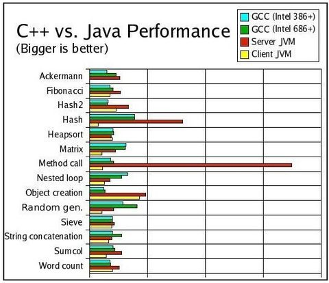
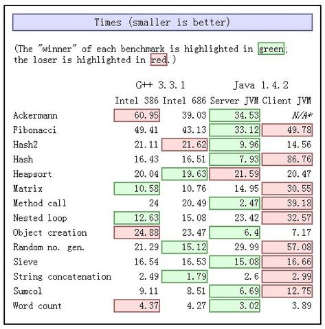
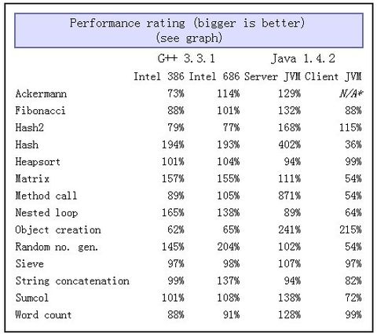
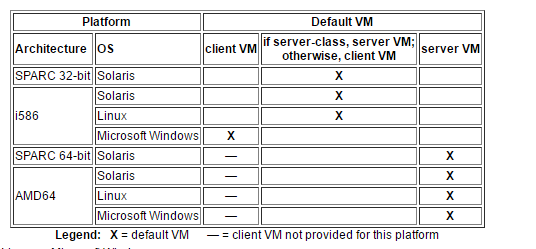
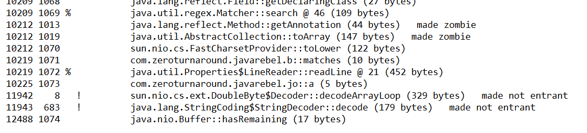
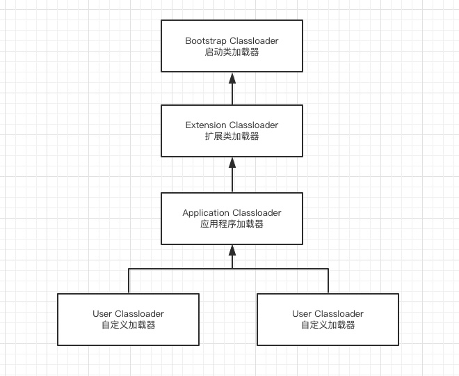
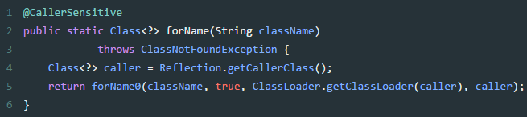
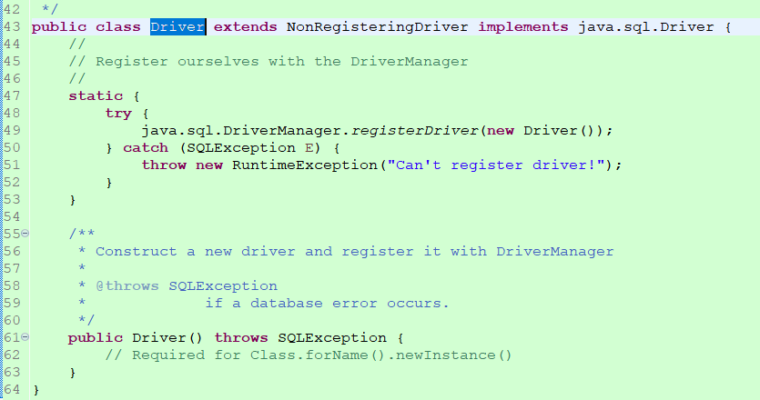

# 1.JVM基础

[JVM学习笔记【推荐】](https://www.kancloud.cn/luoyoub/jvm-note)

## 1.基础介绍

### 1.1. 什么是虚拟机

JVM是Java Virtual Machine（Java虚拟机）的缩写，JVM是一种用于计算设备的规范，它是一个虚构出来的计算机，是通过在实际的计算机上仿真模拟各种计算机功能来实现的。
Java语言的一个非常重要的特点就是与平台的无关性。而使用Java虚拟机是实现这一特点的关键。
一般的高级语言如果要在不同的平台上运行，至少需要编译成不同的目标代码。
而引入Java语言虚拟机后，Java语言在不同平台上运行时不需要重新编译。

Java语言使用Java虚拟机屏蔽了与具体平台相关的信息，使得Java语言编译程序只需生成在Java虚拟机上运行的目标代码（字节码），就可以在多种平台上不加修改地运行。
Java虚拟机在执行字节码时，把字节码解释成具体平台上的机器指令执行。这就是Java的能够“一次编译，到处运行”的原因。

### 1.2. Java的历史

- 1995.5 Oak -> Java1.0 Write once run anywhere
- 1996.1 jdk 1.0 jvm Sun Classic VM
- 1996.9首届javaOne大会
- 1997.2jdk1.1 内部类反射 jar文件格式，jdbc, Javabeans，rmi
- 1998 1.2 J2SE j2EE j2ME swing jit Hotspot VM
- 2000.5 jdk 1.3 Timer java2d
- 2002 2 jdk 1.4 Struts, Hibernate, Spring l.X
  - 正则表达式
  - Nio
  - 日志
  - XML解析
- 2004.9 jdk1.5 自动装箱拆箱，泛型.注解，枚举，变长参数，增强for循环 Spring2.x Spring4.x
- 2006 jdk1.6 java EE java Se javaMe jdk6
  - 提供脚本语言支持
  - 提供编译api以及http服务器api
- 2009 jdk 1.7 收购sun 74亿
- 2010年11月，由于Oracle公司对于Java社群的不友善，因此Apache扬言将退出JCP
- 2014年3月18日，Oracle公司发表Java SE 8
- 2017年9月21日，Oracle公司发表Java SE 9
- 2018年3月21日，Oracle公司发表Java SE 10
- 2018年9月25日，Java SE 11发布
- 之后开启一年发布2个大版本的节奏。

### 1.3. 常见JDK

通常说的JDK指的是Oracle jdk， JVM是Sun Hotspot。而常说的OpenJDK是Oracle jdk的开源版本。但是OracleJDK商用许可证的协议经常变卦；稳妥起见，还是使用OpenJDK的发行版进行项目开发比较好。

OpenJDK是Java SE规范的开源参考实现，但它只是源代码。二进制发行版由不同的供应商提供，这些发行版在许可证、商业支持、支持的平台和更新频率方面有所不同，甚至JVM、GC也是不同。

在当前的JDK发布模式下，计划每六个月，即3月和9月发布一次具有新主要版本号的新功能版本。此外，还有季度错误修复更新。每三年，9月的版本将是长期支持（LTS）版本，LTS至少会更新三年。

各厂商的发行版。

- OpenJDK：
  - 介绍：Oracle构建的开源发行版。每个版本最多提供6个月的更新，所以官网提供的版本不是最新的。如果用于生产的话，不推荐使用。
  - 官网：[http://openjdk.java.net/](http://openjdk.java.net/)
  - 源码：[https://github.com/openjdk/jdk](https://github.com/openjdk/jdk)

- Zulu：【重要】支持M1
  - 介绍：Azul 是 全球最大的 OpenJDK商业版提供商。100% 基于 Java 的 OpenJDK。推荐使用。商业版提供市场是最优秀的C4垃圾回收器。
  - 官网：[https://www.azul.com/zh-hans/](https://www.azul.com/zh-hans/)

- 毕昇：
  - 介绍：基于OpenJDK开发，是一个高性能、可用于生产环境的OpenJDK发行版，并在ARM架构上进行了性能优化。
  - 官网：[https://www.hikunpeng.com/developer/devkit/compiler/jdk](https://www.hikunpeng.com/developer/devkit/compiler/jdk)

- Amazon Corretto
  - 介绍：Java 开发工具包 (OpenJDK) 的免费、多平台、生产就绪型发行版。推荐使用。
  - 官网：[https://aws.amazon.com/cn/corretto/](https://aws.amazon.com/cn/corretto/)
    
- 阿里的dragonwell8源码
  - 介绍：生产就绪型Open JDK 发行版，提供长期支持，包括性能增强和安全修复。
  - 源码：[https://github.com/alibaba/dragonwell8](https://github.com/alibaba/dragonwell8)
  - [重塑云上的 Java 语言](https://developer.aliyun.com/article/738123)
- 腾讯的 KonaJdk
  - 介绍：OpenJDK的发行版，并且针对大数据，机器学习和云计算等场景进行了独特的优化，在高性能及安全性方面多有建树。
  - 源码：[https://github.com/Tencent/TencentKona-8](https://github.com/Tencent/TencentKona-8)
  - 使用指南：[https://cloud.tencent.com/document/product/1149/38537](https://cloud.tencent.com/document/product/1149/38537)

- GraalVM
  - 介绍：GraalVM由Oracle开发，它基于OpenJDK，但包括一个新的高性能编译器和一个新的多语言虚拟机（可以执行用不同编程语言编写的代码）

### 1.4.常见JVM

Java Virtual Machine不关心运行在其内部的程序到底是何种语言编写的，它只关心“字节码”文件。JVM是编程语言无关的，并不会单纯地与Java语言“绑定”，只要其他编程语言的编译结果满足并包含JVM的内部指令集，符号以及其他辅助信息，就能被JVM识别并装载运行。

- Sun Classic VM。jdk1.0，Sun公司于1996年发布的第一款商用JVM，纯解释执行，如果使用JIT编译器，就需要进行外挂 sun workstop JIT。
- Exact VM。jdk1.2提供。它具备了现代高性能虚拟机的雏形：热点探测、编译器与解释器混合工作模式。准确式内存管理，性能比 Classic VM 明显提高。
- HotSpot VM。jdk1.3时作为默认的虚拟机。Longview Technologies 公司设计，被 Sun 收购，沿用至今。特点就是是热点代码探测技术，实现即时编译。1.8时整合了JRockit的特性。
- JRockit VM。由BEA公司开发，它专注于服务器应用，不包含解释器，全部代码都靠即时编译器编译后执行。 被 Oracle 收购，特性被整合到HotSpot VM
- J9 VM。由IBM公司开发，它广泛用于IBM的各种Java产品。已经停止。
- Liquid VM，基于 JRockit 开发用，不需要操作系统，用于专属硬件平台。已经停止。
- Zing VM。从HoSpot VM fork出来的发行版。Azul提供了被称为无时延的垃圾回收器PGC和 C4，性能比HoSpot ZGC更强，支持 TB 级内存，低延迟速预热，可保证暂停时间持续稳定在 10 ms 内。后续被更名为zulujdk，作为商业收费。
- Apache Harmony。IBM和Intel联合开发的开源JVM，由于未JCP认证，最终于2011年退役。虽然Apache Harmony未被大规模商用，但它的Java类库代码被吸纳进了Andriod SDK。已经停止。
- taobaoVM（淘宝专用，对Hotspot进行了深度定制）
- Microsoft JVM，微软开发的 Windows 下的 Java 虚拟机，因被起诉已停止。

### 1.5.JVM语音

JVM可以运行字节码，一开始只是用来运行Java程序。但是Java再后期的发展中，Java的冗余、规范多等问题越发的突出，出现其他语音也是编译成class字节码可以运行在jvm中。这一类计算机语言也被称为jvm语言。
- sacla
- kotlin
- Groovy
- Jpython
- Jruby

### 1.6.常见java命令

```java
// 1.Hello.java
package com.demo;

import org.apache.commons.lang3.StringUtils;

import com.demo.util.Common;

public class Hello {
    public static void main(String[] args) {
        String str = "Hello!你好！";
        System.out.println(str);
        System.out.println(Common.isEmpty(str));
        System.out.println(StringUtils.isEmpty(str));
    }
}

// 2.Common.java
package com.demo.util;

public class Common {
    public static boolean isEmpty(Object obj) {
        return obj == null || (obj instanceof String && "".equals(obj.toString().trim()));
    }
}
```
1.编译命令
```shell
javac -cp ./commons-lang3-3.1.jar -d . -encoding UTF-8 ./com/demo/Hello.java ./com/demo/util/Common.java

- -cp。classpath的缩写，window上分号“;” 分隔，linux上是分号“:”分隔。不支持通配符，需要列出所有jar包，用一点“.”代表当前路径。
- -d 指定放置生成的类文件(.class)的位置。若此选项省略，默认在当前目录下生成.class文件，并且不会生成包文件夹；当前目录可以用“.”来表示，即：javac -d . Hello.java（在当前目录生成com/demo/Hello.class）。
- -encoding 指定源文件使用的字符编码。
```

2.执行命令
```shell
// 1. 执行类
java [-options] class [args...]
// 2. 执行 jar 文件          
java [-options] -jar jarfile [args...]


执行编译后的class
java -cp .:./commons-lang3-3.1.jar com.demo.Hello
```
```java
// 1.Hello.java
package com.demo;

import org.apache.commons.lang3.StringUtils;

import com.demo.util.Common;

public class Hello {
    public static void main(String[] args) {
        String str = "Hello!你好！";
        System.out.println(str);
        System.out.println(Common.isEmpty(str));
        System.out.println(StringUtils.isEmpty(str));
    }
}

// 2.Common.java
package com.demo.util;

public class Common {
    public static boolean isEmpty(Object obj) {
        return obj == null || (obj instanceof String && "".equals(obj.toString().trim()));
    }
}
```
1.编译命令
```shell
javac -cp ./commons-lang3-3.1.jar -d . -encoding UTF-8 ./com/demo/Hello.java ./com/demo/util/Common.java

- -cp。classpath的缩写，window上分号“;” 分隔，linux上是分号“:”分隔。不支持通配符，需要列出所有jar包，用一点“.”代表当前路径。
- -d 指定放置生成的类文件(.class)的位置。若此选项省略，默认在当前目录下生成.class文件，并且不会生成包文件夹；当前目录可以用“.”来表示，即：javac -d . Hello.java（在当前目录生成com/demo/Hello.class）。
- -encoding 指定源文件使用的字符编码。
```

2.执行命令
```shell
// 1. 执行类
java [-options] class [args...]
// 2. 执行 jar 文件          
java [-options] -jar jarfile [args...]


执行编译后的class
java -cp .:./commons-lang3-3.1.jar com.demo.Hello
```

## 2.编译器与解释器

- 编译器：将代码编译成机器可以执行的字节码。比如Java、golang等。
- 解释器：逐行执行，一遍执行一遍编译。比如JavaScript、python等。

当 JVM 执行代码时，并不立即编译代码。这主要有两个原因：
1. 绝大部分代码被执行的次数非常少，如果无脑编译所有代码就是浪费资源。所以jvm最开始的时候是只进行解释。这样整体的效率比编译快。 
2. 当执行某一方法或遍历循环的次数越多，编译器会判断代码是热代码，需要编译。

在主流商用JVM（HotSpot、J9）中，Java程序一开始是通过解释器（Interpreter）进行解释执行的。
当JVM发现某个方法或代码块运行特别频繁时，就会把这些代码认定为“热点代码（Hot Spot Code）”， 然后JVM会把这些代码编译成与本地平台相关的机器码。
完成这个任务的编译器称为：即时编译器（Just In Time Compiler，JIT）

JIT compile 技术，是将运行频率很高的字节码直接编译为目标机器指令（以 method 为翻译单位，还会保存起来，第二次执行就不用翻译了，直接执行）。
JIT编译器是“动态编译器”的一种，相对的“静态编译器”则是指的比如：C/C++的编译器

JIT并不是JVM的必须部分，JVM规范并没有规定JIT必须存在，更没有限定和指定JIT。但是，JIT性能的好坏、代码优化程度的高低却是衡量一款JVM是否优秀的最关键指标之一，也是虚拟机中最核心且最能体现虚拟机技术水平的部分。

### 2.1.解释器-Interpreter

[python解释型语言的说明](https://blog.csdn.net/puqiuzhe5231/article/details/80035316)

Interpreter解释执行class文件，好像JavaScript执行引擎一样

特殊的例子：
- 最早的Sun Classic VM只有Interpreter
- BEA JRockit VM则只有Compiler，但它主要面向服务端应用，部署在其上的应用不重点关注启动时间

### 2.2.编译器-Compiler

HotSpot虚拟机内置了两个即时编译器，分别称为Client Compiler和Server Compiler，习惯上将前者称为C1，后者称为C2

#### 2.2.1.修改编译器
启动命令中添加： -server 或者 -client

注意：
- 32位JDK能启动client和server
- 64位JDK只能启动server

#### 2.2.2.工作模式
JVM的工作模式：解释模式、编译模式、混合模式(默认)

代码的执行效率: 在正常的情况下，混合模式 &gt; 编译模式 &gt; 解释模式。jdk 7 / 8 都是默认的混合模式

HotSpot默认采用解释器和其中一个编译器直接配合的方式工作，使用那个编译器取决于虚拟机运行的模式，HotSpot会根据自身版本和宿主机器硬件性能自动选择模式，用户也可以使用“-client”或”-server”参数去指定

- -Xint代表解释模式(interpreted mode)，-Xint标记会强制JVM以解释方式执行所有的字节码，当然这会降低运行速度，通常低10倍或更多

- -Xcomp代表编译模式(compiled mode)，与它（-Xint）正好相反，JVM在第一次使用时会把所有的字节码编译成本地代码，
从而带来最大程度的优化。这听起来不错，因为这完全绕开了缓慢的解释器。然而，很多应用在使用-Xcomp也会有一些性能损失，
但是这比使用-Xint损失的少，原因是-Xcomp没有让JVM启用JIT编译器的全部功能。
因此在上图中，我们并没有看到-Xcomp比-Xmixed快多少

- -Xmixed代表混合模式(mixed mode)，前面也提到了，混合模式是JVM的默认工作模式。
它会同时使用编译模式和解释模式。对于字节码中多次被调用的部分，JVM会将其编译成本地代码以提高执行效率；
而被调用很少（甚至只有一次）的方法在解释模式下会继续执行，从而减少编译和优化成本。
JIT编译器在运行时创建方法使用文件，然后一步一步的优化每一个方法，有时候会主动的优化应用的行为。
这些优化技术，比如积极的分支预测（optimistic branch prediction），如果不先分析应用就不能有效的使用。
这样将频繁调用的部分提取出来，编译成本地代码，也就是在应用中构建某种热点（即HotSpot，这也是HotSpot JVM名字的由来）。
使用混合模式可以获得最好的执行效率。

对于解释执行，不经过jit直接由解释器解释执行所有字节码，执行效率不高。

而编译执行不加筛选的将全部代码进行编译机器码不论其执行频率是否有编译价值，在程序响应时间的限制下，
编译器没法采用编译耗时较高的优化技术（因为JIT的编译是首次运行或启动的时候进行的！），所以，在纯编译执行模式下的java程序执行效率跟C/C++也是具有较大差距的。

因此，新版本的jvm默认都是采用混合执行模式。

获取JVM的工作模式
```java
//获取JVM名字和类型
System.out.println(System.getProperty("java.vm.name"));

//获取JVM的工作模式
System.out.println(System.getProperty("java.vm.info"));
```

#### 2.2.3.JIT编译器
JIT（just in time）即时编译器是sun公司采用了hotspot虚拟机取代其开发的classic vm之后引入的一项技术，目的在于提高java程序的性能，
改变人们“java比C/C++慢很多”这一尴尬印象。

说起来是编译器，但此编译器与通常说的javac那个编译器不同，它其实是将字节码编译为硬件可执行的机器码的。（我们传统的代码会被编译为字节码，由虚拟机执行，而JIT编译的代码直接交给）


如上图可以看出，整个java应用程序的执行过程如下：

1. 源代码经javac编译成字节码，class文件
2. 程序字节码经过JIT环境变量进行判断，是否属于“热点代码”（JVM通过特定的算法，判定多次被调用的方法，或循环等）
3. 如是，走JIT编译为具体硬件处理器（如sparc、intel）机器码
4. 如否，则直接由解释器解释执行
5. 操作系统及类库调用
6. 硬件

以上实际上是JVM的“混合模式”对java程序的执行方式，实现代码的动态编译。

这里有个特别的例子，BEA公司为服务器硬件和服务端应用专门打造的高度优化的虚拟机————jrockit，
由于面向服务端应用，所以它并不在意和关注程序的启动速度，jrockit并不实现解释器，
而是将所有代码都交由jit做即时编译执行。

#### 2.2.4.C1与C2性能对比

下图是不同模式下的java与c++性能比较。



图中最显著的就是JVM client模式和Server模式关于method call的对比，那个差别不是一般的大，在后来的测试中发现，相差至少有10倍。
而在其他的测试中，在大多数情况下server VM的性能比c++稍强些。





JVM工作在Server模式可以大大提高性能，但应用的启动会比client模式慢大概10%。当该参数不指定时，虚拟机启动检测主机是否为服务器，如果是，则以Server模式启动，否则以client模式启动，J2SE5.0检测的根据是至少2个CPU和最低2GB内存。

当JVM用于启动GUI界面的交互应用时适合于使用client模式，当JVM用于运行服务器后台程序时建议用Server模式。

JVM在client模式默认-Xms是1M，-Xmx是64M；JVM在Server模式默认-Xms是128M，-Xmx是1024M。我们可以通过运行:java -version来查看jvm默认工作在什么模式。


这是官方提供的参考


#### 2.2.5工作模式的性能对比

以下是不同模式下，程序运行性能的对比。结论：混合模式&gt;编译模式&gt;解释模式
```java
import java.util.concurrent.CountDownLatch;
import java.util.concurrent.atomic.AtomicLong;

/**
 * @Title: JvmWordModel
 * @Description: java 三种工作模式（本程序只是单纯的想要模拟频繁调用方法的场景）
 * @author: xue.zhang
 * @date: 2018年6月17日下午5:15:24
 * @company: yooli
 * @Copyright: Copyright (c) 2017
 * @version v1.0
 * 计算机配置 英特尔 i7-5500U, 64位, win10, JVM为模式状态
 * 
 * 测试结果： 
 *  合模式：jvm参数是  -Xmixed，     程序运行时间：2514 us
 *  编译模式：jvm参数是  -Xcomp，    程序运行时间：3403 us
 *  解释模式：jvm参数是  -Xint，     程序运行时间：8561 us
 */
public class JvmWordModel {
	
	private static AtomicLong time = new AtomicLong(0);

	public static void main(String[] args) throws InterruptedException {
		int testNum = 1000;
		for (int i = 0; i < testNum; i++) {// 测试1000次
			Thread thread = new Thread(new Job());
			thread.start();
			thread.join();
		}
		System.out.println(time.get() / 1000 / testNum  + " us,avg");
	}

	public static class Job implements Runnable {
		@Override
		public void run() {
			int number = 8;
			int iterationNumber = 20000;
			CountDownLatch countDownLatch = new CountDownLatch(number);
			Obj[] objArray = new Obj[number];
			for (int i = 0; i < number; i++) {
				objArray[i] = new Obj();
			}

			long start = System.nanoTime();
			for (int i = 0; i < number; i++) {
				int ii = i;
				Thread thread = new Thread(new Runnable() {
					int iterationNumberInner = iterationNumber;

					@Override
					public void run() {
						while (iterationNumberInner-- > 0) {
							objArray[ii].aLong += 1L;
						}
						countDownLatch.countDown();
					}
				});
				thread.start();
			}
			try {
				countDownLatch.await();
			} catch (InterruptedException e) {
				e.printStackTrace();
			}
			
			long end = System.nanoTime();
			time.getAndAdd(end - start);
		}
	}
	private static final class Obj {
		private volatile long aLong = 8L;
	}
}
```

#### 2.2.6.编译器原理
Java编译原理：前端编译、即时编译（JIT编译）、静态提前编译（AOT编译）

- 前端编译器：      JDK的Javac、Eclipse JDT中的增量式编译器（ECJ）;
- 即时编译器(JIT)：HotSpot虚拟机的C1、C2编译器，Graal编译器
- 提前编译器(AOT)：JDK的Jaotc、GNU Compiler for the Java（GCJ）、ExcelsiorJET、AOT

> 1.前端编译：就是把Java源码文件（.java）编译成Class文件(.class)。比如使用javac编译源码、maven生成jar等，从而生成跨平台的可执行文件。

优点：
- 提高编译效率，提前发现不符合语法和编译规则的问题；
- 许多Java语法新特性（"语法糖"：泛型、内部类等等），是靠前端编译器实现的,而不是依赖虚拟机；
- 编译成的Class文件可以直接给JVM解释器解释执行，省去编译时间，加快启动速度；

缺点：
- 对代码运行效率几乎没有任何优化措施；
- 解释执行效率较低，所以需要结合JIT编译；
  
前端编译器：Oracle javac、Eclipse JDT中的增量式编译器（ECJ）等;

> 2.即时编译(JIT编译)。通过JVM内置的即时编译器（Just In Time Compiler，JIT编译器），在运行时把“热代码”的Class文件字节码编译成本地机器码的过程；
> 注意：非“热代码”使用的是解释器，执行效率低。

优点：
- 通过在运行时收集监控信息，把"热点代码"（Hot Spot Code）编译成与本地平台相关的机器码，并进行各种层次的优化；
- 可以极大的提高执行效率，性能超过C的执行效率；

缺点：
- 收集监控信息影响程序运行；
- 编译过程占用程序运行时间（如使得启动速度变慢），且应用的性能需要运行一段时间才能达到最大（需要运行过程动态进行jit编译）；
- 编译机器码占用内存较大；

JIT编译器：HotSpot虚拟机的C1、C2编译器等；

JIT编译速度及编译结果的优劣，是衡量一个JVM性能的很重要指标；

> 3.静态提前编译(AOT编译)。直接把Java源码文件（.java）编译成本地机器码的过程。
> 比如：很多云上的新应用不约而同地选择了 Go 语言，很大的原因是 Go 应用对运行环境没有依赖，静态编译的程序启动速度快，也不需要通过 JIT 来预热。

优点：
- 编译不占用运行时间，可以做一些较耗时的优化，并可加快程序启动；
- 把编译的本地机器码保存磁盘，不占用内存，并可多次使用；

缺点：
- 因为Java语言的动态性（如反射）带来了额外的复杂性，影响了静态编译代码的质量；
- 一般静态编译不如JIT编译的质量，这种方式用得比较少；

静态提前编译器（AOT编译器）：JAOTC、GCJ、Excelsior JET、ART (Android Runtime)、GraalVM Java、GNU Compiler for Java等；

[GraalVM Java 编译器将于 2023 年加入，与 OpenJDK 的发布节奏和流程保持一致](https://zhuanlan.zhihu.com/p/601347706)

PS:Java 静态编译技术是一种激进的 AOT 技术，通过单独的编译阶段将 Java 程序编译为本地代码，在运行时无需传统 Java 虚拟机和运行时环境，只需操作系统类库支持即可。
  静态编译技术实现了 Java 语言与原生 native 程序的“合体”，将原本的 Java 程序编译成为了一个自举的具有 Java 行为的原生 native 程序，由此兼有 Java 程序和原生 native 程序的优点。

Java 过去之所以没有全面编译，并非占用内存增加和启动时间变慢，GraalVM Native Image 也需要编程很长时间，消耗很大的内存。
主要问题，实际上，GraalVM 也无法解决，尤其是 JVM 字节码动态性，比如 CGLIB 动态生成或者 Java 反射的不确定性。
其实，对于大多数业务代码，GraalVM AoT 编译器基本上可以完成静态化，主要是在框架代码上，有些麻烦，比如 Spring Stack，所以 Spring Native 做了大量的辅助工作，也帮助 GraalVM 提升稳定性，然而部分代码还需要自行声明

> 4.目前Java体系中主要还是采用前端编译+JIT编译的方式，如JDK中的HotSpot虚拟机。

前端编译+JIT编译方式的运作过程大体如下：
1. 首先通过前端编译把符合Java语言规范的程序代码转化为满足JVM规范所要求Class格式；
2. 然后程序启动时Class格式文件发挥作用，解释执行，省去编译时间，加快启动速度；
3. 针对Class解释执行效率低的问题，在运行中收集性能监控信息，得知"热点代码"；
4. JIT逐渐发挥作用，把越来越多的热点代码"编译优化成本地代码，提高执行效率；

#### 2.2.7.JIT和AOT对比

- JIT：吞吐量高，有运行时性能加成，可以跑得更快，并可以做到动态生成代码等，但是相对启动速度较慢，并需要一定时间和调用频率才能触发 JIT 的分层机制
- AOT：内存占用低，启动速度快，可以无需 runtime 运行，直接将 runtime 静态链接至最终的程序中，但是无运行时性能加成，不能根据程序运行情况做进一步的优化

> Java 9 引入了 aot 编译方式，能够将 class 文件直接编译成可执行二进制文件。

目前 JDK AOT 的局限有：
- 仅支持 64 位 Linux 操作系统：；
- 操作系统需要预装 libelf 库，以确保能够生成 elf 文件：
- AOT 编译和执行环境需要相同：
- Java 9 最初发布时，只支持 java.base 模块可以编译成 AOT 库；
- 目前只支持 G1 和 Parallel GC 两种 GC 方式：前面没有提到，AOT 编译时的 JVM 参数和运行时需要相同，也包括 GC 方式，也就是说如果用了 AOT，JVM 实际运行时也只能使用这两种 GC 方式之一；
- 可能会无法编译通过动态生成 class 文件或者修改字节码的 java 代码（如 lambda 表达式、反射调用等）
- JVM 运行时参数设置必须和 AOT 库编译时相同；
- AOT 可能带来的好处，是 JVM 加载这些已经预编译成二进制库之后，可以直接调用，而无需再将其运行时编译成二进制码。理论上，AOT 的方式，可以减少 JIT 带来的预热时间，减少 Java 应用长期给人带来的“第一次运行慢”感觉。

### 2.3.分层编译

在JDK1.7（1.7仅包括Server模式）之后，HotSpot就不是默认“采用解释器和其中一个编译器”配合的方式了，而是采用了分层编译，分层编译时C1和C2有可能同时工作

<p style="color: red">为什么要分层编译？</p>

由于编译器compile本地代码需要占用程序时间，要编译出优化程度更高的代码所花费的时间可能更长，且此时解释器还要替编译器收集性能监控信息，
这对解释执行的速度也有影响。所以，为了在程序启动响应时间与运行效率之间达到最佳平衡，HotSpot在JDK1.6中出现了分层编译（Tiered Compilation）的概念。
并在JDK1.7的Server模式JVM中作为默认策略被开启。


<p style="color: red">编译层 tier（或者叫级别）</p>

分层编译根据编译器编译、优化的规模与耗时，划分了不同的编译层次（不只以下3种），包括：
- 第0层，程序解释执行（没有编译），解释器不开启性能监控功能，可触发第1层编译。
- 第1层，也称C1编译，将字节码编译为本地代码，进行简单、可靠的优化，如有必要将加入性能监控的逻辑
- 第2层（或2层以上），也称为C2编译，也是将字节码编译为本地代码，但是会启用一些编译耗时较长的优化，甚至会根据性能监控信息进行一些不可靠的激进优化

实施分层编译后，C1和C2将会同时工作，许多代码会被多次编译，用C1获取更高的编译速度，用C2来获取更好的编译质量，且在解释执行的时候解释器也无须再承担收集性能监控信息的任务

### 2.4.编译触发条件

<p style="color: red">编译的对象？</p>

1. 被多次调用的方法
    - 一个方法被多次调用，理应称为热点代码，这种编译也是虚拟机中标准的JIT编译方式
2. 被多次执行的循环体
    - 编译动作由循环体出发，但编译对象依然会以整个方法为对象；
    - 这种编译方式由于编译发生在方法执行过程中，因此形象的称为：栈上替换（On Stack Replacement- OSR编译，即方法栈帧还在栈上，方法就被替换了）

<p style="color: red">触发条件？也就是怎么知道的频繁的次数</p>

主流的 热点探测（Hot Spot Detection） 方式：
- 基于计数器的热点探测（Counter Based Hot Spot Detection）。虚拟机会为每个方法（或每个代码块）建立计数器，统计执行次数，如果超过阀值那么就是热点代码。缺点是维护计数器开销。
  - 方法计数器：默认阀值，在Client模式下是1500次，Server是10000次，可以通过参数“-XX:CompileThreshold”来设定
  - 回边计数器：只有执行到大括号”}”时才算+1。默认阀值，Client下13995，Server下10700
- 基于采样的热点探测（Sample Based Hot Spot Detection）。虚拟机会周期性检查各个线程的栈顶，如果某个方法经常出现在栈顶，那么就是热点代码。缺点是不精确。
- 基于踪迹的热点探测（Trace Based Hot Spot Detection）。Dalvik中的JIT编译器使用这种方式

### 2.5.编译过程
- Client Compiler。C1编译器是一个简单快速的三段式编译器，主要关注“局部性能优化”，放弃许多耗时较长的全局优化手段
  
  过程：class -> 1. 高级中间代码 -> 2. 低级中间代码 -> 3. 机器代码

- Server Compiler。C2是专门面向服务器应用的编译器，是一个充分优化过的高级编译器，几乎能达到GNU C++编译器使用-O2参数时的优化强度。

> 使用参数“-XX:+PrintCompilation”会让虚拟机在JIT时把方法名称打印出来，如图



## 5.类加载机制

### 5.1. 双亲委派模型



双亲委派模型中除了启动类加载器之外其余都需要有自己的父类加载器

（其实就是一个底层的加载器把一个class交给自己的上级，让上级去加载，上级再去找上次，如果上级不符合的话，加再交给下级去真正的加载）

当一个类收到了类加载请求时:
自己不会首先加载，而是委派给父加载器进行加载，每个层次的加载器都是这样。

所以最终每个加载请求都会经过启动类加载器。只有当父类加载返回不能加载时子加载器才会进行加载。

双亲委派的好处 : 由于每个类加载都会经过最顶层的启动类加载器，比如
java.lang.Object这样的类在各个类加载器下都是同一个类(只有当两个类是由同一个类加载器加载的才有意义，这两个类才相等。)

如果没有双亲委派模型，由各个类加载器自行加载的话。当用户自己编写了一个
java.lang.Object类，那样系统中就会出现多个 Object，这样 Java
程序中最基本的行为都无法保证，程序会变的非常混乱。


1. 启动类加载器  BootStaro ClassLoader:
   <JAVA_HOME>/lib 目录下的，并且是虚拟机识别的类库
2. 扩展类加载器  Extension ClassLoader：
   <JAVA_HOME>/lib/ext 目录下全部的，开发者可以直接使用
3. 应用程序加载器 Applocation ClassLoader：
   加载用户classpath上指定的类库，开发者可以直接使用一般情况这个是程序默认的类加载器


### 5.2.Class.forName与 ClassLoader

在 java 中 Class.forName() 和 ClassLoader 都可以对类进行加载

ClassLoader
就是遵循双亲委派模型最终调用启动类加载器的类加载器，实现的功能是“通过一个类的全限定名来获取描述此类的二进制字节流”，获取到二进制流后放到
JVM 中。Class.forName() 方法实际上也是调用的 CLassLoader 来实现的。

Class.forName(String className)；这个方法的源码是



最后调用的方法是 forName0 这个方法，在这个 forName0
方法中的第二个参数被默认设置为了
true，这个参数代表是否对加载的类进行初始化，设置为 true
时会类进行初始化，代表会执行类中的静态代码块，以及对静态变量的赋值等操作。

Class.forName 加载类是将类进了初始化，而 ClassLoader 的 loadClass
并没有对类进行初始化，只是把类加载到了虚拟机中，直到有对象调用或实例化了这个类才去初始化。

应用场景

在我们熟悉的 Spring 框架中的 IOC 的实现就是使用的 ClassLoader。

而在我们使用 JDBC 时通常是使用 Class.forName()
方法来加载数据库连接驱动。这是因为在 JDBC 规范中明确要求
Driver(数据库驱动)类必须向 DriverManager 注册自己。

以 MySQL 的驱动为例解释




我们看到 Driver 注册到 DriverManager 中的操作写在了静态代码块中，
这就是为什么在写 JDBC 时使用 Class.forName()的原因。
