# 2.JVM内存模型

## 1.内存划分

### 1.1.JVM运行时内存

《Java 8虚拟机规范》目录：*https://docs.oracle.com/javase/specs/jvms/se8/html/index.html*

《Java8虚拟机规范》运行时内存：*https://docs.oracle.com/javase/specs/jvms/se8/html/jvms-2.html#jvms-2.5*

JVM运行时内存布局，根据 《Java 8虚拟机规范》，从概念上将其分为6个区域。分别是：
- 程序计数器(Program Counter Register)
- 虚拟机栈(VM Stack)
- 本地方法栈(Native Method Stack)
- 方法区(Method Area)。Ps: jdk8是，将方法区移除，被元数据去代替。
- 堆(Heap)
- 运行时常量池（JDK6在方法区内部, JDK7被独立到堆中）

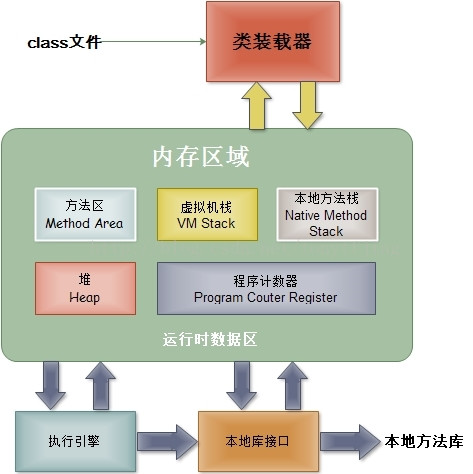

这6块区域按是否被线程共享，可以分为两大类

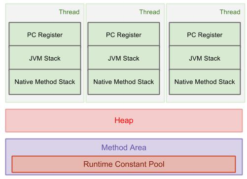


#### 1.1.1.线程独享的内存区域
生命周期与Thread相同，即：线程创建时，相应的区域分配内存，线程销毁时，释放相应内存。
- PC Rgesiter:
  程序计数器。记录每个线程当前执行的指令（当前执行的是某条指令，下一条要执行的是哪条）
- JVM stack:
  虚拟机栈，记录每一个栈帧(Frame)中的局部变量，方法返回地址等。当一个线程去调用某个方法的时候，都回去创建Frame,方法调用完成后Frame被销毁。就是我们平时说的栈
- Native Method stack:
  本地方法栈，就是某个线程在调用操作系统原生方法的时候，使用的内存区域。

#### 1.1.2.线程共享的内存区域
- Heap: 堆内存，涉及到GC，用于存放对象的实例。
- Method area： 方法区，主要存放类的结构、类的成员变量、static静态成员等。
- Runtime Constant Pool：运行时常量池，比如：字符串，int -128~127范围的值等，它是Method Area中的一部分。

Heap、Method Area 都是在虚拟机启动时创建，虚拟机退出时释放。

严格来讲，Method area和Runtime Constant Pool都应该算作是heap的一部分。所有我们还可以画出下面这样的图。

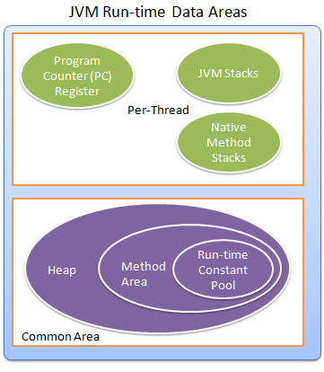


### 1.2.各区域的内存溢出

上述6个区域，除了PC Register区不会抛出异常外，其它5个区域，当请求分配的内存不足时，
均会抛出OutOfMemoryError（即：OOM）其中thread独立的VM Stack区及Native Method Stack区还会抛出StackOverflowError

- StackOverflowError 栈溢出

这种情况主要是因为单个线程请求栈深度大于虚拟机所允许的最大深度（如常用的递归调用层级过深等），
再比如单个线程定义了大量的本地变量，导致方法帧中本地变量表长度过大等也会导致 StackOverflowError 异常，

注意：本地变量在不发生内存逃逸的情况下，我们实例化的对象都会被分解为标量，可以参考《逃逸分析》

也就是说在一个线程中，当栈桢太大或虚拟机容量太小导致内存无法分配时，都会发生栈溢出异常，这个问题常常出现在递归中

- java.lang.OutOfMemoryError: unable to create new native thread

操作系统给每个进程分配的内存是有限制的，比如 32 位的 Windows 限制为 2G,虚拟机提供了参数来控制 Java
堆和方法的这两部内存的最大值，剩余的内存为 「2G - Xmx（最大堆容量）= 线程数 * 每个线程分配的虚拟机栈（-Xss)+本地方法栈」
（程序计数器消耗内存很少，可忽略）,每个线程都会被分配对应的虚拟机栈大小，所以总可创建的线程数肯定是固定的

像以上代码这样不断地创建线程当然会造成最终无法分配，不过这也给我们提供了一个新思路，如果是因为建立过多的线程导致的内存溢出，而我们又想多创建线程，可以通过减少最大堆（-Xms）和减少虚拟机栈大小（-Xss）来实现。

- Java.lang.OutOfMemoryError：java heap space

常见的堆内存溢出，一般是死循环，或者超大的对象，尤其是数组类型

- java.lang.OutOfMemoryError:GC overhead limit exceeded

Sun 官方对此的定义：超过98%的时间用来做 GC 并且回收了不到 2% 的堆内存时会抛出此异常

说白了就是jvm检测到堆的快耗尽，开始gc回收，多次回收之后发现回收没啥用，就报异常了

一般是内存过小或者存在死循环类的问题，建议可以扩大内存试试

- java.lang.OutOfMemoryError:Requested array size exceeds VM limit

该错误由 JVM 中的 native code 抛出。JVM 在为数组分配内存之前，会执行基于所在平台的检查：
分配的数据结构是否在此平台中是可寻址的，平台一般允许分配的数据大小在1 到 21亿之间，如果超过了这个数就会抛出这种异常。
简单来说就是创建的数组太多了

- java.lang.OutOfMemoryError:out of swap space

这个就是swap区域，当内存不够的时候，会在磁盘上创建临时区域用来保存数据。Java 应用启动的时候分被分配一定的内存空间
(通过 -Xmx 及其他参数来指定)。如果此时 swap 分区大小不足或者其他进程耗尽了本机的内存，则会发生 OOM, 可以通过增大
swap 空间大小来解决,但如果在交换空间进行 GC 造成的 「Stop The World」增加大个数量级，所以增大 swap
空间一定要慎重，所以一般是通过增大本机内存或优化程序减少内存占用来解决。

- Java.lang.OutOfMemeoryErrot:Permgen space

永久代溢出异常，在jdk1.8以前的版本中，永久代实现了方法区的功能，保存了类、常量、静态变量、JIT的代码。
如果错误地频繁地使用 String.intern()方法或运行期间生成了大量的代理类都有可能导致永久代溢出，解决方案如下

- 是否永久代设置的过小，如果可以，适应调大一点
- 检查代码是否有大量的反射操作
- dump 之后通过 mat 检查是否存在大量由于反射生成的代码类

- java.lang.OutOfMemoryError:Metadata space

元数据空间溢出，主要出现在jdk8之后的版本里，1.8新增了这个区域，并且将这个区域分配到了堆外，用于替代方法区，
所以当创建的类多的时候会出现这个线程（比如使用cglib动态生成类）

- java.lang.OutOfMemoryError: (Native method)

调用JNDI的程序生成的异常，无法分配外部的内存导致，一般是程序、配置问题导致

- Out of memory:Kill process or sacrifice child

在Linux内核的调度任务中，有一个「Out of memory killer」的调度器，它会在系统可用内存不足时被激活，
然后选择一个进程把它干掉，哪个进程会被干掉呢，简单地说会优先干掉占用内存大的应用型进程

解决这种 OOM 最直接简单的方法就是升级内存，或者调整 OOM Killer 的优先级，减少应用的不必要的内存使用等等

思考：JVM 堆内存溢出后，其他线程是否可继续工作？

发生OOM的线程一般情况下会死亡，也就是会被终结掉，该线程持有的对象占用的heap都会被gc了，释放内存。
因为发生OOM之前要进行gc，就算其他线程能够正常工作，也会因为频繁gc产生较大的影响。

### 1.3.堆外内存

不受JVM虚拟机管控的内存区，可以通过Unsafe和NIO包下的DirectByteBuffer来操作堆外内存。
如上图，虽然堆外内存不受JVM管控，但是堆内存中会持有对它的引用，以便进行GC。

例如java8 新增的元数据区也是使用的堆外内存。

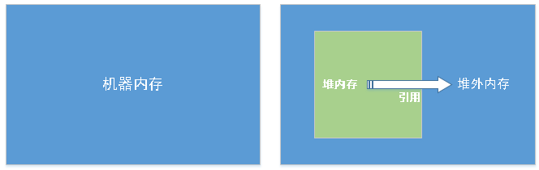


### 1.4.堆栈的设计

提一个问题：总体来看，JVM把内存划分为“栈(stack)”与“堆(heap)”两大类，为何要这样设计？

个人理解，程序运行时，内存中的信息大致分为两类，一是跟程序执行逻辑相关的指令数据，这类数据通常不大，而且生命周期短；一是跟对象实例相关的数据，这类数据可能会很大，而且可以被多个线程长时间内反复共用，比如字符串常量、缓存对象这类。

将这两类特点不同的数据分开管理，体现了软件设计上“模块隔离”的思想。好比我们通常会把后端service与前端website解耦类似，也更便于内存管理。


Heap是堆，主要存放的是对象，涉及到GC。

stack是栈，主要存放动态生成的变量引用。而在JVM中规定调用栈必须保存在线程栈上(调用栈就是pojo创建的对象，局部变量等等)

如图中，object3同时被两个线程调用，这个时候两个线程都保存的是这个对象的一个私有的对象副本。

### 1.5.JDK 1.8 的变化
方法区（Method Area）与Java堆一样，是各个线程共享的内存区域，它用于存储已被虚拟机加载的类信息、常量、静态变量、即时编译器编译后的代码等数据。
虽然Java虚拟机规范把方法区描述为堆的一个逻辑部分，但是它却有一个别名叫做Non-Heap（非堆）， 目的应该是与Java堆区分开来。
很多人都更愿意把方法区称为“永久代”（Permanent Generation）。
从jdk1.7已经开始准备“去永久代”的规划，jdk1.7的HotSpot中，已经把原本放在方法区中的静态变量、字符串常量池等移到堆内存中。

在jdk1.8中，永久代已经不存在，存储的类信息、编译后的代码数据等已经移动到了元空间（MetaSpace）中，
元空间并没有处于堆内存上，而是直接占用的本地内存（NativeMemory）。只能通过FullGc回收内存

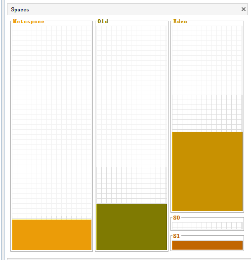

## 2.JVM运行时内存

### 2.1.程序计数器(Program Counter Register)

程序计数器（Program Counter Register），也有称作为PC寄存器。想必学过汇编语言的朋友对程序计数器这个概念并不陌生，
在汇编语言中，程序计数器是指CPU中的寄存器，它保存的是程序当前执行的指令的地址（也可以说保存下一条指令的所在存储单元的地址），
当CPU需要执行指令时，需要从程序计数器中得到当前需要执行的指令所在存储单元的地址，然后根据得到的地址获取到指令，
在得到指令之后，程序计数器便自动加1或者根据转移指针得到下一条指令的地址，如此循环，直至执行完所有的指令。

虽然JVM中的程序计数器并不像汇编语言中的程序计数器一样是物理概念上的CPU寄存器，
但是JVM中的程序计数器的功能跟汇编语言中的程序计数器的功能在逻辑上是等同的，也就是说是用来指示执行哪条指令的。

由于在JVM中，多线程是通过线程轮流切换来获得CPU执行时间的，因此在任一具体时刻，一个CPU的内核只会执行一条线程中的指令，
因此，为了能够使得每个线程都在线程切换后能够恢复在切换之前的程序执行位置，每个线程都需要有自己独立的程序计数器，
并且不能互相被干扰，否则就会影响到程序的正常执行次序。因此，可以这么说，程序计数器是每个线程所私有的。

在JVM规范中规定，如果线程执行的是非native方法，则程序计数器中保存的是当前需要执行的指令的地址；
如果线程执行的是native方法，则程序计数器中的值是undefined。

由于程序计数器中存储的数据所占空间的大小不会随程序的执行而发生改变，因此，对于程序计数器是不会发生内存溢出现象(OutOfMemory)的。

### 2.2.虚拟机栈(VM Stack)

Java栈也称作虚拟机栈（Vitual Machine Stack），也就是我们常常所说的栈，跟C语言的数据段中的栈类似。
事实上，Java栈是Java方法执行的内存模型。

虚拟机栈由一个一个的栈帧组成，栈帧是在每一个方法调用时产生的。

在栈帧中包括：
- 局部变量表(Local Variables)
- 操作数栈(Operand Stack)
- 指向当前方法所属的类的运行时常量池（运行时常量池的概念在方法区部分会谈到）的引用(Reference to runtime constant pool)、
- 方法返回地址(Return Address)和一些额外的附加信息

当一个线程被创建出来的时候，这个线程就有一个虚拟机栈，栈顶的栈帧就是当前正在执行的方法。

当线程执行一个方法时，就会随之创建一个对应的栈帧，并将建立的栈帧压栈（压入的栈指的是线程的栈，所以说虚拟机栈是线程独享的）。
当方法执行完毕之后，便会将栈帧出栈，并销毁。因此可知，线程当前执行的方法所对应的栈帧必定位于Java栈的顶部。
这就是为什么在使用递归方法的时候容易导致栈内存溢出的现象了以及为什么栈区的空间不用程序员去管理了
（当然在Java中，程序员基本不用关心内存分配和释放的事情，因为Java有自己的垃圾回收机制），
这部分空间的分配和释放都是由系统自动实施的。对于所有的程序设计语言来说，栈这部分空间对程序员来说是不透明的。

栈可能出现的问题
- 如果出现方法递归调用出现死循环的话就会造成栈帧过多，最终会抛出 StackOverflowError。
- 若线程执行过程中栈帧大小超出虚拟机栈限制，则会抛出 StackOverflowError。

- 若虚拟机栈允许动态扩展，但在尝试扩展时内存不足，或者在为一个新线程初始化新的虚拟机栈时申请不到足够的内存，则会抛出
  OutOfMemoryError。

下面的程序模拟栈溢出。
```java
@Slf4j
public class D4_stackOverFlowError {
	/**
	 * 递归调用方法，模拟执行方法的时候，只进栈不出栈，由于栈的大小是固定的，用不了多久就会出现StackOverflowError
	 */
	public void todo() {
		log.info("create object");
		todo();//
	}
	public static void main(String[] args) {
		new D4_stackOverFlowError().todo();
	}
}
```

下图表示了一个Java栈的模型：

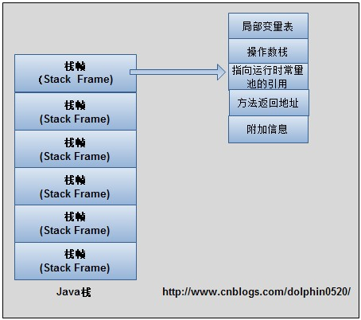


#### 2.2.1.局部变量表
局部变量表，顾名思义，就是用来存储方法中的局部变量（包括在方法中声明的非静态变量以及函数形参）。
对于基本数据类型的变量，则直接存储它的值，对于引用类型的变量，则存的是指向对象的引用。
局部变量表的大小在编译器就可以确定其大小了，因此在程序执行期间局部变量表的大小是不会改变的。

#### 2.2.2.操作数栈
栈最典型的一个应用就是用来对表达式求值。想想一个线程执行方法的过程中，实际上就是不断执行语句的过程，
而归根到底就是进行计算的过程。因此可以这么说，程序中的所有计算过程都是在借助于操作数栈来完成的。

#### 2.2.3.运行时常量池的引用
因为在方法执行的过程中有可能需要用到类中的常量，所以必须要有一个引用指向运行时常量。

#### 2.2.4.方法返回地址
当一个方法执行完毕之后，要返回之前调用它的地方，因此在栈帧中必须保存一个方法返回地址。
由于每个线程正在执行的方法可能不同，因此每个线程都会有一个自己的Java栈，互不干扰。

### 2.3.本地方法栈(Native Method Stack)
Java栈执行的是Java方法，而本地方法栈执行的是native的方法。

本地方法栈与Java栈的作用和原理非常相似。区别只不过是Java栈是为执行Java方法服务的，而本地方法栈则是为执行本地方法（Native Method）服务的。
在JVM规范中，并没有对本地方法栈的具体实现方法以及数据结构作强制规定，虚拟机可以自由实现它。在HotSopt虚拟机中直接就把本地方法栈和Java栈合二为一。

### 2.4.方法区(Method Area)
方法区在JVM中也是一个非常重要的区域，它与堆一样，是被线程共享的区域。

保存的数据如下：
- 类信息（类的名称、方法信息、字段信息）
- JIT即时编译器编译后的字节码
- 静态变量
- 常量

这块区域也被称为永久代，可利用参数 -XX:PermSize -XX:MaxPermSize 控制初始化方法区和最大方法区大小。

JDK7，Hotspot虚拟机便将运行时常量池从方法区移除了。

JDK8，Hotspot虚拟机将方法区移除，并使用了一个元数据区域进行代替（Metaspace），使用堆保存常量池。

#### 2.4.1.类信息
在Class文件中除了类的字段、方法、接口等描述信息。**这些类的字节码可能没有被jvm编译，只是经过加载到jvm中**

#### 2.4.2.字节码
用来存储编译期间生成的字面量和符号引用**特指，被JIT编译后的代码，可以将其理解为热代码，需要保存到方法区中，
而非编译的代码只有在使用的时候才会根据类信息，从本地磁盘加载字节码信息，通过解释器进行程序运行，等这部分代码执行的次数
变多之后，才会将其交给翻译器，并将翻译好的字节码保存到方法区**

在方法区中有一个非常重要的部分就是运行时常量池，它是每一个类或接口的常量池的运行时表示形式，在类和接口被加载到JVM后，
对应的运行时常量池就被创建出来。当然并非Class文件常量池中的内容才能进入运行时常量池，在运行期间也可将新的常量放入运行时常量池中，
比如String的intern方法。

在JVM规范中，没有强制要求方法区必须实现垃圾回收。很多人习惯将方法区称为”永久代”，是因为HotSpot虚拟机以永久代来实现方法区，
从而JVM的垃圾收集器可以像管理堆区一样管理这部分区域，从而不需要专门为这部分设计垃圾回收机制。
不过自从JDK7之后，Hotspot虚拟机便将运行时常量池从永久代移除了。

### 2.5.运行时常量池

JDK7，Hotspot虚拟机便将运行时常量池从方法区（永久代）转移到堆中。

JDK8，Hotspot虚拟机将方法区移除，并使用了一个元数据区域进行代替（Metaspace），常量池保持在堆中。

运行时常量池是方法区的一部分，其中存放了一些符号引用。当 new
一个对象时，会检查这个区域是否有这个符号的引用。
```java
public static void main(String[] args) {
  String s1 = "abc";//"abc" 保持在运行时常量池中
  String s2 = "abc";//"abc" 保持在运行时常量池中
  String s3 = new String("abc");//新对象
  System.out.println(s1 == s2);//true
  System.out.println(s1 == s3);//false
  System.out.println(s2 == s3);//false
  //true public native String intern()直接获得字符串对象的值在常量池中的值
  System.out.println(s2 == s3.intern());
}
```

#### 2.5.1.常量池里存储着字面量和符号引用

符号引用包括：1.类的全限定名，2.字段名和属性，3.方法名和属性。

字符串池里的内容是在类加载完成，经过验证，准备阶段之后在堆中生成字符串对象实例，然后将该字符串对象实例的引用值存到string pool中
注意：string pool中存的是引用值而不是具体的实例对象，具体的实例对象是在堆中开辟的一块空间存放的。

在HotSpot VM里实现的string pool功能的是一个StringTable类，它是一个哈希表，里面存的是驻留字符串的引用（而不是驻留字符串实例本身），
也就是说在堆中的某些字符串实例被这个StringTable引用之后就等同被赋予了”驻留字符串”的身份。
这个StringTable在每个HotSpot VM的实例只有一份，被所有的类共享。

1. 字符串池常量池在每个VM中只有一份，存放的是字符串常量的引用值，对象其实存放在堆中。
2. class常量池是在编译的时候每个class都有的，在编译阶段，存放的是常量的符号引用。
3. 运行时常量池是在类加载完成之后，将每个class常量池中的符号引用值转存到运行时常量池中，也就是说，每个class都有一个运行时常量池，
   类在解析之后，将符号引用替换成直接引用，与全局常量池中的引用值保持一致。

### 2.6.堆(Heap)

在C语言中，堆这部分空间是唯一一个程序员可以管理的内存区域。程序员可以通过malloc函数和free函数在堆上申请和释放空间。

Java中的堆是用来存储对象实例。只不过和C语言中的不同，在Java中，程序员基本不用去关心空间释放的问题，
Java的垃圾回收机制会自动进行处理。因此这部分空间也是Java垃圾收集器管理的主要区域。另外，堆是被所有线程共享的，
在JVM中只有一个堆，是整个虚拟机所管理的最大内存区域，所有的对象创建都是在这个区域进行内存分配。

可利用参数 -Xms -Xmx 进行堆内存控制。

这块区域也是垃圾回收器重点管理的区域，由于大多数垃圾回收器都采用分代回收算法，所有堆内存也分为新生代、老年代， 可以方便垃圾的准确回收。这块内存属于线程共享区域。

### 2.7.元数据区(JDK1.8)

在 JDK1.8 中已经移除了方法区（永久代），并使用了一个元数据区域进行代替（Metaspace）。

元空间的本质和永久代类似，都是对JVM规范中方法区的实现。不过元空间与永久代之间最大的区别在于：
元空间并不在虚拟机中，而是使用本地内存。因此，默认情况下，元空间的大小仅受本地内存限制，但可以通过以下参数来指定元空间的大小：

-XX:MetaspaceSize，初始空间大小，达到该值就会触发垃圾收集进行类型卸载，同时GC会对该值进行调整：如果释放了大量的空间，就适当降低该值；如果释放了很少的空间，那么在不超过MaxMetaspaceSize时，适当提高该值。

-XX:MaxMetaspaceSize，最大空间，默认是没有限制的。

除了上面两个指定大小的选项以外，还有两个与 GC 相关的属性：

-XX:MinMetaspaceFreeRatio，在GC之后，最小的Metaspace剩余空间容量的百分比，减少为分配空间所导致的垃圾收集

-XX:MaxMetaspaceFreeRatio，在GC之后，最大的Metaspace剩余空间容量的百分比，减少为释放空间所导致的垃圾收集

注意：默认情况下元数据区域会根据使用情况动态调整，避免了在 1.7 中由于加载类过多从而出现 java.lang.OutOfMemoryError:PermGen。
但也不能无线扩展，因此可以使用 -XX:MaxMetaspaceSize 来控制最大内存

如果你设置的元内存空间过小，你的应用程序可能得到以下错误： java.lang.OutOfMemoryError: Metadata space

在Java7之前，HotSpot虚拟机中将GC分代收集扩展到了方法区，使用永久代来实现了方法区。这个区域的内存回收目标主要是针对常量池的回收和对类型的卸载。
而在Java8中，已经彻底没有了永久代，将方法区直接放在一个与堆不相连的本地内存区域，这个区域被叫做元空间。

## 3.Java内存模型(JMM)

### 3.1.计算机的内存模型

CPU registers是cup的寄存器，对于CPU来说，是访问速度最快的。

为了使CPU访问内存的速度尽可能达到和寄存器一样，所以每一个CPU都有一个或多个内部的高速缓存，作为CPU与主存之间的过度。

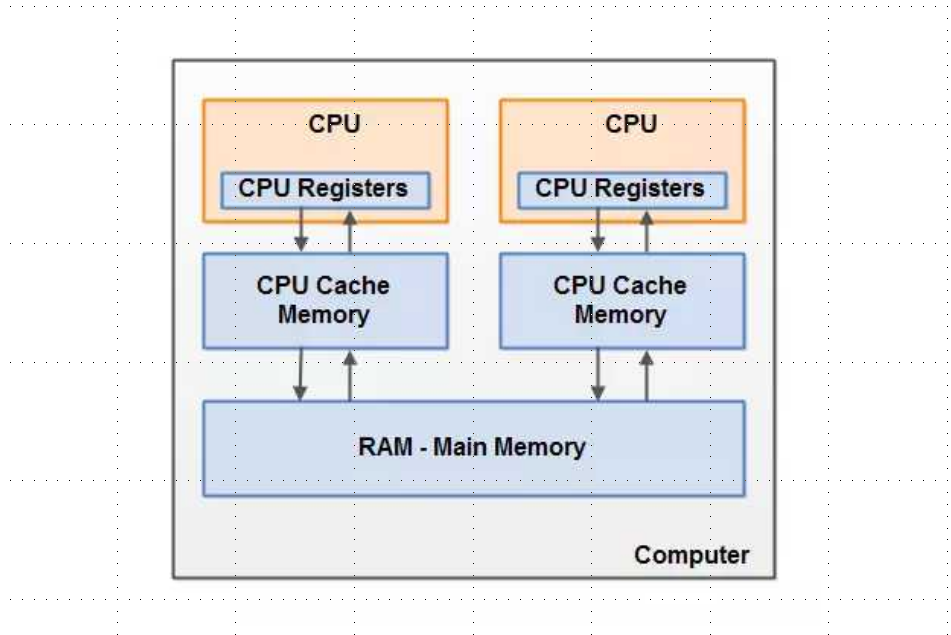
而Java的堆栈既可以存在在寄存器、多级缓存以及内存中。

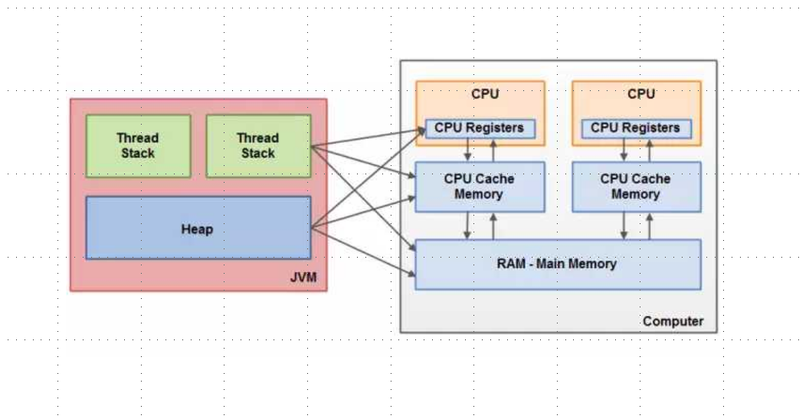

### 3.2.JMM抽象结构图

我们定义的共享变量保存在主内存中。

当其他线程访问这个共享变量的时候，JMM会将共享变量的副本交给线程，保存副本到线程自己的内存中，这个副本其实不是真实存在的（也就是不占用内存）。

本地内存是JMM的一个抽象概念，并不真实存在，你可以理解为“CPU高速缓冲”，在代码层面没有任何体现


### 3.3.同步操作与规则

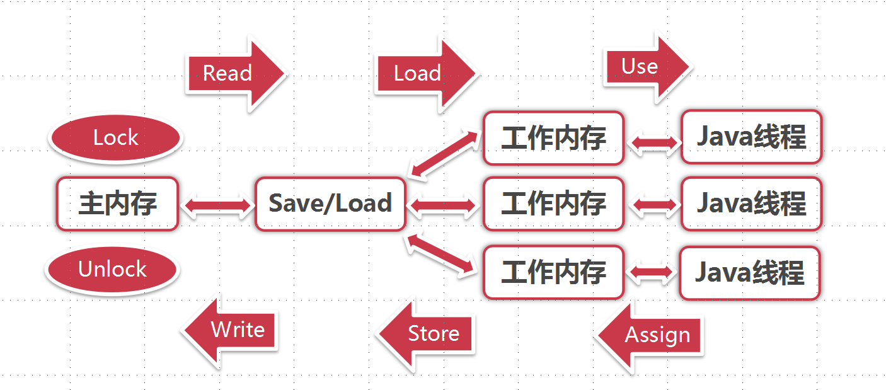

当多线程操作共享数据的时候，我们应该使用的同步操作如下

1. 多线程读取共享数据的时候，程序将主内存中的数据进行加锁操作(确保数据的一致性，保证数据安全)
2. 加锁后，JMM将共享数据的副本加载到线程的工作内存中，这时线程就可以操作共享数据了
3. 比如我们对共享数据进行了修改，被修改的数据保持到工作内存的副本中
4. 然后执行store保存操作将数据写到主内存的
5. 操作完成后，主内存的共享数据释放锁。

注意：
1. 主内存中的共享数据，只能被一个线程lock，不能被多个线程lock。
2. 当数据被lock后，可能被同一个线程多次lock，但是需要进行与lock次数相同的unlock才能释放锁

### 3.4.Java 程序执行过程


1. Java源代码文件(.java)会被Java编译器编译为字节码文件(.class)
2. JVM中的类加载器加载各个类的字节码文件，加载完毕之后，交由JVM执行引擎执行。
3. 在整个程序执行过程中，JVM会用一段空间来存储程序执行期间需要用到的数据和相关信息，这段空间一般被称作为Runtime Data Area（运行时数据区），也就是我们常说的JVM内存。
   
因此，在Java中我们常常说到的内存管理就是针对这段空间进行管理（如何分配和回收内存空间）

### 3.5.内存分配策略

#### 3.5.1.堆与非堆区域划分

JVM区域总体分两类，heap区和非heap区（其中堆占的比重最大）

- heap区划分为：
  - Eden Space（伊甸园）
  - Survivor Space(幸存者区)
  - Old Gen（老年代）

- 非heap区划分：
  - code cache（代码缓存区）
  - Perm Gen（永久代）；或者Matespace(元数据区)
  - Jvm Stack(java虚拟机栈)
  - NativeMethod Statck(本地方法栈)


Java 堆（Java Heap）是JVM所管理的内存中最大的一块，堆又是垃圾收集器管理的主要区域，这里我们主要分析一下 Java 堆的结构。

Java 堆主要分为2个区域-年轻代与老年代，其中年轻代又分 Eden 区和 Survivor 区，
其中 Survivor 区又分 From 和 To 2个区。

可能这时候大家会有疑问，为什么需要 Survivor区，为什么Survivor还要分2个区。不着急，我们从头到尾，看看对象到底是怎么来的，而它又是怎么没的。

##### 3.5.1.1.堆内存

下面我们对每一个内存区域做详细介绍。

Eden Space字面意思是伊甸园，对象被创建的时候首先放到这个区域，进行垃圾回收后，不能被回收的对象被放入到空的survivor区域。

Survivor Space幸存者区，用于保存在eden space中经过垃圾回收后没有被回收的对象。

Survivor有两个，分别为To Survivor、 From Survivor，这个两个区域的空间大小是一样的。
执行垃圾回收的时候Eden区域不能被回收的对象被放入到空的survivor（也就是To Survivor，同时Eden区域的内存会在垃圾回收的过程中全部释放），
另一个survivor（即From Survivor）里不能被回收的对象也会被放入这个survivor（即To Survivor），
然后To Survivor 和 From Survivor的标记会互换，始终保证一个survivor是空的。

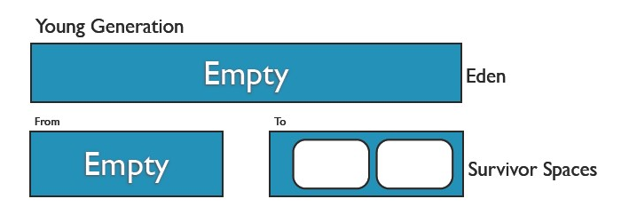


Eden Space和Survivor Space都属于新生代，新生代中执行的垃圾回收被称之为Minor GC，因为是对新生代进行垃圾回收，
所以又被称为Young GC，每一次Young GC后留下来的对象age加1。

比如设置阈值
-XX:MaxTenuringThreshold=15。直到达到阈值(默认为15)就移动到老年代中。

注：GC为Garbage Collection，垃圾回收。

Old Gen老年代，用于存放新生代中经过多次垃圾回收仍然存活的对象，也有可能是新生代分配不了内存的大对象会直接进入老年代。
经过多次垃圾回收都没有被回收的对象，这些对象的年代已经足够old了，就会放入到老年代。

当老年代被放满的之后，虚拟机会进行垃圾回收，称之为Major GC。由于Major GC除并发GC外均需对整个堆进行扫描和回收，因此又称为Full GC。

默认情况下

> 年轻代：老年代 = 1:2。 -XX:NewRatio=2
>
> Eden:s1:s2=8:1:1。当然也支持参数调整 -XX:SurvivorRatio=8

整个堆大小=年轻代大小 + 老年代大小。
堆内存默认为物理内存的1/64(<1GB)；默认空余堆内存小于40%时，JVM就会增大堆直到-Xmx的最大限制，可以通过MinHeapFreeRatio参数进行调整；
默认空余堆内存大于70%时，JVM会减少堆直到-Xms的最小限制，可以通过MaxHeapFreeRatio参数进行调整。

<p style="color: red">思考：eden与survivor的比例是为什么是8:1？</p>
ibm做过一份研究，新生代的对象98%熬不过第一轮收集。所以是这个比例。

##### 3.5.1.2.非堆内存

Code Cache代码缓存区，它主要用于存放JIT所编译的代码。CodeCache代码缓冲区的大小在client模式下默认最大是32m，在server模式下默认是48m。
它所对应的JVM参数为ReservedCodeCacheSize 和 InitialCodeCacheSize，可以通过如下的方式来为Java程序设置。

-XX:ReservedCodeCacheSize=128m

CodeCache缓存区是可能被充满的，当CodeCache满时，后台会收到CodeCache is full的警告信息，如下所示：

“CompilerThread0” java.lang.OutOfMemoryError: requested 2854248 bytes for Chunk::new. Out of swap space?

注：JIT编译器是在程序运行期间，将Java字节码编译成平台相关的二进制代码。正因为此编译行为发生在程序运行期间，所以该编译器被称为Just-In-Time编译器。

Perm Gen全称是Permanent Generation Space，是指内存的永久保存区域，因而称之为永久代。
这个内存区域用于存放Class和Meta的信息，Class在被 Load的时候被放入这个区域。
因为Perm里存储的东西永远不会被JVM垃圾回收的，所以如果你的应用程序LOAD很多CLASS的话，就很可能出现PermGen space错误。
默认大小为物理内存的1/64

#### 3.5.2.内存分配策略
- 优先分配到Eden区
  - 大对象直接分配到老年代
    
    -XX:PretenureSizeThreshold 设置对象大于临界值时，创建后被分配大老年代
    虚拟机提供了一个-XX:PretenureSizeThreshold参数，令大于这个设置值的对象直接在老年代分配。 
    这样做的目的是避免在Eden区及两个Survivor区之间发生大量的内存复制（复习一下：新生代采用复制算法收集内存）

    所谓的大对象是指，需要大量连续内存空间的Java对象，最典型的大对象就是那种很长的字符串以及数组（笔者列出的例子中的byte[]数组就是典型的大对象）。
    大对象对虚拟机的内存分配来说就是一个坏消息（替Java虚拟机抱怨一句，比遇到一个大对象更加坏的消息就是遇到一群“朝生夕灭”的“短命大对象”，
    写程序的时候应当避免），经常出现大对象容易导致内存还有不少空间时就提前触发垃圾收集以获取足够的连续空间来“安置”它们。

    PretenureSizeThreshold参数只对Serial和ParNew两款收集器有效，Parallel Scavenge收集器不认识这个参数，
    Parallel Scavenge收集器一般并不需要设置。如果遇到必须使用此参数的场合，可以考虑ParNew加CMS的收集器组合

- 长期存活的对象分配到老年代

  -XX:+MaxTenuringThreshold=n，设置在垃圾回收次数大于n的时候，对象会进入老年代

- 分配担保
  
  当survivor不足以容纳gc后的存活对象，就需要老年代分配担保，也就是会按年龄最大的对象开始直接晋升到老年代（也就是晋升失败）
  默认是开启的，可以使用参数禁用空间分配担保，但是可能出现异常：-XX:+HandlePromotionFailure

- 动态对象年龄判断，进入老年代

- 逃逸分析和栈上分配

  （看下面的“堆与栈的关系”）

  目前对象的创建之后还可能分配到栈内存中。可以极大的提高程序的运行效率。

  逃逸分析，分析对象的作用域，没有逃逸的对象会在栈中分配空间。

  注意：基础数据类型为标量，标量存储在运行时常量池，引用类型为聚合量，如果聚合量完全由标量组成，那这个聚合量创建出来的对象，没有发生逃逸，对象会被分配到栈内存中。
```java
public class D7_SatckAllocation {
	
	private D7_SatckAllocation obj;
	
	/**方法返回D7_SatckAllocation对象，发生逃逸 */
	public D7_SatckAllocation getInstance() {
		return this.obj == null ? new D7_SatckAllocation() : obj;
	} 
	
	/**为成员变量赋值，发生逃逸 */
	public void setObj() {
		this.obj = new D7_SatckAllocation();
	}

	/**对象的作用域仅在方法中，没有发生逃逸（对象被分配到栈内存中） */
	public void useObj() {
		D7_SatckAllocation obj = new D7_SatckAllocation();
	}

	/**引用成员变量的值，发生逃逸*/
	public void useObj2() {
		D7_SatckAllocation obj = getInstance();
	}
}
```

#### 3.5.3.堆与栈的关系

- java的内存分为堆内存和栈内存

栈内存是指程序进入一个方法时，会为这个方法单独分配一块私属存储空间，用于存储这个方法内部的局部变量，当这个方法结束时，分配给这个方法的栈会释放，这个栈中的变量也将随之释放。

堆是与栈作用不同的内存，一般用于存放不放在当前方法栈中的那些数据，例如，使用new创建的对象都放在堆里，所以，它不会随方法的结束而消失。方法中的局部变量使用final修饰后，放在堆中，而不是栈中。

- 从JVM认识堆栈

Stack(栈)是JVM的内存指令区。Stack管理很简单，push一定长度字节的数据或者指令，Stack指针压栈相应的字节位移；pop一定字节长度数据或者指令，Stack指针弹栈。并且每次操作的数据或者指令字节长度是已知的。所以Java
基本数据类型，Java 指令代码，常量都保存在Stack中。

Heap（堆）是JVM的内存数据区。Heap
的管理很复杂，每次分配不定长的内存空间，专门用来保存对象的实例。

- JVM空间分配

heap是堆：1、手动申请和释放空间2、大自由区

stack是栈：1、自动分配和释放2、空间有限

例：在Java中，若只是声明一个对象，则先在栈内存中为其分配地址空间，若再new一下，实例化它，则在堆内存中为其分配地址。

Object a=null;只在栈中分配内存。

new Object();在堆中分配空间。

Object b =new Object()；在栈中分配空间，指向堆中的地址。

- 内存中堆栈的关系

Heap是 Stack的一个子集。

Stack存取速度仅次于寄存器，存储效率比heap高，可共享存储数据，但是其中数据的大小和生存期必须在运行前确定。

Heap是运行时可动态分配的数据区，从速度看比Stack慢，Heap里面的数据不共享，大小和生存期都可以在运行时再确定。

new关键字是运行时在Heap里面创建对象,每new一次都一定会创建新对象，因为堆数据不共享。

- 回收上区别

Stack的内存管理是顺序分配的，而且定长，不存在内存回收问题

Heap 则是随机分配内存，不定长度，存在内存分配和回收的问题

在JVM中另有一个GC进程，定期扫描Heap，它根据Stack中保存的4字节对象地址扫描Heap ，定位Heap 中这些对象，进行一些优化（例如合并空闲内存块什么的），
并且假设Heap 中没有扫描到的区域都是空闲的，统统refresh（实际上是把Stack中丢失了对象地址的无用对象清除了），这就是垃圾收集的

#### 3.5.4.程序模拟
模拟Eden区被占有
```java
public static void main(String[] args) {
  // -verbose:gc -XX:+PrintGCDetails -XX:+UseSerialGC -Xms20m -Xmx20m -Xmn10m
  // 1.创建普通对象，对象保存在Eden区
  byte[] b1 = new byte[1024 * 1024];
  System.gc();
}
```

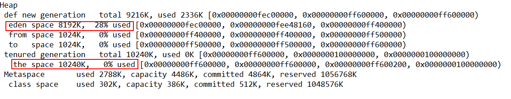


模拟大对象被分配到老年代

```java
public static void main(String[] args) {
  // -verbose:gc -XX:+PrintGCDetails -XX:+UseSerialGC -Xms20m -Xmx20m -Xmn10m
  // 2.创建大对象，对象保存在老年代
  byte[] b2 = new byte[1024 * 1024 * 9];
  System.gc();
}
```
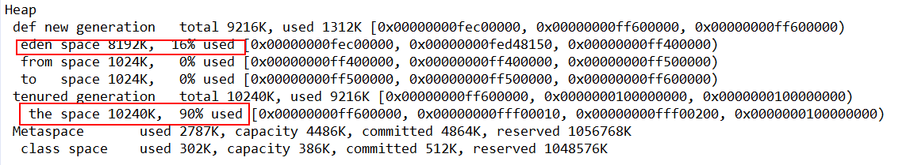

#### 3.5.5.TLAB

TLAB(Thread Local Allocation Buffer-线程本地分配缓冲区)。在JVM中每个线程都有一个TLAB，用于在堆内存中分配对象。

作用:
1. 提高对象分配的性能：TLAB是内存独享，所以不同线程之间不会互相竞争同一个内存区域的锁，从而减少了锁的争用和等待时间。
2. 由于TLAB是连续的内存区域，所以在分配内存时也可以减少碎片化的问题。

线程中分配内存的过程：当一个线程需要分配对象时，JVM首先会尝试在该线程的TLAB中分配内存，如果TLAB中的空间不足，则会在堆内存中分配内存。

需要注意的是，TLAB的大小是可以调整的，过小会导致频繁地回到堆内存中分配内存，过大则可能会导致浪费内存。因此，在实际应用中需要根据具体情况进行调整。
- -XX:+UseTLAB：表示是否使用TLAB。默认开启
- -XX:TLABSize：用于设置TLAB的大小。默认大小为Eden 1%
- -XX:TLABRefillWasteFraction：设置进入TLAB空间单个对象大小的比例值
- -XX:+PrintTLAB： 查看TLAB信息

TLAB 与 栈内存的区别：
1. 栈内存是线程自己的内存，用于存储局部变量、方法调用信息等，也可以用于对象的栈上分配，数据位于虚拟机栈中，JVM不用处理GC
2. TLAB是JVM为线程分配的堆内存区域，需要JVM处理GC。


## 4.逃逸分析

参考资料：

*https://docs.oracle.com/javase/8/docs/technotes/guides/vm/performance-enhancements-7.html#escapeAnalysis*

*https://blog.csdn.net/rickiyeat/article/details/76802085*

*https://blog.csdn.net/baichoufei90/article/details/85180478*

### 4.1.什么是逃逸分析

逃逸分析（Escape Analysis）简单来讲就是，Java Hotspot 虚拟机可以分析新创建对象的使用范围，并决定是否在 Java 堆上分配内存的一项技术。

逃逸分析的 JVM 参数如下：
- 开启逃逸分析：-XX:+DoEscapeAnalysis
- 关闭逃逸分析：-XX:-DoEscapeAnalysis
- 显示分析结果：-XX:+PrintEscapeAnalysis

逃逸分析技术在 Java SE 6u23+开始支持，并默认设置为启用状态，可以不用额外加这个参数。

### 4.2.逃逸分析算法

Java Hotspot 编译器实现下面论文中描述的逃逸算法：
```text
[Choi99] Jong-Deok Choi, Manish Gupta, Mauricio Seffano,
Vugranam C. Sreedhar, Sam Midkiff,
"Escape Analysis for Java", Procedings of ACM SIGPLAN
OOPSLA Conference, November 1, 1999
```
根据 Jong-Deok Choi, Manish Gupta, Mauricio Seffano,Vugranam C.Sreedhar, Sam Midkiff 等大牛在论文《Escape Analysis for Java》中描述的算法进行逃逸分析的。

该算法引入了连通图，用连通图来构建对象和对象引用之间的可达性关系，并在此基础上，提出一种组合数据流分析法。

由于算法是上下文相关和流敏感的，并且模拟了对象任意层次的嵌套关系，所以分析精度较高，只是运行时间和内存消耗相对较大。

### 4.3.对象逃逸状态

我们了解了 Java 中的逃逸分析技术，再来了解下一个对象的逃逸状态。

#### 4.3.1.全局逃逸（GlobalEscape）

即一个对象的作用范围逃出了当前方法或者当前线程，有以下几种场景：
- 对象是一个静态变量
- 对象是一个已经发生逃逸的对象
- 对象作为当前方法的返回值

#### 4.3.2.参数逃逸（ArgEscape）

即一个对象被作为方法参数传递或者被参数引用，但在调用过程中不会发生全局逃逸，这个状态是通过被调方法的字节码确定的。

#### 4.3.3.没有逃逸

即方法中的对象没有发生逃逸。

### 4.4.逃逸分析优化

针对上面第三点，当一个对象没有逃逸时，可以得到以下几个虚拟机的优化。

#### 4.4.1.锁消除

我们知道线程同步锁是非常牺牲性能的，当编译器确定当前对象只有当前线程使用，那么就会移除该对象的同步锁。

例如，StringBuffer 和 Vector 都是用 synchronized 修饰线程安全的，但大部分情况下，它们都只是在当前线程中用到，这样编译器就会优化移除掉这些锁操作。

锁消除的 JVM 参数如下：
- 开启锁消除：-XX:+EliminateLocks
- 关闭锁消除：-XX:-EliminateLocks

锁消除在 JDK8 中都是默认开启的，并且锁消除都要建立在逃逸分析的基础上。

#### 4.4.2.标量替换

java中所有数据的类型可以分为两种
1. 标量：基础类型(int,long,double,float,byte,char,short,boolean)和对象的引用(reference)，他们的特点是不能被进一步分解。
2. 聚合量: 能被进一步分解的量就是聚合量，例如对象。

标量替换:聚合量都是可以被进一步分解成标量，将其成员变量分解为分散的变量，这就叫做标量替换。

标量替换是JIT编译器的一种优化技术，它允许编译器在栈上直接存储对象的字段值，而不是在堆上分配整个对象。这种优化可以减少内存占用和GC压力，从而提高程序的性能。
标量替换同样在 JDK8 中都是默认开启的，并且都要建立在逃逸分析的基础上。

标量替换的 JVM 参数如下：
- 开启标量替换：-XX:+EliminateAllocations
- 关闭标量替换：-XX:-EliminateAllocations
- 显示标量替换详情：-XX:+PrintEliminateAllocations

#### 4.4.3.栈上分配

当对象没有发生逃逸时，该对象就可以通过标量替换分解成成员标量分配在栈内存中，和方法的生命周期一致，随着栈帧出栈时销毁，减少了GC 压力，提高了应用程序性能。

### 4.5.总结

逃逸分析讲完了，总结了不少时间，我们也应该大概知道逃逸分析是为了优化 JVM内存和提升程序性能的。

我们知道这点后，在平时开发过程中就要可尽可能的控制变量的作用范围了，变量范围越小越好，让虚拟机尽可能有优化的空间。

简单举一个例子吧，如：

return sb;

可以改为：

return sb.toString();

这是一种优化案例，把 StringBuilder
变量控制在了当前方法之内，没有逃出当前方法作用域。

## 5.堆外内存的使用

### 5.1.介绍

堆外内存不是JVM运行时数据区的一部分，也不是JVM规范中定义的内存区域, 这部分内存区域直接被操作系统管理.

1. JDK 1.4以前, 堆外内存访问没有光明正大的做法: 只能通过反射拿到Unsafe类，然后调用allocateMemory()/freeMemory()来申请/释放这块内存。
2. JDK 1.4开始新加入了NIO, 它引入了一种基于Channel与Buffer的I/O方式，可以使用Native函数库直接分配堆外内存，
    然后通过DirectByteBuffer对象作为这块内存的引用进行操作(DirectByteBuffer也是通过Unsafe的allocateMemory/freeMemory操作内存的)。

DirectByteBuffer 操作堆外内存的方法如下：

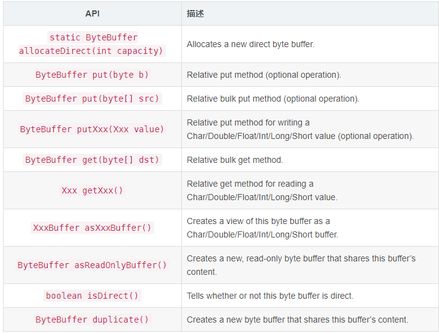

### 5.2.使用场景

其实很多框架，尤其是中间件都喜欢使用堆外内存
1. 缓存:OHC、Ehcache、MapDB、Chronicle Map
2. 中间件: Kafka，Elasticsearch，rocketmq，其中使用的MMAP、PageCache等技术，就是堆外内存的一种使用方式。
3. 大数据: Hadoop、spark。

<p style="color: red">问题：依赖os cache的系统JVM内存越大越好？</p>

kafka、elasticsearch等系统，依赖os cache来缓冲大量数据的。例如32G的服务器，JVM分配20G，os cache剩下的内存可能就不到10G。
os cache不足，就可能使用sweep(使用磁盘作为内存)，导致服务的性能急剧下降。

所以说，针对类似Kafka、Elasticsearch这里类型的服务，应该要给JVM分配6GB或者再多一点的内存即可。
因为他们可能不需要耗费过大的内存空间，不依赖JVM内存管理数据，当然具体是设置多少，需要你精准的压测和优化。
