# 3.JVM对象模型

## 1.Java对象模型

### 1.1.创建对象

在java程序中创建对象，只需要这样的操作： User user = new User();

而JVM的流程是，这是JVM指令的流程，但是CPU默认采用乱序执行，创建内存和创建引用的的顺序是无序的。如果对象使用volatile修饰，volatile禁止指令重排，一定程序的保证了对象的线程安全（不是真正的线程安全）


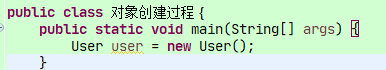


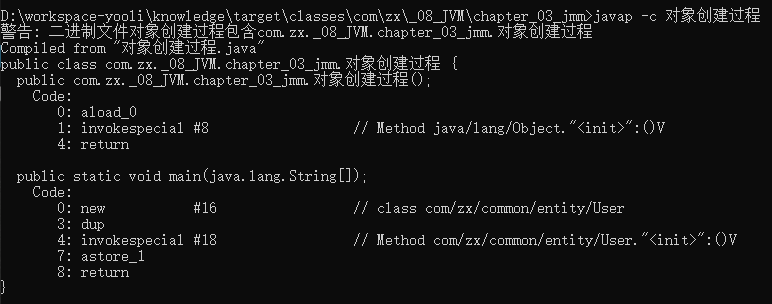


我们创建对象的时候，虽然我们只有一步，但是jvm翻译成汇编码之后，变成了五条

```text
new     申请对象内存, 对象内部字段为初始值，比如int =0,String = null等等
dup     为对象分配引用
invokespecial   调用构造方法初始化参数
astore_1    引用建立关联关系
return      完成过程
```

### 1.2.对象的结构

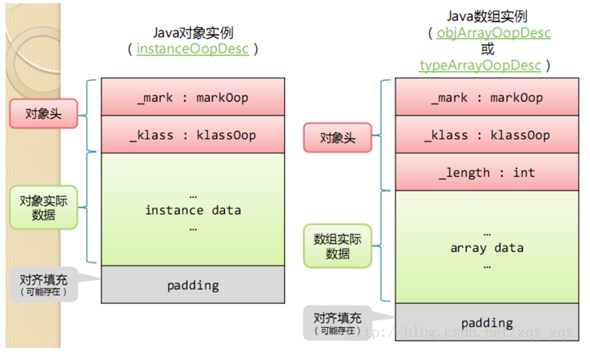


引入openjdk的Java对象内存布局分析工具jol

```xml
<dependency>
	<groupId>org.openjdk.jol</groupId>
	<artifactId>jol-core</artifactId>
	<version>0.9</version>
</dependency>
```

#### 1.2.1.对象头（Header）

> HotSpot虚拟机的对象头包括两部分信息：

-   markword

> 第一部分markword,用于存储对象自身的运行时数据，如哈希码（HashCode）、GC分代年龄、锁状态标志、线程持有的锁、偏向线程ID、偏向时间戳等，这部分数据的长度在32位和64位的虚拟机（未开启压缩指针）中分别为32bit和64bit，官方称它为“MarkWord”。

-   Class pointer

> 对象头的另外一部分是class类型指针，即对象指向它的类元数据的指针，虚拟机通过这个指针来确定这个对象是哪个类的实例.
>
> 数组长度（只有数组对象有）
>
> 如果对象是一个数组, 那在对象头中还必须有一块数据用于记录数组长度。
>

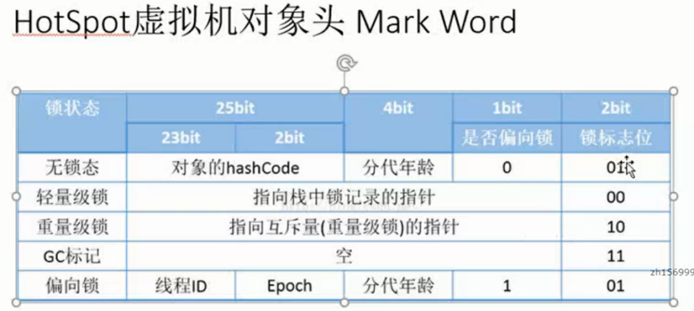

#### 1.2.2.实例数据（Instance Data）

实例数据部分是对象真正存储的有效信息，也是在程序代码中所定义的各种类型的字段内容。无论是从父类继承下来的，还是在子类中定义的，都需要记录起来。

#### 1.2.3.对齐填充（Padding）

第三部分对齐填充并不是必然存在的，也没有特别的含义，它仅仅起着占位符的作用。
由于HotSpot VM的自动内存管理系统要求对象起始地址必须是8字节的整数倍，换句话说，就是对象的大小必须是8字节的整数倍。
而对象头部分正好是8字节的倍数（1倍或者2倍），因此，当对象实例数据部分没有对齐时，就需要通过对齐填充来补全。

### 1.3.对象大小计算

new Object()到底占用几个字节：*https://mp.weixin.qq.com/s/NfAM8WMfemrozn38QC7STA*

JAVA对象在堆中占用内存，这部分内存由三个部分组成：
- Object header
- Class pointer
- Fields 

每个普通Java对象在堆(heap)中都有一个头信息(object header)，头信息是必不可少的，记录着对象的状态。

位数占用 
- Hash(25) + age(4) + lock(3) = 32bit
- unused(26) + Hash(31) + age(4) + lock(3) = 64bit

要点

1. 在32位系统下，存放Class指针的空间大小是4字节，MarkWord是4字节，对象头为8字节。
2. 在64位系统下，存放Class指针的空间大小是8字节()如果开启指针压缩(-XX:+UseCompressedOops)或者JVM堆的最大值小于32G，这个指针也是4byte，否则是8byte，MarkWord是8字节，对象头为16字节。
3. 64位开启指针压缩的情况下，存放Class指针的空间大小是4字节，MarkWord是8字节，对象头为12字节。
数组长度4字节+数组对象头8字节(对象引用4字节（未开启指针压缩的64位为8字节）+数组markword为4字节（64位未开启指针压缩的为8字节）)+对齐4=16字节。
4. 静态属性不算在对象大小内。

扩展：
在计算机中，64位系统，一个指针是64位=8字节。但是我们jvm默认开启压缩指针，指针缩小为4字节

-- 下面是查询默认开始压缩指针的命令
```shell
java -XX:+PrintCommandLineFlags -version
-XX:InitialHeapSize=132096704
-XX:MaxHeapSize=2113547264
-XX:+PrintCommandLineFlags
-XX:+UseCompressedClassPointers ## 默认开启压缩指针
-XX:+UseCompressedOops
-XX:-UseLargePagesIndividualAllocation
-XX:+UseParallelGC
java version "1.8.0_111"
Java(TM) SE Runtime Environment (build 1.8.0_111-b14)
Java HotSpot(TM) 64-Bit Server VM (build 25.111-b14, mixed mode)
```

-   代码演示
```java
public static void main(String[] args) {
    Object obj = new Object();
    String printable = ClassLayout.parseInstance(obj).toPrintable();
    System.out.println(printable);
    
    User user = new User(1, "tom", new Date());
    printable = ClassLayout.parseInstance(user).toPrintable();
    System.out.println(printable);
}
```

执行后的输出如下：

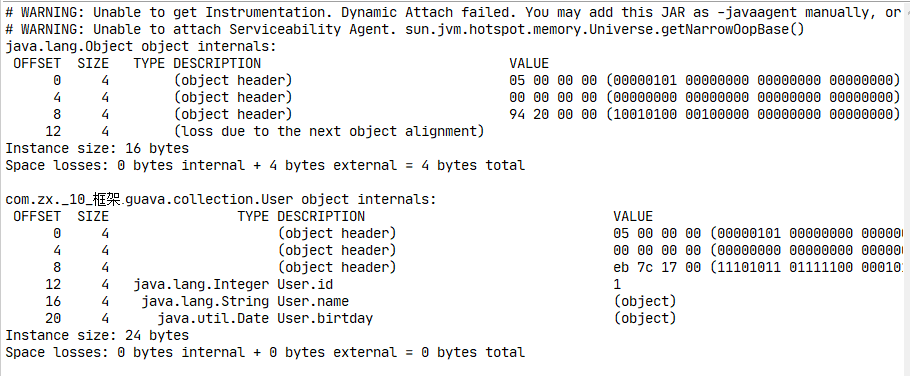

所有： 一个object 内存大小：

Object header = markWord + class pointer = 8 byte + 4 byte = 12 byte
（上图前两个是markWord）

因为object是空的，没有字段，所有，instance data是0，
所有需要用4byte进行对齐，达到16个字段

User对象， object header = 12byte, 有三个字段引用，4 * 3 = 12byte，
所有user对象是24byte。

User对象还有三个依赖的对象

重点是：jvm开启压缩指针；内存各个布局；

### 1.4.HotSpot对象模型

HotSpot中采用了OOP-Klass模型，它是描述Java对象实例的模型，它分为两部分：

- 类被加载到内存时，就被封装成了klass，klass包含类的元数据信息，像类的方法、常量池这些信息都是存在klass里的，
  你可以认为它是java里面的java.lang.Class对象，记录了类的全部信息；

- OOP（Ordinary Object Pointer）指的是普通对象指针，它包含MarkWord 和元数据指针，
  MarkWord用来存储当前指针指向的对象运行时的一些状态数据；元数据指针则指向klass,
  用来告诉你当前指针指向的对象是什么类型，也就是使用哪个类来创建出来的；

那么为何要设计这样一个一分为二的对象模型呢？

这是因为HotSopt JVM的设计者不想让每个对象中都含有一个vtable（虚函数表），
所以就把对象模型拆成klass和oop，其中oop中不含有任何虚函数，而klass就含有虚函数表，可以进行method dispatch。

HotSpot中，OOP-Klass实现的代码都在/hotspot/src/share/vm/oops/路径下，
oop的实现为instanceOop 和 arrayOop，他们来描述对象头，其中arrayOop对象用于描述数组类型。

以下就是oop.hhp文件中oopDesc的源码，可以看到两个变量_mark就是MarkWord，_metadata就是元数据指针，
指向klass对象，这个指针压缩的是32位，未压缩的是64位；

```hhp
volatile markOop _mark; //标识运行时数据

union _metadata {
  Klass* _klass;
  narrowKlass _compressed_klass;
}

_metadata; //klass指针
```

一个Java对象在内存中的布局可以连续分成两部分：instanceOop（继承自oop.hpp）和实例数据；

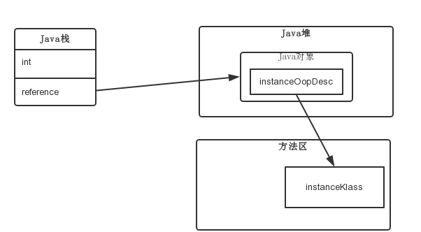


上图可以看到，通过栈帧中的对象引用reference找到Java堆中的对象，再通过对象的instanceOop中的元数据指针klass来找到方法区中的instanceKlass，从而确定该对象的类型。

下面来分析一下，执行new A()的时候，JVM 做了什么工作。首先，如果这个类没有被加载过，JVM就会进行类的加载，
并在JVM内部创建一个instanceKlass对象表示这个类的运行时元数据（相当于Java层的Class对象）。
初始化对象的时候（执行invokespecial A::），JVM就会创建一个instanceOopDesc对象表示这个对象的实例，
然后进行MarkWord的填充，将元数据指针指向Klass对象，并填充实例变量。

元数据——instanceclass 对象会存在元空间（方法区），
而对象实例——instanceOopDesc 在堆中。Java虚拟机栈中会存有这个对象实例的引用。

### 1.5.对象内存分配规则

<p style="color:red;">问题：堆内存是线程共享的吗？</p>

[https://juejin.im/post/5e66f59f6fb9a07cde64e6da](https://juejin.im/post/5e66f59f6fb9a07cde64e6da)

简单的描述： 栈-->线程本地-->Eden-->old->GC

这里涉及到一个重要的概念，逃逸分析。如果方法中创建的局部变量没有发生逃逸，对象大小合适，
且对象内存所有的成员都可以被拆解为标量（基础类型，或者常量池中的数据）就会优先进行栈上分配。

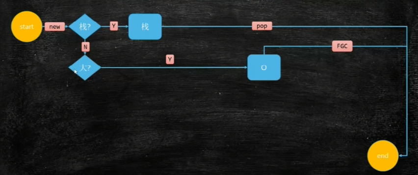


### 1.6.成员变量重排序

为了提高性能，每个对象的起始地址都对齐于8字节，当封装对象的时候为了高效率，
对象字段声明的顺序会被重排序成下列基于字节大小的顺序：

```text
double (8字节) 和 long (8字节)
int (4字节) 和 float (4字节)
short (2字节) 和 char(2字节)：char在java中是2个字节。java采用unicode，2个字节（16位）来表示一个字符。
boolean (1字节) 和 byte (1字节)
reference引用 (4/8 字)
<子类字段重复上述顺序>
```

我们可以测试一下java对不同类型的重排序，使用jdk1.8，采用反射的方式先获取到unsafe类，
然后获取到每个field在类里面的偏移地址，就能看出来了

#### 1.6.1.案例
```java
import java.lang.reflect.Field;

import sun.misc.Contended;
import sun.misc.Unsafe;

public class TypeSequence {


    @Contended
    private boolean contended_boolean;

    private volatile byte a;
    private volatile boolean b;

    @Contended
    private int contended_short;

    private volatile char d;
    private volatile short c;


    private volatile int e;
    private volatile float f;

    @Contended
    private int contended_int;

    @Contended
    private double contended_double;

    private volatile double g;
    private volatile long h;

    public static  Unsafe UNSAFE;

    static {
            try {
                @SuppressWarnings("ALL")
                Field theUnsafe = Unsafe.class.getDeclaredField("theUnsafe");
                theUnsafe.setAccessible(true);
                UNSAFE = (Unsafe) theUnsafe.get(null);
            } catch (Exception e) {
                e.printStackTrace();
            }
    }

    public static void main(String[] args) throws NoSuchFieldException, SecurityException{
        System.out.println("e:int    \t"+UNSAFE.objectFieldOffset(TypeSequence.class.getDeclaredField("e")));
        System.out.println("g:double \t"+UNSAFE.objectFieldOffset(TypeSequence.class.getDeclaredField("g")));
        System.out.println("h:long   \t"+UNSAFE.objectFieldOffset(TypeSequence.class.getDeclaredField("h")));
        System.out.println("f:float  \t"+UNSAFE.objectFieldOffset(TypeSequence.class.getDeclaredField("f")));
        System.out.println("c:short  \t"+UNSAFE.objectFieldOffset(TypeSequence.class.getDeclaredField("c")));
        System.out.println("d:char   \t"+UNSAFE.objectFieldOffset(TypeSequence.class.getDeclaredField("d")));
        System.out.println("a:byte   \t"+UNSAFE.objectFieldOffset(TypeSequence.class.getDeclaredField("a")));
        System.out.println("b:boolean\t"+UNSAFE.objectFieldOffset(TypeSequence.class.getDeclaredField("b")));


        System.out.println("contended_boolean:boolean\t"+UNSAFE.objectFieldOffset(TypeSequence.class.getDeclaredField("contended_boolean")));
        System.out.println("contended_short:short\t"+UNSAFE.objectFieldOffset(TypeSequence.class.getDeclaredField("contended_short")));
        System.out.println("contended_int:int\t"+UNSAFE.objectFieldOffset(TypeSequence.class.getDeclaredField("contended_int")));
        System.out.println("contended_double:double\t"+UNSAFE.objectFieldOffset(TypeSequence.class.getDeclaredField("contended_double")));
    }

}
```

以上代码运行结果如下
```text
e:int 12
g:double 16
h:long 24
f:float 32
c:short 38
d:char 36
a:byte 40
b:boolean 41
contended_boolean:boolean 170
contended_short:short 300
contended_int:int 432
contended_double:double 568
```

除了int字段跑到了前面来了，还有两个添加了contended注解的字段外，其它字段都是按照重排序的顺序，类型由最长到最短的顺序排序的；

#### 1.6.2.对象头对成员变量排序的影响

有的童鞋疑惑了，为啥int跑到前面来了呢？这是因为int字段被提升到前面填充对象头了，对象头有12个字节，会优先在字段中选择一个或多个能够将对象头填充为16个字节的field放到前面，如果填充不满，就加上padding，上面的例子加上一个4字节的int，正好是16字节，地址按8字节对齐；

#### 1.6.3.扩展contended对成员变量排序的影响

那么contended注解呢？这个注解是为了解决cpu缓存行伪共享问题的，cpu缓存伪共享是并发编程性能杀手，加了contended注解的字段会按照声明的顺序放到末尾，contended注解如果是用在类的field上会在该field前面插入128字节的padding，如果是用在类上则会在类所有field的前后都加上128字节的padding

可见性：使用CPU指令，保存和加载主内存的数据。

关闭指令重排序： JVM实现的内存屏障。

#### 1.6.4.原理分析

问题1：指令乱序执行有什么问题？

答案在问题二

问题2：单例DCL(double check lock) 到底需不需要加volatile？

DCL简单的案例就是单例的双重检查

```java
public class Singleton6 {
	//不加volatile的话，即使有DCL,但是对象获得的不是最新的，一样可能导致线程不安全
	private volatile static Singleton6 singleton;
	private Singleton6() {}
	public static Singleton6 getInstance(){
		if(singleton == null) {
			synchronized (Singleton6.class) {
				if(singleton == null) {
					singleton = new Singleton6();//a.存在异常的地方
				}
			}
		}
		return singleton;
	}
}
```

上面的地方1.涉及到对象的创建,如下：

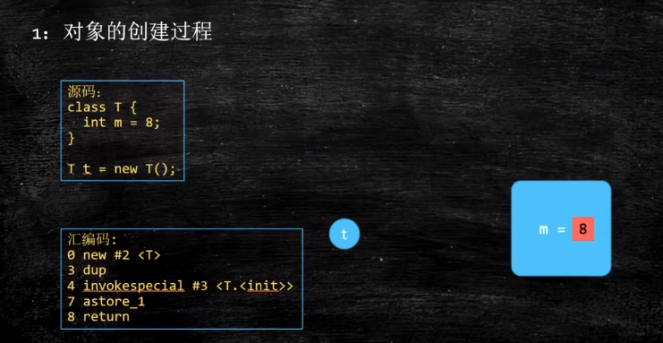


重点是下面的三个指令，不是原子的。

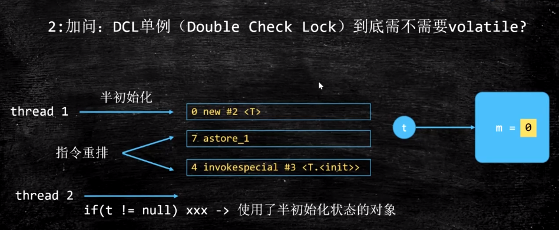


所有，除了避免数据安全之外，还有一个原因

防止乱序的时候，第一次判断==null的时候，获得一个半初始化状态的对象。这就是问题1的答案

### 1.7.对象的访问定位

使用句柄，句柄保存直接执行，变量指向句柄。防止多个变量引用指针，造成资源的浪费，提高效率。

直接指针，变量直接保存的是对象的引用，这个引用指向堆内存。


## 2.内存伪共享

### 2.1.共享是什么

伪共享 false sharing，顾名思义，“伪共享”就是“其实不是共享”。

共享就是多个CPU同时访问同一块内存。这时就会出现数据一致性的问题，当一个CPU修改了内存数据，其他共享了内存的CPU的缓存也应该要发现变化。
这时就需要我们使用缓存一致性协议进行操作了（volatile底层使用的MESI协议）。

### 2.2.伪共享是什么

Java中的伪共享以及应对方案： *https://yq.aliyun.com/articles/62865*

- 计算机一般都是3级缓存，1,2级在CPU内部，l3是多个CPU共享的。
- 目前CPU的3级缓存都是以缓存行为单位保存数据的，一个缓存行大小是64byte，CPU修改数据的时候只能修改一行
- 我们已知一个object对象是16byte，那一个缓存行就能保存4个object对象，假设计算机有2个CPU，那这两个CPU都保存了这4个object对象的缓存。
  当我们值修改其中一个object对象的时候，我们其实已经把其他3个object对象也修改了。另一个CPU被通知说某个缓存行被修改了，
  所有就把这4个缓存object对象重新同步了一次。这就是内存伪共享。这样的效率很低。


方案：
- 进行对象分析，使内存尽量等于或略大于64b。比如使用数字填充 public long p1, p2, p3, p4, p5, p6;
- 使用jdk的注解：@sun.misc.Contended
  在代码中使用@Contended修饰类或者共享变量，是不能让Contended生效的，必须在jvm启动时设置
  -XX:-RestrictContended
  第一种方案使用的比较多：guava中的Cell、Distrupt等都是手动进行内存补齐的。

### 2.3.内存分析

为了让可伸缩性与线程数呈线性关系，就必须确保不会有两个线程往同一个变量或缓存行中写。两个线程写同一个变量可以在代码中发现。
为了确定互相独立的变量是否共享了同一个缓存行，就需要了解内存布局，或找个工具告诉我们。Intel VTune就是这样一个分析工具。

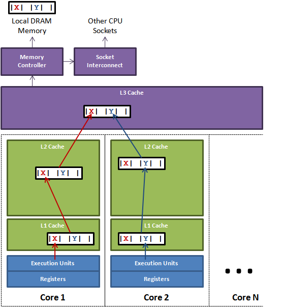


图1说明了伪共享的问题。在核心1上运行的线程想更新变量X，同时核心2上的线程想要更新变量Y。不幸的是，这两个变量在同一个缓存行中。
每个线程都要去竞争缓存行的所有权来更新变量。如果核心1获得了所有权，缓存子系统将会使核心2中对应的缓存行失效。
当核心2获得了所有权然后执行更新操作，核心1就要使自己对应的缓存行失效。这会来来回回的经过L3缓存，大大影响了性能。
如果互相竞争的核心位于不同的插槽，就要额外横跨插槽连接，问题可能更加严重。

Java Memory Layout Java内存布局，在项目开发中，大多使用HotSpot的JVM，hotspot中对象都有两个字(四字节)长的对象头。
第一个字是由24位哈希码和8位标志位（如锁的状态或作为锁对象）组成的Mark Word。第二个字是对象所属类的引用。
如果是数组对象还需要一个额外的字来存储数组的长度。每个对象的起始地址都对齐于8字节以提高性能。
因此当封装对象的时候为了高效率，对象字段声明的顺序会被重排序成下列基于字节大小的顺序：

```text
1byte=8bit

double (8字节) 和 long (8字节)
int (4字节) 和 float (4字节)
short (2字节) 和 char(2字节)：char在java中是2个字节。java采用unicode，2个字节（16位）来表示一个字符。
boolean (1字节) 和 byte (1字节)
reference引用 (4/8 字节)：开启压缩指是4B，未开启是8B
```

在了解这些之后，就可以在任意字段间用7个long来填充缓存行。伪共享在不同的JDK下提供了不同的解决方案。

#### 2.3.1. JDK1.6

在JDK1.6环境下，解决伪共享的办法是使用缓存行填充，使一个对象占用的内存大小刚好为64bytes或它的整数倍，这样就保证了一个缓存行里不会有多个对象。

```java
public class TestFlash implements Runnable {
    public final static int  NUM_THREADS = 4;                   // change
    public final static long ITERATIONS  = 500L * 1000L * 1000L;
    private final int        arrayIndex;

    /**
     * 为了展示其性能影响，我们启动几个线程，每个都更新它自己独立的计数器。计数器是volatile long类型的，所以其它线程能看到它们的进展。
     */
    public final static class VolatileLong {

        /* 用volatile修饰的变量，线程在每次使用变量的时候，JVM虚拟机只保证从主内存加载到线程工作内存的值是最新的 */
        public volatile long value = 0L;

        /* 缓冲行填充 */
        /* 37370571461 ：不使用缓冲行执行纳秒数 */
        /* 16174480826 ：使用缓冲行执行纳秒数，性能提高一半 */
        public long          p1, p2, p3, p4, p5, p6, p7;
    }

    private static VolatileLong[] longs = new VolatileLong[NUM_THREADS];
    static {
        for (int i = 0; i < longs.length; i++) {
            longs[i] = new VolatileLong();
        }
    }

    public TestFlash(final int arrayIndex){
        this.arrayIndex = arrayIndex;
    }

    /**
     * 我们不能确定这些VolatileLong会布局在内存的什么位置。它们是独立的对象。但是经验告诉我们同一时间分配的对象趋向集中于一块。
     */
    public static void main(final String[] args) throws Exception {
        final long start = System.nanoTime();
        runTest();
        System.out.println("duration = " + (System.nanoTime() - start));
    }

    private static void runTest() throws InterruptedException {
        Thread[] threads = new Thread[NUM_THREADS];

        for (int i = 0; i < threads.length; i++) {
            threads[i] = new Thread(new TestFlash(i));
        }

        for (Thread t : threads) {
            t.start();
        }

        for (Thread t : threads) {
            t.join();
        }
    }

    /*
     * 为了展示其性能影响，我们启动几个线程，每个都更新它自己独立的计数器。计数器是volatile long类型的，所以其它线程能看到它们的进展
     */
    @Override
    public void run() {
        long i = ITERATIONS + 1;
        while (0 != --i) {
            longs[arrayIndex].value = i;
        }
    }
}
```

VolatileLong通过填充一些无用的字段p1,p2,p3,p4,p5,p6，再考虑到对象头也占用8bit, 刚好把对象占用的内存扩展到刚好占64bytes（或者64bytes的整数倍）。
这样就避免了一个缓存行中加载多个对象。但这个方法现在只能适应JAVA6 及以前的版本了。

#### 2.3.2. JDK1.7

在jdk1.7环境下，由于java 7会优化掉无用的字段。因此，JAVA 7下做缓存行填充更麻烦了，需要使用继承的办法来避免填充被优化掉。
把填充放在基类里面，可以避免优化（这好像没有什么道理好讲的，JAVA7的内存优化算法问题，能绕则绕）。


```java
public class TestFlashONJDK7 implements Runnable {

    public static int             NUM_THREADS = 4;
    public final static long      ITERATIONS  = 500L * 1000L * 1000L;
    private final int             arrayIndex;
    private static VolatileLong[] longs;

    public TestFlashONJDK7(final int arrayIndex){
        this.arrayIndex = arrayIndex;
    }

    public static void main(final String[] args) throws Exception {
        Thread.sleep(10000);
        System.out.println("starting....");
        if (args.length == 1) {
            NUM_THREADS = Integer.parseInt(args[0]);
        }

        longs = new VolatileLong[NUM_THREADS];
        for (int i = 0; i < longs.length; i++) {
            longs[i] = new VolatileLong();
        }
        final long start = System.nanoTime();
        runTest();
        System.out.println("duration = " + (System.nanoTime() - start));
    }

    private static void runTest() throws InterruptedException {
        Thread[] threads = new Thread[NUM_THREADS];
        for (int i = 0; i < threads.length; i++) {
            threads[i] = new Thread(new TestFlashONJDK7(i));
        }
        for (Thread t : threads) {
            t.start();
        }
        for (Thread t : threads) {
            t.join();
        }
    }

    @Override
    public void run() {
        long i = ITERATIONS + 1;
        while (0 != --i) {
            longs[arrayIndex].value = i;
        }
    }
}
class VolatileLong extends VolatileLongPadding {

    public volatile long value = 0L;
}
class VolatileLongPadding {

    public volatile long p1, p2, p3, p4, p5, p6, p7;
}
```

#### 2.3.3. JDK1.8

在jdk1.8环境下，缓存行填充终于被JAVA原生支持了。JAVA 8中添加了一个@Contended的注解，添加这个的注解，将会在自动进行缓存行填充。

以上的例子可以改为：

```java
public class TestFlashONJDK8 implements Runnable {

    public static int             NUM_THREADS = 4;
    public final static long      ITERATIONS  = 500L * 1000L * 1000L;
    private final int             arrayIndex;
    private static VolatileLong[] longs;

    public TestFlashONJDK8(final int arrayIndex){
        this.arrayIndex = arrayIndex;
    }

    public static void main(final String[] args) throws Exception {
        Thread.sleep(10000);
        System.out.println("starting....");
        if (args.length == 1) {
            NUM_THREADS = Integer.parseInt(args[0]);
        }

        longs = new VolatileLong[NUM_THREADS];
        for (int i = 0; i < longs.length; i++) {
            longs[i] = new VolatileLong();
        }
        final long start = System.nanoTime();
        runTest();
        System.out.println("duration = " + (System.nanoTime() - start));
    }

    private static void runTest() throws InterruptedException {
        Thread[] threads = new Thread[NUM_THREADS];
        for (int i = 0; i < threads.length; i++) {
            threads[i] = new Thread(new TestFlashONJDK8(i));
        }
        for (Thread t : threads) {
            t.start();
        }
        for (Thread t : threads) {
            t.join();
        }
    }

    @Override
    public void run() {
        long i = ITERATIONS + 1;
        while (0 != --i) {
            longs[arrayIndex].value = i;
        }
    }
}
@Contended
class VolatileLong { 

　　public volatile long value = 0L; 
}
```

执行时，必须加上虚拟机参数-XX:-RestrictContended，@Contended注释才会生效。

## 3.volatile关键字的内存使用

用volatile修饰的变量，线程在每次使用变量的时候，都会读取变量修改后的最新值。但是由于操作不是原子性的，对于volatile修饰的变量，jvm虚拟机只是保证从主内存加载到线程工作内存的值是最新的。

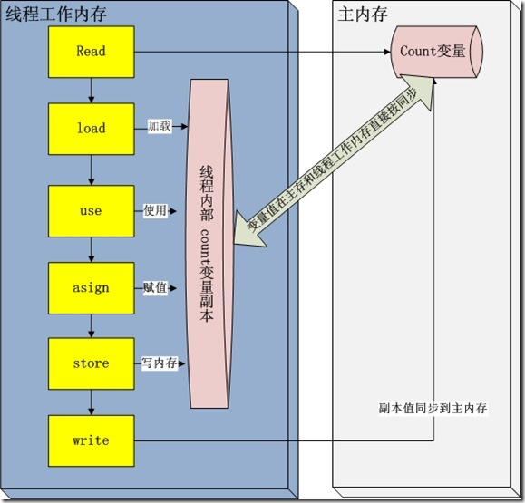

jvm虚拟机栈中，每一个线程运行时都有一个线程栈，线程栈保存了线程运行时候变量值信息。当线程访问某一个对象时候值的时候，
首先通过对象的引用找到对应在堆内存的变量的值，然后把堆内存变量的具体值load到线程本地内存中，建立一个变量副本，
之后线程就不再和对象在堆内存变量值有任何关系，而是直接修改副本变量的值，在修改完之后的某一个时刻（线程退出之前），
自动把线程变量副本的值回写到对象在堆中变量。这样在堆中的对象的值就产生变化了。上面一幅图描述这些交互，过程如下：

- read and load 从主存复制变量到当前工作内存
- use and assign 执行代码，改变共享变量值（其中use and assign 可以多次出现）
- store and write 用工作内存数据刷新主存相关内容

但是这些操作并不是原子性，也就是在read load之后，如果主内存count变量发生修改之后，线程工作内存中的值由于已经加载，
不会产生对应的变化，所以计算出来的结果会和预期不一样。对于volatile修饰的变量，JVM虚拟机只是保证从主内存加载到线程工作内存的值是最新的。
例如假如线程1，线程2在进行read load操作中，发现主内存中count的值都是5，那么都会加载这个最新的值。
在线程1堆count进行修改之后，会write到主内存中，主内存中的count变量就会变为6。
线程2由于已经进行read,load操作，在进行运算之后，也会更新主内存count的变量值为6。导致两个线程即使使用volatile关键字修改之后，还是会存在并发的情况。

对于volatile修饰的变量，JVM虚拟机只能保证从主内存加载到线程工作内存的值是最新的。
