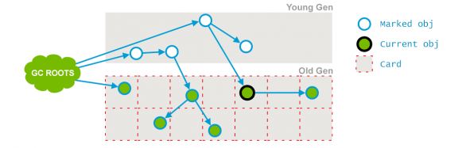

# 4.垃圾回收

- 个人笔记：https://mp.weixin.qq.com/s/i96K7Zs6cVUF7bZKoqbMUg
- [垃圾收集手册](https://plumbr.io/handbook/garbage-collection-algorithms-implementations)

注意：以下大部分是以HotSpot为例

垃圾回收主要思考三件事情
- 哪种内存需要回收？垃圾判断算法
- 什么时候回收？Gc触发条件
- 怎么回收？垃圾回收器

## 1.垃圾判断算法？

### 1.1.引用计数法

这是一种非常简单易理解的算法。每当有一个地方引用一个对象的时候则在引用计数器上
+1，当失效的时候就 -1，无论什么时候计数器为 0
的时候则认为该对象死亡可以回收了。


这种算法虽然简单高效，但是却无法解决循环引用的问题，即：A引用B，B又引用A。因此
Java 虚拟机并没有采用这种算法。

### 1.2.可达性分析法

目前主流的虚拟机其实都是采用可达性分析算法，比如JVM。

可达性算法是通过一个称为 GC Roots
的对象向下搜索，整个搜索路径就称为引用链，当一个对象到 GC Roots
没有任何引用链 JVM 就认为该对象是可以被回收的。


如图:Object1、2、3、4 都是存活的对象，而 Object5、6、7都是可回收对象。

可以作为GC Roots的对象如下：
- 虚拟机栈中所引用的对象。
- 方法区中类的静态变量所引用的对象。
- 方法区中常量引用的对象
- 本地方法栈中引用的对象

## 2.GC算法

| GC算法                     | 是否移动对象 | 空间开销     | 时间开销                                   |
| ---------------------------- | -------------- | -------------- |----------------------------------------|
| 标记-清除算法 mark-sweep   | 否           | 低（有碎片） | mark阶段耗时与存活对象数量成正比，sweep阶段与堆大小成正比      |
| 标记-整理算法 mark-compact | 是           | 低（无碎片） | mark阶段耗时与存活对象数量成正比，compact阶段与存活对象大小成正比 |
| 标记-复制算法 mark-copy    | 是           | 高（无碎片） | copy阶段与存活对象大小成正比                       |

### 2.1.标记-清除算法 mark-sweep

标记清除算法分为两个步骤，标记和清除。首先根据GCRoot将所有活动的对象打上标记，然后遍历整个堆内存，回收没有标记的对象。

标记清除过程如下:


GC过程中会涉及到两个操作，分配 和 合并
- 分配：指的是垃圾回收后的内存空间，被连接到一个“空闲链表”中。当程序创建对象的时候，可以查找链路找到大小合适的内存块。
- 合并：垃圾回收后会产生很多空闲分块，如果某些分块是连续的，就会被合并成一个大的空间，这样就降低“空闲链表”的容量。

优点：
- 实现简单，非常适合跟其他的gc算法一起使用
- 不会移动对象内存位置，是一种非常保守的gc算法
存在两个主要的问题:
- 分配速度慢。GC中分块不是连续的，因此每次分配都必须遍历空闲链表，找到足够大的分块才行。
- 碎片化，清除之后会产生内存碎片，降低堆内存使用率，加快gc频率。

优化
1. 分配速度的改进——多个空闲链表。根据分块大小创建多个链表，加速分配。golang的gc就是这么实现的。
2. 碎片化分块问题的改进——BiBOP法（Big Bag Of Pages ）。把堆分割成多个规格大小的空间，让每个规格的空间只能配置同样大小的分块。
    分配的时候跟是找对应规格的空间，即使有碎片，也对内存分配的影响降低。

### 2.2.标记-复制算法 mark-copy

标记-复制算法是将内存划分为两块大小相等的区域，每次使用时都只用其中一块区域，当发生垃圾回收时会将存活的对象全部复制到未使用的区域，然后对之前的区域进行全部回收。
这样简单高效，而且还不存在标记清除算法中的内存碎片问题，但就是有点浪费内存。 目前新生代会使用该算法。

复制流程如下：
1. 新生代中分为一个 Eden 区和两个 Survivor 区。通常两个区域的比例是 8:1:1，使用时会用到 Eden 区和其中一个 Survivor 区。
2. 当发生回收时则会将还存活的对象从 Eden ，Survivor 区拷贝到另一个 Survivor 区，
3. 当Survivor内存也不足时则会使用分配担保利用老年代来存放对象。

复制算法优化：
- Cheney 的 GC 复制算法。
- 多空间复制：普通的复制算法例如survivor之间复制，而多空间例如G1的region之间复制以及合并操作。


优点：
- 吞吐量高：mark sweep 算法 耗时的是 搜索活动对象 与 清除阶段遍历整个堆。而复制算法只需要搜索活动对象。
- 没有内存碎片。
- 高速分配对象：内存是连续的，所以不需要使用“空闲链表”
- 满足高速缓存的局部性原理。将有引用关系的对象分配到堆内存中距离最近的区域，提升程序访问速度。
缺点：
- 空间浪费，采用FORM-TO机制，内存使用率最高只有一半。
- 递归调用函数。复制某个对象时要递归复制它引用的对象，产生大量的栈帧，数量巨大的时候，存在栈溢出的情况。

### 2.3.标记-整理算法 mark-compact

标记整理算法也可以称之为标记-压缩算法。将垃圾对象清理掉后，同时将剩下的存活对象进行整理挪动（类似于windows的磁盘碎片整理），
保证它们占用的空间连续，这样就避免了内存碎片问题，但是整理过程也会降低GC的效率，所有该算法一般作用于老年代。

为什么老年代会使用标记整理算法？

复制算法在存活对象较多时效率明显会降低，特别是在老年代中并没有多余的内存区域可以提供内存担保。所以老年代中使用的时候标记整理算法，
它的原理和标记清除算法类似，只是最后一步的清除改为了将存活对象全部移动到一端，然后再将边界之外的内存全部回收。


### 2.4.分代回收理论 generation-collect

上面三种回收算法都有各自的优缺点，都不是完美的。所以在现代JVM中，往往混合使用，这就有了分代回收算法，他是对上面三种算法的综合使用，针对不同分区的特点，采用不同的回收算法。
经过大量实际分析，发现内存中的对象，大致可以分为两类
- 有些生命周期很短，比如一些局部变量/临时对象
- 而另一些则会存活很久，典型的比如websocket长连接中的connection对象


纵向y轴可以理解分配内存的字节数，横向x轴理解为随着时间流逝（伴随着GC），可以发现大部分对象其实相当短命，很少有对象能在GC后活下来。
因此诞生了分代的思想，以Hotspot为例（JDK7）：将内存分成了三大块：新生代(细为分eden，S0，S1三个区)，老年，永久代(方法区)。


由于新生代中存活对象较少，所以采用复制算法，简单高效。

而老年代中对象较多，并且没有可以担保的内存区域，所以一般采用标记清除或者是标记整理算法。

## 3.GC类型

minor gc 与 major gc，其实这两个称呼官方并未明确指出是什么类型，也就是口头上的俗称。通常我们按照分代进行分类
1. 部分收集-Partial GC。回收目标不是完整的Java堆内存
   - 新生代收集-Minor GC/Young GC：从新生代空间（包括 Eden 和 Survivor 区域）回收内存被称为
   - 老年代收集-Major GC/Old GC：是清理老年代。如果使用CMS，GC的时候可能混合Minor GC，也被计一次Full GC
   - 混合回收-Mixed GC:整个新生代 与 部分老年代 进行回收，目前只有G1有混淆回收。
2. 完整收集-Full GC。回收目标是整个Java堆内存(新生代、老年代)、方法区/元空间、堆外内存

### 3.1.不同区域的GC触发条件

- 对象优先在Eden区分配

HotSpot JVM把新生代分为了三部分：1个Eden区和2个Survivor区（分别叫from和to）。默认比例为8：1。大多数情况下，对象优先在Eden区中分配。当Eden区中没有足够空间进行分配时，将会触发一次Minor GC。

- 大对象直接进入老年代

所谓的大对象是指，需要大量连续内存空间的Java对象。例如：很长的字符串或者数组。虚拟机提供了一个-XX:PretenureSizeThreshold参数。
令大于这个-XX:PretenureSizeThreshold设置值的对象，直接在老年代分配。

- 长期存活的对象将进入老年代

虚拟机为了分代收集，对每一个对象定义了一个对象年龄计数器（Age）。如果对象在Eden出生，并且经过一次Minor GC后，
仍然存活并且能被Survivor区中每熬过一次Minor GC，年龄就会增加1岁。当年龄增加到默认的15岁时，就会晋升到老年代。

晋升为老年代的阙值通过参数-XX:MaxTenuringThreshold设置。

许多 Major GC 是由 Minor GC 触发的，所以很多情况下将这两种 GC 分离是不太可能的。

这使得我们不用去关心到底是叫 Major GC 还是 Full GC，大家应该关注当前的 GC
是否停止了所有应用程序的线程，还是能够并发的处理而不用停掉应用程序的线程。

### 3.2.Full GC触发条件

1. 调用System.gc()时。系统建议执行Full GC，但是不必然执行，可以使用jvm参数禁用该功能
2. 老年代空间不足。比如默认使用率到达70%的时候就会触发。
   在Survivor区域的对象满足晋升到老年代的条件时，晋升进入老年代的对象大小大于老年代的可用内存，这个时候会触发Full GC
3. 方法区空间不足(metaspace使用堆外内存，不足时会抛出异常)
4. 在执行minor gc的时候进行的一系列检查（详细看《2.JVM内存模型》中的空间分配担保）

## 4.GC算法细节

### 4.1.对象的生命周期

下图引自阿里出品的《码出高效-Java开发手册》一书，梳理了GC的主要过程。该过程是主体流程，部分流程不够准确。
例如对象创建时，会先进行逃逸分析，不逃逸会尝试进行标量替换、栈上分配。对象较大或逃逸的话，就会尝试TLAB分配; 对象较大或TLAB不足的话会在进行判断。
TLAB是从eden分配给线程用于分配内存使用的区域。


#### 4.1.1.Step1

刚开始时，对象分配在eden区，s0（即：from）及s1（即：to）区，几乎是空着。


#### 4.1.2.Step2

随着应用的运行，越来越多的对象被分配到eden区


#### 4.1.3.Step3

当eden区放不下时（无法分配内存给新的对象时），就会发生minor GC（也被称为young GC）， 第1步当然是要先标识出不可达垃圾对象（即：下图中的黄色块），
然后将可达对象，移动到s0区（即：4个淡蓝色的方块挪到s0区），然后将黄色的垃圾块清理掉，这一轮过后，eden区就成空的了。

注：这里其实已经综合运用了 【标记-清理eden】 + 【标记-复制 eden->s0】算法。


#### 4.1.4.Step4

随着时间推移，eden如果又满了，再次触发minor GC，同样还是先做标记，这时eden和s0区可能都有垃圾对象了（下图中的黄色块），
注意：这时s1（即：to）区是空的，s0区和eden区的存活对象，将直接搬到s1区。然后将eden和s0区的垃圾清理掉，
这一轮minor GC后，eden和s0区就变成了空的了。


#### 4.1.5.Step5

继续，随着对象的不断分配，eden空可能又满了，这时会重复刚才的minor GC过程，不过要注意的是，这时候s0是空的，所以s0与s1的角色其实会互换，
即：存活的对象，会从eden和s1区，向s0区移动。然后再把eden和s1区中的垃圾清除，这一轮完成后，eden与s1区变成空的，如下图。


#### 4.1.6.Step6

对于那些比较“长寿”的对象一直在s0与s1中挪来挪去，一来很占地方，而且也会造成一定开销，降低gc效率，于是有了“代龄(age)”及“晋升”。

对象在新生代的3个区(edge,s0,s1)之间，每次从1个区移到另1区，年龄+1，在young区达到一定的年龄阈值后，将晋升到老年代。
下图中的8，即：挪动8次后，如果还活着，下次minor GC时，将移动到Tenured区。


#### 4.1.7.Step7

下图是晋升的主要过程：对象先分配在新生代，经过多次Young GC后，如果对象还活着，晋升到老年代。


#### 4.1.8.Step8

如果老年代也满了（使用率达到阈值，比如70%），就会发生major GC（即Full GC），由于老年代的的对象通常会比较多，
因为标记-清理-整理（不一定进行整理）的耗时通常会比较长，会让应用出现卡顿的现象，这也是为什么很多应用要优化，尽量避免或减少Full GC的原因。


### 4.2.三色标记法

JVM 对 可达性分析法 的一种实现，用于 搜索活动对象 的阶段，颜色是对象状态。
- 黑：扫描过的且是存活的对象，且它所有引用链都完成扫描
- 灰：扫描过的且是存活的对象，引用链没有扫描完
- 白：没有扫描过的。如果扫描结束后还是白色的，就说明这个对象是不可达的，将会被gc掉

工作过程：
1. 初始标记(STW)：通过OopMap获得全部GC ROOT，将根对象和直接引用的对象标记为灰色，不扫描整个堆，所以时间非常快。
2. 并发标记：根据GC ROOT的引用关系，采用递归的方式进行标记，进去递归时为灰色，出递归时为黑色。
   应用程序线程可能会修改对象图，因此垃圾回收器需要使用写屏障（Write Barrier）技术来保证并发标记的正确性。
3. 重新标记(STW)：重新标记的主要作用是标记在并发标记阶段中被修改的对象以及未被遍历到的对象。
   垃圾回收器会从灰色对象重新开始遍历对象图，将被引用的对象标记为灰色，并将已经遍历过的对象标记为黑色。
4. 清理阶段。根据选择的GC算法，将白色标记的对象清理。

<p style="color: red">所以三色标记的数据是如何维护的？</p>

JVM可达性分析的时候，以GC ROOT为起点，根据引用关系形成一副对象图，对象图不是真实的数据结构，
而是一种对对象引用结构的描述。
而三色标记的颜色记录其实是存储在对象中的。

#### 4.2.1.写屏障

写屏障:是一种对象引用被修改时，将新的引用关系记录到特殊数据结构的机制。

在三色标记法中，用于记录没有标记过的对象的标记状态。能够确保标记所有可达对象，防止重复标记。
当应用程序修改对象的引用时，写屏障会记录该对象的新标记状态。
- 如果该对象未被标记过，那么它会被标记为灰色，以便在垃圾回收器的下一次遍历中进行标记。
- 如果该对象已经被标记为可达对象，那么写屏障不会对该对象进行任何操作。

写屏障会带来一定的性能开销，所以jvm中采用插入式的写屏障，就是有开关控制。

#### 4.2.2.多标

就是这个对象原本应该被回收掉的白色对象，但是被错误的标记成了黑色的存活对象。从而导致这个对象没有被GC回收掉。

场景：在标记过程中，对象是有引用关系，但是在回收阶段的时候，引用关系被删除，导致对象变成“浮动垃圾”。

一般出现这种情况就是没事的，正常下一次GC就会被回收

#### 4.2.3.漏标

和多标刚好相反，就是说一个对象本来应该是黑色存活对象，但是没有被正确的标记上，导致被错误的垃圾回收掉了，这种是非常严重的问题。
具体的解决方式，在CSM和G1中也不太一样。CMS采用的是增量更新方案，G1则采用的是原始快照的方案。

漏标的问题想要发生，需要同时满足两个充要条件：
1. 至少有一个黑色对象在自己被标记之后指向了这个白色对象
2. 所有的灰色对象在自己引用扫描完成之前删除了对白色对象的引用

- 增量更新(例如CMS):破坏第一个条件。
    1. 如果有黑色对象在自己标记后，又重新指向了白色对象。那么我就把这个黑色对象的引用记录下来，在后续「重新标记」阶段再以这个黑色对象为根，
       对其引用进行重新扫描。通过这种方式，被黑色对象引用的白色对象就会变成灰色，从而变为存活状态。
    2. 缺点：增加了重新标记阶段的扫描内容，增加了GC时长。当然这个时间极短，绝大部分场景不会产生这种数据，可以忽略时间。
- 快照(例如G1、Shenandoah):破坏第二个条件
    1. 如果灰色对象在扫描完成前删除了对白色对象的引用，那么我们就在灰色对象取消引用之前，先将灰色对象引用的白色对象记录下来。
       在后续「重新标记」阶段再以这些白色对象为根，对它的引用进行扫描，从而避免了漏标的问题。通过这种方式，原本漏标的对象就会被重新扫描变成灰色，从而变为存活状态。
    2. 缺点：可能把真的需要回收的对象错误复活，产生“浮动垃圾”，但是这个可与忽略。

漏标的解决方案都是基于写屏障实现的，增量更新记录变更后的引用关系，快照记录变更前的。

### 4.3.OopMap
CG ROOT是GC的第一步，该阶段会发生STW，所以不能扫描整个堆去查找引用关系，为了降低STW的时间，提升GC效率，所以引入了OopMap（Object-Oriented Pointer）。
OopMap是实现根节点枚举的一种数据结构，GC时可以直接读取 OopMap 获得所有的 CG ROOT。

是实现根节点枚举的一种数据结构，在class加载的时，将可以作为GC ROOT的对象，在class中使用Oop进行记录。
实现方式就是通过在特定的安全点记录栈帧和寄存器中对象引用的位置，并在 JIT 编译过程中插入代码来更新这些信息。

OopMap工作流程：
- 记录引用关系：OopMap是实现根节点枚举的一种数据结构，用来记录栈帧和寄存器中哪些位置存储了对象引用，这些引用指向堆上的对象就是CG ROOT。
- JIT编译优化：在编译过程中，HotSpot会在class特定的“安全点” (例如方法调用、循环等)插入代码来更新 OopMap。
  虽然对象的引入可能发生变化，但是记录对象的引用的地址是不会改变的，可以确保 OopMap 中的信息始终是最新和准确的。
- 一致性快照：在GC发生STW时的快照中进行，过程中GC ROOT的引用不会变化。

如果Java字节码没有进过JIT编译，就必须依赖JVM的解释器进行记录（效率很低，但是用于解释的代码量很少）

### 4.4.安全点
当代码执行到安全点或者位于安全区域的时候，GC就可以进行STW。
- https://blog.csdn.net/Hmj050117/article/details/115414951
- 安全点实现原理：https://blog.csdn.net/liuzhengyang1/article/details/121884824

- 安全点：OopMap记录的代码不可能插入到所有对象发生变化的位置，这样的OopMap也会变得非常庞大，占用大量内容，所以只在特定的“安全点”插入OopMap代码即可。
  只有在所有线程都处于安全点时才能STW，比如方法执行完前、调用方法后、循环的最后面、抛出异常前等
- 安全区域：指在一段代码片段中，对象的引用关系不会发生变化，在这个区域中的任何位置开始GC 都是安全的。比如wait和block状态的线程

### 4.5.记忆集 和 卡表
记忆集（remembered set）主要作用是用于跨代引用，它通过记录从非收集区域到收集区域的引用关系，帮助垃圾收集器快速定位到可能存在的跨代引用，从而提高垃圾收集的效率。
例如：YoungGC时，只对新生代对象进行扫描，如果新生代对象仅仅被老年代对象引用，想要找到引用关系只能扫描整个老年代了。这就需要用到记忆集，用于记录对象被跨代的引用。

卡表（card table）是记忆集的具体实现。数据结构为数组，元素为卡页，表示512B的内存区域，例如第一个元素表示0X0000~0X01FF，
如果这个内存区间的对象引用发生跨代引用，就在元素中对应位置记录对象指针，该元素被标记为Dirty，用于GC是使用。

## 5.垃圾回收器

不算最新出现的神器ZGC，历史上出现过7种经典的垃圾回收器，这些回收器都是基于分代的，把G1除外，按回收的分代划分
- 新生代回收器：Serial ,ParNew, Parellel Scavenge
- 老年代回收器：CMS，Serial Old, Parallel Old

总体来说，新生代使用标记复制，老年代使用的是标记清除 和 标记压缩。

Java7和8：常用的两种垃圾收集器（ParNew：新生代，CMS：老年代）

jdk8默认GC：Parallel Scavenge和Parallel Old


### 5.1.Serial

单线程用标记-复制算法，单线程的好处避免上下文切换，早期的机器，大多是单核，也比较实用。
但执行期间，会发生STW。适用于桌面应用。

### 5.2.ParNew

ParNew 收集器是新生代常用的垃圾收集器，是Serial的多线程版本。但执行期间，会发生STW。
它采用的是复制算法，youngGC 时一个典型的日志信息如下所示：

```shell
-04-12T13:48:26.134+0800: 15578.050: [GC2018-04-12T13:48:26.135+0800: 15578.050: [ParNew: 3412467K->59681K(3774912K), 0.0971990 secs] 9702786K->6354533K(24746432K), 0.0974940 secs] [Times: user=0.95 sys=0.00, real=0.09 secs]
# 依次分析一下上面日志信息的含义

# 使用 [ParNew回收:GC前年轻代容量 -> GC后年轻代容量(当前年轻代容量), gc耗时] GC前堆容量 -> GC后堆容量(当前堆容量) gc耗时
[ParNew: 3412467K->59681K(3774912K), 0.0971990 secs] 9702786K->6354533K(24746432K), 0.0974940 secs] 

[Times: user=0.95 sys=0.00, real=0.09 secs]
```

时间 类型，含义如下：
- user：GC 线程在垃圾收集期间所使用的 CPU 总时间；
- sys：系统调用或者等待系统事件花费的时间；
- real：应用被暂停的时钟时间，由于 GC 线程是 多线程 的，导致了 real 小于 (user+real)，如果是 gc 线程是单线程的话，real 是接近于(user+real) 时间。

### 5.3.Parallel Scavenge

ParNew的升级版本，主要区别在于提供了两个参数：-XX:MaxGCPauseMillis最大垃圾回收停顿时间；
-XX:GCTimeRatio 垃圾回收时间与总时间占比，通过这2个参数，可以适当控制回收的节奏，更关注于吞吐率，即总时间与垃圾回收时间的比例。


### 5.4.Serial Old 收集器

因为老年代的对象通常比较多，占用的空间通常也会更大，如果采用复制算法，得留50%的空间用于复制，相当不划算，而且因为对象多，
从1个区，复制到另1个区，耗时也会比较长，所以老年代的收集，通常会采用“标记-整理”法。从名字就可以看出来，这是单线程（串行）的， 依然会有STW。

### 5.5.Parallel Old 收集器
Serial Old的多线程版本

### 5.6.CMS

[CMS文档](https://plumbr.io/handbook/garbage-collection-algorithms-implementations#concurrent-mark-and-sweep)

CMS(Concurrent Mark Sweep)多线程并发的标记清除算法。这是JDK7中广泛使用的收集器。
- 作用空间：主要是用于老年代中的垃圾回收器
- 工作流程是：初始化标记->并发标记->重新标记->并发回收
- 优点：并发收集，低停顿
- 缺点：CPU消耗大，无法处理浮动垃圾，会出现空间碎片

空间碎片：指的是老年代GC后出现的不连续的内存空间，这些空间太小，导致后续无法保存较大的对象，导致内存空闲出来无法被使用，浪费了内存空间。
  所以我们为了提高内存的使用率的话。可以选择设置Full GC次数达到阈值后(UseCMSCompactAtFullCollection)，进行老年代的内存整理。

#### 5.6.1.与其他old回收器对比


Serial Old收集器或 Parallel Old收集器而言，这个明显要复杂多了，分为4个阶段：

#### 5.6.2.主要工作流程

CMS 收集器是老年代经常使用的收集器，它采用的是标记-清除算法，应用程序在发生一次 CMS GC 时，典型的 GC 日志信息如下：

了解CMS回收日志：*https://ifeve.com/jvm-cms-log/*

```shell
// 阶段1：Initial Mark
[GC (CMS Initial Mark) [1 CMS-initial-mark: 0K(2097152K)] 620856K(3040896K), 0.1337462 secs] [Times: user=0.36 sys=0.00, real=0.13 secs] 

// 阶段2：并发标记
2019-06-24T14:26:28.421+0800: 4.344: [CMS-concurrent-mark-start]
2019-06-24T14:26:28.448+0800: 4.370: [CMS-concurrent-mark: 0.026/0.026 secs] [Times: user=0.08 sys=0.01, real=0.03 secs] 

// 阶段3：Concurrent Preclean
2019-06-24T14:26:28.448+0800: 4.370: [CMS-concurrent-preclean-start]
2019-06-24T14:26:28.452+0800: 4.375: [CMS-concurrent-preclean: 0.004/0.004 secs] [Times: user=0.02 sys=0.00, real=0.00 secs] 

// 阶段4：Concurrent Abortable Preclean
2019-06-24T14:26:28.452+0800: 4.375: [CMS-concurrent-abortable-preclean-start]
2019-06-24T14:26:28.892+0800: 4.815: [GC (Allocation Failure) 2019-06-24T14:26:28.892+0800: 4.815: [ParNew2019-06-24T14:26:28.946+0800: 4.868: [CMS-concurrent-abortable-preclean: 0.066/0.493 secs] [Times: user=1.79 sys=0.09, real=0.49 secs] 
: 838912K->92239K(943744K), 0.1086553 secs] 838912K->92239K(3040896K), 0.1088052 secs] [Times: user=0.31 sys=0.05, real=0.11 secs] 

// 阶段5：Final Remark
2019-06-24T14:26:29.001+0800: 4.924: [GC (CMS Final Remark) [YG occupancy: 113547 K (943744 K)]2019-06-24T14:26:29.001+0800: 4.924: [Rescan (parallel) , 0.0273029 secs]2019-06-24T14:26:29.029+0800: 4.951: [weak refs processing, 0.0000370 secs]2019-06-24T14:26:29.029+0800: 4.951: [class unloading, 0.0057905 secs]2019-06-24T14:26:29.035+0800: 4.957: [scrub symbol table, 0.0038963 secs]2019-06-24T14:26:29.038+0800: 4.961: [scrub string table, 0.0006268 secs][1 CMS-remark: 0K(2097152K)] 113547K(3040896K), 0.0391238 secs] [Times: user=0.13 sys=0.00, real=0.04 secs] 

// 阶段6：Concurrent Sweep
2019-06-24T14:26:29.041+0800: 4.963: [CMS-concurrent-sweep-start]
2019-06-24T14:26:29.041+0800: 4.963: [CMS-concurrent-sweep: 0.000/0.000 secs] [Times: user=0.00 sys=0.00, real=0.00 secs] 

// 阶段7：Concurrent Reset.
2019-06-24T14:26:29.041+0800: 4.963: [CMS-concurrent-reset-start]
2019-06-24T14:26:29.049+0800: 4.971: [CMS-concurrent-reset: 0.008/0.008 secs] [Times: user=0.03 sys=0.00, real=0.01 secs] 
```

CMS 拆分开来，涉及的阶段比较多，下面分别来介绍各个阶段的情况。

一般我们可以将步骤简化为四步，初始化标记，并发标记，重新标记，并发回收

##### 5.6.2.1.阶段1：Initial Mark(初始化标记)

这个是 CMS 两次 stop-the-wolrd 事件的其中一次，这个阶段的目标是：标记那些直接被 GC root 引用或者被新生代存活对象所引用的所有对象

标记后示例如下（图来自： GC Algorithms：Implementations —— Concurrent
Mark and Sweep —— Full GC）


上述例子对应的日志信息为：

```shell
[GC (CMS Initial Mark) [1 CMS-initial-mark: 0K(2097152K)] 620856K(3040896K), 0.1337462 secs] [Times: user=0.36 sys=0.00, real=0.13 secs] 
```

```shell
CMS-initial-mark：初始标记阶段，它会收集所有 GC Roots 以及其直接引用的对象；
0K：当前老年代使用的容量，这里是 0G；
(2097152K)：老年代可用的最大容量，这里是 2G；
620856K：整个堆目前使用的容量，这里是 600M；
(3040896K)：堆可用的容量，这里是 3G；
0.1337462 secs：这个阶段的持续时间；
[Times: user=0.04 sys=0.00, real=0.04 secs]：相应 user、system and real 的时间统计。
```

##### 5.6.2.2.阶段2：Concurrent mark(并发标记)

在这个阶段 Garbage Collector 会遍历老年代，然后标记所有存活的对象，它会根据上个阶段找到的 GC Roots 遍历查找。
并发标记阶段，它会与用户的应用程序并发运行。这个过程是多线程的，虽然耗时理论上会比较长，但是其它工作线程并不会阻塞，没有STW。
并不是老年代所有的存活对象都会被标记，因为在标记期间用户的程序可能会改变一些引用。


在上面的图中，与阶段1的图进行对比，就会发现有一个对象的引用已经发生了变化，这个阶段相应的日志信息如下：

```shell
2019-06-24T14:26:28.421+0800: 4.344: [CMS-concurrent-mark-start]
2019-06-24T14:26:28.448+0800: 4.370: [CMS-concurrent-mark: 0.026/0.026 secs] [Times: user=0.08 sys=0.01, real=0.03 secs] 
```

```shell
CMS-concurrent-mark：并发收集阶段，这个阶段会根据GCROOT遍历老年代，并标记所有存活的对象；
0.138/0.138 secs：这个阶段的持续时间与时钟时间；
[Times: user=1.01 sys=0.21, real=0.14 secs]：如前面所示，但是这部的时间，其实意义不大，因为它是从并发标记的开始时间开始计算，这期间因为是并发进行，不仅仅包含 GC 线程的工作。
```

##### 5.6.2.3.阶段3：Concurrent Preclean(并发预清理)

Concurrent Preclean：这也是一个并发阶段，与应用的线程并发运行，并不会 stop 应用的线程。
在并发运行的过程中，一些对象的引用可能会发生变化，但是这种情况发生时，
JVM 会将包含这个对象的区域（Card Table）标记为 Dirty，这也就是 Card Marking。


在pre-clean阶段，那些能够从 Dirty 对象到达的对象也会被标记，这个标记做完之后，dirty card标记就会被清除了


这个阶段相应的日志信息如下：

```shell
2019-06-24T14:26:28.448+0800: 4.370: [CMS-concurrent-preclean-start]
2019-06-24T14:26:28.452+0800: 4.375: [CMS-concurrent-preclean: 0.004/0.004 secs] [Times: user=0.02 sys=0.00, real=0.00 secs]
```

```shell
CMS-concurrent-preclean：Concurrent Preclean 阶段，对在前面并发标记阶段中引用发生变化的对象进行标记；
0.056/0.057 secs：这个阶段的持续时间与时钟时间；
[Times: user=0.20 sys=0.12, real=0.06 secs]：同并发标记阶段中的含义。
```

##### 5.6.2.4.阶段4：Concurrent Abortable Preclean(并发可中止预清理)

这也是一个并发阶段，但是同样不会影响影响用户的应用线程，这个阶段是为了尽量承担STW（STW）中最终标记阶段的工作。
这个阶段持续时间依赖于很多的因素，由于这个阶段是在重复做很多相同的工作，直接满足一些条件（比如：重复迭代的次数、完成的工作量或者时钟时间等）。

```shell
2019-06-24T14:26:28.452+0800: 4.375: [CMS-concurrent-abortable-preclean-start]
2019-06-24T14:26:28.946+0800: 4.868: [CMS-concurrent-abortable-preclean: 0.066/0.493 secs] [Times: user=1.79 sys=0.09, real=0.49 secs] 
```

##### 5.6.2.5.阶段5：Final Remark(最终标记)

这是第二个 STW 阶段，也是 CMS 中的最后一个，这个阶段的目标是标记所有老年代所有的存活对象，由于之前的阶段是并发执行的，
gc 线程可能跟不上应用程序的变化，为了完成标记老年代所有存活对象的目标，STW 就非常有必要了。

通常 CMS 的 Final Remark 阶段会在新生代尽可能干净的时候运行，目的是为了减少连续 STW 发生的可能性
（新生代存活对象过多的话，也会导致老年代涉及的存活对象会很多）。这个阶段会比前面的几个阶段更复杂一些，相关日志如下：

```shell
2019-06-24T14:26:29.001+0800: 4.924: [GC (CMS Final Remark) [YG occupancy: 113547 K (943744 K)]2019-06-24T14:26:29.001+0800: 4.924: [Rescan (parallel) , 0.0273029 secs]2019-06-24T14:26:29.029+0800: 4.951: [weak refs processing, 0.0000370 secs]2019-06-24T14:26:29.029+0800: 4.951: [class unloading, 0.0057905 secs]2019-06-24T14:26:29.035+0800: 4.957: [scrub symbol table, 0.0038963 secs]2019-06-24T14:26:29.038+0800: 4.961: [scrub string table, 0.0006268 secs][1 CMS-remark: 0K(2097152K)] 113547K(3040896K), 0.0391238 secs] [Times: user=0.13 sys=0.00, real=0.04 secs] 
```

对上面的日志进行分析：

```shell
YG occupancy: 1805641 K (3774912 K)：年轻代当前占用量及容量，这里分别是 1.71G 和 3.6G；
[Rescan (parallel) , 0.0429390 secs]：这个 Rescan 是当应用暂停的情况下完成对所有存活对象的标记，这个阶段是并行处理的，这里花费了 0.0429390s；
[weak refs processing, 0.0027800 secs]：第一个子阶段，它的工作是处理弱引用；
[class unloading, 0.0033120 secs]：第二个子阶段，它的工作是：unloading the unused classes；
[scrub symbol table, 0.0016780 secs] ... [scrub string table, 0.0004780 secs]：最后一个子阶段，它的目的是：cleaning up symbol and string tables which hold class-level metadata and internalized string respectively，时钟的暂停也包含在这里；
0K(2097152K)：这个阶段之后，老年代的使用量与总量，这里分别是 0G 和 2G；
113547K(3040896K)：这个阶段之后，堆的使用量与总量（包括年轻代，年轻代在前面发生过 GC），这里分别是 100M 和 3G；
0391238 secs：这个阶段的持续时间；
[Times: user=0.13 sys=0.00, real=0.04 secs]：对应的时间信息。
```

经历过这五个阶段之后，老年代所有存活的对象都被标记过了，现在可以通过清除算法去清理那些老年代不再使用的对象。

为啥还要再标记一次？因为第2步并没有阻塞其它工作线程，其它线程在标识过程中，很有可能会产生新的垃圾。

试想下，高铁上的垃圾清理员，从车厢一头开始吆喝“有需要扔垃圾的乘客，请把垃圾扔一下”，一边工作一边向前走，
等走到车厢另一头时，刚才走过的位置上，可能又有乘客产生了新的空瓶垃圾。所以，要完全把这个车厢清理干净的话，
她应该喊一下：所有乘客不要再扔垃圾了（STW），然后把新产生的垃圾收走。当然，因为刚才已经把收过一遍垃圾，
所以这次收集新产生的垃圾，用不了多长时间（即：STW时间不会很长）

##### 5.6.2.6.阶段6：Concurrent Sweep(并发回收)

这里不需要 STW，它是与用户的应用程序并发运行，这个阶段是：清除那些不再使用的对象，回收它们的占用空间 为将来使用。



这个阶段对应的日志信息如下（这中间又发生了一次 Young GC）：

```shell
2019-06-24T14:26:29.041+0800: 4.963: [CMS-concurrent-sweep-start]
2019-06-24T14:26:29.041+0800: 4.963: [CMS-concurrent-sweep: 0.000/0.000 secs] [Times: user=0.00 sys=0.00, real=0.00 secs] 
```

##### 5.6.2.7.阶段7：Concurrent Reset(并发重置)

这个阶段也是并发执行的，它会重设 CMS 内部的 数据 结构，为下次的 GC 做准备，对应的日志信息如下：

```shell
2019-06-24T14:26:29.041+0800: 4.963: [CMS-concurrent-reset-start]
2019-06-24T14:26:29.049+0800: 4.971: [CMS-concurrent-reset: 0.008/0.008 secs] [Times: user=0.03 sys=0.00, real=0.01 secs] 
```

#### 5.6.3.CMS的缺点

之前我们不是提到过“标记清理”法，会留下很多内存碎片吗？确实，但是也没办法，如果换成“Mark Compact标记-整理”法，
把垃圾清理后，剩下的对象也顺便排整理，会导致这些对象的内存地址发生变化，别忘了，此时其它线程还在工作，
如果引用的对象地址变了，就天下大乱了。

另外，由于这一步是并行处理，并不阻塞其它线程，所以还有一个副使用，在清理的过程中，仍然可能会有新垃圾对象产生，只能等到下一轮GC，才会被清理掉。

虽然仍不完美，但是从这几步的处理过程来看，以往收集器中最让人诟病的长时间STW，通过上述设计，被分解成二次短暂的STW，
所以从总体效果上看，应用在GC期间卡顿的情况会大大改善，这也是CMS一度十分流行的重要原因。在使用CMS时可以设置 jvm参数，
当full gc次数到达一直后，进行一次标记整理，以及设置在CMS前进行一次yonggc，以减少CMS时间，
截止到jdk8，gc都是一个比较麻烦的配置。

CMS 的一些缺陷也是 G1 收集器兴起的原因。

#### 5.6.4.提升失败 与 并发模式失败

CMS GC时出现promotion failed和concurrent mode failure

- 提升失败（promotion failed），在 Minor GC 过程中，Survivor Unused 可能不足以容纳 Eden 和另一个 Survivor 中的存活对象，
  那么多余的将被移到老年代， 称为过早提升（Premature Promotion）。这会导致老年代中短期存活对象的增长， 可能会引发严重的性能问题。
  再进一步， 如果老年代满了， Minor GC 后会进行 Full GC， 这将导致遍历整个堆， 称为提升失败（Promotion Failure）。
- 并发模式失败（concurrent mode failure），CMS回收之后老年代使用率任然高于阈值，就会使用serial old进行串行回收。

总结：在 CMS 启动过程中，新生代提升速度过快，老年代收集速度赶不上新生代提升速度。在 CMS 启动过程中，老年代碎片化严重，
无法容纳新生代提升上来的大对象，这是因为CMS采用标记清理，会产生连续空间不足的情况，这也是CMS的缺点。

### 5.7.G1

- [G1回收过程](https://plumbr.io/handbook/garbage-collection-algorithms-implementations#g1)
- 深入理解JVM - G1收集器： *https://segmentfault.com/a/1190000040380320*
- G1 收集器原理理解与分析：*https://zhuanlan.zhihu.com/p/52841787*
- G1的Region是如何划分数量和大小的？*https://blog.csdn.net/zhipengfang/article/details/117454800*

#### 5.7.1.基础

G1是一个面向服务端的JVM垃圾收集器，适用于多核处理器、大内存容量的服务端系统。
它满足短时间停顿的同时达到一个高的吞吐量。从JDK 9开始，G1成为默认的垃圾回收器，JDK8的时候，也是可以使用。

<p style="color: red">G1的设计原则就是简化JVM性能调优，开发人员只需要简单的三步即可完成调优：</p>

1. 开启G1垃圾收集器
2. 设置堆的最大内存
3. 设置最大的停顿时间

<p style="color: red">G1中提供了三种模式垃圾回收模式，Young GC、Mixed GC 和 Full GC，在不同的条件下被触发。</p>

- Young GC（新生代），新生代内存（Eden和survivor）占堆整体超过60%。采用复制算法
  新生代晋升老年代：1、对象age超过15；2、复制的对象大小超过单个survivor的一半，age最大的晋升上去
- Mixed GC（新生代+老年代）。老年代内存占堆整体超过45%。回收过程与CMS相似。
  这个回收之后如果old占比还是45%以上，JVM就会再进行一次Mixed GC，如果8次后还是不行就直接fullGC

G1垃圾收集器相对比其他收集器而言，最大的区别在于它取消了年轻代、老年代的物理划分【这里指的是堆内存的划分方式】，
取而代之的是将堆划分为若干个区域（Region），这些区域中包含了有逻辑上的年轻代、老年代区域。
这样做的好处就是，我们再也不用单独的空间对每个代进行设置了，不用担心每个代内存是否足够。

PS:

1. 年轻代大小。 避免使用 -Xmn 选项或 -XX:NewRatio 固定年轻代的大小会覆盖暂停时间目标
2. 暂停时间目标不要太过严苛。G1 的吞吐量目标是 90% 的应用程序时间和 10%的垃圾回收时间

<p style="color: red">当应用有以下任何一种特性时非常适合用G1</p>

- Full GC持续时间太长或者太频繁
- 对象的创建速率和存活率变动很大
- 应用不希望停顿时间长(长于0.5s甚至1s)

<p style="color: red">G1相比CMS的优点</p>

- 逻辑分代，物理分区，并发标记、并发回收。
- 执行性局部回收，以“短频快”的方式进行GC，优先回收垃圾最多的region，默认单次gc最多200ms
- 核心的参数少，配置起来简单
- 回收过程有内存整理，不会产生内存碎片

#### 5.7.2.堆内存区域划分

G1的全称是Garbage-First，鉴于CMS的一些不足之外，比如:
老年代内存碎片化，STW时间虽然已经改善了很多，但是仍然有提升空间。G1就横空出世了，它对于heap区的内存划思路很新颖，有点算法中分治法“分而治之”的味道。

如下图，G1将heap内存区，划分为一个个大小相等（1-32M，2的n次方，regionNum=堆最大值/regionSize）、内存连续的Region区域。
每个region都对应Eden、Survivor 、Old、Humongous四种角色之一，但是region与region之间不要求连续。

注：Humongous，简称H区是专用于存放超大对象的区域，通常>= 1/2 Region Size，且只有Full GC阶段，才会回收H区，避免了频繁扫描、复制/移动大对象。

所有的垃圾回收，都是基于1个个region的。JVM内部知道，哪些region的对象最少（即：该区域最空），总是会优先收集这些region（因为对象少，内存相对较空，肯定快），
这也是Garbage-First得名的由来，G即是Garbage的缩写， 1即First。


#### 5.7.3.回收过程

理论上讲，只要有一个Empty Region（空区域），就可以进行垃圾回收。

##### 5.7.3.1.Young GC 案例

young GC前：


young GC后：


在G1划分的区域中，年轻代的垃圾收集依然采用暂停所有应用线程的方式，将存活对象拷贝到老年代或者Survivor空间，
G1收集器通过将对象从一个区域复制到另外一个区域，完成了清理工作。

这就意味着，在正常的处理过程中，G1完成了堆的压缩（至少是部分堆的压缩），这样也就不会有cms内存碎片问题的存在了。

在G1中，有一种特殊的区域，叫Humongous区域。如果一个对象占用的空间超过了分区容量50%以上，G1收集器就认为这是一个巨型对象。

这些巨型对象，默认直接会被分配在老年代，但是如果它是一个短期存在的巨型对象，就会对垃圾收集器造成负面影响。

为了解决这个问题，G1划分了一个Humongous区，它用来专门存放巨型对象。如果一个H区装不下一个巨型对象，
那么G1会寻找连续的H分区来存储。为了能找到连续的H区，有时候不得不启动Full GC。

针对Young GC主要是对Eden区进行GC，它在Eden空间耗尽时会被触发。Eden空间的数据移动到Survivor空间中，
如果Survivor空间不够，Eden空间的部分数据会直接晋升到年老代空间。

Survivor区的数据移动到新Survivor区中，也有部分数据晋升到老年代空间中。最终Eden空间的数据为空，GC停止工作，应用线程继续执行。

无论是Young GC 还是 Mixed GC，都是如下5个阶段。

##### 5.7.3.2.阶段1：Initial Mark

初始标记，标记GCRoot与其第一层引用的对象（线程栈变量、静态变量、常量池、JNI指针）。

此阶段会发生STW，但是因为依赖于Evacuation Pause，因此它的开销很小，所以相比CMS，STW时间非常短。


存活对象的“初始标记”依赖于Young GC，GC 日志中会记录成young字样。

```shell
2019-06-09T15:24:37.086+0800: 500993.392: [GC pause (G1 Evacuation Pause) (young), 0.0493588 secs]
   [Parallel Time: 41.9 ms, GC Workers: 8]
      [GC Worker Start (ms): Min: 500993393.7, Avg: 500993393.7, Max: 500993393.7, Diff: 0.1]
      [Ext Root Scanning (ms): Min: 1.5, Avg: 2.2, Max: 4.4, Diff: 2.8, Sum: 17.2]
      [Update RS (ms): Min: 15.8, Avg: 18.1, Max: 18.9, Diff: 3.1, Sum: 144.8]
         [Processed Buffers: Min: 110, Avg: 144.9, Max: 163, Diff: 53, Sum: 1159]
      [Scan RS (ms): Min: 4.7, Avg: 5.0, Max: 5.1, Diff: 0.4, Sum: 39.7]
      [Code Root Scanning (ms): Min: 0.0, Avg: 0.0, Max: 0.0, Diff: 0.0, Sum: 0.0]
      [Object Copy (ms): Min: 16.4, Avg: 16.5, Max: 16.6, Diff: 0.2, Sum: 132.0]
      [Termination (ms): Min: 0.0, Avg: 0.0, Max: 0.0, Diff: 0.0, Sum: 0.0]
         [Termination Attempts: Min: 1, Avg: 4.9, Max: 7, Diff: 6, Sum: 39]
      [GC Worker Other (ms): Min: 0.0, Avg: 0.0, Max: 0.1, Diff: 0.1, Sum: 0.3]
      [GC Worker Total (ms): Min: 41.7, Avg: 41.8, Max: 41.8, Diff: 0.1, Sum: 334.1]
      [GC Worker End (ms): Min: 500993435.5, Avg: 500993435.5, Max: 500993435.5, Diff: 0.0]
   [Code Root Fixup: 0.0 ms]
   [Code Root Purge: 0.0 ms]
   [Clear CT: 0.2 ms]
   [Other: 7.2 ms]
      [Choose CSet: 0.0 ms]
      [Ref Proc: 4.3 ms]
      [Ref Enq: 0.1 ms]
      [Redirty Cards: 0.1 ms]
      [Humongous Register: 0.1 ms]
      [Humongous Reclaim: 0.1 ms]
      [Free CSet: 0.6 ms]
   [Eden: 1340.0M(1340.0M)->0.0B(548.0M) Survivors: 40.0M->64.0M Heap: 2868.2M(12.0G)->1499.8M(12.0G)]
 [Times: user=0.35 sys=0.00, real=0.05 secs]
```

##### 5.7.3.3.阶段2：Root Region Scan

扫描所有GCRoot引用的对象。并发操作，没有STW。中间可能产生新的垃圾

##### 5.7.3.4.阶段3：Concurrent Mark

将阶段二中找到的 对象位图 进行标记。并发操作，没有STW。中间可能产生新的垃圾

并发标记过程中，如果发现某些region全是空的，会被直接清除。


##### 5.7.3.5.阶段4：Remark

标记开始 STW。确认所有垃圾、重新标记并发过程产生的新垃圾、类卸载、处理引用关系、Finalize Mark等


##### 5.7.3.6.阶段5：Copying/Cleanup

STW 并发回收，时间非常短。其中如果发现整个region的对象都是垃圾的话，就直接清空region，效率非常高。


并发复制/清查阶段。这个阶段，Young区和Old区的对象有可能会被同时清理。GC日志中，会记录为mixed字段，这也是G1的老年代收集，也称为Mixed
GC的原因。

```shell
2019-06-09T15:24:23.959+0800: 500980.265: [GC pause (G1 Evacuation Pause) (mixed), 0.0885388 secs]
   [Parallel Time: 74.2 ms, GC Workers: 8]
      [GC Worker Start (ms): Min: 500980270.6, Avg: 500980270.6, Max: 500980270.6, Diff: 0.1]
      [Ext Root Scanning (ms): Min: 1.7, Avg: 2.2, Max: 4.1, Diff: 2.4, Sum: 17.3]
      [Update RS (ms): Min: 11.7, Avg: 13.7, Max: 14.3, Diff: 2.6, Sum: 109.8]
         [Processed Buffers: Min: 136, Avg: 141.5, Max: 152, Diff: 16, Sum: 1132]
      [Scan RS (ms): Min: 42.5, Avg: 42.9, Max: 43.1, Diff: 0.5, Sum: 343.1]
      [Code Root Scanning (ms): Min: 0.0, Avg: 0.0, Max: 0.0, Diff: 0.0, Sum: 0.1]
      [Object Copy (ms): Min: 14.9, Avg: 15.2, Max: 15.4, Diff: 0.5, Sum: 121.7]
      [Termination (ms): Min: 0.0, Avg: 0.0, Max: 0.0, Diff: 0.0, Sum: 0.1]
         [Termination Attempts: Min: 1, Avg: 8.2, Max: 11, Diff: 10, Sum: 66]
      [GC Worker Other (ms): Min: 0.0, Avg: 0.0, Max: 0.0, Diff: 0.0, Sum: 0.2]
      [GC Worker Total (ms): Min: 74.0, Avg: 74.0, Max: 74.1, Diff: 0.1, Sum: 592.3]
      [GC Worker End (ms): Min: 500980344.6, Avg: 500980344.6, Max: 500980344.6, Diff: 0.0]
   [Code Root Fixup: 0.0 ms]
   [Code Root Purge: 0.0 ms]
   [Clear CT: 0.5 ms]
   [Other: 13.9 ms]
      [Choose CSet: 4.1 ms]
      [Ref Proc: 1.8 ms]
      [Ref Enq: 0.1 ms]
      [Redirty Cards: 0.2 ms]
      [Humongous Register: 0.1 ms]
      [Humongous Reclaim: 0.1 ms]
      [Free CSet: 5.6 ms]
   [Eden: 584.0M(584.0M)->0.0B(576.0M) Survivors: 28.0M->36.0M Heap: 4749.3M(12.0G)->2930.0M(12.0G)]
 [Times: user=0.61 sys=0.00, real=0.09 secs]
```


##### 5.7.3.6.总结

阶段2、3，没有STW，所以过程中会生成新的对象。G1的做法是使用缓存日志的方式单独记录，直接将其视为有效对象，本次GC不做处理， 等待下一次GC进行处理。

通过这几个阶段的分析，虽然看上去很多阶段仍然会发生STW，但是G1提供了一个预测模型，通过统计方法，根据历史数据来预测本次收集，
需要选择多少个Region来回收，尽量满足用户的预期停顿值（-XX:MaxGCPauseMillis参数可指定预期停顿值）。

注：如果Mixed GC仍然效果不理想，跟不上新对象分配内存的需求，会使用Serial Old GC（Full GC）强制收集整个Heap。

小结：与CMS相比，G1有内存整理过程（标记-压缩），避免了内存碎片；STW时间可控（能预测GC停顿时间）。

#### 5.7.4.回收原理


由于region与region之间并不要求连续，而使用G1的场景通常是大内存，比如64G甚至更大，为了提高扫描根对象和标记的效率，G1使用了二个新的辅助存储结构：

- Remembered Sets：简称 RSets，用于根据每个region里的对象，是从哪指向过来的（即：谁引用了我），
  记录跨代引用。每个Region都有独立的RSets。
- Collection Sets：简称 CSets，记录了等待回收的Region集合，GC时这些Region中的对象会被回收（copied or moved）。

缺点非常明显，G1中每个region都维护着自己的RSets 和 CSets，region的通常会很多，所以占用的内存量是很大的。通常会占用约10~20%的堆内存。


RSets的引入，在YGC时，将新生代Region的RSets做为根对象，可以避免扫描老年代的region，极大的提高初始化标记阶段的效率。
注：在老年代收集Mixed GC时，如果RSets记录了Old->Old的引用，也可以避免扫描所有Old区。

#### 5.7.5.参数设置

```shell
-XX:+UseG1GC
-XX:MaxGCPauseMills   # 最大gc时间
-XX:G1HeapRegionSize=n # 1/2/4/8/16/32M，默认32个分区，最大64G内存
-XX:G1ReservePercent=n
-XX:ConcGCThreads=n #并发标记回收的线程数
-XX:InitiatingHeapOccupancyPercent=n  #老年代大小占堆内存百分比达45%时触发mixded GC
```

[JDK从8升级到11，使用 G1 GC后性能下降20%](https://blog.csdn.net/Java5658/article/details/125147881)

### 5.8.ZGC

ZGC是官方提供的最新的GC（JDK 11开始引入），与G1的实现原理有很多不同的地方，与Azure 的PGC差不多。
整个过程几乎全是可以并发执行，其中STW的时长只跟GC ROOTS的大小有关，真正实现了STW小于10ms的目标。

[ZGC 为什么不进行分代啊？](https://www.zhihu.com/question/287945354/answer/458761494)

#### 5.8.1.动态调整大小的Region

G1中Region是大小固定的，而ZGC中可以创建、销毁、调整大小，内存使用更高效。


region按照大小分为三类
- small：固定2M，用于存放256KB以下的对象
- medium：固定32M，用于存放256KB~4M以内的对象
- large：不固定，且可以动态调整，只存放一个大对象。且不会被复用，大对象回收时，该region也被删除。
   当然，large区域的大小可能比medium还要小。

#### 5.8.2.不分代，干掉了RSets

G1中每个Region需要借助额外的RSets来记录“谁引用了我”，占用了额外的内存空间，每次对象移动时，RSets也需要更新，会产生开销。

注：ZGC没有实现分代机制，每次GC都是全堆扫描，根本不需要记录跨代引用。同样这也意味着ZGC并发标记阶段时间会很久，每次GC都是FullGc。
而G1是增量回收，需要使用RSets记录跨代引用，占用大量内存，需要消耗cpu维护。

ZGC不分代的带来的可能性能下降，每次都是全堆扫描，GC过程时间持续久，期间新建对象很难进入待回收的region。
所以待分配的内存变小，分配效率降低，需要更大的内存还扛过GC阶段。所以ZGC后期一定会引入分代机制。

ZGC的首要目标是延迟最小

#### 5.8.3.读屏障 Load Barrier

传统GC做标记时，为了防止其它线程在标记期间修改对象，通常直接STW。而ZGC有了Colored Pointer后，引入了读屏障，
当指针引用的内存正被移动时，指针上的颜色就会变化，ZGC会先把指针更新成最新状态，然后再返回。
（大家可以回想下java中的volatile关键字，有异曲同工之妙），这样仅读取该指针时可能会略有开销，而不用将整个heap STW。

#### 5.8.4.重定位 relocation


如上图，在标记过程中，先从Roots对象找到了直接关联的下级对象1，2，4。


然后继续向下层标记，找到了5，8对象， 此时已经可以判定 3，6，7为垃圾对象。


如果按常规思路，一般会将8从最右侧的Region移动或复制到中间的Region，然后再将中间Region的3干掉，最后再对中间Region做压缩compact整理。

但ZGC做得更高明，它直接将4，5，8复制到了一个空的新Region就完事了，然后中间的2个Region直接废弃，或理解为“释放”，
做为下次回收的“新”Region。这样的好处是避免了中间Region的整理过程。


最后，指针重新调整为正确的指向（即：remap），而且上一阶段的remap与下一阶段的mark是混在一起处理的，相对更高效。

Remap的流程图如下：


#### 5.8.5.带颜色的指针 Colored Pointer


对象的指针，记录虚拟内存地址。ZGC采用了64位指针（注：目前只支持linux 64位系统，不支持压缩指针），
将42-45这4个bit位置赋予了不同的含义，即所谓的颜色标志位，也叫做指针的metadata。
- finalizable位：仅finalizer（类比c++中的析构函数）可访问；
- Remapped位：指向对象当前（最新）的内存地址，参考relocation；
- marked0 && marked1 位：用于标志可达对象；

这4个标志位，同一时刻只会有1个位置是1。每当指针对应的内存数据发生变化，比如内存被移动，颜色会发生变化。

#### 5.8.6.多重映射 Multi-Mapping

虚拟内存与实际物理内存，OS会维护一个映射关系，才能正常使用。如下图：


ZGC的64位颜色指针，42-45位记录颜色标志位，无法直接被用于内存寻址，需要屏蔽额外的42-45的颜色标志位，这样会带额外的性能损耗。
考虑到这4个标志位，同时只有一个可以为1，且finalizable位表示可被回收，存活时不为1，所以剩下3个标志位，可以都映射到同1段物理内存。
即映射复用，或者更通俗点讲，本来3种不同颜色的指针，哪怕0-41位完全相同，也需要映射到3段不同的物理内存，现在只需要映射到同1段物理内存即可。


#### 5.8.7.支持NUMA架构

NUMA是一种多核CPU服务器的架构，每个CPU都有独属自己的寄存器，会比访问另一个核的寄存器会快很多（类似于就近访问更快）。

相对之前的GC算法，ZGC首次支持了NUMA架构，申请堆内存时，判断当前线程属是哪个CPU在执行，然后就近申请该CPU能使用的内存。

小结：革命性的ZGC经过上述一堆优化后，每次GC总体卡顿时间按官方说法<10ms。注：启用zgc，需要设置-XX:+UnlockExperimentalVMOptions -XX:+UseZGC。

#### 5.8.8.GC过程
整体分为4个步骤，4个步骤都是可以并发执行的，只不过过程中会产生少许的STW
1. 并发标记。内部包含了获得GC ROOTS的初始化标记阶段，可所有的GC一样都是需要STW的，但是时间会很短。剩下的就是并发标记过程。
2. 并发预备重分配。扫描所有的region，根据条件筛选出需要回收的region，构建为relocation set(重分配集)。
   与G1的 CSet不同，重分配集针对的是region，这些region gc后会被释放，存活的对象会被重新分配给新的region。
3. 并发重分配。将重分配集中的对象重新分配到新的region中。过程中，待回收的region各自维护一个转发表（forward table），记录对象前后内存的指针。
  重分配过程是并发的，如果有程序访问转移中的对象，该对象所在的旧的region中开启了读屏障，会将访问转发到新的region中，并将程序该对象引用中的指针
  修复为新region中对象的指针。ZGC中这种行为称为指针的“自愈”。ZGC通过自愈转发只会发生一次，而shennadoah使用的是写屏障每次访问都会进行转发，
  导致而shennadoah的负载较高。
4. 并发重映射。修复整个碓中所有对象的指针，该过程需要遍历整个堆，但是这个过程其实是不那么迫切的，所以这个过程发生在下一次gc的并发标记阶段。
  将两次遍历合并到一次进行，降低负载，转发表也在修复指针后被释放。

### 5.9.Shenadoah

- [Shenadoah 2016 年发表的原始论文(https://www.researchgate.net/publication/306112816_Shenandoah_An_open-source_concurrent_compacting_garbage_collector_for_OpenJDK)
- 介绍：*https://blog.csdn.net/qq_33330687/article/details/90314347*

Shenandoah是一款只有OpenJDK才会包含的收集器，最开始由RedHat公司独立发展后来贡献给了OpenJDK，相比G1主要改进点在于：
- 支持并发的整理算法，Shenandoah的回收阶段可以和用户线程并发执行；
- Shenandoah 目前不使用分代收集，也就是没有年轻代老年代的概念在里面了；
- Shenandoah 摒弃了在G1中耗费大量内存和计算资源去维护的记忆集，改用名为“连接矩阵”（Connection Matrix）的全局数据结构来记录跨Region的引用关系，
   降低了处理跨代指针时的记忆集维护消耗，也降低了伪共享问题的发生概率

优缺点
- 优点：延迟低
- 缺点：高运行负担使得吞吐量下降；使用大量的读写屏障，尤其是读屏障，增大了系统的性能开销；

Shenandoah工作过程九个阶段：
1. 初始标记（Initial Marking）：与G1一样，首先标记与GC Roots直接关联的对象，这个阶段仍是“STW”的，但停顿时间与堆大小无关，只与GC Roots的数量相关。
2. 并发标记（Concurrent Marking）：与G1一样，遍历对象图，标记出全部可达的对象，这个阶段是与用户线程一起并发的，时间长短取决于堆中存活对象的数量以及对象图的结构复杂程度。
3. 最终标记（Final Marking）：与G1一样，处理剩余的SATB扫描，并在这个阶段统计出回收价值最高的Region，将这些Region构成一组回收集（Collection Set）。最终标记阶段也会有一小段短暂的停顿。
4. 并发清理（Concurrent Cleanup）：这个阶段用于清理那些整个区域内连一个存活对象都没有找到的Region（这类Region被称为Immediate Garbage Region）。
5. 并发回收（Concurrent Evacuation）：并发回收阶段是Shenandoah与之前HotSpot中 与其他收集器的核心差异 。在这个阶段，Shenandoah要把回收集里面的存活对象先复制一份到其他未被使用的Region之中。
   复制对象这件事情如果将用户线程冻结起来再做那是相当简单的，但如果两者必须要同时并发进行的话，就变得复杂起来了。 
   其困难点是 在移动对象的同时，用户线程仍然可能不停对被移动的对象进行读写访问，移动对象是一次性的行为，但移动之后整个内存中所有指向该对象的引用都还是旧对象的地址，这是很难一瞬间全部改变过来的。
   对于并发回收阶段遇到的这些困难，Shenandoah将会通过 读屏障和被称为“Brooks Pointers”的转发指针来解决。并发回收阶段运行的时间长短取决于回收集的大小。
6. 初始引用更新（Initial Update Reference）：并发回收阶段复制对象结束后，还需要把堆中所有指向旧对象的引用修正到复制后的新地址，这个操作称为引用更新。
   引用更新的初始化阶段实际上并未做什么具体的处理，设立这个阶段只是为了建立一个线程集合点，确保所有并发回收阶段中进行的收集器线程都已完成分配给它们的对象移动任务而已。初始引用更新时间很短，会产生一个非常短暂的停顿。
7. 并发引用更新（Concurrent Update Reference）：真正开始进行引用更新操作，这个阶段是与用户线程一起并发的，时间长短取决于内存中涉及的引用数量的多少。
 并发引用更新与并发标记不同，它不再需要沿着对象图来搜索，只需要按照内存物理地址的顺序，线性地搜索出引用类型，把旧值改为新值即可。
8. 最终引用更新（Final Update Reference）：解决了堆中的引用更新后，还要修正存在于GC Roots中的引用。这个阶段是Shenandoah的最后一次停顿，停顿时间只与GCRoots的数量相关。
9. 并发清理（Concurrent Cleanup）：经过并发回收和引用更新之后，整个回收集中所有的Region已再无存活对象，这些Region都变成Immediate Garbage Regions了，最后再调用一次并发清理过程来回收这些Region的内存空间，供以后新对象分配使用。

### 5.10.PGC和 C4
- [更好的Java虚拟机Zing： 更好的性能，无停顿，更快的启动](https://blog.csdn.net/21aspnet/article/details/88667880)
- 内存分配方式也稍有不同。[内存分配](https://docs.azul.com/prime/Memory-Overview)
- GC日志：[https://docs.azul.com/prime/Appendix-GC-Log-File](https://docs.azul.com/prime/Appendix-GC-Log-File)

Azul VM 在2005年 就使用PGC（不分代）实现标记 与 整理 都不会发生 STW。而 C4（分两代） 是 PGC 的迭代产品，更是有如下几个特点：
1. 是不同的分代使用可以同时独立活动的并发（声称暂停不会超过10ms，但其实最大暂停不超过1ms）机制进行收集。
2. 支持 Zing 的 Falcon JIT 编译器是使用 LLVM 技术构建的，其可提供深入的优化。
3. 凭借 ReadyNow!® 技术，Java 应用程序启动速度快，且能保持高速运行。
4. 最大支持扩展到2T的堆内存。

在Zing的内部代码里，其实C4是叫做GPGC——Generational Pauseless GC。
C4的 New Generation与Old Generation采用的是完全一样的Pauseless算法，两代都同样（几乎）不暂停， New GC并不会导致完全STW。
这跟HotSpot VM里的分代式GC实现们很不一样，那些Young GC都是会STW的。
这是因为在Zing的应用场景里，New Generation可能就已经有几十GB了，如果完全STW那根本受不了。

## 6.引用类型

强、软、弱、虚四种引用方式是Java1.2开始引入的一种特性，他与GC息息相关。他们经常出现在我们的代码中，却总是被我们忽略。

强引用是我们使用最多的一种，我们经常这样的去创建一个对象，比如:

```java
StringBuffer sb = new StringBuffer();
```

我们说这样创建对象，就是将这个对象的（强）引用保存到变量sb中。在Java中，如果一个对象通过一串强引用链接可到达
(Stronglyreachable)，它是不会被回收的。如果你不想让你正在使用的对象被回收，这就正是你所需要的。

强引用的使用场景一：如果没有垃圾回收机制，如果我们创建了一个对象，StringBuffer sb = new StringBuffer()，
并将这个对象保存在HashMap中，要是我们手动移除sb对象，我们在使用map调用这个对象的时候，就可能出现内存泄露。
这就是强引用帮助我们避免需要使用的对象被回收。

另一个强引用可能带来的问题就是缓存,尤其是像图片这样的大文件的缓存。假设你有一个程序需要处理用户提供的图片，
通常的做法就是做图片数据缓存，因为从磁盘加载图片代价很大，并且同时我们也想避免在内存中同时存在两份一样的图片数据。
缓存被设计的目的就是避免我们去再次加载哪些不需要的文件。你会很快发现在缓存中会一直包含一个到已经指向内存中图片数据的引用。
使用强引用会强制 图片数据留在内存，这就需要你来决定什么时候图片数据不需要并且手动从缓存中移除，进而可以让垃圾回收器回收。
因此你再一次被强制做垃圾回收器该做的工 作，并且人为决定是该清理到哪一个对象。

JVM是根据可达性分析算法找出需要回收的对象，判断对象的存活状态都和引用有关。

在 JDK1.2 之前这点设计的非常简单：一个对象的状态只有引用和没被引用两种区别。

这样的划分对垃圾回收不是很友好，因为总有一些对象的状态处于这两之间。

因此 1.2 之后新增了四种状态用于更细粒度的划分引用关系：

- 强引用（Strong Reference）:这种对象最为常见，比如 A a = new A();这就是典型的强引用；这样的强引用关系是不能被垃圾回收的。
- 软引用（SoftReference）:这样的引用表明一些有用但不是必要的对象，GC回收时发现内存不足，会优先回收软引用的对象。
- 弱引用（WeakReference）:这是一种比软引用还弱的引用关系。当垃圾回收时，无论当前内存是否足够，这样的对象都会被回收。
- 虚引用（Phantom Reference）:这是一种最弱的引用关系，甚至没法通过引用来获取对象，它唯一的作用就是在被回收时可以获得通知。

## 7.GC的评价指标
衡量垃圾收集器的三项最重要的指标
1. 内存占用（Footprint）:JVM整体使用内存，包括JVM运行时内存以及JVM本身占据的内存。
2. 吞吐量（Throughput）:应用系统的生命周期内，应用程序所花费的时间和系统总运行时间的比值。系统总运行时间=应用程序耗时+GC耗时。如果系统运行了100分钟，GC耗时1分钟，则系统吞吐量=99%
3. 延迟（Latency）：三项指标中延迟的重要性最高，因为随着硬件的发展，内存占用越来越容易被接受，硬件性能的提升也有助于降低垃圾收集器运行时对应用程序的影响，即提高了吞吐量。所以垃圾收集器的发展过程中，对更短延迟最求是比较重要的

三者共同构成了一个“不可能三角(三元悖论)”。三者总体的表现会随技术进步而越来越好，但是要在这三个方面同时具有卓越表现的“完美”收集器是极其困难甚至是不可能的，一款优秀的收集器通常最多可以同时达成其中的两项。


除此之外还有以下几个指标可以用于监控性能：
1. 垃圾回收器负载。垃圾回收器负载=GC耗时/系统总运行时间
2. 垃圾回收频率。垃圾回收器多长时间运行一次。一般而言，频率越低越好，通常增大堆空间可以有效降低垃圾回收发生的频率，但是会增加回收时产生的停顿时间。并不是频率越低越好，频率低了可能每一次垃圾收集的时间就长了
3. 反应时间。当一个对象成为垃圾后，多长时间内，它所占用的内存空间会被释放掉。
4. 堆使用率。程序在运行过程中，单位时间内能使用的堆内存空间的大小
5. 访问的局部性。并非指标，而是一种内存分配机制。部分 GC 算法会利用这种局部性原理，把具有引用关系的对象安排在堆中较近的位置，就能提高在缓存 Cache 中读取到想要的数据的概率，令应用程序高速运行。

## 8.常见面试题

<p style="color: red">jvm的内存模型，各个区域的作用，1.7 & 1.8 的区别；</p>
<p style="color: red">对象回收的过程</p>
<p style="color: red">垃圾回收算法有哪些，垃圾回收器有哪些？</p>
<p style="color: red">OOM有哪几种类型，遇到了怎么排查的？</p>
<p style="color: red">你们线上设置了哪些JVM参数，为什么这么设置？</p>
<p style="color: red">都用过哪些JVM排查工具？</p>
<p style="color: red">CMS与FullGc区别于联系</p>

*https://blog.csdn.net/hellozhxy/article/details/80649342*

*https://blog.csdn.net/hellozhxy/article/details/82777715*

1. Full GC == Major GC指的是对老年代/永久代的STW的GC
2. Full GC的次数 = 老年代GC时 STW的次数
3. Full GC的时间 = 老年代GC时 STW的总时间
4. CMS 不等于Full GC，我们可以看到CMS分为多个阶段，只有STW的阶段被计算到了Full
   GC的次数和时间，而和业务线程并发的GC的次数和时间则不被认为是Full GC。也就是一次CMS算是2次Full GC。

<p style="color: red">从CMS到G1：LinkedIn个人主页调优实战</p>

*https://mp.weixin.qq.com/s/tbWwJ0g0AoLPMhOvemRjiw*

<p style="color: red">JVM 性能优</p>

*https://www.daimajiaoliu.com/series/jvm_performance*

<p style="color: red">系统全方位优化笔记之JVM调优</p>

*https://mp.weixin.qq.com/s/2Dn8tZDbB4DVr2gqgYCV6g*

<p style="color: red">Minor GC、Major GC、Full GC 区别</p>

*https://mp.weixin.qq.com/s/ZCDzTHJ5QFmyI8n9G9_1SQ*

<p style="color: red">网上收集的问题</p>

京东：说下JVM内存模型与Java线程内存模型的区别？

腾讯：JVM的GC执行时机是任何时候都可以吗？安全点知道吗？
https://blog.csdn.net/Hmj050117/article/details/115414951
需要STW进行标记后才能进行gc。
安全点：只有在所有线程都处于安全点时才能STW，比如方法执行完前、调用方法后、循环的最后面、抛出异常前等
安全区域：指在一段代码片段中， 对象的引用关系不会发生变化， 在这个区域中的任何位置开始GC 都是安全的。比如wait和block状态的线程
安全点实现原理：https://blog.csdn.net/liuzhengyang1/article/details/121884824

美团：CMS垃圾收集器的并发模式失败是怎么回事？如何优化？
由于年轻代增长过快，短期的对象大量进入老年代，导致老年代碎片话严重，导致无法分配大对象。出现这个问题
1. 增加内存，适当增加年轻代的比例，避免对象大量进去（甚至是晋升失败）
2. 配置fullGC次数到达后进行整理一次。

阿里：高并发系统为何建议选择G1垃圾收集器？
1. mixGC会自动进行整理，yongGC使用负责，不会产生内存碎片
2. 取消固定的年代比例，使用大小一样的region作为内存空间，GC和内存分配更加灵活
3. 可以自己单独设置STW时间。延迟会更低更稳定

拼多多：线上系统GC问题如何快速定位与分析？
阿里：阿里巴巴Arthas实现原理能大概说下吗？
https://arthas.aliyun.com/doc/index.html

百度：单机几十万并发的系统JVM如何优化？
https://www.bbsmax.com/A/ZOJPNpkOdv/

阿里：解释下JVM垃圾收集底层的三色标记算法？
https://blog.csdn.net/weixin_46991815/article/details/107003814
是 GCroot 标记的对象状态的一种算法。
黑：扫描过的且是存活的对象，且它所有引用链都完成扫描
灰：扫描过的且是存活的对象，引用链没有扫描完
白：没有扫描过的。如果扫描结束后还是白色的，就说明这个对象是不可达的

JVM会发生对象漏标吗？
jvm为了防止漏标对象，导致对象误删。所以垃圾回收器都会在初始化标记之后，会再进行一次重新标记。
重新标记时一般有2个方案进行处理
1.增量更新：黑色对象一旦新插入了指向白色对象的引用之后， 它就变回灰色对象了。jvm就会对其进行重新扫描
2.原始副本：就是当灰色对象在删除指向白色对象的引用关系时， 就将这个要删除的引用记录下来， 在并发扫描结束之后， 再将这些记录过的引用关系中的灰色对象为根， 重新扫描一次，这样就能扫描到白色的对象，将白色对象直接标记为黑色(目的就是让这种对象在本轮gc清理中能存活下来，待下一轮gc的时候重新扫描，这个对象也有可能是浮动垃圾)

	对于读写屏障，以Java HotSpot VM为例，其并发标记时对漏标的处理方案如下：
	CMS：写屏障 + 增量更新
	G1，Shenandoah：写屏障 + SATB
	ZGC：读屏障

为什么G1用SATB？CMS用增量更新？
SATB相对增量更新效率会高(当然SATB可能造成更多的浮动垃圾)，因为不需要在重新标记阶段再次深度扫描被删除引用对象，而CMS对增量引用的根对象会做深度扫描，G1因为很多对象都位于不同的region，CMS就一块老年代区域，重新深度扫描对象的话G1的代价会比CMS高，所以G1选择SATB不深度扫描对象，只是简单标记，等到下一轮GC再深度扫描。


美团：Volatile底层的内存屏障是如何实现的？
什么是内存屏障详解：	https://blog.csdn.net/weixin_39094034/article/details/123773446
为什么需要内存屏障：https://blog.csdn.net/qianji_little_boy/article/details/118076649
Linux缓存： https://blog.csdn.net/wyttRain/article/details/110925923

ArrayList和CopyOnWriteArrayList面试题总结与源码分析:
https://blog.csdn.net/chuanyingcao2675/article/details/101048889

跨代回收
    LinkedBlockingQueue#dequeue中的 ```h.next = h```
    解释这行代码的重要性：[https://mp.weixin.qq.com/s/jT_0CGok52F9autJ_N-anw](https://mp.weixin.qq.com/s/jT_0CGok52F9autJ_N-anw)