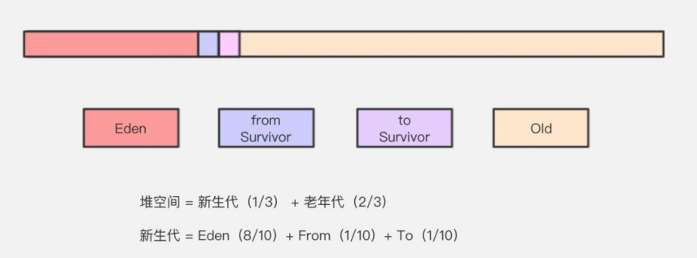
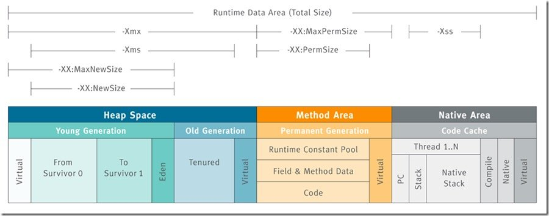
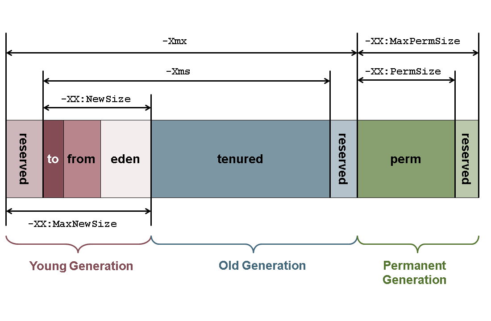
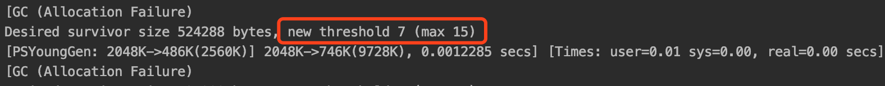
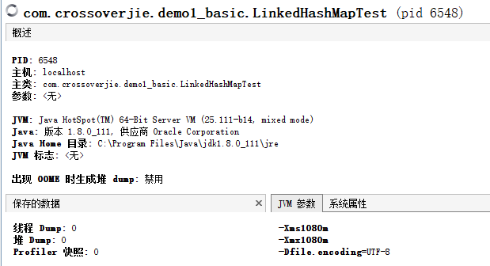
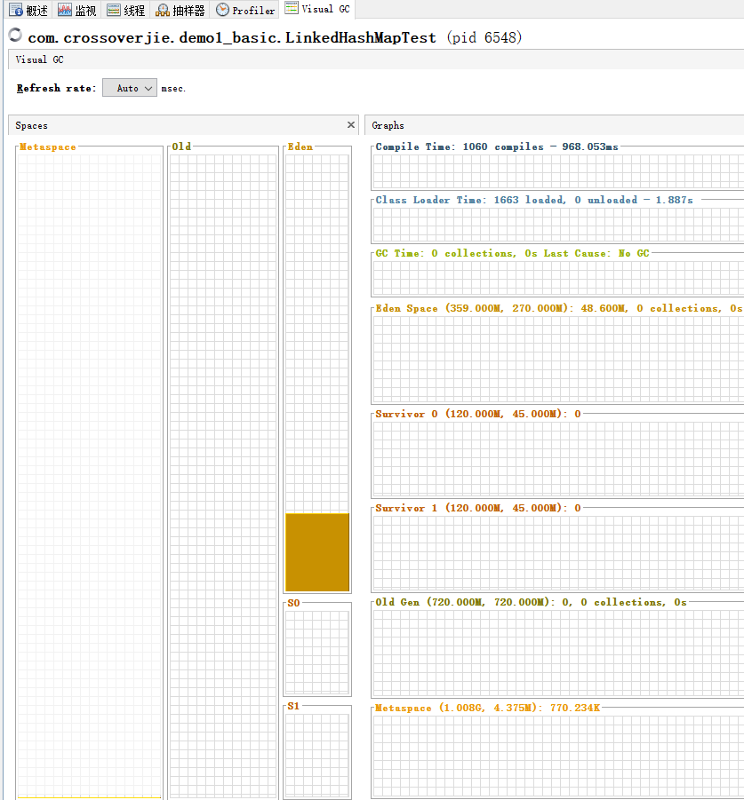

# 5.JVM参数

门户论坛： [https://www.heapdump.cn](https://www.heapdump.cn)

不管是YGC还是Full GC，GC过程中都会对导致程序运行中中断，正确的选择不同的GC策略，调整JVM、GC的参数，
可以极大的减少由于GC工作，而导致的程序运行中断方面的问题，进而适当的提高Java程序的工作效率。

## 1.Jvm参数

先看下面的这段参数配置：

Java -server -Xms4g -Xmx4g -Xmn512M -Xss256K -XX:SurvivorRatio=8 -XX:+UseParNewGC

Java程序通过这些参数，能够指定进程运行模式（server或client）、运行时堆栈的大小、垃圾回收器、垃圾回收算法等。

- 标准参数(-): jvm规定的，所有的jvm都必须实现的功能，且向下兼容，比如：-verbose:gc 和 -server
- 非标准参数(-X):jvm默认实现这些参数的功能，但是不保证所有的jvm都实现了，且不保证一定向下兼容
- 非stable参数(-XX): 此类参数在不同的jvm中有不同的实现，表示将来可能会改变或取消的参数。
  - -XX:+ 表示启动参数，
  - -XX:- 表示关闭参数。 

-XX参数主要分成3类
1. 行为参数（Behavioral Options）：用于改变 JVM 的一些基础行为，如启用串行/并行 GC
例如： -XX:+UseSerialGC //启动串行回收，-XX:+UseParallelGC//启用并行GC
2. 性能调优（Performance Tuning）：用于 jvm 的性能调优，如设置新老年代内存容量比例
例如： -XX:NewRatio=2
3. 调试参数（Debugging Options）：一般用于打开跟踪、打印、输出等 JVM参数，用于显示 JVM 更加详细的信息。比如：-XX:+PrintGC

## 2.内存设置





通过上图可以直观的查看各个区域的参数设置。

结合我们经常使用的一些jvm调优参数后，一些参数能影响的各区域内存大小值，示意图如下



jdk8开始，用MetaSpace区取代了Perm区（永久代），所以相应的jvm参数变成-XX:MetaspaceSize
及 -XX:MaxMetaspaceSize

### 2.1 内存参数

- -Xms512m 初始堆大小

实际工作中，此值推荐设置与-Xms相同，这样可以减少程序运行时进行的垃圾回收次数和空间扩展，从而提高程序性能。

写法： -Xms512m 或者 -Xms4g

默认值：物理内存的1/64(<1GB)

- -Xmx512m 堆最大值

整个堆大小=年轻代大小 +
年老代大小。堆的不同分布情况，对系统会产生一定的影响。尽可能将对象预留在新生代，减少老年代GC的次数（通常老年回收起来比较慢）。

实际工作中，此值推荐设置与-Xms相同，这样可以减少程序运行时进行的垃圾回收次数和空间扩展，从而提高程序性能。

写法： -Xmx512m 或者 -Xmx4g

默认值：物理内存的1/4(<1GB)

- -Xmn170m 年轻代最大值

此值对系统性能影响较大，Sun官方推荐配置为整个堆的3/8。一般在增大年轻代内存后，也会将会减小年老代大小。

写法 -Xmn512m或-XX:MaxNewSize=512m

- -XX:NewSize=30m 年轻代初始大小

新生代初始化大小为30m

- -XX:MaxNewSize=40m 年轻代最大值

新生代最大大小为40m

写法 -Xmn512m或-XX:MaxNewSize=512m

- -Xss128k 栈大小

设置每个线程的栈大小。JDK5.0以后每个线程栈大小为1M，以前每个线程栈大小为256K。根据应用的线程所需内存大小进行调整。

在相同物理内存下，减小这个值能生成更多的线程。但是操作系统对一个进程内的线程数还是有限制的，不能无限生成，经验值在3000~5000左右。

- -XX:NewRatio=2 年轻代占比

设置年轻代（包括Eden和两个Survivor区）与年老代的比值（除去持久代）。设置为2，则年轻代与年老代所占比值为1:2，年轻代占整个堆栈的1/3
。

-XX:NewRatio=老年代/新生代（默认=2）

- -XX:SurvivorRatio=8

设置年轻代中Eden区与Survivor区的大小比值。设置为8，则两个Survivor区与一个Eden区的比值为1:8，一个Survivor区占整个年轻代的1/8。

-XX:SurvivorRatio=Eden/survivor（默认=8）

- -XX:PermSize=128m 永久代初始值

jdk8开始，用MetaSpace区取代了Perm区

- -XX:MaxPermSize=16m 永久代最大值

jdk8开始，用MetaSpace区取代了Perm区

设置持久代大小为16m，上面也说了，持久代一般固定的内存大小为64m。

- -XX:MetaspaceSize=100M meta区初始值

jdk8开始，用MetaSpace区取代了Perm区

- -XX:MaxMetaspaceSize=200M meta区最大值

jdk8开始，用MetaSpace区取代了Perm区

- -XX:MaxTenuringThreshold=6 对象最大年龄

设置垃圾最大年龄，直到达到阈值就移动到老年代中。这个默认值与垃圾回收器有关，CMS是6，G1是15。

如果设置为0的话，则年轻代对象不经过Survivor区，直接进入年老代。对于年老代使用比较多的应用，可以提高效率。

如果将此值设置为一个较大值，则年轻代对象会在Survivor区进行多次复制，每复制一次生命+1，
这样可以增加对象再年轻代的存活时间，增加在年轻代即被回收的概论。

虽然设置了最大年龄，但是它会根据动态年龄判断规则来重新被赋值。
我们可以使用-XX:+PrintTenuringDistribution来查看真实的晋升年龄（预示着出现 promotion failed）

- -XX:+PrintTenuringDistribution

JVM 在每次新生代GC时，打印出幸存区中对象的年龄分布。

如下就是某次GC后，部分对象经过7次GC，新生代对象晋升到老年代，而最大允许的年龄阈值为15



- -XX:MaxHeapFreeRatio=70 空闲堆空间最大占比

计算公式为：HeapFreeRatio =(CurrentFreeHeapSize/CurrentTotalHeapSize) *
100，值的区间为0到100，默认值为 70。如果HeapFreeRatio >
MaxHeapFreeRatio，则需要进行堆缩容，缩容的时机应该在每次垃圾回收之后。

Xmx==Xms 的情况下无效

- -XX:MinHeapFreeRatio=40 空闲堆空间最小占比

计算公式为：HeapFreeRatio =(CurrentFreeHeapSize/CurrentTotalHeapSize) *
100，值的区间为0到100，默认值为 40。如果HeapFreeRatio <
MinHeapFreeRatio，则需要进行堆扩容，扩容的时机应该在每次垃圾回收之后。

Xmx==Xms 的情况下无效

- -XX:LargePageSizeInBytes=128m 内存大页

指定 Java heap 的分页页面大小 ， 如 :-XX:LargePageSizeInBytes=128m

- -XX:+HeapDumpOnOutOfMemoryError

当发生内存溢出时 dump 内存，这个参数一般跟HeapDumpPath一起使用。

- -XX:HeapDumpPath=文件

当设置了HeapDumpOnOutOfMemoryError时，会将dump文件保存到这个目录下面

-XX:HeapDumpPath=/tmp/heapdump.hprof

- -XX:SoftRefLRUPolicyMSPerMB=1s 软引用存活时间

每兆堆空闲空间中SoftReference的存活时间。默认1S

- -XX:TLABWasteTargetPercent=1 TLAB占比

TLAB占eden区的百分比。

- -XX:PretenureSizeThreshold=<byte size>

对象的大小阈值。大于阈值的话，直接分配到老年代

### 2.2. 估算内存分配

新生代和老年代的默认比例为 1:2，也就是说新生代占用1/3的堆内存，而老年代占用 2/3 的堆内存。

可以通过参数 -XX:NewRatio=3 （默认=2） 来设置老年代/新生代的比例

老年代（不包括永久区）和新生代（Eden + 2 * s）的比如。

3表示 老年代/新生代 = 3/1 = 3。

如果堆最大是128m。则老年代最大=128*3/4=96m。新生代最大=128*1/4=32m

比如设置阈值
-XX:MaxTenuringThreshold=15。直到达到阈值(默认为15)就移动到老年代中。

上面划分了老年代和新生代，这里是继续将新生代进行划分-XX:SurvivorRatio=8（默认=8）

SurvivorRatio用来设置两个survivor和1个Eden的比例8， 表示 1个survivor / 1个Eden 的比例。所以是将新生代分为10份。

比如新生代=32m。则Eden = 32 * 8 / 10 = 25.6m. s1=s2=32 * 1 / 10=3.2m。

但是JDK对堆的设置会进行优化。比如可能出现的结果是 s1 = s2 = 4m， Eden =24m。

这种情况即使在新生代很大的情况下也会出现。比如新生代=360m。s1 = s2 =45， Eden = 270。

比如。运行一个main方法。设置-Xms1080m -Xmx1080m。使用jvisualvm监控JVM运行状态





## 3.Gc参数

### 3.1.CMS回收器参数

#### 3.1.1. -XX:+UseConcMarkSweepGC 开启CMS

再JDK1.8之前的很多个版本，都默认使用的CMS。

#### 3.1.2. -XX:CMSFullGCsBeforeCompaction=10

CMS多少次后进行内存压缩。由于并发收集器不对内存空间进行压缩，整理，所以运行一段时间以后会产生内存碎片，使得运行效率降低。此值设置运行多少次GC以后对内存空间进行压缩，整理。

#### 3.1.3. -XX:UseCMSCompactAtFullCollection 与 -XX:CMSFullGCsBeforeCompaction

有一点需要注意的是：CMS并发GC不是“full GC”。HotSpot VM里对concurrent
collection和full
collection有明确的区分。所有带有“FullCollection”字样的VM参数都是跟真正的full
GC相关，而跟CMS并发GC无关的。

CMS GC要决定是否在full GC时做压缩，会依赖几个条件。其中，

- 第一种条件，UseCMSCompactAtFullCollection 与
  CMSFullGCsBeforeCompaction
  是搭配使用的；前者目前默认就是true了，也就是关键在后者上。
- 第二种条件是用户调用了System.gc()，而且DisableExplicitGC没有开启。
- 第三种条件是young
  gen报告接下来如果做增量收集会失败；简单来说也就是young gen预计old
  gen没有足够空间来容纳下次young GC晋升的对象。

上述三种条件的任意一种成立都会让CMS决定这次做full GC时要做压缩。

CMSFullGCsBeforeCompaction
说的是，在上一次CMS并发GC执行过后，到底还要再执行多少次full
GC才会做压缩。默认是0，也就是在默认配置下每次CMS GC顶不住了而要转入full
GC的时候都会做压缩。
把CMSFullGCsBeforeCompaction配置为10，就会让上面说的第一个条件变成每隔10次真正的full
GC才做一次压缩（而不是每10次CMS并发GC就做一次压缩，目前VM里没有这样的参数）。这会使full
GC更少做压缩，也就更容易使CMS的old gen受碎片化问题的困扰。
本来这个参数就是用来配置降低full GC压缩的频率，以期减少某些full
GC的暂停时间。CMS回退到full
GC时用的算法是mark-sweep-compact，但compaction是可选的，不做的话碎片化会严重些但这次full
GC的暂停时间会短些；这是个取舍。

#### 3.1.4. -XX:CMSInitiatingOccupancyFraction=70 和-XX:+UseCMSInitiatingOccupancyOnly

这两个设置一般配合使用，一般用于『降低CMS GC频率或者增加频率、减少GC时长』的需求

-XX:CMSInitiatingOccupancyFraction=70
在使用CMS作为垃圾回收器的时候，老年代内存占用率达到70%的时候开始GC(因为CMS会有内存碎片，所以一般都较早启动GC)；默认值=92%

-XX:+UseCMSInitiatingOccupancyOnly
只是用设定的回收阈值(上面指定的70%)，如果不指定，JVM仅在第一次使用设定值，后续则自动调整

#### 3.1.5. -XX:CMSInitiatingPermOccupancyFraction=92

设置Perm Gen使用到达多少比率时触发CMS

#### 3.1.6. -XX:+CMSScavengeBeforeRemark

在CMS GC前启动一次ygc，目的在于减少old gen对ygc
gen的引用，降低remark时的开销-----一般CMS的GC耗时 80%都在remark阶段

#### 3.1.7. -XX:+CMSParallelRemarkEnabled

降低标记停顿

### 3.2.G1回收器参数

#### 3.2.1. -XX:+UseG1GC 开启G1

#### 3.2.2. -XX:G1HeapRegionSize=1M 设置Region大小

值是2的幂，范围是1MB到32MB之间，目标是根据最小的Java堆大小划分出约2048个区域。默认是堆内存的1/2000。

#### 3.2.3. -XX:MaxGCPauseMillis GC最大停顿时长

设置期望达到的最大GC停顿时间指标(JVM会尽力实现，但不保证达到)。默认值是200ms。

#### 3.2.4. -XX:InitiatingHeapOccupancyPercent

设置触发并发GC周期的Java堆占用率阈值。超过此值，就触发GC。默认值是45。

#### 3.2.5. -XX:G1NewSizePercent 与 XX:G1MaxNewSizePercent

新生代比例有两个数值指定

下限：-XX:G1NewSizePercent，默认值5%，

上限：-XX:G1MaxNewSizePercent，默认值60%

G1会根据实际的GC情况(主要是暂停时间)来动态的调整新生代的大小，主要是Eden Region的个数。
最好是Eden的空间大一点，毕竟Young GC的频率更大，大的Eden空间能够降低Young GC的发生次数。
但是Mixed GC是伴随着Young GC一起的，如果暂停时间短，那么需要更加频繁的Young GC，
同时也需要平衡好Mixed GC中新生代和老年代的Region，因为新生代的所有Region都会被回收，
如果Eden很大，那么留给老年代回收空间就不多了，最后可能会导致Full GC。

#### 3.2.6. -XX:G1ReservePercent 分配担保预留的空间比例

默认10%。也就是老年代会预留10%的空间来给新生代的对象晋升，如果经常发生新生代晋升失败而导致Full
GC，那么可以适当调高此阈值。但是调高此值同时也意味着降低了老年代的实际可用空间。

#### 3.3.7. -XX:+UseParallelGC 并发收集器

只对新生代生效

#### 3.3.8. -XX:+UseParNewGC 年轻代并行收集器

可以和CMS收集器同时使用。Jdk5~8默认设置此值

#### 3.3.9. -XX:ParallelGCThreads=8 并发回收线程数

此值最好配置与处理器数目相等 同样适用于CMS，最大可以设置到8

#### 3.3.10. -XX:ConcGCthreads=2 并发标记线程数

将n设置为并行垃圾回收线程数(ParallelGCThreads)的1/4左右

#### 3.3.11. -XX:+UseParallelOldGC 老年代并行收集器

可选收集器。

#### 3.3.12. -XX:MaxGCPauseMillis 年轻代回收最大时间长

每次年轻代垃圾回收的最长时间(最大暂停时间)

#### 3.3.13. -XX:+UseAdaptiveSizePolicy 自动堆栈比例

并行收集器会自动选择年轻代区大小和相应的Survivor区比例，以达到目标系统规定的最低相应时间或者收集频率等，此值建议使用并行收集器时，一直打开

#### 3.3.14. -XX:GCTimeRatio gc时间占比

设置垃圾回收时间占程序运行时间的百分比

#### 3.3.15. -XX:+CollectGen0First FullGC时是否先YGC

默认值：false

作用相同： -XX:-ScavengeBeforeFullGC

#### 3.3.16. -Xnoclassgc 禁用class的垃圾回收

默认值：false

### 3.3. Gc日志参数

| 命令                                  | 说明                                                     | 案例                                                                                              |
| --------------------------------------- | ---------------------------------------------------------- | --------------------------------------------------------------------------------------------------- |
| -verbose:gc                           | 垃圾回收日志                                             |                                                                                                   |
| -XX:+PrintGC                          | 输出 GC 日志                                             | [GC 118250K->113543K(130112K), 0.0094143 secs]   [Full GC 121376K->10414K(130112K), 0.0650971 secs]                                              |
| -XX:+PrintGCDetails                   | 输出 GC 的详细日志                                       | [GC [DefNew: 8614K->781K(9088K), 0.0123035 secs] 118250K->113543K(130112K), 0.0124633 secs] |
| -XX:+PrintGCTimeStamps                | 输出 GC 的时间戳（以基准时间的形式）                     |                                                                                                   |
| -XX:+PrintGCDateStamps                | 输出 GC 的时间戳                                         | 以日期的形式，如 2013-05-04T21:53:59.234+0800                                                     |
| -XX:+PrintHeapAtGC                    | 在进行 GC 的前后打印出堆的信息                           |                                                                                                   |
| -Xloggc:D:/gc.log                     | 日志文件的输出路径                                       |                                                                                                   |
| -XX:+PrintGCApplicationStoppedTime    | 打印垃圾回收期间程序暂停的时间.可与上面混合使用          | 输出形式:Total time for which application threads were stopped: 0.0468229 seconds                 |
| -XX:+PrintGCApplicationConcurrentTime | 打印每次垃圾回收前，程序未中断的执行时间.可与上面混合使用 | 输出形式:Application time: 0.5291524 seconds                                                      |
| XX:+PrintHeapAtGC                     | 打印GC前后的详细堆栈信息                                 |                                                                                                   |
| -XX:+PrintTLAB                        | 查看TLAB空间的使用情况                                   |                                                                                                   |
| XX:+PrintTenuringDistribution         | 查看每次minor GC后新的存活周期的阈值                     | Desired survivor size 1048576 bytes, new threshold 7 (max 15)new threshold 7即标识新的存活周期的阈值为7。|

## 4.其他参数
- -XX:-userBiasedLocking=false 关闭偏向锁，并默认进入轻量锁。

偏向锁可以提高带有同步却没有竞争的程序性能，但如果程序中大多数锁都存在竞争时，那偏向锁就起不到太大作用。

- -XX:ThreadStackSize=512 线程栈大小

设置线程栈大小，若为0则使用系统默认值

- -XX:+OmitStackTraceInFastThrow 开启快速抛异常

使用案例：*https://blog.csdn.net/qq_27243343/article/details/118932425*

JIT会做一些运行时的优化，如果有些系统的异常抛得过多，会对这些异常做一些处理，使用JVM初始化的时候创建的那些异常对象来替代本应该新建的异常对象，因此这些异常栈是空的

- -XX:+PrintCommandLineFlags 查看默认参数

用法：java -XX:+PrintCommandLineFlags -version
```shell
C:\\Users\\zhangxue> java -XX:+PrintCommandLineFlags -version

-XX:InitialHeapSize=265738560 -XX:MaxHeapSize=4251816960
-XX:+PrintCommandLineFlags -XX:+UseCompressedClassPointers
-XX:+UseCompressedOops -XX:-UseLargePagesIndividualAllocation
-XX:+UseParallelGC

java version "1.8.0_111"

Java(TM) SE Runtime Environment (build 1.8.0_111-b14)

Java HotSpot(TM) 64-Bit Server VM (build 25.111-b14， mixed mode)
```

```shell
D:\\Program Files\\jdk\\jdk-13\\bin> java -XX:+PrintCommandLineFlags -version

-XX:G1ConcRefinementThreads=8 -XX:GCDrainStackTargetSize=64
-XX:InitialHeapSize=265738560 -XX:MaxHeapSize=4251816960
-XX:MinHeapSize=6815736 -XX:+PrintCommandLineFlags
-XX:ReservedCodeCacheSize=251658240 -XX:+SegmentedCodeCache
-XX:+UseCompressedClassPointers -XX:+UseCompressedOops -XX:+UseG1GC
-XX:-UseLargePagesIndividualAllocation

java version "13" 2019-09-17

Java(TM) SE Runtime Environment (build 13+33)

Java HotSpot(TM) 64-Bit Server VM (build 13+33, mixed mode, sharing)
```

- -XX:+UseFastAccessorMethods 方法快速优化

get，set 方法转成本地代码（对于jvm来说是冗余代码，jvm将进行优化）

- -XX:+DisableExplicitGC 关闭System.gc()

禁止程序调用GC

- -XX:+AggressiveOpts 快速编译

- -XX:+UseBiasedLocking 锁机制的性能改善

- -sun.zip.disableMemoryMapping=true 防止热替换jar包导致JVM崩溃(crash)
  - [JVM crash when overwritten running jar](https://www.jianshu.com/p/bf0a051e4c63)
  - [热替换jar包导致JVM崩溃(crash)](https://blog.csdn.net/jgteng/article/details/62893396)

原因：java读取jar包时，为了提高性能，默认使用了mmap，mmap是调用的本地方法，当jar包替换后如果又触发类加载就有可能导致异常，而jvm没法控制本地方法，从而导致jvm crash。


## 5.JVM实践

### 5.1.JVM线上配置注意

*https://www.jianshu.com/p/da7519377751*

### 5.2.【有利网】前端项目设置参数

消金电催前端，新增了给图片增加水印的功能，因为每个图片都有几兆，用户一多，内存的使用率就上去了。第一次上线后观察可视化界面，确实cms的次数由原来的半个一次，变成不到10分钟就一次

线上堆为4G，比例采用默认的。

因为前端的项目，没有什么需要进入老年代的对象，所有后面对新生代/老年代的比例设置为1:1，增大新生代比例，并增加存活年龄的值有15调大到了20，这样基本恢复到半小时一次的cms

*https://www.cnblogs.com/redcreen/archive/2011/05/05/2038331.html*

https://www.cnblogs.com/redcreen/tag/jvm

现象：

图片处理的系统，YongGc和FullGC频率，不处理图片的话是一天只出现2~3次

分析原因：

图片处理的系统，因为gc的时候，survivor放不下了，出现了新生代对象MaxTenuringThreshold没有到达阈值就动态年龄晋升的现象，这样一来老年代的内存增长加快，major
gc频率加快到半小时1次，每次STW时间约为500ms

解决方案：

1. 加大survivor：eden的比例为1:3，适当加大survivor，会增加parNew的时间，到达10ms~25ms（原来10ms以内），
   minior gc发生的频率提高，这样对象更能释放掉，对象从Eden进入survivor的数量会相对变少。
   minior gc时，survivor内存的不足的情况会极少发生。

2. 调整MaxTenuringThreshold=7，防止survivor内存不足。Cms默认是6

3.加大新生代/老年代比例为1:2，
默认比例，这样即使新生代对象全部进去来老年代，内存也是足够的，

4. CMSInitiatingOccupancyFractionCMS= 60，触发的major
gc阈值低一点（60%），高频cms与短的STW，
设置进行FullGC后0次进行整理，就是每次都整理，防止发生 promotion failed
与 concurrent mode failure (发生后CMS会降级为 serial old，导致更久的STW)

CMS之promotion failed&concurrent mode failure:
*https://www.jianshu.com/p/ca1b0d4107c5*

### 5.3.spring-boot 生产环境项目启动参数
```shell
nohup java -Xmx4096M -Xms4096M -Xmn640M -XX:MetaspaceSize=1024M -XX:MaxMetaspaceSize=1024M -Xss256K 
-XX:+DisableExplicitGC -XX:SurvivorRatio=8 -XX:+UseConcMarkSweepGC -XX:+UseParNewGC 
-XX:+CMSParallelRemarkEnabled -XX:+UseCMSCompactAtFullCollection -XX:CMSFullGCsBeforeCompaction=0 
-XX:+CMSClassUnloadingEnabled -XX:LargePageSizeInBytes=128M -XX:+UseFastAccessorMethods
-XX:+UseCMSInitiatingOccupancyOnly -XX:CMSInitiatingOccupancyFraction=80 -XX:SoftRefLRUPolicyMSPerMB=0 
-XX:+PrintClassHistogram -XX:+PrintGCDetails -XX:+PrintGCTimeStamps -XX:+PrintHeapAtGC 
-Xloggc:/data/home/www/yooli/logs/${proname}/${proname}.gc.${datename}.log -XX:+PrintGCDetails 
-XX:+PrintGCDateStamps -XX:+PrintHeapAtGC -XX:+PrintGCApplicationStoppedTime -jar 
/data/home/www/yooli/${proname}/${proname}.jar 
--spring.config.location=/data/home/www/yooli/${proname}/application-prd.properties >$logfile 2>&1 &
```

### 5.4.spring-boot 测试环境项目启动参数

```shell
nohup java -Xms500m -Xmx500m -Xmn100m -XX:PermSize=64m 
-XX:+UseParNewGC -XX:+UseConcMarkSweepGC -XX:+UseCMSCompactAtFullCollection 
-XX:CMSFullGCsBeforeCompaction=0 -XX:CMSInitiatingOccupancyFraction=70 
-Dcom.sun.management.jmxremote -Dcom.sun.management.jmxremote.port=1986 
-Dcom.sun.management.jmxremote.authenticate=false -Dcom.sun.management.jmxremote.ssl=false -jar task-web.war
 --spring.profiles.active=test --datasource.druid.url=jdbc:mysql://127.0.0.1:3306/task 
 --datasource.druid.username=root --datasource.druid.password=root &
```

### 5.5.Tomcat 生产环境项目启动参数
```shell
-Djava.util.logging.config.file=/usr/local/nplm-server/conf/logging.properties 
-Djava.util.logging.manager=org.apache.juli.ClassLoaderLogManager 
-Xms4096M -Xmx4096M -Xmn1024M -XX:MetaspaceSize=512M -XX:MaxMetaspaceSize=512M 
-Xverify:none 
-XX:SurvivorRatio=8 -XX:MaxTenuringThreshold=7 
-XX:GCTimeRatio=19 
-XX:+DisableExplicitGC 
-XX:+UseParNewGC 
-XX:+UseConcMarkSweepGC 
-XX:+CMSPermGenSweepingEnabled 
-XX:+UseCMSCompactAtFullCollection 
-XX:CMSFullGCsBeforeCompaction=0 
-XX:+CMSClassUnloadingEnabled 
-XX:-CMSParallelRemarkEnabled 
-XX:CMSInitiatingOccupancyFraction=70 
-XX:+HeapDumpOnOutOfMemoryError 
```


### 5.6.【网上收集】每天几百万pv
```shell
-Xmx4000M
-Xms4000M
-Xmn600M
-XX:PermSize=500M
-XX:MaxPermSize=500M
-Xss256K
-XX:+DisableExplicitGC
-XX:SurvivorRatio=1
-XX:+UseConcMarkSweepGC
-XX:+UseParNewGC
-XX:+CMSParallelRemarkEnabled
-XX:+UseCMSCompactAtFullCollection
-XX:CMSFullGCsBeforeCompaction=0
-XX:+CMSClassUnloadingEnabled
-XX:LargePageSizeInBytes=128M
-XX:+UseFastAccessorMethods
-XX:+UseCMSInitiatingOccupancyOnly
-XX:CMSInitiatingOccupancyFraction=80
-XX:SoftRefLRUPolicyMSPerMB=0
-XX:+PrintClassHistogram
-XX:+PrintGCDetails
-XX:+PrintGCTimeStamps
-XX:+PrintHeapAtGC
-Xloggc:log/gc.log
```
加大了survivor的比例

-Xnoclassgc禁用类垃圾回收，性能会高一点；

-XX:+DisableExplicitGC禁止System.gc()，免得程序员误调用gc方法影响性能；

-XX:+UseParNewGC，对年轻代采用多线程并行回收，这样收得快；

特点就是：年老代涨得很慢，CMS执行频率变小，CMS没有停滞，也不会有promotion failed问题，内存回收得很干净

## 6.最佳实践

### 6.1.年轻代大小选择

- 响应时间优先的应用：尽可能设大，直到接近系统的最低响应时间限制(根据实际情况选择)。
  在此种情况下，年轻代收集发生的频率也是最小的.同时，减少到达年老代的对象。
- 吞吐量优先的应用:尽可能的设置大，可能到达Gbit的程度.因为对响应时间没有要求，垃圾收集可以并行进行，
  一般适合8CPU以上的应用。
  
避免设置过小。当新生代设置过小时会导致:
1. YGC次数更加频繁
2. 可能导致YGC对象直接进入老年代，如果此时老年代满了，会触发Full GC

### 6.2.年老代大小选择

- 响应时间优先的应用:年老代使用并发收集器，所以其大小需要小心设置，一般要考虑并发会话率和会话持续时间等一些参数。
  如果堆设置小了，可以会造成内存碎片，高回收频率以及应用暂停而使用传统的标记清除方式；
  如果堆大了，则需要较长的收集时间。最优化的方案，一般需要参考以下数据获得:
  并发垃圾收集信息、持久代并发收集次数、传统GC信息、花在年轻代和年老代回收上的时间比例。
  
- 吞吐量优先的应用:一般吞吐量优先的应用都有一个很大的年轻代和一个较小的年老代。
  原因是，这样可以尽可能回收掉大部分短期对象，减少中期的对象，而年老代尽存放长期存活对象

### 6.3.较小堆引起的碎片问题

因为年老代的并发收集器使用标记-清除算法，所以不会对堆进行压缩。当收集器回收时，他会把相邻的空间进行合并，这样可以分配给较大的对象。
但是，当堆空间较小时，运行一段时间以后，就会出现"碎片"，如果并发收集器找不到足够的空间，那么并发收集器将会停止，
然后使用是串行的回收器。

如果出现"碎片"，可能需要进行如下配置:

-XX:+UseCMSCompactAtFullCollection:使用并发收集器时，开启对年老代的压缩.

-XX:CMSFullGCsBeforeCompaction=0:上面配置开启的情况下，这里设置多少次Full GC后，对老年代进行压缩

### 6.4.使用CMS的好处

用尽量少的新生代，经验值是128M－256M， 然后老年代利用CMS并行收集，这样能保证系统低延迟的吞吐效率。
实际上cms的收集停顿时间非常的短，2G的内存，大约20－80ms的应用程序停顿时间

### 6.5.使用缓存时的系统设置

年老代应该大一些，缓存的HashMap不应该无限制长，建议采用LRU算法的Map做缓存，LRUMap的最大长度也要根据实际情况设定。
并且将key设置为弱引用，保证缓存在不被强引用时，可以被回收掉。

### 6.6.堆占比

采用并发回收时，年轻代小一点，年老代要大，因为年老大用的是并发回收，即使时间长点也不会影响其他程序继续运行，
系统不会出现明显的停顿

### 6.7.promotion failed

promotion failed是个很头痛的问题，已经很大程度延长了 minor gc STW的时间，还将短期对象进去老年代，造成频繁的full GC

一般可能是两种原因产生：
- survivor不够，survivor中的对象还不应该被移动到年老代，但年轻代又有很多对象需要放入survivor；
- 年老代没有足够的空间接纳来自年轻代的对象；

这两种情况都会转向Full GC，卡顿时间较长。

解决方方案一
- 第一个原因我的最终解决办法是去掉survivor，设置-XX:SurvivorRatio=65536
  -XX:MaxTenuringThreshold=0即可
- 第二个原因我的解决办法是设置CMSInitiatingOccupancyFraction为某个值（假设70），这样年老代空间到70%时就开始执行CMS，年老代有足够的空间接纳来自年轻代的对象。

解决方案一的改进方案

上面方法不太好，因为没有用到survivor，所以年老代容易满，CMS执行会比较频繁。
我改善了一下，还是用survivor，但是把survivor加大，这样也不会有promotion failed。
适当减少 MaxTenuringThreshold的值，避免promotion failed时的STW。

这样即没有暂停又不会有promotoin failed，而且更重要的是，年老代和永久代上升非常慢（因为好多对象到不了年老代就被回收了），
所以CMS执行频率非常低，好几个小时才执行一次，这样，服务器都不用重启了。

CMSInitiatingOccupancyFraction值与Xmn的关系公式

上面介绍了promontion faild产生的原因是EDEN空间不足的情况下将EDEN与From survivor中的存活对象存入To survivor区时，
To survivor区的空间不足，再次晋升到old gen区，而old 区内存也不够的情况下产生了promontion faild从而导致full gc。
那可以推断出：eden+from survivor < old 区剩余内存时，不会出现promontion faild的情况，即：

(Xmx-Xmn)*(1-CMSInitiatingOccupancyFraction/100)>=(Xmn-Xmn/(SurvivorRatior+2))

进而推断出：
CMSInitiatingOccupancyFraction<=((Xmx-Xmn)-(Xmn-Xmn/(SurvivorRatior+2)))/(Xmx-Xmn)*100

例如：

当xmx=128 xmn=36 SurvivorRatior=1时  CMSInitiatingOccupancyFraction<=((128.0-36)-(36-36/(1+2)))/(128-36)*100=73.913

当xmx=128 xmn=24 SurvivorRatior=1时  CMSInitiatingOccupancyFraction<=((128.0-24)-(24-24/(1+2)))/(128-24)*100=84.615…

当xmx=3000 xmn=600 SurvivorRatior=1时 CMSInitiatingOccupancyFraction<=((3000.0-600)-(600-600/(1+2)))/(3000-600)*100=83.33

CMSInitiatingOccupancyFraction低于70% 需要调整xmn或SurvivorRatior值。
