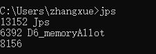

# 6.JVM工具

## 1.Jps

Java process status 就是java进程状态



左边是PID,右边是名称，没有名字的是eclipse。

- 参数 -m。 输出传递给main 方法的参数，在嵌入式jvm上可能是null

```shell
C:\\Users\\zhangxue>jps -m
6392 D6_memoryAllot
8600 Jps -m
8156
```

- 参数 -q 只显示pid，不显示class名称,jar文件名和传递给main 方法的参数

```shell
C:\\Users\\zhangxue>jps -q
6392
12764
8156
```

- 参数 -l 输出应用程序main class的完整package名 或者
  应用程序的jar文件完整路径名

```shell
C:\\Users\\zhangxue>jps -l
8324 sun.tools.jps.Jps
6392 com.zx.chapter_01_basic.D6_memoryAllot
8156
```

- 参数 -v 输出传递给JVM的参数

```shell
C:\\Users\\zhangxue>jps -v

8688 Jps -Denv.class.path=.;C:\\Program
Files\\Java\\jdk1.8.0_111\\lib\\dt.jar;C:\\Program
Files\\Java\\jdk1.8.0_111\\lib\\tools.jar;
-Dapplication.home=C:\\Program Files\\Java\\jdk1.8.0_111 -Xms8m

6392 D6_memoryAllot -verbose:gc -XX:+PrintGCDetails -XX:+UseSerialGC
-Xms20m -Xmx20m -Xmn10m -Dfile.encoding=UTF-8

8156 -Dosgi.requiredJavaVersion=1.8
-Dosgi.instance.area.default=@user.home/eclipse-workspace -XX:+UseG1GC
-XX:+UseStringDeduplication -Dosgi.requiredJavaVersion=1.8 -Xms256m
-Xmx1024m -javaagent:D:\\java\\eclipse-oxygen\\lombok.jar
```

## 2.Jstat

JVM Statistics Monitoring
Tool，是用于监视虚拟机运行时状态信息的命令，它可以显示出虚拟机进程中的类装载、内存、垃圾收集、JIT编译等运行数据。【性能分析】

### 2.1.命令格式

jstat [options] VMID [interval] [count]

参数

[options] : 操作参数，一般使用 -gcutil 查看gc情况

VMID : 本地虚拟机进程ID，即当前运行的java进程号

[interval] : 连续输出的时间间隔，单位为秒或者毫秒

[count] : 连续输出的次数，如果缺省打印无数次

### 2.2.options 参数总览

|Option     |Displays                                                 |
|------------------ |-----------------------------------------------------------------------------------------------------------------------------------------------------------|
|class      |类加载的行为统计。Statistics on the behavior of the class loader.                              |
|compiler     |HotSpt JIT编译器行为统计。Statistics of the behavior of the HotSpot Just-in-Time compiler.                       |
|gc       |垃圾回收堆的行为统计。Statistics of the behavior of the garbage collected heap.                          |
|gccapacity   |各个垃圾回收代容量(young,old,perm)和他们相应的空间统计。Statistics of the capacities of the generations and their corresponding spaces.        |
|gcutil     |垃圾回收统计概述（百分比）。Summary of garbage collection statistics.                              |
|gccause    |垃圾收集统计概述（同-gcutil），附加最近两次垃圾回收事件的原因。Summary of garbage collection statistics (same as -gcutil), with the cause of the last and  |
|gcnew      |新生代行为统计。Statistics of the behavior of the new generation.                              |
|gcnewcapacity  |新生代与其相应的内存空间的统计。Statistics of the sizes of the new generations and its corresponding spaces.                 |
|gcold      |年老代和永生代行为统计。Statistics of the behavior of the old and permanent generations.                       |
|gcoldcapacity  |年老代行为统计。Statistics of the sizes of the old generation.                               |
|gcpermcapacity   |永生代行为统计。Statistics of the sizes of the permanent generation.                             |
|printcompilation |HotSpot编译方法统计。HotSpot compilation method statistics.                                |


### 2.3.option 参数详解

- -class （监视类装载、卸载数量、总空间以及耗费的时间）
```shell
[root@localhost bin]# jstat -class 4513
Loaded Bytes Unloaded Bytes Time
8455 17240.8 0 0.0 15.47
Loaded : 加载class的数量
Bytes : class字节大小
Unloaded : 未加载class的数量
Bytes : 未加载class的字节大小
Time : 加载时间
```

- -compiler（输出JIT编译过的方法数量耗时等）
```shell
[root@localhost bin]# jstat -compiler 4513
Compiled Failed Invalid Time FailedType FailedMethod
1255 0 0 16.47 0
Compiled : 编译数量
Failed : 编译失败数量
Invalid : 无效数量
Time : 编译耗时
FailedType : 失败类型
FailedMethod : 失败方法的全限定名
```

- -gc（垃圾回收堆的行为统计，常用命令）

```shell
[root@localhost bin]# jstat -gc 4513
S0C     S1C     S0U     S1U EC      EU      OC      OU      PC      PU      YGC YGCT  FGC FGCT  GCT
5224.0  5348.0  19364.2 0.0 84864.0 74967.7 16448.0 8055.4  5236.0  52628.1 10  0.232 0   0.000 0.232

C即Capacity 总容量，U即Used 已使用的容量
S0C : survivor0区的总容量
S1C : survivor1区的总容量
S0U : survivor0区已使用的容量
S1U : survivor1区已使用的容量
EC : Eden区的总容量
EU : Eden区已使用的容量
OC : Old区的总容量
OU : Old区已使用的容量
PC : 当前perm的容量 (KB)
PU : perm的使用 (KB)
YGC : 新生代垃圾回收次数
YGCT : 新生代垃圾回收时间
FGC : 老年代垃圾回收次数
FGCT : 老年代垃圾回收时间
GCT : 垃圾回收总消耗时间
```

```shell
[root@localhost bin]# jstat -gc 4513 2000 2
# 这个命令意思就是每隔2000ms输出4513的gc情况，一共输出2次
```

- -gccapacity(同-gc，还会输出Java堆各区域使用到的最大、最小空间)

```shell
[root@localhost bin]# jstat -gccapacity 4513

NGCMN NGCMX NGC S0C S1C EC OGCMN OGCMX OGC OC PGCMN PGCMX PGC PC YGC FGC
84480.0 1349632.0 913408.0 54272.0 51200.0 502784.0 168448.0 2699264.0
168448.0 168448.0 21504.0 83968.0 51712.0 51712.0 9 0

NGCMN : 新生代占用的最小空间
NGCMX : 新生代占用的最大空间
OGCMN : 老年代占用的最小空间
OGCMX : 老年代占用的最大空间
OGC：当前年老代的容量 (KB)
OC：当前年老代的空间 (KB)
PGCMN : perm占用的最小空间
PGCMX : perm占用的最大空间
```

- -gcutil（同-gc，输出的是已使用空间占总空间的百分比）
```shell
[root@localhost bin]# jstat -gcutil 4513
S0 S1 E O P YGC YGCT FGC FGCT GCT
0.00 79.23 38.90 39.92 99.74 9 0.198 0 0.000 0.198
```

- -gccause（垃圾收集统计概述（同-gcutil），附加最近两次垃圾回收事件的原因）
```shell
[root@localhost bin]# jstat -gccause 4513
S0 S1 E O P YGC YGCT FGC FGCT GCT LGCC GCC
0.00 79.23 39.37 39.92 99.74 9 0.198 0 0.000 0.198 Allocation Failure No GC
LGCC：最近垃圾回收的原因
GCC：当前垃圾回收的原因
```


- -gcnew（统计新生代行为）
```shell
[root@localhost bin]# jstat -gcnew 4513
S0C S1C S0U S1U TT MTT DSS EC EU YGC YGCT
54272.0 51200.0 0.0 40565.8 2 15 54272.0 502784.0 197950.5 9 0.198
TT：Tenuring threshold(提升阈值)
MTT：最大的tenuring threshold
DSS：survivor区域大小 (KB)
```

- -gcnewcapacity（新生代与其相应的内存空间的统计）
```shell
[root@localhost bin]# jstat -gcnewcapacity 4513
NGCMN NGCMX NGC S0CMX S0C S1CMX S1C ECMX EC YGC FGC
84480.0 1349632.0 913408.0 449536.0 54272.0 449536.0 51200.0 1348608.0
502784.0 9 0
NGC:当前年轻代的容量 (KB)
S0CMX:最大的S0空间 (KB)
S0C:当前S0空间 (KB)
ECMX:最大eden空间 (KB)
EC:当前eden空间 (KB)
```

- -gcold（统计老年代行为）
```shell
[root@localhost bin]# jstat -gcold 4513
PC PU OC OU YGC FGC FGCT GCT
51712.0 51575.1 168448.0 67239.6 9 0 0.000 0.198
```

- -gcoldcapacity（老年代与其相应的内存空间的统计）
```shell
[root@localhost bin]# jstat -gcoldcapacity 4513
OGCMN OGCMX OGC OC YGC FGC FGCT GCT
168448.0 2699264.0 168448.0 168448.0 9 0 0.000 0.198
```

- -gcpermcapacity（永久代与其相应内存空间的统计）
```shell
[root@localhost bin]# jstat -gcpermcapacity 4513
PGCMN PGCMX PGC PC YGC FGC FGCT GCT
21504.0 83968.0 51712.0 51712.0 9 0 0.000 0.19
```

- -printcompilation（hotspot编译方法统计）
```shell
[root@localhost bin]# jstat -printcompilation 4513
Compiled Size Type Method
1261 1261 1
java/util/concurrent/ScheduledThreadPoolExecutor$DelayedWorkQueue take
```

Compiled：被执行的编译任务的数量

Size：方法字节码的字节数

Type：编译类型

Method：编译方法的类名和方法名。类名使用"/" 代替 "." 作为空间分隔符.
方法名是给出类的方法名. 格式是一致于HotSpot - XX:+PrintComplation 选项

例如：先使用jps获取Tomcat的进程，在使用jstat -gcutil 12564
获得监控信息。


## 3.Jinfo

JVM Configuration info这个命令作用是实时查看和调整虚拟机运行参数。
之前的jps
-v口令只能查看到显示指定的参数，如果想要查看未被显示指定的参数的值就要使用jinfo口令

### 3.1.JVM配置参数调整查看
```shell
[root@localhost bin]# jinfo -help
Usage:
    jinfo <option> <pid>
       (to connect to a running process)

where <option> is one of:
    -flag <name>         to print the value of the named VM flag
    -flag [+|-]<name>    to enable or disable the named VM flag
    -flag <name>=<value> to set the named VM flag to the given value
    -flags               to print VM flags
    -sysprops            to print Java system properties
    <no option>          to print both VM flags and system properties
    -? | -h | --help | -help to print this help message
```

### 3.2.参数

-flag：输出指定args参数的值

-flags：输出所有JVM参数的值

-sysprops：输出系统属性，等同于System.getProperties()

### 3.3.例子
```shell
[root@localhost bin]# jinfo -sysprops 24971 | more

Attaching to process ID 24971, please wait...

Debugger attached successfully.

Server compiler detected.

JVM version is 24.79-b02

java.runtime.name = Java(TM) SE Runtime Environment

java.vm.version = 24.79-b02

sun.boot.library.path = /usr/local/java/jdk1.7.0_79/jre/lib/amd64

shared.loader =

java.vendor.url = http://java.oracle.com/

java.vm.vendor = Oracle Corporation

path.separator = :

file.encoding.pkg = sun.io

java.vm.name = Java HotSpot(TM) 64-Bit Server VM

java.util.logging.config.file =
/home/yuhuo-tomcat/tomcat2/conf/logging.properties

tomcat.util.buf.StringCache.byte.enabled = true

sun.os.patch.level = unknown

sun.java.launcher = SUN_STANDARD

user.country = CN

user.dir = /home/yuhuo-tomcat/tomcat2/bin

java.vm.specification.name = Java Virtual Machine Specification

java.runtime.version = 1.7.0_79-b15

org.apache.catalina.startup.TldConfig.jarsToSkip = tomcat7-websocket.jar

java.awt.graphicsenv = sun.awt.X11GraphicsEnvironment

os.arch = amd64
```

```shell
[root@localhost bin]# jinfo -flag MaxPermSize 24971

-XX:MaxPermSize=85983232

jinfo -flag ThreadStackSize 24971

-XX:ThreadStackSize=1024
```

## 4.Jmap

JVM Memory Map命令用于生成heap
dump文件，如果不使用这个命令，还可以使用-XX:+HeapDumpOnOutOfMemoryError参数来让虚拟机出现OOM的时候自动生成dump文件。
jmap不仅能生成dump文件，还可以查询finalize执行队列、Java堆和永久代的详细信息，如当前使用率、当前使用的是哪种收集器等。【内存分析】

```shell
[root@localhost jdk1.7.0_79]# jmap --help
Usage:
    jmap -clstats <pid>
        to connect to running process and print class loader statistics
    jmap -finalizerinfo <pid>
        to connect to running process and print information on objects awaiting finalization
    jmap -histo[:live] <pid>
        to connect to running process and print histogram of java object heap
        if the "live" suboption is specified, only count live objects
    jmap -dump:<dump-options> <pid>
        to connect to running process and dump java heap
    jmap -? -h --help
        to print this help message

    dump-options:
      live         dump only live objects; if not specified,
                   all objects in the heap are dumped.
      format=b     binary format
      file=<file>  dump heap to <file>

    Example: jmap -dump:live,format=b,file=heap.bin <pid>
```

### 4.1.命令格式

jmap [ option ] pid

jmap [ option ] executable core

jmap [ option ] [server-id@]remote-hostname-or-IP

### 4.2.参数

option：选项参数，不可同时使用多个选项参数

pid：java进程id，命令ps -ef | grep java获取

executable：产生核心dump的java可执行文件

core：需要打印配置信息的核心文件

remote-hostname-or-ip：远程调试的主机名或ip

server-id：可选的唯一id，如果相同的远程主机上运行了多台调试服务器，用此选项参数标识服务器

### 4.3.options参数

heap : 显示Java堆详细信息

histo : 显示堆中对象的统计信息

permstat :Java堆内存的永久保存区域的类加载器的统计信息

finalizerinfo :
显示在F-Queue队列等待Finalizer线程执行finalizer方法的对象

dump : 生成堆转储快照

F : 当-dump没有响应时，强制生成dump快照

### 4.4.参数详解

- -dump

dump堆到文件,format指定输出格式，live指明是活着的对象,file指定文件名

```shell
[root@localhost jdk1.7.0_79]# jmap -dump:live,format=b,file=dump.hprof 24971
Dumping heap to /usr/local/java/jdk1.7.0_79/dump.hprof ...
Heap dump file created
```

- -heap

打印heap的概要信息，GC使用的算法，heap的配置及使用情况，可以用此来判断内存目前的使用情况以及垃圾回收情况

```shell
[root@localhost jdk1.7.0_79]# jmap -heap 24971
Attaching to process ID 24971, please wait...
Debugger attached successfully.
Server compiler detected.
JVM version is 24.79-b02
 
using thread-local object allocation.
Parallel GC with 4 thread(s)
 
Heap Configuration:
   MinHeapFreeRatio = 0
   MaxHeapFreeRatio = 100
   MaxHeapSize      = 4146069504 (3954.0MB)
   NewSize          = 1310720 (1.25MB)
   MaxNewSize       = 17592186044415 MB
   OldSize          = 5439488 (5.1875MB)
   NewRatio         = 2
   SurvivorRatio    = 8
   PermSize         = 21757952 (20.75MB)
   MaxPermSize      = 85983232 (82.0MB)
   G1HeapRegionSize = 0 (0.0MB)
 
Heap Usage:
PS Young Generation
Eden Space:
   capacity = 517996544 (494.0MB)
   used     = 151567520 (144.54605102539062MB)
   free     = 366429024 (349.4539489746094MB)
   29.26033421566612% used
From Space:
   capacity = 41943040 (40.0MB)
   used     = 0 (0.0MB)
   free     = 41943040 (40.0MB)
   0.0% used
To Space:
   capacity = 40370176 (38.5MB)
   used     = 0 (0.0MB)
   free     = 40370176 (38.5MB)
   0.0% used
PS Old Generation
   capacity = 115343360 (110.0MB)
   used     = 32927184 (31.401809692382812MB)
   free     = 82416176 (78.59819030761719MB)
   28.54709972034801% used
PS Perm Generation
   capacity = 85983232 (82.0MB)
   used     = 54701200 (52.16712951660156MB)
   free     = 31282032 (29.832870483398438MB)
   63.6184506300019% used
 
20822 interned Strings occupying 2441752 bytes.
```

- -finalizerinfo

打印等待回收的对象信息，

```shell
[root@localhost jdk1.7.0_79]# jmap -finalizerinfo 24971
Attaching to process ID 24971, please wait...
Debugger attached successfully.
Server compiler detected.
JVM version is 24.79-b02
Number of objects pending for finalization: 0
```
Number of objects pending for finalization: 0
说明当前F-QUEUE队列中并没有等待Fializer线程执行finalizer方法的对象。

- -histo

打印堆的对象统计，包括对象数、内存大小等等。jmap -histo:live
这个命令执行，JVM会先触发gc，然后再统计信息

```shell
[root@localhost jdk1.7.0_79]# jmap -histo:live 24971 | more
 num     #instances         #bytes  class name
----------------------------------------------
   1:        100134       14622728  <constMethodKlass>
   2:        100134       12830128  <methodKlass>
   3:         88438       12708392  [C
   4:          8271       10163584  <constantPoolKlass>
   5:         27806        9115784  [B
   6:          8271        6225312  <instanceKlassKlass>
   7:          6830        5632192  <constantPoolCacheKlass>
   8:         86717        2081208  java.lang.String
   9:          2264        1311720  <methodDataKlass>
  10:         10880         870400  java.lang.reflect.Method
  11:          8987         869888  java.lang.Class
  12:         13330         747264  [[I
  13:         11808         733872  [S
  14:         20110         643520  java.util.concurrent.ConcurrentHashMap$HashEntry
  15:         18574         594368  java.util.HashMap$Entry
  16:          3668         504592  [Ljava.util.HashMap$Entry;
  17:         30698         491168  java.lang.Integer
  18:          2247         486864  [I
  19:          7486         479104  java.net.URL
  20:          8032         453616  [Ljava.lang.Object;
  21:         10259         410360  java.util.LinkedHashMap$Entry
  22:           699         380256  <objArrayKlassKlass>
  23:          5782         277536  org.apache.catalina.loader.ResourceEntry
  24:          8327         266464  java.lang.ref.WeakReference
  25:          2374         207928  [Ljava.util.concurrent.ConcurrentHashMap$HashEntry;
  26:          3440         192640  java.util.LinkedHashMap
  27:          4779         191160  java.lang.ref.SoftReference
  28:          3576         171648  java.util.HashMap
  29:         10080         161280  java.lang.Object
```

jmap -histo:live 24971 | grep com.yuhuo 查询类名包含com.yuhuo的信息

jmap -histo:live 24971 | grep com.yuhuo > histo.txt
保存信息到histo.txt文件

附 - jmap输出中class name非自定义类的说明：

|BaseTypeCharacter| Type |   Interpretation|
|-----------------|------|-----------------|
|B        |byte    |signedbyte|
|C        |char    |Unicodecharacter|
|D        |double  |double-precisionfloating-pointvalue|
|F        |float   |single-precisionfloating-pointvalue|
|I        |int     |integer|
|J        |long    |longinteger|
|L;       |reference| aninstanceofclass|
|S        |short   | signedshort|
|Z        |boolean   |trueorfalse|
|[        |reference |onearraydimension，[I表示int[]|

- -permstat

打印Java堆内存的永久区的类加载器的智能统计信息。对于每个类加载器而言，它的名称、活跃度、地址、父类加载器、它所加载的类的数量和大小都会被打印。此外，包含的字符串数量和大小也会被打印。

```shell
[root@localhost jdk1.7.0_79]# jmap -permstat 24971
Attaching to process ID 24971, please wait...
Debugger attached successfully.
Server compiler detected.
JVM version is 24.79-b02
finding class loader instances ..done.
computing per loader stat ..done.
please wait.. computing liveness....................................................liveness analysis may be inaccurate ...
class_loader    classes bytes   parent_loader   alive?  type
 
<bootstrap>   3034    18149440      null      live    <internal>
0x000000070a88fbb8  1   3048      null      dead    sun/reflect/DelegatingClassLoader@0x0000000703c50b58
0x000000070a914860  1   3064    0x0000000709035198  dead    sun/reflect/DelegatingClassLoader@0x0000000703c50b58
0x000000070a9fc320  1   3056    0x0000000709035198  dead    sun/reflect/DelegatingClassLoader@0x0000000703c50b58
0x000000070adcb4c8  1   3064    0x0000000709035198  dead    sun/reflect/DelegatingClassLoader@0x0000000703c50b58
0x000000070a913760  1   1888    0x0000000709035198  dead    sun/reflect/DelegatingClassLoader@0x0000000703c50b58
0x0000000709f3fd40  1   3032      null      dead    sun/reflect/DelegatingClassLoader@0x0000000703c50b58
0x000000070923ba78  1   3088    0x0000000709035260  dead    sun/reflect/DelegatingClassLoader@0x0000000703c50b58
0x000000070a88fff8  1   3048      null      dead    sun/reflect/DelegatingClassLoader@0x0000000703c50b58
0x000000070adcbc58  1   1888    0x0000000709035198  dead    sun/reflect/DelegatingClassLoader@0x0000000703c50b58
```

- -F

强制模式。如果指定的pid没有响应，请使用jmap -dump或jmap
-histo选项。此模式下，不支持live子选项。

## 5.Jhat

Jhat在jdk11时被删除

JVM Heap Analysis Tool命令是与jmap搭配使用，用来分析jmap生成的dump，jhat内置了一个微型的HTTP/HTML服务器，生成dump的分析结果后，可以在浏览器中查看。在此要注意，一般不会直接在服务器上进行分析，因为jhat是一个耗时并且耗费硬件资源的过程，一般把服务器生成的dump文件复制到本地或其他机器上进行分析。【内存分析】

```shell
[root@localhost bin]# jhat -help
Usage:  jhat [-stack <bool>] [-refs <bool>] [-port <port>] [-baseline <file>] [-debug <int>] [-version] [-h|-help] <file>
 
    -J<flag>          Pass <flag> directly to the runtime system. For
              example, -J-mx512m to use a maximum heap size of 512MB
    -stack false:     Turn off tracking object allocation call stack.
    -refs false:      Turn off tracking of references to objects
    -port <port>:     Set the port for the HTTP server.  Defaults to 7000
    -exclude <file>:  Specify a file that lists data members that should
              be excluded from the reachableFrom query.
    -baseline <file>: Specify a baseline object dump.  Objects in
              both heap dumps with the same ID and same class will
              be marked as not being "new".
    -debug <int>:     Set debug level.
                0:  No debug output
                1:  Debug hprof file parsing
                2:  Debug hprof file parsing, no server
    -version          Report version number
    -h|-help          Print this help and exit
    <file>            The file to read
 
For a dump file that contains multiple heap dumps,
you may specify which dump in the file
by appending "#<number>" to the file name, i.e. "foo.hprof#3".
 
All boolean options default to "true"
```


### 5.1.参数

- -J< flag >

因为 jhat 命令实际上会启动一个JVM来执行, 通过 -J
可以在启动JVM时传入一些启动参数. 例如, -J-Xmx512m 则指定运行 jhat
的Java虚拟机使用的最大堆内存为 512 MB.
如果需要使用多个JVM启动参数,则传入多个 -Jxxxxxx.

- -stack false|true

关闭对象分配调用栈跟踪(tracking object allocation call stack)。
如果分配位置信息在堆转储中不可用. 则必须将此标志设置为 false. 默认值为
true.

- -refs false|true

关闭对象引用跟踪(tracking of references to objects)。 默认值为 true.
默认情况下,
返回的指针是指向其他特定对象的对象,如反向链接或输入引用(referrers or
incoming references), 会统计/计算堆中的所有对象。

- -port port-number

设置 jhat HTTP server 的端口号. 默认值 7000。

- -exclude exclude-file

指定对象查询时需要排除的数据成员列表文件(a file that lists data members
that should be excluded from the reachable objects query)。 例如,
如果文件列列出了 java.lang.String.value , 那么当从某个特定对象 Object o
计算可达的对象列表时, 引用路径涉及 java.lang.String.value 的都会被排除。

- -baseline exclude-file

指定一个基准堆转储(baseline heap dump)。 在两个 heap dumps 中有相同
object ID 的对象会被标记为不是新的(marked as not being new).
其他对象被标记为新的(new). 在比较两个不同的堆转储时很有用。

- -debug int

设置 debug 级别. 0 表示不输出调试信息。 值越大则表示输出更详细的 debug
信息。

- -version

启动后只显示版本信息就退出。

### 5.2.示例

jhat -J-Xmx512m dump.hprof

jhat -port 7000 mem.dat

jmap -dump:format=b,file=mem.dat pid #将内存使用的详细情况输出到mem.dat
文件

通过jhat -port 7000
mem.dat可以将mem.dat的内容以web的方式暴露到网络，访问http://ip-server:7000查看。


一般查看堆异常情况主要看这个两个部分： Show instance counts for all
classes (excluding platform)，平台外的所有对象信息。Show heap histogram
以树状图形式展示堆情况。


## 6.Jstack

jstack用于生成java虚拟机当前时刻的线程快照。线程快照是当前java虚拟机内每一条线程正在执行的方法堆栈的集合，生成线程快照的主要目的是定位线程出现长时间停顿的原因，如线程间死锁、死循环、请求外部资源导致的长时间等待等。
线程出现停顿的时候通过jstack来查看各个线程的调用堆栈，就可以知道没有响应的线程到底在后台做什么事情，或者等待什么资源。
如果java程序崩溃生成core文件，jstack工具可以用来获得core文件的java
stack和native
stack的信息，从而可以轻松地知道java程序是如何崩溃和在程序何处发生问题。另外，jstack工具还可以附属到正在运行的java程序中，看到当时运行的java程序的java
stack和native stack的信息,
如果现在运行的java程序呈现hung的状态，jstack是非常有用的。【线程分析】

```shell
[root@localhost bin]# jstack -help
Usage:
    jstack [-l] <pid>
        (to connect to running process)
    jstack -F [-m] [-l] <pid>
        (to connect to a hung process)
    jstack [-m] [-l] <executable> <core>
        (to connect to a core file)
    jstack [-m] [-l] [server_id@]<remote server IP or hostname>
        (to connect to a remote debug server)
 
Options:
    -F  to force a thread dump. Use when jstack <pid> does not respond (process is hung)
    -m  to print both java and native frames (mixed mode)
    -l  long listing. Prints additional information about locks
    -h or -help to print this help message
```

### 6.1.参数

-F：当正常输出请求不被响应时，强制输出线程栈堆。

-l：除线程栈堆外，显示关于锁的附加信息。

-m：如果调用本地方法的话，可以显示c/c++的栈堆

### 6.2.实例
```shell
[root@localhost bin]# jstack -m 24971 | more
Attaching to process ID 24971, please wait...
Debugger attached successfully.
Server compiler detected.
JVM version is 24.79-b02
Deadlock Detection:
 
No deadlocks found.
 
----------------- 24972 -----------------
0x00007fe07d2cd69d  __GI___poll + 0x2d
0x00007fe070dc80a7  Java_java_net_PlainSocketImpl_socketAccept + 0x1e7
0x00007fe0745a3d98  * java.net.PlainSocketImpl.socketAccept(java.net.SocketImpl) bci:0 (Interpreted frame)
0x00007fe074597058  * java.net.AbstractPlainSocketImpl.accept(java.net.SocketImpl) bci:7 line:398 (Interpreted frame)
0x00007fe074597058  * java.net.ServerSocket.implAccept(java.net.Socket) bci:60 line:530 (Interpreted frame)
0x00007fe074597058  * java.net.ServerSocket.accept() bci:48 line:498 (Interpreted frame)
0x00007fe074597233  * org.apache.catalina.core.StandardServer.await() bci:180 line:470 (Interpreted frame)
0x00007fe074597706  * org.apache.catalina.startup.Catalina.await() bci:4 line:782 (Interpreted frame)
0x00007fe074597058  * org.apache.catalina.startup.Catalina.start() bci:209 line:728 (Interpreted frame)
0x00007fe0745914e7  <StubRoutines>
0x00007fe07c967e95  _ZN9JavaCalls11call_helperEP9JavaValueP12methodHandleP17JavaCallArgumentsP6Thread + 0x365
0x00007fe07c9668f8  _ZN9JavaCalls4callEP9JavaValue12methodHandleP17JavaCallArgumentsP6Thread + 0x28
0x00007fe07cbfdeef  _ZN10Reflection6invokeE19instanceKlassHandle12methodHandle6Handleb14objArrayHandle9BasicTypeS3_bP6Thread + 0x
47f
0x00007fe07cbfeca0  _ZN10Reflection13invoke_methodEP7oopDesc6Handle14objArrayHandleP6Thread + 0x160
```

## 7.JVM分析工具

### 7.1.Jconsole

JDK自带的简易的可视化工具，可以查看本地进程和开启监控端口的远程进程。


使用代码模拟创建对象，以及对象回收
```java
public class D2_jconsole {

    public D2_jconsole() {//局部强引用代码，执行完方法后，对象就会被回收
        byte[] b = new byte[1024 * 128];
    }
  
    public static void main(String[] args) throws Exception {
        List<D2_jconsole> li = new ArrayList<D2_jconsole>();
        for (int i = 0; i < 1000; i++) {
            Thread.sleep(100L);
        li.add(new D2_jconsole());
        }
        System.in.read();
    }
}
```

堆内存中对象创建与回收


Eden区域


### 7.2.Jvisualvm

官网[https://visualvm.github.io/](https://visualvm.github.io/)

VisualVM 是一款免费的性能分析工具。它通过 JvmStat、JMX、 SA（Serviceability Agent）以及 Attach API 等多种方式从程序运行时获得实时数据，
从而进行动态的性能分析。同时，它能自动选择更快更轻量级的技术尽量减少性能分析对应用程序造成的影响，提高性能分析的精度。


核心技术是JMX，其中WebLogic和JBoss都是基于Jmx的

Jdk自动的可视化工具，很好用的。jdk11时正式开源，不再jdk中继续提供。想要继续使用的话，可以自己去官网下载

开启监控需要增加如下的jvm参数。 [jvisualvm监控远程jvm](https://blog.csdn.net/m0_37886429/article/details/124816375)

远程监控提供两种方式： 

1.JMX

```shell
-Dcom.sun.management.jmxremote 
-Djava.rmi.server.hostname=192.168.3.51             (jmx绑定远程主机ip)
-Dcom.sun.management.jmxremote.port=9015            (Jmx远程监听端口)
-Dcom.sun.management.jmxremote.rmi.port=9015        (Jmx的rmi谢雨远程监听端口)
-Dcom.sun.management.jmxremote.ssl=false            (禁止使用ssl)
-Dcom.sun.management.jmxremote.authenticate=false   (不启用用户认证,启动则改为true)
```

2.jstatd

### 7.3.GCViewer

源码[https://github.com/chewiebug/GCViewer/releases](https://github.com/chewiebug/GCViewer/releases)

GCViewer可以很方便的统计出GC的类型，次数，停顿时间，年青代/老年代的大小等，还有图表显示，非常方便。 用于分析gc日志

### 7.4.GC Easy

GC Easy是一款在线的可视化工具，易用、功能强大，
GCEasy官网地址：http://gceasy.io/

打开官网上传gc.log,点击分析即可。分析完之后它会给我们出相关的分析报告

### 7.5.Eclipse memory(MAT分析工具)

可以使用单独的工具，[http://www.eclipse.org/mat/](http://www.eclipse.org/mat/)

使用教程[https://blog.csdn.net/lyd135364/article/details/121449969](https://blog.csdn.net/lyd135364/article/details/121449969)

也可以在eclipse中安装插件。

选择打开文件


### 7.6.Grace【推荐】

Grace是一款开源用于解决应用程序中出现的常见问题的软件，其开源版本为Jifa，前身为Zprofiler。支持内存分析、线程分析、GC日志分析等功能。
[https://github.com/eclipse/jifa](https://github.com/eclipse/jifa)

## 8.JMX

教程[https://blog.csdn.net/u014454538/article/details/121182420](https://blog.csdn.net/u014454538/article/details/121182420)

- JMX是Java Management Extensions 的缩写，是Java的一种管理扩展工具
- 官方定义： JMX是一套标准的代理和服务，用户可以在任何Java应用程序中使用这些代理和服务实现管理
- 可以通过JDK工具JConsole、网页、客户端与JMX服务器进行交互，从而管理或获取程序的状态
- 中间件软件WebLogic的管理页面、Tomcat、Jboss等都是基于JMX开发的

| 参数 | 描述  |
| ------ | ------ |
|com.sun.management.jmxremote                             |true / false. Default is true                                      |
|com.sun.management.jmxremote.port                        |Port number. No default.                                           |
|com.sun.management.jmxremote.ssl                         |true / false. Default is true.                                     |
|com.sun.management.jmxremote.ssl.enabled.protocols       |Default SSL/TLS protocol version.                                  |
|com.sun.management.jmxremote.ssl.enabled.cipher.suites   |Default SSL/TLS cipher suites.                                     |
|com.sun.management.jmxremote.ssl.need.client.auth        |true / false. Default is false                                     |
|com.sun.management.jmxremote.authenticate                |true / false.Default is true                                       |
|com.sun.management.jmxremote.password.file               |JRE_HOME/lib/management/jmxremote.password                        |
|com.sun.management.jmxremote.access.file                 |JRE_HOME/lib/management/jmxremote.access                          |
|com.sun.management.jmxremote.login.config                |Default login configuration is a file-based password authentication|


## 9.实践

### 9.1.如何使用就jstack分析线程状态

*https://www.cnblogs.com/silentdoer/p/11736498.html*

### 9.2.jmap的几个操作要慎用

*https://blog.csdn.net/zhangzhaokun/article/details/43344539*

### 9.3.处理线上cpu 100%的问题？上服务器上怎么操作，怎么定位

*https://www.cnblogs.com/xiaoL/p/9774095.html*

*https://www.cnblogs.com/maohuidong/p/9313729.html*

*https://mp.weixin.qq.com/s/Vw63MUA0Zt80cU8_mvu7QQ*

基本流程：

1.  登录异常的服务器，执行
  > top命令，找到CPU和内存使用率最高的，比如pid=666

2.  继续执行命令 top -H
  > -p 666，找到这个进程所有的线程中，CPU使用率最高的，把前几个线程ip记录下来

3.  使用jstack查询线程的消息： jstack 666> jstack.txt
  > jstack中tid是16进制的，找到线程进行代码分析

4.  第三步无法定位的话，继续定位，堆信息，使用jmap将堆进行快照，使用MAT分析工具，分析堆信息


