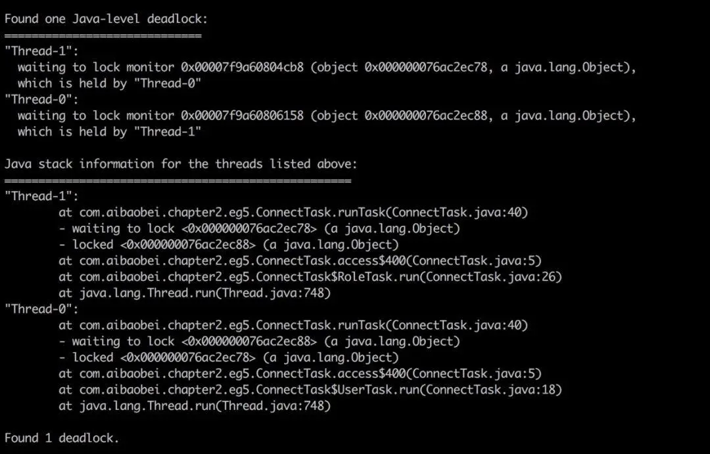

# 7.JVM问题处理

- [JAVA 线上故障排查完整套路](https://mp.weixin.qq.com/s/Vw63MUA0Zt80cU8_mvu7QQ)
- useful-scripts：平时有用的手动操作做成脚本，其中的show-busy-java-threads用于快速排查Java的CPU性能问题(top us值过高)，
  自动查出运行的Java进程中消耗CPU多的线程，并打印出其线程栈，从而确定导致性能问题的方法调用。[https://github.com/oldratlee/useful-scripts](https://github.com/oldratlee/useful-scripts)

## 1.CPU利用率高/飙升
常见原因
- 业务类问题
  - 死循环。30%问题的原因
  - 死锁：死锁后线程处于忙等待或自旋锁，从而导致繁忙等待问题。
- 并发类问题
  - 大量计算密集型的任务。50%问题的原因
  - 大量并发线程：处理量太大
  - 大量的上下文切换：可能是并发高，或者是开启的任务线程数量太多。
- 内存类问题
  - 频繁GC。10%问题的原因
  - 内存不足。内存不足，导致使用交换区，与磁盘进行频繁的数据交互，加剧CPU消耗。
  - 内存泄漏

定位CPU的问题一般可以分为以下几个步骤：
1. 定位进程:   top -c查看CPU最高的进程，比如pid=666
2. 定位线程：   top -H -p 666，查看查看CPU最高的线程ID(也是PID)
3. 查看线程信息: jstack 66 6> jstack.txt。  jstack中tid是16进制的，需要将2中的id转为16进制
4. 定位具体方法(代码): 第三步无法定位的话，继续定位，堆信息，使用jmap将堆进行快照，使用MAT分析工具，分析堆信息

方法论
- GC线程：如果是GC线程一直在占用cpu，那么就基本确定是内存泄漏。进一步按照内存问题定位
- 业务线程：如果是业务线程，那么根据下一节的方法，继续定位是哪些代码占用cpu
- io wait：比如磁盘空间不够导致的io阻塞
- 等待内核态锁，如 synchronized，就是并发问题。
  - jstack -l pid | grep BLOCKED查看阻塞态线程堆栈
  - dump 线程栈，分析线程持锁情况
  - arthas提供了thread -b，可以找出当前阻塞其他线程的线程。针对 synchronized 情况
- 上下文切换：上面都分析不是的话，可以使用vmstat命令查看。

## 2.FullGC频繁

对于Full GC较多的情况，其主要有如下两个特征：
- 线上多个线程的CPU都超过了100%，通过jstack命令可以看到这些线程主要是垃圾回收线程
- 通过jstat命令监控GC情况，可以看到Full GC次数非常多，并且次数在不断增加

常见原因
- 大对象：系统一次性加载了过多数据到内存中（比如SQL查询未做分页），导致大对象进入了老年代；
- 内存泄漏：频繁创建了大量对象，但是无法被回收（比如IO对象使用完后未调用close方法释放资源），先引发FGC，最后导致OOM
- 程序频繁生成一些长生命周期的对象，当这些对象的存活年龄超过分代年龄时便会进入老年代，最后引发FGC
- 程序BUG导致动态生成了很多新类，使得 Metaspace 不断被占用，先引发FGC，最后导致OOM
- 代码中显式调用了gc方法，包括自己的代码甚至框架中的代码；此时可能是显示的System.gc()调用导致GC次数过多，这可以通过添加-XX:+DisableExplicitGC来禁用JVM对显示GC的响应
- JVM参数设置问题：包括总内存大小、新生代和老年代的大小、Eden区和S区的大小、元空间大小、垃圾回收算法等等

## 3.youngGC频繁

youngGC频繁一般是短周期小对象较多，先考虑是不是Eden区/新生代设置的太小了。

## 4.内存泄漏
Java内存泄漏的一些场景
- 过度使用静态成员属性（static fields）
- 忘记关闭已打开的资源链接（unclosed Resources）
- 没有正确的重写 equals 和 hashcode 方法（HashMap HashSet）

## 5.死锁

jstack可以帮助我们检查死锁，并且在日志中打印具体的死锁线程信息。如下所示



## 6.promotion failed和concurrent mode failure

CMS GC时出现promotion failed和concurrent mode failure
- 晋升失败（promotion failed）：Minor GC，Survivor不足以容纳年轻代存活的对象，选取年龄最大的对象提前进入老年代，这就是晋升失败。
- 并发模式失败（concurrent mode failure）：如果老年代空间不足 或者 晋升失败后老年代也无法容纳，就会使用serial old进行串行回收。

```shell
106.641: [GC 106.641: [ParNew (promotion failed): 14784K->14784K(14784K), 0.0370328 secs]106.678: [CMS106.715: [CMS-concurrent-mark: 0.065/0.103 secs] [Times: user=0.17 sys=0.00, real=0.11 secs]
(concurrent mode failure): 41568K->27787K(49152K), 0.2128504 secs] 52402K->27787K(63936K), [CMS Perm : 2086K->2086K(12288K)], 0.2499776 secs] [Times: user=0.28 sys=0.00, real=0.25 secs]
```

原因：
- Survivor不够，新生代提升速度过快，老年代回收速度赶不上新生代提升速度；
- 年老代没有足够的空间接纳来自年轻代的对象（内存不足或者碎片化严重）；

导致的问题：短期对象进去老年代，加速老年代空间使用，延长STW的时间，会触发频繁Full GC

解决方方案一：
- 去掉survivor，设置-XX:SurvivorRatio=65536 -XX:MaxTenuringThreshold=0即可
- 设置CMSInitiatingOccupancyFraction为某个值（假设70），这样年老代空间到70%时就开始执行CMS，年老代有足够的空间接纳来自年轻代的对象。

解决方案一的改进方案：
- 上面方法不太好，因为没有用到survivor，所以年老代容易满，CMS执行会比较频繁。
我改善了一下，还是用survivor，但是把survivor加大，这样也不会有promotion failed。
适当减少 MaxTenuringThreshold的值，避免promotion failed时的STW。

这样即没有暂停又不会有promotoin failed，而且更重要的是，年老代和永久代上升非常慢（因为好多对象到不了年老代就被回收了），
所以CMS执行频率非常低，好几个小时才执行一次，这样，服务器都不用重启了。

CMSInitiatingOccupancyFraction值与Xmn的关系公式

上面介绍了promontion faild产生的原因是Eden空间不足的情况下将Eden与From survivor中的存活对象存入To survivor区时，
To survivor区的空间不足，再次晋升到old gen区，而old 区内存也不够的情况下产生了promontion faild从而导致full gc。
那可以推断出：Eden+from survivor < old 区剩余内存时，不会出现promontion faild的情况，即：

(Xmx-Xmn)*(1-CMSInitiatingOccupancyFraction/100)>=(Xmn-Xmn/(SurvivorRatior+2))

进而推断出：CMSInitiatingOccupancyFraction<=((Xmx-Xmn)-(Xmn-Xmn/(SurvivorRatior+2)))/(Xmx-Xmn)*100

例如：
- 当xmx=128 xmn=36 SurvivorRatior=1时  CMSInitiatingOccupancyFraction<=((128-36)-(36-36/(1+2)))/(128-36)*100=73.913
- 当xmx=128 xmn=24 SurvivorRatior=1时  CMSInitiatingOccupancyFraction<=((128-24)-(24-24/(1+2)))/(128-24)*100=84.615
- 当xmx=3000 xmn=600 SurvivorRatior=1时 CMSInitiatingOccupancyFraction<=((3000.0-600)-(600-600/(1+2)))/(3000-600)*100=83.33

CMSInitiatingOccupancyFraction低于70% 需要调整xmn或SurvivorRatior值。


