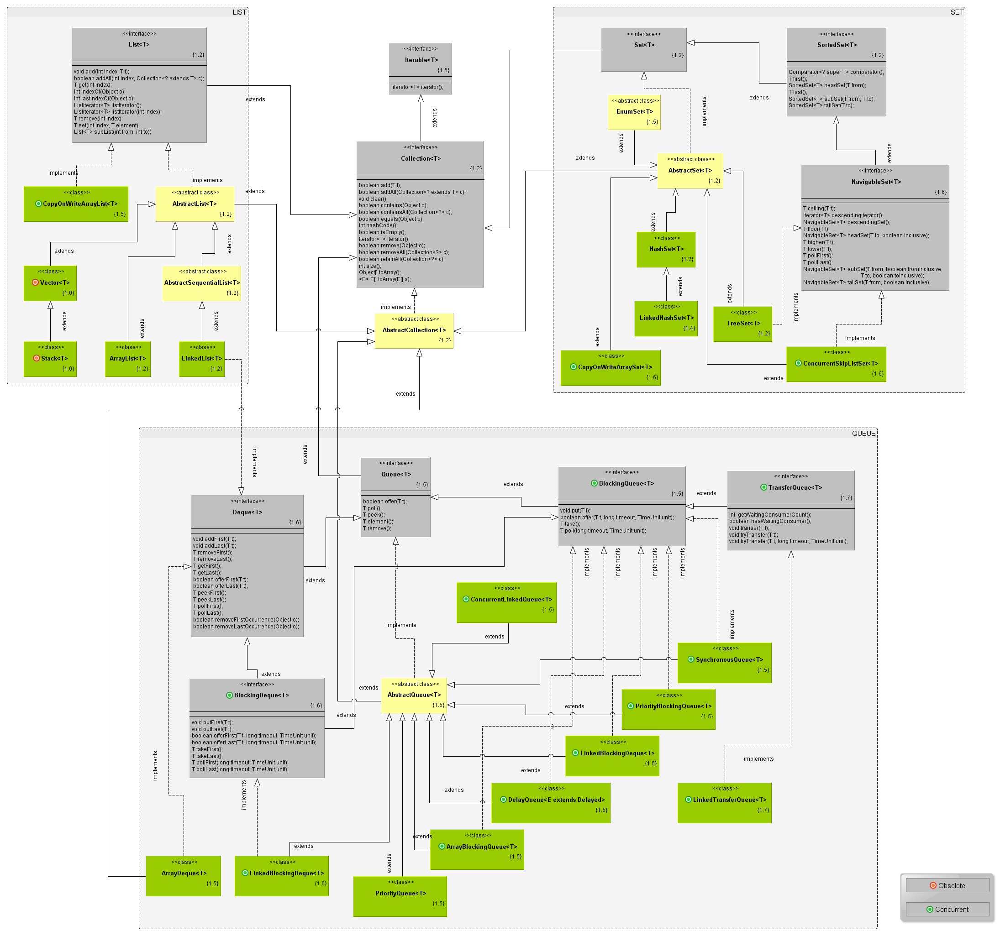
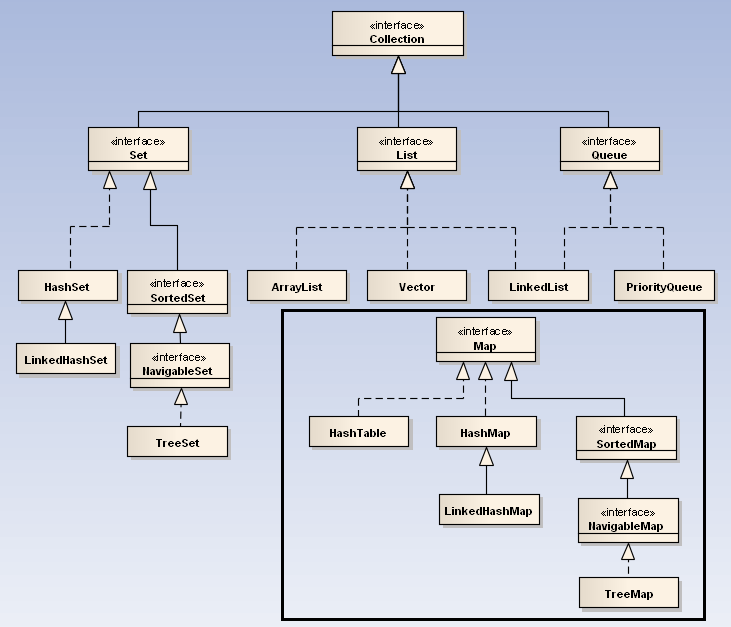
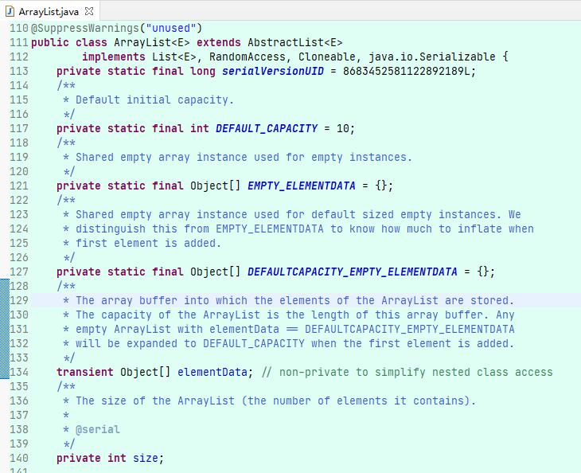
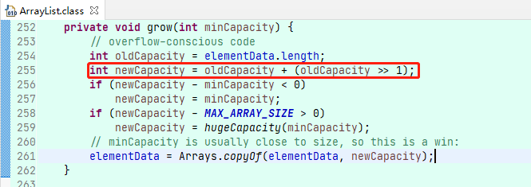
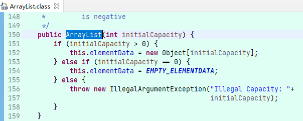
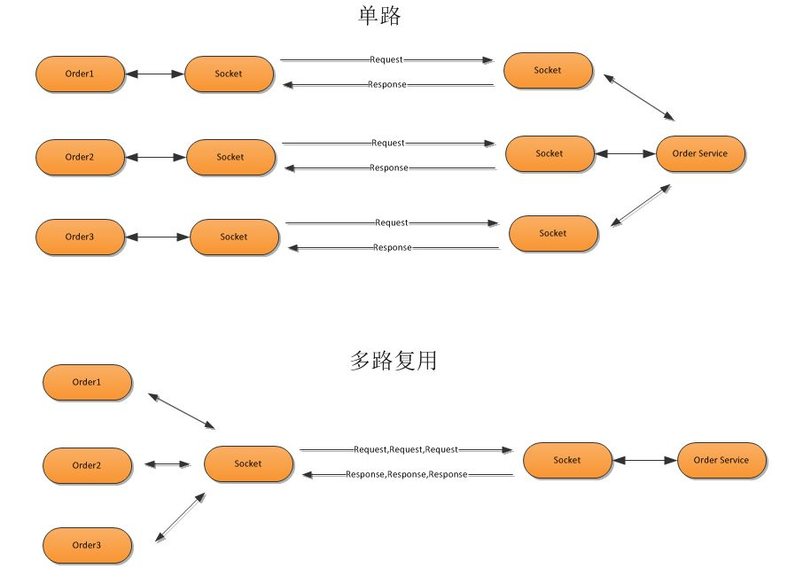
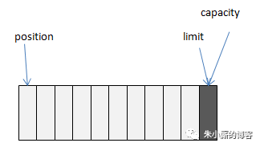
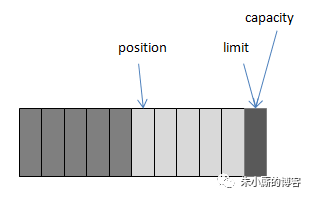
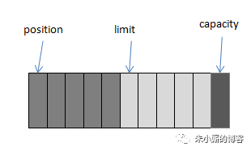
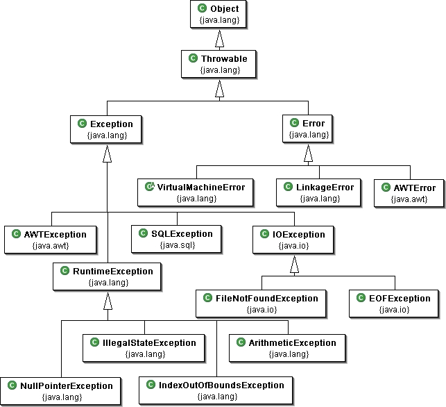

# 1.Java基础

## 1.集合

### 1.1.继承关系
常用的集合类型
- List:有序，可重复
- Set:无序，不重复
- Map:键值对，key不重复
- Queue：队列

集合继承关系：




### 1.2.常用集合特点
#### 1.2.1.List
1. List列表线性表结构,典型实现有两种：ArrayList(基于数组)、LinkedList(基于链表)
   - 数组以一块连续内存来保存所有的数组元素，所以数组的随机访问时性能最好，且数组容量不可变，当容量不足时需要重新分配内存并复制元素。
   - 链表的元素随机分配内存，元素之间以指针进行关联，所以链表的插入、删除操作性能优于数组。
   - 选择标准：当要大量的插入，删除，可以选用LinkedList；当需要快速随机访问则选用ArrayList;
2. Arrays.asList()，是Arrays内部的ArrayList，集合一旦创建，不可增删，否则抛出异常。
3. Vector，与ArrayList一样基于数组，比较古老，线程安全，效率较低，不建议使用。
4. Stack，是Vector的子类，栈的结构(后进先出LIFO)。不建议使用，若想要使用栈的结构，则可以考虑ArrayQueue。
5. Queue 代表了队列，Deque 代表了双端队列(既可以作为队列使用、也可以作为栈使用)

#### 1.2.2.Map
1. HashMap:链表桶数据结构，通过对key计算hash值再取模获得数组索引，如果hash冲突则使用链接存储。随机访问、插入、删除理想状态下都是O(1)。
2. LinkedHashMap：底层是HashMap 和 双向链表。同时具备两种数据结构，也同样需要维护两种数据结构。链表结构使之具备顺序性。
3. Hashtable：是HashMap的线程同步实现，在单线程场景，性能与HashMap相同，但是在多线程场景性能不好，不推荐使用。
4. TreeMap：底层采用红黑树来管理键值对。
   - 随机访问是O(1)，插入、删除都是O(logn),因为涉及到红黑树节点翻转操作。
   - 优点：key是有序的，可以设置排序算法。
5. Properies：是HashTable的子类，经常使用，用于维护配置文件的数据。
6. WeakHashMap：强软弱虚中的弱引用，一旦gc就会被回收。
7. IdentityHashMap：使用"=="对比key，不进行hash计算。
8. EnumMap：key必须是枚举类型

#### 1.2.3.Set
为什么在map之后说set，那是因为Java中set大多是使用对应的Map实现的。通常底层是对应的Map，key是数据，value是常量。

例如：HashSet、TreeSet、LinkedHashSet、EnumSet等，这些都是"线程不安全"的，通常通过Collections#synchronizedSortedSet方法来"包装"。

### 1.3.ArrayList

基于数组的线性表结构，内部结构如下：



1. 动态数组：数组的特点是一旦被创建，长度就不可修改。所以想要实现动态，就需要提前创建出足够的容量。
    - capacity：容量，默认10，创建的时候底层数组的长度，容量只能扩大，不能缩小。
    - size：元素数量，数组创建之后，不会被立刻全部使用，是有空余的。
2. Object[] elementData。存储数据。
   - 使用 transient 修饰，可以防止被自动序列化，造成资源浪费。因此 ArrayList 自定义了序列化与反序列化。
   - 当对象中自定义了 writeObject 和 readObject 方法时，JVM 会调用这两个自定义方法来实现序列化与反序列化。

扩容原理：
1. 默认的数组长度为10, 内部数组扩容的公式是 size + (size >> 1) = {10, 15, 22, 33, 49...}。
   size >> 1 可以理解为，size 除以 2 舍去余数 只要整数部分。
2. 扩容的阈值默认就是capacity。比如：size=10，capacity=10，这是继续调用add方法，数组的capacity不够，这时就会扩容到capacity=15。




性能对比：
1. for遍历，ArrayList 远高于 LinkedList。因为LinkedList底层列表，调用get需要遍历一遍链表，时间复杂度O(n^2)。
2. foreach， ArrayList 略高于 LinkedList，效率差别不明显，JVM内部进行了优化。
3. iterator，差别不是很大。 遍历效率是最高的

```text
017132800 000% 1. array for遍历
030107800 001% 2. array foreach
000257100 000% 3. array iterator遍历
3499635500 097% 1. linked for遍历 明显性能最差
050740200 001% 2. linked foreach
000225700 000% 3. linked iterator遍历
```

### 1.4.HashMap

看后面的专题

### 1.5.HashSet

特点：1.无序，顺序与hash值有关；2.线程不安全；3.元素可以是null，且是不重复的

HashSet 底层由两种实现：
1. HashMap 实现：key存放数据, value存放常量 PRESENT(Object PRESENT = new Object()) 
2. LinkedHashMap实现：目前只有LinkedHashSet在使用该构造函数。

### 1.6.同步操作
很多集合都是线程不安全的，所以线程安全，增加了Collections#synchronizedXX方法，将集合转为线程安全。
实现原理：Collections使用加强模式，在集合的所有方法外包装一层 synchronized修饰。

```java
Collection<Object> collection = Collections.synchronizedCollection(new ArrayList<>());
List<Object> list = Collections.synchronizedList(new ArrayList<>());
Set<Object> set = Collections.synchronizedSet(new HashSet<>());
Map<Object, Object> map = Collections.synchronizedMap(new HashMap<>());
SortedMap<Object, Object> sortedMap = Collections.synchronizedSortedMap(new TreeMap<>());
SortedSet<Object> sortedSet = Collections.synchronizedSortedSet(new TreeSet<>());
```

### 1.7.不可变集合
返回的对象为该集合“只读”的版本，只允许访问集合元素，不允许修改元素。
实现原理：Collections使用加强模式，增集合外面包装一层，调用修改方法后抛出异常。
```java
//1.返回一个空的、不可变的集合对象
List<Object> list = Collections.emptyList();
Iterator<Object> iterator = Collections.emptyIterator();
Map<Object, Object> map = Collections.emptyMap();
Set<Object> set = Collections.emptySet();

//2.返回一个只有一个元素的集合，且不可变
Collections.singletonList(Object o);
Collections.singletonMap(key, value);

//3.返回指定集合的不可变试图。
Collections.unmodifiableXxx(Collection coll);
```

## 2.IO
### 2.1.File
操作文件的基本单位，可以使用绝对路径或者相对路径。
系统默认是根据用户的工作路径来解释相对路径，这个路径有系统属性user.dir指定。

### 2.2.IO流

它是将不同的输入/输出源(例如：键盘信号、文件、网络连接、Java对象)抽象为流(stream)，方便程序使用相同的方式来访问不同类型的IO。
stream是从起源(source)到接受(sink)的有序数据

1. 依据数据的流向分为
> 输入流:只能读取，不能写入，基类：inputStream,Reader
> 输出流:只能写入，不能读取，基类：outputStream,Writer

2. 依据操作的数据单元分为：
> 字节流：操作8位的字节， 基类：inputStream,outputStream
> 字符流：操作16位的字符，基类：Reader,Writer

3. 依据角色分为：
> 节点流：可以从/向一个特定的IO设备(如磁盘、网络)读/写数据的流，也被称为低级流。他是和实际存在的节点连接的。
> 处理流：对一个已存在的流进行连接或封装。对封装后的流来实现数据的读/写。也被称为高级流。

区别：只要流的构造器参数不是一个物理节点，而是已经存在的流，则他就是处理流。如：OutputStream os = response.getOutputStream();

### 2.3.IO模型

- BIO(Block-IO 同步阻塞)。传统的通信方式，模式简单，使用方便。但并发处理能力低，通信耗时，依赖网速。
  - 适用于连接数目比较小且固定的架构。
- NIO(Non-Block IO，同步非阻塞)。 JDK1.4引入的新I/O模型，使用通道（Channel）和缓冲区（Buffer）进行操作数据，而不是使用流操作。
  - 实现原理：使用 Selector 实现多路复用，即一个线程可以同时处理多个通道的I/O操作。
  - 适用于连接数目多且连接比较短（轻操作）的架构，比如nginx
  - 特点：相比BIO，NIO可以更好地利用系统资源，提高系统的吞吐量和响应速度。
- AIO(Asynchronous IO，异步非阻塞)。JDK1.7引入新I/O模型，采用了回调机制，等待期间线程可以继续其他工作。
  - 适用于连接数目多且连接比较长（重操作）的架构，比如文件服务器等，充分调用OS参与并发操作。
  - 但是AIO在JDK中的支持并不是很完善，使用起来相对较复杂，因此在实际应用中还是以NIO为主。

注意：Java中的NIO意思为New IO。主要是以IO多路复用为主

### 2.4.IO多路复用

是一种同步非阻塞式的IO，即NIO。 [多路复用IO与NIO](https://www.cnblogs.com/zwt1990/p/8821185.html)


IO多路复用模型使用了Reactor设计模式实现了这一机制，在Reactor模型中，有三个角色
- Acceptor：接收器，用于处理连接。
- Reactor：是事件驱动的核心，负责监听Acceptor接收到的请求，并分发给Handler处理。例如Java中的Selector。
- Handler：处理具体的IO事件。每个Handler都会绑定到一个Channel上，负责处理该Channel上的读写事件。
    响应数据：Handler向Channel写入数据，Reactor会将数据返回给客户端。

Reactor模式有三种实现方式：
- Reactor单线程。就是 Acceptor、Reactor、Handler 都在一个线程中进行。例如Redis的io模型。
- Reactor多线程模式。Acceptor 和Reactor 单线程， Handler 都是多线程的。例如dubbo的io模型：1个Acceptor，cpu+1个Reactor（io线程），200个worker线程。 
- Reactor主从模式。Acceptor 和 Handler 都是多线程的。

实现原理：[/article/16.Linux/1.Linux内核](/article/16.Linux/1.Linux内核)

### 2.5.文件目录监听
参考代码案例

1. JDK 1.7新增文件扫描工具。工具为 WatchService
2. commons-io 2.4以上提供的功能(推荐)参考。工具为 实现 FileAlterationListener 接口

## 3.NIO

### 3.1.基础

Java中的NIO和传统IO的区别 
1. 传统IO 面向流，从流中读取数据，只能向前读取，不能向后读取，内部有个指针指向当前读取的位置。
2. NIO 面向缓冲区的。可以读取数据到缓冲区，可以在缓冲区中前后移动。缓冲区可以重复使用，所以写入数据时需要检查是否还有没有处理的数据。
    而且，需确保当更多的数据读入缓冲区时，不要覆盖缓冲区里尚未处理的数据。

NIO的优点：NIO通过采用非阻塞I/O、缓冲区操作、选择器和通道等技术，提高了服务器的并发性能和网络编程能力，使得Java应用程序在处理大量并发连接和网络通信时更加高效和可靠。
NIO的channel抽象的一个重要特征就是可以通过配置它的阻塞行为，以实现非阻塞式的信道。

### 3.2.核心组件
- Channel(通道)：传统IO基于字节流和字符流进行操作，而NIO基于Channel和Buffer(缓冲区)进行操作，数据总是从通道读取到缓冲区中，或者从缓冲区写入到通道中。
- Buffer(缓冲区)：具备写入/写出两种模式，用来操作Channel读取和写入数据。
- Selector(选择区)：Selector(选择区)用于监听多个通道的事件（比如：连接打开，数据到达）。因此，单个线程可以监听多个数据通道。

#### 3.2.1. Channel

Channel是双向的，既可以用来进行读操作，又可以用来进行写操作。 NIO中的Channel的主要实现有：
- FileChannel           文件IO
- DatagramChannel       UDP
- SocketChannel         TCP
- ServerSocketChannel   socket的 Server和Client

#### 3.2.2. Buffer
缓冲区，本质是容器，一个连续数组。Channel提供从文件、网络读取数据的渠道，但是读写的数据都必须经过Buffer。       
- 基础类型的缓冲实现有：ByteBuffer, CharBuffer, DoubleBuffer, FloatBuffer, IntBuffer, LongBuffer, ShortBuffer      
- 高级的还有MappedByteBuffer（mmap缓冲）, HeapByteBuffer（堆内存）, DirectByteBuffer（堆外内存）

```java
public void test7() {
    FileChannel channel = null;
    // 用于读取数据
    Charset charset = Charset.defaultCharset();
    try {
        // 1. 通过io流获取 channel
        channel = new FileInputStream("D:\\logs\\1.txt").getChannel();

        // 2. 设置缓存区，分配空间，allocate 从堆中申请内存
        ByteBuffer buf = ByteBuffer.allocate(1024);
        // 2. 设置缓存区，分配空间，allocateDirect 从堆外申请内存
        // ByteBuffer bufDirect = ByteBuffer.allocateDirect(1024);

        int read = 0;
        StringBuilder sb = new StringBuilder();
        // 3. 读取数据到Buffer
        while ((read = channel.read(buf)) > 0) {
            // 3.1 转为写出模式。允许读取数据
            buf.flip();
            // 3.2 获得本地缓存区中可以读取数据的范围
            int begin = 0;
            int end = buf.limit();

            // 3.3 读取数据
            // a. 只从缓冲区中读取一个字节
            // buf.get();

            // b. 读取end长度的数据
            //byte[] bytes = new byte[end];
            //buf.get(bytes);

            // c. 读取缓存区的数据，并转为文本
            String str = charset.decode(buf).toString();
            sb.append(str);

            // 3.4 转为写入模式，允许后面可以将数据写入缓冲区
            buf.compact();
        }
        System.out.println(sb.toString());
    } catch (Exception e) {
        e.printStackTrace();
    }
}
```   

可以把Buffer简单地理解为一组基本数据类型的元素列表，它通过几个变量来保存这个数据的当前位置状态：
- capacity      缓冲区数组的总长度
- position      下一个要操作的数据元素的位置
- limit         缓冲区数组中不可操作的下一个元素的位置：limit<=capacity
- mark          用于记录当前position的前一个位置或者默认是-1   



例如：我们通过ByteBuffer.allocate(11)方法创建了一个11个byte的数组的缓冲区，初始状态如上图，position的位置为0，capacity和limit默认都是数组长度。当我们写入5个字节时，变化如下图：




这时我们需要将缓冲区中的5个字节数据写入Channel的通信信道，所以我们调用ByteBuffer.flip()方法，变化如下图所示(position设回0，并将limit设成之前的position的值)：



这时底层操作系统就可以从缓冲区中正确读取这个5个字节数据并发送出去了。在下一次写数据之前我们再调用clear()方法，缓冲区的索引位置又回到了初始位置。

调用clear()方法：position将被设回0，limit设置成capacity，换句话说，Buffer被清空了，其实Buffer中的数据并未被清除，只是这些标记告诉我们可以从哪里开始往Buffer里写数据。
如果Buffer中有一些未读的数据，调用clear()方法，数据将“被遗忘”，意味着不再有任何标记会告诉你哪些数据被读过，哪些还没有。
如果Buffer中仍有未读的数据，且后续还需要这些数据，但是此时想要先写些数据，那么使用compact()方法。
compact()方法将所有未读的数据拷贝到Buffer起始处。然后将position设到最后一个未读元素正后面。limit属性依然像clear()方法一样，设置成capacity。现在Buffer准备好写数据了，但是不会覆盖未读的数据。

通过调用Buffer.mark()方法，可以标记Buffer中的一个特定的position，之后可以通过调用Buffer.reset()方法恢复到这个position。
Buffer.rewind()方法将position设回0，所以你可以重读Buffer中的所有数据。limit保持不变，仍然表示能从Buffer中读取多少个元素。

#### 3.2.3. Selector

Selector运行单线程处理多个Channel，如果你的应用打开了多个通道，但每个连接的流量都很低，使用Selector就会很方便。
例如在一个聊天服务器中。要使用Selector, 得向Selector注册Channel，然后调用它的select()方法。
这个方法会一直阻塞到某个注册的通道有事件就绪。一旦这个方法返回，线程就可以处理这些事件，事件的例子有如新的连接进来、数据接收等。

```java
// 1. Selector的创建：
Selector selector = Selector.open();

// 2. 创建socket的channel      
ServerSocketChannel ssc= ServerSocketChannel.open();
ssc.socket().bind(new InetSocketAddress(PORT));// 绑定端口
ssc.configureBlocking(false);// 设置非阻塞
// 3.将Channel注册到Selector上，并监听socket的事件
ssc.register(selector, SelectionKey.OP_ACCEPT);

while (true) {
    // 设置select超时时间，防止线程假死  ,select 的返回值，表示有就绪的事件数量
    if (selector.select(TIMEOUT) == 0) {
        continue;
    }
    // 取到所有accept的连接
    Iterator<SelectionKey> iter = selector.selectedKeys().iterator();
    while (iter.hasNext()) {
        SelectionKey key = iter.next();
        //判断事件是否就绪，并处理
        if (key.isAcceptable()) {
            handleAccept(key);
        }
        if (key.isReadable()) {
            handleRead(key);
        }
        if (key.isWritable() && key.isValid()) {
            handleWrite(key);
        }
        if (key.isConnectable()) {
            System.out.println("isConnectable = true");
        }
        iter.remove();
    }
}
```

SelectionKey事件如下：
1. OP_CONNECT：连接就绪
2. OP_ACCEPT：接收就绪
3. OP_READ：读就绪
4. OP_WRITE：写就绪

### 3.3.文件映射

[实现原理](/article/16.Linux/1.Linux理论)

> 1.基础概念
 
JAVA处理大文件，一般用BufferedReader,BufferedInputStream这类带缓冲的IO类，不过如果文件超大的话，更快的方式是采用MappedByteBuffer。

MappedByteBuffer是NIO引入的文件内存映射方案，读写性能极高。 MappedByteBuffer 是 DirectByteBuffer 抽象类，文件映射后数据是在堆外内存中，不会直接进行JVM。

不使用ByteBuffer的原因是ByteBuffer内部也是一个固定长度的数组，通过不会太多，仅作为数据操作过程的缓冲区使用。

操作系统的内存分两部分: 物理内存 和 虚拟内存，两种之间使用 页面映射表(占用的内存很少) 进行关联。
使用使用mmap映射文件时，并不会将整个文件全部映射到虚拟内存中，而是实际读写时，动态加载和同步的，这个过程叫"页面中断/切换"。

> 2.映射模式

MappedByteBuffer.map(int mode,long position,long size); 可以把文件的从position开始的size大小的区域映射为内存映像文件，mode指出了 可访问该内存映像文件的方式：
- MapMode.READ_ONLY,（只读）： 试图修改得到的缓冲区将导致抛出  ReadOnlyBufferException
- MapMode.READ_WRITE（读/写）：  对得到的缓冲区的更改最终将传播到文件；该更改对映射到同一文件的其他程序不一定是可见的
- MapMode.PRIVATE（专用）： 对得到的缓冲区的更改不会传播到文件，并且该更改对映射到同一文件的其他程序也不是可见的；相反，会创建缓冲区已修改部分的专用副本。

> 3.MappedByteBuffer是ByteBuffer的子类，其扩充了三个方法：

- force()：缓冲区是READ_WRITE模式下，此方法对缓冲区内容的修改强行写入文件；
- load()：将缓冲区的内容载入内存，并返回该缓冲区的引用；
- isLoaded()：如果缓冲区的内容在物理内存中，则返回真，否则返回假；

### 3.4.Scatter/Gatter
- 分散（scatter）指将channel中读取到的数据，写入多个buffer中。
- 聚集（gather）将多个buffer数据写入同一个Channel

scatter/gather经常用于需要将传输的数据分开处理的场合，例如传输一个由消息头和消息体组成的消息，你可能会将消息体和消息头分散到不同的buffer中，这样你可以方便的处理消息头和消息体。

### 3.5.transferFrom/transferTo

[实现原理](https://www.jianshu.com/p/713af3a13bde)

- transferFrom 主要使用mmap。将文件映射到虚拟内存（堆外内存）
- transferTo   使用的是sendfile。 直接将文件发送到网卡驱动，不经过JVM。

以下使用 FileChannelImpl 为例子进行分析。（不同的实现类，实现的原理也是不同的）

```java
public long transferFrom(ReadableByteChannel src, long position, long count) throws IOException  {
    // 去掉校验代码
    // 1.如果 channel 是 FileChannelImpl，则使用mmap     
    if (src instanceof FileChannelImpl)
        return transferFromFileChannel((FileChannelImpl)src, position, count);
    // 2.否则使用堆外内存
    return transferFromArbitraryChannel(src, position, count);
}

public long transferTo(long position, long count, WritableByteChannel target) throws IOException {
    // 去掉校验代码
    // 1. 如果 OS 支持 send file（windows 不支持），就执行 sendfile。
    if ((n = transferToDirectly(position, icount, target)) >= 0)
        return n;
    // 2. 如果 OS 不支持，就走 mmap
    if ((n = transferToTrustedChannel(position, icount, target)) >= 0)
        return n;
    // 3. 如果 mmap 失败，就走 堆外内存
    return transferToArbitraryChannel(position, icount, target);
}
```

### 3.6.Pipe

是2个线程之间的单向数据连接。Pipe有一个source通道和一个sink通道。数据会被写到sink通道，从source通道读取。

## 4.异常
### 4.1.受检异常和非受检异常的
- 受检异常是编译时强制检验的异常，我们的程序必须try...catch或者throws。比如，Exception、FileNotFoundException、SQLException
  我们不进程处理的话，程序就无法编译
- 非受检异常是 RuntimeException 及其派生类。这种异常我们可以不进行 try...catch或者throws 处理。




### 4.2.异常处理原则
1. 使程序混乱最小化；
2. 捕捉并保存诊断信息；
3. 通知合适的人员；
4. 采用合适的方式结束异常活动。

如何做到以上的4点原则：		
1. 不要过度使用异常；
2. 不要使用过于庞大的try块；
3. 避免使用catchAll语句,如,实在是确定不了可以使用RuntimeException
4. 不要忽略捕捉到的异常。    
    如，catch块为空，或是仅仅打印出来。这样都是不好的处理方法。
    最好的方法，是一直返回的最上层，像是在页面上出现相应的提示。
    或是保存到指定的log文件中，供开发人员参考。

### 4.3.异步线程的异常处理

我们使用线程的时候如果出现异常的话，会被jdk吞掉异常信息，这个问题需要我们自己处理
```java
/
 * 自定义线程异常捕获处理类。
 * JVM会自动调用uncaughtException方法处理异常情况
 * @author zhangxue
 */
public class ExceptionHandler implements UncaughtExceptionHandler {

	@Override
	public void uncaughtException(Thread t, Throwable e) {
		System.out.println(t.getName() + "出现异常了" + e.getMessage());
	}
	
	public static void main(String[] args) {
		new Thread(){
			public void run() {
				//开启自定义的线程异常获取类
				Thread.currentThread().setUncaughtExceptionHandler(new ExceptionHandler());
				int a = 1 / 0;
				System.out.println(a);
			};
		}.start();
	}
}
```
### 4.4.过多的异常
如果同一个异常输出的次数过多，jvm会帮助我们进行优化，去掉后面异常的栈信息，只打印异常message。我们可以通过设置jvm参数进行配置

## 5.反射&泛型

### 5.1.反射基本操作

反射的类主要在java.lang.reflect。包括：Class,Method,Field,Constructor,Array

java程序可以使用这些类实现动态的获得某个对象、获得某个类的运行信息、创建对象、调用类的方法、访问并修改某个类的Field。

Type是一个接口，Class实现了type接口。

### 5.2.泛型
```java
public class 泛型 {
    private Map<String, Integer> map;
    public static void main(String[] args) throws NoSuchFieldException, SecurityException {
        //1.得到类中，指定的属性
        Class clazz = 泛型.class;
        Field f = clazz.getDeclaredField("map");

        //2.获得这个属性对应的类
        Class<?> a = f.getType();
        System.out.println("map的类型是：" + a);

        //3.获得这个属性的泛型类型
        Type type = f.getGenericType();

        //4.判断泛型的类型是否是ParameterizedType（被参数化的类型，也就是增加了泛型限制的类型）
        if (type instanceof ParameterizedType) {
            //5.强制类型转换
            ParameterizedType t = (ParameterizedType) type;

            //6.获得它的原始类型
            Type rawType = t.getRawType();
            System.out.println("原始类型是：" + rawType);

            //7.获得泛型类型的泛型参数
            Type[] ts = t.getActualTypeArguments();
            for (int i = 0; i < ts.length; i++) {
                System.out.println("第" + i + "个泛型类型是：" + ts[i]);
            }
        } else {
            System.out.println("泛型获取出错");
        }
        /*
            map的类型是：interface java.util.Map
            原始类型是：interface java.util.Map
            第0个泛型类型是：class java.lang.String
            第1个泛型类型是：class java.lang.Integer
         */
    }
}
```

### 5.3.类型擦除

[java的类型擦除](https://blog.csdn.net/liu_rockefeller/article/details/137233657)

类型擦除是指在编译过程中，泛型（Generic Types）的类型参数（Type Parameters）会被移除（擦除），并替换为它们的限定类型（Bounded Type）或者原始类型（Raw Type），
以便于Java虚拟机（JVM）能够正常运行泛型代码。这是Java泛型实现的一部分，它允许泛型代码与在Java 5之前编写的非泛型代码兼容。

这就是为什么运行过程中，无法获得 List<String> 中的泛型。必须获得元素才能获得类型。

## 6.注解

是Java提供了一种为程序元素设置元数据的方法，从某些方面来看，注解就像修饰符一样，可以用来修饰包、类、构造器、方法、成员变量、参数、局部变量的声明等。
目前已经广泛使用在Java的各种框架中

### 6.1.Java提供的Annotation
1. @Override			1.5添加		限定重写父类方法
2. @Deprecated		    1.5添加		标记已经过时
3. @SuppressWarnings	1.5添加		抑制编译器警告
4. @SafeVarargs		    1.7添加		防止“堆污染”警告: 如List li = new ArrayList<String>();可以用@SuppressWarnings("unchecked")或@SafeVarargs解决
5. @FunctionalInterface	1.8添加	    如果接口里只有一个抽象方法，这个接口就是函数式接口。FunctionalInterface用来标记这个接口是函数式接口

### 6.2.JDK的元Annotation
java.lang.annotation 除了上面的5个基本注解之外，还有6个元Annotation，其中5个用来修饰其他的Annotation。 @Repeatable是1.8添加的，用来定义重复注解

1. @Retention 用来定义Annotation可以保留多长时间。用来修饰Annotation
```java
@Retention(value = RetentionPolicy.SOURCE)	#只保留在源代码中，不被编译在class文件中
@Retention(value = RetentionPolicy.CLASS)	#编译在class文件中，JVM不可获取Annotation信息。这是默认值
@Retention(value = RetentionPolicy.RUNTIME)	#编译在class文件中，JVM可通过反射获取Annotation信息
```
2. @Target，定义Annotation可以用来修饰那些程序单元。用来修饰Annotation
```java
@Target(value = ElementType.ANNOTATION_TYPE)	#指定Annotation只能用来修饰		Annotation
@Target(value = ElementType.CONSTRUCTOR)		#指定Annotation只能用来修饰		构造器
@Target(value = ElementType.FIELD)				#指定Annotation只能用来修饰		成员变量
@Target(value = ElementType.LOCAL_VARIABLE)		#指定Annotation只能用来修饰		局部变量
@Target(value = ElementType.METHOD)				#指定Annotation只能用来修饰		方法
@Target(value = ElementType.PACKAGE)			#指定Annotation只能用来修饰		包
@Target(value = ElementType.PARAMETER)			#指定Annotation只能用来修饰		参数
@Target(value = ElementType.TYPE)				#指定Annotation只能用来修饰		类、接口（包括Annotation）	或枚举
```
3. @Documented:用来修饰Annotation,使用了这个修饰过得Annotation的多有程序元素，在使用javadoc生成API时，会出现这个Annotation的说明
4. @Inherited:用来修饰Annotation,Annotation将具有继承性

## 7.国际化

通过国际化，实现以下功能
1. 国家名称与缩写、国家语言与缩写
2. 配置信息的切换（使用配置文件与配置类）
3. 通用数值、百分比数值、货币数值等
4. 时间的格式，时区获取等

常见语言和国家简写:
```text
简体中文(中国) zh-cn
繁体中文(台湾地区)  zh-tw
繁体中文(香港)  zh-hk
英语(香港)  en-hk
英语(美国) en-us
英语(英国) en-gb
英语(全球) en-ww
英语(加拿大) en-ca
英语(澳大利亚) en-au
英语(爱尔兰) en-ie
英语(芬兰) en-fi
芬兰语(芬兰) fi-fi
英语(丹麦) en-dk
丹麦语(丹麦) da-dk
英语(以色列) en-il
希伯来语(以色列) he-il
英语(南非) en-za
英语(印度) en-in
英语(挪威) en-no
英语(新加坡) en-sg
英语(新西兰) en-nz
英语(印度尼西亚) en-id
英语(菲律宾) en-ph
英语(泰国) en-th
英语(马来西亚) en-my
英语(阿拉伯) en-xa
韩文(韩国) ko-kr
日语(日本) ja-jp
荷兰语(荷兰) nl-nl
荷兰语(比利时) nl-be
葡萄牙语(葡萄牙) pt-pt
葡萄牙语(巴西) pt-br 
法语(法国) fr-fr 
法语(卢森堡) fr-lu
法语(瑞士) fr-ch
法语(比利时) fr-be
法语(加拿大) fr-ca
西班牙语(拉丁美洲) es-la
西班牙语(西班牙) es-es
西班牙语(阿根廷) es-ar 
西班牙语(美国) es-us
西班牙语(墨西哥) es-mx
西班牙语(哥伦比亚) es-co
西班牙语(波多黎各) es-pr
德语(德国) de-de
德语(奥地利) de-at
德语(瑞士) de-ch 
俄语(俄罗斯) ru-ru
意大利语(意大利) it-it
希腊语(希腊) el-gr
挪威语(挪威) no-no
匈牙利语(匈牙利) hu-hu
土耳其语(土耳其) tr-tr 
捷克语(捷克共和国) cs-cz
斯洛文尼亚语 sl-sl
波兰语(波兰) pl-pl
瑞典语(瑞典) sv-se
西班牙语(智利) es-cl
```

## 8.配置文件

properties文件是jdk默认支持的一种配置文件格式，内容以key=value的格式，编码为 unicode

对于目前的开发环境来说已经不算友好了，正在逐步切换为yml格式，yml支持utf-8的编码

properties 文件案例
```properties
hello=\u4F60\u597D  //#你好
```

\u4F60\u597D是unicode，使用java自动的工具生成
1. 找到java/bin/native2ascii.exe,打开是一个doc窗口，输入中文，回车，转换为ascii码。但是这个的效率很低。
2. java/bin/目录下，打开doc窗口，执行命令:   native2ascii d:\mess.properties d:\mess_zh_CN.properties

## 9.jar

### 9.1.加载jar

一般使用Java项目都会使用到第三方的jar包。比如，jdk bin和extend包下的jar是不需要我们自己添加的。

```java
# window环境使用“;”，Linux环境使用“:”
java -classpath "a.j;b.jar;c.jar" com.zx.Main
```

### 9.2.读取jar包中的静态文件

例如resource文件夹，编译之后就是默认就是classpath根目录，获取 resources 目录资源文件，可以使用如下方式：
```java
/**
 * 【1.通过ClassLoad】直接通过文件名getPath来获取路径 
 *
 * @param fileName
 * @throws IOException
 */
public void function2(String fileName) throws IOException {
    String path = this.getClass().getClassLoader().getResource(fileName).getPath();//注意getResource("")里面是空字符串
    System.out.println(path);
    String filePath = URLDecoder.decode(path, "UTF-8");//如果路径中带有中文会被URLEncoder,因此这里需要解码
    System.out.println(filePath);
    getFileContent(filePath);
}

/**
 * 【2.直接使用getResourceAsStream方法获取流】
 * springboot项目中需要使用此种方法，因为jar包中没有一个实际的路径存放文件
 *
 * @param fileName
 * @throws IOException
 */
public void function4(String fileName) throws IOException {
    InputStream in = this.getClass().getClassLoader().getResourceAsStream(fileName);
    getFileContent(in);
}

/**
 * 【3.工作空间】通过绝对路径获取项目中文件的位置（不能用于服务器）
 * @param fileName
 * @throws IOException
 */
public void function7(String fileName) throws IOException {
    String rootPath = System.getProperty("user.dir");//E:\WorkSpace\Git\spring-framework-learning-example
    String filePath = rootPath + "\\chapter-2-springmvc-quickstart\\src\\main\\resources\\"+fileName;
    getFileContent(filePath);
}

/**
 * 【4.绝对路径】通过绝对路径获取项目中文件的位置（不能用于服务器）
 * @param fileName
 * @throws IOException
 */
public void function8(String fileName) throws IOException {
    //参数为空
    File directory = new File("");
    //规范路径：getCanonicalPath() 方法返回绝对路径，会把 ..\ ..\ 这样的符号解析掉
    String rootCanonicalPath = directory.getCanonicalPath();
    //绝对路径：getAbsolutePath() 方法返回文件的绝对路径，如果构造的时候是全路径就直接返回全路径，如果构造时是相对路径，就返回当前目录的路径 + 构造 File 对象时的路径
    String rootAbsolutePath =directory.getAbsolutePath();
    System.out.println(rootCanonicalPath);
    System.out.println(rootAbsolutePath);
    String filePath = rootCanonicalPath + "\\chapter-2-springmvc-quickstart\\src\\main\\resources\\"+fileName;
    getFileContent(filePath);
}

/**
 * 根据文件路径读取文件内容
 *
 * @param fileInPath
 * @throws IOException
 */
public static void getFileContent(Object fileInPath) throws IOException {
    BufferedReader br = null;
    if (fileInPath == null) {
        return;
    }
    if (fileInPath instanceof String) {
        br = new BufferedReader(new FileReader(new File((String) fileInPath)));
    } else if (fileInPath instanceof InputStream) {
        br = new BufferedReader(new InputStreamReader((InputStream) fileInPath));
    }
    String line;
    while ((line = br.readLine()) != null) {
        System.out.println(line);
    }
    br.close();
}
```

### 9.3.META-INF目录

每个jar包都有一个META-INF目录，它包含了JAR文件的元数据相关。
Java基于META-INF目录中的文件来配置Java应用程序、类加载器以及其他服务

#### 9.3.1.MANIFEST.MF
用于定义扩展名以及打包相关的清单，例如：
```text
Manifest-Version: 1.0                   
Archiver-Version: Plexus Archiver       
Built-By: China
Created-By: Apache Maven 3.5.0
Build-Jdk: 1.8.0_241
Main-Class: cn.zx.Application
```
可以定义的key如下：
1. Manifest-Version：指定清单文件的版本。
2. Created-By：创建 JAR 文件的工具或版本。
3. Main-Class：如果你的 JAR 文件是一个可执行的 JAR。
4. Class-Path：如果你的 JAR 文件依赖于其他 JAR 文件，这个属性可以用来指定这些依赖的路径。
5. Specification-Title：规范的标题。
6. Specification-Version：规范的版本。
7. Implementation-Title：实现的标题。
8. Implementation-Version：实现的版本。
9. Implementation-Vendor：实现的供应商。
10. Implementation-Vendor-Id：实现的供应商 ID。
11. Implementation-URL：实现的 URL。
12. Extension-Name：扩展的名称（如果 JAR 是一个扩展）。
13. Extension-Install-In：扩展应该安装的位置（例如 `$LIB/ext`）。
14. Premain-Class：用于 Java Agent 的类，它在主应用类之前运行。
15. Agent-Class：用于 Java Agent 的类，它在主应用类之后运行。
16. Can-Redefine-Classes：指示 Java Agent 是否可以重新定义类。
17. Can-Retransform-Classes：指示 Java Agent 是否可以重新转换类。
18. Can-Set-Native-Method-Prefix：指示 Java Agent 是否可以设置本地方法前缀。

#### 9.3.2.INDEX.LIST
该文件由JAR工具的-i选项生成，包括了应用程序或者扩展中定义的包的位置。用于类加载器加速类加载过程。


#### 9.3.3.xxx.SF
JAR包的签名文件

#### 9.3.4.xxx.DSA
与SF文件关联的签名块文件。该文件存储了签名文件对应的数字签名。

## 10.JNI

### 10.1.JNI介绍
JNI全称为Java Native Interface，即Java本地接口。通过JNI可以使得Java与C/C++进行交互。
即可以在Java代码中调用C/C++代码或者在C/C++代码中调用Java代码。 因为JNI是JVM规范的一部分，因此可以将我们写的JNI的程序在任何Java虚拟机中运行。

[Java Native Interface Specification Contents](https://docs.oracle.com/javase/8/docs/technotes/guides/jni/spec/jniTOC.html)

[clion开发jni](https://www.jianshu.com/p/df02ae3f2f43)

混合编程JNI
- [第一篇 Hello world](https://juejin.cn/post/7103524711241351176)
- [第二篇基础知识](https://juejin.cn/post/7103698667009212446)
- [第三篇 c++ 项目的创建](https://juejin.cn/post/7104439148743753741)
- [第四篇之引用和异常](https://juejin.cn/post/7105020460286345224)
- [第五篇之C++ 访问 Java代码](https://juejin.cn/post/7105381992732360718)
- [第六篇之native 中字符串和数组的操作](https://juejin.cn/post/7106001095079493640)
- [第七篇之JNI 的命令行们](https://juejin.cn/post/7106486273284276231)
- [第八篇之Jni对虚拟机的操作](https://juejin.cn/post/7106714566444187662)
- [第九篇之Jni总结](https://juejin.cn/post/7107421107816235038)
- [第十篇之JNA初见](https://juejin.cn/post/7107983323288797214)
- [第十一篇之JNA详情](https://juejin.cn/post/7108377747289800741)
- [第十二篇 jnaerator](https://juejin.cn/post/7108649935221817357)

### 10.2.JNA
是基于JNI开发的一个框架。 是为了降低JNI 开发的复杂性的一个Java框架。可以不用写c/c++ 代码调用动态库。

JNA是不能完全替代JNI的，因为JNA只能实现Java访问C函数，使用JNI技术，不仅可以实现Java访问C函数，也可以实现C语言调用Java代码

源码： [https://github.com/java-native-access/jna](https://github.com/java-native-access/jna)

[JNI，JNA，jawin，jacob和Jcom之间的区别是什么](https://www.zhihu.com/tardis/sogou/qus/48816879)

[JNI 和 JNA 详解](https://www.jianshu.com/p/fde40a8d80d3)