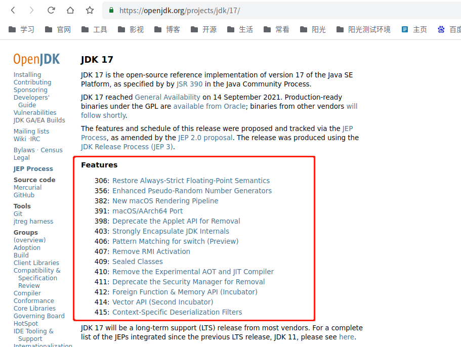

# 3.JDK特性
```text
21 (GA 2023/09/19) LTS
20 (GA 2023/03/21)
19 (GA 2022/09/20)
18 (GA 2022/03/22)
17 (GA 2021/09/14) LTS
16 (GA 2021/03/16)
15 (GA 2020/09/15)
14 (GA 2020/03/17)
13 (GA 2019/09/17)
12 (GA 2019/03/19)
11 (GA 2018/09/25)  LTS
10 (GA 2018/03/20)
JDK9，2017-09-21 
JDK8，2014-03-18 LTS    
```

JDK版本主要分为，LTS 和非 LTS 两个版本。LTS 是长期支持版本，也是我们主流使用的版本，一般情况下LTS最少8年（其中3年免费商用，5年收费商用）
总之就是不要使用Oracle jdk，使用open jdk，或者使用其他大厂开源出来的版本。

## 介绍

### 1.JCP

官网地址[https://jcp.org/](https://jcp.org/)

JCP（Java Community Process）是一个开放的国际组织，主要由Java开发者以及被授权者组成，职能是发展和更新。 
1995有Sun公司成立，并逐步形成的组织，主要的成员是各大软件厂商，本义是想厂商与开源开发者建立起一座沟通的桥梁，
但是JCP太过于依赖那些大厂商，丧失来自个人开发者和项目的创新，有沦为资本利益工具的风险。

### 2.JSR

Java Specification Requests.意思是Java规范提案，是指向JCP(Java Community Process)提出新增一个标准化技术规范的正式请求。
可以去JCP的官网查看所有的JSR，截止2023年已经有近1000个JSR了。其中著名的几个JSR如下：

<p style="color: red">JSR-269(Pluggable Annotation Processing API，提供了一种机制，允许开发者在编译时处理注解。)</p>

- [Java-JSR-269-插入式注解处理器](https://liuyehcf.github.io/2018/02/02/Java-JSR-269-%E6%8F%92%E5%85%A5%E5%BC%8F%E6%B3%A8%E8%A7%A3%E5%A4%84%E7%90%86%E5%99%A8/)
- [Java JSR-269 插入式注解处理器](https://blog.csdn.net/ME546926/article/details/126270868)
  
- JDK 1.5，Java语言提供了对注解（Annotation）的支持，这些注解与普通的Java代码一样，是在运行期间发挥作用的。
- JDK 1.6，中实现了JSR-269规范JSR-269：Pluggable Annotations Processing API（插入式注解处理API）。提供了一组插入式注解处理器的标准API在编译期间对注解进行处理。

案例：业界出现了许多针对程序“写得好不好”的辅助校验工具，如CheckStyle、FindBug、Klocwork等。这些代码校验工具有一些是基于Java的源码进行校验，还有一些是通过扫描字节码来完成。

- JSR 303：Bean Validation，定义了一套用于验证JavaBean的规范，可以通过注解来进行数据验证。
- JSR 310：日期和时间API，引入了新的日期和时间API，用于替代旧的Date和Calendar类。
- JSR 330：依赖注入，定义了一套依赖注入的规范，用于管理和解决对象之间的依赖关系。

### 3.JEP

JEP（JDK增强提案），每次jdk新版本发布的时候，都会在发布本次新实现的功能有那些




## JDK18
[https://my.oschina.net/mdxlcj/blog/5542073](https://my.oschina.net/mdxlcj/blog/5542073)

优化功能

## JDK17
[https://my.oschina.net/mdxlcj/blog/5261402](https://my.oschina.net/mdxlcj/blog/5261402)

优化功能，增加密封类。

JDK17 是继jdk11后的长期支持版本，支持到 2029 年 9 月。并且JDK17确实可以免费商用，时间截止到2024年9月，共计3年。
完整的许可协议（https://www.oracle.com/downloads/licenses/no-fee-license.html）

协议的内容总结为：JDK17之后的版本可以免费和商用，但是仅有3年时间，3年后无法免费商用。看起来，这是一个套路：JDK用户持续下降，Oracle又不想放弃收费的机会

## JDK16
[https://my.oschina.net/mdxlcj/blog/5055983](https://my.oschina.net/mdxlcj/blog/5055983)

优化功能

## JDK15
[https://my.oschina.net/mdxlcj/blog/4586284](https://my.oschina.net/mdxlcj/blog/4586284)

优化功能，增加record特性

## JDK14
[https://my.oschina.net/mdxlcj/blog/3197478](https://my.oschina.net/mdxlcj/blog/3197478)

优化功能

## JDK13
[https://my.oschina.net/mdxlcj/blog/3107021](https://my.oschina.net/mdxlcj/blog/3107021)

增加文本块，优化功能

## JDK12
[https://my.oschina.net/mdxlcj/blog/3102739](https://my.oschina.net/mdxlcj/blog/3102739)

增加Shenandoah(实验阶段)，优化功能

## JDK11
[https://my.oschina.net/mdxlcj/blog/3010342](https://my.oschina.net/mdxlcj/blog/3010342)

增加部分功能，增加了ZGC(实验阶段)，对docker完全支持，优化G1 并行fullGC的性能

## JDK10
[https://my.oschina.net/mdxlcj/blog/3009128](https://my.oschina.net/mdxlcj/blog/3009128)

主要增加了var特性，优化集合工具类，优化io流，

## JDK9
[https://my.oschina.net/mdxlcj/blog/1622984](https://my.oschina.net/mdxlcj/blog/1622984)

主要是进行优化，增加了模块化能力

## JDK8
长期支持版本，截止23年最主流的版本

[https://my.oschina.net/mdxlcj/blog/1622718](https://my.oschina.net/mdxlcj/blog/1622718)

JDK8 的主要新特性六个：Lambda、Stream、Date、新注解、函数编程、并发集合优化

## JDK1.7
JDK7对Java语法有少量更新，重点是在易用性和便捷性的改进。

1.二进制字面量

JDK7开始，终于可以用二进制来表示整数（byte，short，int和long）。使用二进制字面量的好处是，可以是代码更容易被理解。语法非常简单，只要在二进制数值前面加 0b或者0B。
```java
byte nByte = (byte)0b0001;
short nShort = (short)0B0010;
int nInt = 0b0011;
long nLong = 0b0100L;  
``` 
 
2.数字字面量可以出现下划线
 对于一些比较大的数字，我们定义起来总是不方面，经常缺少或者增加位数。JDK7为我们提供了一种解决方案，下划线可以出现在数字字面量。
```java
int a = 10_0000_0000;  
long b = 0xffff_ffff_ffff_ffffl;  
byte c = 0b0001_1000;  
``` 
注意：你只能将下划线置于数字之间，以下使用方法是错误的，
 
1.数字的开头或者结尾
2.小数点的前后
3.‘F’或者‘f’的后缀
4.只能用数字的位置
int err1 = _11，err2=11_;  
float err3=3._4，err4=3_.4;  
long err5=0x888_f;  
 
3.switch 语句可以用字符串了
这个功能千呼万唤，终于出来了
```java
private static void switchString(String str){  
  switch(str){  
    case "one":  
        System.err.println("1");  
        break;  
    case "two":  
        System.out.println("2");  
        break;  
    default :  
        System.out.println("err");  
  }  
}  
```
 
4.泛型实例的创建可以通过类型推断来简化
 以后你创建一个泛型实例，不需要再详细说明类型，只需用<>，编译器会自动帮你匹配
```java
//例如   
Map<String， List<String>> myMap = new HashMap<String， List<String>>();  
//可以简化为  
Map<String， List<String>> myMap = new HashMap<>();  
```
 
5.简化的可变参数调用
有些参数类型，例如ArrayList<Number> 和 List<String>，是非具体化的（non-reifiable）.在编译阶段，编译器会擦除该类型信息。
Heappollution 指一个变量被指向另外一个不是相同类型的变量。例如

```java
List l = new ArrayList<Number>();  
List<String> ls = l;       // unchecked warning  
l.add(0， new Integer(42)); // another unchecked warning  
String s = ls.get(0);      // ClassCastException is thrown  
// 回到我们的主题，在jdk7中，当你定义下面的函数时
public static <T> void addToList (List<T> listArg， T... elements) {  
    for (T x : elements) {  
      listArg.add(x);  
    }  
}  
你会得到一个warning
warning: [varargs] Possible heap pollution from parameterized vararg type 
```
 
在jdk7之前，当你调用一个含有非具体化参数的可变参数方法，你必须自行保证不会发生“heappollution”。这有一个问题，如果调用者对方法不熟悉，他根本无法判断。JDK7对此做了改进，在该方法被定义时久发出警告
 
要消除警告，可以有三种方式
1.加 annotation @SafeVarargs
2.加 annotation @SuppressWarnings({"unchecked"， "varargs"})
3.使用编译器参数 –Xlint:varargs;
 
 
6.try-with-resources 语句
jdk7提供了try-with-resources，可以自动关闭相关的资源（只要该资源实现了AutoCloseable接口，jdk7为绝大部分资源对象都实现了这个接口）

```java
static String readFirstLineFromFile(String path) throws IOException {  
  try (BufferedReader br = new BufferedReader(new FileReader(path))) {  
    return br.readLine();  
  }  
}  
try 语句块中还可以同时处理多个资源，可以跟普通的try语句一样catch异常，有finally语句块
try (  
      java.util.zip.ZipFile zf = new java.util.zip.ZipFile(zipFileName);  
      java.io.BufferedWriter writer = java.nio.file.Files.newBufferedWriter(outputFilePath， charset)  
    ) {  
}catch(…){  
}finally{  
}  
``` 
 
4.7.Catch多个Exception，rethrow exception 改进了类型检测
很多时候，我们捕获了多个异常，却做了相同的事情，比如记日志，包装成新的异常，然后rethrow。这时，代码就不那么优雅了，例如
```java
catch (IOException ex) {  
     logger.log(ex);  
     throw ex;  
catch (SQLException ex) {  
     logger.log(ex);  
     throw ex;  
}  
// Jdk7允许捕获多个异常
catch (IOException|SQLException ex) {  
    logger.log(ex);  
    throw ex;  
}  
```
注意，catch后面的异常参数是final的，不能重新再复制
RethrowException更具包容性的类型检测
当你重新抛出多个异常时，不再需要详细定义异常类型了，编译器已经知道你具体抛出的是哪个异常了。你只需在方法定义的时候声明需要抛出的异常即可
```java
public void call() throws ReflectiveOperationException， IOException {  
    try {  
      callWithReflection(arg);  
    } catch (final Exception e) {  
      logger.trace("Exception in reflection"， e);  
      throw e;  
    }  
}  
``` 
4.8.Fork/join
支持将一个任务拆分为多个小任务，再讲多个小任务的结果合并。

## JDK1.6
相比jdk1.5的新特性，1.6的新特性并不出众

- AWT新增加了两个类：Desktop和SystemTray(没人用)
- 使用JAXB2来实现对象与XML之间的映射(不好用)
- StAX。利用拉模式解析(pull-parsing)XML文档。（不好用）
- Compiler API。结合反射功能就可以实现动态的产生Java代码并编译执行这些代码，有点动态语言的特征
- 轻量级Http Server API
- 插入式注解处理API
- 用Console开发控制台程序
- 对脚本语言的支持
- Common Annotations

## JDK1.5
- 泛型
  丰富了对象的类型
- Foreach
  增强for循环，用于抛弃for循环，只能变量Iteratable接口的实现类
- 自动拆箱装箱
- 枚举类型
- Switch 使用枚举
- 静态导入：import static java.lang.System.out。
- 线程池技术


