# 4.字节码加强

字节码加强的手段包括：
1. 编译时注解处理器（JSR269）：通过编写自定义注解处理器，在编译阶段对源代码进行加强。
    - 实现原理：编译时注解处理器通过在编译阶段扫描源代码中的注解，并根据注解的定义进行相应的处理，如生成新的源代码、修改已有的源代码等。
    - 使用场景：编译时注解处理器适用于生成代码、代码检查、自动配置等场景。
    - 开发框架：Java编译器自带的注解处理器、Google的AutoService。
    - 常用框架：Lombok、mapstruct等
2. Java Agent：是一种在运行时修改字节码的机制，在类加载之前对字节码进行修改。
    - 实现原理：Java Agent通过类似于AOP（面向切面编程）的方式，在类加载时通过字节码操作库（如ASM、Byte Buddy）修改字节码，添加或修改方法、字段等。
    - 使用场景：Java Agent适用于需要在运行时对已有的类进行修改或增强的场景，如监控、性能调优、代码注入等。
    - 常用框架：ASM、Javassist 和 Byteman 等。三者对比之下，ASM 在这几个框架里插桩效率是最高的
3. 动态代理：Java的动态代理机制允许在运行时动态地创建代理对象，可以在代理对象的方法调用前后进行一些额外的处理。
    - 实现原理：动态代理是通过反射机制实现的。在运行时，通过实现InvocationHandler接口，并重写其invoke方法，可以在代理对象的方法调用前后进行额外的处理。
    - 使用场景：动态代理适用于AOP、远程方法调用（RPC）等场景，可以在方法调用前后进行日志记录、权限验证等操作。
    - 常用框架：Java Proxy主要基于接口进行代理，而Cglib则可以代理普通的类。 

## 1.字节码

### 1.1.什么是字节码？

Java之所以可以"一次编译，到处运行"，一是因为JVM针对各种操作系统、平台都进行了定制，二是因为无论在什么平台，都可以编译生成固定格式的字节码（.class文件）供JVM使用。
因此，也可以看出字节码对于Java生态的重要性。之所以被称之为字节码，是因为字节码文件由十六进制值组成，而JVM以两个十六进制值为一组，即以字节为单位进行读取。
在Java中一般是用javac命令编译源代码为字节码文件，一个.java文件从编译到运行的示例如图1所示。

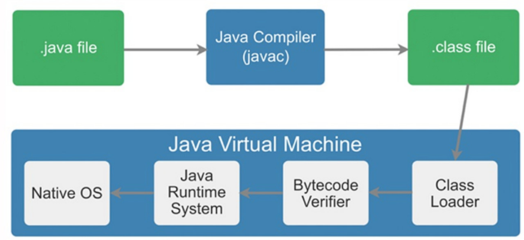

对于开发人员，了解字节码可以更准确、直观地理解Java语言中更深层次的东西，比如通过字节码，可以很直观地看到Volatile关键字如何在字节码上生效。
另外，字节码增强技术在Spring AOP、各种ORM框架、热部署中的应用屡见不鲜，深入理解其原理对于我们来说大有裨益。
除此之外，由于JVM规范的存在，只要最终可以生成符合规范的字节码就可以在JVM上运行，因此这就给了各种运行在JVM上的语言（如Scala、Groovy、Kotlin）一种契机，
可以扩展Java所没有的特性或者实现各种语法糖。理解字节码后再学习这些语言，可以"逆流而上"，从字节码视角看它的设计思路，学习起来也"易如反掌"。

本文重点着眼于字节码增强技术，从字节码开始逐层向上，由JVM字节码操作集合到Java中操作字节码的框架，再到我们熟悉的各类框架原理及应用，也都会一一进行介绍。

### 1.2.字节码结构

java文件通过javac编译后将得到一个.class文件，比如编写一个简单的ByteCodeDemo类，如下图2的左侧部分：

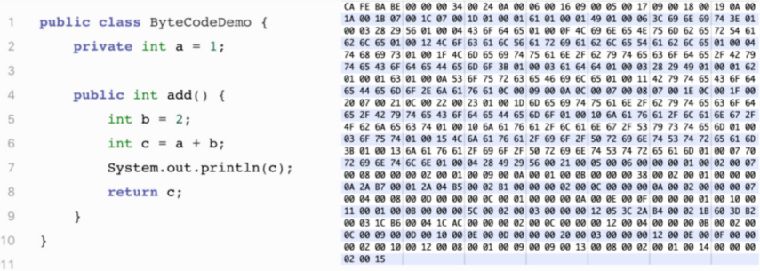

编译后生成ByteCodeDemo.class文件，打开后是一堆十六进制数，按字节为单位进行分割后展示如图2右侧部分所示。上文提及过，JVM对于字节码是有规范要求的，那么看似杂乱的十六进制符合什么结构呢？
JVM规范要求每一个字节码文件都要由十部分按照固定的顺序组成，整体结构如图3所示。接下来我们将一一介绍这十个部分：

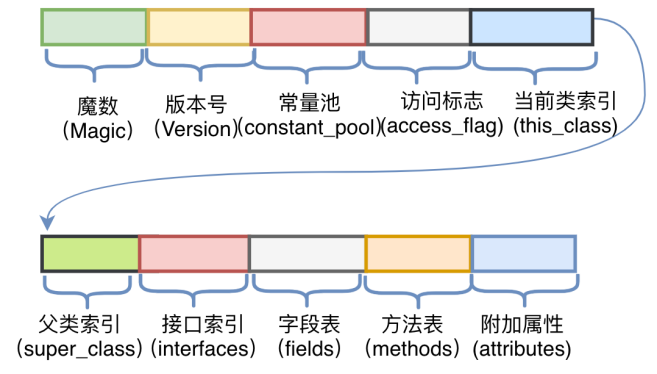

（1） 魔数（Magic Number）

所有的.class文件的前四个字节都是魔数，魔数的固定值为：0xCAFEBABE。魔数放在文件开头，JVM可以根据文件的开头来判断这个文件是否可能是一个.class文件，如果是，才会继续进行之后的操作。

有趣的是，魔数的固定值是Java之父James Gosling制定的，为CafeBabe（咖啡宝贝），而Java的图标为一杯咖啡。

（2） 版本号

版本号为魔数之后的4个字节，前两个字节表示次版本号（Minor Version），后两个字节表示主版本号（Major Version）。上图2中版本号为"00 00 00 34"，
次版本号转化为十进制为0，主版本号转化为十进制为52，在Oracle官网中查询序号52对应的主版本号为1.8，所以编译该文件的Java版本号为1.8.0。

（3） 常量池（Constant Pool）

紧接着主版本号之后的字节为常量池入口。常量池中存储两类常量：字面量与符号引用。字面量为代码中声明为Final的常量值，
符号引用如类和接口的全局限定名、字段的名称和描述符、方法的名称和描述符。常量池整体上分为两部分：常量池计数器以及常量池数据区，如下图4所示。

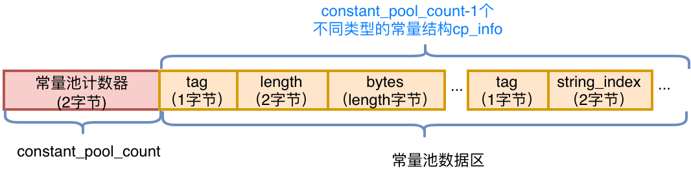

- 常量池计数器（constant_pool_count）：由于常量的数量不固定，所以需要先放置两个字节来表示常量池容量计数值。
  图2中示例代码的字节码前10个字节如下图5所示，将十六进制的24转化为十进制值为36，排除掉下标"0"，也就是说，这个类文件中共有35个常量。

  
- 常量池数据区：数据区是由（constant_pool_count-1）个cp_info结构组成，一个cp_info结构对应一个常量。在字节码中共有14种类型的cp_info（如下图6所示），每种类型的结构都是固定的

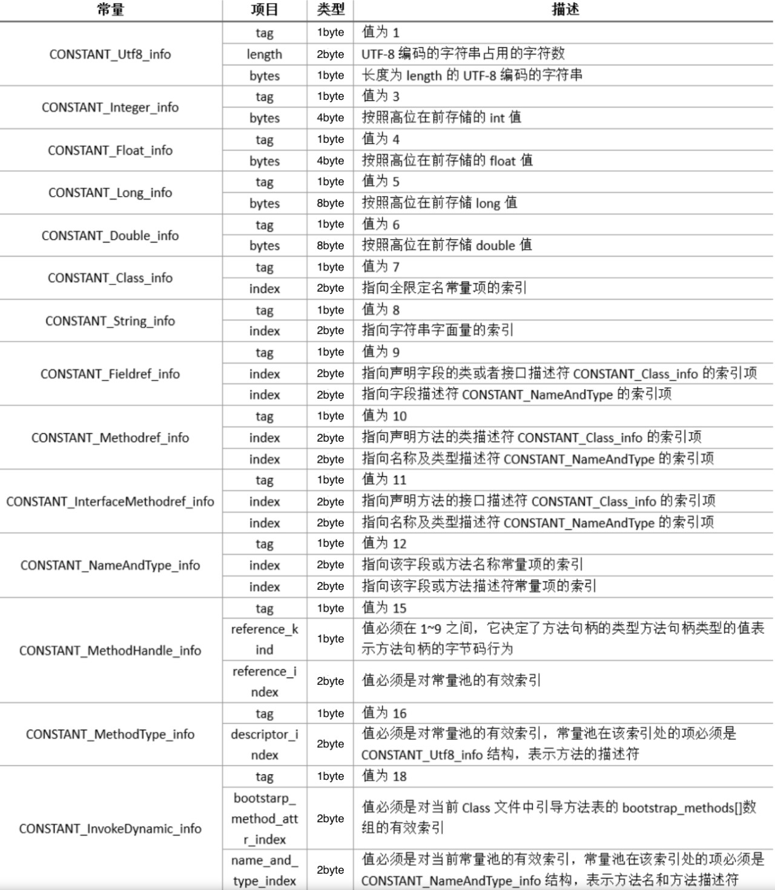

具体以CONSTANT_utf8_info为例，它的结构如下图7左侧所示。首先一个字节"tag"，它的值取自上图6中对应项的Tag，由于它的类型是utf8_info，所以值为"01"。
接下来两个字节标识该字符串的长度Length，然后Length个字节为这个字符串具体的值。从图2中的字节码摘取一个cp_info结构，如下图7右侧所示。将它翻译过来后，其含义为：该常量类型为utf8字符串，长度为一字节，数据为"a"。

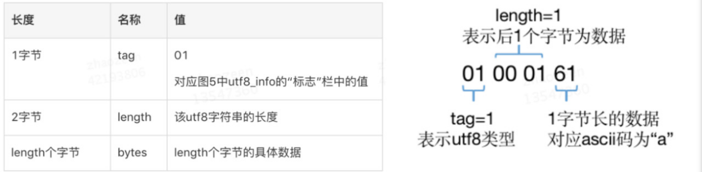

其他类型的cp_info结构在本文不再赘述，整体结构大同小异，都是先通过Tag来标识类型，然后后续n个字节来描述长度和（或）数据。
先知其所以然，以后可以通过javap -verbose ByteCodeDemo命令，查看JVM反编译后的完整常量池，如下图8所示。可以看到反编译结果将每一个cp_info结构的类型和值都很明确地呈现了出来。

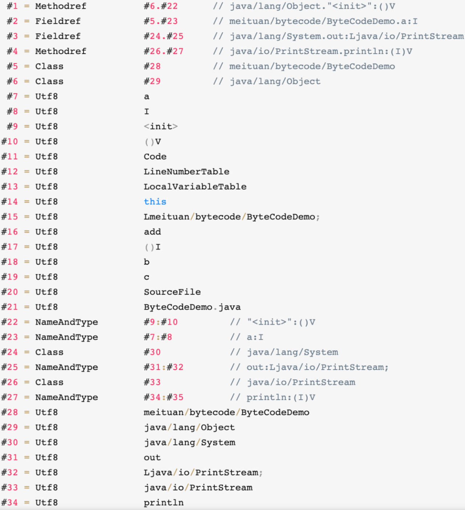

（4） 访问标志

常量池结束之后的两个字节，描述该Class是类还是接口，以及是否被Public、Abstract、Final等修饰符修饰。JVM规范规定了如下图9的访问标志（Access_Flag）。
需要注意的是，JVM并没有穷举所有的访问标志，而是使用按位或操作来进行描述的，比如某个类的修饰符为Public Final，则对应的访问修饰符的值为ACC_PUBLIC | ACC_FINAL，即0x0001 | 0x0010=0x0011。

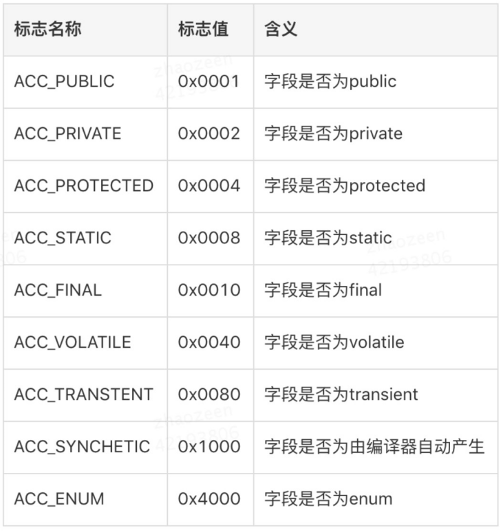

（5） 当前类名

访问标志后的两个字节，描述的是当前类的全限定名。这两个字节保存的值为常量池中的索引值，根据索引值就能在常量池中找到这个类的全限定名。

（6） 父类名称

当前类名后的两个字节，描述父类的全限定名，同上，保存的也是常量池中的索引值。

（7） 接口信息

父类名称后为两字节的接口计数器，描述了该类或父类实现的接口数量。紧接着的n个字节是所有接口名称的字符串常量的索引值。

（8） 字段表

字段表用于描述类和接口中声明的变量，包含类级别的变量以及实例变量，但是不包含方法内部声明的局部变量。字段表也分为两部分，第一部分为两个字节，描述字段个数；第二部分是每个字段的详细信息fields_info。字段表结构如下图所示

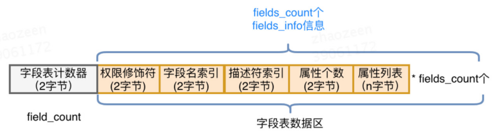

以图2中字节码的字段表为例，如下图11所示。其中字段的访问标志查图9，0002对应为Private。通过索引下标在图8中常量池分别得到字段名为"a"，描述符为"I"（代表int）。
综上，就可以唯一确定出一个类中声明的变量private int a。


（9）方法表

字段表结束后为方法表，方法表也是由两部分组成，第一部分为两个字节描述方法的个数；第二部分为每个方法的详细信息。方法的详细信息较为复杂，包括方法的访问标志、方法名、方法的描述符以及方法的属性，如下图所示：

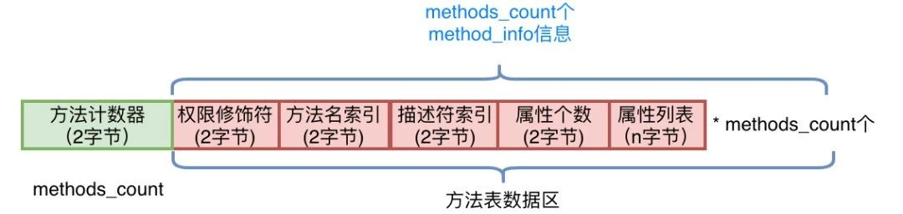

方法的权限修饰符依然可以通过图9的值查询得到，方法名和方法的描述符都是常量池中的索引值，可以通过索引值在常量池中找到。而"方法的属性"这一部分较为复杂，直接借助javap
-verbose将其反编译为人可以读懂的信息进行解读，如图13所示。可以看到属性中包括以下三个部分：

- "Code区"：源代码对应的JVM指令操作码，在进行字节码增强时重点操作的就是"Code区"这一部分。
- "LineNumberTable"：行号表，将Code区的操作码和源代码中的行号对应，Debug时会起到作用（源代码走一行，需要走多少个JVM指令操作码）。
- "LocalVariableTable"：本地变量表，包含This和局部变量，之所以可以在每一个方法内部都可以调用This，是因为JVM将This作为每一个方法的第一个参数隐式进行传入。当然，这是针对非Static方法而言。

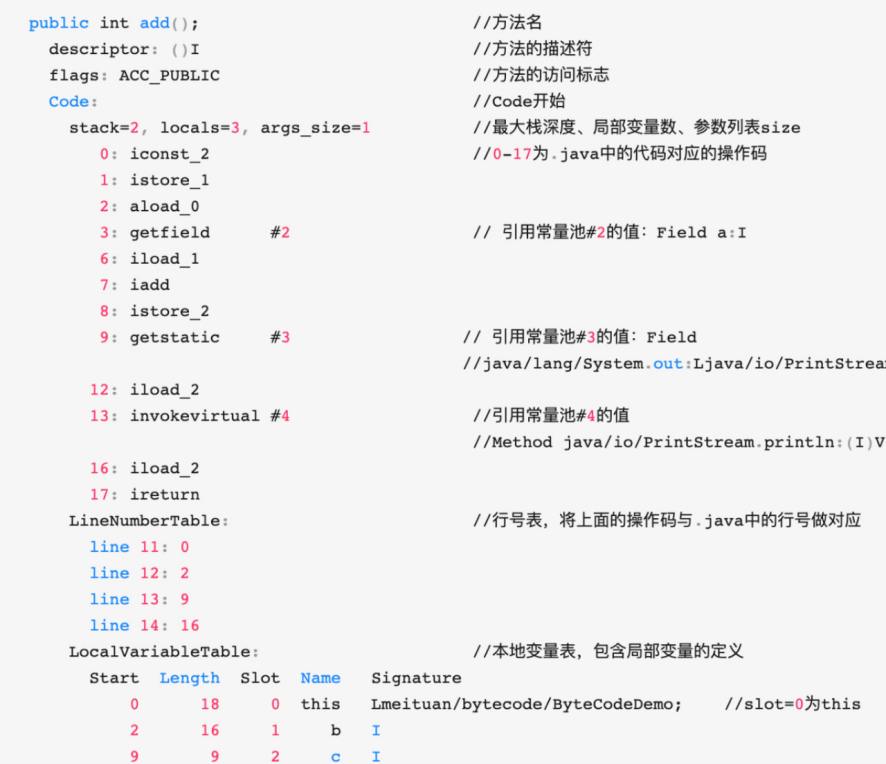

（10）附加属性表

字节码的最后一部分，该项存放了在该文件中类或接口所定义属性的基本信息。

### 1.3.字节码操作集合

在上图13中，Code区的红色编号0～17，就是.java中的方法源代码编译后让JVM真正执行的操作码。为了帮助人们理解，反编译后看到的是十六进制操作码所对应的助记符，
十六进制值操作码与助记符的对应关系，以及每一个操作码的用处可以查看Oracle官方文档进行了解，在需要用到时进行查阅即可。
比如上图中第一个助记符为iconst_2，对应到图2中的字节码为0x05，用处是将int值2压入操作数栈中。以此类推，对0~17的助记符理解后，就是完整的add()方法的实现。

### 1.4.操作数栈和字节

JVM的指令集是基于栈而不是寄存器，基于栈可以具备很好的跨平台性（因为寄存器指令集往往和硬件挂钩），但缺点在于，要完成同样的操作，
基于栈的实现需要更多指令才能完成（因为栈只是一个FILO结构，需要频繁压栈出栈）。另外，由于栈是在内存实现的，而寄存器是在CPU的高速缓存区，相较而言，基于栈的速度要慢很多，这也是为了跨平台性而做出的牺牲。

我们在上文所说的操作码或者操作集合，其实控制的就是这个JVM的操作数栈。为了更直观地感受操作码是如何控制操作数栈的，以及理解常量池、变量表的作用，
将add()方法的对操作数栈的操作制作为GIF，如下图14所示，图中仅截取了常量池中被引用的部分，以指令iconst_2开始到ireturn结束，与图13中Code区0~17的指令一一对应：

### 1.5.查看字节码工具

如果每次查看反编译后的字节码都使用javap命令的话，好非常繁琐。这里推荐一个Idea插件：jclasslib。
使用效果如图15所示，代码编译后在菜单栏"View"中选择"Show Bytecode With jclasslib"，可以很直观地看到当前字节码文件的类信息、常量池、方法区等信息。

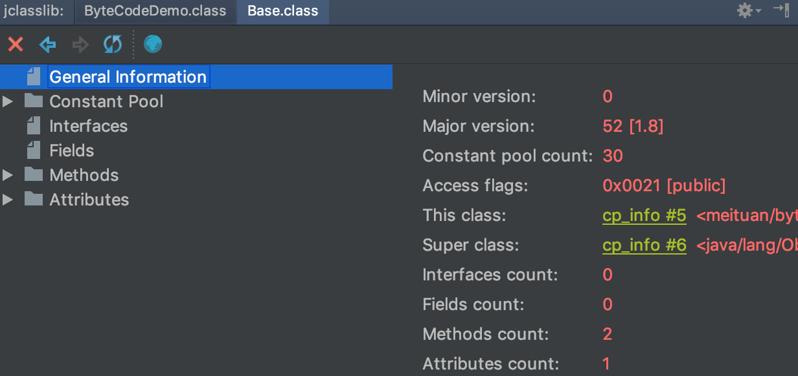

### 1.6.字节码框架

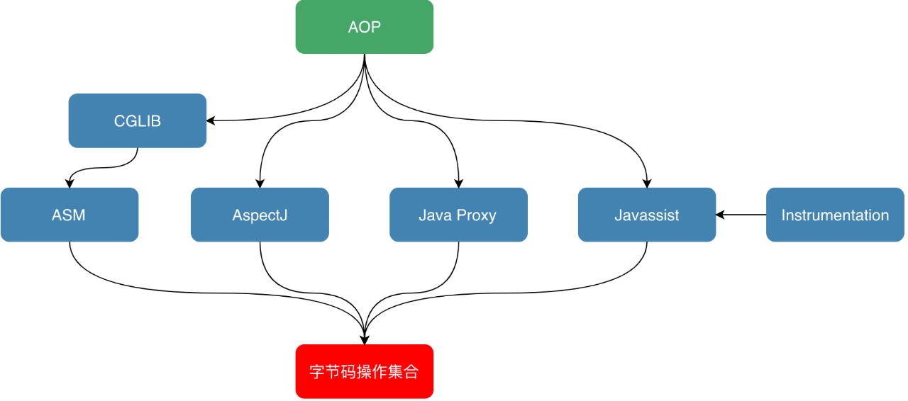

## 2.插入式注解JSR269

- [Java-JSR-269-插入式注解处理器](https://liuyehcf.github.io/2018/02/02/Java-JSR-269-%E6%8F%92%E5%85%A5%E5%BC%8F%E6%B3%A8%E8%A7%A3%E5%A4%84%E7%90%86%E5%99%A8/)
- [Java JSR-269 插入式注解处理器](https://blog.csdn.net/ME546926/article/details/126270868)
- TreeMaker基础用法：[Java 中的屠龙之术：如何修改语法树？](https://my.oschina.net/u/4030990/blog/3211858)
- 其实就是远程debug [IDEA结合maven进行编译期注解处理器调试](https://blog.csdn.net/duzm200542901104/article/details/126955491)

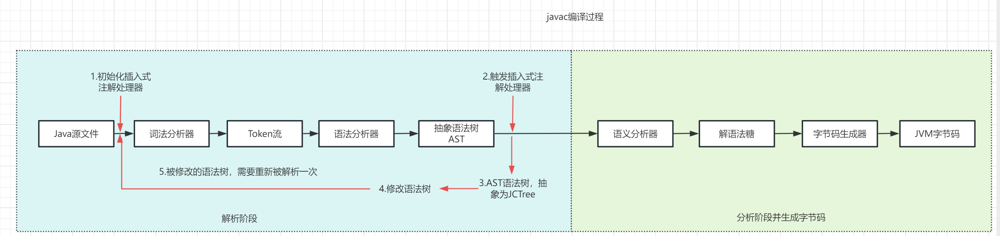

### 2.1.使用

继承AbstractProcessor，实现process方法即可，但是jdk提供的工具操作字节码非常繁琐，所以可以使用jdk提供的额外的工具包tools.jar内部的treeMarker，正常情况是引入不到的，需要我们单独引入本地

```xml
<!--自定义编译器注解-->
<dependency>
    <groupId>com.google.auto.service</groupId>
    <artifactId>auto-service</artifactId>
    <version>1.0-rc6</version>
</dependency>

<!-- jdk9之后移除了tools.jar。所以在自定义插入式注解时最好使用jdk8 -->
<dependency>
    <groupId>com.sun</groupId>
    <artifactId>tools</artifactId>
    <version>1.8</version>
    <scope>system</scope>
    <systemPath>${java.home}/lib/tools.jar</systemPath>
</dependency>
```

使用案例：
- [使用注解处理器实现动态生成get和set方法](https://www.cnblogs.com/linmt/p/16916472.html)
- [Provider not found + maven 找不到符号问题 + @Autoservice无效](https://blog.csdn.net/qq_37410417/article/details/124301311)
- [Java注解编译期处理AbstractProcessor详解](https://blog.csdn.net/agonie201218/article/details/130940854)

### 2.2.基本概念

- [Java 中的屠龙之术：如何修改语法树？](https://blog.csdn.net/youanyyou/article/details/120582478)

JCTree 和 TreeMaker 是 tools.jar 对我们提供的工具。

JCTree：是语法树元素的基类，包含一个重要的字段 pos，该字段用于指明当前语法树节点（JCTree）在语法树中的位置。 JCTree 是一个抽象类，重要的几个子类如下
1. JCStatement：声明语法树节点，常见的子类如下
- JCBlock：语句块语法树节点
- JCReturn：return 语句语法树节点
- JCClassDecl：类定义语法树节点
- JCVariableDecl：字段 / 变量定义语法树节点
2. JCMethodDecl：方法定义语法树节点
3. JCModifiers：访问标志语法树节点
4. JCExpression：表达式语法树节点，常见的子类如下
- JCAssign：赋值语句语法树节点
- JCIdent：标识符语法树节点，可以是变量，类型，关键字等等

TreeMaker：用于创建一系列的语法树节点，用于帮助我们自动将JCTree实例化，并设置pos字段。核心方法如下
- TreeMaker.Modifiers：用于创建访问标志语法树节点（JCModifiers）
- TreeMaker.ClassDef：用于创建类定义语法树节点（JCClassDecl）
- TreeMaker.MethodDef： 用于创建方法定义语法树节点（JCMethodDecl）
- TreeMaker.VarDef 用于创建字段 / 变量定义语法树节点（JCVariableDecl）
- TreeMaker.Ident 用于创建标识符语法树节点。比如使用this super等（JCIdent）
- TreeMaker.Return 用于创建 return 语句（JCReturn）
- TreeMaker.Select 用于创建域访问 / 方法访问（这里的方法访问只是取到名字，方法的调用需要用 TreeMaker.Apply）语法树节点（JCFieldAccess）
- TreeMaker.NewClass 用于创建 new 语句语法树节点（JCNewClass）
- TreeMaker.Apply 用于创建方法调用语法树节点（JCMethodInvocation）
- TreeMaker.Assign 用户创建赋值语句语法树节点（JCAssign）
- TreeMaker.Exec 用于创建可执行语句语法树节点（JCExpressionStatement）
- TreeMaker.Block 用于创建组合语句的语法树节点（JCBlock）

## 3.Java Agent

### 3.1.介绍
Java agent，借助JVM 的Instrumentation API, 开发人员可以在类加载时转换字节码，从而实现对应用程序的监视、调试或性能优化等操作。

使用场景：通常被用于、代码检测、日志记录等方面。
- 热部署：不部署服务而对线上服务做修改，可以做打点、增加日志等操作。
- Mock：测试时候对某些服务做Mock。
- 性能诊断工具：比如Arthas，实现无侵入地跟踪一个正在运行的JVM，监控到类和方法级别的状态信息。
- 性能监控工具：比如skywalking，实现无侵入的监控JVM。

作用：
- 可以在加载class文件之前做拦截把字节码做修改
- 可以在运行期将已经加载的类的字节码做变更，但是这种情况下会有很多的限制
- 还有其他的一些小众的功能
  - 获取所有已经被加载过的类
  - 获取所有已经被初始化过了的类（执行过了clinit方法，是上面的一个子集）
  - 获取某个对象的大小
  - 将某个jar加入到bootstrapclasspath里作为高优先级被bootstrapClassloader加载
  - 将某个jar加入到classpath里供AppClassloard去加载
  - 设置某些native方法的前缀，主要在查找native方法的时候做规则匹配

### 3.2.架构设计

#### 3.2.1.JPDA
JPDA（Java Platform Debugger Architecture）。 如果JVM启动时开启了JPDA，那么类是允许被重新加载的。
在这种情况下，已被加载的旧版本类信息可以被卸载，然后重新加载新版本的类。
正如JDPA名称中的Debugger，JDPA其实是一套用于调试Java程序的标准，任何JDK都必须实现该标准。

JPDA定义了一整套完整的体系，它将调试体系分为三部分，并规定了三者之间的通信接口。三部分由低到高分别是Java 虚拟机工具接口（JVMTI），
Java 调试协议（JDWP）以及 Java 调试接口（JDI），三者之间的关系如下图所示。

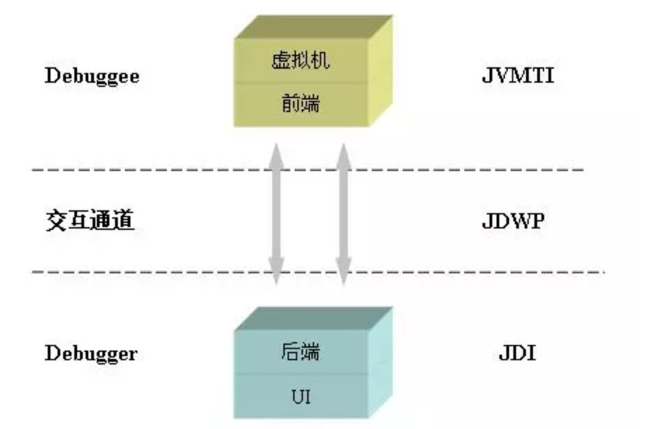

#### 3.2.2.JVMTI

JVMTI（JVM TOOL INTERFACE，JVM工具接口）是JVM提供的一套对JVM进行操作的工具接口。

作用：JVMTI通过接口注册各种事件勾子，可以实现对JVM的多种操作。在JVM事件触发时，同时触发预定义的勾子，以实现对各个JVM事件的响应，
事件包括类文件加载、异常产生与捕获、线程启动和结束、进入和退出临界区、成员变量修改、GC开始和结束、方法调用进入和退出、临界区竞争与等待、VM启动与退出等等。

#### 3.2.3.Java Agent

Java Agent就是JVMTI的一种实现，有两种启动方式:
1. JVM启动时载入：随Java进程启动而启动，使用javaagent:xxx.jar的方式
2. 运行时载入：   通过Attach API，将模块（jar包）动态地Attach到指定进程id的Java进程内。

### 3.3.Instrument

Instrument是JVM提供的一个可以修改已加载类的类库，专门为Java语言编写的插桩服务提供支持。
在JDK 1.6以前，Instrument只能在JVM刚启动开始加载类时生效，而在JDK 1.6之后，Instrument支持了在运行时对类定义的修改。
要使用Instrument的类修改功能，我们需要实现它提供的ClassFileTransformer接口，定义一个类文件转换器。
接口中的transform()方法会在类文件被加载时调用，而在Transform方法里，我们可以利用上文中的ASM或Javassist对传入的字节码进行改写或替换，生成新的字节码数组后返回。

### 3.4.案例

#### 3.4.1.依赖
```xml
<!-- 用来修改字节码 -->
<dependency>
    <groupId>org.javassist</groupId>
    <artifactId>javassist</artifactId>
    <version>3.27.0-GA</version>
</dependency>

<!-- attach机制需要 -->
<dependency>
    <groupId>com.sun</groupId>
    <artifactId>tools</artifactId>
    <version>1.8</version>
    <scope>system</scope>
    <systemPath>D:/Program Files/jdk/jdk1.8.0_111/lib/tools.jar</systemPath>
</dependency>
```

#### 3.4.2.目标类

以下案例是将BaseJavaAgent类改写，在其中编写main方法，每五秒调用一次process()方法，在process()方法中输出一行"process"。
我们的目的是，将process()方法做替换，在其前后分别打印"start"和"end"。 

```java
package com.zx.bytes.javaagent;
import java.lang.management.ManagementFactory;
public class BaseJavaAgent {
    public static void main(String[] args) {
        String name = ManagementFactory.getRuntimeMXBean().getName();
        String s = name.split("@")[0];
        //打印当前Pid
        System.out.println("pid:" + s);
        while (true) {
            try {
                Thread.sleep(5000L);
            } catch (Exception e) {
                break;
            }
            process();
        }
    }
    public static void process() {
        System.out.println("process");
    }
}
```

#### 3.4.3.实现ClassFileTransformer接口

定义一个实现了ClassFileTransformer接口的类TestTransformer，依然在其中利用Javassist对BaseJavaAgent类中的process()方法进行增强，在前后分别打印"start"和"end"，代码如下：

```java
import java.lang.instrument.ClassFileTransformer;
import java.security.ProtectionDomain;
import javassist.ClassPool;
import javassist.CtClass;
import javassist.CtMethod;

public class TestTransformer implements ClassFileTransformer {
    @Override
    public byte[] transform(ClassLoader loader, String className, Class<?> classBeingRedefined,
            ProtectionDomain protectionDomain, byte[] classfileBuffer) {
        System.out.println("Transforming " + className);
        try {
            ClassPool cp = ClassPool.getDefault();
            CtClass cc = cp.get("com.zx.bytes.javaagent.BaseJavaAgent");
            CtMethod m = cc.getDeclaredMethod("process");
            m.insertBefore("{ System.out.println(\"start\"); }");
            m.insertAfter("{ System.out.println(\"end\"); }");
            return cc.toBytecode();
        } catch (Exception e) {
            e.printStackTrace();
        }
        return null;
    }
}
```

#### 3.4.4.加载Transformer

javaagent有启动加载和运行时加载两种方式。
- jvm 参数形式： 调用 premain 方法
- attach 方式： 调用 agentmain 方法

```java
package com.zx.bytes.javaagent;

import java.lang.instrument.Instrumentation;

public class TestAgent {

    public static void agentmain(String args, Instrumentation inst) {
        //指定我们自己定义的Transformer，在其中利用Javassist做字节码替换
        inst.addTransformer(new TestTransformer(), true);
        try {
            //因为class可能已经记载到JVM中，所以需要重定义类并载入新的字节码
            inst.retransformClasses(BaseJavaAgent.class);
            System.out.println("Agent Load Done.");
        } catch (Exception e) {
            System.out.println("agent load failed!");
        }
    }

    public static void premain(String args, Instrumentation inst) {
        //添加Transformer到Instrumentation中，等待类加载的时候自动修改即可
        inst.addTransformer(new TestTransformer(), true);
    }
}
```

#### 3.4.5.maven打包插件
javaagent的jar有些特殊。需要将TestAgent类打成一个包含MANIFEST.MF的jar包，其中MANIFEST.MF文件中需要指定TestAgent的全限定名。
```text
Manifest-Version: 1.0
Created-By: Maven Jar Plugin 3.2.0
Build-Jdk-Spec: 11
Implementation-Title: lab_063_util_bytes
Implementation-Version: 0.0.1-SNAPSHOT
Agent-Class: com.zx.bytes.javaagent.TestAgent
Can-Redefine-Classes: true
Can-Retransform-Classes: true
Permissions: all-permissions
Premain-Class: com.zx.bytes.javaagent.TestAgent
```
这里使用shade插件，打包后，所有依赖都会进入一个jar中。
```xml
<plugin>
    <groupId>org.apache.maven.plugins</groupId>
    <artifactId>maven-shade-plugin</artifactId>
    <version>3.1.0</version>
    <executions>
        <execution>
            <id>shade-my-jar</id>
            <phase>package</phase>
            <goals>
                <goal>shade</goal>
            </goals>
            <configuration>
                <keepDependenciesWithProvidedScope>false
                </keepDependenciesWithProvidedScope>
                <promoteTransitiveDependencies>false</promoteTransitiveDependencies>
                <createDependencyReducedPom>false</createDependencyReducedPom>
                <minimizeJar>false</minimizeJar>
                <createSourcesJar>false</createSourcesJar>
                <transformers>
                    <transformer
                            implementation="org.apache.maven.plugins.shade.resource.ManifestResourceTransformer">
                        <manifestEntries>
                            <!-- 1. 启动方式的agent -->
                            <Premain-Class>com.zx.bytes.javaagent.TestAgent</Premain-Class>
                            <!-- 2. attach方式的agent -->
                            <Agent-Class>com.zx.bytes.javaagent.TestAgent</Agent-Class>
                            <!--agent的权限-->
                            <Permissions>all-permissions</Permissions>
                            <Can-Redefine-Classes>true</Can-Redefine-Classes>
                            <Can-Retransform-Classes>true</Can-Retransform-Classes>
                        </manifestEntries>
                    </transformer>
                </transformers>
            </configuration>
        </execution>
    </executions>
</plugin>
```

#### 3.4.6.JVM启动加载

jvm参数中添加以下参数
```shell
java -javaagent:D:\workspace-yg\agent.jar -jar app.jar
```

#### 3.4.7.attach加载

需要使用Attach API，作用是提供JVM进程间通信的能力，比如说我们为了让另外一个JVM进程把线上服务的线程Dump出来，
会运行jstack或jmap的进程， 并传递pid的参数，告诉它要对哪个进程进行线程Dump，这就是Attach API做的事情。
在下面，我们将通过Attach API的loadAgent()方法，将打包好的Agent jar包动态Attach到目标JVM上。具体实现起来的步骤如下：

```java
package com.zx.bytes.javaagent;

import com.sun.tools.attach.AgentInitializationException;
import com.sun.tools.attach.AgentLoadException;
import com.sun.tools.attach.AttachNotSupportedException;
import com.sun.tools.attach.VirtualMachine;
import java.io.IOException;

public class Attacher {

    public static void main(String[] args) throws AttachNotSupportedException, IOException,
            AgentLoadException, AgentInitializationException {
        // 传入目标 JVM pid
        VirtualMachine vm = VirtualMachine.attach("18376");
        vm.loadAgent("D:\\workspace\\agent.jar");
    }
}
```

由于在MANIFEST.MF中指定了Agent-Class，所以在Attach后，目标JVM在运行时会走到TestAgent类中定义的agentmain()方法，
而在这个方法中，我们利用Instrumentation，将指定类的字节码通过定义的类转化器TestTransformer做了BaseJavaAgent类的字节码替换（通过javassist），并完成了类的重新加载。

#### 3.4.8.运行效果

attach加载效果：先运行BaseJavaAgent中的main()方法，启动一个JVM，可以在控制台看到每隔五秒输出一次"process"。
接着执行Attacher中的main()方法，并将上一个JVM的pid传入。此时回到上一个main()方法的控制台，
可以看到现在每隔五秒输出"process"前后会分别输出"start"和"end"，也就是说完成了运行时的字节码增强，并重新载入了这个类。

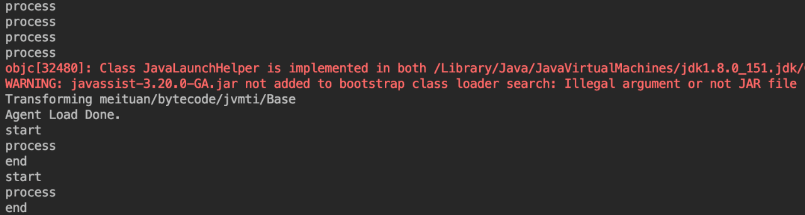

## 4.动态代理

代理一般会实现它所表示的实际对象的接口。代理可以访问实际对象，但是延迟实现实际对象的部分功能，实际对象实现系统的实际功能，
- 为什么使用动态代理? 因为动态代理可以对请求进行任何处理
- 使用它有哪些好处?因为动态代理可以对请求进行任何处理
- 哪些地方需要动态代理?不允许直接访问某些类；对访问要做特殊处理等


### 4.1.常用的动态代理
常用的动态代理技术：Java的动态代理（Dynamic Proxy）和CGLIB代理。
1. JDK动态代理：JDK提供的代理机制。依赖于Java的反射，代理类必须实现某个接口，本质是生成一个接口的实现类，内部调用代理类。 基本步骤如下：
   - 创建一个实现了InvocationHandler接口的处理器类。
   - 通过Proxy.newProxyInstance()方法创建代理对象，传入类加载器、代理类实现的接口列表以及处理器对象。
   - 通过代理对象调用方法，实际上会调用处理器对象的invoke()方法。
2. CGLIB代理：CGLIB是一个第三方库，可以在没有接口的情况下为类创建代理。CGLIB使用字节码技术来生成代理类，因此比Java的动态代理更加灵活，但也更加复杂。基本步骤如下：
   - 创建一个实现了MethodInterceptor接口的拦截器类。
   - 通过Enhancer类的create()方法创建代理对象，传入被代理的类以及拦截器对象。
   - 通过代理对象调用方法，实际上会调用拦截器对象的intercept()方法。

注意：CGLIB依赖字节码增强技术实现的，可以代理任意类，非常灵活，但是性能会差很多。而jdk代理实现简单，性能很好。 
在选型是时，需要考虑你的具体需求，例如是否需要处理没有接口的类，以及你对性能的要求等。例如spring框架高版本中充分考虑了灵活度，默认使用CGLIB

除了以上技术还，还可以使用以下技术实现代理。本质与上述技术有很大区别，是直接修改字节码进行增加。例如：ASM、Javassist、Byte Buddy


### 4.2.JDK动态代理

目前Java开发包中包含了对动态代理的支持，但是其实现只支持对接口的的实现。

其实现主要通过java.lang.reflect.Proxy类和java.lang.reflect.InvocationHandler接口。

Proxy类主要用来创建动态代理对象，InvocationHandler接口用来处理逻辑。

实现原理：

Proxy类内部有个ProxyClassFactory类。用于创建维护动态代理的类。

其中真正的在创建动态代理类的class文件的是这行代码。根据我们指定的代理的类，生产一个代理的class文件，并加载的JVM中。

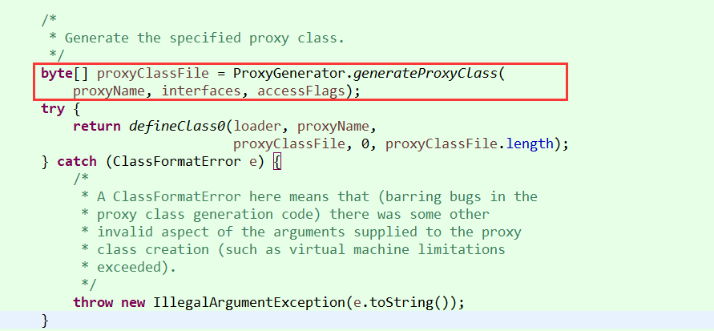

可以初步看出这里生产class文件，并进行进行io操作保存到本地，之后将class的io流返回出去。

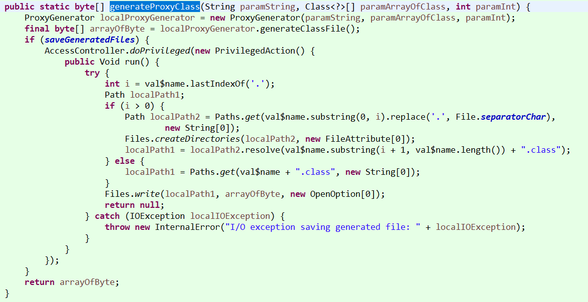

将代理的class生产到D盘
```java
public static void main(String[] args) {
    // 读取class文件
    byte[] proxyClassFile = sun.misc.ProxyGenerator.generateProxyClass("$Proxy1", new Class[]{InterfaceA.class}, 1);
    try {
        FileOutputStream out = new FileOutputStream("D://$Proxy1.class") ;
        out.write(proxyClassFile);
        out.close();
    } catch (FileNotFoundException e) {
        e.printStackTrace();
    } catch (IOException e) {
        e.printStackTrace();
    }
}
```

使用Java Decompiler反编译这个class文件

可以看到代理类继承了 Proxy 类，并实现了 InterfaceA 接口，由此也可以看到
JDK 动态代理为什么需要实现接口，已经继承了 Proxy是不能再继承其余类了。

其中实现了 InterfaceA 的 execute() 方法，并通过 InvocationHandler 中的
invoke() 方法来进行调用的。

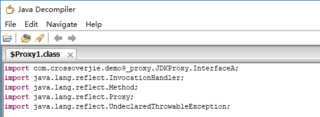


### 4.2.CGLIB
见->java加强