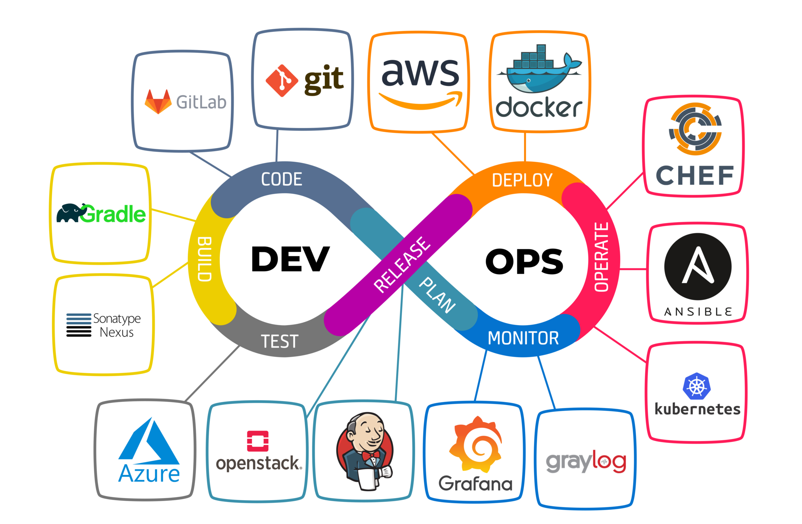

# 1.devOps

- [阿里巴巴DevOps实践指南.pdf](阿里巴巴DevOps实践指南.pdf)
- [2022腾讯研发大数据报告](https://research.tencent.com/article?id=JMQ)

## 1.介绍

### 1.1.什么是devops

DevOps 的理念就是打破研发与运维的屏障，让研发（Development）和运维（Operations）一体化，让团队从业务需求出发，向着同一个目标前进。

字面意思上说 DevOps 是指“开发运维一体化”，即通过工具辅助开发完成运维的部分工作，减少成本。但深入理解了 DevOps 之后，

你会发现 DevOps 其实是一种软件研发管理的思想，方法论，他追求的是一种没有隔阂的理想的研发协作的状态，可能涉及到的角色有开发、测试、产品、项目管理、运维等等。

所以我们认为，为了帮助研发团队在保持质量的前提下提高交付效率的方法和方法论都隶属于 DevOps 的范畴。

最终的目标：是降低公司运营成本。

最终效果：no op、no test。

真实情况：运维部门开发devops工具、测试人员提供自动化测试工具、开发人员自行完成开发、测试、运维的工作。

### 1.2.原则

Google 提出的 5 个 DevOps 原则

- 精简组织架构；
- 愿意承担一部分试错带来的损失；
- 分阶段地一小步一小步地进行转型；
- 最大化地利用工具和自动化流程；
- 对所有的过程和结果进行记录和分析。

所以 DevOps 不是简单的开发软件化，而是企业的学习能力不断提升的结果，将企业改造成敏捷应对的学习型组织，运用新的工具，
优化组织架构和流程，不断地进行自我革命和创新的方式。工具是辅助，而非基础。

### 1.3.关键词

- CI：持续集成，强调开发人员提交代码后，立刻自动进行构建、（单元）测试、代码扫描等操作，目的是尽早发现代码中的质量问题。
- CD：持续部署，将集成好的软件包，安装设计好的步骤进行部署
- 流水线：通过整合多种工具非方式，实现可定制化的CI&CD。

总结：CI&CD是devops中的一重要的一部分。CI&CD 不等于 devops。而流水线只是个工具，是CI&CD的实现的方案。

### 1.4.生命周期

完整的生命周期包括：2个阶段8个环节，产品形成闭环。

- dev: 开发阶段
  - plan： 计划环节，包括需求收集、问题反馈等
  - code： 开发环节。
  - build：编译环节。CI的一部分
  - test： 编译环节。CI的一部分
- ops： 运维阶段
  - release： 发布环节。CD的一部分，将编译后的软件发布到制品库
  - deploy：  部署环节。CD的一部分，从制品库获得软件进行部署
  - opearate：操作环节。线上运行
  - monitor： 监控环境。线上监控

而实际中，根据参与人员职责的不同也可以划分下面四个步骤：

- 需求：非技术步骤，敏捷开发、瀑布开发的方式管理项目进度。
- 开发：开发人员codeing的步骤
- CI&CD：自动化完成
- 运行&监控：自动化完成

下面我们按照这4个步骤说明devops

## 2.需求

包括：plan环节

敏捷工具全汇总:[https://zhuanlan.zhihu.com/p/371305530](https://zhuanlan.zhihu.com/p/371305530)

- Leangoo；可视化实时项目协作平台。[https://www.leangoo.com/](https://www.leangoo.com/)
- tapd:腾讯开发的敏捷协作平台。[https://www.tapd.cn/](https://www.tapd.cn/)
- 禅道:第一款国产的开源项目管理软件。[https://gitee.com/wwccss/zentaopms](https://gitee.com/wwccss/zentaopms)
- DooTask:开源在线项目任务管理工具，提供各类文档协作工具、在线思维导图、在线流程图、项目管理、任务分发、即时IM，文件管理等工具。
[https://github.com/kuaifan/dootask](https://github.com/kuaifan/dootask)

很多公有云厂商也提供项目管理工具，方便整合devops

## 3.开发

包括：code 环节。这个步骤内容的工作全部依赖人员操作

1.代码托管。SVN就不说了，基本退出主流市场了

- GitHub：[https://github.com/](https://github.com/)
- Gitlab（官方SaaS服务，私有化部署极狐服务、社区开源版 三种）
- Gitee 中文代码托管平台：[https://gitee.com/](https://gitee.com/)
- opensource：[https://opensource.google.com/](https://opensource.google.com/)
- 云服务商提供的代码托管平台
  - 腾讯云coding：[https://cloud.tencent.com/product/coding-cr](https://cloud.tencent.com/product/coding-cr)
  - 腾讯工蜂：[https://code.tencent.com/](https://code.tencent.com/)
  - 阿里云codeup：[https://www.aliyun.com/product/yunxiao/codeup](https://www.aliyun.com/product/yunxiao/codeup)

2.开发工具。各种语言都有自己的开发工具

3.文档。技术文档非常重要，比如常用的 Confluence。

4.接口文档。

- swagger。嵌入式
- knife4j。swagger的增强版，国产界面，操作友好
- apiFox,postcat等国产接口，测试，文档、协同一站式工具。
- YApi。源码。[https://github.com/ymfe/yapi](https://github.com/ymfe/yapi),
   官网[https://yapi.ylzpay.com/](https://yapi.ylzpay.com/)

5.常见开发模式

- 分支开发。针对master创建特性分支，完成后再marge request到master
- 主干开发。将master项目fork到个人的项目中，完成后再marge request到原项目的master

6.规范。

- 统一认知
- 制定流程规范(卡流程、依赖工具)
- 定期Code Review

## 4.CI 持续集成

集成是软件个人研发部分向整体部分组合和交付，以便验证个人研发工作。持续集成是一种软件开发实践，团队成员频繁将他们的工作成果集成在一起(通常每人每天至少提交一次，这样每天就会有多次集成);
每次提交后，自动触发运行一次包含自动化验证集的构建任务，以便尽早发现集成问题。持续集成是一种质量反馈机制，其目的是“尽早发现代码中的质量问题”。

### 4.1. 代码编译
- maven
- gradle

### 4.2. 质量验证
Sonar：[https://www.sonarqube.org/](https://www.sonarqube.org/)
- [使用sonarqube分析项目组成员代码质量,并生成报表](https://gitee.com/wst021sh/SonarReport)
- [SonarQube代码质量管理教程](https://gitee.com/wst021sh/SonarQube-docs)

CodeDog： [https://github.com/Tencent/CodeAnalysis](https://github.com/Tencent/CodeAnalysis)
腾讯云代码分析（内部代号CodeDog）是集众多代码分析工具的云原生、分布式、高性能的代码综合分析跟踪管理平台，
其主要功能是持续跟踪分析代码，观测项目代码质量，支撑团队传承代码文化。

### 4.3. 自动化测试

- 单元测试：Junit、Mockito、PowerMock
- 性能测试： ContiPerf、JMH  
- 单元覆盖率工具：JaCoCo

### 4.4. 漏洞扫描
### 4.5. 代码混淆
### 4.6. 代码加固

1. 代码编译

2. 质量验证
    - Sonar：[https://www.sonarqube.org/](https://www.sonarqube.org/)
3. 自动化测试
    - 单元测试：Junit
    - jacoco：单元覆盖率工具。[https://github.com/jacoco/jacoco](https://github.com/jacoco/jacoco)
4. 漏洞扫描
5. 代码混淆
6. 代码加固

## 5.CD 持续部署

### 5.1.主要功能
包括 release、deploy 两个环节。简单说就是，如何保存软件，如何部署软件

部署是把集成好的软件包，按照预先设计的方案将其安装到计算节点上，并且保证系统可以正常启动。

持续部署是指能够自动化、多批次、可控地实现软件的部署，控制故障的影响范围或方便轻松解决故障问题。要做的事情如下

1. 软件包版本管理
2. 包依赖管理
3. 部署生产环境
4. 用户验收测试
5. 配置管理
6. 容器管理
7. 特性开关

### 5.2.release

我们编译的成果，可以是jar、war、exe、docker image等。

- Nexus：jar依赖管理工具，支持maven、gradle等。
- harbor: docker image管理平台。  
- Jenkins：开源自动化服务，拥有数百个插件，可以实现软件项目的自动构建、部署和测试。本质是无agent的shell命令的下发。

### 5.3.deploy

本质就是自动化运维，根据部署策略，将软件部署上去。

- Kubernetes：用来协调和编排容器，可以自动部署、维护和扩展生产中的容器群，而不需要手动发布微服务。
- Docker：用于构建、运行一个轻量级的容器的应用程序。k8s核心引擎。
- Istio：以 服务网格（service mesh） 的方式，确保服务中一致地应用安全、加密、可观察的等网络策略

- Ansible:是关于自动化的工具，可以用来实现云配置、网络、部署、配置管理和其他任务的自动化
- Chef：是关于自动化的工具，使用Ruby来自动配置服务器，在创建和配置大量的机器时，这可能非常有用。
- Terraform：是关于自动化的工具，可用于启动构建、版本管理和使用配置文件的进一步自动化

[DevOps/运维工具](https://www.oschina.net/project/tag/201/nms)

- Ansible
  - [ansible 简介](https://blog.csdn.net/redamancy_0227/article/details/115184357)
  - 提供一种最简单的方式用于发布、管理和编排计算机系统的工具。Ansible 是一个模型驱动的配置管理器，支持多节点发布、远程任务执行。默认使用 SSH 进行远程连接。无需在被管理节点上安装附加软件，可使用各种编程语言进行扩展。
  - [Ansible 极简教程](https://my.oschina.net/kangvcar/blog/1830155)
  
- OMS
  - 是一款轻量、全平台的开源运维管理系统（工具），目前主要的功能有 Webssh、Webvnc、隧道、定时任务、文件管理的基础功能以及批量分发命令、批量分发文件、定制脚本和任务的扩展功能
  - 源码:[https://github.com/ssbeatty/oms](https://github.com/ssbeatty/oms)
  - 文档：[https://wang918562230.gitbook.io/ssbeattyoms-wen-dang/](https://wang918562230.gitbook.io/ssbeattyoms-wen-dang/)

- ChengYing
  - 一站式全自动化全生命周期运维管家
  - 源码：[https://gitee.com/dtstack_dev_0/chengying](https://gitee.com/dtstack_dev_0/chengying)

- Know Streaming
  - 是滴滴开源的一站式 Apache Kafka 集群指标监控与运维管控平台
  - 源码：[https://github.com/didi/KnowStreaming/](https://github.com/didi/KnowStreaming/)

- Dolphins-DevOPS
  - 元豚科技-DevOPS-K8S服务自动化部署平台-云上业务搭建
  - 源码：[https://gitee.com/mirrors/Dolphins-DevOPS](https://gitee.com/mirrors/Dolphins-DevOPS)

- MegaIDE
  - MegaIDE是一款基于Kubernetes的云IDE管理系统
  - 源码[https://gitee.com/mega-lab/mega-ide](https://gitee.com/mega-lab/mega-ide)

### 5.4.发布策略

常见发布策略优缺点与

[https://mp.weixin.qq.com/s/FgQgg9wANAvzNyJ4VmFmTQ](https://mp.weixin.qq.com/s/FgQgg9wANAvzNyJ4VmFmTQ)

常见的发布策略：
- 停机发布，就是我们一般使用的部署方式。
- 金丝雀发布，只发布一部分。
- 灰度/滚动发布，金丝雀发布的延伸，可以自动回滚。对新版本进行小批量部署，小量流测试，没有问题后逐步加大部署量和引流量，最后把所有流量全部引导到新版本;
- 蓝绿发布，2套相同配置的环境，可进行切换。维护两个相同的主机环境，一个用户生产、一个用于预发布，轮换使用
- A/B测试，金丝雀发布的延伸，主要用与不用版本间进行差异对比和策略
- 流量隔离环境发布，相比灰度发布，只会影响固定的用户
- 暗箱发布:新版本被逐步测试和部署到生产环境中，用于开发人员分析与确认后，再通过开关系统开放给所有用户;

## 6.monitor

日志，作为监控的一种数据源

监控，分为三类，

- 基础指标监控，比如cpu，内存，磁盘，io，tcp，jvm等
- 日志的分析监控，比如使用kina汇总日志结果
- 链路追踪，zipkin追踪

常见的开源工具包括：
- Prometheus：通过收集HTTP端点来收集时间序列指标，并生成一个与这些数据交互的系统，提供深度查询、可视化、存储和其他功能。
- Zabbix：是一个为应用服务，网络服务和硬件监控提供的解决方案。Zabbix 将收集的数据存储在关系数据库中，如 MySQL，PostgreSQL 等。Zabbix 允许你监控简单的服务，如 HTTP 服务。
  Zabbix agent 端可以安装在 Windows 和 类 Unix 服务器上，用来检视系统参数，如 CPU 负载，内存和磁盘利用率等。
  另外，agent 可用于监视标准服务和自定义应用程序。Zabbix 也支持通过 SNMP、SSH 等方式，无需在要监视的服务器上安装代理。
- ELK：是由Elastic维护的三个开源项目Elasticsearch、Logstash和Kibana组合而成，开发人员可以从任何来源接收和记录数据，并创建有用的可视化。

## 7.最佳实践

### 7.1.CI&CD的评估方法

研发效能认证（EPC）：https://cloud.tencent.com/developer/article/1650008

- L1 合入主干触发流水线
- L2 构建成功率 超85% 流水线耗时小于20min
- L3 生产代码经过流水线自动化验证，对接发布系统，完成发布
- L4/5 成功率、耗时更高要求

### 7.2.流水线的设计原则与要素

- 一次构建多次使用，当某个流水线的一次运行实例构建出制品，如果需要，它就应该直接被用于该流水线后续阶段的构建过程
- 与业务逻辑松耦合，部署流水线工具应该与具体的部署构建业务分离
- 并行化原则，在流水线设计中，我们应该尽可能考虑并行化
- 快速反馈优先，在资源不足的情况下，部署流水线应该让那些提供快速反馈的任务尽早执行
- 重要反馈优先，对于反馈机制，不能只因为其执行速度慢，就把它放在后面执行

### 7.3.落地CI/CD的推荐做法

- 研发侧与业务侧就流程规范与目标达成一致认知
- 保持相对固定的研发时间投入
- 通过review交付结果数据来持续优化

### 7.4.技术选择与流程

大部分的团队：都是小团队的功能迭代，无论的是大厂还是小公司。基本流程可以参考如下：
1. 禅道负责需求和问题收集
2. 开发人员code【使用Gitlab，采用分支开发：feature、test、dev、master】
3. 开发完毕后推送至test，自动触发流水线
4. 流水线使用Jenkins构建。 
   - test分支使用maven/gradle编译、自动化测试、打包
   - jar推送到nexus仓库用于其他项目引用
   - jar使用docker构建镜像，并推送至harbor仓库
   - 调用k8s api，拉取新的镜像，并运行镜像
5. 开发完成后，merge request到dev分支，使用Gitlab codeview。
6. 人工触发发布，重复4步骤。
7. 发布成功后，自动合并dev代码到master，并将master的代码自动创建tag。

## 8.devops平台

devops是一种理念，一种产品研发习惯。并不是某一种技术框架就可以实现，需要打破多种工具的壁垒，串通开发流程。

- DevOps工具链大全 on Openshift： https://cloud.tencent.com/developer/article/1357361
- 必备的DevOps工具链大盘点：  https://cloud.tencent.com/developer/article/1899222

### 8.1.spug

Spug是面向中小型企业设计的无 Agent的自动化运维平台，整合了主机管理、主机批量执行、主机在线终端、应用发布、任务计划、配置中心、监控、报警等一系列功能。

- 演示地址：[https://demo.spug.dev](https://demo.spug.dev)
- 官网地址：[https://www.spug.dev](https://www.spug.dev)

主要功能如下：
1. 主机管理
2. 功能介绍
2. 批量执行
3. 应用发布
4. 任务计划
5. 配置中心
6. 监控中心
7. 报警中心
8. 系统管理

### 8.2.codo

CODO是一款为用户提供企业多混合云、一站式DevOps、自动化运维、完全开源的云管理平台、自动化运维平台
CODO前端基于Vue iview开发、为用户提供友好的操作界面，增强用户体验。
CODO后端基于Python Tornado开发，其优势为轻量、简洁清晰、异步非阻塞。
CODO开源多云管理平台将为用户提供多功能：ITSM、基于RBAC权限系统、Web Terminnal登陆日志审计、
录像回放、强大的作业调度系统、CMDB、监控报警系统、DNS管理、配置中心等

官网：[https://www.opendevops.cn/](https://www.opendevops.cn/)

主要功能如下：
1. 权限系统：用户权限基于RBAC角色管理访问控制，用户登陆鉴权，支持开启用户MFA认证
2. 跳板审计：授权用户对具体资源的使用权限，会话及命令记录。支持操作回放
3. 作业平台：强大的作业调度系统支持自定义模板、脚本、自由编排，且任务可干预，可定时、可重做,
4. 任务系统：基础发布，K8S发布、代码检查、SQL审核、SQL优化等,
5. 资源申请：支持AWS、阿里云、腾讯云等多家云厂商一键购买资源(EC2、RDS、S3等)
6. 资产管理：资产的自动发现、录入、分类、标签、管理。 事件的提醒、记录。
7. 监控系统：自定义脚本，自动发现录入报警。支持邮件短信报警。
8. API网关：系统模板化，前后端分离，自由开发新模板注册即可快速接入

### 8.3.蓝鲸智云

1，蓝鲸智云

腾讯蓝鲸智云，简称蓝鲸，是腾讯互动娱乐事业群（Interactive Entertainment Group，简称 IEG）自研自用的一套用于构建企业研发运营一体化体系的 PaaS 开发框架，
提供了 aPaaS（DevOps 流水线、运行环境托管、前后台框架）和 iPaaS（持续集成、CMDB、作业平台、容器管理、数据平台、AI 等原子平台）等模块，
帮助企业技术人员快速构建基础运营 PaaS。

传统的 Linux 等单机操作系统已发展数十年，随着云时代的到来，企业所需资源数暴增，操作节点（物理或虚拟服务器及容器）数量普遍达到数千个，
大型互联网公司甚至达到百万级别，混合云模式成为常态，虽然 IaaS 供应商的出现从一定程度上解决了资源切割调度问题，但并未很好的解决资源与应用的融合，
企业需要一种介于 IaaS 与应用（SaaS）之间的层级，用于屏蔽及控制 IaaS，快速开发及托管 SaaS，我们将其称之为基础 PaaS 层，
并着重发展用于研发及托管企业内技术运营类 SaaS 的基础运营 PaaS，并将其作为区别于传统 OS 的下一代企业级分布式运营操作系统。

企业 IT 应用的全生命周期可划分为研发、运维、运营三段，在各行业进行互联网化转型的过程中，融入敏捷思维，即形成持续集成、持续部署、持续运营的概念（CI-CD-CO）。

为降低转型成本，不以增加人力数量为转型前提，腾讯 IEG 以运维团队作为转型起点，充分利用这一群体低价值重复性工作量占比高的特点，
从 CD 领域切入，以 PaaS 技术进行运维自动化领域的烟囱治理，形成运维 PaaS 体系。将自动化所释放的人力资源，转型为运维开发团队，
利用 PaaS 的自增长属性，将运维 PaaS 逐步向 CI 及 CO 拓展，最终完成企业级研发 - 运维 - 运营基础 PaaS 构建，落地企业研发运营一体化。

腾讯蓝鲸智云秉承开放共赢的理念，招募及联合国内优质合作伙伴，以改变中国运维行业为起点，致力于推动国内企业借助研发运营一体化，
低成本实现企业 IT 经营管理模式升级和自主化。

- 官网：[https://bk.tencent.com/](https://bk.tencent.com/) ,重点是有免费的社区版可以使用
- 蓝鲸介绍：https://cloud.tencent.com/developer/article/2148317

主要功能如下：
1. 管控平台
2. 配置平台
3. 作业平台
4. paas平台
5. 数据平台基础服务
6. 数据平台-datahub
7. 数据平台modelfow
8. 容器管理平台
9. 移动平台
10. 故障自愈
11. 标准运维
12. 蓝鲸监控
13. 日志检索
14. 蓝鲸devops
15. wman
16. 网络管理

### 8.4.bigops

如何让运维可以轻松配合开发和测试，管理好业务，已经成了运维最大的挑战。 运维的价值到底是什么？运维的挑战又是什么？
为了解决运维可视化、自动化及未来智能化的问题，我们开发了这款自动化运维软件，起名叫BigOps–比格运维。

如果获得BigOps软件？

项目首页：[http://www.bigops.com/]()
开源地址：[https://github.com/yunweibang](https://github.com/yunweibang)

主要功能如下：
1. 统一认证：已经整合了Zabbix、Jira、Confluence、Jenkins和Gitlab，如果你现在也在使用这些开源软件，那么恭喜你，可以和BigOps无缝整合，只需要打个Patch即可轻松接入。
2. 如果你已经有了LDAP，我们也可以接入你的认证系统
3. 个人桌面：为每个用户定制自己的桌面，千人千面，相当每个人拥有了一个MAC OS的操作系统。
4. 消息：管理员可以给普通用户发消息，系统也可以给管理员或者普通用户发消息。
5. 工单：工单不光是审批，也可以做到审批后直接执行，节省运维工作量。（马上支持）
6. 资源管理（CMDB）：主机配置全自动化更新，准确率99%，并可以进行资产的全生命周期管理。
  - 资源使用模型和实例的方式进行管理，随心所欲定制资源表单。
  - 资源实例，支持导入、导出、，自定义显示列，批量修改和删除等操作
  - 资源详情，清晰的显示资源所有信息及变更信息，主机和硬件可以自动化更新，无需人工参与。
7. 强大的IP地址管理：让你轻松掌握IP使用情况
8. 主机自动发现：自动发现公有云和指定网段新接入的主机。
9. 公有云导入：支持阿里云、腾讯云、Ucloud、金山云自动导入和手动导入
10. hostmin：包括主机系统管理和系统备份等
11. 全面整合Zabbix：自动和zabbix主机关联
12. 监控大屏、包括主机状态、IP状态和zbx接口：
  - 已开发的功能还包括会话管理、硬件端口管理、硬件位置管理、用户权限、主机系统管理、主机系统备份等功能、等等20多个功能等你慢慢发掘。
  - 正在开发的功能包括发布系统、告警系统、堡垒机等

### 8.4.盘古
国产开源devops平台，小规模开发可以使用，社区不活跃

- 官网：[https://pangu.javamall.com.cn/](https://pangu.javamall.com.cn/)
- 源码：[https://gitee.com/javashop/pangu](https://gitee.com/javashop/pangu)

## 9.运维工具

### 9.1.堡垒机和跳板机
所谓跳板机，就是一台服务器，开发或者运维人员在维护时要先登录这台服务器，然后通过该服务器登录到目标主机上然后进行维护和操作。

但是，普通的跳板机不能对运维人员的操作进行控制和审计，如果运维人员误操作导致系统问题，很难进行事故定责和快速定位原因。

堡垒机是在跳板机的基础上，弥补了跳板机的一系列缺点，比跳板机多了实时收集、监控网络环境、集中报警等功能。堡垒机是指在一个网络环境中，
为了保护数据和网络不受外来人员和内部用户的入侵和破坏，而运用各种技术手段实现收集和监控网络环境中每一个组成部分的系统状态、安全事件、网络活动，
以便于实现集中报警、及时处理和审计定责。

### 9.2.jumpserver

jumpserver是使用python的django开发的开源跳板机系统，是全球首款完全开源、符合 4A 规范（包含认证Authentication 、
授权 Authorization、账号 Accounting 和审计 Auditing）的运维安全审计系统，Jumpserver 通过软件订阅服务或者软硬件一体机的方式，
向企业级用户交付多云环境下更好用的堡垒机。与传统堡垒机相比， Jumpserver 采用了分布式架构设计，支持多云环境并可灵活扩展。资产管理方面， 

Jumpserver 无并发和资产数量限制，支持水平扩容。 Jumpserver 采用了业界领先的容器化部署方式，并且提供体验极佳的 Web Terminal 。

Jumpserver 还可实现基于 Web 的文件传输，并且支持用户将运维审计录像保存在云端（例如 AWS S3 、阿里云 OSS 、 ElasticSearch 等）。

官网[https://www.jumpserver.org/](https://www.jumpserver.org/)

jumpserver堡垒机由以下三个部分组成：
- jumpserver:jumpserver是jumpserver的核心组件，是一个使用Python的django开发的管理后台，支持restful API。
- coco: coco是SSH Server和Web Terminal Server的组件，提供SSH和WebSocket接口，使用paramiko和flask开发。
- luna: luna是Web Terminal Server的前端，前端页面均由该项目提供，主要负责页面后台的渲染。

### 9.3.小规模运维工具

运维管理工具：
- 宝塔：[https://www.bt.cn/new/index.html](https://www.bt.cn/new/index.html)
- 1Panel：1Panel 是一个现代化、开源的 Linux 服务器运维管理面板。
    - [https://github.com/1Panel-dev/1Panel](https://github.com/1Panel-dev/1Panel)
    - 介绍：[https://mp.weixin.qq.com/s/A9waWc63K7AEifa_oF1LXA](https://mp.weixin.qq.com/s/A9waWc63K7AEifa_oF1LXA)
    
服务器监控工具：
- nmon：命令窗口版的监控，简单的监控和导出监控数据
  [安装教程](https://blog.csdn.net/Nkx_kaixin/article/details/123631143)
- Monit：最灵活、功能最强大的监视工具之一，提供Web 界面
  [https://mmonit.com/](https://mmonit.com/)

mayfly-go:
- 一站式Linux&数据库管理平台。国产开源项目：web版 linux(终端[终端回放] 文件 脚本 进程)、数据库（mysql postgres）、redis(单机 哨兵 集群)、mongo统一管理操作平台
- [https://github.com/may-fly/mayfly-go](https://github.com/may-fly/mayfly-go)

### 9.4.Pdsh 
pdsh的全称是parallel distributed shell，与pssh类似，pdsh可并行执行对远程目标主机的操作，在有批量执行命令或分发任务的运维需求时，
使用这个命令可达到事半功倍的效果。同时，pdsh还支持交互模式，当要执行的命令不确定时，可直接进入pdsh命令行，非常方便。

教程：https://www.cnblogs.com/liwanliangblog/p/9194146.html
