# 2.Git


## 1.基础概念

### 1.1.代码托管平台

以下代码托管平台，基本上都是一站式devops工具，且大部分提供了项目管理的功能。

1. GitHub。【闭源】Build software better, together。2018年被Microsoft以75亿美元收购，已与政治挂钩，已限制了许多受美国制裁的国家的开发者账户，未来不排除对中国的开发者限制的可能性。
2. Gitee。【闭源】国内较大的代码托管平台，基于 Git 的代码托管和研发协作平台[https://gitee.com](https://gitee.com)
3. codeup。【闭源】是阿里云云效一站式平台提供的自研代码管理服务，为企业提供项目管理、代码托管、代码评审、代码检测、ci/cd等服务。[https://codeup.aliyun.com/](https://codeup.aliyun.com/)
4. coding。【闭源】腾讯开发者平台。提供一站式研发管理平台及云原生开发工具。[https://coding.net/](https://coding.net/)
5. Gitlab。【开源】The first single application for the entire DevOps lifecycle - GitLab[https://github.com](https://github.com)
6. bitbucket。【闭源】The Git solution for professional teams[https://bitbucket.org/product/](https://bitbucket.org/product/)
7. Google Code【闭源】。[https://code.google.com/](https://code.google.com/)
8. 华为开源平台。【闭源】[https://www.huawei.com/cn/open-source](https://www.huawei.com/cn/open-source)
9. onedev。【开源】轻量级的GitLab替代品，重点是使用Java实现。[https://github.com/theonedev/onedev](https://github.com/theonedev/onedev)
10. Gitea。【开源】国产开源的轻量级全功能 DevOps 平台软件。从开发计划到产品成型的整个软件生命周期。[https://about.gitea.cn/](https://about.gitea.cn/)
11. gitness。【开源】是一个开源的开发者平台，提供源代码控制管理、持续集成和持续交付功能。[https://github.com/harness/gitness](https://github.com/harness/gitness)


### 1.2.自建代码托管平台

GitLab 是一个用于仓库管理系统的开源项目。使用Git作为代码管理工具，并在此基础上搭建起来的web服务，它集成了Github的可视化功能，方便开发人员协同工作.

GitLab是一个利用 Ruby on Rails 开发的开源应用程序，实现一个自托管的Git项目仓库，可通过Web界面进行访问公开的或者私人项目。

GitLab拥有与Github类似的功能，能够浏览源代码，管理缺陷和注释。可以管理团队对仓库的访问，它非常易于浏览提交过的版本并提供一个文件历史库。它还提供一个代码片段收集功能可以轻松实现代码复用，便于日后有需要的时候进行查找。

官网：https://about.gitlab.com/gitlab-com/

可以选择免费的社区版使用。

### 1.3.Git的诞生

Linux系统源码的管理的需要，Linus自己一个人用C开发了一个分布式版本控制系统——git

### 1.4.基于Git的开发模式

[https://mp.weixin.qq.com/s/Y_2iku2nYhzRdwl7l2k0KA](https://mp.weixin.qq.com/s/Y_2iku2nYhzRdwl7l2k0KA)

1. 集中式工作流。适用于个人开发者或者非常小的团体使用。是 git 工作流的基础，初学者可以无缝地从 svn 的模式切换到 git 的模式；
   - 主干开发。只有一个master分支
2. 功能分支工作流。在集中式的基础上又引入了功能分支，灵活地利用了 git 的分支特性，功能分离 / PR 优化了日常工作的效率；
   - 分支开发，除master之外，有各种feature、fixbug等特性分支，特性分支完成后合并到master。
3. git flow。是为大型项目的迭代过程服务的，指定了一个严格的分支模型，使得迭代流程更加顺畅；
   - 分支开发。除master外，还有dev、test等相对稳定分支，特性分支完成后，会合并到dev、test，待稳定后再合并到master。
4. forking 工作流。是开源项目的首选，想要为开源项目做贡献就必须要懂得这种工作流
    - 将代码fork到各自项目中，通过提交PR到远程中心仓库完成代码合并。

git flow 是最常用的开发模式
分支类型：
- 主干分支。一般是master或者main分支
- 稳定分支。用于拉取开发分支，比如dev或者stable分支
- 开发分支。开发需求使用，通常使用“feature/”作为分支前缀
- 补丁分支。修复问题或者某些小变更使用，通常使用“hotfix/”作为分支前缀

git flow工作流程：创建分支 -> 变更提交 -> 提交PR -> 讨论和评估代码 -> 代码检查 -> 合并代码

### 1.5.与svn区别

- 主要区别：分布式，集中式
- GIT把内容按元数据方式存储，SVN按文件存储
- 分支在SVN中一点不特别，就是版本库中的另外的一个目录。

### 1.6.概览

工作目录（working tree） 暂存区（index,stage） HEAD

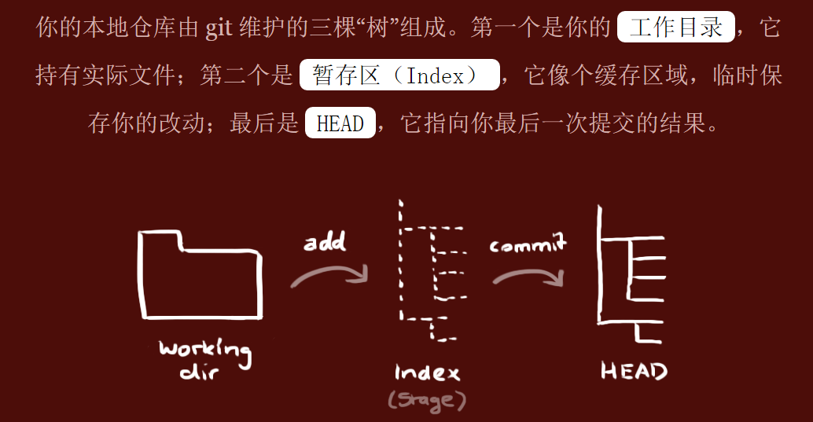

## 2.安装

https://git-scm.com/downloads

## 3.客户端
- 命令行：Git Bash
- Git GUI
- IDEA
- Eclipse插件：egit
- 小乌龟
- sourcetree
- 集成开发环境（IDEA,eclipse）提供的插件已足够使用
- IDEA需要在设置中关联本地安装的git客户端程序
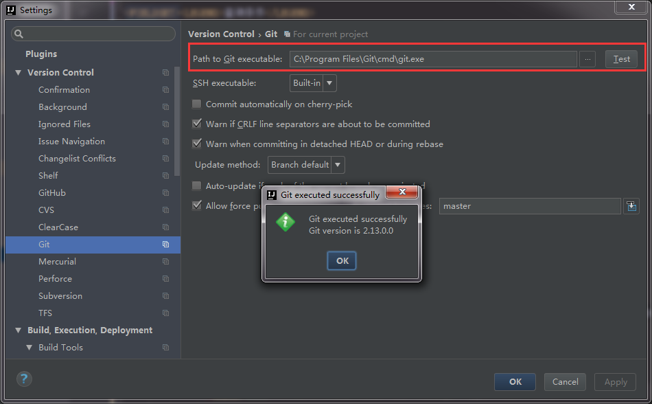

## 4.命令 

### 4.1.常用操作

```shell
本地初始化仓库
git init

克隆远程仓库（本地仓库 <- 远程仓库）
git clone <git_url>        # 克隆远程仓库
git fetch upstream master  # 拉取远程代码到本地但不应用在当前分支
git pull upstream master   # 拉取远程代码到本地但应用在当前分支
git pull --rebase upstream master  # 如果平时使用rebase合并代码则加上


Git 为你的每一个提交都记录你的名字与电子邮箱地址，所以第一步需要配置用户名和邮箱地址。
git config --global user.name 'runoob'
git config --global user.email test@runoob.com


工作区 -> 暂存区
git add <file>
git add *


暂存区 -> 本地仓库。
如果觉得 git add 提交缓存的流程太过繁琐，可以使用 -a 选项跳过这一步（仅限于修改的并且已经提交过或已经放到暂存区的文件）
git commit -am '修改 hello.php 文件'
git commit –a


将暂存区内容添加到仓库中。
git commit -m 'first commit'


本地仓库 -> 远程仓库
git push origin master  # 本地master分支推送到远程origin仓库

工作区 <- 暂存区
git checkout -- <file>  # 暂存区文件内容覆盖工作区文件内容

暂存区 <- 本地仓库
git reset HEAD <file>   # 本地仓库文件内容覆盖暂存区文件内容


查看暂存区状态
git status           不但可以查看当前的文件状态，还可以查看下一步操作的建议
git status -s        -s参数，以获得简短的结果输出。如果没加该参数会详细输出内容。
git status           以查看在你上次提交之后是否有修改。


git diff 命令显示已写入缓存与已修改但尚未写入缓存的改动的区别。git diff 有两个主要的应用场景。
查看某个文件的改动：  git diff readme.txt
尚未缓存的改动：      git diff
查看已缓存的改动：    git diff --cached
查看已缓存的与未缓存的所有改动：git diff HEAD


查看日志
git log
git log --pretty=oneline
git log --graph --pretty=oneline
git log –oneline
```

## 4.2.参数配置
```shell
1. 全局配置
用户信息
git config --global user.name "your_name"
git config --global user.email "your_email"

文本编辑器
git config --global core.editor "nvim"

分页器
git config --global core.pager "more"

别名
git config --global alias.gs "git status"

纠错
git config --global help.autocorrect 1

2.个人配置

不加--global参数的话，则为个人配置
git config --list
git config user.name
git config user.name "your_name"

如果在项目中设置，则保存在.git/config文件里面
cat .git/config
[user]
    name = "your_name"
......
```

### 4.3.分支

Git鼓励大量使用分支

```text
git branch   查看分支
git branch <name> 创建分支
git checkout <name> 切换分支
git checkout -b <name> 创建+切换分支
git merge <name> 合并某分支到当前分支
git branch -d <name> 删除分支
git branch -D <name> 强行删除分支。如果要丢弃一个没有被合并过的分支，可以通过git branch -D <name>强行删除。
```

注： Git提供了一个stash功能，可以把当前工作现场“储藏”起来，等以后恢复现场后继续工作：

```text
git stash （现在用git status查看工作区，就是干净的）
git stash list （查看隐藏的列表）
git stash pop （恢复最近的隐藏）
```

修复bug时，我们会通过创建新的bug分支进行修复，然后合并，最后删除；当手头工作没有完成时，先把工作现场git stash一下，
然后去修复bug，修复后，再git stash pop，回到工作现场。

你可以多次stash，恢复的时候，先用git stash list查看，然后恢复指定的stash，用命令：git stash apply stash@{0}

### 4.4.reset

实际开发过程中可能会遇到版本回退的情况，如果只是简单的一两行代码，直接修改即可，但是大量的版本的话，就需要使用reset命令

常规流程如下
1. 查看要回滚到的版本：使用 git log 找到要回退的commit版本号并复制
2. 本地代码使用commitid回退： git reset --hard commit_id
3. 强推到远程：git push origin HEAD --force


回退命令：
```text
git reset --hard HEAD^ 回退到上个版本
git reset --hard HEAD~3  回退到前3次提交之前，以此类推，回退到n次提交之前
git reset --hard commit_id 退到/进到 指定commit的sha码
```

reset命令有4个返回的类型可以选择，通常选择hard
- soft ：你之前写的不会改变，你之前暂存过的文件还在暂存。
- mixed：你之前写的不会改变，你之前暂存过的文件不会暂存。
- hard ：文件恢复到所选提交状态，任何更改都会丢失。你已经提交了，然后你又在本地更改了，如果你选hard，那么提交的内容和你提交后又本地修改未提交的内容都会丢失。
- keep ：任何本地更改都将丢失，文件将恢复到所选提交的状态，但本地更改将保持不变。你已经提交了，然后你又在本地更改了，如果你选keep，那么提交的内容会丢失，你提交后又本地修改未提交的内容不会丢失。

强推到远程：
```text
git push origin HEAD --force
git push -f origin [branchName] 同步到远端仓库
```

问题：fatal: 'origin' does not appear to be a git repository
```text
在执行git pull origin master时出现：
fatal: ‘origin’ does not appear to be a git repository
fatal: Could not read from remote repository.
Please make sure you have the correct access rights and the repository exists

解决方案： git remote add origin git@github:bx_reader/bx-reader-api.git 将关联远程仓库为origin
```

### 4.5.rebase

rebase在git中是一个非常有魅力的命令，使用得当会极大提高自己的工作效率；相反，如果乱用，会给团队中其他人带来麻烦。它的作用简要概括为：可以对某一段线性提交历史进行编辑、删除、复制、粘贴；因此，合理使用rebase命令可以使我们的提交历史干净、简洁！

前提：不要通过rebase对任何已经提交到公共仓库中的commit进行修改（你自己一个人玩的分支除外）

#### 4.5.1.合并多个commit为一个完整commit

当我们在本地仓库中提交了多次，在我们把本地提交push到公共仓库中之前，为了让提交记录更简洁明了，我们希望把如下分支B、C、D三个提交记录合并为一个完整的提交，然后再push到公共仓库。

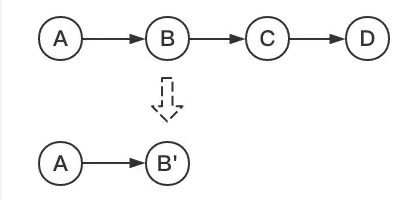


现在我们在测试分支上添加了四次提交，我们的目标是把最后三个提交合并为一个提交：

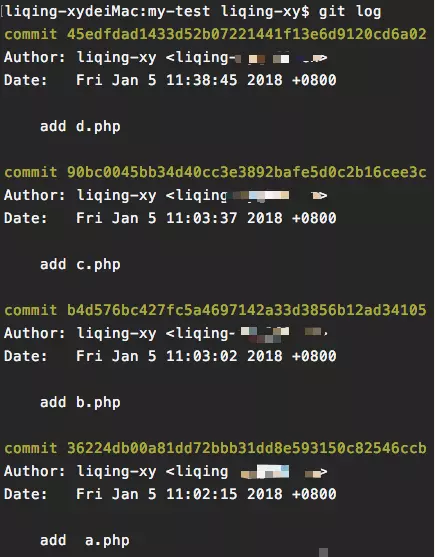


这里我们使用命令:

```shell
git rebase -i [startpoint] [endpoint]
```

其中-i的意思是--interactive，即弹出交互式的界面让用户编辑完成合并操作，[startpoint] [endpoint]则指定了一个编辑区间，
如果不指定[endpoint]，则该区间的终点默认是当前分支HEAD所指向的commit(注：该区间指定的是一个前开后闭的区间)。

在查看到了log日志后，我们运行以下命令：

git rebase -i 36224db

或:

git rebase -i HEAD~3

然后我们会看到如下界面:

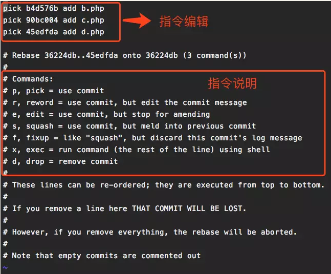


上面未被注释的部分列出的是我们本次rebase操作包含的所有提交，下面注释部分是git为我们提供的命令说明。每一个commit
id 前面的pick表示指令类型，git 为我们提供了以下几个命令:

- pick：保留该commit（缩写:p）
- reword：保留该commit，但我需要修改该commit的注释（缩写:r）
- edit：保留该commit, 但我要停下来修改该提交(不仅仅修改注释)（缩写:e）
- squash：将该commit和前一个commit合并（缩写:s）
- fixup：将该commit和前一个commit合并，但我不要保留该提交的注释信息（缩写:f）
- exec：执行shell命令（缩写:x）
- drop：我要丢弃该commit（缩写:d）

根据我们的需求，我们将commit内容编辑如下:

然后是注释修改界面:

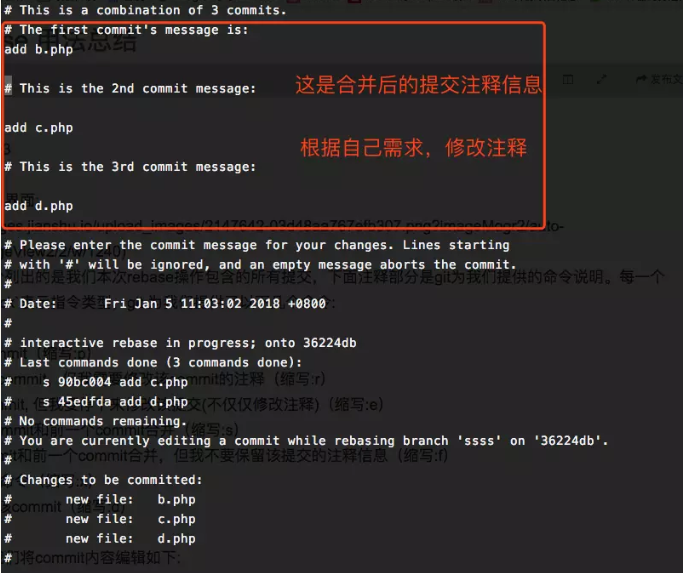


编辑完保存即可完成commit的合并了：

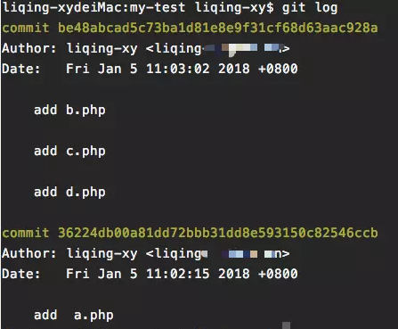


#### 4.5.2.将某一段commit粘贴到另一个分支上

当我们项目中存在多个分支，有时候我们需要将某一个分支中的一段提交同时应用到其他分支中，就像下图：

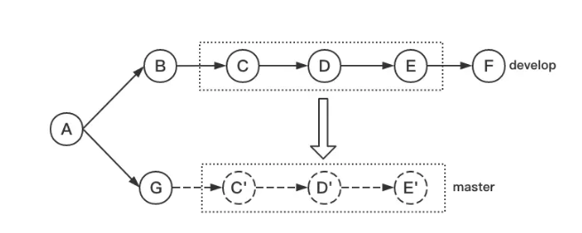


我们希望将develop分支中的C~E部分复制到master分支中，这时我们就可以通过rebase命令来实现（如果只是复制某一两个提交到其他分支，建议使用更简单的命令:git
cherry-pick）。

在实际模拟中，我们创建了master和develop两个分支:

master分支:

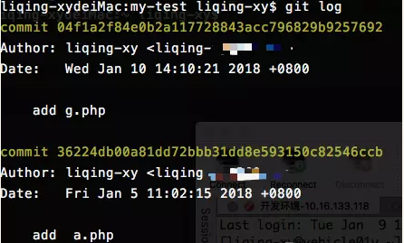


develop分支:

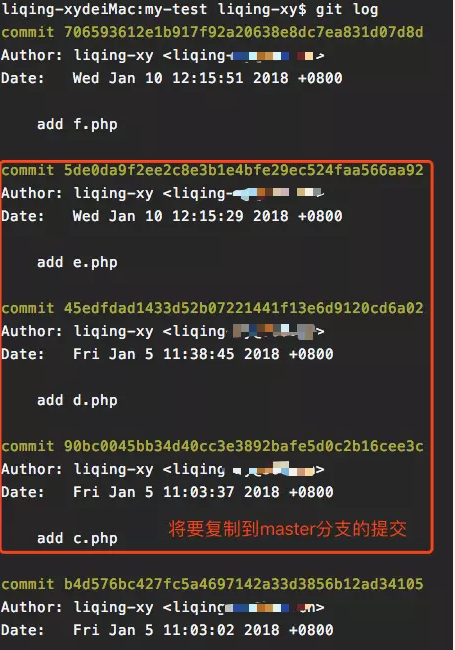


我们使用命令的形式为:

git rebase [startpoint] [endpoint] --onto [branchName]

其中，[startpoint] [endpoint]仍然和上一个命令一样指定了一个编辑区间(前开后闭)，--onto的意思是要将该指定的提交复制到哪个分支上。

所以，在找到C(90bc0045b)和E(5de0da9f2)的提交id后，我们运行以下命令：

git rebase 90bc0045b^ 5de0da9f2 --onto master

注:因为[startpoint] [endpoint]指定的是一个前开后闭的区间，为了让这个区间包含C提交，我们将区间起始点向后退了一步。

运行完成后查看当前分支的日志:

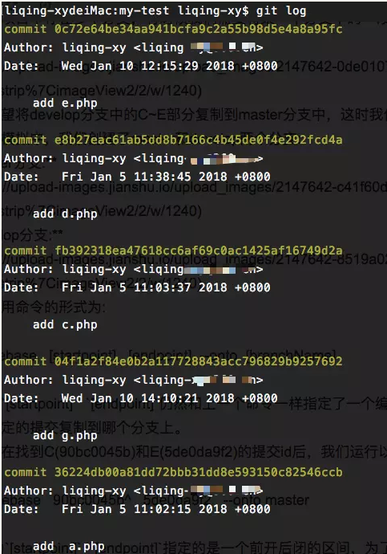

可以看到，C~E部分的提交内容已经复制到了G的后面了，大功告成？NO！我们看一下当前分支的状态:

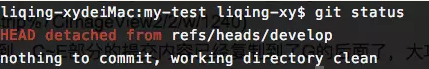

当前HEAD处于游离状态，实际上，此时所有分支的状态应该是这样:

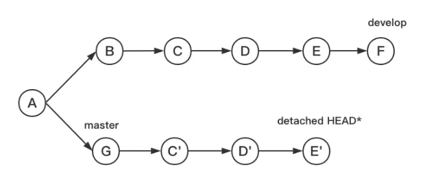

所以，虽然此时HEAD所指向的内容正是我们所需要的，但是master分支是没有任何变化的，git只是将C~E部分的提交内容复制一份粘贴到了master所指向的提交后面，我们需要做的就是将master所指向的提交id设置为当前HEAD所指向的提交id就可以了，即:

git checkout master

git reset --hard 0c72e64

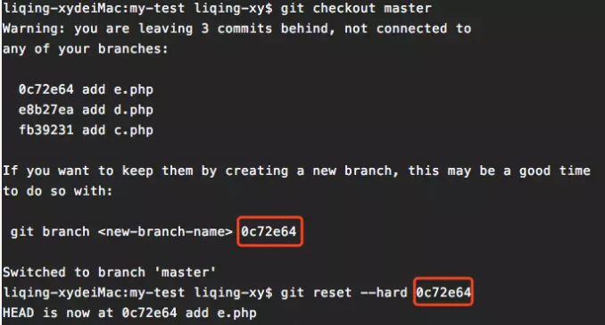

### 4.6.log

#### 4.6.1.查找改动某个文件所有的日志
```shell
git log --pretty=oneline somefile.java
git log --oneline somefile.java
git log --pretty=format:"%h %an,%cd : %s" somefile.java
```

#### 4.6.2.格式化输出
```shell
git log --pretty=format:" "
git log --pretty=format:"%h %an,%cd : %s"
```
```text
选项 说明
%H 提交对象（commit）的完整哈希字串
%h 提交对象的简短哈希字串
%T 树对象（tree）的完整哈希字串
%t 树对象的简短哈希字串
%P 父对象（parent）的完整哈希字串
%p 父对象的简短哈希字串
%an 作者（author）的名字
%ae 作者的电子邮件地址
%ad 作者修订日期（可以用 -date= 选项定制格式）
%ar 作者修订日期，按多久以前的方式显示
%cn 提交者(committer)的名字
%ce 提交者的电子邮件地址
%cd 提交日期
%cr 提交日期，按多久以前的方式显示
%s 提交说明
```

#### 4.6.3.指定日期、关键字、作者
```shell
--since, --after 仅显示指定时间之后的提交。 git log --since="2018-01-31"
--until, --before 仅显示指定时间之前的提交。 git log--until="2018-12-31"
--author 仅显示指定作者相关的提交。 git log --author=BeginMan
--committer 仅显示指定提交者相关的提交。 git log --committer=Jack
--grep 仅显示指定关键字的提交。 git log --grep=init
```

- 注意作者与提交者的关系：作者是程序的修改者，提交者是代码提交人。
- 如指定2天前，作者为“BeginMan”的提交含有关键字'init'的前2条记录：git log --since=2.days --author=BeginMan --grep=init -2
- 上面选项后面的参数可以带单双引号，如--author="BeginMan"

#### 4.6.4.显示修改的文件

--name-only 仅在提交信息后显示已修改的文件清单
--name-status 显示新增、修改、删除的文件清单

```shell
git log --name-only
git log --name-only --oneline
git log --name-status
git log --name-status --oneline
```

#### 4.6.5.显示日志统计信息

--stat 显示每次更新的文件修改统计信息，也显示更新的文件名和修改的多少。

--shortstat 只显示 --stat 中最后的行数修改添加的统计。不显示更新的文件名。

```shell
git log --stat
git log --stat --oneline
git log --shortstat
git log --shortstat --oneline
```

#### 4.6.6.显示单次日志信息
```shell
git show [commit id]
git show [commit id] --name-only
git show [commit id] --name-only --oneline
git show [commit id] --name-status
git show [commit id] --stat
git show [commit id] --shortstat
```

#### 4.6.7.查找某个字符串在何时添加
```shell
git log -S"string wanted to search" --oneline
81fbf7e a commit
```

### 4.7.tag
发布一个版本时，我们通常先在版本库中打一个标签（tag）

git tag v1.0 默认标签是打在最新提交的commit上的（即HEAD）。

git tag v0.9 6224937 给特定的commit打标签

git tag 查看所有标签

git show <tagname>查看标签信息

创建带有说明的标签，用-a指定标签名，-m指定说明文字： git tag -a v0.1 -m "version 0.1 released" 3628164

git tag -d v0.1 删除本地仓库标签

git push origin <tagname> 推送某个标签到远程

一次性推送全部尚未推送到远程的本地标签： git push origin --tags

删除远程仓库标签：

先从本地删除：git tag -d v0.9

再从远程删除：git push origin :refs/tags/v0.9

## 5.最佳实践

### 5.1.连接方式

用git的人都知道git连接有两种方式，一种是https，一种是ssh。http方式的虽然简单，但是存在一定的安全隐患，所以很多公司选择全部http，只保留ssh。

ssh是一种协议，采用公钥密钥的加密方式，一般都采用非对称加密。

Window和Linux通用教程：[https://blog.csdn.net/lqlqlq007/article/details/78983879](https://blog.csdn.net/lqlqlq007/article/details/78983879)

#### 5.1.1.修改本地代码的连接方式
由ssh方式改为http方式，反过来的命令也是相似的

操作如下：
```shell
git remote rm origin
git remote add origin http://gitlab.xxxxxxxx.cn:xxxx/xxxxxx/mall.git
git pull
git branch --set-upstream-to=origin/dev dev
```

#### 5.1.2.配置多个SSH-Key

[https://gitee.com/help/articles/4229](https://gitee.com/help/articles/4229)

当有多个git账号时，比如：
1. 一个gitee，用于公司内部的工作开发
2. 一个github，用于自己进行一些开发活动

缺点：因为本地git只能记录一个username，虽然ssh key是不同的，但是提交记录中的username是同一个，不过不影响正常使用。

#### 5.1.3.问题：操作时弹出openSSH 输入账号密码

这个仅仅针对 private 类型的项目，public 类型的项目因为不存在身份认证，https 模式不会提问。

我们可以自己录入账号密码（缺点是每次都需要输入） 

或者我们选择使用ssh模式

### 5.2.多人协作【开发模式】

当你从远程仓库克隆时，实际上Git自动把本地的master分支和远程的master分支对应起来了，并且，远程仓库的默认名称是origin。

要查看远程库的信息，用git remote：

```shell
$ git remote
origin
```

或者，用git remote -v显示更详细的信息：

```shell
$ git remote -v
origin  git@192.168.128.122:tua/SkynetSystem.git (fetch)
origin  git@192.168.128.122:tua/SkynetSystem.git (push)
```

上面显示了可以抓取和推送的origin的地址。如果没有推送权限，就看不到push的地址。

#### 5.2.1.推送分支

推送分支，就是把该分支上的所有本地提交推送到远程库。推送时，要指定本地分支，这样，Git就会把该分支推送到远程库对应的远程分支上：

```shell
$ git push origin master
```

如果要推送其他分支，比如SkynetSystem_DEV，就改成：
```shell
$ git push origin SkynetSystem_DEV
```
但是，并不是一定要把本地分支往远程推送，那么，哪些分支需要推送，哪些不需要呢？

- master分支是主分支，因此要时刻与远程同步；

- SkynetSystem_DEV分支是开发分支，团队所有成员都需要在上面工作，所以也需要与远程同步；

- 本地的bug分支只用于在本地修复bug，就没必要推到远程了，除非老板要看看你每周到底修复了几个bug；

- 本地的feature分支是否推到远程，取决于你是否和你的小伙伴合作在上面开发。

#### 5.2.2.抓取分支

多人协作时，大家都会往master和SkynetSystem_DEV分支上推送各自的修改。

现在，模拟一个你的小伙伴，可以在另一台电脑（注意要把SSH Key添加到GitHub）或者同一台电脑的另一个目录下克隆：
```shell
$ git clone git@192.168.128.122:tua/SkynetSystem.git
Cloning into 'SkynetSystem'...
remote: Counting objects: 46, done.
remote: Compressing objects: 100% (26/26), done.
remote: Total 46 (delta 16), reused 45 (delta 15)
Receiving objects: 100% (46/46), 15.69 KiB | 6 KiB/s, done.
Resolving deltas: 100% (16/16), done.
```
当你的小伙伴从远程库clone时，默认情况下，你的小伙伴只能看到本地的master分支。不信可以用git branch命令看看：
```shell
$ git branch
* master
```
现在，你的小伙伴要在SkynetSystem_DEV分支上开发，就必须创建远程origin的dev分支到本地，于是他用这个命令创建本地dev分支：
```shell
$ git checkout -b SkynetSystem_DEV origin/SkynetSystem_DEV
```
现在，他就可以在SkynetSystem_DEV上继续修改，然后，时不时地把SkynetSystem_DEV分支push到远程：
```shell
$ git commit -m "some changes"
$ git push origin SkynetSystem_DEV
```

因此，多人协作的工作模式通常是这样：

首先，可以试图用`git push origin branch-name`推送自己的修改；

如果推送失败，则因为远程分支比你的本地更新，需要先用git pull试图合并；

如果合并有冲突，则解决冲突，并在本地提交；

没有冲突或者解决掉冲突后，再用`git push origin branch-name`推送就能成功！

如果`git pull`提示“no tracking information”，则说明本地分支和远程分支的链接关系没有创建，用命令`git branch --set-upstream branch-name origin/branch-name`。

这就是多人协作的工作模式，一旦熟悉了，就非常简单。

#### 5.2.3.小结

查看远程库信息，使用`git remote -v`；

本地新建的分支如果不推送到远程，对其他人就是不可见的；

从本地推送分支，使用`git push origin branch-name`，如果推送失败，先用`git pull`抓取远程的新提交；

在本地创建和远程分支对应的分支，使用`git checkout -b branch-name origin/branch-name`，本地和远程分支的名称最好一致；

建立本地分支和远程分支的关联，使用`git branch --set-upstream branch-name origin/branch-name`；

从远程抓取分支，使用`git pull`，如果有冲突，要先处理冲突。

### 5.3.Git Submodule

引用一段《Git权威指南》的话：项目的版本库在某些情况下需要引用其他版本库中的文件，例如公司积累了一套常用的函数库，被多个项目调用，
显然这个函数库的代码不能直接放到某个项目的代码中，而是要独立为一个代码库，那么其他项目要调用公共函数库该如何处理呢？
分别把公共函数库的文件拷贝到各自的项目中会造成冗余，丢弃了公共函数库的维护历史，这显然不是好的方法。

入门教程：[https://www.cnblogs.com/lsgxeva/p/8540758.html](https://www.cnblogs.com/lsgxeva/p/8540758.html)

实用教程： [https://www.jianshu.com/p/5ec0e413c2f0](https://www.jianshu.com/p/5ec0e413c2f0)

### 5.4.gitignore

匹配规则：

- 以斜杠/开头表示目录
- 以星号*通配多个字符
- 以问号?通配单个字符
- 以方括号[]包含单个字符的匹配列表
- 以叹号!表示不忽略(跟踪)匹配到的文件或目录

此外，git 对于 .ignore 配置文件是按行从上到下进行规则匹配的，意味着如果前面的规则匹配的范围更大，则后面的规则将不会生效；

最全案例：
```gitignore
##----------java files ----------
*.class
*.jar
*.war
*.ear
hs_err_pid*
.settings/
.classpath
.project
/lib/
/logs/
.metadata
bin/
tmp/
*.tmp
*.bak
*.swp
*~.nib
.loadpath
.recommenders

##----------maven ----------
target/
src/main/webapp/WEB-INF/classes/
pom.xml.tag
pom.xml.releaseBackup
pom.xml.versionsBackup
pom.xml.next
release.properties
dependency-reduced-pom.xml
buildNumber.properties
.mvn/timing.properties
# Exclude maven wrapper
!/.mvn/wrapper/maven-wrapper.jar

##----------idea----------
.idea/
*.iml
*.iws
*.ipr
/out/
.idea_modules/
*.iml
atlassian-ide-plugin.xml
com_crashlytics_export_strings.xml
crashlytics.properties
crashlytics-build.properties

##----------Android----------
*.apk
*.ap_
*.dex
bin/
gen/
.navigation/

##----------gradle----------
/gradle/wrapper/gradle-wrapper.properties
.gradle
gradle-app.setting
!gradle-wrapper.jar
/build/
gradle-app.setting
.gradletasknamecache
local.properties
settings.gradle

##----------Scala IDE specific ----------
.cache-main
.scala_dependencies
.worksheet
target/

##----------Other----------
*~
.DS_Store
.svn/
fabric.properties
/*.factorypath
/**/classes/
# External tool builders
.externalToolBuilders/

# Locally stored "Eclipse launch configurations"
*.launch

# PyDev specific (Python IDE for Eclipse)
*.pydevproject

# CDT-specific (C/C++ Development Tooling)
.cproject

# CDT- autotools
.autotools

# Java annotation processor (APT)
.factorypath

# PDT-specific (PHP Development Tools)
.buildpath

# sbteclipse plugin
.target

# Tern plugin
.tern-project

# TeXlipse plugin
.texlipse

# STS (Spring Tool Suite)
.springBeans
```

### 5.5.回滚代码

```shell
git reset --hard [commit_id]
git push -f origin [branchName]
```

### 5.6.批量删除远程分支
```shell
# 匹配规则
git branch -a | awk '/20180[1-5]{1}/{print}'
git branch -a | awk '/20180[1-5]{1}/{print}'

# 远程删除
git branch -a | grep demo | sed 's/remotes\\///g' | sed 's/origin\\///g' | xargs git push origin --delete
git branch -a | awk '/2018/{print}'
git branch -a | awk '/2018/{print}' | sed 's/remotes\\///g' | sed 's/origin\\///g' | xargs git push origin --delete
```

### 5.7.提交内容

提交应该尽可能的表述提交修改内容，通常区分 subject 和 body 内容，使用空行隔开
1. subject 一般不超过 50 个字符
2. body 每一行的长度控制在 72 个字符
3. subject 结尾不需要使用句号或者点号结尾，直接换行就行
4. body 用来详细解释此次提交具体做了什么

### 5.8.管理生产版本

使用 release 和 tag 进行版本管理，可以选择其中或者全都使用。
1. 使用 release 分支发布代码和版本维护(release/1.32)
2. 使用 tag 来标记版本(A-大feature功能.B-小feature功能.C-只修bug)

生成release和tag的时机。通常是在发布某个正式升级的时候触发，可以在上线的CI/CD中进行。
                                 
### 5.9.引用日志

使用命令回退内容、强制推送代码、删除本地分支，都是非常危险的操作，会导致我们无法找回之前的内容。

所以git提供了relflog命令，在我们执行上面操作的时候，git会帮助我们把记录记录下来，
```shell
1. 查看日志记录
git --no-pager log --oneline -1
4bc8703 (HEAD -> master) hhhh

2. 回退到上次提交
git reset --hard HEAD~1

3. 查看引用日志记录
git reflog
6a89f1b (HEAD -> master) HEAD@{0}: reset: moving to HEAD~1
4bc8703 HEAD@{1}: commit (amend): hhhh

4. 找回内容
$ git cherry-pick 4bc8703
```

### 5.10.clone大型项目

大型项目的提交记录会非常多，clone的时候大部分时间都是下载提交记录，而且我们clone通常仅仅为了使用源码，不需要仓库的记录。
所以就可以使用depth命令，帮助我们仅下载最近几次的提交记录。
```shell
1. 克隆不包含之前历史,只有最近一次提交记录
git clone http://xxx.xx.xxx/xxx --depth=1
```

### 统计代码的命令

cloc工具：

下载得到cloc-1.64.exe，https://sourceforge.net/projects/cloc/files/

改名为cloc.exe （因为要在cmd中执行）

放到工程所在目录，E:\Workspace\app，统计app文件夹内所有代码

打开cmd窗口，cd E:\Workspace\app 到app目录下

执行命令 cloc .       注意后面有个句号，代表当前目录
或者再简单点：cloc-1.64.exe D:\workspace17\dataParse

```text
一个是统计工作量，贡献量的时候 —— 这一看就是要发奖金啊 
另一个是统计自己代码量的时候 —— 十有八九是准备跳槽了

1. 指定用户名
	git log --author="_Your_Name_Here_" --pretty=tformat: --numstat | awk '{ add += $1; subs += $2; loc += $1 - $2 } END { printf "added lines: %s, removed lines: %s, total lines: %s\n", add, subs, loc }' -

	结果： added lines: 7888, removed lines: 2689, total lines: 5199
	
	
2. 使用 ls-file 实现不指定用户版统计行数(需要安装ruby)
	git ls-files -z | xargs -0n1 git blame -w | ruby -n -e '$_ =~ /^.*\((.*?)\s[\d]{4}/; puts $1.strip' | sort -f | uniq -c | sort -n


	这段代码比较有意思，它扫描了当前分支的每个文件，然后用 Git 的 blame 功能输出每个人的代码行数，最后用系统命令 sort 和 uniq 实现计数。

	结果如下：
		8 aaa 
		9 bbb 
		145 ccc 
		146 ddd 
		261 eee


3.扫描 Log 统计增删行数
	git log --shortstat --pretty="%cE" | sed 's/\(.*\)@.*/\1/' | grep -v "^$" | awk 'BEGIN { line=""; } !/^ / { if (line=="" || !match(line, $0)) {line = $0 "," line }} /^ / { print line " # " $0; line=""}' | sort | sed -E 's/# //;s/ files? changed,//;s/([0-9]+) ([0-9]+ deletion)/\1 0 insertions\(+\), \2/;s/\(\+\)$/\(\+\), 0 deletions\(-\)/;s/insertions?\(\+\), //;s/ deletions?\(-\)//' | awk 'BEGIN {name=""; files=0; insertions=0; deletions=0;} {if ($1 != name && name != "") { print name ": " files " files changed, " insertions " insertions(+), " deletions " deletions(-), " insertions-deletions " net"; files=0; insertions=0; deletions=0; name=$1; } name=$1; files+=$2; insertions+=$3; deletions+=$4} END {print name ": " files " files changed, " insertions " insertions(+), " deletions " deletions(-), " insertions-deletions " net";}'

	结果如下：比较奇怪的是会列出两个人同时修改，可能是 merge 操作，没有深究
		aaa,	: 353 files changed, 	9359 insertions(+), 	3844 deletions(-), 	5515 net 
		aaa,bbb,: 4 files changed, 		144 insertions(+), 		2 deletions(-), 	142 net 
		ccc,	: 114 files changed, 	2301 insertions(+), 	481 deletions(-), 	1820 net 
		ddd,	: 27 files changed, 	1856 insertions(+), 	757 deletions(-), 	1099 net 
		eee,	: 1726 files changed, 	32841 insertions(+),	22719 deletions(-), 10122 net 
		eee,fff,: 13 files changed, 	209 insertions(+), 		211 deletions(-), 	-2 net 
		ggg,	: 53 files changed, 	1153 insertions(+), 	1170 deletions(-), 	-17 net 
		fff,	: 2445 files changed, 	69875 insertions(+), 	62148 deletions(-), 7727 net 
		fff,eee,: 30 files changed,		394 insertions(+), 		472 deletions(-), 	-78 net 
		bbb,	: 37 files changed, 	781 insertions(+), 		216 deletions(-), 	565 net 
		hhh,	: 4 files changed, 		34 insertions(+), 		4 deletions(-), 	30 net


4.扫描 Log 单独统计每个人的增删行数加强
	git log --format='%aN' | sort -u | while read name; do echo -en "$name\t"; git log --author="$name" --pretty=tformat: --numstat | awk '{ add += $1; subs += $2; loc += $1 - $2 } END { printf "added lines: %s, removed lines: %s, total lines: %s\n", add, subs, loc }' -; done
	
	结果如下：
		aaa added lines: 34, removed lines: 4, total lines: 30 
		bbb added lines: 2301, removed lines: 481, total lines: 1820 
		ccc added lines: 1856, removed lines: 757, total lines: 1099 
		ddd added lines: 30400, removed lines: 21317, total lines: 9083 
		eee added lines: 1153, removed lines: 1170, total lines: -17 
	fff added lines: 1153, removed lines: 1170, total lines: -17 
		ggg added lines: 72886, removed lines: 64233, total lines: 8653 
		hhh added lines: 814, removed lines: 216, total lines: 598 
		iii added lines: 9503, removed lines: 3846, total lines: 5657

5.统计每个人增删行数
	git log --format='%aN' | sort -u | while read name; do echo -en "$name\t"; git log --author="$name" --pretty=tformat: --numstat | awk '{ add += $1; subs += $2; loc += $1 - $2 } END { printf "added lines: %s, removed lines: %s, total lines: %s\n", add, subs, loc }' -; done
	
	结果示例
		Max-laptop    added lines: 1192, removed lines: 748, total lines: 444
		chengshuai    added lines: 120745, removed lines: 71738, total lines: 49007
		cisen    added lines: 3248, removed lines: 1719, total lines: 1529
		max-h    added lines: 1002, removed lines: 473, total lines: 529
		max-l    added lines: 2440, removed lines: 617, total lines: 1823
		mw    added lines: 148721, removed lines: 6709, total lines: 142012
		spider    added lines: 2799, removed lines: 1053, total lines: 1746
		thy    added lines: 34616, removed lines: 13368, total lines: 21248
		wmao    added lines: 12, removed lines: 8, total lines: 4
		xrl    added lines: 10292, removed lines: 6024, total lines: 4268
		yunfei.huang    added lines: 427, removed lines: 10, total lines: 417

6. 查看仓库提交者排名前 5
	git log --pretty='%aN' | sort | uniq -c | sort -k1 -n -r | head -n 5


7. 贡献值统计
	git log --pretty='%aN' | sort -u | wc -l
	
8. 提交数统计
	git log --oneline | wc -l

7. 添加或修改的代码行数：
	git log --stat|perl -ne 'END { print $c } $c += $1 if /(\d+) insertions/'

8. 现在每个月项目组要统计工作绩效，要提交每个月的git提交数目，所以整理了个脚本：
	since是开始统计时间
	until是结束统计时间
	git log --format='%aN' | sort -u | while read name; do echo -en "$name\t"; git log --author="$name" --since="2018-08-01" --until="2018-12-31"  --no-merges | grep -e 'commit [a-zA-Z0-9]*' | wc -l; done

结果是
	zhangxue        13
	源圆员  		0
```

## 6.github

### 6.1.PR

GitHub PR其实是GitHub上的一种功能，它可以帮助我们更好地进行代码的审查和合并流程。
GitHub PR的全称是GitHub Pull Request，它允许开发者在自己的代码分支上进行开发，然后向项目的主分支提交请求，请求将自己的代码合并到主分支中。

### 6.2.使用技巧
```text
1.搜索
github高级搜索功能
直接打开这里
或搜索后在搜索页面 language 下方打开（没找到更好的方法）
更多技巧可查看官方文档：

2.查找文件
在主页按“t”：查找文件
点进源代码后，按“l”：跳转到某一行
点击行号：
1. 复制这行代码
2. 生成永久链接
   源代码中按“b”：查看文件的改动记录
   键盘快捷键：
- 文档
- 图片

3.阅读代码技巧
代码跳转：
1. 下载到本地
2. 在线vscode：仓库详情界面按下“。”键，

4.在线运行项目
在项目地址前加上`gitpod.io/#/`前缀
- 登陆：
- 加载：
- 运行：

5.项目推送
根据自己的喜好让github推送自己感兴趣的优质项目
获取邮件更新：
```
