# 3.GitLab

官网首页：[https://about.gitlab.com/](https://about.gitlab.com/)

官网文档：[https://docs.gitlab.com/](https://docs.gitlab.com/)

官网安装【极狐】：[https://about.gitlab.cn/install/](https://about.gitlab.cn/install/)

中文教程：[https://www.cnblogs.com/sanduzxcvbnm/category/1777794.html](https://www.cnblogs.com/sanduzxcvbnm/category/1777794.html)

GitLab，是一个利用 Ruby on Rails 开发的开源应用程序，实现一个自托管的Git项目仓库，可通过Web界面进行访问公开的或者私人项目安装。

它拥有与GitHub类似的功能，能够浏览源代码，管理缺陷和注释。可以管理团队对仓库的访问，它非常易于浏览提交过的版本并提供一个文件历史库。

团队成员可以利用内置的简单聊天程序（Wall）进行交流。它还提供一个代码片段收集功能可以轻松实现代码复用，便于日后有需要的时候进行查找。

## 1.安装

基于 CentOS 7 搭建 GitLab：[https://cloud.tencent.com/developer/labs/lab/10288](https://cloud.tencent.com/developer/labs/lab/10288)

- 我们使用选择Gitlab官方提供的SaaS服务【与GitHub一样的服务】
- 可以选择Gitlab的私有化部署服务--Gitlab极狐【分为收费版和免费版】
- 也可以使用社区版【完全免费】

大多是公司选择使用的都是社区版，本文档也是以社区版进行说明的。以下安装的环境是 centos7.4 cpu*4 mem*8

### 1.1.配置基础环境

- 配置yum源

vim /etc/yum.repos.d/gitlab-ce.repo
```properties
[gitlab-ce]
name=Gitlab CE Repository
baseurl=https://mirrors.tuna.tsinghua.edu.cn/gitlab-ce/yum/el$releasever/
gpgcheck=0
enabled=1
```

- 更新本地yum缓存

```properties
yum makecache
```

- 安装 postfix

GitLab 需要使用 postfix 来发送邮件。
```properties
yum install -y postfix
```

打开 /etc/postfix/main.cf 文件，在第 119 行附近找到 inet_protocols = all，将 all 改为 ipv4
```properties
inet_protocols = ipv4
```

启用并启动 postfix
```shell
systemctl enable postfix
systemctl start postfix
```

- 配置 swap 交换分区

由于 GitLab 较为消耗资源，我们需要先创建交换分区，以降低物理内存的压力。

在实际生产环境中，如果服务器配置够高，则不必配置交换分区。

新建 2 GB 大小的交换分区：
```shell
dd if=/dev/zero of=/root/swapfile bs=1M count=2048
```

格式化为交换分区文件并启用：
```shell
mkswap /root/swapfile
swapon /root/swapfile
```

添加自启用。打开 /etc/fstab 文件，在文件最后添加新的一行
```shell
/root/swapfile swap swap defaults 0 0
```

### 1.2.安装

- 安装GitLab社区版

yum install gitlab-ce #自动安装最新版本

注：若需安装指定版本，则添加版本号即可，即yum install gitlab-ce-x.x.x

### 1.3.修改默认配置

vim /etc/gitlab/gitlab.rb

Ps:这个文件非常大，有3000行配置。配置文件中已经将文档的地址备注上去了，想要修改的时候可以查看

- 修改git访问地址【必选】。

```properties
# 1.http访问地址，可以写域名。如果端口不写的话默认为80端口
external_url='http://9.134.85.159'

# 2.ssh方式端口
#ssh主机ip
gitlab_rails['gitlab_ssh_host'] = '9.134.85.159'
#ssh连接端口
gitlab_rails['gitlab_shell_ssh_port'] = 9922
```

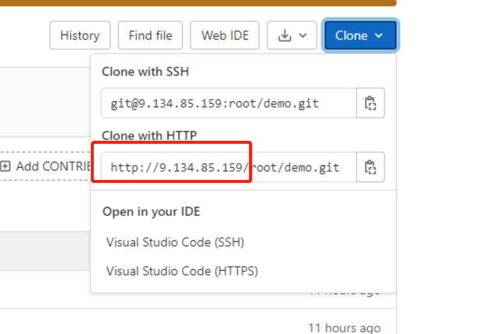

- Nginx模块配置【可选】

用于外部访问Gitlab的配置。比如，默认端口是80。

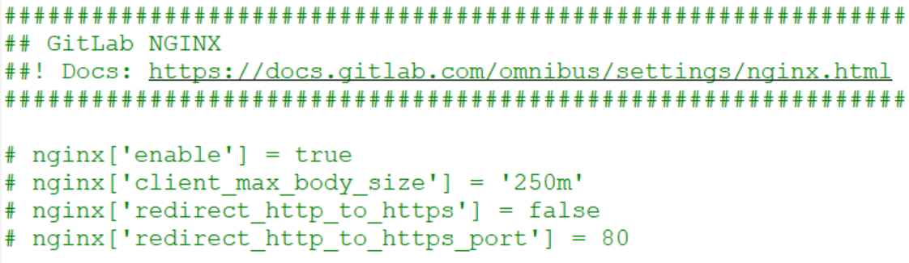
    

- puma模块配置【可选】

服务器本地的端口，Nginx会直接访问这个地址。默认8080端口，比如我们的服务器上已经有8080端口了，我们就需要修改这个地址了。需要修改2个地址

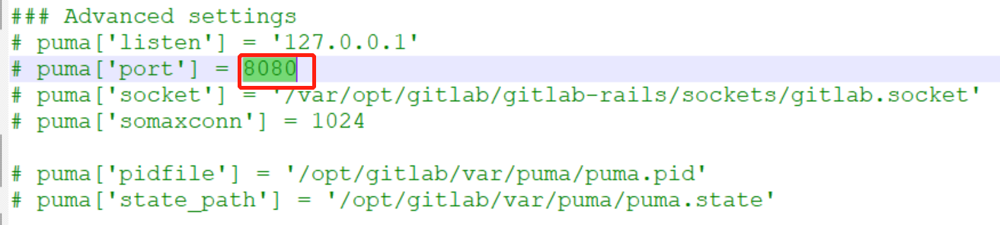

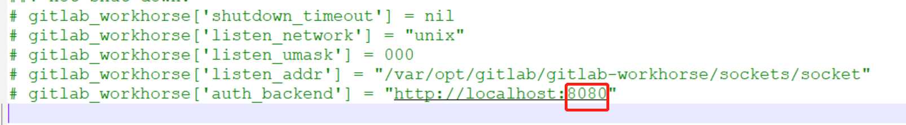
    

- 配置邮箱

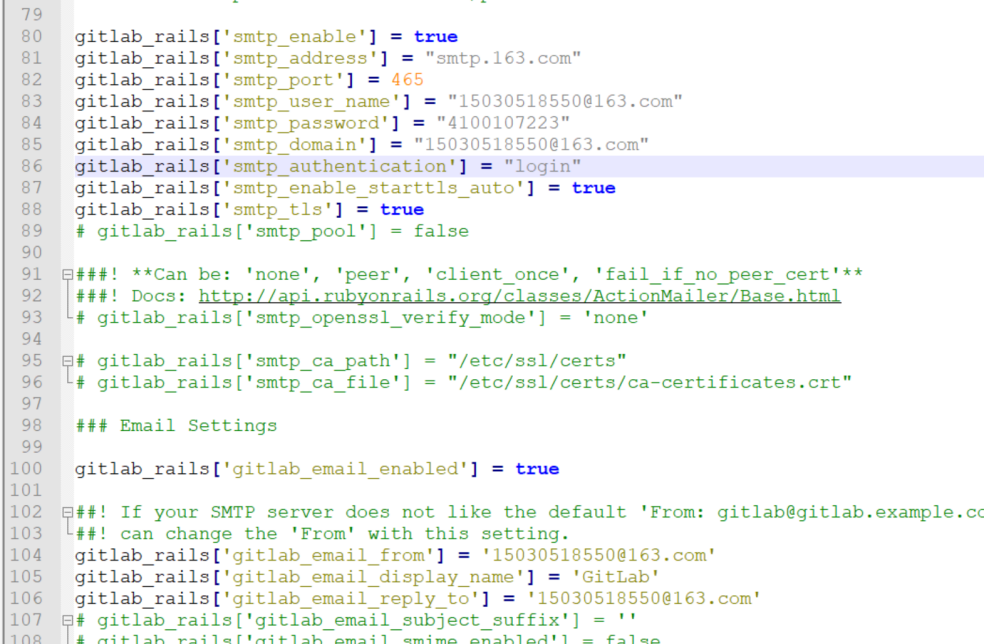
    

部署成功后验证邮箱：gitlab-rails console

Notify.test_email('test@example.com','Message Subject','Hello, 2020!').deliver_now

- 防火墙配置【可选】

配置防火墙，打开 /etc/sysctl.conf 文件
```properties
net.ipv4.ip_forward = 1
```

启用并启动防火墙
```shell
systemctl enable firewalld
systemctl start firewalld
```

放通 HTTP
```shell
firewall-cmd --permanent --add-service=http
```

重启防火墙
```shell
systemctl reload firewalld
```

查看防火墙的状态
```shell
systemctl status firewalld
```

修改clone地址:https://ftxtool.org/2021/11/20/326/
项目中clone看到的地址可能和真实的地址不同，所以我们可以修好这个地址。
Admin Area > Settings 的 General 中选择 Visibility and access controls。填写：Custom Git clone URL for HTTP(S)


### 1.4.初始化项目&启动

- 构建项目

修改完默认配置后，我们就可以初始化Gitlab的配置了。构建大概3~5分钟。并且后面我们每次修改默认配置文件后都需要执行这个命令。

已经投入生产的话，就不要在修改默认配置文件了，会影响线上了，也会将启动后修改的配置全部还原为默认
```shell
sudo gitlab-ctl reconfigure
```

- 重置密码

正常我们安装之后初始的密码会保存在 /etc/gitlab/initial_root_password文件中。

我们需要在24个小时之内登录到Gitlab上重置密码，否则这个文件就会自动被删除。

所有忘记密码的时候需要登录到服务器上重置密码。

```shell
登录到gitlab服务器
cd /var/opt/gitlab/
gitlab-rails console
--- 进入到Ruby的一个界面，输入production 进入控制台
production

user = User.where(id:1).first
user.password='xxxxxxxxx'
user.save!
```

### 1.5.基础命令

- gitlab-ctl start # 启动所有 gitlab 组件；
- gitlab-ctl stop # 停止所有 gitlab 组件；
- gitlab-ctl restart # 重启所有 gitlab 组件；
- gitlab-ctl status # 查看服务状态；
- gitlab-ctl reconfigure #
    启动服务；（重新加载配置文件，在GitLab初次安装后可以使用，但是在业务环境中不可随意使用，reconfigure会把一些过去的config还原，导致修改的端口以及域名等都没有了。）
- gitlab-rake gitlab:check SANITIZE=true --trace # 检查gitlab；
- sudo gitlab-ctl tail # 查看日志；

### 1.6.修改配置【项目启动后】

#### 1.6.1.修改域名

由于没有DNS服务器，无法进行域名解析，所以需要将域名修改为主机名，进入终端修改一下文件即可。

vim /opt/gitlab/embedded/service/gitlab-rails/config/gitlab.yml

```properties
## GitLab settings 
gitlab:
  	## Web server settings (note: host is the FQDN, do not include http://)
host: 10.0.0.210
    port: 8888
    https: false
```

#### 1.6.2.备份与恢复

- GitLab创建备份

```shell
gitlab-rake gitlab:backup:create
```

使用以上命令会默认在/var/opt/gitlab/backups目录下创建一个名称类似为1520580592_2018_03_09_10.5.3_gitlab_backup.tar的压缩包,
这个压缩包就是Gitlab整个的完整部分,其中开头的1520580592_2018_03_09_10.5.3是备份创建的日期。

- GitLab恢复

停止相关数据连接服务
```shell
gitlab-ctl stop unicorn
gitlab-ctl stop sidekiq
```

从1520580592_2018_03_09_10.5.3编号备份中恢复【人工选择】
```shell
gitlab-rake gitlab:backup:restore BACKUP=1520580592_2018_03_09_10.5.3
```

启动Gitlab
```shell
gitlab-ctl start
```

- Gitla b 修改备份文件默认目录

可以通过修改/etc/gitlab/gitlab.rb来修改默认存放备份文件的目录。

vim /etc/gitlab/gitlab.rb
```shell
gitlab_rails['backup_path'] = "/mnt/gitlab/backup">>修改文件路径即可
```

修改完成之后使用gitlab-ctl reconfigure命令重载配置文件即可。

注意：因为涉及到重新加载配置，reconfigure会把一些过去的config还原，导致修改的端口以及域名等都没有了。
建议在服务安装之后即修改仓库默认路径，若后期业务中修改此项，会对业务造成一定的影响。若后期业务需修改此项，请提前做好准备，
然后再修改配置文件中的相应参数。

重载配置文件之后会发现/mnt/gitlab/backup的权限发生变化

#### 1.6.3.修改仓库的默认路径

- 修改配置文件,找到git_data_dirs

vim /etc/gitlab/gitlab.rb
```shell
# git_data_dirs({
# "default" => {
# "path" => "/mnt/nfs-01/git-data"
# }
# })
git_data_dir "/data/gitlab" >>此处添加自定义的仓库路径，目录需提前创建
```
在git_data_dir下面添加一句git_data_dir "/data/gitlab"

- 停止当前gitlab，重新加载配置

注意：仓库路径的修改会导致已有project的丢失，请提前进行备份，具体备份操作请参考上文“GitLab的备份与恢复”，然后再修改配置文件中的相应参数。

```shell
gitlab-ctl stop
gitlab-ctl reconfigure
```

- 重新加载后，会发现在/data/gitlab目录下多出一个repositories目录

启动gitlab即可
```shell
gitlab-ctl start
```

#### 1.6.4.GitLab服务端口修改

yum方式安装的GitLab的配置文件路径为/var/opt/gitlab/nginx/conf（其他安装方式的配置文件路径不一定相同，请自行查找）。

- 修改配置文件

vim /var/opt/gitlab/nginx/conf/gitlab-http.conf
```text
###################################
## configuration ##
################################### 
upstream gitlab-workhorse {
server unix:/var/opt/gitlab/gitlab-workhorse/socket;
}
server {
listen *:8888; >> 此处修改端口即可
```

- 重启服务

gitlab-ctl restart

#### 1.6.5.设置发送邮件的功能

参考链接：http://www.fayfox.com/post/39.html

邮箱配置官方文档：https://docs.gitlab.com/omnibus/settings/smtp.html#mandrill

安装后的测试：https://blog.csdn.net/yelllowcong/article/details/79939589

如果测试不成功，请参照这篇文章：https://ruby-china.org/topics/20450（要将身份验证帐号和发件人保持一致。）

### 1.7.常见问题&注意事项

- Whoops, GitLab is taking too much time to respond 502：

[https://blog.csdn.net/mqdxiaoxiao/article/details/104422826](https://blog.csdn.net/mqdxiaoxiao/article/details/104422826)

- nginx 400 Bad Request Request Header Or Cookie Too Large：

[https://blog.csdn.net/mqdxiaoxiao/article/details/104423995](https://blog.csdn.net/mqdxiaoxiao/article/details/104423995)

### 1.8.docker安装
安装最新版本的 gitlab 社区版即可

```shell
docker run  -itd -p 9980:80  -p 9922:22 \
    -v /etc/gitlab:/etc/gitlab \
    -v /var/log/gitlab:/var/log/gitlab \
    -v /var/opt/gitlab:/var/opt/gitlab \
    --restart=no \
    --privileged=true \
    --name gitlab \
    gitlab/gitlab-ce
```

参数含义
- -i	    以交互模式运行容器，通常与 -t 同时使用命令解释
- -t	    为容器重新分配一个伪输入终端，通常与 -i 同时使用
- -d        后台运行容器，并返回容器ID
- -p 9980:80	    将容器内80端口映射至宿主机9980端口，这是http访问端口
- -p 9922:22	    将容器内22端口映射至宿主机9922端口，这是ssh访问的端口
- -v /home/gitlab/etc:/etc/gitlab	    将容器/etc/gitlab目录挂载到宿主机/usr/local/gitlab-test/etc目录下，若宿主机内此目录不存在将会自动创建，其他两个挂载同这个一样
- --restart always	容器自启动
- --privileged=true	让容器获取宿主机root权限
- --name gitlab	设置容器名称为gitlab
- gitlab/gitlab-ce	镜像的名称，这里也可以写镜像ID

```shell
1. 安装完成后，需要查看初始密码：
docker exec -it gitlab grep 'Password:' /etc/gitlab/initial_root_password


2.修改http访问地址，使用管理员在管理界面修改即可。
```

修改的配置，参考普通的安装方式即可。

## 2.管理

使用教程：[https://blog.csdn.net/lijinzhou2017/article/details/88575700](https://blog.csdn.net/lijinzhou2017/article/details/88575700)

### 2.1.用户管理

> 第一：注册新用户

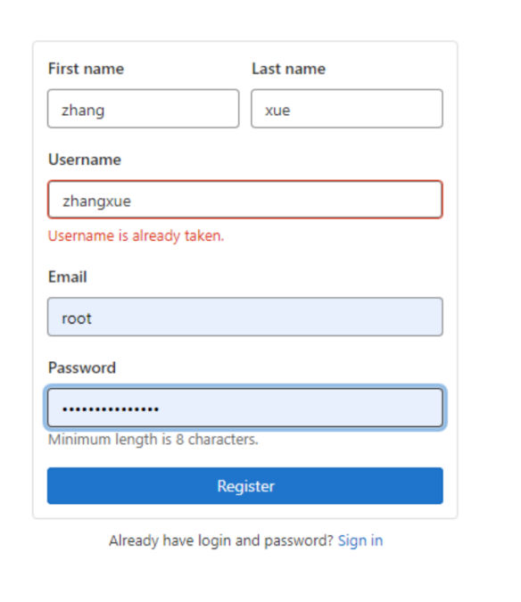

需要root管理员审批，才能正常使用

> 第二：管理员审批

管理员登录，进入账号

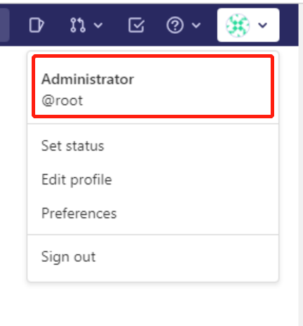


选择管理控制台

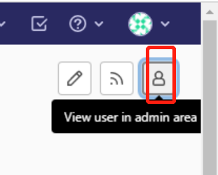


找到申请，统一或者拒绝就行

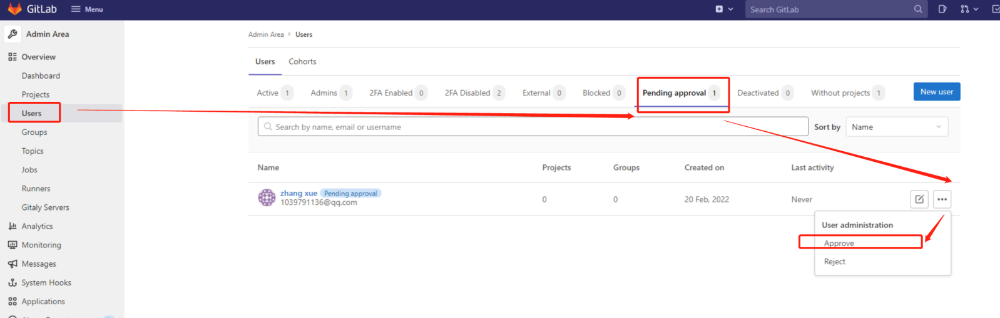

### 2.2.开启导入外部仓库
Gitlab想要导入外部系统的仓库需要单独配置。只能管理员操作。
操作的地址：admin area > general > Visibility and access controls 就可以看到Import sources。都选选项即可。

参考：https://docs.gitlab.cn/jh/user/project/import/gitee_ui.html


## 3.CI/CD

### 3.1.gitlab-runner

- gitlab-runner安装到什么地方：并不是gitlab的服务器上，而是我们需要执行ci/cd命令的地方。

可以是用户自己的服务器，docker以及k8s等。

#### 3.1.1.获得token和url

每个项目都有自己的token。我们也可以吧项目的runner共享给别的项目

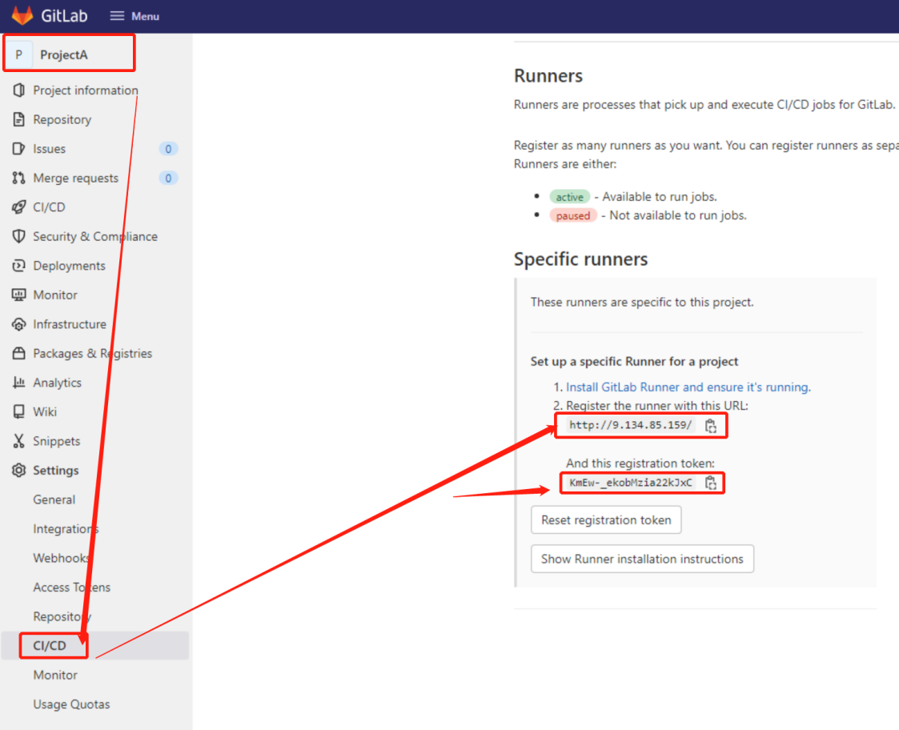


#### 3.1.2.安装gitlab-runner

参考官网：
https://docs.gitlab.com/14.7/runner/install/linux-repository.html

- 下面的是直接使用官方的安装程序安装：

下载
```shell
curl -L "https://packages.gitlab.com/install/repositories/runner/gitlab-runner/script.rpm.sh" | sudo bash
```

安装runner
```shell
sudo yum install gitlab-runner
```

- 如果上面安装失败，可以直接下载安装包安装

[https://docs.gitlab.com/14.7/runner/install/linux-manually.html#using-binary-file](https://docs.gitlab.com/14.7/runner/install/linux-manually.html#using-binary-file)

下载安装包
```shell
sudo curl -L --output /usr/local/bin/gitlab-runner
"https://gitlab-runner-downloads.s3.amazonaws.com/latest/binaries/gitlab-runner-linux-amd64"
```

授予它执行权限：
```shell
sudo chmod +x /usr/local/bin/gitlab-runner
```

创建 GitLab CI 用户：
```shell
sudo useradd --comment 'GitLab Runner' --create-home gitlab-runner --shell /bin/bash
```

安装并作为服务运行：
```shell
sudo gitlab-runner install --user=gitlab-runner --working-directory=/home/gitlab-runner
sudo gitlab-runner start
```

#### 3.1.3.注册runner

输入命令后，会提示输入很多参数
```shell
gitlab-runner register
```

```properties
Please enter the gitlab-ci coordinator URL (e.g. https://gitlab.com )

# 输入我们需要注入的URL
Please enter the gitlab-ci token for this runner

# 输入我们千辛万苦找到的 token
Please enter the gitlab-ci description for this runner

#写点介绍
Please enter the gitlab-ci tags for this runner (comma separated):

# mavenBuild,jarRunner
# tag 就是这个 gitlab-runner 的名字，之后可以根据不同的 tag 给不同的
gitlab-runner 指派任务

Please enter the executor: ssh, docker+machine, docker-ssh+machine,
kubernetes, docker, parallels, virtualbox, docker-ssh, shell:

# shell 个人比较推荐 shell，因为即使选用了 shell
也可以调用其他的运行环境比如 docker 鸭
```

#### 3.1.4.查看&编辑runner

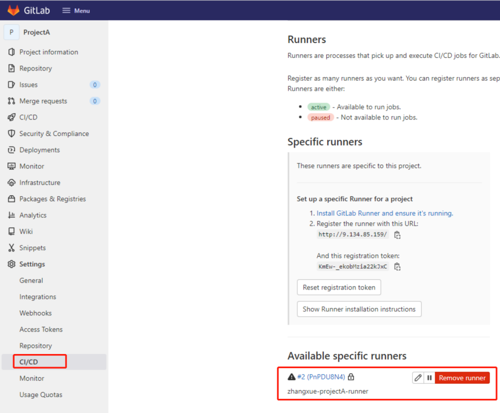

#### 3.1.5.用户权限

在执行流水线的时候默认的用户是gitlab-runner，而这个用户的权限很低。

导致一些mv、npm、ln等常用shell执行都会报permission不够的提示信息，所以要提升用户的权限。有两种解决方案

- 方案一 将gitlab-runner加入root用户组
```shell
usermod -g root gitlab-runner
```

- 方案二 配置 /etc/sudoers
找到 \`root ALL=(ALL) ALL\` // 一般在第100行，在下面写入不同用户，同样的配置，如下
```shell
\`gitlab-runner ALL=(ALL) ALL\` // 记住它们之间有空格
```
sudoers这个文件一般只读，需要加wq!才可以保存成功

#### 3.1.6.基本命令

- 启动命令
```shell
gitlab-runner --debug <command> #调试模式排查错误特别有用。
gitlab-runner <command> --help #获取帮助信息
gitlab-runner run #普通用户模式 配置文件位置~/.gitlab-runner/config.toml
sudo gitlab-runner run # 超级用户模式配置文件位置/etc/gitlab-runner/config.toml
```

- 注册命令
```shell
gitlab-runner register #默认交互模式下使用，非交互模式添加 --non-interactive
gitlab-runner list #此命令列出了保存在配置文件中的所有运行程序
gitlab-runner verify #此命令检查注册的runner是否可以连接，但不验证GitLab服务是否正在使用runner。 --delete 删除
gitlab-runner unregister #该命令使用GitLab取消已注册的runner。
#使用令牌注销
gitlab-runner unregister --url http://gitlab.example.com/ --token t0k3n
#使用名称注销（同名删除第一个）
gitlab-runner unregister --name test-runner
#注销所有
gitlab-runner unregister --all-runners
```

- 服务管理
```shell
gitlab-runner install --user=gitlab-runner --working-directory=/home/gitlab-runner

# user指定将用于执行构建的用户
# working-directory 指定将使用**Shell** executor运行构建时所有数据将存储在其中的根目录

gitlab-runner uninstall #该命令停止运行并从服务中卸载GitLab Runner。
gitlab-runner start #该命令启动GitLab Runner服务。
gitlab-runner stop #该命令停止GitLab Runner服务。
gitlab-runner restart #该命令将停止，然后启动GitLab Runner服务。
gitlab-runner status #此命令显示GitLab Runner服务的状态。当服务正在运行时，退出代码为零；而当服务未运行时，退出代码为非零。
```

### 3.2.配置.gitlab-ci.yml

- 中文博客教程：[https://www.cnblogs.com/sanduzxcvbnm/p/13891757.html](https://www.cnblogs.com/sanduzxcvbnm/p/13891757.html)
- 官方文档教程：https://www.cnblogs.com/sanduzxcvbnm/category/1871807.html

#### 3.2.1.流水线语法

|Keyword          |Description                                                      |
|-----------------|-----------------------------------------------------------------|
|script           |运行的Shell命令或脚本。                                          |
|image            |使用docker映像.                                                  |
|services         |使用docker服务映像.                                              |
|before_script    |在每个阶段作业运行前运行脚本。                                   |
|after_script     |在每个阶段作业运行后运行脚本。                                   |
|stages           |定义管道中的阶段，运行顺序。                                     |
|stage            |为工作定义一个阶段，可选，未指定默认为test阶段。                 |
|only             |限制创建作业的时间.                                              |
|except           |限制未创建作业的时间.                                            |
|rules            |条件列表，用于评估和确定作业的选定属性，以及是否创建该作业.      |
|allow_failure    |允许作业失败. 失败的工作不会影响提交状态.                        |
|when             |什么时候开始工作                                                 |
|environment      |作业部署到的环境的名称.                                          |
|cache            |在后续运行之间应缓存的文件列表.                                  |
|artifacts        |成功时附加到作业的文件和目录列表.                                |
|dependencies     |通过提供要从中获取工件的作业列表，限制将哪些工件传递给特定作业.  |
|coverage         |给定作业的代码覆盖率设置.                                        |
|retry            |发生故障时可以自动重试作业的时间和次数。                         |
|timeout          |定义自定义作业级别的超时，该超时优先于项目范围的设置。           |
|parallel         |多少个作业实例应并行运行.                                        |
|trigger          |定义下游管道触发器.                                              |
|include          |允许此作业包括外部YAML文件.                                      |
|extends          |该作业将要继承的配置条目.                                        |
|pages            |上载作业结果以用于GitLab页面.                                    |
|variables        |在作业级别上定义作业变量.                                        |
|interruptible    |定义在通过新的运行使其冗余时是否可以取消作业.                    |
|resource_group   |限制作业并发.                                                    |

#### 3.2.2.简单案例

需要编写.gitlab-ci.yml文件。一般放在项目的跟目录下【下面是个最简单的】
```yaml
# 在任一阶段开始之前执行 echo "ci&cd要开始了啊~~~~~"
before_script:
  - echo "ci&cd要开始了啊~~~~~"

# 说明有哪些阶段
stages:        
  - build
  - test
  - deploy

# build 阶段
build-job:     
  stage: build
  script:
    - echo "build begin"
    - sleep 5
    - echo "build end"
  tags:
    - builder

# test 阶段
unit-test-job:
  stage: test
  script:
    - echo "test begin"
    - sleep 2
- echo "test end"

# test 阶段的第二个任务
unit2-test-job:
  stage: test
  script:
    - echo "test2 begin"
    - sleep 2
    - echo "test2 end"

# 部署 阶段
deploy-job:     
  stage: deploy 
  script:
    - echo "deploy begin"
    - sleep 5
    - echo "deploy end"
  tags:
    - builder
```

效果如下

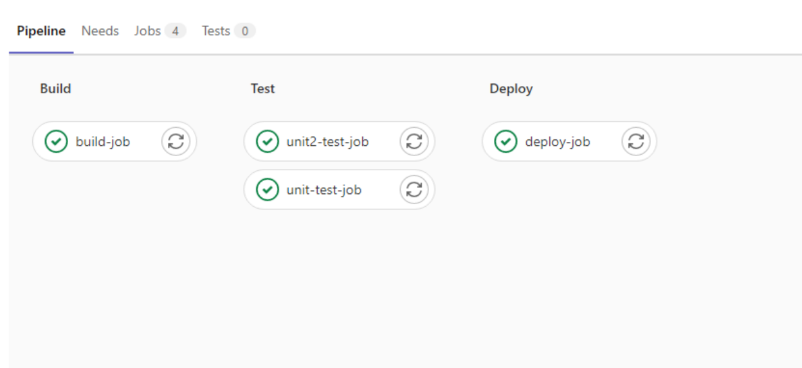


#### 3.2.3.Run pipeline

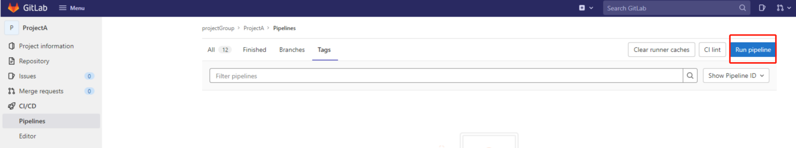


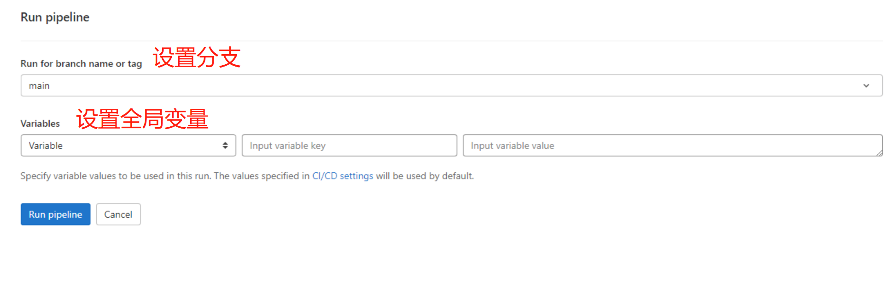


流水线如下。可以看到各个阶段的允许结果

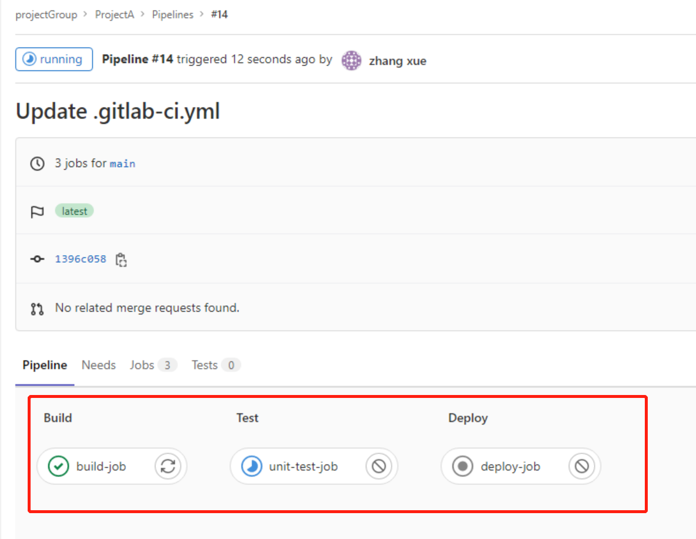


我们可以看到每个run pipeline的时候，每个阶段都是一个job。

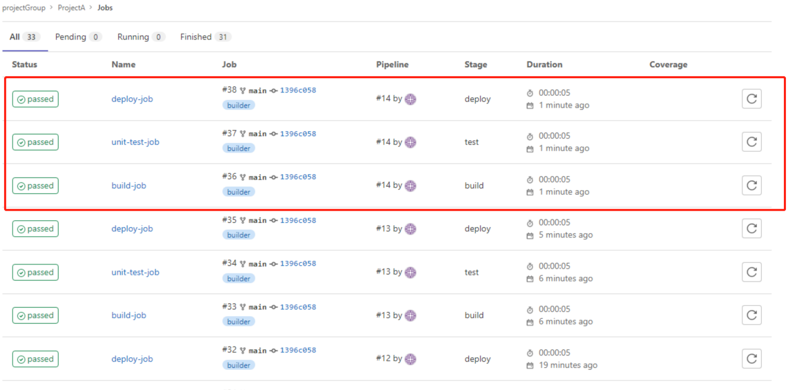


点击每个job，都会看到详细的日志

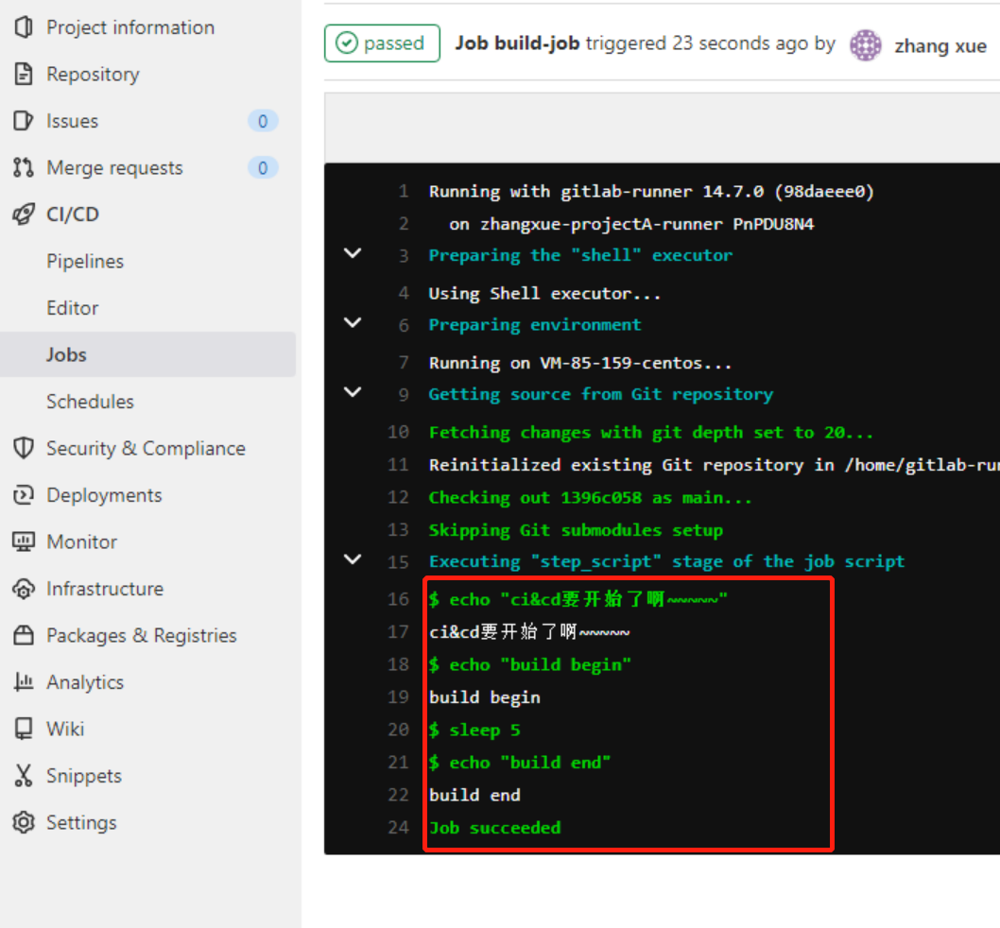


### 3.3.案例

#### 3.3.1.Sonar 质量监控

[https://www.cnblogs.com/haoliuhust/p/15370650.html](https://www.cnblogs.com/haoliuhust/p/15370650.html)

案例：其他项目替换projectKey,和login的token即可。扫描通过与否，可以在各个项目的配置中进行调整
```yaml
before_script:
##设置环境变量
  - export PATH=$PATH 

## 定义有哪些stages 
stages:
  - sonarcheck
  - build
  - test
  - deploy
  
sonarcheck:
  except:
    - schedules
  ### 指定只在PR、master和创建tag的时候运行    
  only:
    - merge_requests
    - master
    - tags
  stage: analysis
  script:
   - source ~/.bashrc
   - export PATH=/home/uniubi/software/sonar-scanner-4.6.0.2311-linux/bin:$PATH ### sonar-scanner的路径
   - sonar-scanner -Dsonar.projectKey=demo -Dsonar.sources=. -Dsonar.host.url=http://XXX:9000 -Dsonar.login=b7db4dc570ab507c272557c2d0cec6487dbcc8a9 -Dsonar.gitlab.commit_sha=$CI_BUILD_REF -Dsonar.gitlab.ref_name=$CI_BUILD_REF_NAME -Dsonar.gitlab.project_id=$CI_PROJECT_PATH -Dsonar.language=c++ -Dsonar.sourceEncoding=UTF-8 -Dsonar.gitlab.max_blocker_issues_gate=-1 -Dsonar.gitlab.max_critical_issues_gate=-1 -Dsonar.gitlab.query_max_retry=50 -Dsonar.gitlab.query_wait=1000
  ###允许失败，可根据自己项目需要设置 
  allow_failure: true
  ###对应gitlab-runner的tags
  tags:
    - sonar
```

#### 3.3.2.spring boot直接部署

打包成jar包，复制到指定目录，设置日志目录，启动jar
```yaml
# 说明有哪些阶段
stages:          # List of stages for jobs, and their order of execution
  - build
  - test
  - deploy

# build 阶段
build-job:     
  stage: build
  script:
    - echo "build begin"
    - mvn clean package -Dmaven.test.skip=true
    - cp ./target/demo-0.0.1-SNAPSHOT.jar /search/odin/demo.jar
    - cp ./restart.sh /search/odin/restart.sh
    - echo "build end"
  tags:
    - builder


# test 阶段
unit-test-job:
  stage: test
  script:
    - echo "test begin"
    - sleep 5
    - echo "test end"
  tags:
    - builder
  
# 部署 阶段
deploy-job:     
  stage: deploy 
  script:
    - echo "deploy begin"
    - bash /search/odin/restart.sh demo
    - echo "deploy end"
  tags:
    - builder
```

配合重启的脚本完成启动
```shell
# restart.sh
#!/bin/bash
if [ $# -ne 1 ]
then
        echo "arguments error!"
        exit 1
else
        jarname=$1
        echo $jarname
        pid=`ps -ef | grep "$jarname.jar"|grep -v grep|awk '{print $2}'`
        for id in $pid
        do
                echo $id
                kill -9 $id
                echo "killed $id"
        done
        nohup java -jar /search/odin/$jarname.jar > /search/odin/$jarname-log.log 2>&1 &
fi
```

#### 3.3.3.spring boot docker部署
```yaml
stages:
  - test
  - docker
  - publish

## roc-config-center 单元测试!!!!!!!!
#test:
#  stage: test
#  script:
#    - echo "start test $CI_COMMIT_SHA"
#    - gradle test -d
    # 代码覆盖率
#    - gradle jacocoTestReport
    #- gradle sonarqube
#    - echo "end sonar"
#  tags:
#    - testsvr-run

# 生成镜像
# 测试
testDocker:
  stage: docker
  script:
    # tag version!!
    - tag_version=test-`expr $CI_PIPELINE_ID % 10`
    # gen tagName
    - tag_name=docker-reg.zhangxue.com/roc-ci/roc-tco-portal:$tag_version
    - echo "------------- start test deploy ------------- "
    - gradle build -x test
    - echo "build success"
    - docker build -t $tag_name .
    - echo "docker success"
    - ls ./build/libs/*.jar
    - docker push $tag_name
    - echo "------------- end test deploy ------------- "
  tags:
    - testsvr-run
  only:
    - test

# 预生产和线上
prdDocker:
  stage: docker
  script:
    # gen tagName
    - tag_name=docker-reg.zhangxue.com/roc-ci/roc-tco-portal:1.0.$CI_PIPELINE_ID
    # gen tagName
    - echo "start package"
    - echo `pwd`
    - gradle build -x test
    - echo "build success"
    - docker build -t $tag_name .
    - echo "docker success"
    - ls ./build/libs/*.jar
    #    - docker tag roc-tco_portal `$tag_name`
    - docker push $tag_name
  tags:
    - testsvr-run
  only:
    - dev
  when: manual

# 发布
# 测试
testPublish:
  stage: publish
  script:
    # tag version
    - tag_version=test-`expr $CI_PIPELINE_ID % 10`
    # gen tagName
    - tag_name=docker-reg.zhangxue.com/roc-ci/roc-tco-portal:$tag_version
    - echo "start publish"
    - echo `pwd`
    - echo "============start k8s gen============"
    - echo "imagePath=$tag_name" >env.properties
    - chmod u+x convert
    - ./convert test
    - echo "============end k8s gen============"
    - kubectl apply -f k8s-final.yaml -n ted-opd --kubeconfig ~/k8scert/ted
    - echo "publish end"
  tags:
    - testsvr-run
  only:
    - test

# 预生产
prePublish:
  stage: publish
  script:
    # gen tagName
    - tag_name=docker-reg.zhangxue.com/roc-ci/roc-tco-portal:1.0.$CI_PIPELINE_ID
    # gen tagName
    - echo "start publish"
    - echo "============start k8s gen============"
    - echo `pwd`
    - echo "imagePath=$tag_name" >env.properties
    - chmod u+x convert
    - ./convert pre
    - echo "============end k8s gen============"
    - kubectl apply -f k8s-final.yaml -n ted-opd --kubeconfig ~/k8scert/ted
    - echo "publish end"
  tags:
    - testsvr-run
  only:
    - dev
  when: manual

# 生产
prdPublish:
  stage: publish
  script:
    # gen tagName
    - tag_name=docker-reg.zhangxue.com/roc-ci/roc-tco-portal:1.0.$CI_PIPELINE_ID
    # gen tagName
    - echo "start publish"
    - echo "============start k8s gen============"
    - echo `pwd`
    - echo "imagePath=$tag_name" >env.properties
    - chmod u+x convert
    - ./convert prd
    - echo "============end k8s gen============"
    - kubectl apply -f k8s-final.yaml -n ted-opd --kubeconfig ~/k8scert/ted
    - echo "publish end"
  tags:
    - testsvr-run
  only:
    - dev
  when: manual
```

## 4.高可用方案

Gitlab-ce是不支持分布式架构方案的。为了保证高可用，我们只能借助其他技术实现高可用

方案1：DRBD。为整个Gitlab的服务器进行镜像

DRBD是一个用软件实现的、无共享的、服务器之间镜像块设备内容的存储复制解决方案

教程：[https://www.cnblogs.com/wangshuyang/p/10946099.html](https://www.cnblogs.com/wangshuyang/p/10946099.html)

然后让镜像的服务器作为热备即可

官网的一个方案：[https://wxaxiaoyao.cn/article/67](https://wxaxiaoyao.cn/article/67)