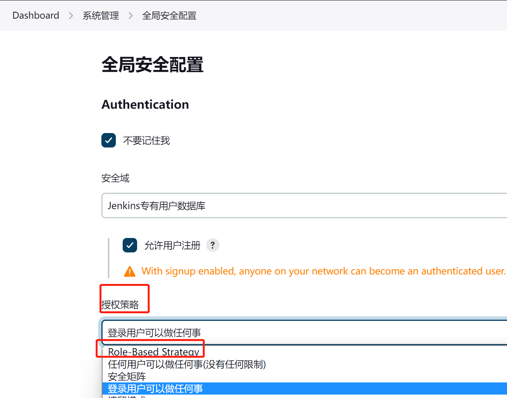

# 4.CD

## 工具对比

- GitLab
    - 优点：开发语言：Ruby On Rails 开源，不需要复杂的安装手段；配置简单，与Gitlab可直接适配；.gitlab-ci.yml，分阶段并行执行任务；实时构建日志清晰，UI交互体验很好；
    - 缺点：只支持Gitlab，yaml不能扩展；需要为每个任务定义组件；不支持一个大阶段中包含几个小阶段；使用ruby开发，不易扩展，占用资源较多。
- Jenkins
    - 优点：开发语言Java； web管理界面，社区庞大， 插件丰富，文档丰富， 历史悠久；分布式任务； 应用广泛，功能强大； 编写jenkins file
    - 缺点：基于JVM运行环境； 插件以及自身安装较为复杂；启动慢，运行慢，耗资源；需要专人维护管理，新人学习成本较高；只能用Java写插件；
- Dron
    - 优点：开发语言Go; 轻量级，启动快，运行快，资源占用少；云原生支持Docker；新兴的CI/CD开源工具；分布式任务；更加适合云原生应用，与k8s结合紧密；也可以单独部署；插件可以使用多种语言编写；编写流程yml，Pipline 比 Jenkins 语法简单，可以通过Hook动态获取
    - 缺点：插件不多，资源没有Jenkins多，但也基本够用了。

## jenkins

- 官网： [https://www.jenkins.io/](https://www.jenkins.io/)
- 中文官网： [https://www.jenkinschina.com/](https://www.jenkinschina.com/)
- 中文网： [http://www.jenkins.org.cn/](http://www.jenkins.org.cn/)
- 中文社区：[https://gitee.com/jenkins-zh](https://gitee.com/jenkins-zh)

- [Jenkins部署spring boot项目](https://blog.csdn.net/doubiy/article/details/117911423)

### 1.安装

采用docker安装

```shell
docker run -d -uroot -p 9095:8080 -p 50000:50000 --name jenkins \
  -v /var/jenkins_home:/var/jenkins_home \
  -v /etc/localtime:/etc/localtime \
  -v /usr/local/java/apache-maven-3.8.6:/usr/local/maven \
  -v /usr/local/java/jdk1.8:/usr/local/jdk \
  -e JENKINS_UC=https://mirrors.cloud.tencent.com/jenkins \
  -e JENKINS_UC_DOWNLOAD=https://mirrors.cloud.tencent.com/jenkins \
  --restart=no \
  --privileged=true \
  jenkins/jenkins:lts
```

参数含义
- -uroot				使用 root 身份进入容器，推荐加上，避免容器内执行某些命令时报权限错误
- -p 9095:8080		    将容器内8080端口映射至宿主机9095端口，这个是访问jenkins的端口
- -p 50000:50000		将容器内50000端口映射至宿主机50000端口
- --name jenkins		设置容器名称为jenkins
- -v /var/jenkins_home:/var/jenkins_home	 /var/jenkins_home目录为容器jenkins工作目录，我们将硬盘上的一个目录挂载到这个位置，方便后续更新镜像后继续使用原来的工作目录
- -v /etc/localtime:/etc/localtime	让容器使用和服务器同样的时间设置
- -v /usr/local/java/apache-maven-3.8.6:/usr/local/maven    挂载maven【可选，Jenkins可以自动下载】
- -v /usr/local/java/jdk1.8:/usr/local/jdk                  挂载jdk【可选，Jenkins可以自动下载】
- -e JENKINS_UC=https://mirrors.cloud.tencent.com/jenkins           腾讯的插件仓库，访问速度快
- -e JENKINS_UC_DOWNLOAD=https://mirrors.cloud.tencent.com/jenkins  腾讯的插件仓库，访问速度快
- jenkins/jenkins:lts    lts 是长期支持版，比较稳定


查看初始密码：docker exec jenkins cat /var/jenkins_home/secrets/initialAdminPassword

### 2.插件

- git parameter【用于操作git 分支和读取】
- publish over ssh【用于执行ssh命令】
- Role-based Authorization Strategy 【用户权限管理插件】。
    

### 3.springboot部署脚本

构建后操作：
- 选中-高级中的：Verbose output in console，打印远程的执行日志
- Transfers的高级中选择：Exec in pty，用于远程执行脚本
- 设置Transfers的超时时间

```shell
#!/bin/sh
echo ">>>>>>>>>>>  开始启动项目 >>>>>>>>>>>>>>>>>"

#这里可替换为你自己的执行程序，其他代码无需更改  需要修改为代码实际路径
APP_NAME=my_project.jar
APP_PATH=/usr/local/data/my_project.jar
APP_JENKENS_PATH=/usr/local/data/target/my_project-0.0.1-SNAPSHOT.jar
JAVA_CMD=/usr/local/java/jdk1.8/bin/java
LOG_PATH=/usr/local/data/server.log
 
#使用说明，用来提示输入参数
usage() {
	echo "Usage: sh 执行脚本.sh [start|stop|restart|status]"
    exit 1
}
 
#检查程序是否在运行
is_exist(){
  pid=`ps -ef | grep $APP_NAME | grep -v grep | awk '{print $2}' `
  #如果不存在返回1，存在返回0     
  if [ -z "${pid}" ]; then
   return 1
  else
    return 0
  fi
}
 
#启动方法
start(){
  is_exist
  if [ $? -eq "0" ]; then
    echo "${APP_NAME} is already running. pid=${pid} ."
  else
    # 需要配置为java的路径，原因:jenkins使用脚本时，不能获取环境变量，手动执行可以直接使用
    # 启动之后不能立刻跳出，需要sleep1s
    nohup $JAVA_CMD -jar $APP_PATH > $LOG_PATH 2>&1 &
    sleep 1
    echo "App do runing!"
  fi

}
 
#停止方法
stop(){
  is_exist
  if [ $? -eq "0" ]; then
    echo "${APP_NAME} do kill"
    kill -9 $pid
  else
    echo "${APP_NAME} is not running"
  fi

}
 
#判断启动结果。1=启动失败，0启动成功
start_result(){
	for i in {1..120};
	do 
		if cat $LOG_PATH | grep 'JVM running for' > /dev/null ; 
		then
			echo 'App runing success'
			return 0
		else 
			echo 'App status scan......'
			sleep 1;
		fi
	done
	echo 'App runing faild'
	return 1;
}

#备份
backup(){
	if [ -f $APP_PATH ] 
	then 
		TIME_STAMP=$(date +%Y%m%d%H%M)
		mv $APP_PATH  $APP_PATH$TIME_STAMP
		echo "${APP_NAME} backup success"
	else
		echo "${APP_NAME} doesn't exist, doesn't backup"
	fi
}

#获得最新的jar
getapp(){
	if [ -f $APP_JENKENS_PATH ] 
	then 
		mv $APP_JENKENS_PATH $APP_PATH
		echo "getapp success"
	else
		echo "getapp doesn't exist"
	fi
}
 

## 开始流程
stop
backup
getapp
start
start_result
if [ $? -eq "1" ]; then
	return 1;
fi
```

### 4.docker部署案例

```shell
docker build -t public/my_project:1.0 /usr/local/data
docker rm -f my_project
docker run -d -p 8080:8080 --name=my_project public/my_project:1.0
```


### 5.用户权限

使用插件Role-based Authorization Strategy。使用教程：https://blog.csdn.net/lsqingfeng/article/details/106127703/

> 1.开启权限管理



注意：选择权限后不能进行切换了，一旦切换原本的权限数据会全部丢失。


### 5.常见问题

<p style="color: red">jenkins安装出现提示“Please wait while Jenkins is getting ready to work”</p>

因为访问官网太慢。我们只需要换一个源就行了。教程：https://blog.csdn.net/qq_42499737/article/details/118385000

<p style="color: red">配置ssh私钥</p>

https://blog.csdn.net/qq_37924396/article/details/125580676

<p style="color: red"></p>
<p style="color: red"></p>
<p style="color: red"></p>
<p style="color: red"></p>

## Drone

- 官网： [https://www.drone.io/](https://www.drone.io/)
- [轻量级CI/CD自动构建平台Gitea+Drone保姆级实践教程](https://blog.csdn.net/ywch520/article/details/124782654)
Dron是一个现代化的持续集成平台，它使用强大的云原生pipeline引擎自动化构建、测试和发布工作流。
Drone 与多个源代码管理系统无缝集成，包括 GitHub、GitHubEnterprise、Bitbucket、GitLab和Gitea；
它的每个构建都在一个隔离的 Docker 容器中运行；另外它也支持插件，可以使用你熟知的语言轻松的扩展它们。

