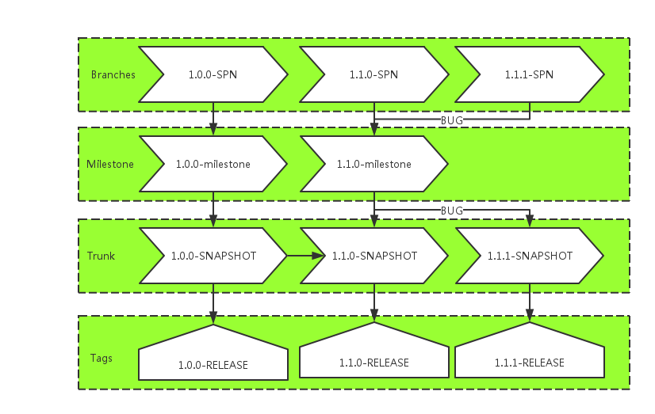

# 5.svn

## 1.基础介绍

Apache的Subversion通常缩写为 SVN，是一个开源许可下分发的软件版本和版本控制系统。

Subversion由CollabNet公司创建于2000年，但现在它是Apache软件基金会的一个项目开发，并作为了丰富的开发人员和用户社区的一部分。

通过本教程可以加强对SVN系统的理解，需要保持当前和历史版本的文件，如源代码，网页和文档。

先决条件

在继续本教程之前，应该有一个基本的了解编程语言，源代码，文件等简单的用语，如因为要使用SVN来处理所有的软件项目在组织中，所以这将是很好，如果有软件开发和软件测试过程的知识。

### 1.1.版本控制

版本控制系统是一个软件，可以帮助软件开发人员一起工作，让他们的工作也保持完整的历史。

以下是版本控制系统的目标：
- 允许开发同时工作。
- 不要覆盖对方的文件变化。
- 保持历史的每一个版本的一切。

版本控制系统分为两类：
- 集中式版本控制系统（CVCS）
- 分散式/分布式版本控制系统（DVCS）

### 1.2.版本控制术语

让我们开始讨论在我们的教程中，我们将使用的一些的术语。

**资源库**:
库是任何版本控制系统的中心。它是中央地方开发人员存储他们所有的工作。信息库不仅存储文件，而且还历史。通过网络访问信息库，资料库，作为一个服务器作为客户端的版本控制工具。客户端可以连接到版本库，那么他们就可以存储/检索其变动/从库中。通过存储的变化，客户端可以提供这些变化给其他人，通过检索更改，客户端需要其他人作为工作副本的变化。

**主干**:
树干是一个目录，在所有主要的发展发生，通常是签出的项目开发人员工作。

**标签**:
标签目录是用来存储的项目命名的快照。标签操作允许给特定的版本库中的描述和令人难忘的名字

例如LAST_STABLE_CODE_BEFORE_EMAIL_SUPPORT更令人难忘的

资源库 UUID: 7ceef8cb-3799-40dd-a067-c216ec2e5247 和修订版: 13

**分支机构**：
BRACH操作用于建立另一条线的发展。它是有用的，当你想开发过程对fork分为两个不同的方向。例如，当释放5.0版，可能希望创建一个分支，因此，发展6.0功能可以保持独立从5.0修正bug。

**工作副本**：工作副本的快照存储库。共享库是由所有的团队，但人们并不直接修改它。相反，每个开发者的检出工作副本。工作副本是私人工作场所开发人员可以做他们的工作，团队其他成员从内孤立。

**提交更改**：提交私有工作环境中央服务器存储的变化是一个过程。提交后，进行更改的所有团队。其他开发人员可以检索这些变化，通过更新他们的工作副本。提交是原子操作。无论是整体成功提交或回滚。用户永远不会看到一半完成提交。

## 2.安装

本文使用的是SVN协议的版本。。

### 2.1.安装

Windows需要从官网下载，直接运行安装。

Ubuntu:sudo apt-get install subversion

Centos : yum -install subversion

### 2.2.创建仓库

现在创建/srv/svn作为中央仓库，dubbo_demo是一个仓库（也就是常说的项目）

```shell
cd /srv
sudo mkdir svn
svnadmin create /srv/svn/dubbo_demo
```

### 2.3.配置

配置文件都在创建仓库的时候自动创建好了，但是需要进行修改/srv/svn/dubbo_demo/conf

#### 2.3.1.配置svnserve.conf

a、去掉#[general]前面的#号

[general]

b、#匿名访问的权限，可以使read/write/none,默认是read

anon-access = none

c、#认证用户的权限，可以使read/write/none，默认为write

auth-access = write

d、#密码数据库的路径，去掉前面的#

passw-db = passwd

注意：其中 anon-access 和auth-access
分别为匿名和有权限用户的权限，默认给匿名用户只读的权限,但如果想拒绝匿名用户的访问，只需把
read 改成 none 就能达到目的。

#### 2.3.2.配置passwd文件

```text
[users]
root = 123
hfkj = 12345678
test1 = test1
test2 = test2
```

注意：这里设置了四个用户root、hfkj、test1、test2，密码分别为123、12345678、test1、test2

#### 2.3.3.配置authz文件

```text
[groups]
admin=root,hfkj
user=test1,test1
[/]
@admin = rw
@user = r
* = r
```

其中root,hfkj数据admin组，有读和写的权限；test1和test2数据test组只有读的权限。

[/]表示用户组对dubbo_demo的根目录的操作权限。其中*表示剩余所有的用户组的权限

***：注意啦，如果采用分散开发的话，一般trunk为开发人员只读、tag不开放、branches为开发读写。

配置如下：

```text
[groups]
manager=manager
devs=dev1,dev2,dev3,dev4

[/trunk]
@manager= rw
@devs= r
* = r

[/tag]
@manager= rw

[/branches]
@manager= rw
@devs= rw
* = r
```

### 2.4.基本命令

1.验证svn安装是否成功：svnadmin --version

2.创建svn的数据仓库：svnadmin create E:\\repository\\svn\\itcast

3.启动svn服务：

> svnserve -d -r E:\\repository\\svn\\itcast 单仓库启动

svnserve -d -r E:\\repository\\svn 多仓库启动 建议使用多仓库

-d 表示svnserver以“守护”进程模式运行

-r 指定文件系统的根位置

4.验证svn启动是否成功：netstat -an 查看3690端口是否被占用

5.客户端检出(checkout)文件：svn checkout svn://ip:port/repName .

6.将本地文件纳入版本控制：svn add fileName

7.将本地文件提交到服务器：svn commit -m "message" fileName

8.从服务器更新文件到本地：svn update [fileName]

9.删除本地文件：svn delete fileName

10.恢复文件：svn revert fileName 注意：revert只能恢复没有提交的操作

11.将svn服务注册为windows系统服务：
```text
sc create SVN-Service binpath= D:\\Program Files\\Subversion\\bin\\svnserve.exe --service -r E:\\repository\\svn displayname=SVN-Service start= auto depend= Tcpip
```

12.将svn服务注册为Linux开机自启

12.1 写个脚本startsvn.sh
```text
#!/bin/bash
svnserve -d -r /home/svn
```

12.2 将脚本放置到/etc/init.d/

12.3 使用ubuntu工具update-rc.d（切换至/etc/init.d/目录下）
```text
update-rc.d starsvn.sh defaults
```

## 3.生命周期

### 3.1.建立资料库 create

该库是开发人员存储他们所有的工作一个中央地方。资源库不仅存储文件，而且还变更历史。这意味着它保持历史是谁做的变化，何时和为什么？

创建操作是用来创建一个新的资料库。大部分的时候只有一次操作完成。当创建一个新的存储库，VCS将期待你说的东西，比如，想让它被创建，它的名称应该是什么，以确定它。

### 3.2.检出 checkout

检出操作用于从资源库中创建一个工作副本。工作副本是一个私有工作场所的开发人员做他们的变化，后来就到存储库提交这些变化。默认检出的是最新的版本，也可以选择一个旧的版本进行检出。


### 3.3.更新 update

顾名思义更新操作是用来更新工作副本。此操作同步与存储库的工作副本。由于共享库是由所有的团队，其他开发人员可以提交他们的修改你的工作副本变成了旧的。

让我们假设Tom 和 Jerry 两个开发人员工作的一个项目。两者检出从库中的最新版本，并开始工作。此时他们的工作拷贝与存储库是完全同步的。杰里完成他的工作非常有效，并提交自己的修改到版本库。

现在，Tom 的工作副本是过时了。从资源库中，更新操作将Jerry 的最新变化，将Tom 的工作副本更新。

### 3.4.执行更改 add/delete

检出后可以做各种操作进行更改。编辑是最常见的操作。一个可以编辑现有的文件，从文件中添加/删除的内容。

人们可以添加文件/目录。但随即这些文件/目录不会成为存储库中的一部分，而不是将它们添加到挂起的更改列表，并成为后提交操作的库中的一部分。

同样，一个可以删除的文件/目录。立即删除操作，删除文件，从工作副本，但实际删除文件添加到挂起的更改列表和操作提交到存储库后所做的更改。

重命名操作更改文件/目录的名称。用于移动从一个地方到另一个存储库树中的文件/目录移动操作。

例如，新建了一个文件之后，这个文件是不能提交的，必须执行add操作才能提交。


### 3.5.回顾变化

当检出的工作副本或更新工作副本，然后工作副本完全同步与存储库。但是当工作副本的变化，它变得比库新。这是很好的做法，审查更改，然后再提交操作。

状态操作列出了已经取得的工作副本的修改。正如我之前提到的，只要做的工作副本的变化，所有这些变化成为挂起的更改列表的一部分。和状态操作用于查看挂起的更改列表。

状态操作，只提供了一系列的变化，但不是关于他们的详细资料。我们可以使用diff操作已作出的修改的工作副本中查看详细信息。

### 3.6.修正错误

让我们假设一个改变自己的工作副本，但现在他要扔掉这些变化。在这种情况下，恢复操作会有所帮助。

恢复操作撤销已作出的工作副本的修改。这是可能的一个或多个文件/目录恢复。也有可能整个工作副本恢复，在这种情况下，恢复操作会破坏挂起的更改列表，并会带来工作副本返回到原来的状态。


### 3.7.解决冲突

在合并时，可能会发生冲突。但是，什么是冲突？合并操作自动处理，可以做到安全的一切。

一切被视为冲突。例如，如果“hello.c”文件被修改的分支，并在另一个分支删除？这种情况需要一个人作出决定。

决心操作是用来帮助用户数字的东西，并告知VCS冲突应如何处理。

### 3.8.提交更改

提交操作是用来申请工作副本到版本库的变化。此操作修改库和其他开发人员可以通过更新他们的工作副本，看到这些变化。

之前提交一个挂起的更改列表添加文件/目录。这是改变的地方等待提交。有了提交，我们通常会提供一个日志消息来解释为什么有人做了修改。此日志消息的一部分的历史资料库。提交是一个原子操作。含义的成功，要么全部提交或回滚。用户永远不会看到一半完成提交。


## 4.SVN最佳实践

我们在此处不讨论 GIT 比 SVN 好多少，也不讨论Maven 和Gradle 哪个好用，基于现有的开发环境，大多数公司还是采用 SVN + Maven 来进行项目管理。

因为这已经满足了大多数的代码管理需求，并且对于一个成熟的公司来讲，项目管理工具的改变可能需要很大的成本和决心。

做程序开发和项目管理的肯定知道，基于 SVN 的项目开发管理有两种方式：集中式开发和分散式开发，说白了，集中式开发对应的是基于trunk进行开发，
而分散式开发对应的就是基于branches进行开发。两者并没有绝对的好坏之分，具体采用哪种方式，完全凭个人喜好、项目架构和公司规定进行选择。

### 4.1.集中式开发——基于Trunk的开发

基于主干的开发方式可能是比较主流的开发方式

#### 4.1.1.三个目录的主要定义

trunk：开发工程（非稳定）

tag：我们认为稳定的发布包

branches：BUG、需求变更分支

#### 4.1.2.基本的开发步骤

1.在trunk中新建一个项目，此时版本号是1.0.0-SNAPSHOT

2.分配权限给所有的开发人员，所有开发人员功能开发完毕之后提交代码到trunk

3.测试基于trunk进行测试，此时trunk处于锁定状态——不允许进行代码修改，测试完毕之后打tag，至此1.0.0-RELEASE版本正式发布

4.trunk中的版本号变为1.1.0-SNAPSHOT，解锁Trunk，所有开发人员开始开发1.1.0-SNAPSHOT，此时如果发生未测出来的BUG和需求变动，
基于1.0.0-RELEASE的tag打分支1.0.0-PATCH，所有相关开发人员对1.0.0-PATCH进行维护开发，同时主干的1.1.0-SNAPSHOT也在同步进行。


#### 4.1.3.开发情景

这里很多人会问，如何将1.0.0-PATCH中的代码合并到1.1.0-SNAPSHOT中？这里用一个场景来具体描述

程序员小张负责用户注册模块的开发，在整个项目1.0.0-RELEASE发布之后，1.1.0-SNAPSHOT中小张需要对注册模块进行一个升级，此时（注意，代码没有正式开始编写），在线上运行的1.0.0-RELEASE版本发现了一个隐秘的BUG（可能是代码BUG，也可能是业务BUG），小张需要先为1.0.0-RELEASE这个tag打出一个分支1.0.0-PATCH-01对这个BUG进行修复，修复完毕之后，将1.0.0-PATCH-01合并到主干中，生成版本1.0.1-SNAPSHOT，然后发布到Tag中，此时Tags中包含1.0.0-RELEASE和1.0.1-RELEASE两个tag，之后，进行新版本1.1.0-SNAPSHOT的开发——这是最好的结果。

但是事实并非如人所愿，我们最常遇到的情况是1.1.0-SNAPSHOT已经开发了一段时间，此时发现了1.0.0-RELASE中的这个隐藏BUG，需要紧急修复，我们这里同样用一个场景来具体描述。

程序员小张负责用户注册模块的开发，在整个项目1.0.0-RELEASE发布之后，1.1.0-SNAPSHOT中小张需要对注册模块进行一个升级，此时（注意，代码已经正式开始编写），在线上运行的1.0.0-RELEASE版本发现了一个隐秘的BUG（可能是代码BUG，也可能是业务BUG），小张需要先为1.0.0-RELEASE这个tag打出一个分支1.0.0-PATCH-01对这个BUG进行修复，修复完毕之后，将1.0.0-PATCH-01单独上线，接下来的故事就比较复杂了，小张需要将1.0.0-PATCH-01中的代码手动的与正在开发的1.1.0-SNAPSHOT进行一个合并——这是常见但是异常的结果

为什么说第二个场景属于常见但是异常，这非常考验整个PMO管理——为什么会出现紧急BUG？为什么需要紧急上线？这会造成两个最直接的麻烦：

1.线上版本不是RELEASE版本的，而是一个分支PATCH。

2.将PATCH中的代码合并到正在开发的代码中会异常痛苦。

如果遇到这样的情况，首先不能慌张，尽可能的先将线上的BUG解决掉，再来考虑如何在新版本中合并代码的问题，这样肯定会造成1.1.0的延期发布以及1.0.1的缺失，严重的可能还需要重新审视——但是你避免不了，不过责任是比较清楚的。

当然为了能够尽可能的避免这种情况出现，一般建议新版本上线后的一段时间内（比如一个礼拜）开发人员先暂停开发做一个休整，做做项目总结、补充一些文档之类的工作，之后再进行1.1.0的迭代，这样做不仅能够完美收尾，还能减少情景2出现的概率，对公司、开发人员以及项目管理来讲都是有利的。

### 4.2.分散式开发——基于Branches的开发

分散式开发是基于分支branches进行开发，也是我个人比较喜欢的一种方式

#### 4.2.1.三个目录的定义如下

trunk：稳定的主干

tag：我们认为稳定的发布包

branches：开发切片

与集中式开发不同的在于，我们branches中存在的是各个开发人员所负责的切片，而主干中则一直是稳定的SNAPSHOT版本——这其实是符合逻辑的，
SNAPSHOT代表的意义是预览而不是“破烂”，至少能够正常的运行起来才能算的上是预览版，而集中式开发的主干虽然标注的是SNAPSHOT预览版，
实际上其实是一个“破烂”——正常情况下你是运行不起来的，开发环境总是存在各种各样的不确定性。

#### 4.2.2.基本开发步骤

1.在主干trunk中新建一个项目，然后copy to
branches，分别建立milestone、sp1、sp2...spN，每一个切片对应一个开发或前端或白盒测试，

2.当大家各自开发完毕之后，提交代码，项目经理将sp1、sp2等切片合并到milestone中，这里注意了，不是合并到trunk中，而是一个分支的名字叫milestone——里程碑，专门用来合并各种代码

3.milestone的代码进行合并之后，部署到测试环境让测试组介入测试——完毕之后合并到trunk

4.然后在trunk上进行发布，在tag中归档并上线，trunk中的版本号升级到下一版本，然后所有开发切片重新切片。

#### 4.2.3.开发场景

项目经理建了一个项目，版本号是1.0.0-SNAPSHOT，程序员小王从项目经理那里领到一个任务是开发订单查询中心这个模块，
他的切片是1.0.0-SNAPSHOT-SP1，开发完毕之后提交了代码，项目经理合并代码到milestone上，然后小王开始开发其他的代码，
项目经理陆续从小张、小李那边收到SP2、SP3的代码之后，觉得可以发布一版了，叫上测试对milestone进行测试，通过之后合并到主干打tag上线，此时线上版本号是1.0.0-RELEASE，主干上的版本号是

1.1.0-SNAPSHOT，此时项目经理重新切片，所有人的代码从1.0.0-SNAPSHOT-SPn转换到1.1.0-SNAPSHOT-SPn进行开发，milestone同样变成1.1.0-SNAPSHOT，循环往复……



同样存在集中式开发的问题——老版本出现BUG怎么办？我们这里同样模拟一个场景。

1.0.0-SNAPSHOT通过了测试并且已经打tag上线了，线上版本是1.0.0-RELEASE，trunk上的版本号是1.1.0-SNAPSHOT，milestone上的版本也是1.1.0-SNAPSHOT，
所有的开发都已经认领了各自的1.1.0-SNAPSHOT的SP进行下一版的开发，此时1.0.0-RELEASE发生了一个隐藏的BUG需要紧急修复并上线，项目经理找到BUG负责人小王，
让他对他所负责的1.0.0-SNAPSHOT-SPn进行fix，修补完毕之后依次合并milestone、测试、打tag上线，此时线上版本是1.1.0-RELEASE，主干版本变成1.1.1-SNAPSHOT，milestone同样为1.1.1-SNAPSHOT。

到此，我们产生了一个疑问：因为小王的BUG导致主干版本比开发的SP版本高了一个版本，是不是会有冲突呢？

其实是没有冲突的，SP的版本号其实是弱化了的——实际上我根本不关心SP的版本号是否正确，当发生不正确的情况出现，由各个切片的开发人员自己通过Merge里程碑Milestone的代码解决。

#### 4.2.4.总结一下分散式开发引申出来的几个概念

SP：开发切片。

MILESTONE：里程碑，对应的是测试环境

TRUNK：主干，对应的是预发布环境

TAG：归档，对应的是线上环境

分散式开发重点解决的是保证测试环境的相对稳定、预发布环境的绝对稳定以及线上环境的绝对稳定问题，并且我们试想一下：是不是能够轻松做到持续交付了呢？

### 4.3.总结

集中式开发适合一些小型项目的开发，例如微服务、小组件。

分散式开发适合快速迭代——对于未知的需求贴合的更好。

svn的管理比较麻烦，所以需要使用图形化管理界面，比如：svnmanager。

http://deidara.blog.51cto.com/400447/89906/
