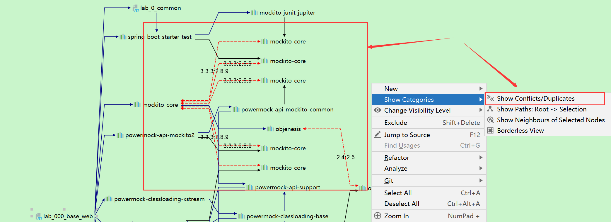

# 6.maven

- 官网：[https://maven.apache.org/](https://maven.apache.org/)
- 官方文档：[https://maven.apache.org/plugins/index.html](https://maven.apache.org/plugins/index.html)
- 教程：[https://www.runoob.com/maven/maven-tutorial.html](https://www.runoob.com/maven/maven-tutorial.html)

- 仓库：
  - 阿里云仓库：[https://developer.aliyun.com/mvn/guide](https://developer.aliyun.com/mvn/guide)
  - Maven官方仓库：[https://mvnrepository.com/](https://mvnrepository.com/)

## 1.基础

Maven是Java项目管理工具，帮助开发人员自动构建、管理项目依赖关系等。
Maven基于XML定义项目结构和构建过程，提供标准的构建生命周期和插件来执行各种构建任务。
Maven还能够自动下载和管理项目的依赖库，并能够生成各种报告，如测试报告、代码覆盖率报告等。

### 1.1.POM

POM 代表项目对象模型，它是一个 XML 文件，保存在项目根目录的 pom.xml文件中，以下是一个项目的依赖，被称为项目的坐标

```xml
<dependency>
    <groupId>junit</groupId>
    <artifactId>junit</artifactId>
    <version>4.12</version>
    <scope>test</scope>
    <optional>true</optional>
    <systemPath>${basedir}/lib/junit-4.12.jar</systemPath>
    <exclusions>
        <exclusion>
            <artifactId>log4j-to-slf4j</artifactId>
            <groupId>org.apache.logging.log4j</groupId>
        </exclusion>
    </exclusions>
</dependency>
```

- groupId：【必填】项目组 Id，必须全球唯一
- artifactId：【必填】项目 Id，即项目名
- version：【必填】项目版本
- scope：依赖范围
    - compile:编译依赖范围。默认的范围，可以不填，表示在所有过程中都有效，如编译期、测试过程中、运行期间等。
    - provided: 已提供依赖范围。这个范围表示只提供编译和测试阶段有效，运行期间不需要，像tomcat等容器本身已经提供的servlet-api等。
    - runtime: 运行时依赖范围。这个范围表示只有在运行和测试期间才有效，编译期间不需要，像连接数据库的jdbc驱动程序等。
    - test: 测试依赖范围。这个范围只有测试阶段有效，编译和运行不需要，像单元测试提供的junit包。
    - system: 系统依赖范围。这个范围表示不依赖本地仓库，jar在其他的目录，需要通过systemPath指定路径，这个不建议使用。
    - import: 引用依赖范围。Maven2.0.9之后新增的范围，只能用在<dependencyManagement>中，并且导入的type为pom类型的父工程配置，一般用来解决多继承问题。
- optional：表示该依赖是可选的.不会被依赖传递，减少jar包冲突。```<optional>true</optional>```
- systemPath:配合scope=system使用，表示引用本地目录下的jar。
- exclusions：剔除这个项目中的某个依赖。用于降低引入额外功能以及解决依赖冲突。
- type:被引入的项目类型，比如：jar、war、pom、maven-plugin等，默认可以不填写。

### 1.2.生命周期

Maven有三套相互独立的生命周期，请注意这里说的是“三套”，而且“相互独立”，初学者容易将Maven的生命周期看成一个整体。

这三套生命周期分别是：
- Clean Lifecycle 在进行真正的构建之前进行一些清理工作。比如，mvn clean: 构建输出的清理
- Default Lifecycle 构建的核心部分，编译，测试，打包，部署等等。比如，mvn install ： 编译 、 测试 、 打包 、 安装，这就是一套默认的构建生命周期
- Site Lifecycle 生成项目报告，站点，发布站点。比如，比如，mvn site

它们是相互独立的，你可以仅仅调用clean来清理工作目录，仅仅调用site来生成站点。
当然你也可以直接运行 mvn clean install site 运行所有这三套生命周期。

实际上我们经常一起使用，比如：mvn clean deploy -Dmaven.test.skip=true -P dev

maven的所有phases：validate --> compile --> test --> package --> verify --> install --> deploy

### 1.3.常用命令

- clean： 清除目标目录中的生成结果。
- compile： 编译源代码
- test： 运行项目中的单元测试
- package： 根据项目生成jar文件
- install： 编译打包，并在本地库中安装jar
- deploy，发布。指的是将打包的结果发布到maven仓库。
- -DskipTests，不执行测试用例，但编译测试用例类生成相应的class文件至target/test-classes下。
- -Dmaven.test.skip=true，不执行测试用例，也不编译测试用例类。
- dependency:sources 下载项目依赖的jar包的源码包
- dependency:tree 查看依赖树，根据依赖原则来调整依赖在 POM文件的声明顺序。
- generate-sources：开发环境与代码分离，很少使用，执行这个命令可以通过查看.classpath和.project两个文件来查看变化。
- tomcat*:run： 启动tomcat，前提是在项目的pom.xml文件中添加了tomcat插件
- eclipse:eclipse： 生成Eclipse项目文件，即.classpath和.project文件
- -U 参数强制 maven 下载最新的快照构建
### 1.4.属性

```xml
1. 内置属性：maven共有6个内置属性，maven预定义，用户可以直接使用的
${basedir}            表示项目的根目录，pom.xml所在的目录（可以是项目根目录或者module的目录）；默认为 D://workspace/springboot-demo/
${version}            表示项目版本；例如 0.0.1-SNAPSHOT
${project.basedir}    同${basedir};默认为 D://workspace/springboot-demo/
${project.baseUri}    表示项目文件地址，当前项目下<url>种的内容
${maven.build.timestamp}          表示项目构建时间；
${maven.build.timestamp.format}   表示属性${maven.build.timestamp}的展示格式，默认值为yyyyMMdd-HHmm，

可自定义格式，其类型可参考java.text.SimpleDateFormt。用法如下：
<properties>
<maven.build.timestamp.format>yyyy-MM-dd HH:mm:ss</maven.build.timestamp.format>
</properties>

2.POM属性：使用pom属性可以引用到pom.xml文件对应的元素的值
${project.build.sourceDirectory}：     项目的主源码目录，默认为 src/main/java
${project.build.testSourceDirectory}： 项目的测试源码目录，默认为 src/test/java
${project.build.directory}：           项目构件输出目录，默认为 target/
${project.outputDirectory}：           项目主代码编译输出目录，默认为 target/classes/
${project.testOutputDirectory}：       项目测试代码编译输出目录，默认为 target/test-classes/
${project.groupId}：                   项目的 groupId
${project.artifactId}：                项目的 artifactId
${project.build.sourceEncoding}       表示主源码的编码格式
${project.build.sourceDirectory}      表示主源码的路径
${project.build.finalName}            表示输出文件名称；
${project.vesion}                     表示项目版本，与${version}相同

3. 环境变量：所有环境变量都可以使用以env开头的Maven属性引用，使用mvn help:system命令可查看所有环境变量
${env.JAVA_HOME}    表示JAVA_HOME环境变量的值；

4. Settings属性：与pom属性同理，用户可以用以settings.开头的属性引用setting.xml文件的XML元素值
${settings.localRepository}       表示本地仓库的地址

5.自定义属性：在pom.xml文件的<properties>标签下定义的maven属性
<properties>
    <my.pro>proname</my.pro>
</properties>
```

## 2.安装与设置

### 2.1.安装

选择二进制安装包，解压到英文目录即可：[https://maven.apache.org/download.cgi](https://maven.apache.org/download.cgi)

下面设置为可选项
```shell
1. 配置环境变量
MAVEN_HOME D:\\java\\apache-maven-3.6.3
将%MAVEN_HOME%\\bin加入Path中，一定要注意，windows加分号；，Linux 加冒号 ：
验证安装结果：cmd 中输入 mvn -v

2. 设置内存：使用maven的时候，可能遇到内存溢出，修改 apache-maven-3.6.3\\bin\\mvn.bat
在@REM set MAVEN_OPTS=……下一行，插入下面配置
set MAVEN_OPTS= -Xms128m -Xmx512m

3. 设置JAVA_HOME
修改mvn.bat文件，找到下面2行

@REM ==== START VALIDATION ====
if not "%JAVA_HOME%" == "" goto OkJHome

在这两行上面写
set JAVA_HOME=D:\\java\jdk1.6
```

### 2.2.设置settings.xml

apache-maven-3.6.3/conf/settions.xml是全局的，默认将依赖下载到 ~/.m2/repository 目录下。
通常情况我们会修改本地仓库到maven安装目录下：修改全局setting.xml文件， 找到localRepository标签，默认为注释掉的，在该注释段之外添加

```xml
<localRepository>D://java//apache-maven-3.6.3//repository</localRepository>
```

### 2.3.修改仓库

#### 2.3.1.maven仓库

我们下载资源的地址。默认为maven官方，网速不太好，国内一般选择使用阿里的公共仓库

```xml
方式1：在pom.xml中配置（优先级高于settings.xml中的mirror）
<repositories>
    <repository>
        <releases>
            <enabled>true</enabled>
        </releases>
        <snapshots>
            <enabled>true</enabled>
        </snapshots>
        <id>aliyun-central</id>
        <name>aliyun-central</name>
        <url>https://maven.aliyun.com/repository/central</url>
    </repository>
</repositories>

方式2：打开 maven 的配置文件（conf/settings.xml），在<mirrors></mirrors>标签中添加 mirror 子节点
<mirror>
    <id>aliyunmaven</id>
    <mirrorOf>*</mirrorOf>
    <name>aliyun-central</name>
    <url>https://maven.aliyun.com/repository/central</url>
</mirror>   
```

虽然可以设置仓库的地方很多，但是我们通常修改一个地方即可，没有必要把所有的位置都修改一遍。
最佳实践：有两种，适用不同的场景
1. 在项目的根pom中使用project.repositories.repository进行配置。适用与不会频繁新增项目的场景，一般使用这种方式即可
2. 修改maven的sttings.xml，settings.mirrors.mirror进行配置。

#### 2.3.2.仓库优先级
仓库的搜索顺序为：本地仓库 > 中央仓库 >远程仓库

a. 本地仓库用来存储项目的依赖库；
b. 中央仓库是下载依赖库的默认位置，默认中央仓库为maven官方仓库，但是国内速度慢，我们一般选择使用国内的镜像，配置到settings文件中；
c. 【如果配置至少一个】远程仓库，因为并非所有的库存储在中央仓库，或者中央仓库访问速度很慢，远程仓库是中央仓库的补充。

上面的是maven给出的文档说明，我们在maven实践过程中对其进行了总结如下，

我们把仓库有细分为
- 中央仓库，这是默认的仓库
- 镜像仓库，通过 sttings.xml 中的 settings.mirrors.mirror 配置
- 全局profile仓库，通过 settings.xml 中的 settings.repositories.repository 配置
- 项目仓库，通过 pom.xml 中的 project.repositories.repository 配置
- 项目profile仓库，通过 pom.xml 中的    project.profiles.profile.repositories.repository 配置
- module仓库
- module profile仓库
- 本地仓库

加载依赖优先级：

```text
local_repo > module_profile_repo > module_repo  > pom_profile_repo > pom_repositories 
  > settings_profile_repo  > settings_mirror > central
```

### 2.4.Nexus私服

Nexus 是Maven 仓库管理器，管理开发所需要的构件。如果每次都是从 Apache 提供的 Maven中央仓库去下载所需要的构件，那么这通常不是一个好的做法。
应该在本地架设一个Maven仓库服务器，再代理远程仓库的同时维护本地仓库，以节省带宽和时间，那么Nexus可以满足这样的需求。

并且，我们有的时候需要发布一些公司内部的公共jar包，保证代码的安全性，所以我们也需要私仓库。
安装教程： 
- https://blog.csdn.net/weixin_47968414/article/details/124426643
- https://blog.csdn.net/qq_43891456/article/details/107690889

发布需要账号密码，可以配置到settings文件中 
```xml
<servers>
  <server>
    <id>deploymentRepo</id>
    <username>repouser</username>
    <password>repopwd</password>
  </server>
</servers>

<mirrors>
  <mirror>
    <id>deploymentRepo</id>
    <name>oneof the central mirrors in china</name>
    <url>http://maven.net.cn/content/groups/public/</url>
    <mirrorOf>central</mirrorOf>
  </mirror>
</mirrors>
```

## 3.使用

### 3.1.依赖原则

```text
1. 依赖路径最短优先原则
A -> B -> C -> X(1.0)
A -> D -> X(2.0)
由于 X(2.0) 路径最短，所以使用 X(2.0)。

2. 声明顺序优先原则
A -> B -> X(1.0)
A -> C -> X(2.0)
在 POM 中最先声明的优先，上面的两个依赖如果先声明 B，那么最后使用X(1.0)。

3. 覆写优先原则
子 POM 内声明的依赖优先于父 POM 中声明的依赖。
```

### 3.2.依赖分析

1. 使用命令：mvn dependency:tree，找到 Maven 加载的 Jar 包版本，同时展示了冲突的详情
2. 使用命令：mvn dependency:list，展示所有的依赖，不显示冲突情况
3. 使用命令：mvn dependency:analyze，分析maveny依赖关系。
   - Used undeclared dependencies：已经使用了但是未定义的依赖。此类依赖一般是由依赖传递机制引入进来，不是直接引入的，并且在代码中直接使用了。
   - Unused declared dependencies：未使用但引入的依赖。此类依赖并未直接在代码中使用，也不代表运行期间没有使用。仅作为删除未使用的依赖的一项参考。
4. mvn dependency:analyze-duplicate， pom里使用不规范，版本没有指定、是否有重复的依赖等等
5. loosejar：运行时依赖检查工具，采用javaagent的方式，通过classloader加载class，统计class以及jar使用情况。
6. 使用idea插件: maven helper， 展示列表和树， 与eclipse的显示效果一样，非常好用。
7. idea 自带工具。如下图，可以以图的形式展示依赖树，以及冲突



### 3.3.快照与版本
快照是一种特殊的版本，指定了某个当前的开发进度的副本。
- 对于版本，如果 Maven 以前下载过指定的版本文件，比如说 1.0，Maven 将不会再从仓库下载新的可用的1.0 文件。若要下载更新的代码必须版本升到1.1。
- 对于快照，Maven 每次构建都会在远程仓库中检查新的快照，每次编译都会从仓库下载最新的仓库。版本相同，对比的是时间戳

快照使用方式：就是在版本号后面增加-SNAPSHOT

### 3.4.effective pom

maven的继承原则：无论 POM 文件中是否显示的声明，所有的 POM 均继承自一个父 POM，这个父 POM 被称为 Super POM。
在pom的继承关系中，子pom可以覆盖父pom中的配置；如果子pom没有覆盖，那么父pom中的配置将会被继承。

按照这个规则，继承关系中的所有pom叠加到一起，就生成一个最终生效的pom，effective pom。

查看effective pom： mvn help:effective-pom

查看effective pom，可以方便了解，完整的pom执行的内容，确认插件、仓库、依赖是否生效，以及生效的版本等。

## 4.插件

官方提供的插件[https://maven.apache.org/plugins/index.html](https://maven.apache.org/plugins/index.html)

以下为常用组件：
- maven-compiler-plugin：编绎阶段设置一些参数
- maven-surefire-plugin：用于测试阶段的插件。显式声明是否跳过测试。
- maven-failsafe-plugin：用作集成测试的配置，安全的失败插件
- maven-checkstyle-plugin：可以帮助开发检测代码中不合规范的地方。
- build-helper-maven-plugin：支持多个source/test/resource。
- spring-boot-maven-plugin：可以帮助项目打包成一个fat jar。
- jacoco-maven-plugin：生成单元测试覆盖率报告。
- sonar-maven-plugin：使用该插件执行sonar扫描。
- maven-javadoc-plugin：生成Java api 文档。
- maven-source-plugin：生成java源码包的插件。
- maven-jar-plugin：maven：打包为一个可以执行的jar，主要用来打包成fat jar。
- maven-assembly-plugin:  支持定制化打包方式，将编译后的打包结果再处理一次。 可以用于打包成fat Jar或者将制品打包为成品。
- maven-antrun-plugin：    用于在Maven构建过程中执行Ant任务。通常用于对文件进行一系列操作.[maven-antrun-plugin详解](https://www.python100.com/html/76001.html)
- maven-shade-plugin	  用来打可执行包，executable(fat) jar
- exec-maven-plugin:     执行系统命令，辅助maven编译打包过程
- maven-dependency-plugin： 处理maven依赖相关的插件，例如：分析依赖，获得依赖，复制依赖，解压依赖等十几种功能

### 4.1.maven-compiler-plugin
设置编译阶段的参数
```xml
<plugin>
    <!-- 一般而言，target与source是保持一致的，但是，有时候为了让程序能在其他版本的jdk中运行(对于低版本目标jdk，源代码中不能使用低版本jdk中不支持的语法)，会存在target不同于source的情况 -->
    <groupId>org.apache.maven.plugins</groupId>
    <artifactId>maven-compiler-plugin</artifactId>
    <configuration>
        <!--场景1：指定maven编译的jdk版本,如果不指定,maven3默认用jdk 1.5 maven2默认用jdk1.3 -->
        <source>${java.version}</source><!-- 源代码使用的JDK版本 -->
        <target>${java.version}</target><!-- 需要生成的目标class文件的编译版本 -->
        <encoding>${project.build.sourceEncoding}</encoding><!-- 指定项目编码-->
        <verbose>true</verbose><!--编译过程显示详情-->
        <showWarnings>true</showWarnings><!--显示警告-->
        <fork>true</fork><!-- 要使compilerVersion标签生效，还需要将fork设为true，用于明确表示编译版本配置的可用 -->
        <executable><!-- path-to-javac --></executable><!-- 使用指定的javac命令，例如：<executable>${JAVA_1_4_HOME}/bin/javac</executable> -->
        <compilerVersion>1.3</compilerVersion><!-- 指定插件将使用的编译器的版本 -->
        <meminitial>128m</meminitial><!-- 编译器使用的初始内存 -->
        <maxmem>512m</maxmem><!-- 编译器使用的最大内存 -->
        <!--场景3：设置插入式注解处理器的路径，因为默认情况下 mapstruct 和 lombok不能 同时使用，会有一个失效，所以需要手动添加-->
        <annotationProcessorPaths>
            <!--3.1: mapstruct 注解处理器-->
            <path>
                <groupId>org.mapstruct</groupId>
                <artifactId>mapstruct-processor</artifactId>
                <version>1.5.2.Final</version>
            </path>
            <!--3.2: lombok，内部包含注解处理器-->
            <path>
                <groupId>org.projectlombok</groupId>
                <artifactId>lombok</artifactId>
                <version>1.18.22</version>
            </path>
            <!--3.3: lombok 与 mapstruct 绑定器，可以配合一起使用-->
            <path>
                <groupId>org.projectlombok</groupId>
                <artifactId>lombok-mapstruct-binding</artifactId>
                <version>0.2.0</version>
            </path>
            <!--3.4: 生成JPA的 Metamodel-->
            <path>
                <groupId>org.hibernate</groupId>
                <artifactId>hibernate-jpamodelgen</artifactId>
                <version>5.4.3.Final</version>
            </path>
        </annotationProcessorPaths>
        <!-- 场景4：设置JVM参数名编译参数，用来传递编译器自身不包含但是却支持的参数选项 -->
        <compilerArgument>-parameters</compilerArgument>
        <!--设置jvm参数-->
        <compilerArguments>
            <verbose/>
        </compilerArguments>
    </configuration>
</plugin>
```

### 4.2.maven-surefire-plugin
与DskipTests命令作用一致
```xml
<plugin>
    <groupId>org.apache.maven.plugins</groupId>
    <artifactId>maven-surefire-plugin</artifactId>
    <version>3.0.0-M7</version>
    <configuration>
        <skipTests>true</skipTests>
    </configuration>
</plugin>
```

### 4.3.maven-failsafe-plugin
失败安全插件。作用在verify阶段（package之后，install之前）。
效果是：校验 verify 之前的几个阶段是否全部成功，只要有一个失败的就不会执行后面的几个阶段， 
```xml
<build>
    <plugins>
        <plugin>
            <groupId>org.apache.maven.plugins</groupId>
            <artifactId>maven-failsafe-plugin</artifactId>
            <version>3.0.0-M7</version>
            <configuration>
                <!--只校验指定的几个类是否全部成功-->
                <includes>
                    <include>**/CucumberIT*.java</include>
                </includes>
            </configuration>
        </plugin>
    </plugins>
</build>
```

### 4.4.maven-checkstyle-plugin
通常设置到编译的validate节点。也可以设置到reporting中，与site进行绑定。
```xml
<build>
    <plugins>
        <plugin>
            <groupId>org.apache.maven.plugins</groupId>
            <artifactId>maven-checkstyle-plugin</artifactId>
            <version>3.2.0</version>
            <configuration>
                <configLocation>sun_checks.xml</configLocation>
            </configuration>
            <executions>
                <execution>
                    <phase>validate</phase>
                    <goals>
                        <goal>check</goal>
                    </goals>
                </execution>
            </executions>
        </plugin>
    </plugins>
</build>
```

### 4.5.jacoco-maven-plugin

Code coverage（代码覆盖率）。除了生成报告外，我们还可以加入一些rule，比如超过50%的覆盖率才算pass。
还可以在CI阶段和jenkins进行集成。

```xml
<plugin>
    <groupId>org.jacoco</groupId>
    <artifactId>jacoco-maven-plugin</artifactId>
    <version>0.8.8</version>
    <executions>
        <execution>
            <goals>
                <goal>prepare-agent</goal>
            </goals>
        </execution>
        <execution>
            <id>generate-code-coverage-report</id>
            <phase>test</phase>
            <goals>
                <goal>report</goal>
            </goals>
        </execution>
    </executions>
</plugin>
```

### 4.6.spring-boot-maven-plugin

```xml
<!--打包时，可以选择跳过打包成fat jar，直接打包成普通jar，就可以被其他项目引用并使用了-->
<plugin>
    <groupId>org.springframework.boot</groupId>
    <artifactId>spring-boot-maven-plugin</artifactId>
    <configuration>
        <mainClass>com.zx.Application</mainClass>
        <outputDirectory>${project.basedir}</outputDirectory>
        <jvmArguments>-Dfile.encoding=UTF-8</jvmArguments>
        <source>1.8</source>
        <target>1.8</target>
        <encoding>UTF-8</encoding>
        <skip>true</skip>
        <includeSystemScope>true</includeSystemScope>
    </configuration>
    <executions>
        <execution>
            <goals>
                <goal>repackage</goal>
            </goals>
        </execution>
    </executions>
</plugin>
```

### 4.7.sonar-maven-plugin

编译节点，在maven就行进行质量检测。
```xml
<plugin> 
    <groupId>org.sonarsource.scanner.maven</groupId> 
    <artifactId>sonar-maven-plugin</artifactId> 
    <version>3.4.0.905</version> 
</plugin> 
```

### 4.8.javadoc 和 source
```xml
<!-- 生成javadoc文档包的插件 -->
<plugin>
    <groupId>org.apache.maven.plugins</groupId>
    <artifactId>maven-javadoc-plugin</artifactId>
    <configuration>
        <!-- 忽略生成文档中的错误，如果想看下控制台中关于生成doc错误的去掉这个参数 -->
        <!--环境变量增加：JAVA_TOOL_OPTIONS=-Dfile.encoding=UTF-8-->
        <additionalparam>-Xdoclint:none</additionalparam>
        <aggregate>true</aggregate>
        <doclint>none</doclint>
        <!-- 解决控制台乱码 -->
        <charset>UTF-8</charset>
        <encoding>UTF-8</encoding>
        <docencoding>UTF-8</docencoding>
    </configuration>
    <executions>
        <execution>
            <id>attach-javadocs</id>
            <goals>
                <goal>jar</goal>
            </goals>
        </execution>
    </executions>
</plugin>

<!-- 生成java源码包的插件 -->
<plugin>
    <groupId>org.apache.maven.plugins</groupId>
    <artifactId>maven-source-plugin</artifactId>
    <executions>
        <execution>
            <id>attach-sources</id>
            <phase>compile</phase>
            <goals>
                <goal>jar-no-fork</goal>
            </goals>
        </execution>
    </executions>
</plugin>
```

### 4.9.maven-jar-plugin
```xml
<!--编译打包：1.将项目编译为jar（fast-jar, 依赖在外部）-->
<plugin>
    <groupId>org.apache.maven.plugins</groupId>
    <artifactId>maven-jar-plugin</artifactId>
    <version>2.6</version>
    <executions>
        <execution>
            <id>make-a-jar</id>
            <phase>compile</phase>
            <goals>
                <goal>jar</goal>
            </goals>
        </execution>
    </executions>
    <configuration>
        <archive>
            <addMavenDescriptor>false</addMavenDescriptor>
            <!--编写MANIFEST.MF文件-->
            <manifest>
                <!--添加classpath-->
                <addClasspath>true</addClasspath>
                <!-- 设置依赖的路径前缀 -->
                <classpathPrefix>../lib/</classpathPrefix>
                <!--用来指定启动main函数入口类路径-->
                <mainClass>com.zx.maven.Application</mainClass>
            </manifest>
        </archive>
        <!--打包排除项： 排除主jar包中配置等一些列后缀文件，因为我们要包这些配置文件放到主包外面-->
        <excludes>
            <exclude>**/*.yml</exclude>
            <exclude>**/*.properties</exclude>
            <exclude>**/*.xml</exclude>
            <exclude>**/*.sh</exclude>
        </excludes>
    </configuration>
</plugin>
```

### 4.10.maven-assembly-plugin
Assembly 插件的主要作用是，允许用户将项目输出与它的依赖项、模块、站点文档、和其他文件一起组装成一个可分发的归档文件。说白了就是：结构定制化的打包。
我们经常在GitHub上面看到tag和release等中的各种压缩包，就是可以使用该插件实现。
```xml
<plugin>
    <groupId>org.apache.maven.plugins</groupId>
    <artifactId>maven-assembly-plugin</artifactId>
    <version>2.4</version>
    <configuration>
        <!--用来指定assembly插件对应的assembly.xml配置文件-->
        <descriptors>
            <descriptor>${project.basedir}/assembly.xml</descriptor>
        </descriptors>
        <!-- 打包编码 -->
        <encoding>UTF-8</encoding>
    </configuration>
    <executions>
        <execution>
            <id>make-assembly</id>
            <!-- 绑定到package命令的生命周期上 -->
            <phase>package</phase>
            <goals>
                <!-- 只运行一次 -->
                <goal>single</goal>
            </goals>
        </execution>
    </executions>
</plugin>
```

### 4.11.maven-antrun-plugin

```xml
<plugin>
  <groupId>org.apache.maven.plugins</groupId>
  <artifactId>maven-antrun-plugin</artifactId>
  <version>1.8</version>
  <executions>
      <!--任务1：删除旧的bin目录下旧的jar-->
      <execution>
          <id>delete-jars</id>
          <phase>clean</phase>
          <goals>
              <goal>run</goal>
          </goals>
          <configuration>
              <target>
                  <!--创建目录-->
                  <mkdir dir="../deploy/"/>
                  <delete>
                      <fileset dir="../deploy/" includes="*"/>
                  </delete>
              </target>
          </configuration>
      </execution>
      <!--任务2：将新编译好的jar移动到bin目录-->
      <execution>
          <id>mvn-jars</id>
          <phase>package</phase>
          <goals>
              <goal>run</goal>
          </goals>
          <configuration>
              <target>
                  <!--创建目录-->
                  <mkdir dir="../deploy/"/>
                  <!--复制jar -->
                  <copy todir="../deploy/">
                      <fileset dir="${project.build.directory}">
                          <include
                                  name="${project.artifactId}-${project.version}.jar"/>
                      </fileset>
                  </copy>
                  <!--复制文档-->
                  <copy todir="../deploy/">
                      <fileset dir="../">
                          <include name="README.md"/>
                      </fileset>
                  </copy>
              </target>
          </configuration>
      </execution>
  </executions>
</plugin>
```

### 4.12.maven-shade-plugin

[maven-plugin-shade 详解](https://blog.csdn.net/u011441473/article/details/127844885)
作用是将整个项目（包含它的依赖）都打包到一个 “uber-jar” 中，例如java agent。
- uber-jar是什么：uber-jar 也叫做 fat-jar 或者 jar-with-dependencies，意思就是包含依赖的 jar。
- shade是什么：意为遮挡，在此处可以理解为对依赖的 jar 包的重定向（主要通过重命名的方式）。
```xml
<plugin>
    <groupId>org.apache.maven.plugins</groupId>
    <artifactId>maven-shade-plugin</artifactId>
    <version>3.2.4</version>
    <configuration>
        <!-- 此处按需编写更具体的配置 -->
        <createDependencyReducedPom>true</createDependencyReducedPom>
    </configuration>
    <executions>
        <execution>
            <phase>package</phase>
            <goals>
                <goal>shade</goal>
            </goals>
            <configuration>
                <transformers>
                    <transformer
                            implementation="org.apache.maven.plugins.shade.resource.ManifestResourceTransformer">
                        <mainClass>com.zx.maven.Application</mainClass>
                    </transformer>
                </transformers>
            </configuration>
        </execution>
    </executions>
</plugin>
```

maven-assembly-plugin 也能实现相同的功能。例如：
```xml
<plugin>
    <groupId>org.apache.maven.plugins</groupId>
    <artifactId>maven-assembly-plugin</artifactId>
    <version>2.4.1</version>
    <configuration>
        <!-- get all project dependencies -->
        <descriptorRefs>
            <descriptorRef>jar-with-dependencies</descriptorRef>
        </descriptorRefs>
        <!-- MainClass in mainfest make a executable jar -->
        <archive>
            <manifest>
                <mainClass>com.zx.maven.Application</mainClass>
            </manifest>
        </archive>
    </configuration>
    <executions>
        <!-- 配置执行器 -->
        <execution>
            <id>make-assembly</id>
            <!-- 绑定到package命令的生命周期上 -->
            <phase>package</phase>
            <goals>
                <!-- 只运行一次 -->
                <goal>single</goal>
            </goals>
        </execution>
    </executions>
</plugin>
```

编译时可能出现以下问题
```shell
[ERROR] Failed to execute goal org.apache.maven.plugins:maven-shade-plugin:3.0.0:shade (default) on project platform-migration: Unable to parse configuration of mojo org.apache.maven.plugins:maven-shade-plugin:3.0.0:shade for parameter resource: Cannot find 'resource' in class org.apache.maven.plugins.shade.resource.ManifestResourceTransformer -> [Help 1]
```
原因是父级的pom中也定义了shade。shade每次执行都具有唯一的ID，如果不定义就采用默认的，导致id冲突。我们自行定义一个id即可。
```xml
<plugins>
  <plugin>
    <groupId>org.apache.maven.plugins</groupId>
    <artifactId>maven-shade-plugin</artifactId>
    <executions>
      <execution>
        <id>shade-my-jar</id>
```

### 4.13.exec-maven-plugin

exec-maven-plugin有两个执行目标，分别是exec和java

```xml
<!-- compile阶段 更新漏洞库 -->
<plugin>
    <groupId>org.codehaus.mojo</groupId>
    <artifactId>exec-maven-plugin</artifactId>
    <version>3.0.0</version>
    <executions>
        <!-- compile阶段更新漏洞库-->
        <execution>
            <id>execute-my-command</id>
            <phase>compile</phase>
            <goals>
                <goal>exec</goal>
            </goals>
            <configuration>
                <!--当前命令执行时的工作目录-->
                <workingDirectory>${project.basedir}/dependency-check/bin/</workingDirectory>
                <!--表示执行的命令，比如上面的java表示要执行java这个命令，当然这里可以时任意的控制台命令-->
                <executable>dependency-check.bat</executable>
                <!--当前命令执行时传递的参数-->
                <arguments>
                    <argument>--updateonly</argument>
                </arguments>
            </configuration>
        </execution>
        <!--打印jdk版本-->
        <execution>
            <id>exec-jdk-version</id>
            <phase>generate-sources</phase>
            <goals>
                <goal>exec</goal>
            </goals>
            <configuration>
                <executable>java</executable>
                <arguments>
                    <argument>-version</argument>
                </arguments>
                <workingDirectory>${basedir}</workingDirectory>
            </configuration>
        </execution>
        <!--构建vue前端代码：1.安装依赖-->
        <execution>
            <id>exec-npm-run-install</id>
            <phase>generate-sources</phase>
            <goals>
                <goal>exec</goal>
            </goals>
            <configuration>
                <executable>npm</executable>
                <arguments>
                    <argument>install</argument>
                </arguments>
                <workingDirectory>${basedir}</workingDirectory>
            </configuration>
        </execution>
        <!--构建vue前端代码：2.编译项目-->
        <execution>
            <id>exec-npm-run-build</id>
            <phase>generate-sources</phase>
            <goals>
                <goal>exec</goal>
            </goals>
            <configuration>
                <executable>npm</executable>
                <arguments>
                    <argument>build</argument>
                </arguments>
                <workingDirectory>${basedir}</workingDirectory>
            </configuration>
        </execution>
    </executions>
</plugin>
```

### 4.14.maven-dependency-plugin

[maven插件maven-dependency-plugin使用详解](https://blog.csdn.net/txhlxy/article/details/136269831)

```xml
<!-- 用于复制项目依赖到指定的目录 -->
<plugin>
    <groupId>org.apache.maven.plugins</groupId>
    <artifactId>maven-dependency-plugin</artifactId>
    <version>3.1.2</version>
    <executions>
        <execution>
            <id>copy-dependencies</id>
            <phase>package</phase>
            <goals>
                <goal>copy-dependencies</goal>
            </goals>
            <configuration>
                <outputDirectory>${project.build.directory}/lib</outputDirectory>
            </configuration>
        </execution>
    </executions>
</plugin>
```

### 4.99.自定义插件

#### 插件的组成

```xml
<build>
    <plugins>
        <plugin>
            <groupId>org.apache.maven.plugins</groupId>
            <artifactId>maven-compiler-plugin</artifactId>
            <version>3.8.1</version>
            <configuration>
                <source>1.8</source>
                <target>1.8</target>
                <encoding>UTF-8</encoding>
            </configuration>
        </plugin>
    </plugins>
</build>
```
- configuration：配置定义各种参数
- executions：执行插件的配置
- phase：阶段，就是maven执行那个阶段的时候触发插件
- goal：表示一个要执行的目标。每个目标都对应一个实现了MOJO的java类。这个类就是我们自己实现的。

#### 插件的生命周期

Maven插件的生命周期分为三个阶段：
- 初始化阶段：Maven会将插件的配置信息加载到一个org.apache.maven.plugin.Plugin对象中，这个对象中包含了插件的配置信息，如插件的id，version，dependencies等。
- 执行阶段： Maven会调用插件的execute()方法，这个方法就是插件的核心，这个方法的执行是有顺序的，先执行initialize()方法，然后执行execute()方法
- 销毁阶段： Maven会调用插件的cleanup()方法，这个方法的执行是无顺序的，先执行execute()方法，然后执行cleanup()方法。

#### 插件执行方式

- 手动执行：在命令行中，使用mvn插件的id，如mvn compiler:compile，这个命令会先执行插件的初始化阶段，然后执行插件的执行阶段，最后执行插件的销毁阶段。
- 自动执行：在pom.xml文件中配置插件的执行，如maven-compiler-plugin，这个配置会先执行插件的初始化阶段，然后执行插件的执行阶段，最后执行插件的销销毁阶段。

## 5.最佳实践

### 5.1.版本管理

- 优雅的管理依赖 
  - 在父模块中使用dependencyManagement，配置依赖
  - 在子模块中使用dependencies，使用依赖
  - 使用profiles，进行多环境管理
  - 工程内module之间关系：common->dao->server->controller
  - 把groupId相同的依赖，配置在一起，同时将版本号抽取成变量，便于后续一组功能共同的版本升级
  - 合理的依赖范围。以下是常见的案例
    1. lombok，编译时使用，编译后不再依赖，就可以将scope为provided
    2. 数据库驱动。通常我们会希望针对标准 JDBC 抽象进行编码，而不是直接使用MySQL driver实现，所以scope为runtime，这样我们在编程的过程中就不能引入驱动的class了。
    3. 单元测试相关的依赖，scope为test。
- 快速构建过程
  - 尽可能复用缓存。
    1. 尤其是maven依赖下载占用时间最久，所以尽可能保留maven本地仓库，不要每次重构构建。
    2. 使用离线构建，避免依赖或插件的下载更新。mvn clean install -o
  - 尽可能的并行构建或测试。默认是单线程构建，可以尝试多线程构建，maven会根据项目实际的依赖情况进行合理安排构建顺序。
    1. 使用4个线程进行构建: mvn -T 4 install
    2. 每个cpu核心使用一个线程进行构建: mvn -T 1C install
- 如何扩展我们自己的插件

### 5.2.常见问题

<p style="color: red">was cached in the local repository, resolution will not be reattempted until the update</p>

maven下载依赖过程可能出现问题导致下载失败。而Maven默认会使用本地缓存的库来编译工程，这样就导致无法编译了，提示无法找到依赖。

解决方案：
1. 删除~/.m2/repository/对应目录或目录下的*.lastUpdated文件，然后再次运行maven命令
2. maven命令后加-U，如mvn package -U。 会强制对比本地缓存与maven仓库的时间戳。
3. 在repository的release或者snapshots版本中新增updatePolicy属性，其中updatePolicy可以设置为”always”、”daily” (默认)、”interval:XXX” (分钟)或”never”

```xml
<repositories>
    <repository>
      <id>io.spring.repo.maven.release</id>
      <url>http://repo.spring.io/release/</url>
      <releases>
        <enabled>true</enabled>
        <updatePolicy>always</updatePolicy>
      </releases>
    </repository>
  </repositories>
```
