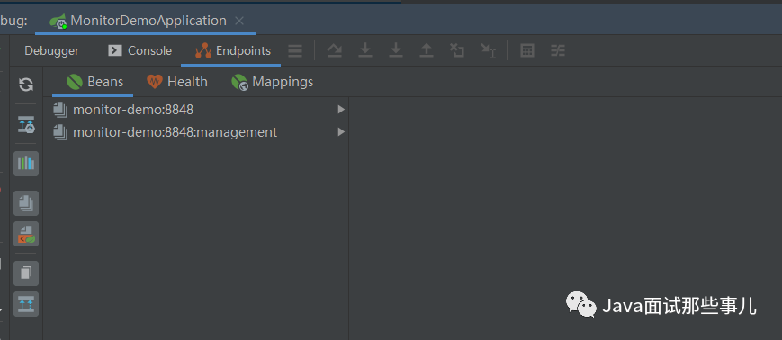
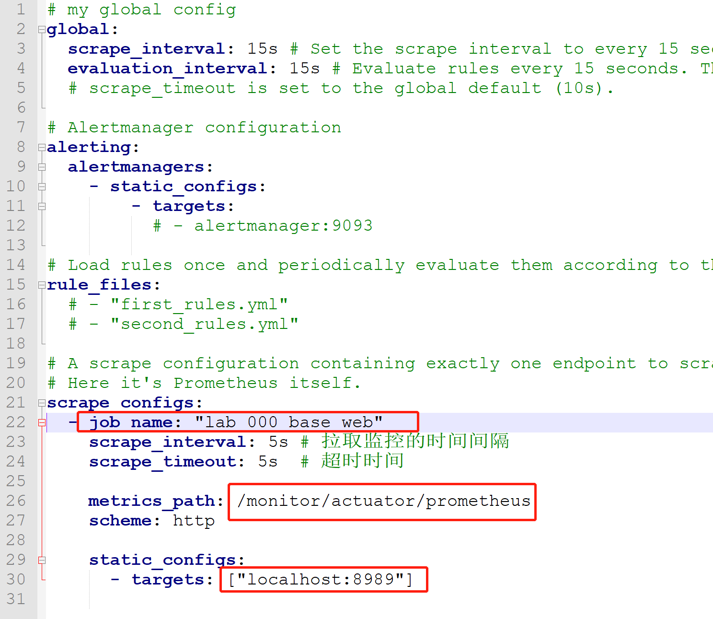
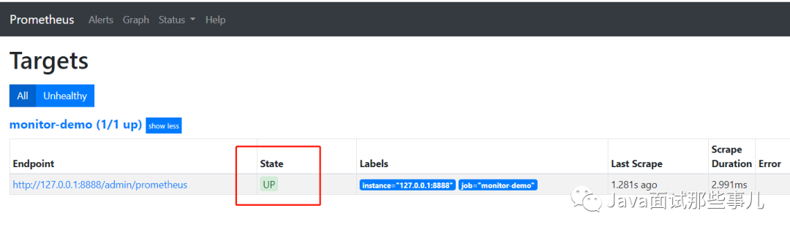
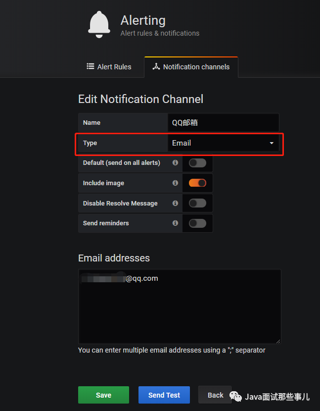
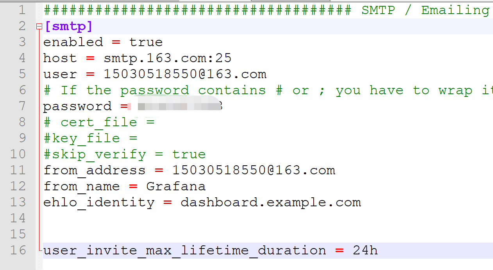

# 7.监控&诊断

代码案例：[https://gitee.com/luckSnow/spring-boot-example/tree/master/lab_101_base_mointor](https://gitee.com/luckSnow/spring-boot-example/tree/master/lab_101_base_mointor)

## 1.监控

在该监控系统中，想要做到主机的CPU、内存、磁盘、网络、线程、JVM内存、JVM GC 等维度的监控，JVM方面的监控还好说，直接用JMX做就行了，
关键是主机信息不好做监控，JDK没有直接的方案获取系统主机信息。在刚开始想到了以下几种方式获取主机维度的信息。

常用的监控方案：
1. 命令行。
2. sigar。嵌入式监控。
3. oshi。嵌入式监控。
4. Arthas。不是监控，是jvm的诊断工具
5. CAT。监控平台
6. prometheus。嵌入式监控。

## 2.命令行

刚开始想的是用最常用的命令行获取主机维度的信息，具体做法是针对不同的系统，写不同的命令。比如说Linux系统，使用TOP命令就能获取到CPU、内存等方面的信息。

```shell
top -b -n 1
```

执行该TOP命令就能获取到CPU、内存等维度的信息

```shell
Tasks: 515 total, 1 running, 511 sleeping, 3 stopped, 0 zombie
Cpu(s): 14.5%us, 5.3%sy, 0.0%ni, 77.0%id, 0.8%wa, 0.0%hi, 2.4%si, 0.0%st
Mem: 65779104k total, 62037048k used, 3742056k free, 425804k buffers
Swap: 0k total, 0k used, 0k free, 21948492k cached
```

## 3.sigar

这种方式虽然好，但是需要针对不同系统做兼容。为了将懒字发挥到极致于是我就开始寻找现有的开源组件。然后找到了一个sigar的东西，貌似这个在业界内应用还挺广的。
Sigar（System Information Gatherer And Reporter），是一个开源的工具，提供了跨平台的系统信息收集的API，核心由C语言实现的。

教程：[http://www.jackieathome.net/archives/500.html](http://www.jackieathome.net/archives/500.html)

官网：[https://sourceforge.net/projects/sigar/](https://sourceforge.net/projects/sigar/)

博客：

> [https://my.oschina.net/u/3774949/blog/3064706](https://my.oschina.net/u/3774949/blog/3064706)
>
> [https://blog.csdn.net/wudiazu/article/details/73829324](https://blog.csdn.net/wudiazu/article/details/73829324)
>
> [https://www.cnblogs.com/luoruiyuan/p/5603771.html](https://www.cnblogs.com/luoruiyuan/p/5603771.html)

sigar的api用起来也挺方便的，简单且使用人数多。

```java
// CPU数量（单位：个）
int cpuLength = sigar.getCpuInfoList().length;

// CPU的总量（单位：HZ）及CPU的相关信息
CpuInfo infos[] = sigar.getCpuInfoList();

for (int i = 0; i < infos.length; i++) {
    //不管是单块CPU还是多CPU都适用
    CpuInfo info = infos[i];
    print("mhz=" + info.getMhz());// CPU的总量MHz
    print("vendor=" + info.getVendor());// 获得CPU的卖主，如：Intel
    print("model=" + info.getModel());// 获得CPU的类别，如：Celeron
    print("cache size=" + info.getCacheSize());// 缓冲存储器数量
}
```

但是，sigar需要根据不同的系统下载不同的库文件，侵入性较高。

## 4.oshi

OSHI.是一个基于JNA的免费的本地操作系统和Java的硬件信息库。它不需要安装任何额外的本机库，旨在提供跨平台的实现来检索系统信息，
如操作系统版本、进程、内存和CPU使用情况、磁盘和分区、设备、传感器等。

教程：[https://blog.csdn.net/only3c/article/details/90475327](https://blog.csdn.net/only3c/article/details/90475327)

首先，引入jar包
```xml
<dependency>
    <groupId>com.github.oshi</groupId>
    <artifactId>oshi-core</artifactId>
    <version>${oshi.version}</version>
</dependency>
```

```java
// 获取主机信息
SystemInfo systemInfo = new SystemInfo();

// 获取操作系统信息
OperatingSystem operatingSystem = systemInfo.getOperatingSystem();

operatingSystem.getNetworkParams().getHostName();

operatingSystem.getFamily();

operatingSystem.getVersion().getVersion();

operatingSystem.getVersion().getBuildNumber();

operatingSystem.getBitness();

operatingSystem.getProcessCount();

operatingSystem.getThreadCount();
```

就是这么简单，不需要不同系统引入不同的库文件，也不用自己做系统兼容。oshi自己做了兼容，目前大概兼容些这些系统：
Linux, Windows, Solaris, AIX, HP-UX, FreeBSD and Mac OSX。

以上几种方式，大概可以做个这样的总结：
- 命令行：灵活度高，兼容性强，但是如果要兼容多个平台的话，自己做还是有些麻烦。
- sigar：社区活跃度高，参考文档全面，麻烦在于需要不同平台引入不同的库文件。
- oshi：拿来主义，使用方便，缺点在于文档少。不过个人认为看看github上的文档就够了，使用过程也没有什么坑。
综上，因为我个人在开发的时候选择的是oshi。

## 5.Arthas

Arthas（阿尔萨斯）是阿里巴巴开源的 Java 诊断工具，深受开发者喜爱。

当你遇到以下类似问题而束手无策时，Arthas 可以帮助你解决：
1. 这个类从哪个 jar 包加载的？为什么会报各种类相关的 Exception？
2. 我改的代码为什么没有执行到？难道是我没 commit？分支搞错了？
3. 遇到问题无法在线上 debug，难道只能通过加日志再重新发布吗？
4. 线上遇到某个用户的数据处理有问题，但线上同样无法 debug，线下无法重现！
5. 是否有一个全局视角来查看系统的运行状况？
6. 有什么办法可以监控到JVM的实时运行状态？

Arthas 采用命令行交互模式，同时提供丰富的Tab自动补全功能，进一步方便进行问题的定位和诊断。

下载：推荐下载完整版，不要使用敏捷版（存在权限和网络的问题）

- 官方文档： [https://arthas.aliyun.com/](https://arthas.aliyun.com/)
- 源码: [https://github.com/alibaba/arthas](https://github.com/alibaba/arthas)
- [官网的优秀使用案例](https://github.com/alibaba/arthas/issues?q=label%3Auser-case)
- Arthas排查接口超时问题：https://mp.weixin.qq.com/s/V5xNZCtOvrUviT7ISRgLfQ

排查问题常用命令：
```shell
1. stack。很多时候我们都知道一个方法被执行，但这个方法被执行的路径非常多，或者你根本就不知道这个方法是从那里被执行了，此时你需要的是 stack 命令。
比如：stack org.springframework.web.servlet.DispatcherServlet * 

2. trace。对应的方法调用路径，渲染和统计整个调用链路上的所有性能开销和追踪调用链路
比如：trace org.apache.coyote.http11.Http11Processor service  

3. 火焰图
  开启采样【默认对CPU采集】：  profiler start
  参看所有的支持的事件：       profiler list
  查看当前的采样数量          profiler getSamples
  查看采样运行时间            profiler status
  停止并生成火焰图            profiler stop
```


**很多时候，我们本地使用idea和eclipse启动项目的方式与生成环境是不一样的，所有会出现本地没事，上线出事的问题。所有必须使用Arthas才能排查出真实的问题**

## 6.CAT

https://github.com/dianping/cat

http://www.dengshenyu.com/后端技术/2016/09/05/cat.html

CAT 是基于 Java 开发的实时应用监控平台，为美团点评提供了全面的实时监控告警服务。

CAT 作为服务端项目基础组件，提供了 Java, C/C++, Node.js, Python, Go 等多语言客户端，已经在美团点评的基础架构中间件框架
（MVC框架，RPC框架，数据库框架，缓存框架等，消息队列，配置系统等）深度集成，为美团点评各业务线提供系统丰富的性能指标、健康状况、实时告警等。
CAT 很大的优势是它是一个实时系统，CAT 大部分系统是分钟级统计，但是从数据生成到服务端处理结束是秒级别，秒级定义是48分钟40秒，
基本上看到48分钟38秒数据，整体报表的统计粒度是分钟级；第二个优势，监控数据是全量统计，客户端预计算；链路数据是采样计算。

Cat 产品价值
- 减少故障发现时间
- 降低故障定位成本
- 辅助应用程序优化

Cat 优势
- 实时处理：信息的价值会随时间锐减，尤其是事故处理过程中
- 全量数据：全量采集指标数据，便于深度分析故障案例
- 高可用：故障的还原与问题定位，需要高可用监控来支撑
- 故障容忍：故障不影响业务正常运转、对业务透明
- 高吞吐：海量监控数据的收集，需要高吞吐能力做保证
- 可扩展：支持分布式、跨 IDC 部署，横向扩展的监控系统

## 7. prometheus

- prometheus官方网址：[https://prometheus.io/](https://prometheus.io/)
- prometheus第三方中文介绍：[https://github.com/1046102779/prometheus](https://github.com/1046102779/prometheus)
- prometheus源码网址：[https://github.com/prometheus/prometheus](https://github.com/prometheus/prometheus)
- MySQL、Redis监控：[https://www.cnblogs.com/shhnwangjian/p/6878199.html](https://www.cnblogs.com/shhnwangjian/p/6878199.html)
- Java进程监控：[http://www.cnblogs.com/smallSevens/p/7905596.html](http://www.cnblogs.com/smallSevens/p/7905596.html)
- 用Prometheus+Grafana监控Springboot应用：[https://www.cnblogs.com/larrydpk/p/12563497.html](https://www.cnblogs.com/larrydpk/p/12563497.html)
- SpringBoot使用prometheus监控：[https://blog.csdn.net/qq_33257527/article/details/88294016](https://blog.csdn.net/qq_33257527/article/details/88294016)
- grafana官网： [https://grafana.com/](https://grafana.com/)
- [开源监控系统 Prometheus 最佳实践](https://mp.weixin.qq.com/s/SzWUe4GNlkauLa4gGGQUng)

学习博客
- [Prometheus监控告警——基础篇](https://code2life.top/2020/02/28/0048-prometheus-in-action-start/)
- [Prometheus监控告警——实战篇](https://code2life.top/2020/02/27/0049-prometheus-in-action-usage/)
- [Prometheus监控告警——原理篇](https://code2life.top/2020/02/26/0050-prometheus-in-action-impl/)
- [Prometheus监控告警——总结与思考](https://code2life.top/2020/02/25/0051-prometheus-in-action-thinking/)

### 7.1.介绍

SpringBoot的应用监控方案比较多，SpringBoot+Prometheus+Grafana是目前比较常用的方案之一

比较适合中小型团队和项目使用


### 7.2.【案例】spring boot项目

以下案例以spring boot 2.1为例子

#### 7.2.1.依赖
```xml
<!-- 普罗米修斯监控 -->
<!-- springboot内置收集系统数据功能包 -->
<dependency>
    <groupId>org.springframework.boot</groupId>
    <artifactId>spring-boot-starter-actuator</artifactId>
</dependency>
<!-- prometheus收集数据功能包 -->
<dependency>
    <groupId>io.micrometer</groupId>
    <artifactId>micrometer-registry-prometheus</artifactId>
</dependency>
```

#### 7.2.2.配置
```properties
management.metrics.export.prometheus.enabled=true
management.metrics.export.prometheus.descriptions=true
management.endpoints.web.exposure.include=*
#Prometheus 中的application name
management.metrics.tags.application=${spring.application.name}
```

actuator暴露接口使用的端口，为了和api接口使用的端口进行分离，就是单独启动一个服务用于监控
[http://localhost:8989/monitor/actuator/prometheus](http://localhost:8989/monitor/actuator/prometheus)
不配置的话， http://localhost:8080/actuator/prometheus

```properties
management.server.port=8989
management.server.servlet.context-path=/monitor
```

#### 7.2.3.启动项目

启动项目后，可以在IDEA中看到有很多Endpoints。需要较高的版本




#### 7.2.4.访问监控路径

[http://localhost:8989/monitor/actuator/prometheus](http://localhost:8989/monitor/actuator/prometheus)


### 7.3.Prometheus

#### 7.3.1.安装

下载地址点击https://prometheus.io/download，下载解压包，解压即可使用

#### 7.3.2.配置prometheus.yml

Job_name就是我们单个服务的监控路径。我们可以配置域名，这样就可以监控到后面多个实例了




#### 7.3.3.启动

prometheus.exe --config.file=prometheus.yml

#### 7.3.4.访问

[http://localhost:9090/targets](http://localhost:9090/targets)



### 7.4.Grafana

#### 7.4.1.安装

[https://grafana.com/grafana/download](https://grafana.com/grafana/download)

[上手开源数据可视化工具 Grafana](https://mp.weixin.qq.com/s/e2zIX5ddZOjMliqRLJI__g)

下载解压包，解压即可使用

#### 7.4.2.启动

解压后运行bin目录下的grafana-server.exe启动

#### 7.4.3.访问

游览器访问http://localhost:3000即可看到登录页面，默认账号密码是admin/admin。

#### 7.4.4.配置界面

可以选择导入现有的模板:

grafana模板： [https://grafana.com/grafana/dashboards/](https://grafana.com/grafana/dashboards/)

不错的springboot模板：[https://grafana.com/grafana/dashboards/10280](https://grafana.com/grafana/dashboards/10280)

不错的jvm模板：[https://grafana.com/grafana/dashboards/4701](https://grafana.com/grafana/dashboards/4701)

#### 7.4.5.报警监控

在实际项目中当监控的某的个指标超过阈值（比如CPU使用率过高），希望监控系统自动通过短信、钉钉和邮件等方式报警及时通知运维人员，Grafana就支持该功能。

##### 7.4.5.1.添加通知通道

点击[Alerting]——>[Notification channels]添加通知通道




##### 7.4.5.2.邮箱配置

Grafana默认使用conf目录下defaults.ini作为配置文件运行，根据官方的建议我们不要更改defaults.ini而是在同级目录下新建一个配置文件custom.ini。




##### 7.4.5.3.重启

然后需要重启Grafana，命令grafana-server.exe -config=E:\\file\\grafana-6.3.3\\conf\\custom.ini

##### 7.4.5.4.为指标添加alert


- Evaluate every：表示检测评率，这里为了测试效果，改为1秒
- For：如果警报规则配置了For，并且查询违反了配置的阈值，那么它将首先从OK变为Pending。从OK到Pending
  Grafana不会发送任何通知。一旦警报规则的触发时间超过持续时间，它将更改为Alerting并发送警报通知。
- Conditions：when 表示什么时间，of 表示条件，is above 表示触发值
  同时，设置了is above后会有一条红线。
- If no data or all values are
  null：如果没有数据或所有值都为空，这里选择触发报警
- If execution error or timeout：如果执行错误或超时，这里选择触发报警
  注意：下一次触发，比如10秒后，它不会再次触发，防止报警风暴产生！

##### 7.4.5.5.测试
在Notification channels 界面可以测试发送邮件

### 7.5.普通Java项目

```text
1.引入依赖
<!-- prometheus -->
<dependency>
	<groupId>io.prometheus</groupId>
	<artifactId>simpleclient</artifactId>
	<version>0.3.0</version>
</dependency>
<dependency>
	<groupId>io.prometheus</groupId>
	<artifactId>simpleclient_hotspot</artifactId>
	<version>0.3.0</version>
</dependency>
<dependency>
	<groupId>io.prometheus</groupId>
	<artifactId>simpleclient_servlet</artifactId>
	<version>0.3.0</version>
</dependency>

2.配置bean
import io.prometheus.client.exporter.MetricsServlet;
import io.prometheus.client.hotspot.DefaultExports;
import org.springframework.boot.web.servlet.ServletRegistrationBean;
import org.springframework.context.annotation.Bean;
import org.springframework.context.annotation.Configuration;


@Configuration
public class AppConfig {
  @Bean
  public ServletRegistrationBean servletRegistrationBean(){
  DefaultExports.initialize();
    return new ServletRegistrationBean(new MetricsServlet(), "/metrics");  //第二个参数可以自定义，但是不可省略
  }
}

3.自定义监控指标
  name方法定义指标名
  help方法定义指标描述

import io.prometheus.client.Counter;
import io.prometheus.client.Gauge;

//Counter
static final Counter counter = Counter.build()
			.name("my_counter_total")
			.help("A counter used to describe the debt")
			.register();
counter.inc();


//Gauge
static final Gauge gauge = Gauge.build()
			.name("my_gauge")
			.help("A gauge to describe the rest of the money")
			.register();
gauge.inc();
gauge.dec();

4.prometheus.yml

metrics_path的值对应第二步中的”/prometheus”参数，默认为”/metrics”
targets对应需要被监控的项目的地址

- job_name: 'MyMetrics'
  metrics_path: '/metrics' //此行也可省略
  static_configs:
	- targets: 
	  - 'localhost:8080'
```

### 7.6.公司级案例

查看代码目录中的：《有利网Prometheus监控方案》

## 8.jvm-sandbox

alibaba开源的JVM沙箱容器，一种JVM的非侵入式运行期AOP解决方案。
- 开源地址：[https://github.com/alibaba/jvm-sandbox](https://github.com/alibaba/jvm-sandbox)
- [浅谈阿里开源JVM Sandbox（内含代码实战）](https://mp.weixin.qq.com/s/wtDVYwgKpSHw469nb4NeDw)

举几个典型的JVM-Sandbox应用场景：
- 流量回放：如何录制线上应用每次接口请求的入参和出参？改动应用代码固然可以，但成本太大，通过JVM-Sandbox，可以直接在不修改代码的情况下，直接抓取接口的出入参。
- 安全漏洞热修复：假设某个三方包（例如出名的fastjson）又出现了漏洞，集团内那么多应用，一个个发布新版本修复，漏洞已经造成了大量破坏。通过JVM-Sandbox，直接修改替换有漏洞的代码，及时止损。
- 接口故障模拟：想要模拟某个接口超时5s后返回false的情况，JVM-Sandbox很轻松就能实现。
- 故障定位：像Arthas类似的功能。
- 接口限流：动态对指定的接口做限流。
- 日志打印：

## 9.Zabbix

## 10.ELK

## 11.Sentry

Sentry 是一个实时事件日志记录和聚合平台。（官方说的是错误监控 Error Monitor）它专门用于监视错误和提取执行适当的事后操作所需的所有信息，而无需使用标准用户反馈循环的任何麻烦。

目前使用的主要场景为：前端性能检测、前端异常检测、前端分布式跟踪

- [Sentry的安装、配置、使用教程(Sentry日志手机系统)](https://www.jb51.net/article/256519.htm)
- [Sentry Web 前端监控 - 最佳实践(官方教程)](https://blog.csdn.net/o__cc/article/details/120300566)
- [Sentry 监控 - 全栈开发人员的分布式跟踪 101 系列教程(第一部分)](https://juejin.cn/post/7015610151675625485#heading-8)


Sentry 教程：
- [1 分钟快速使用 Docker 上手最新版 Sentry-CLI - 创建版本](https://mp.weixin.qq.com/s/7pTJbwkUltqMndg3IIHBfQ)
- [快速使用 Docker 上手 Sentry-CLI - 30 秒上手 Source Map](https://mp.weixin.qq.com/s/zUbsfMTtajGrhJm6hfaHJw)
- [Sentry For React 完整接入详解](https://mp.weixin.qq.com/s/FFpg1t0-3K8casLMNla15g)
- [Sentry For Vue 完整接入详解](https://mp.weixin.qq.com/s/_ubxtWBEyzfPtc20TSJp1w)
- [Sentry-CLI 使用详解](https://mp.weixin.qq.com/s/IRMBvcfLNwq5fCng7IA16w)
- [Sentry Web 性能监控 - Web Vitals](https://mp.weixin.qq.com/s/QZQ8-48MD3zgGmSrr_oWwQ)
- [Sentry Web 性能监控 - Metrics](https://mp.weixin.qq.com/s/XTpRk5Y5fAzhBg4FhidLWQ)
- [Sentry Web 性能监控 - Trends](https://mp.weixin.qq.com/s/_CJduJFnUiCnIEkdEwSdDA)
- [Sentry Web 前端监控 - 最佳实践(官方教程)](https://mp.weixin.qq.com/s/c_ANVMoRKnVS9Fq7Id6Hsg)
- [Sentry 后端监控 - 最佳实践(官方教程)](https://mp.weixin.qq.com/s/mdexnNPRwy8BPD9HYY4DpQ)
- [Sentry 监控 - Discover 大数据查询分析引擎](https://mp.weixin.qq.com/s/Yol6ASdQOOLcGFabIqKZtA)
- [Sentry 监控 - Dashboards 数据可视化大屏](https://mp.weixin.qq.com/s/ms5bCB0KSI6N2Ck5_QkBSA)
- [Sentry 监控 - Environments 区分不同部署环境的事件数据](https://mp.weixin.qq.com/s/BVpDsIhir68S0PI2UE9-fQ)
- [Sentry 监控 - Security Policy 安全策略报告](https://mp.weixin.qq.com/s/gykn0Kwgmj93TvzmPjsxZQ)
- [Sentry 监控 - Search 搜索查询实战](https://mp.weixin.qq.com/s/JtxTAyYzdLVkxmUe-gukRQ)
- [Sentry 监控 - Alerts 告警](https://mp.weixin.qq.com/s/8F-inVbQaxdQTlaMHinJKw)
- [Sentry 监控 - Distributed Tracing 分布式跟踪](https://mp.weixin.qq.com/s/gXC0nnJnp6R5V18TwCk2qw)

## 12.MyPerf4J

一个针对高并发、低延迟应用设计的高性能 Java 性能监控和统计工具。
可将数据输出到磁盘或者InfluxDB中，并结合grafana进行展示。

- [入门教程](https://j3q80mf3ig.feishu.cn/docx/U5RNdo5K3oGE5axwHNncFU4jnqb)
- [MyPerf4J一个高性能、无侵入的Java性能监控和统计工具](http://xiaoyuge.work/myperf4j/index.html)
- 源码[https://github.com/LinShunKang/MyPerf4J](https://github.com/LinShunKang/MyPerf4J)


## 13.TProfiler
TProfiler是一个可以在生产环境长期使用的性能分析工具，阿里巴巴开源的，已经很久不更新了。
源码[https://github.com/alibaba/TProfiler](https://github.com/alibaba/TProfiler)