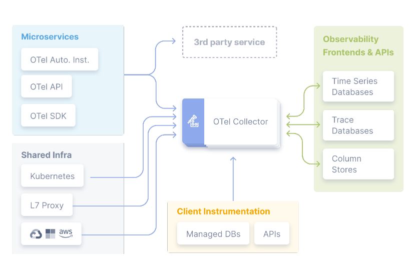
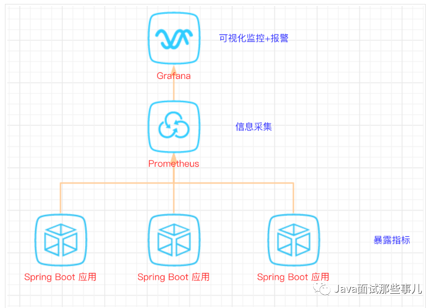
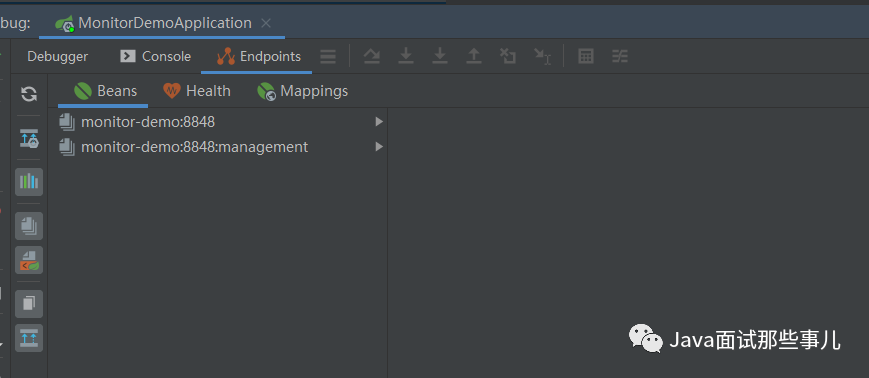
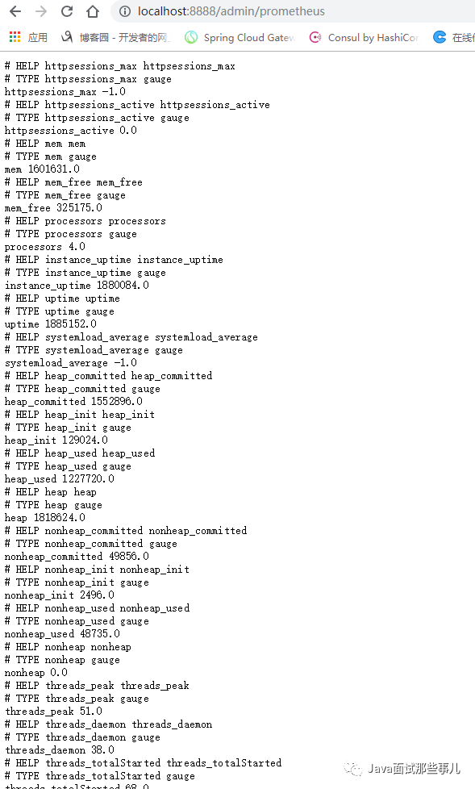
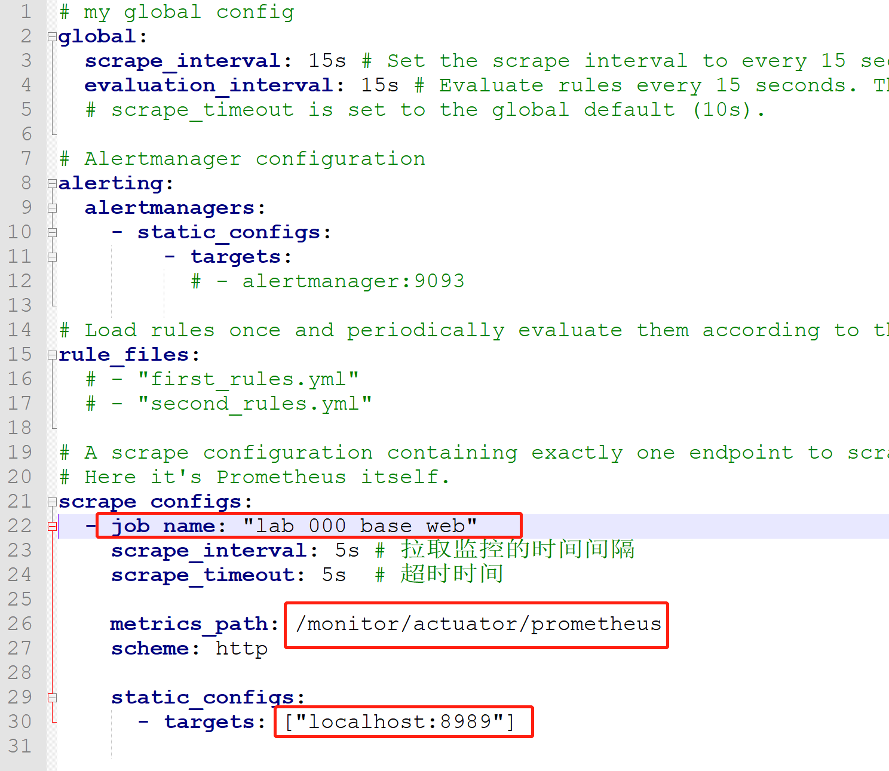
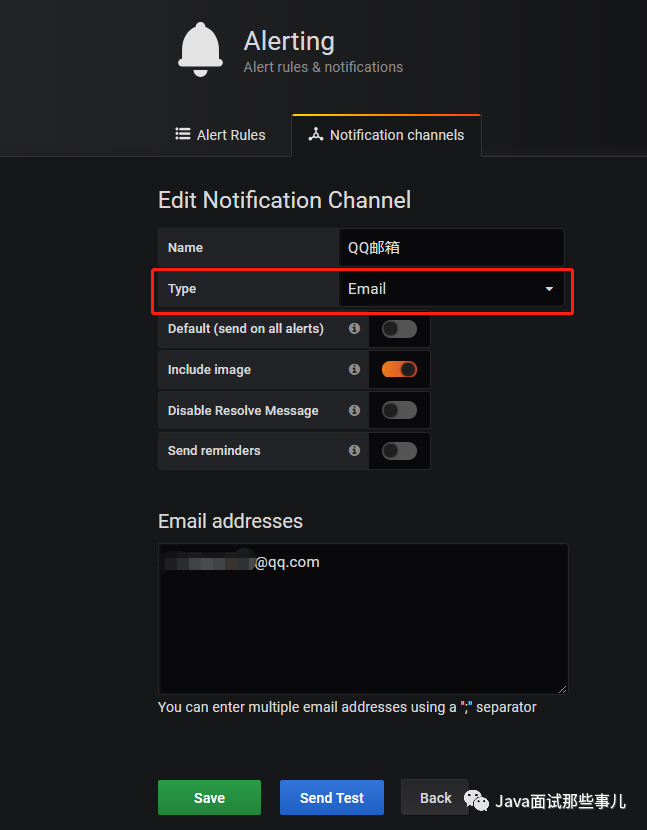
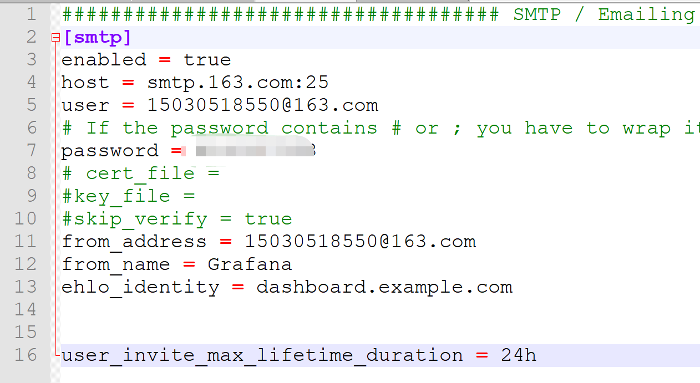
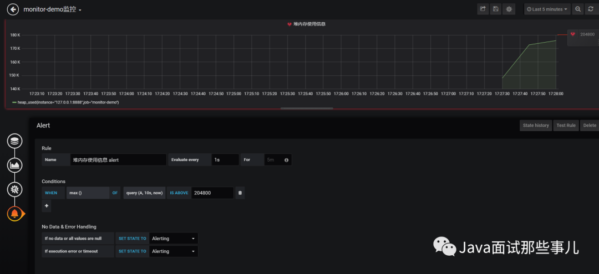
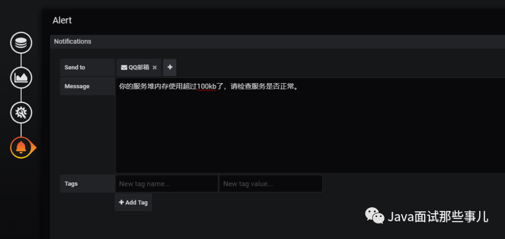

# 7.监控

## 1.概述

### 1.1.监控

监控中最重要的是运维可视化，其中分布式链路追踪（Tracing） 、指标（Metrics）、应用日志（Logs）是最重要的。

- logs：日志分析存储系统，例如：ELK
- metrics：开源的监控系统，例如：Prometheus
- traces：分布式链路追踪系统，例如：Zipkin/Jaeger

没有OpenTelemetry之前这三种监控都是单独部署在应用程序上。

### 1.2.分类
1. 网络监控：
   - 定义：对数据中心内网络流量的监控，包括网络拓扑发现及网络设备的监控。
   - 内容：涉及网络监测、网络实时流量监控（如网络延迟、访问量、成功率等）和历史数据统计、汇总及历史数据分析等功能。此外，还包括对网络攻击的检查，如DDoS攻击等。
2. 存储监控：
   - 定义：对存储系统的监控，包括云存储和分布式存储。
   - 内容：在存储性能监控方面，通常监控块的读写速率、IOPS、读写延迟、磁盘用量等；在存储系统监控方面，不同的存储系统有不同的指标；在存储设备监控方面，则涉及对存储设备信息（如磁盘、SSD、网卡等）的监控。
3. 服务器监控：
   - 定义：对服务器硬件、操作系统及虚拟化环境的监控。
   - 内容：包括物理服务器主机监控、虚拟机监控和容器监控，需要兼容多种环境和操作系统。监控指标通常包括CPU使用量、内存使用量、网络I/O、磁盘I/O等。
4. 应用监控（APM）：
   - 定义：针对应用程序的监控，包括应用程序的运行状态、性能、日志及调用链跟踪等。
   - 内容：APM不仅监控应用程序的外部行为，还深入到应用程序内部，监控组件之间的调用关系和方法执行耗时，为性能调优提供数据支持。

## 2.运维类监控

将网络、存储、服务器等可以视为运维视角的监控单位。

以上几种方式，大概可以做个这样的总结：
- 命令行：灵活度高，兼容性强，但是如果要兼容多个平台的话，自己做还是有些麻烦。
- sigar：社区活跃度高，参考文档全面，麻烦在于需要不同平台引入不同的库文件。
- oshi：使用方便，已经做好了跨平台的兼容性，缺点在于文档少。
- Zabbix：运维视角的监控平台，采用agent的方式采集指标进行监控、记录、报警。

### 2.1.命令行
最直接的方式是登录服务器执行命令查询相关信息，比如说Linux系统，使用TOP命令就能获取到CPU、内存等方面的信息。

### 2.2.sigar

这种方式虽然好，但是需要针对不同系统做兼容。为了将懒字发挥到极致于是我就开始寻找现有的开源组件。然后找到了一个sigar的东西，貌似这个在业界内应用还挺广的。
Sigar（System Information Gatherer And Reporter），是一个开源的工具，提供了跨平台的系统信息收集的API，核心由C语言实现的。

- 教程：[http://www.jackieathome.net/archives/500.html](http://www.jackieathome.net/archives/500.html)
- 官网：[https://sourceforge.net/projects/sigar/](https://sourceforge.net/projects/sigar/)

博客：
- [https://my.oschina.net/u/3774949/blog/3064706](https://my.oschina.net/u/3774949/blog/3064706)
- [https://blog.csdn.net/wudiazu/article/details/73829324](https://blog.csdn.net/wudiazu/article/details/73829324)
- [https://www.cnblogs.com/luoruiyuan/p/5603771.html](https://www.cnblogs.com/luoruiyuan/p/5603771.html)

sigar的api用起来也挺方便的，简单且使用人数多。

```java
// CPU数量（单位：个）
int cpuLength = sigar.getCpuInfoList().length;

// CPU的总量（单位：HZ）及CPU的相关信息
CpuInfo infos[] = sigar.getCpuInfoList();

for (int i = 0; i < infos.length; i++) {
    //不管是单块CPU还是多CPU都适用
    CpuInfo info = infos[i];
    print("mhz=" + info.getMhz());// CPU的总量MHz
    print("vendor=" + info.getVendor());// 获得CPU的卖主，如：Intel
    print("model=" + info.getModel());// 获得CPU的类别，如：Celeron
    print("cache size=" + info.getCacheSize());// 缓冲存储器数量
}
```

但是，sigar需要根据不同的系统下载不同的库文件，侵入性较高。

### 2.3.oshi

OSHI.是一个基于JNA的免费的本地操作系统和Java的硬件信息库。它不需要安装任何额外的本机库，旨在提供跨平台的实现来检索系统信息，
如操作系统版本、进程、内存和CPU使用情况、磁盘和分区、设备、传感器等。

教程：[https://blog.csdn.net/only3c/article/details/90475327](https://blog.csdn.net/only3c/article/details/90475327)

首先，引入jar包
```xml
<dependency>
    <groupId>com.github.oshi</groupId>
    <artifactId>oshi-core</artifactId>
    <version>${oshi.version}</version>
</dependency>
```

```java
// 获取主机信息
SystemInfo systemInfo = new SystemInfo();

// 获取操作系统信息
OperatingSystem operatingSystem = systemInfo.getOperatingSystem();
operatingSystem.getNetworkParams().getHostName();
operatingSystem.getFamily();
operatingSystem.getVersion().getVersion();
operatingSystem.getVersion().getBuildNumber();
operatingSystem.getBitness();
operatingSystem.getProcessCount();
operatingSystem.getThreadCount();
```

就是这么简单，不需要不同系统引入不同的库文件，也不用自己做系统兼容。oshi自己做了兼容，目前大概兼容些这些系统：
Linux, Windows, Solaris, AIX, HP-UX, FreeBSD and Mac OSX。

### 2.4.Zabbix
Zabbix 是一个广泛使用的开源监控解决方案，它能够帮助运维人员实时监控IT基础设施的状态，包括网络设备、服务器、应用程序等。
- 官网[https://www.zabbix.com/](https://www.zabbix.com/)
- [开源监控系统Zabbix简介](https://cloud.tencent.com/developer/article/1441939)

zabbix是CS架构，通过埋点的方式实现指标的获取，所以需要针对不同类型的监控，提供不同的客户端。

并且zabbix支持以api的方式进行操作，使得zabbix更加灵活
- [官方api文档](https://www.zabbix.com/documentation/3.4/zh/manual/api)

教程：
- [Zabbix之一---企业级监控服务Zabbix部署与配置](https://www.cnblogs.com/struggle-1216/p/12218992.html)
- [Zabbix之二----Zabbix监控Tomcat服务](https://www.cnblogs.com/struggle-1216/p/12307115.html)
- [Zabbix之三---Zabbix监控Nginx服务及nginx的80端口状态](https://www.cnblogs.com/struggle-1216/p/12347283.html)
- [Zabbix之四---Zabbix主被动模式监控、主被动模式proxy使用以及主动模式tomcat监控](https://www.cnblogs.com/struggle-1216/p/12354813.html)
- [Zabbix之五---Zabbix监控TCP连接数](https://www.cnblogs.com/struggle-1216/p/12355099.html)
- [Zabbix之六----Zabbix监控memcached、redis、nginx及邮件分级报警通知](https://www.cnblogs.com/struggle-1216/p/12359472.html)
- [Zabbix之七---Zabbix实现Nginx故障自治愈](https://www.cnblogs.com/struggle-1216/p/12360183.html)
- [Zabbix之八----Zabbix监控SNMP网络设备](https://www.cnblogs.com/struggle-1216/p/12361210.html)
- [Zabbix之九---Zabbix监控mysq数据库](https://www.cnblogs.com/struggle-1216/p/12364012.html)
- [Zabbix之十----批量安装zabbix-agent及web监控](https://www.cnblogs.com/struggle-1216/p/12365631.html)
- [Zabbix之十一----Zabbbix的API使用](https://www.cnblogs.com/struggle-1216/p/12369986.html)
- [Zabbbix之十二------Zabbix实现微信报警通知及创建聚合图形](https://www.cnblogs.com/struggle-1216/p/12372501.html)

## 3.APM

APM： Application Performance Monitor 是应用性能监测软件。

APM针对应用则提供全面的性能监控和管理功能，是一种完整的解决方案。包括应用的运行状态、性能、日志及调用链跟踪等。

- 大众点评的 CAT： APM 解决方案。
- Spring Cloud Sleuth + Zipkin
- Apache Skywalking
- Pinpoint
- 阿里巴巴的鹰眼
- 美团的 Mtrace
- 京东的 hydra
- 新浪的 watchman

### 3.1.Apache Skywalking

- [SkyWalking —— 分布式应用监控与链路追踪](https://www.cnblogs.com/cjsblog/p/14075486.html)
- [Skywalking介绍](https://www.jianshu.com/p/ffa7ddcda4ab)
- [skywalking教程](https://blog.csdn.net/qq_36268103/article/details/119750035)
- 教程：https://blog.csdn.net/wb4927598/category_11244671.html
- 官网：[https://skywalking.apache.org/](https://skywalking.apache.org/)

Skywalking是一个国产的开源框架，2015年有吴晟个人开源，2017年加入Apache孵化器，国人开源的产品，主要开发人员来自于华为，
2019年4月17日Apache董事会批准SkyWalking成为顶级项目，支持Java、.Net、NodeJs等探针，数据存储支持Mysql、Elasticsearch等，
跟Pinpoint一样采用字节码注入的方式实现代码的无侵入，探针采集数据粒度粗，但性能表现优秀，且对云原生支持，目前增长势头强劲，社区活跃。

Skywalking是分布式系统的应用程序性能监视工具，专为微服务，云原生架构和基于容器（Docker，K8S,Mesos）架构而设计，
它是一款优秀的APM（Application Performance Management）工具，包括了分布式追踪，性能指标分析和服务依赖分析等。

- 应用：Skywalking默认会在进程中生成traceId,用于链路追踪。同时我们也可以将traceId打印到日志中，方便分析问题。
- 方式：项目中添加apm-toolkit-logback-1.x，并修改logback.xml中的layout为skywalking提供的TraceIdPatternLogbackLayout。

```xml
<?xmlversion="1.0"encoding="UTF-8"?>
<configuration debug="false">
<property name="pattern" value="[%d{yyyy-MM-ddHH:mm:ss.SSS}]%-5level[%thread]%logger%line[%X{traceId}][%tid]-%msg%n"/>
  <appender name="STDOUT" class="ch.qos.logback.core.ConsoleAppender">
    <encoder class="ch.qos.logback.core.encoder.LayoutWrappingEncoder">
      <layout class="org.apache.skywalking.apm.toolkit.log.logback.v1.x.TraceIdPatternLogbackLayout">
        <pattern>${pattern}</pattern>
      </layout>
  </encoder>
</appender>
```

### 3.2.CAT

- 源码[https://github.com/dianping/cat](https://github.com/dianping/cat)
- [深度剖析开源分布式监控CAT](https://tech.meituan.com/2018/11/01/cat-in-depth-java-application-monitoring.html)
- [CAT 3.0 开源发布](https://tech.meituan.com/2018/11/01/cat-pr.html)

CAT 是基于 Java 开发的实时应用监控平台，为美团点评提供了全面的实时监控告警服务。

CAT 作为服务端项目基础组件，提供了 Java, C/C++, Node.js, Python, Go 等多语言客户端，已经在美团点评的基础架构中间件框架
（MVC框架，RPC框架，数据库框架，缓存框架等，消息队列，配置系统等）深度集成，为美团点评各业务线提供系统丰富的性能指标、健康状况、实时告警等。
CAT 很大的优势是它是一个实时系统，CAT 大部分系统是分钟级统计，但是从数据生成到服务端处理结束是秒级别，秒级定义是48分钟40秒，
基本上看到48分钟38秒数据，整体报表的统计粒度是分钟级；第二个优势，监控数据是全量统计，客户端预计算；链路数据是采样计算。

Cat 产品价值
- 减少故障发现时间
- 降低故障定位成本
- 辅助应用程序优化

Cat 优势
- 实时处理：信息的价值会随时间锐减，尤其是事故处理过程中
- 全量数据：全量采集指标数据，便于深度分析故障案例
- 高可用：故障的还原与问题定位，需要高可用监控来支撑
- 故障容忍：故障不影响业务正常运转、对业务透明
- 高吞吐：海量监控数据的收集，需要高吞吐能力做保证
- 可扩展：支持分布式、跨 IDC 部署，横向扩展的监控系统

### 3.3.Sentry

Sentry 是一个实时事件日志记录和聚合平台。（官方说的是错误监控 Error Monitor）它专门用于监视错误和提取执行适当的事后操作所需的所有信息，而无需使用标准用户反馈循环的任何麻烦。

目前使用的主要场景为：前端性能检测、前端异常检测、前端分布式跟踪

- [Sentry的安装、配置、使用教程(Sentry日志手机系统)](https://www.jb51.net/article/256519.htm)
- [Sentry Web 前端监控 - 最佳实践(官方教程)](https://blog.csdn.net/o__cc/article/details/120300566)
- [Sentry 监控 - 全栈开发人员的分布式跟踪 101 系列教程(第一部分)](https://juejin.cn/post/7015610151675625485#heading-8)

Sentry 教程：
- [1 分钟快速使用 Docker 上手最新版 Sentry-CLI - 创建版本](https://mp.weixin.qq.com/s/7pTJbwkUltqMndg3IIHBfQ)
- [快速使用 Docker 上手 Sentry-CLI - 30 秒上手 Source Map](https://mp.weixin.qq.com/s/zUbsfMTtajGrhJm6hfaHJw)
- [Sentry For React 完整接入详解](https://mp.weixin.qq.com/s/FFpg1t0-3K8casLMNla15g)
- [Sentry For Vue 完整接入详解](https://mp.weixin.qq.com/s/_ubxtWBEyzfPtc20TSJp1w)
- [Sentry-CLI 使用详解](https://mp.weixin.qq.com/s/IRMBvcfLNwq5fCng7IA16w)
- [Sentry Web 性能监控 - Web Vitals](https://mp.weixin.qq.com/s/QZQ8-48MD3zgGmSrr_oWwQ)
- [Sentry Web 性能监控 - Metrics](https://mp.weixin.qq.com/s/XTpRk5Y5fAzhBg4FhidLWQ)
- [Sentry Web 性能监控 - Trends](https://mp.weixin.qq.com/s/_CJduJFnUiCnIEkdEwSdDA)
- [Sentry Web 前端监控 - 最佳实践(官方教程)](https://mp.weixin.qq.com/s/c_ANVMoRKnVS9Fq7Id6Hsg)
- [Sentry 后端监控 - 最佳实践(官方教程)](https://mp.weixin.qq.com/s/mdexnNPRwy8BPD9HYY4DpQ)
- [Sentry 监控 - Discover 大数据查询分析引擎](https://mp.weixin.qq.com/s/Yol6ASdQOOLcGFabIqKZtA)
- [Sentry 监控 - Dashboards 数据可视化大屏](https://mp.weixin.qq.com/s/ms5bCB0KSI6N2Ck5_QkBSA)
- [Sentry 监控 - Environments 区分不同部署环境的事件数据](https://mp.weixin.qq.com/s/BVpDsIhir68S0PI2UE9-fQ)
- [Sentry 监控 - Security Policy 安全策略报告](https://mp.weixin.qq.com/s/gykn0Kwgmj93TvzmPjsxZQ)
- [Sentry 监控 - Search 搜索查询实战](https://mp.weixin.qq.com/s/JtxTAyYzdLVkxmUe-gukRQ)
- [Sentry 监控 - Alerts 告警](https://mp.weixin.qq.com/s/8F-inVbQaxdQTlaMHinJKw)
- [Sentry 监控 - Distributed Tracing 分布式跟踪](https://mp.weixin.qq.com/s/gXC0nnJnp6R5V18TwCk2qw)

### 3.4.OpenTelemetry
- OpenTracing。早期被提出的链路追踪协议，目前发展非常成熟。
- OpenTelemetry。是OpenTracing和OpenCensus的合并体，旨在成为可观测性数据的统一集合、处理、导出工具。它提供了自动的、标准化的、端到端的监控和追踪能力。

- 官网[https://opentelemetry.io/](https://opentelemetry.io/)
- java集成：[https://github.com/open-telemetry/opentelemetry-java](https://github.com/open-telemetry/opentelemetry-java)
- golang集成：[https://github.com/open-telemetry/opentelemetry-go](https://github.com/open-telemetry/opentelemetry-go)


- [OpenTelemetry系列 - 第1篇 相关概念](https://luoex.blog.csdn.net/article/details/134369504)
- [OpenTelemetry系列 - 第2篇 Java端接入OpenTelemetry](https://luoex.blog.csdn.net/article/details/134506507)
- [OpenTelemetry系列 - 第3篇 OpenTelemetry Collector](https://luoex.blog.csdn.net/article/details/134510880)
- [OpenTelemetry系列 - 第4篇 OpenTelemetry K8S生态](https://luoex.blog.csdn.net/article/details/134510907)


- [OpenTelemetry部署](https://blog.csdn.net/qq_62368250/article/details/143516314)

#### 3.4.1.接入方式



OpenTelemetry提供三种数据采集方式
1. SDK（软件开发工具包）：允许开发者在应用程序中直接集成遥测功能。通过在代码中使用 OpenTelemetry 提供的 API，开发者可以显式地创建和管理跟踪、指标和日志数据。
 这种方式提供了最大的灵活性和控制，但也需要开发者在应用程序代码中进行集成。但是当前迭代速度较快，经常出现前后不兼容的情况，升级SDK会涉及项目改造。
2. 自动化采集（Auto-instrumentation）：通常采用探针的方式实现的，能够自动捕获常见框架和库的遥测数据。属于无侵入的方式。


#### 3.4.2.Collector收集器

OpenTelemetry Collector 是一个独立的服务，可以接收、处理和转发来自不同源的遥测数据。
Collector 可以部署在应用程序的旁边或作为集中式服务，支持多种协议和格式。通过使用 
Collector，开发者可以将遥测数据从多个应用程序集中管理，并进行处理和转发，提供了更高的可扩展性和灵活性。

#### 3.4.3.Exporter导出器

导出方式：
- OTLP exporter
- Logging exporter
- Logging OTLP JSON exporter
- Jaeger exporter
- Zipkin exporter
- Prometheus exporter


### 3.5.eBPF
eBPF（扩展的伯克利数据包过滤器）作为Linux内核中的一个高效且灵活的虚拟机，允许开发者自定义运行程序，并通过特定接口将这些程序加载到内核空间执行。
这一特性使得eBPF成为了构建各类系统监控解决方案的理想选择之一。

近年来，基于eBPF技术开发的各种开源项目如雨后春笋般涌现出来，其中包括
- pixie（https://github.com/pixie-io/pixie）
- beyla（https://github.com/grafana/beyla）
- opentelemetry-go-instrumentation（https://github.com/open-telemetry/opentelemetry-go-instrumentation）
- deepflow(https://github.com/deepflowio/deepflow)

它们共同致力于利用eBPF的强大能力来实现诸如性能分析(Profiling)、网络流量监测(Network Monitoring)、度量指标收集(Metric Collection)及分布式追踪(Distributed Tracing)等功能。

eBPF可以通过在不同位置的挂载点完成对数据流的抓取，比如tracepoint、kprobe等，也可以使用uprobe针对用户态函数进行hook，
以协议解析为例，随着业务复杂度的提升以及不同使用场景的要求，用户态的协议非常多，有RPC类型的http、https、grpc、dubbo等，
还有中间件的mysql、redis、es、mq、ck等，要通过eBPF抓取的数据完成数据解析并实现指标的统计难度非常大。

以使用eBPF监控Go应用为例，因其独特的并发模型而广泛采用异步处理机制，若想精确地进行跨协程上下文传递或深入到应用程序内部进行细粒度的跟踪，
则通常还需要额外引入SDK来进行辅助支持，完成不同协程之间的上下文传递。

尽管上述项目在功能上存在一定程度的相似性，但由于eBPF自身的一些限制因素，比如eBPF 通常仅限于具有提升权限的 Linux 环境，
同时针对内核的版本有要求，对于某些应用场景尤其是涉及到复杂应用层逻辑追踪时，单独依靠eBPF往往难以达到理想效果。
就性能开销而言，eBPF相对于进程内的Agent稍显落后，因为 uprobe 的触发需要在用户空间和内核之间进行上下文切换，这对于访问量特别大的一些接口难以承受。

### 3.6.instgo

基于golang的编译时插桩方案。 [为Go应用无侵入地添加任意代码](https://mp.weixin.qq.com/s/Eb8Rx6lN9HhyCmg6x9Wo9g)

可以在插入的代码中实现跟Java应用监控完全一样的监控能力，如链路追踪、指标统计、持续剖析、动态配置、代码热点、日志Trace关联等等，
在插件丰富度上我们支持了40+的常见插件，包含了RPC框架、DB、Cache、MQ、Log等，在性能上，5%的消耗即可支持1000 qps，
通过动态开关控制、Agent版本灰度等实现生产的可用性和风险控制能力。

```shell
当前的编译语句：
CGO_ENABLED=0 GOOS=linux GOARCH=amd64 go build main.go 
使用Aliyun Go Agent：
wget "http://arms-apm-cn-hangzhou.oss-cn-hangzhou.aliyuncs.com/instgo/instgo-linux-amd64" -O instgo
chmod +x instgo
CGO_ENABLED=0 
GOOS=linux 
GOARCH=amd64 
./instgo go build main.go
```

## 4.指标

### 4.1.prometheus

- prometheus官方网址：[https://prometheus.io/](https://prometheus.io/)
- prometheus第三方中文介绍：[https://github.com/1046102779/prometheus](https://github.com/1046102779/prometheus)
- prometheus源码网址：[https://github.com/prometheus/prometheus](https://github.com/prometheus/prometheus)
- MySQL、Redis监控：[https://www.cnblogs.com/shhnwangjian/p/6878199.html](https://www.cnblogs.com/shhnwangjian/p/6878199.html)
- Java进程监控：[http://www.cnblogs.com/smallSevens/p/7905596.html](http://www.cnblogs.com/smallSevens/p/7905596.html)
- 用Prometheus+Grafana监控Springboot应用：[https://www.cnblogs.com/larrydpk/p/12563497.html](https://www.cnblogs.com/larrydpk/p/12563497.html)
- SpringBoot使用prometheus监控：[https://blog.csdn.net/qq_33257527/article/details/88294016](https://blog.csdn.net/qq_33257527/article/details/88294016)
- grafana官网： [https://grafana.com/](https://grafana.com/)
- [开源监控系统 Prometheus 最佳实践](https://mp.weixin.qq.com/s/SzWUe4GNlkauLa4gGGQUng)

学习博客
- [Prometheus监控告警——基础篇](https://code2life.top/blog/0048-prometheus-in-action-start/)
- [Prometheus监控告警——实战篇](https://code2life.top/blog/0049-prometheus-in-action-usage/)
- [Prometheus监控告警——原理篇](https://code2life.top/blog6/0050-prometheus-in-action-impl/)
- [Prometheus监控告警——总结与思考](https://code2life.top/blog/0051-prometheus-in-action-thinking/)

#### 4.1.1.介绍

SpringBoot的应用监控方案比较多，SpringBoot+Prometheus+Grafana是目前比较常用的方案之一

比较适合中小型团队和项目使用



#### 4.1.2.【案例】spring boot项目

以下案例以spring boot 2.1为例子

##### 4.1.2.1.依赖
```xml
<!-- 普罗米修斯监控 -->
<!-- springboot内置收集系统数据功能包 -->
<dependency>
    <groupId>org.springframework.boot</groupId>
    <artifactId>spring-boot-starter-actuator</artifactId>
</dependency>
<!-- prometheus收集数据功能包 -->
<dependency>
    <groupId>io.micrometer</groupId>
    <artifactId>micrometer-registry-prometheus</artifactId>
</dependency>
```

##### 4.1.2.2.配置
```properties
management.metrics.export.prometheus.enabled=true
management.metrics.export.prometheus.descriptions=true
management.endpoints.web.exposure.include=*
#Prometheus 中的application name
management.metrics.tags.application=${spring.application.name}
```

actuator暴露接口使用的端口，为了和api接口使用的端口进行分离，就是单独启动一个服务用于监控
[http://localhost:8989/monitor/actuator/prometheus](http://localhost:8989/monitor/actuator/prometheus)
不配置的话， http://localhost:8080/actuator/prometheus

```properties
management.server.port=8989
management.server.servlet.context-path=/monitor
```

##### 4.1.2.3.启动项目

启动项目后，可以在IDEA中看到有很多Endpoints。需要较高的版本




##### 4.1.2.4.访问监控路径

[http://localhost:8989/monitor/actuator/prometheus](http://localhost:8989/monitor/actuator/prometheus)



#### 4.1.3.Prometheus

##### 4.1.3.1.安装

下载地址点击https://prometheus.io/download，下载解压包，解压即可使用

##### 4.1.3.2.配置prometheus.yml

Job_name就是我们单个服务的监控路径。我们可以配置域名，这样就可以监控到后面多个实例了




##### 4.1.3.3.启动

prometheus.exe --config.file=prometheus.yml

##### 4.1.3.4.访问

[http://localhost:9090/targets](http://localhost:9090/targets)


#### 4.1.4.Grafana

##### 4.1.4.1.安装

[https://grafana.com/grafana/download](https://grafana.com/grafana/download)

[上手开源数据可视化工具 Grafana](https://mp.weixin.qq.com/s/e2zIX5ddZOjMliqRLJI__g)

下载解压包，解压即可使用

##### 4.1.4.2.启动

解压后运行bin目录下的grafana-server.exe启动

##### 4.1.4.3.访问

游览器访问http://localhost:3000即可看到登录页面，默认账号密码是admin/admin。

##### 4.1.4.4.配置界面

可以选择导入现有的模板:

grafana模板： [https://grafana.com/grafana/dashboards/](https://grafana.com/grafana/dashboards/)

不错的springboot模板：[https://grafana.com/grafana/dashboards/10280](https://grafana.com/grafana/dashboards/10280)

不错的jvm模板：[https://grafana.com/grafana/dashboards/4701](https://grafana.com/grafana/dashboards/4701)

##### 4.1.4.5.报警监控

在实际项目中当监控的某的个指标超过阈值（比如CPU使用率过高），希望监控系统自动通过短信、钉钉和邮件等方式报警及时通知运维人员，Grafana就支持该功能。

###### 4.1.4.5.1.添加通知通道

点击[Alerting]——>[Notification channels]添加通知通道




###### 4.1.4.5.2.邮箱配置

Grafana默认使用conf目录下defaults.ini作为配置文件运行，根据官方的建议我们不要更改defaults.ini而是在同级目录下新建一个配置文件custom.ini。




###### 4.1.4.5.3.重启

然后需要重启Grafana，命令grafana-server.exe -config=E:\\file\\grafana-6.3.3\\conf\\custom.ini

###### 4.1.4.5.4.为指标添加alert






- Evaluate every：表示检测评率，这里为了测试效果，改为1秒
- For：如果警报规则配置了For，并且查询违反了配置的阈值，那么它将首先从OK变为Pending。从OK到Pending
  Grafana不会发送任何通知。一旦警报规则的触发时间超过持续时间，它将更改为Alerting并发送警报通知。
- Conditions：when 表示什么时间，of 表示条件，is above 表示触发值
  同时，设置了is above后会有一条红线。
- If no data or all values are
  null：如果没有数据或所有值都为空，这里选择触发报警
- If execution error or timeout：如果执行错误或超时，这里选择触发报警
  注意：下一次触发，比如10秒后，它不会再次触发，防止报警风暴产生！

###### 4.1.4.5.5.测试
在Notification channels 界面可以测试发送邮件

#### 4.1.5.普通Java项目

```text
1.引入依赖
<!-- prometheus -->
<dependency>
	<groupId>io.prometheus</groupId>
	<artifactId>simpleclient</artifactId>
	<version>0.3.0</version>
</dependency>
<dependency>
	<groupId>io.prometheus</groupId>
	<artifactId>simpleclient_hotspot</artifactId>
	<version>0.3.0</version>
</dependency>
<dependency>
	<groupId>io.prometheus</groupId>
	<artifactId>simpleclient_servlet</artifactId>
	<version>0.3.0</version>
</dependency>

2.配置bean
import io.prometheus.client.exporter.MetricsServlet;
import io.prometheus.client.hotspot.DefaultExports;
import org.springframework.boot.web.servlet.ServletRegistrationBean;
import org.springframework.context.annotation.Bean;
import org.springframework.context.annotation.Configuration;


@Configuration
public class AppConfig {
  @Bean
  public ServletRegistrationBean servletRegistrationBean(){
  DefaultExports.initialize();
    return new ServletRegistrationBean(new MetricsServlet(), "/metrics");  //第二个参数可以自定义，但是不可省略
  }
}

3.自定义监控指标
  name方法定义指标名
  help方法定义指标描述

import io.prometheus.client.Counter;
import io.prometheus.client.Gauge;

//Counter
static final Counter counter = Counter.build()
			.name("my_counter_total")
			.help("A counter used to describe the debt")
			.register();
counter.inc();


//Gauge
static final Gauge gauge = Gauge.build()
			.name("my_gauge")
			.help("A gauge to describe the rest of the money")
			.register();
gauge.inc();
gauge.dec();

4.prometheus.yml

metrics_path的值对应第二步中的”/prometheus”参数，默认为”/metrics”
targets对应需要被监控的项目的地址

- job_name: 'MyMetrics'
  metrics_path: '/metrics' //此行也可省略
  static_configs:
	- targets: 
	  - 'localhost:8080'
```

#### 4.1.6.公司级案例

查看代码目录中的：《有利网Prometheus监控方案》

### 4.2.MyPerf4J

一个针对高并发、低延迟应用设计的高性能 Java 性能监控和统计工具。
可将数据输出到磁盘或者InfluxDB中，并结合grafana进行展示。

- [入门教程](https://j3q80mf3ig.feishu.cn/docx/U5RNdo5K3oGE5axwHNncFU4jnqb)
- [MyPerf4J一个高性能、无侵入的Java性能监控和统计工具](http://xiaoyuge.work/myperf4j/index.html)
- 源码[https://github.com/LinShunKang/MyPerf4J](https://github.com/LinShunKang/MyPerf4J)

### 4.3.TProfiler
TProfiler是一个可以在生产环境长期使用的性能分析工具，阿里巴巴开源的，已经很久不更新了。
源码[https://github.com/alibaba/TProfiler](https://github.com/alibaba/TProfiler)

## 5.日志

### 5.1.ELK
ElasticSearch+Logstash+Kibana。
现在很多Logstash 被 filebeat替换，ElasticSearch 被clickhouse替换

## 6.链路追踪

#### 6.1.Spring Cloud Sleuth + Zipkin

为了方便查询整个链路的日志信息，可以采用Sleuth去收集日志信息，并且在配合Zipkin去以图形化界面站式，方便定位问题所在。

它目前支持的有：rxjava、feign、quartz、RestTemplate、zuul、hystrix、grpc、kafka、Opentracing、redis、Reator、
circuitbreaker、spring的Scheduled。国内用的比较多的dubbo，sleuth无法对其提供支持

sleuth只是一个全链路生成工具，我们一般将sleuth与zipkin结合使用，sleuth默认会将收集的所有信息发送到zipkin。

[Sleuth源码解析](https://blog.csdn.net/weixin_48872249/article/details/113480953)

[快速入门](https://blog.csdn.net/ya_yongng/article/details/107570277)

[sleuth zinkip 分布式链路追踪](https://mp.weixin.qq.com/s/lRU-waPZP7aYvHuefYgNYA)

##### 6.1.1.集成Sleuth

1.引入依赖

```xml
<!--全链路日志生成器-->
<dependency>
    <groupId>org.springframework.cloud</groupId>
    <artifactId>spring-cloud-starter-sleuth</artifactId>
</dependency>
<!--日志采集器，上传日志-->
<dependency>
    <groupId>org.springframework.cloud</groupId>
    <artifactId>spring-cloud-starter-zipkin</artifactId>
</dependency>
```

2.增加测试代码。我们通过本地方法通过 RestTemplate 调用另一个本地方法 模拟服务间调用。

```java
@Slf4j
@RestController
@RequestMapping("/sleuth")
public class SleuthController {
    @Autowired
    private RestTemplate restTemplate;

    @RequestMapping("start")
    public String start() {
        log.info("start收到请求");
        // 通过http接口调用自己的方法
        restTemplate.getForObject("http://localhost:8080/sleuth/end", String.class);
        log.info("start请求处理结束");
        return "1";
    }
    @RequestMapping("end")
    public String end() {
        log.info("end收到请求");
        log.info("end请求处理结束");
        return "2";
    }
    @Bean
    public RestTemplate getRestTemplate() {
        return new RestTemplate();
    }
}
```

3.配置信息

```properties
spring.application.name=lab_086_trace_sleuth
server.port=8080

logging.level.root=debug

# 采集数据的上传类型，web=通过http方式上传，mq支持activemq,rabbit,kafka
spring.zipkin.sender.type=web
spring.zipkin.base-url=http://127.0.0.1:9411

# sleuth默认会将收集的所有信息发送到zipkin，这样是非常耗性能的，所以sleuth提供了两个参数，可以使sleuth按照一定的比例将信息发送到zipkin
# 注意：这两个参数配置1个即可
# 1.抽样概率，如果设置为1，表示信息全部发送到zipkin，如果设置0.5，表示50%会发送
spring.sleuth.sampler.probability=1

# 2.每秒收集信息的速率，对于访问量不大的请求，可以设置该参数,比如设置rate=50，表示无论访问量大小，每秒最多发送50个信息到zipkin
# spring.sleuth.sampler.rate=10
```

4.启动项目访问： http://localhost:8080/sleuth/start 。日志如下

```text
2022-10-19 21:57:54.360  INFO [lab_086_trace_sleuth,99fb43b87e2f986b,99fb43b87e2f986b,true] 26880 --- [nio-8080-exec-7] com.zx.sleuth.SleuthController           : start收到请求
2022-10-19 21:57:54.366  INFO [lab_086_trace_sleuth,99fb43b87e2f986b,deb184e200885715,true] 26880 --- [nio-8080-exec-8] com.zx.sleuth.SleuthController           : end收到请求
2022-10-19 21:57:54.366  INFO [lab_086_trace_sleuth,99fb43b87e2f986b,deb184e200885715,true] 26880 --- [nio-8080-exec-8] com.zx.sleuth.SleuthController           : end请求处理结束
2022-10-19 21:57:54.369  INFO [lab_086_trace_sleuth,99fb43b87e2f986b,99fb43b87e2f986b,true] 26880 --- [nio-8080-exec-7] com.zx.sleuth.SleuthController           : start请求处理结束

[lab_086_trace_sleuth,99fb43b87e2f986b,99fb43b87e2f986b,true]
lab_086_trace_sleuth：服务名
99fb43b87e2f986b：traceId
99fb43b87e2f986b：spanId
true：表示是否要将该信息输出到Zipkin等服务中来收集和展示。这里因为日志输出到文件中了，也算被收集了
```

##### 6.1.2.Zipkin集成

###### 6.1.2.1.使用原理


- Collector: 收集器组件,它主要处理从外部系统发送过来的跟踪信息,将这些信息转换为 Zipkin 内部处理的 Span 格式,以支持后续的存储、分析、展示等功能。
- Storage:存储组件,它主要处理收集器接收到的跟踪信息,默认会将这些信息存储在内存中。我们也可以修改此存储策略,通过使用其他存储组件将跟踪信息存储到数据库中。
- Query Service: 查询服务组件，它主要用来提供外部访问接口。比如给客户端展示跟踪信息,或是外接系统访问以实现监控等。它的主要使用者是Web UI组件。
- Web UI: 基于 API 组件实现的上层应用。通过 UI 组件,用户可以方便而又直观地查询和分析跟踪信息。

注意：UI 中没有内置身份验证！

###### 6.1.2.2.下载安装

有两种方式：1.下载官方的jar启动。2. 整合spring boot。

zipkin自2019年发布2.12.9之后，就没有发布过最新的版本到maven仓库了。当前的spring boot的最新版本无法兼容，最高支持到2.1.4。
以上的版本不兼容zipkin，所有这种方法已经不推荐使用了。

1.下载命令如下：下载后重命名为zipkin.jar即可

```shell
curl -sSL https://zipkin.io/quickstart.sh | bash -s
```

2.启动zipkin，我们选择使用MySQL保存数据

mysql表创建语句：https://github.com/openzipkin/zipkin/blob/master/zipkin-storage/mysql-v1/src/main/resources/mysql.sql

```shell
java -jar zipkin-server-2.23.2-exec.jar --STORAGE_TYPE=mysql --MYSQL_HOST=localhost --MYSQL_TCP_PORT=3306 --MYSQL_DB=zipkin --MYSQL_USER=root --MYSQL_PASS=root
```

3.配置文件：https://github.com/openzipkin/zipkin/blob/master/zipkin-server/src/main/resources/zipkin-server-shared.yml

我们看到配置文件整体采用的是参数变量的方式，比如，Storage模块是存储，所以在配置文件中可以找Storage，发现 STORAGE_TYPE 参数，
找到MySQL，看到其他MySQL参数是什么，这样我们就可以通过命令行的方式，在启动的时候注入参数，其他的配置信息也是如此。

比如，
- Collector：支持activemq、http、 grpc、kafka、rabbitmq、scribe
- storage:支持 mem、 MySQL、es、cassandra

### 6.2.Google-Dapper

介绍：[https://blog.csdn.net/lbw520/article/details/103250417](https://blog.csdn.net/lbw520/article/details/103250417)

Dapper是谷歌内部使用的分布式链路追踪系统，虽然没有开源，但是Google在其2010年发布的一篇论文中对其进行了详细的介绍。
可以说，Dapper是链路追踪领域的始祖，其提出的概念和理念一致影响着后来所有的分布式系统链路追踪系统，
包括阿里的鹰眼系统，大众点评的cat系统，Twitter的Zipkin以及开源的Jaeger等等。、

### 6.3.【链路追踪】Jaeger

## 7.诊断
不同于监控室自动化的，诊断通常需要人工操作。例如分析堆内存、JVM运行时状态等。

### 7.1.Arthas

Arthas（阿尔萨斯）是阿里巴巴开源的 Java 诊断工具，深受开发者喜爱。

当你遇到以下类似问题而束手无策时，Arthas 可以帮助你解决：
1. 这个类从哪个 jar 包加载的？为什么会报各种类相关的 Exception？
2. 我改的代码为什么没有执行到？难道是我没 commit？分支搞错了？
3. 遇到问题无法在线上 debug，难道只能通过加日志再重新发布吗？
4. 线上遇到某个用户的数据处理有问题，但线上同样无法 debug，线下无法重现！
5. 是否有一个全局视角来查看系统的运行状况？
6. 有什么办法可以监控到JVM的实时运行状态？

Arthas 采用命令行交互模式，同时提供丰富的Tab自动补全功能，进一步方便进行问题的定位和诊断。

下载：推荐下载完整版，不要使用敏捷版（存在权限和网络的问题）

- 官方文档： [https://arthas.aliyun.com/](https://arthas.aliyun.com/)
- 源码: [https://github.com/alibaba/arthas](https://github.com/alibaba/arthas)
- [官网的优秀使用案例](https://github.com/alibaba/arthas/issues?q=label%3Auser-case)
- Arthas排查接口超时问题：https://mp.weixin.qq.com/s/V5xNZCtOvrUviT7ISRgLfQ

排查问题常用命令：
```shell
1. stack。很多时候我们都知道一个方法被执行，但这个方法被执行的路径非常多，或者你根本就不知道这个方法是从那里被执行了，此时你需要的是 stack 命令。
比如：stack org.springframework.web.servlet.DispatcherServlet * 

2. trace。对应的方法调用路径，渲染和统计整个调用链路上的所有性能开销和追踪调用链路
比如：trace org.apache.coyote.http11.Http11Processor service  

3. 火焰图
  开启采样【默认对CPU采集】：  profiler start
  参看所有的支持的事件：       profiler list
  查看当前的采样数量          profiler getSamples
  查看采样运行时间            profiler status
  停止并生成火焰图            profiler stop
```

**很多时候，我们本地使用idea和eclipse启动项目的方式与生成环境是不一样的，所有会出现本地没事，上线出事的问题。所有必须使用Arthas才能排查出真实的问题**

### 7.2.jvm-sandbox

alibaba开源的JVM沙箱容器，一种JVM的非侵入式运行期AOP解决方案。
- 开源地址：[https://github.com/alibaba/jvm-sandbox](https://github.com/alibaba/jvm-sandbox)
- [浅谈阿里开源JVM Sandbox（内含代码实战）](https://mp.weixin.qq.com/s/wtDVYwgKpSHw469nb4NeDw)

举几个典型的JVM-Sandbox应用场景：
- 流量回放：如何录制线上应用每次接口请求的入参和出参？改动应用代码固然可以，但成本太大，通过JVM-Sandbox，可以直接在不修改代码的情况下，直接抓取接口的出入参。
- 安全漏洞热修复：假设某个三方包（例如出名的fastjson）又出现了漏洞，集团内那么多应用，一个个发布新版本修复，漏洞已经造成了大量破坏。通过JVM-Sandbox，直接修改替换有漏洞的代码，及时止损。
- 接口故障模拟：想要模拟某个接口超时5s后返回false的情况，JVM-Sandbox很轻松就能实现。
- 故障定位：像Arthas类似的功能。
- 接口限流：动态对指定的接口做限流。
- 日志打印

## 8.监控治理

现在很多公司的监控报警太多，产生了报警风暴，无效的信息太多，造成人员疲劳、问题处理效率低下、资源浪费等。

[蚂蚁监控治理方案](https://mp.weixin.qq.com/s/rEn25SejnU0rOWFb39QuUw)