# 7.监控可观测

[一套能跑的“最小智能运维骨架”(比葡萄干还干的文档)](https://mp.weixin.qq.com/s/Ib8yNZm6_F0K43KhwTWGPA)

## 1.监控系统

### 1.1.可观测
监控中最重要的是运维可观测性，可观测性的三大支柱：分布式链路追踪（Tracing） 、指标（Metrics）、应用日志（Logs）。

- logs：日志分析存储系统，例如：ELK
- metrics：开源的监控系统，例如：Prometheus
- traces：分布式链路追踪系统，例如：Zipkin/Jaeger

没有OpenTelemetry之前这三种监控都是单独部署在应用程序上。

可观测只是入门要求，后续我们需要做的是对观测数据的分析、决策、执行等一些类自动化或者半自动化的手段。

### 1.2.分类
1. 网络监控：
   - 定义：对数据中心内网络流量的监控，包括网络拓扑发现及网络设备的监控。
   - 内容：涉及网络监测、网络实时流量监控（如网络延迟、访问量、成功率等）和历史数据统计、汇总及历史数据分析等功能。此外，还包括对网络攻击的检查，如DDoS攻击等。
2. 存储监控：
   - 定义：对存储系统的监控，包括云存储和分布式存储。
   - 内容：在存储性能监控方面，通常监控块的读写速率、IOPS、读写延迟、磁盘用量等；在存储系统监控方面，不同的存储系统有不同的指标；在存储设备监控方面，则涉及对存储设备信息（如磁盘、SSD、网卡等）的监控。
3. 服务器监控：
   - 定义：对服务器硬件、操作系统及虚拟化环境的监控。
   - 内容：包括物理服务器主机监控、虚拟机监控和容器监控，需要兼容多种环境和操作系统。监控指标通常包括CPU使用量、内存使用量、网络I/O、磁盘I/O等。
4. 应用监控（APM）：
   - 定义：针对应用程序的监控，包括应用程序的运行状态、性能、日志及调用链跟踪等。
   - 内容：APM不仅监控应用程序的外部行为，还深入到应用程序内部，监控组件之间的调用关系和方法执行耗时，为性能调优提供数据支持。

### 1.3.监控系统设计

1. 目的：监控系统指标，确保系统稳定性、可用性。
2. 明确需求：明确监控指标，系统指标(cpu、内存、磁盘、网络等)、应用指标（错误率、P99、堆内存等）、业务指标(订单量、用户量等)、阈值报警
3. 架构设计：采集、传输、存储、应用。秉承着简单的架构就是最好的架构原则。
   - 采集：例如Java agent、spring aop、侵入性埋点等。建议使用agent采集系统和应用指标，并提供Java API可以上传业务指标。
   - 传输：使用标准协议，例如OpenTelemetry（甚至可以使用它提供的完整方案）
   - 存储：使用时序数据库非常合适。
   - 应用：通过实时计算分析数据，是否达到阈值触发报警。支持手机、邮件、办公软件等。
4. 性能优化：
   - 实时处理：信息的价值会随时间锐减，尤其是事故处理过程中。
   - 全量数据：最开始的设计目标就是全量采集，全量的好处有很多。
   - 高可用：所有应用都倒下了，需要监控还站着，并告诉工程师发生了什么，做到故障还原和问题定位。
   - 故障容忍：监控系统不应该影响业务。
   - 高吞吐：要想还原真相，需要全方位地监控和度量，必须要有超强的处理吞吐能力。
   - 可扩展：支持分布式、跨IDC部署，横向扩展的监控系统。
   - 不保证可靠：允许消息丢失，这是一个很重要的trade-off。

## 2.APM

APM： Application Performance Monitor 是应用性能监测软件，针对应用提供全面的性能监控和管理功能，是一种综合性的完整的解决方案。
包括应用的trace、metric、log等全部解决方案。

例如：
- Apache Skywalking
- 大众点评的 CAT。
- 商业：包括公有云提供的解决方案、云智慧的监控宝 和 透视宝、听云等。

### 2.1.Apache Skywalking

- 官网：[https://skywalking.apache.org/](https://skywalking.apache.org/)
- 中文文档(社区提供)：[https://skyapm.github.io/document-cn-translation-of-skywalking/](https://skyapm.github.io/document-cn-translation-of-skywalking/)

教程：
- [SkyWalking —— 分布式应用监控与链路追踪](https://www.cnblogs.com/cjsblog/p/14075486.html)
- 教程：https://blog.csdn.net/wb4927598/category_11244671.html

Skywalking是一个国产的开源框架，2015年有吴晟个人开源，2017年加入Apache孵化器，国人开源的产品，主要开发人员来自于华为，
2019年4月17日Apache董事会批准SkyWalking成为顶级项目，支持Java、.Net、NodeJs等探针，数据存储支持Mysql、Elasticsearch等，
跟Pinpoint一样采用字节码注入的方式实现代码的无侵入，探针采集数据粒度粗，但性能表现优秀，且对云原生支持，目前增长势头强劲，社区活跃。

Skywalking是分布式系统的应用程序性能监视工具，专为微服务，云原生架构和基于容器（Docker，K8S,Mesos）架构而设计，
它是一款优秀的APM（Application Performance Management）工具，包括了分布式追踪，性能指标分析和服务依赖分析等。

#### 2.1.1.概念

数据汇聚时使用的概念是“域”，从大到小依次是：
1. ALL，所有域。
2. Service 服务域。计算服务每个请求的度量指标。
3. ServiceInstance 服务实例域。计算服务实例每个请求的度量指标数据。
4. Endpoint 端点域。计算服务中每个端点请求的度量指标。通常是URL维度的指标。

关系相关的域（拓展关系域）：
1. ServiceRelation 服务关系域。计算一个请求在两个服务之间的度量指标。
2. ServiceInstanceRelation 服务实例关系域。计算一个请求在两个服务实例之间的度量指标
3. EndpointRelation 端点关系域。计算两个端点之间的度量指标数据, 这种关系通常难以探测, 而且还要依赖于追踪库来传播上游端点。
   因此端点关系域(EndpointRelation)仅仅在使用 SkyWalking 原生代理进行追踪的情况下才有效, 包括自动打点代理(如 Java, .NET), 
   OpenCensus SkyWalking 导出器以及其他传播追踪上下文的实现。

#### 2.1.1.快速入门
skywalking10版本依赖jdk11+。官网直接下载SkyWalking APM，解压后直接运行bin目录下的startup脚本即可启动。

重点查看官网：https://skywalking.apache.org/docs/main/latest/en/setup/backend/backend-setup/

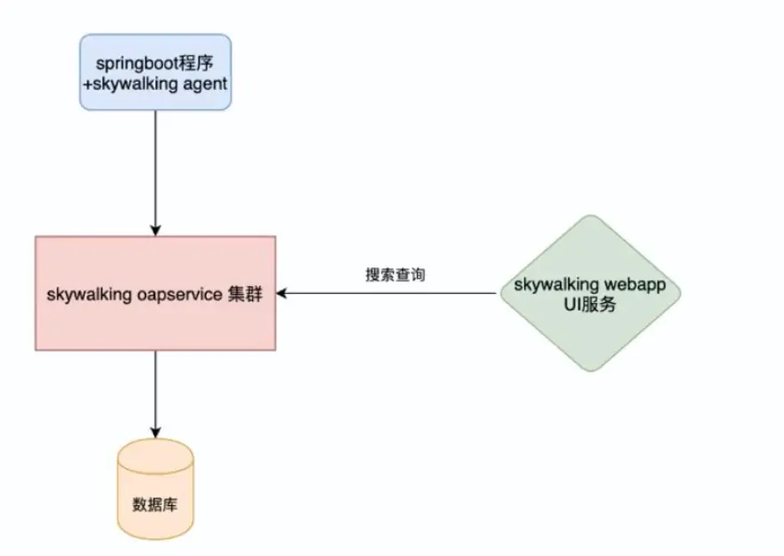

1. Skywalking agent和业务端绑定在一起，Agent以探针的方式，收集指标和日志数据，进行请求链路的数据采集，并向OAP服务器上报。
2. Skywalking oapservice。负责接收 Agent 发送的 Tracing 和Metric的数据信息，然后进行分析Analysis Core，存储到外部存储器 Storage ，最终提供查询Query 功能。。
3. Skywalking UI提供给用户，展现各种监控数据和告警。

修改配置
```yaml
修改端口：
1. OAP端口：config/application.yml  暴露http和grpc两种接口接受上报的trace和metric
    -> core.default.gRPCHost=0.0.0.0  
    -> core.default.gRPCPort=11800
    -> core.default.restHost=0.0.0.0   # http接口提供上报的数据和UI的接口
    -> core.default.restPort=12800
2. UI端口：webapp/application.yml 
    -> serverPort: ${SW_SERVER_PORT:-18080}
    -> oapServices: ${SW_OAP_ADDRESS:-http://localhost:12800}

修改存储：上报的数据存储，默认h2，推荐使用es。如果使用MySQL需要自行下载驱动放入oap-libs目录下。
修改为es，使用es才能激活全部的分析和查询功能，其他的数据库支持分析和查询的功能都不完整。
config/application.yml
storage:
  selector: ${SW_STORAGE:elasticsearch}
  elasticsearch:
    namespace: ${SW_NAMESPACE:""}
    clusterNodes: ${SW_STORAGE_ES_CLUSTER_NODES:localhost:9200}
    
数据存储时间：config/application.yml
core:
  default:
    recordDataTTL: ${SW_CORE_RECORD_DATA_TTL:3}         # 日志保留 3 天
    metricsDataTTL: ${SW_CORE_METRICS_DATA_TTL:7}       # 指标保留 7 天
```

Agent配置：
```shell
方式1：在jvm中添加agent配置 name使用两个冒号表示分组，便于服务管理。
-javaagent:/data/skywalking-agent/skywalking-agent.jar \
    -Dskywalking.agent.service_name=dev::my-web \
    -Dskywalking.collector.backend_service=127.0.0.1:11800
    
方式2【推荐】：添加到环境变量中。例如使用k8s时，添加到configMap中，作为公共资源使用。  
【JVM会自动读取环境变量：JAVA_TOOL_OPTIONS】
JAVA_TOOL_OPTIONS=-javaagent:/data/skywalking-agent/skywalking-agent.jar
SW_AGENT_COLLECTOR_BACKEND_SERVICES=127.0.0.1:11800
SW_AGENT_NAME=dev::my-web
```

#### 2.1.2.高可用

基于nacos实现。
1. config目录 application.yml配置文件 指定nacos地址 (两处配置 一处配置集群 一处为动态配置)
2. 配置ui服务 webapp.yml 文件的listOfServers 写多个地址 用逗号隔开
3. 在vm options里面 地址同样指定多个地址
4. 注意：如果使用的是springcloud alibaba ,skywalking 默认是不显示gateway服务的，
需要在agent/optional-plugins(可选插件目录)找到gateway相关的jar包 选择较新的版本复制进agent/plugins目录中。

#### 2.1.3.告警

##### 2.1.3.1.指标规则【可选】
自定义告警指标：有时候我们需要自定义写指标进行告警，可以选择两种方式： lal(log analyzer Language) 和 mal(metrics analyzer Language)

以lal为例：config\lal 新增一个 logback.yaml


```yaml
rules:
  - name: logback
    layer: GENERAL
    dsl: |
      filter {
        text {
          -- 1. 过滤日志，如果regexp匹配失败，是否跳过执行后面的操作。默认true
          abortOnFailure false
          -- 2. 解析日志
          regexp $/(?<time>\\d{23}) ([?<traceId>]\\w+) (?<thread>\\w+) (?<level>\\w+) (?<msg>.+)/$
        }
        extractor {
          -- 3. 解析日志，获得parsed.level 和 timestamp
          tag level: parsed.level
          timestamp parsed.time as String, "yyyy-MM-dd HH:mm:ss.SSS"
      
          -- 4. 自定义指标，如果日志级别为ERROR，则上报异常指标，数据包括：
          --   long类型的timestamp
          --   标签包括：service、service_instance_id
          --   指标名为log_exception_count，值为1
          if (parsed.level == "ERROR") {
            metrics {
              timestamp log.timestamp as Long
              labels service: log.service, service_instance_id: log.serviceInstance
              name "log_exception_count"
              value 1
            }
          }
        }
        sink {
        }
      } 
```

添加自定义指标规则：config\log-mal-rules,增加一个logwarning.yaml
```yaml
metricPrefix: instance
metricsRules:
  - name: log_exception_count
    exp: log_exception_count.sum(['service','service_instance_id']).downsampling(SUM).instance(['service'], ['service_instance_id'], Layer.GENERAL)
```

修改 config/application.yaml
```yaml
log-analyzer:
  selector: ${SW_LOG_ANALYZER:default}
  default:
    # 增加logback日志分析器
    lalFiles: ${SW_LOG_LAL_FILES:logback,envoy-als,mesh-dp,mysql-slowsql,pgsql-slowsql,redis-slowsql,k8s-service,nginx,default}
    # 增加对应的logwarning分析器
    malFiles: ${SW_LOG_MAL_FILES:"nginx,logwarning"}
    
query:
  selector: ${SW_QUERY:graphql}
  graphql:
    # 开启自动更新UI模板
    enableUpdateUITemplate: ${SW_ENABLE_UPDATE_UI_TEMPLATE:true}
    enableOnDemandPodLog: ${SW_ENABLE_ON_DEMAND_POD_LOG:false}
```

控制面板新增一个组件：填写指标名称、选择可视化图形类型等即可生效。

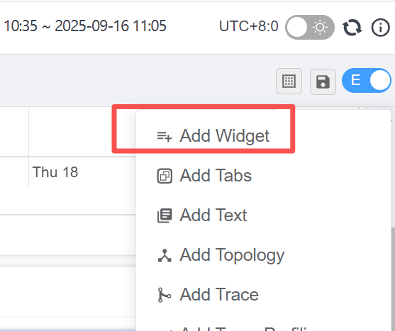

##### 2.1.3.2.告警规则
报警定义：config目录的alarm-settings.yml

```yaml
rules:
  # Rule unique name, must be ended with `_rule`.
  service_resp_time_rule:
    metrics-name: service_resp_time
    op: ">"
    threshold: 1000
    period: 10
    count: 3
    silence-period: 5
    message: Response time of service {name} is more than 1000ms in 3 minutes of last 10 minutes.
  service_sla_rule:
    # Metrics value need to be long, double or int
    metrics-name: service_sla
    exclude-labels:
    # 过滤状态码 200 401 404  注意前面有个小横杠
      - "200,401,404"
    op: "<"
    threshold: 8000
    # The length of time to evaluate the metrics
    period: 10
    # How many times after the metrics match the condition, will trigger alarm
    count: 2
    # How many times of checks, the alarm keeps silence after alarm triggered, default as same as period.
    silence-period: 3
    message: Successful rate of service {name} is lower than 80% in 2 minutes of last 10 minutes
  # 上面我们自定义的指标  
  instance_error_log_rule:
    expression: sum(instance_log_exception_count > 2) >= 1
    period: 1
    tags:
      level: ERROR

hooks:
  webhook:
    default:
      is-default: true
      urls:
        - http://172.16.118.1:8080/alarm/store
    
```

- 规则名称: 告警信息中显示的唯一名称。必须以过 _rule 结尾，前綴可自定义
- Metrics name：配置时只需要取 _rule 前的名称；度量名称，取值为oal脚本中的度量，目前只支持long、double和Int型
- Include names：该规则作用于哪些实体名称，比如服务名，终端名（可选，默认为全部〕
- Exclude names：该规则作不用于哪些实体名称，比如服务名，终惴名（可选，默认为空）
- Threshold：阈值, 例如2000为2s
- OP:操作符，目前支持> < =
- Period：多久告警规则需要被核实一下。这是一个时间窗囗，与后端部署环境时间相匹配
- Count: 在一个Period窗口中，如值values超过Threshold值（按op） 达到count值需要发送警报
- Silence period : 在时间N中 触发报警后，在TN->TN+ period 这个阶段不告警 ，默认情况下 它和period一样，意味着相同的告警 在同一个period内只会触发一次
- webhooks: 网络钩子 可以理解为web回调 出现告警时，可以往我们任意一个服务发送请求， 我们可以在服务里面写业务代码：如发送短信、邮件等 请求方式：http, post, Content-type:application/json


#### 2.1.4.日志

- 应用：Skywalking默认会在进程中生成traceId,用于链路追踪。同时我们也可以将traceId打印到日志中，方便分析问题。
- 方式：项目中添加apm-toolkit-logback-1.x，并修改logback.xml中的layout为skywalking提供的TraceIdPatternLogbackLayout。

添加依赖：
```xml
<dependency>
    <groupId>org.apache.skywalking</groupId>
    <artifactId>apm-toolkit-trace</artifactId>
    <version>9.4.0</version>
</dependency>
<dependency>  选择对于log的框架
    <groupId>org.apache.skywalking</groupId>
    <artifactId>apm-toolkit-logback-1.x</artifactId>
    <version>9.4.0</version>
</dependency>
<dependency>
    <groupId>org.apache.skywalking</groupId>
    <artifactId>apm-toolkit-meter</artifactId>
    <version>9.4.0</version>
</dependency>
```

修改日志配置：引入skywalking的扩展插件
```xml
<!-- 输出到SkyWalking OAP（通过gRPC） -->
<appender name="SKYWALKING_LOG" class="org.apache.skywalking.apm.toolkit.log.logback.v1.x.log.GRPCLogClientAppender">
    <encoder class="ch.qos.logback.core.encoder.LayoutWrappingEncoder">
        <layout class="org.apache.skywalking.apm.toolkit.log.logback.v1.x.mdc.TraceIdMDCPatternLogbackLayout">
            <Pattern>%d{yyyy-MM-dd HH:mm:ss.SSS} [%X{tid}] [%thread] %-5level %logger{36} -%msg%n</Pattern>
        </layout>
    </encoder>
</appender>
<root level="info">
    <appender-ref ref="SKYWALKING_LOG"/> <!-- 启用日志上传到SkyWalking -->
</root>
```

UI界面：（关键词查询必须采用ES存储才可以使用，数据库不支持查询。）

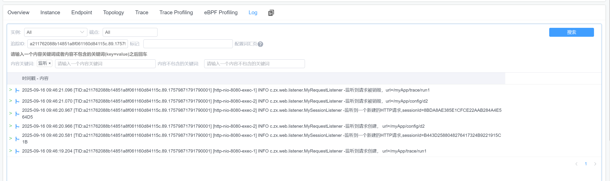

#### 2.1.5.自定义链路追踪

引入依赖：
```xml
<dependency>
    <groupId>org.apache.skywalking</groupId>
    <artifactId>apm-toolkit-trace</artifactId>
    <version>9.4.0</version>
</dependency>
```

使用注解
```java
@Trace
@Tags(value = {
        @Tag(key = "param", value = "arg[0]"), 
        @Tag(key = "result", value = "returnedObj")
})
@RequestMapping("/run2")
public String run2(String username, String password) {
    log.info("run2~~~~~{}{}", username, password);
    return username + "::" + password;
}
1. 在业务方法上面加上@Trace注解 (该注解为记录方法注解)
2. 再追加上@Tags或@Tag注解 （该注解用于记录方法的入参或返回值）
    key一般可以指定为方法名或参数名(自定义),
    value不能随便填 arg[0]表示下标为0的参数 ,returnedObj表示返回值
```

效果：
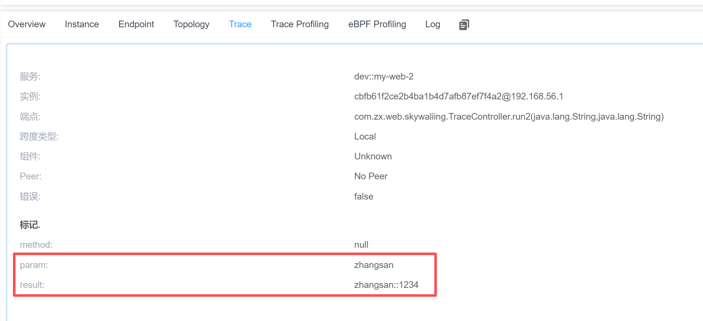

查询标记：自定义的标记（tag）默认不支持进行查询，需要修改配置才能生成。
```yaml
修改config/application.yml
core:
  default:
    searchableTracesTags: "param,result" # 控制trace，追加自定的这两个标签。
    searchableLogsTags: "param,result"   # 控制log，追加自定的这两个标签。
```

#### 2.1.6.性能分析

可以定位到具体代码 占用时间

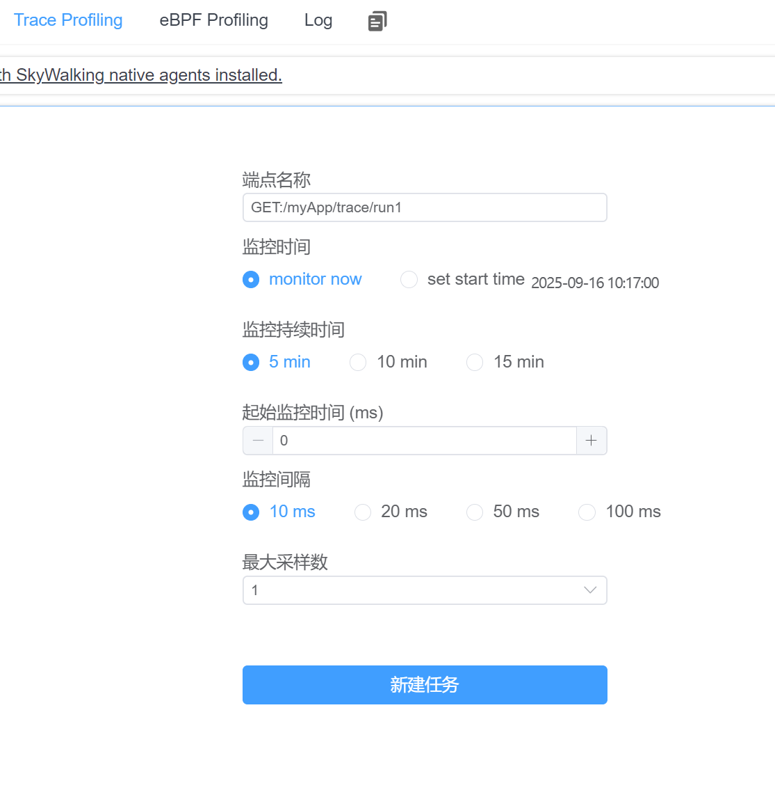

对一个服务的一个接口进行，性能分析，最大采样数即最少访问次数。

### 2.2.CAT

- 源码[https://github.com/dianping/cat](https://github.com/dianping/cat)
- [深度剖析开源分布式监控CAT](https://tech.meituan.com/2018/11/01/cat-in-depth-java-application-monitoring.html)
- [CAT 3.0 开源发布](https://tech.meituan.com/2018/11/01/cat-pr.html)

CAT 是基于 Java 开发的实时应用监控平台，为美团点评提供了全面的实时监控告警服务。

CAT 作为服务端项目基础组件，提供了 Java, C/C++, Node.js, Python, Go 等多语言客户端，已经在美团点评的基础架构中间件框架
（MVC框架，RPC框架，数据库框架，缓存框架等，消息队列，配置系统等）深度集成，为美团点评各业务线提供系统丰富的性能指标、健康状况、实时告警等。
CAT 很大的优势是它是一个实时系统，CAT 大部分系统是分钟级统计，但是从数据生成到服务端处理结束是秒级别，秒级定义是48分钟40秒，
基本上看到48分钟38秒数据，整体报表的统计粒度是分钟级；第二个优势，监控数据是全量统计，客户端预计算；链路数据是采样计算。

Cat 产品价值
- 减少故障发现时间
- 降低故障定位成本
- 辅助应用程序优化

Cat 优势
- 实时处理：信息的价值会随时间锐减，尤其是事故处理过程中
- 全量数据：全量采集指标数据，便于深度分析故障案例
- 高可用：故障的还原与问题定位，需要高可用监控来支撑
- 故障容忍：故障不影响业务正常运转、对业务透明
- 高吞吐：海量监控数据的收集，需要高吞吐能力做保证
- 可扩展：支持分布式、跨 IDC 部署，横向扩展的监控系统

### 2.3.Sentry

Sentry 是一个实时事件日志记录和聚合平台。（官方说的是错误监控 Error Monitor）它专门用于监视错误和提取执行适当的事后操作所需的所有信息，而无需使用标准用户反馈循环的任何麻烦。

目前使用的主要场景为：前端性能检测、前端异常检测、前端分布式跟踪

- [Sentry的安装、配置、使用教程(Sentry日志手机系统)](https://www.jb51.net/article/256519.htm)
- [Sentry Web 前端监控 - 最佳实践(官方教程)](https://blog.csdn.net/o__cc/article/details/120300566)
- [Sentry 监控 - 全栈开发人员的分布式跟踪 101 系列教程(第一部分)](https://juejin.cn/post/7015610151675625485#heading-8)

Sentry 教程：
- [1 分钟快速使用 Docker 上手最新版 Sentry-CLI - 创建版本](https://mp.weixin.qq.com/s/7pTJbwkUltqMndg3IIHBfQ)
- [快速使用 Docker 上手 Sentry-CLI - 30 秒上手 Source Map](https://mp.weixin.qq.com/s/zUbsfMTtajGrhJm6hfaHJw)
- [Sentry For React 完整接入详解](https://mp.weixin.qq.com/s/FFpg1t0-3K8casLMNla15g)
- [Sentry For Vue 完整接入详解](https://mp.weixin.qq.com/s/_ubxtWBEyzfPtc20TSJp1w)
- [Sentry-CLI 使用详解](https://mp.weixin.qq.com/s/IRMBvcfLNwq5fCng7IA16w)
- [Sentry Web 性能监控 - Web Vitals](https://mp.weixin.qq.com/s/QZQ8-48MD3zgGmSrr_oWwQ)
- [Sentry Web 性能监控 - Metrics](https://mp.weixin.qq.com/s/XTpRk5Y5fAzhBg4FhidLWQ)
- [Sentry Web 性能监控 - Trends](https://mp.weixin.qq.com/s/_CJduJFnUiCnIEkdEwSdDA)
- [Sentry Web 前端监控 - 最佳实践(官方教程)](https://mp.weixin.qq.com/s/c_ANVMoRKnVS9Fq7Id6Hsg)
- [Sentry 后端监控 - 最佳实践(官方教程)](https://mp.weixin.qq.com/s/mdexnNPRwy8BPD9HYY4DpQ)
- [Sentry 监控 - Discover 大数据查询分析引擎](https://mp.weixin.qq.com/s/Yol6ASdQOOLcGFabIqKZtA)
- [Sentry 监控 - Dashboards 数据可视化大屏](https://mp.weixin.qq.com/s/ms5bCB0KSI6N2Ck5_QkBSA)
- [Sentry 监控 - Environments 区分不同部署环境的事件数据](https://mp.weixin.qq.com/s/BVpDsIhir68S0PI2UE9-fQ)
- [Sentry 监控 - Security Policy 安全策略报告](https://mp.weixin.qq.com/s/gykn0Kwgmj93TvzmPjsxZQ)
- [Sentry 监控 - Search 搜索查询实战](https://mp.weixin.qq.com/s/JtxTAyYzdLVkxmUe-gukRQ)
- [Sentry 监控 - Alerts 告警](https://mp.weixin.qq.com/s/8F-inVbQaxdQTlaMHinJKw)
- [Sentry 监控 - Distributed Tracing 分布式跟踪](https://mp.weixin.qq.com/s/gXC0nnJnp6R5V18TwCk2qw)

### 2.4.OpenTelemetry
- OpenTracing。早期被提出的链路追踪协议，目前发展非常成熟。
- OpenTelemetry。是OpenTracing和OpenCensus的合并体，旨在成为可观测性数据的统一集合、处理、导出工具。它提供了自动的、标准化的、端到端的监控和追踪能力。

- 官网[https://opentelemetry.io/](https://opentelemetry.io/)
- java集成：[https://github.com/open-telemetry/opentelemetry-java](https://github.com/open-telemetry/opentelemetry-java)
- golang集成：[https://github.com/open-telemetry/opentelemetry-go](https://github.com/open-telemetry/opentelemetry-go)

- [OpenTelemetry系列 - 第1篇 相关概念](https://luoex.blog.csdn.net/article/details/134369504)
- [OpenTelemetry系列 - 第2篇 Java端接入OpenTelemetry](https://luoex.blog.csdn.net/article/details/134506507)
- [OpenTelemetry系列 - 第3篇 OpenTelemetry Collector](https://luoex.blog.csdn.net/article/details/134510880)
- [OpenTelemetry系列 - 第4篇 OpenTelemetry K8S生态](https://luoex.blog.csdn.net/article/details/134510907)
- [OpenTelemetry部署](https://blog.csdn.net/qq_62368250/article/details/143516314)


#### 2.4.1.核心组件

1. Instrumentation：通过 SDK/Agent 自动或手动埋点，收集 Span 数据。 
2. Collector：接收、处理、转换追踪数据（支持 OTLP/Protobuf 格式）。 
3. Storage：存储至 Elasticsearch/MySQL 等，支持时序数据库（如 InfluxDB）。 
4. Visualization：集成 Grafana 或自研 UI 展示链路。

特点：跨语言支持（Java/Go/Python）、兼容 OpenTracing/OpenCensus 标准，适合云原生场景。

#### 2.4.2.Instrumentation采集器

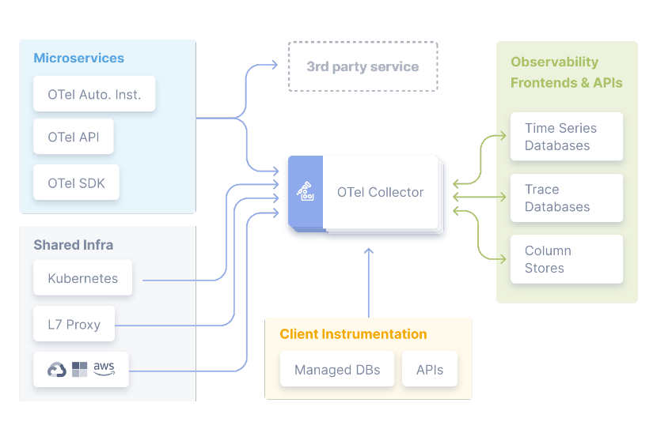

OpenTelemetry提供三种数据采集方式
1. SDK（软件开发工具包）：允许开发者在应用程序中直接集成遥测功能。通过在代码中使用 OpenTelemetry 提供的 API，开发者可以显式地创建和管理跟踪、指标和日志数据。
 这种方式提供了最大的灵活性和控制，但也需要开发者在应用程序代码中进行集成。但是当前迭代速度较快，经常出现前后不兼容的情况，升级SDK会涉及项目改造。
2. 自动化采集（Auto-instrumentation）：通常采用探针的方式实现的，能够自动捕获常见框架和库的遥测数据。属于无侵入的方式。

#### 2.4.3.Exporter导出器

将采集到的数据发送到后端系统，支持多种协议和存储：
- 追踪导出：Jaeger、Zipkin、OTLP（OpenTelemetry Protocol）、Elasticsearch 等。
- 指标导出：Prometheus、OTLP、InfluxDB 等。
- 日志导出：OTLP、Fluentd、Logstash 等。

#### 2.4.4.Collector收集器

Collector 是一个独立的服务，可以接收、处理和转发来自不同源的遥测数据。

核心功能：数据聚合（合并多个来源的数据）、转换（统一格式）、负载均衡（分发到多个后端）、扩展（通过插件支持更多导出目标）

#### 2.4.5.处理流程

```text
应用代码 → Instrumentation库/API → Processor（处理） → Exporter（本地导出）
                                                                 ↓
                                                  Collector（聚合/转发） → 后端系统（存储/分析）
```

## 3.指标

### 3.1.prometheus

- prometheus官方网址：[https://prometheus.io/](https://prometheus.io/)
- prometheus第三方中文介绍：[https://github.com/1046102779/prometheus](https://github.com/1046102779/prometheus)
- prometheus源码网址：[https://github.com/prometheus/prometheus](https://github.com/prometheus/prometheus)
- MySQL、Redis监控：[https://www.cnblogs.com/shhnwangjian/p/6878199.html](https://www.cnblogs.com/shhnwangjian/p/6878199.html)
- Java进程监控：[http://www.cnblogs.com/smallSevens/p/7905596.html](http://www.cnblogs.com/smallSevens/p/7905596.html)
- 用Prometheus+Grafana监控Springboot应用：[https://www.cnblogs.com/larrydpk/p/12563497.html](https://www.cnblogs.com/larrydpk/p/12563497.html)
- SpringBoot使用prometheus监控：[https://blog.csdn.net/qq_33257527/article/details/88294016](https://blog.csdn.net/qq_33257527/article/details/88294016)
- grafana官网： [https://grafana.com/](https://grafana.com/)
- [开源监控系统 Prometheus 最佳实践](https://mp.weixin.qq.com/s/SzWUe4GNlkauLa4gGGQUng)

学习博客
- [Prometheus监控告警——基础篇](https://code2life.top/blog/0048-prometheus-in-action-start/)
- [Prometheus监控告警——实战篇](https://code2life.top/blog/0049-prometheus-in-action-usage/)
- [Prometheus监控告警——原理篇](https://code2life.top/blog6/0050-prometheus-in-action-impl/)
- [Prometheus监控告警——总结与思考](https://code2life.top/blog/0051-prometheus-in-action-thinking/)

整个系列都值得看下：
[构建企业级监控平台系列（二十五）：Prometheus 高可用集群方案](https://cloud.tencent.com/developer/article/2350339)

#### 3.1.1.介绍

SpringBoot的应用监控方案比较多，SpringBoot+Prometheus+Grafana是目前比较常用的方案之一

比较适合中小型团队和项目使用。

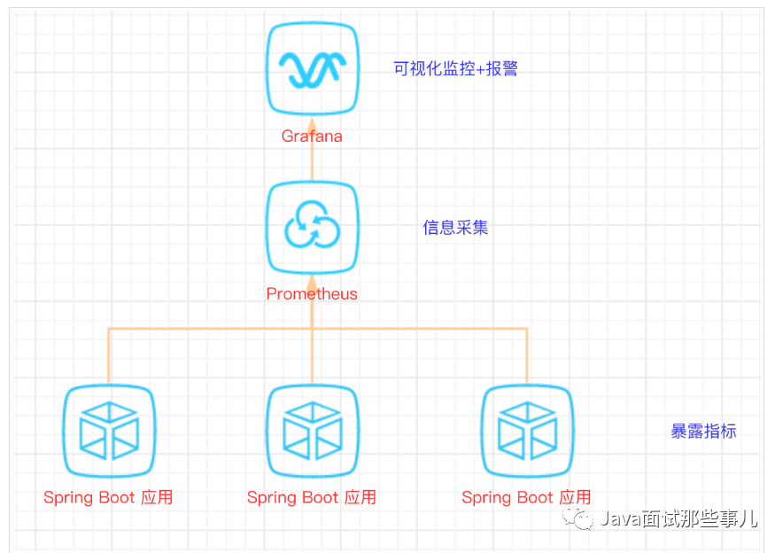

导出器
- [prometheus 支持的导出器](https://prometheus.io/docs/instrumenting/exporters/)
- 支持数据库、带宽、消息队列、文件系统、web容器、主流语言等各种常见软件系统。

#### 3.1.2.【案例】spring boot项目

以下案例以spring boot 2.1为例子

##### 3.1.2.1.依赖
```xml
<!-- 普罗米修斯监控 -->
<!-- springboot内置收集系统数据功能包 -->
<dependency>
    <groupId>org.springframework.boot</groupId>
    <artifactId>spring-boot-starter-actuator</artifactId>
</dependency>
<!-- prometheus收集数据功能包 -->
<dependency>
    <groupId>io.micrometer</groupId>
    <artifactId>micrometer-registry-prometheus</artifactId>
</dependency>
```

##### 3.1.2.2.配置
```properties
management.metrics.export.prometheus.enabled=true
management.metrics.export.prometheus.descriptions=true
management.endpoints.web.exposure.include=*
#Prometheus 中的application name
management.metrics.tags.application=${spring.application.name}
```

actuator暴露接口使用的端口，为了和api接口使用的端口进行分离，就是单独启动一个服务用于监控
[http://localhost:8989/monitor/actuator/prometheus](http://localhost:8989/monitor/actuator/prometheus)
不配置的话， http://localhost:8080/actuator/prometheus

```properties
management.server.port=8989
management.server.servlet.context-path=/monitor
```

##### 3.1.2.3.启动项目

启动项目后，可以在IDEA中看到有很多Endpoints。需要较高的版本

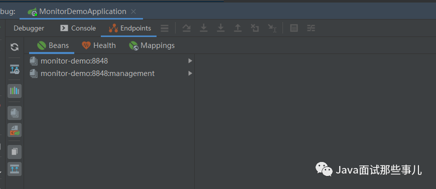


##### 3.1.2.4.访问监控路径

[http://localhost:8989/monitor/actuator/prometheus](http://localhost:8989/monitor/actuator/prometheus)

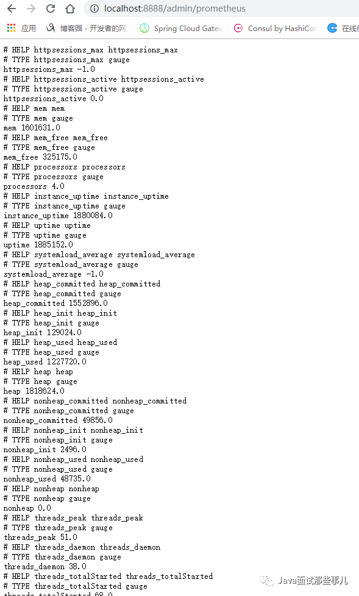

#### 3.1.3.Prometheus

##### 3.1.3.1.安装

下载地址点击https://prometheus.io/download，下载解压包，解压即可使用

##### 3.1.3.2.配置prometheus.yml

Job_name就是我们单个服务的监控路径。我们可以配置域名，这样就可以监控到后面多个实例了

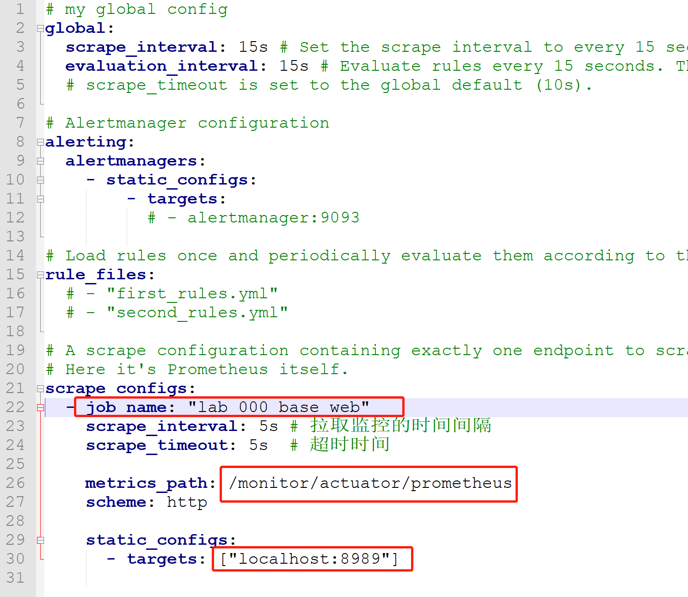


##### 3.1.3.3.启动

prometheus.exe --config.file=prometheus.yml

##### 3.1.3.4.访问

[http://localhost:9090/targets](http://localhost:9090/targets)

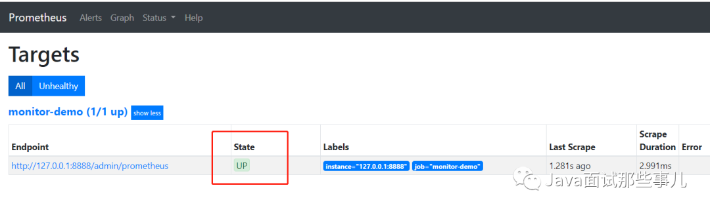

#### 3.1.4.Grafana

##### 3.1.4.1.安装

[https://grafana.com/grafana/download](https://grafana.com/grafana/download)

[上手开源数据可视化工具 Grafana](https://mp.weixin.qq.com/s/e2zIX5ddZOjMliqRLJI__g)

下载解压包，解压即可使用

##### 3.1.4.2.启动

解压后运行bin目录下的grafana-server.exe启动

##### 3.1.4.3.访问

游览器访问http://localhost:3000即可看到登录页面，默认账号密码是admin/admin。

##### 3.1.4.4.配置界面

可以选择导入现有的模板:

grafana模板： [https://grafana.com/grafana/dashboards/](https://grafana.com/grafana/dashboards/)

不错的springboot模板：[https://grafana.com/grafana/dashboards/10280](https://grafana.com/grafana/dashboards/10280)

不错的jvm模板：[https://grafana.com/grafana/dashboards/4701](https://grafana.com/grafana/dashboards/4701)

##### 3.1.4.5.报警监控

在实际项目中当监控的某的个指标超过阈值（比如CPU使用率过高），希望监控系统自动通过短信、钉钉和邮件等方式报警及时通知运维人员，Grafana就支持该功能。

###### 3.1.4.5.1.添加通知通道

点击[Alerting]——>[Notification channels]添加通知通道

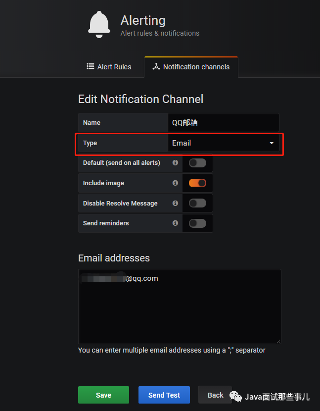


###### 3.1.4.5.2.邮箱配置

Grafana默认使用conf目录下defaults.ini作为配置文件运行，根据官方的建议我们不要更改defaults.ini而是在同级目录下新建一个配置文件custom.ini。

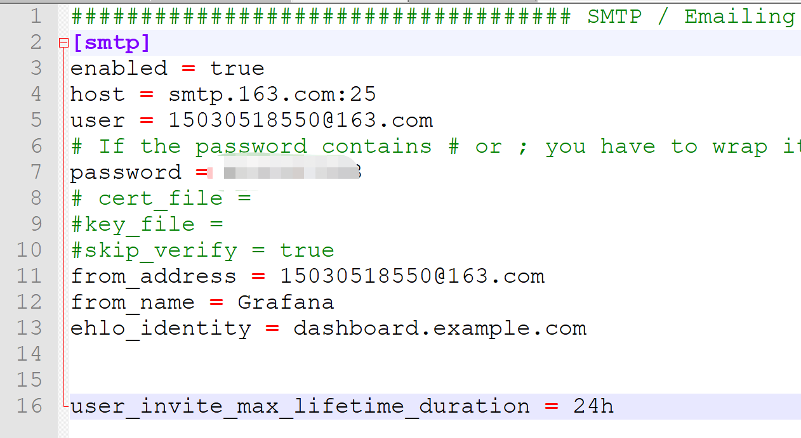


###### 3.1.4.5.3.重启

然后需要重启Grafana，命令grafana-server.exe -config=E:\\file\\grafana-6.3.3\\conf\\custom.ini

###### 3.1.4.5.4.为指标添加alert

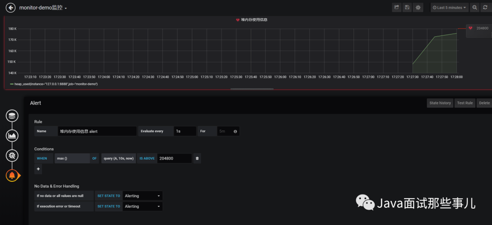


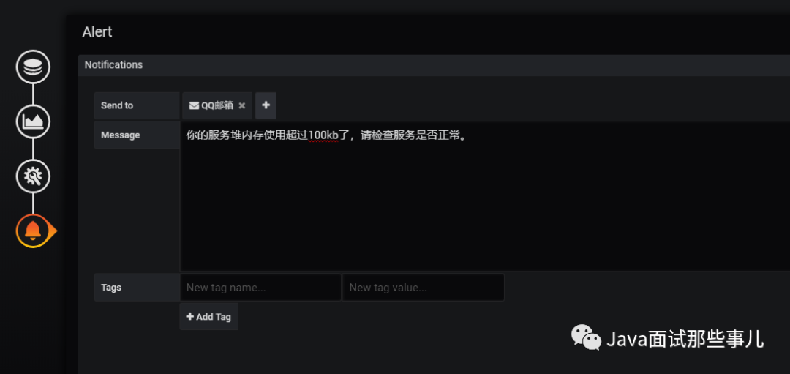

- Evaluate every：表示检测评率，这里为了测试效果，改为1秒
- For：如果警报规则配置了For，并且查询违反了配置的阈值，那么它将首先从OK变为Pending。从OK到Pending
  Grafana不会发送任何通知。一旦警报规则的触发时间超过持续时间，它将更改为Alerting并发送警报通知。
- Conditions：when 表示什么时间，of 表示条件，is above 表示触发值
  同时，设置了is above后会有一条红线。
- If no data or all values are
  null：如果没有数据或所有值都为空，这里选择触发报警
- If execution error or timeout：如果执行错误或超时，这里选择触发报警
  注意：下一次触发，比如10秒后，它不会再次触发，防止报警风暴产生！

###### 3.1.4.5.5.测试
在Notification channels 界面可以测试发送邮件

#### 3.1.5.普通Java项目

```text
1.引入依赖
<!-- prometheus -->
<dependency>
	<groupId>io.prometheus</groupId>
	<artifactId>simpleclient</artifactId>
	<version>0.3.0</version>
</dependency>
<dependency>
	<groupId>io.prometheus</groupId>
	<artifactId>simpleclient_hotspot</artifactId>
	<version>0.3.0</version>
</dependency>
<dependency>
	<groupId>io.prometheus</groupId>
	<artifactId>simpleclient_servlet</artifactId>
	<version>0.3.0</version>
</dependency>

2.配置bean
import io.prometheus.client.exporter.MetricsServlet;
import io.prometheus.client.hotspot.DefaultExports;
import org.springframework.boot.web.servlet.ServletRegistrationBean;
import org.springframework.context.annotation.Bean;
import org.springframework.context.annotation.Configuration;


@Configuration
public class AppConfig {
  @Bean
  public ServletRegistrationBean servletRegistrationBean(){
  DefaultExports.initialize();
    return new ServletRegistrationBean(new MetricsServlet(), "/metrics");  //第二个参数可以自定义，但是不可省略
  }
}

3.自定义监控指标
  name方法定义指标名
  help方法定义指标描述

import io.prometheus.client.Counter;
import io.prometheus.client.Gauge;

//Counter
static final Counter counter = Counter.build()
			.name("my_counter_total")
			.help("A counter used to describe the debt")
			.register();
counter.inc();


//Gauge
static final Gauge gauge = Gauge.build()
			.name("my_gauge")
			.help("A gauge to describe the rest of the money")
			.register();
gauge.inc();
gauge.dec();

4.prometheus.yml

metrics_path的值对应第二步中的”/prometheus”参数，默认为”/metrics”
targets对应需要被监控的项目的地址

- job_name: 'MyMetrics'
  metrics_path: '/metrics' //此行也可省略
  static_configs:
	- targets: 
	  - 'localhost:8080'
```

#### 3.1.6.公司级案例

查看代码目录中的：《有利网Prometheus监控方案》

### 3.2.MyPerf4J

一个针对高并发、低延迟应用设计的高性能 Java 性能监控和统计工具。
可将数据输出到磁盘或者InfluxDB中，并结合grafana进行展示。

- [入门教程](https://j3q80mf3ig.feishu.cn/docx/U5RNdo5K3oGE5axwHNncFU4jnqb)
- [MyPerf4J一个高性能、无侵入的Java性能监控和统计工具](http://xiaoyuge.work/myperf4j/index.html)
- 源码[https://github.com/LinShunKang/MyPerf4J](https://github.com/LinShunKang/MyPerf4J)‘’

### 3.3.TProfiler
TProfiler是一个可以在生产环境长期使用的性能分析工具，阿里巴巴开源的，已经很久不更新了。
源码[https://github.com/alibaba/TProfiler](https://github.com/alibaba/TProfiler)

### 3.4.eBPF
eBPF（扩展的伯克利数据包过滤器）作为Linux内核中的一个高效且灵活的虚拟机，允许开发者自定义运行程序，并通过特定接口将这些程序加载到内核空间执行。
这一特性使得eBPF成为了构建各类系统监控解决方案的理想选择之一。

近年来，基于eBPF技术开发的各种开源项目如雨后春笋般涌现出来，其中包括
- pixie（https://github.com/pixie-io/pixie）
- beyla（https://github.com/grafana/beyla）
- opentelemetry-go-instrumentation（https://github.com/open-telemetry/opentelemetry-go-instrumentation）
- deepflow(https://github.com/deepflowio/deepflow)

它们共同致力于利用eBPF的强大能力来实现诸如性能分析(Profiling)、网络流量监测(Network Monitoring)、度量指标收集(Metric Collection)及分布式追踪(Distributed Tracing)等功能。

eBPF可以通过在不同位置的挂载点完成对数据流的抓取，比如tracepoint、kprobe等，也可以使用uprobe针对用户态函数进行hook，
以协议解析为例，随着业务复杂度的提升以及不同使用场景的要求，用户态的协议非常多，有RPC类型的http、https、grpc、dubbo等，
还有中间件的mysql、redis、es、mq、ck等，要通过eBPF抓取的数据完成数据解析并实现指标的统计难度非常大。

以使用eBPF监控Go应用为例，因其独特的并发模型而广泛采用异步处理机制，若想精确地进行跨协程上下文传递或深入到应用程序内部进行细粒度的跟踪，
则通常还需要额外引入SDK来进行辅助支持，完成不同协程之间的上下文传递。

尽管上述项目在功能上存在一定程度的相似性，但由于eBPF自身的一些限制因素，比如eBPF 通常仅限于具有提升权限的 Linux 环境，
同时针对内核的版本有要求，对于某些应用场景尤其是涉及到复杂应用层逻辑追踪时，单独依靠eBPF往往难以达到理想效果。
就性能开销而言，eBPF相对于进程内的Agent稍显落后，因为 uprobe 的触发需要在用户空间和内核之间进行上下文切换，这对于访问量特别大的一些接口难以承受。

### 3.5.instgo

基于golang的编译时插桩方案。 [为Go应用无侵入地添加任意代码](https://mp.weixin.qq.com/s/Eb8Rx6lN9HhyCmg6x9Wo9g)

可以在插入的代码中实现跟Java应用监控完全一样的监控能力，如链路追踪、指标统计、持续剖析、动态配置、代码热点、日志Trace关联等等，
在插件丰富度上我们支持了40+的常见插件，包含了RPC框架、DB、Cache、MQ、Log等，在性能上，5%的消耗即可支持1000 qps，
通过动态开关控制、Agent版本灰度等实现生产的可用性和风险控制能力。

```shell
当前的编译语句：
CGO_ENABLED=0 GOOS=linux GOARCH=amd64 go build main.go 
使用Aliyun Go Agent：
wget "http://arms-apm-cn-hangzhou.oss-cn-hangzhou.aliyuncs.com/instgo/instgo-linux-amd64" -O instgo
chmod +x instgo
CGO_ENABLED=0 
GOOS=linux 
GOARCH=amd64 
./instgo go build main.go
```

## 4.日志

### 4.1.ELK
ElasticSearch+Logstash+Kibana：日志收集、存储、展示等

现在很多 Logstash 被 filebeat替换，ElasticSearch 被clickhouse替换。

为什么Logstash被放弃？
- 性能问题：Logstash 本身就是一个基于 JVM 的应用，在处理大量日志时，其启动和运行都会消耗较多的资源，在处理大量日志时容易OOM。
    filebeat采用golang，内存消耗在10MB左右，对CPU的消耗更是可以忽略。
- 配置复杂：Logstash 的配置文件采用的是 Grok 语法，相比于正则表达式要复杂很多。
- 架构：logstash直接与ES等存储对接容易数据堆积直到奔溃，而filebeat可以对接kafka。

使用案例
```yaml
filebeat.inputs:
- type: container
  paths:
    - /var/log/containers/*.log
  processors:
    - add_kubernetes_metadata: ~  # 自动添加 Kubernetes 元数据

output.kafka:
  hosts: ["kafka:9092"]
  topic: "app-logs"
  partition.round_robin:
    reachable_only: true
  required_acks: 1
  compression: gzip
  max_message_bytes: 1000000
```

### 4.2.Promtail

Promtail 是由 Grafana Labs 开发的日志收集代理，主要用于从本地系统或容器中采集日志，并将其发送到 Loki 或兼容 Loki 协议的系统。

### 4.3.Loki

Loki 是一个水平可扩展的日志聚合系统，由 Grafana Labs 开发。它支持强大的查询功能、快速的索引和存储能力。

## 5.链路追踪

### 5.1.Spring Cloud Sleuth + Zipkin

- [Sleuth源码解析](https://blog.csdn.net/weixin_48872249/article/details/113480953)
- [快速入门](https://blog.csdn.net/ya_yongng/article/details/107570277)
- [sleuth zinkip 分布式链路追踪](https://mp.weixin.qq.com/s/lRU-waPZP7aYvHuefYgNYA)

为了方便查询整个链路的日志信息，可以采用Sleuth去收集日志信息，并且在配合Zipkin去以图形化界面站式，方便定位问题所在。
- Sleuth：只是一个全链路生成工具，我们一般将sleuth与zipkin结合使用，sleuth默认会将收集的所有信息发送到zipkin。
- Zipkin：是Twitter开源的调用链路分析工具，基于 Google Dapper 实现，我们可以使用它来收集各个服务器上请求链路的跟踪数据,
  并通过它提供的 REST API 接口来辅助查询跟踪数据以实现对分布式系统的监控程序,从而及时发现系统中出现的延迟升高问题并找出系统性能瓶颈的根源。
  除了面向开发的 API 接口之外,它还提供了方便的 UI 组件来帮助我们直观地搜索跟踪信息和分析请求链路明细。目前基于Spingcloud sleuth得到了广泛的应用，特点是轻量，部署简单。

Sleuth目前支持多种调用方式：rxjava、feign、quartz、RestTemplate、zuul、hystrix、grpc、kafka、Opentracing、redis、Reator、
circuitbreaker、spring的Scheduled。国内用的比较多的dubbo，sleuth无法对其提供支持

Sleuth实现原理：
1. 自动埋点机制：Sleuth 利用 Spring 的 AOP 和拦截器机制，对常见组件（如 HTTP 接口、消息队列、数据库客户端等）进行自动埋点。
例如restTemplate中，就是通过实例化底层httpclient的时候，指定了一个InterceptingClientHttpRequest，并添加trace的拦截器。

#### 5.1.1.集成Sleuth

1.引入依赖

```xml
<!--全链路日志生成器-->
<dependency>
    <groupId>org.springframework.cloud</groupId>
    <artifactId>spring-cloud-starter-sleuth</artifactId>
</dependency>
<!--日志采集器，上传日志-->
<dependency>
    <groupId>org.springframework.cloud</groupId>
    <artifactId>spring-cloud-starter-zipkin</artifactId>
</dependency>
```

2.增加测试代码。我们通过本地方法通过 RestTemplate 调用另一个本地方法 模拟服务间调用。

```java
@Slf4j
@RestController
@RequestMapping("/sleuth")
public class SleuthController {
    @Autowired
    private RestTemplate restTemplate;

    @RequestMapping("start")
    public String start() {
        log.info("start收到请求");
        // 通过http接口调用自己的方法
        restTemplate.getForObject("http://localhost:8080/sleuth/end", String.class);
        log.info("start请求处理结束");
        return "1";
    }
    @RequestMapping("end")
    public String end() {
        log.info("end收到请求");
        log.info("end请求处理结束");
        return "2";
    }
    @Bean
    public RestTemplate getRestTemplate() {
        return new RestTemplate();
    }
}
```

3.配置信息

```properties
spring.application.name=lab_086_trace_sleuth
server.port=8080

logging.level.root=debug

# 采集数据的上传类型，web=通过http方式上传，mq支持activemq,rabbit,kafka
spring.zipkin.sender.type=web
spring.zipkin.base-url=http://127.0.0.1:9411

# sleuth默认会将收集的所有信息发送到zipkin，这样是非常耗性能的，所以sleuth提供了两个参数，可以使sleuth按照一定的比例将信息发送到zipkin
# 注意：这两个参数配置1个即可
# 1.抽样概率，如果设置为1，表示信息全部发送到zipkin，如果设置0.5，表示50%会发送
spring.sleuth.sampler.probability=1

# 2.每秒收集信息的速率，对于访问量不大的请求，可以设置该参数,比如设置rate=50，表示无论访问量大小，每秒最多发送50个信息到zipkin
# spring.sleuth.sampler.rate=10
```

4.启动项目访问： http://localhost:8080/sleuth/start 。日志如下

```text
2022-10-19 21:57:54.360  INFO [lab_086_trace_sleuth,99fb43b87e2f986b,99fb43b87e2f986b,true] 26880 --- [nio-8080-exec-7] com.zx.sleuth.SleuthController           : start收到请求
2022-10-19 21:57:54.366  INFO [lab_086_trace_sleuth,99fb43b87e2f986b,deb184e200885715,true] 26880 --- [nio-8080-exec-8] com.zx.sleuth.SleuthController           : end收到请求
2022-10-19 21:57:54.366  INFO [lab_086_trace_sleuth,99fb43b87e2f986b,deb184e200885715,true] 26880 --- [nio-8080-exec-8] com.zx.sleuth.SleuthController           : end请求处理结束
2022-10-19 21:57:54.369  INFO [lab_086_trace_sleuth,99fb43b87e2f986b,99fb43b87e2f986b,true] 26880 --- [nio-8080-exec-7] com.zx.sleuth.SleuthController           : start请求处理结束

[lab_086_trace_sleuth,99fb43b87e2f986b,99fb43b87e2f986b,true]
lab_086_trace_sleuth：服务名
99fb43b87e2f986b：traceId
99fb43b87e2f986b：spanId
true：表示是否要将该信息输出到Zipkin等服务中来收集和展示。这里因为日志输出到文件中了，也算被收集了
```

#### 5.1.2.Zipkin集成

##### 5.1.2.1.核心组件

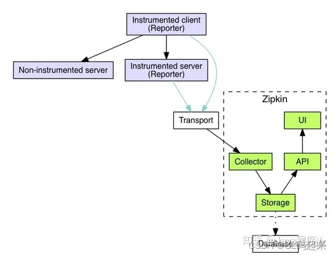

- Collector: 收集器组件,它主要处理从外部系统发送过来的跟踪信息,将这些信息转换为 Zipkin 内部处理的 Span 格式,以支持后续的存储、分析、展示等功能。
- Storage:存储组件,它主要处理收集器接收到的跟踪信息,默认会将这些信息存储在内存中。我们也可以修改此存储策略,通过使用其他存储组件将跟踪信息存储到数据库中。
- Query Service: 查询服务组件，它主要用来提供外部访问接口。比如给客户端展示跟踪信息,或是外接系统访问以实现监控等。它的主要使用者是Web UI组件。
- Web UI: 基于 API 组件实现的上层应用。通过 UI 组件,用户可以方便而又直观地查询和分析跟踪信息。

##### 5.1.2.2.下载安装

有两种方式：1.下载官方的jar启动。2. 整合spring boot。

zipkin自2019年发布2.12.9之后，就没有发布过最新的版本到maven仓库了。当前的spring boot的最新版本无法兼容，最高支持到2.1.4。
以上的版本不兼容zipkin，所有这种方法已经不推荐使用了。

1.下载命令如下：下载后重命名为zipkin.jar即可

```shell
curl -sSL https://zipkin.io/quickstart.sh | bash -s
```

2.启动zipkin，我们选择使用MySQL保存数据

mysql表创建语句：https://github.com/openzipkin/zipkin/blob/master/zipkin-storage/mysql-v1/src/main/resources/mysql.sql

```shell
java -jar zipkin-server-2.23.2-exec.jar --STORAGE_TYPE=mysql --MYSQL_HOST=localhost --MYSQL_TCP_PORT=3306 --MYSQL_DB=zipkin --MYSQL_USER=root --MYSQL_PASS=root
```

3.配置文件：https://github.com/openzipkin/zipkin/blob/master/zipkin-server/src/main/resources/zipkin-server-shared.yml

我们看到配置文件整体采用的是参数变量的方式，比如，Storage模块是存储，所以在配置文件中可以找Storage，发现 STORAGE_TYPE 参数，
找到MySQL，看到其他MySQL参数是什么，这样我们就可以通过命令行的方式，在启动的时候注入参数，其他的配置信息也是如此。

比如，
- Collector：支持activemq、http、 grpc、kafka、rabbitmq、scribe
- storage:支持 mem、 MySQL、es、cassandra

### 5.2.Google-Dapper

介绍：[https://blog.csdn.net/lbw520/article/details/103250417](https://blog.csdn.net/lbw520/article/details/103250417)

Dapper是谷歌内部使用的分布式链路追踪系统，虽然没有开源，但是Google在其2010年发布的一篇论文中对其进行了详细的介绍。
可以说，Dapper是链路追踪领域的始祖，其提出的概念和理念一致影响着后来所有的分布式系统链路追踪系统，
包括阿里的鹰眼系统，大众点评的cat系统，Twitter的Zipkin以及开源的Jaeger等等。、

### 5.3.【链路追踪】Jaeger

## 6.诊断
不同于监控室自动化的，诊断通常需要人工操作。例如分析堆内存、JVM运行时状态等。

### 6.1.Arthas

Arthas（阿尔萨斯）是阿里巴巴开源的 Java 诊断工具，深受开发者喜爱。

当你遇到以下类似问题而束手无策时，Arthas 可以帮助你解决：
1. 这个类从哪个 jar 包加载的？为什么会报各种类相关的 Exception？
2. 我改的代码为什么没有执行到？难道是我没 commit？分支搞错了？
3. 遇到问题无法在线上 debug，难道只能通过加日志再重新发布吗？
4. 线上遇到某个用户的数据处理有问题，但线上同样无法 debug，线下无法重现！
5. 是否有一个全局视角来查看系统的运行状况？
6. 有什么办法可以监控到JVM的实时运行状态？

Arthas 采用命令行交互模式，同时提供丰富的Tab自动补全功能，进一步方便进行问题的定位和诊断。

下载：推荐下载完整版，不要使用敏捷版（存在权限和网络的问题）
- 官方文档： [https://arthas.aliyun.com/](https://arthas.aliyun.com/)
- 源码: [https://github.com/alibaba/arthas](https://github.com/alibaba/arthas)
- [官网的优秀使用案例](https://github.com/alibaba/arthas/issues?q=label%3Auser-case)
- Arthas排查接口超时问题：https://mp.weixin.qq.com/s/V5xNZCtOvrUviT7ISRgLfQ

排查问题常用命令：
```shell
1. stack。很多时候我们都知道一个方法被执行，但这个方法被执行的路径非常多，或者你根本就不知道这个方法是从那里被执行了，此时你需要的是 stack 命令。
比如：stack org.springframework.web.servlet.DispatcherServlet * 

2. trace。对应的方法调用路径，渲染和统计整个调用链路上的所有性能开销和追踪调用链路
比如：trace org.apache.coyote.http11.Http11Processor service  

3. 火焰图
  开启采样【默认对CPU采集】：  profiler start
  参看所有的支持的事件：       profiler list
  查看当前的采样数量          profiler getSamples
  查看采样运行时间            profiler status
  停止并生成火焰图            profiler stop
```

**很多时候，我们本地使用idea和eclipse启动项目的方式与生成环境是不一样的，所有会出现本地没事，上线出事的问题。所有必须使用Arthas才能排查出真实的问题**


实现原理
1. 基于Java agent技术。Attach API允许一个 Java 进程在运行时连接到另一个 Java 进程，并向其发送命令，可以动态修改类的字节码。
2. ASM 框架：Arthas 使用 ASM（Java 字节码操控框架）来进行字节码的修改。ASM 可以在运行时动态地修改 Java 类的字节码，例如插入日志、统计方法执行时间等。

### 6.2.jvm-sandbox

alibaba开源的JVM沙箱容器，一种JVM的非侵入式运行期AOP解决方案。
- 开源地址：[https://github.com/alibaba/jvm-sandbox](https://github.com/alibaba/jvm-sandbox)
- [浅谈阿里开源JVM Sandbox（内含代码实战）](https://mp.weixin.qq.com/s/wtDVYwgKpSHw469nb4NeDw)

举几个典型的JVM-Sandbox应用场景：
- 流量回放：如何录制线上应用每次接口请求的入参和出参？改动应用代码固然可以，但成本太大，通过JVM-Sandbox，可以直接在不修改代码的情况下，直接抓取接口的出入参。
- 安全漏洞热修复：假设某个三方包（例如出名的fastjson）又出现了漏洞，集团内那么多应用，一个个发布新版本修复，漏洞已经造成了大量破坏。通过JVM-Sandbox，直接修改替换有漏洞的代码，及时止损。
- 接口故障模拟：想要模拟某个接口超时5s后返回false的情况，JVM-Sandbox很轻松就能实现。
- 故障定位：像Arthas类似的功能。
- 接口限流：动态对指定的接口做限流。
- 日志打印

## 7.运维类监控

将网络、存储、服务器等可以视为运维视角的监控单位。

以上几种方式，大概可以做个这样的总结：
- 命令行：灵活度高，兼容性强，但是如果要兼容多个平台的话，自己做还是有些麻烦。
- sigar：社区活跃度高，参考文档全面，麻烦在于需要不同平台引入不同的库文件。
- oshi：使用方便，已经做好了跨平台的兼容性，缺点在于文档少。
- Zabbix：运维视角的监控平台，采用agent的方式采集指标进行监控、记录、报警。

### 7.1.命令行
最直接的方式是登录服务器执行命令查询相关信息，比如说Linux系统，使用TOP命令就能获取到CPU、内存等方面的信息。

### 7.2.sigar

这种方式虽然好，但是需要针对不同系统做兼容。为了将懒字发挥到极致于是我就开始寻找现有的开源组件。然后找到了一个sigar的东西，貌似这个在业界内应用还挺广的。
Sigar（System Information Gatherer And Reporter），是一个开源的工具，提供了跨平台的系统信息收集的API，核心由C语言实现的。

- 教程：[http://www.jackieathome.net/archives/500.html](http://www.jackieathome.net/archives/500.html)
- 官网：[https://sourceforge.net/projects/sigar/](https://sourceforge.net/projects/sigar/)

博客：
- [https://my.oschina.net/u/3774949/blog/3064706](https://my.oschina.net/u/3774949/blog/3064706)
- [https://blog.csdn.net/wudiazu/article/details/73829324](https://blog.csdn.net/wudiazu/article/details/73829324)
- [https://www.cnblogs.com/luoruiyuan/p/5603771.html](https://www.cnblogs.com/luoruiyuan/p/5603771.html)

sigar的api用起来也挺方便的，简单且使用人数多。

```java
// CPU数量（单位：个）
int cpuLength = sigar.getCpuInfoList().length;

// CPU的总量（单位：HZ）及CPU的相关信息
CpuInfo infos[] = sigar.getCpuInfoList();

for (int i = 0; i < infos.length; i++) {
    //不管是单块CPU还是多CPU都适用
    CpuInfo info = infos[i];
    print("mhz=" + info.getMhz());// CPU的总量MHz
    print("vendor=" + info.getVendor());// 获得CPU的卖主，如：Intel
    print("model=" + info.getModel());// 获得CPU的类别，如：Celeron
    print("cache size=" + info.getCacheSize());// 缓冲存储器数量
}
```

但是，sigar需要根据不同的系统下载不同的库文件，侵入性较高。

### 7.3.oshi

OSHI.是一个基于JNA的免费的本地操作系统和Java的硬件信息库。它不需要安装任何额外的本机库，旨在提供跨平台的实现来检索系统信息，
如操作系统版本、进程、内存和CPU使用情况、磁盘和分区、设备、传感器等。

教程：[https://blog.csdn.net/only3c/article/details/90475327](https://blog.csdn.net/only3c/article/details/90475327)

首先，引入jar包
```xml
<dependency>
    <groupId>com.github.oshi</groupId>
    <artifactId>oshi-core</artifactId>
    <version>${oshi.version}</version>
</dependency>
```

```java
// 获取主机信息
SystemInfo systemInfo = new SystemInfo();

// 获取操作系统信息
OperatingSystem operatingSystem = systemInfo.getOperatingSystem();
operatingSystem.getNetworkParams().getHostName();
operatingSystem.getFamily();
operatingSystem.getVersion().getVersion();
operatingSystem.getVersion().getBuildNumber();
operatingSystem.getBitness();
operatingSystem.getProcessCount();
operatingSystem.getThreadCount();
```

就是这么简单，不需要不同系统引入不同的库文件，也不用自己做系统兼容。oshi自己做了兼容，目前大概兼容些这些系统：
Linux, Windows, Solaris, AIX, HP-UX, FreeBSD and Mac OSX。

### 7.4.Zabbix
Zabbix 是一个广泛使用的开源监控解决方案，它能够帮助运维人员实时监控IT基础设施的状态，包括网络设备、服务器、应用程序等。
- 官网[https://www.zabbix.com/](https://www.zabbix.com/)
- [开源监控系统Zabbix简介](https://cloud.tencent.com/developer/article/1441939)

zabbix是CS架构，通过埋点的方式实现指标的获取，所以需要针对不同类型的监控，提供不同的客户端。

并且zabbix支持以api的方式进行操作，使得zabbix更加灵活
- [官方api文档](https://www.zabbix.com/documentation/3.4/zh/manual/api)

教程：
- [Zabbix之一---企业级监控服务Zabbix部署与配置](https://www.cnblogs.com/struggle-1216/p/12218992.html)
- [Zabbix之二----Zabbix监控Tomcat服务](https://www.cnblogs.com/struggle-1216/p/12307115.html)
- [Zabbix之三---Zabbix监控Nginx服务及nginx的80端口状态](https://www.cnblogs.com/struggle-1216/p/12347283.html)
- [Zabbix之四---Zabbix主被动模式监控、主被动模式proxy使用以及主动模式tomcat监控](https://www.cnblogs.com/struggle-1216/p/12354813.html)
- [Zabbix之五---Zabbix监控TCP连接数](https://www.cnblogs.com/struggle-1216/p/12355099.html)
- [Zabbix之六----Zabbix监控memcached、redis、nginx及邮件分级报警通知](https://www.cnblogs.com/struggle-1216/p/12359472.html)
- [Zabbix之七---Zabbix实现Nginx故障自治愈](https://www.cnblogs.com/struggle-1216/p/12360183.html)
- [Zabbix之八----Zabbix监控SNMP网络设备](https://www.cnblogs.com/struggle-1216/p/12361210.html)
- [Zabbix之九---Zabbix监控mysq数据库](https://www.cnblogs.com/struggle-1216/p/12364012.html)
- [Zabbix之十----批量安装zabbix-agent及web监控](https://www.cnblogs.com/struggle-1216/p/12365631.html)
- [Zabbix之十一----Zabbbix的API使用](https://www.cnblogs.com/struggle-1216/p/12369986.html)
- [Zabbbix之十二------Zabbix实现微信报警通知及创建聚合图形](https://www.cnblogs.com/struggle-1216/p/12372501.html)

### 7.5.Telegraf

Telegraf 是一个开源的服务器代理，用于收集和发送指标到InfluxDB、Graphite、OpenTSDB等。
- 官网[https://docs.influxdata.com/telegraf/](https://docs.influxdata.com/telegraf/)
- [GitHub地址](https://github.com/influxdata/telegraf)
- [telegraf详解与部署实战](https://blog.csdn.net/ygq13572549874/article/details/149346515)


定位与优势
1. 轻量级数据收集代理，由InfluxData用Go语言开发，支持跨平台部署。 
2. 插件化架构：200+官方输入/输出插件，覆盖系统指标（CPU/内存/磁盘）、数据库（MySQL/Redis）、API服务（Nginx/Apache）等17类。 
3. 低资源消耗：单进程运行，默认占用内存<100MB，适合嵌入式设备和云服务器1。 
4. 无缝集成：原生支持InfluxDB，可输出至Prometheus、Kafka、Graphite等平台26。

数据流模型
1. 输入插件(Inputs)：采集数据（如cpu、mem）。 
2. 处理插件(Process)：实时过滤/转换数据（如添加标签）。 
3. 聚合插件(Aggregate)：窗口期统计（如5分钟平均负载）。 
4. 输出插件(Outputs)：写入目标存储（如influxdb）6。


案例1：监控服务器指标

```shell
1. /etc/telegraf/telegraf.conf
[agent]
  interval = "10s"                 # 采集间隔
 
[[inputs.cpu]]                     # 启用CPU监控
[[inputs.mem]]                     # 启用内存监控
 
[[outputs.influxdb]]
  urls = ["http://localhost:8086"] # InfluxDB地址
  database = "telegraf"            # 目标数据库:cite[5]:cite[8]
```

案例2：监控nginx指标

```shell
1. nginx开启状态模块
location /nginx-status {
  stub_status on;
  allow 127.0.0.1;
  deny all;
}

2. 创建Telegraf子配置
telegraf --input-filter nginx config > /etc/telegraf/telegraf.d/nginx.conf
内容如下
[[inputs.nginx]]
  urls = ["http://localhost/nginx-status"]
```

## 8.监控治理

可观测只是入门要求，后续我们需要做的是对观测数据的分析、决策、执行等一些类自动化或者半自动化的手段。

现在很多公司的监控报警太多，产生了报警风暴，无效的信息太多，造成人员疲劳、问题处理效率低下、资源浪费等。
[蚂蚁监控治理方案](https://mp.weixin.qq.com/s/rEn25SejnU0rOWFb39QuUw)


### 8.1.分析

例如：PromQL 的 SLO（服务等级目标） 和 Burn Rate（燃烧速率）。

1. SLO（Service Level Objective，服务等级目标）是 服务承诺达到的 “质量目标”，核心是通过 “可量化的指标” 定义服务的健康标准，避免模糊的 “服务可用” 描述。
   - 常见的指标包括：HTTP 服务的 5xx 错误率、API 响应时间（P95）、消息队列的 “消息投递成功率”。
   - 目标值：例：“HTTP 服务 5xx 错误率 ≤ 0.1%”（对应可用性 99.9%）、“API 响应时间 P95 ≤ 200ms”。
   - 时间窗口：目标值的统计周期（通常是 “月” 或 “季度”）。 例：“每月 HTTP 服务 5xx 错误率 ≤ 0.1%”。
2. Burn Rate（燃烧速率）是 衡量错误预算消耗快慢的指标。
   - 为什么需要Burn Rate。直接监控 SLO 有个致命问题：“周期太长，预警太晚”。例如，本月 SLO 达标，但本月最后几天突发大量错误，但是月累计量还在安全线就没有触发预警。
   - 核心思想：对比 “当前错误预算消耗速度” 与 “正常消耗速度”，判断是否 “燃烧过快”。
   - 正常燃烧速率（1x）：若错误预算均匀消耗，单位时间内的 “合理消耗速度”。例如：月错误预算 0.1%（约 43.2 分钟 / 月，因 1 月 ≈ 720 小时 = 43200 分钟），
      则 正常燃烧速率 = 0.1% / 43200 分钟 ≈ 2.3e-6 / 分钟（即每分钟允许 0.00023% 的请求失败）。
   - 异常燃烧速率：若某 5 分钟内，实际错误率达 0.2%（是 SLO 目标 0.1% 的 2 倍），则 实际 Burn Rate = 2x（错误预算消耗速度是正常的 2 倍）。

案例1：基于Prometheus 实现 SLO 示例：可用性 99.9%，四小时与五分钟两档燃尽。

```yaml
vim slo-rules.yml
groups:
- name: slo
  rules:
  - record: job:http_requests:rate5m                     # 1. 定义一个新指标，五分钟滑动窗口内的请求速率
    expr: sum by (job)(rate(http_requests_total[5m]))    # 使用PromQL计算五分钟滑动窗口内的请求速率，http_requests_total 是收集到的指标key
  - record: job:http_errors:rate5m                       # 2. 定义一个新指标，五分钟滑动窗口内的错误请求速率
    expr: sum by (job)(rate(http_requests_total{status=~"5.."}[5m])) # 计算五分钟滑动窗口内的错误请求速率，采用正则采集http status是5XX的请求速率
  - record: job:error_ratio5m                            # 3. 定义一个新指标，五分钟滑动窗口内的错误率，局势 r2/r1
    expr: job:http_errors:rate5m / ignoring(status) job:http_requests:rate5m
  - alert: SLOErrorBudgetBurnFast                        # 4. 定义一个新告警，五分钟内有超过1%的请求失败，则为快速燃尽
    expr: job:error_ratio5m > 0.01
    for: 5m
    labels: { severity: critical, sli: "http-5xx" }
    annotations:                                          # 告警详情配置
      summary: "SLO 快速燃尽 (5m > 1%)"
      runbook: "https://runbooks.example.com/http-5xx"    # 告警详情链接
  - alert: SLOErrorBudgetBurnSlow
    expr: avg_over_time(job:error_ratio5m[4h]) > 0.001
    for: 30m
    labels: { severity: warning, sli: "http-5xx" }
    annotations:
      summary: "SLO 缓慢燃尽 (4h > 0.1%)"
      runbook: "https://runbooks.example.com/http-5xx"

$ promtool check rules slo-rules.yml
Checking slo-rules.yml
  SUCCESS: 1 rule files found

$ curl -s -X POST -H "Content-Type: application/yaml" \
  --data-binary @slo-rules.yml http://localhost:9090/-/reload
```

案例2：Burn Rate 告警策略（行业通用实践）：单纯的 Burn Rate 数值需结合 “时间窗口” 才有意义。
1. 短期高 Burn Rate（如 10x 持续 1 分钟）
2. 长期低 Burn Rate（如 2x 持续 1 小时），风险等级不同。

常见的 Prometheus 告警规则（基于 “Burn Rate + 持续时间”）：
```yaml
# 告警1：快速燃烧（紧急，需立即处理）
- alert: HighBurnRate
  expr: (sum(rate(http_requests_total{status=~"5.."}[5m])) / sum(rate(http_requests_total[5m]))) / 0.001 > 10  # Burn Rate >10x
  for: 1m  # 持续1分钟
  labels:
    severity: critical
  annotations:
    summary: "错误预算快速燃烧（Burn Rate=10x+）"
    description: "当前5xx错误率过高，错误预算消耗速度是正常的10倍以上，若持续将在1天内耗尽月度预算"

# 告警2：缓慢燃烧（需关注，无需立即处理）
- alert: MediumBurnRate
  expr: (sum(rate(http_requests_total{status=~"5.."}[30m])) / sum(rate(http_requests_total[30m]))) / 0.001 > 2  # Burn Rate >2x
  for: 1h  # 持续1小时
  labels:
    severity: warning
  annotations:
    summary: "错误预算缓慢燃烧（Burn Rate=2x+）"
    description: "当前5xx错误率偏高，错误预算消耗速度是正常的2倍，若持续将在15天内耗尽月度预算"
```

总结：PromQL + SLO/Burn Rate 的核心价值。SLO 告诉你 “能错多少”，Burn Rate 告诉你 “错得快不快”，PromQL 帮你算清这两个数。
1. SLO 是 “目标”：定义服务质量的 “红线”，避免模糊承诺；
2. Burn Rate 是 “监控手段”：通过 PromQL 实时计算错误预算的消耗速度，将 “长期 SLO 目标” 转化为 “短期可预警的指标”；
3. 最终目的：在 “不违反 SLO” 的前提下，平衡服务稳定性与研发效率 —— 既不允许故障放任不管，也不追求过度稳定导致效率低下。

### 8.2.决策

通过指标触发预警后，要根据指标分析结果，做出决策（是否告警、告警级别、是否可以自动化处理等）

#### 8.2.1.告警收敛
告警收敛：Alertmanager 支持抑制规则，减少冗余报警。

```yaml
vim alertmanager.yml
# 主要包含三个核心部分：路由规则(route)、接收者(receivers)、抑制规则(inhibit_rules)
# 1. 告警路由配置：定义告警的流转规则
route:
  # 告警分组依据：相同alertname和sli标签的告警会被分到同一组
  # 作用：将相关告警合并发送，避免重复通知
  group_by: ['alertname','sli']
  
  # 首次接收告警后，等待30秒再发送
  # 作用：收集同组内的其他告警，合并为一条通知发送
  group_wait: 30s
  
  # 同一分组的告警，上次发送后再次发送新告警的间隔
  # 作用：控制同组告警的发送频率，避免频繁骚扰
  group_interval: 5m
  
  # 同一告警持续触发时，重复发送的间隔
  # 作用：避免相同告警持续刷屏，2小时重复提醒一次
  repeat_interval: 2h
  
  # 默认接收器：当所有子路由都不匹配时使用
  receiver: 'oncall'
  
  # 子路由规则：按条件匹配不同级别告警，优先级高于默认接收器
  routes:
    # 匹配 severity 为 critical 的严重告警
    - matchers:
        - severity="critical"
      # 发送到 pager 接收器（通常是短信/电话等紧急渠道）
      receiver: 'pager'
      # continue: true 表示匹配后继续检查后续路由规则
      # 此处意味着 critical 告警会同时发给 pager 和默认的 oncall 接收器
      continue: true
    
    # 匹配 severity 为 warning 的警告告警
    - matchers:
        - severity="warning"
      # 发送到 chat 接收器（通常是企业微信/钉钉等群组通知）
      receiver: 'chat'

# 2. 接收者配置：定义告警的接收渠道
receivers:
  # 通用接收器：默认接收渠道
  - name: 'oncall'
    webhook_configs: 
      - url: 'http://localhost:18080/webhook'  # 告警将POST到该URL
  
  # 严重告警接收器：处理critical级别告警
  - name: 'pager'
    webhook_configs:
      - url: 'http://localhost:18080/pager'   # 紧急通知的接收地址
  
  # 警告告警接收器：处理warning级别告警
  - name: 'chat'
    webhook_configs:
      - url: 'http://localhost:18080/chat'   # 群组通知的接收地址

# 3. 抑制规则：避免在严重故障时被次要告警干扰
inhibit_rules:
  - source_matchers: [ 'severity="critical"' ]  # 源告警：触发抑制的条件
    target_matchers: [ 'severity="warning"' ]   # 目标告警：被抑制的告警
    # 抑制条件：源告警和目标告警的alertname、sli标签必须相同
    equal: ['alertname','sli']
    # 作用：当同一类告警(critical)触发时，对应的warning告警将被抑制
    # 例如：服务崩溃(critical)时，不再发送该服务的性能下降(warning)告警


$ curl -s -X POST -H "Content-Type: application/yaml" \
  --data-binary @alertmanager.yml http://localhost:9093/-/reload
ok
```

#### 8.2.2.告警去噪（去重）

降噪：日志归并与相似事件聚类（Loki）

```yaml
vim promtail-config.yml
- job_name: app
 static_configs:
   - targets: [localhost]
     labels:
       job: app
       __path__: /var/log/myapp/*.log
 pipeline_stages:
   - replace:
       expression: 'request_id=[a-f0-9-]+'
       replace: 'request_id=<id>'
   - regex:
       expression: '^(?P<level>INFO|WARN|ERROR)\s(?P<msg>.*)$'
   - labels:
       level:

$ docker restart promtail
promtail
```

#### 8.2.3.异常检测

异常检测：基于机器学习算法，如 Isolation Forest、Autoencoder 等。

训练数据可以用 Prometheus 的 range API 导出到 CSV 文件，然后用 Python 训练模型。

一、模型训练
```python
from sklearn.ensemble import IsolationForest
import pandas as pd

# 加载数据集（此处仅为示例）
df = pd.read_csv('metrics.csv')

# 初始化模型并拟合训练数据
model = IsolationForest(contamination=0.01)  # contamination: 预期的噪声比例
model.fit(df[['metric']])

# 对新数据进行预测
predictions = model.predict(new_data)

# 标记异常值
anomalies = new_data[predictions == -1]
print("Anomalies found:", anomalies)
```

二、实时检测：把异常点回写成 Prometheus 可抓的黑盒指标。把脚本挂在一个简单的 HTTP 端点即可被 Prometheus 抓取（生产可换成更规范的 exporter）。

```python
vim anom-exporter.sh

#!/usr/bin/env bash
# 每分钟生成一次 /metrics
echo "# HELP anom_points anomaly count"
echo "# TYPE anom_points gauge"
awk 'BEGIN{c=0} NR>1 && $4=="True"{c++} END{print "anom_points", c}' anomalies.csv

$ chmod +x anom-exporter.sh

$ ./anom-exporter.sh
# HELP anom_points anomaly count
# TYPE anom_points gauge
anom_points 63
```

#### 8.2.4.事件关联

事件关联：将多个指标串联起来，形成一个完整的事件链条。

例如，变更时间线对齐（GitOps 元数据 + Loki 查询）：看时间线就知道错误是否在发布之后陡然升高。简单粗暴，却有效。

```shell
$ git log -1 --pretty='format:%H %ad %s' --date=iso

c3f8a51 2025-08-17 09:40:02 +0000 release: bump myapp to 2.3.1

$ curl -s --data-urlencode 'query={job="app", level="ERROR"} |= "timeout"'  --data-urlencode 'limit=3' \
  "http://localhost:3100/loki/api/v1/query_range?start=1723870800000000000&end=1723872600000000000" \
  | jq '.data.result[0].values[0]'

[
  "1723871400",
  "ERROR connect upstream timeout request_id=<id>"
]
```

### 8.3.执行

#### 8.3.1.自动化处置
自动化处置：让“手工经验”变成可以复用的动作。例如项目一键回滚、扩容、限流等。

案例：以下为一键回滚/限流脚本（Kubernetes）
```shell
vim srectl.sh

#!/usr/bin/env bash
set -euo pipefail
APP=${1:-myapp}
NS=${2:-prod}
ACTION=${3:-status}

header(){ printf"\n== %s ==\n""$1"; }

if [[ "$ACTION" == "status" ]]; then
  header "Deployment 状态"
  kubectl -n "$NS" get deploy "$APP" -o wide
elif [[ "$ACTION" == "rollback" ]]; then
  header "回滚"
  kubectl -n "$NS" rollout undo deploy/"$APP"
  kubectl -n "$NS" rollout status deploy/"$APP" --timeout=120s
elif [[ "$ACTION" == "limit" ]]; then
  header "限流: HPA 下调为 1，临时保命"
  kubectl -n "$NS" scale deploy "$APP" --replicas=1
  kubectl -n "$NS" annotate deploy "$APP" sre/limited="$(date -Iseconds)" --overwrite
else
echo"用法: $0 <app> <ns> <status|rollback|limit>"
fi

```

#### 8.3.2.记录

自动生成复盘材料（把证据拉齐）

例如：一键生成 Postmortem 草稿（Markdown）
```shell
$ cat > postmortem.sh <<'SH'
#!/usr/bin/env bash
INC=$1
START=$2
END=$3
echo"# Incident $INC"
echo
echo"## 时间线"
echo"- 开始: $START"
echo"- 结束:  $END"
echo
echo"## 指标快照 (error_ratio5m)"
curl -s "http://localhost:9090/api/v1/query?query=job:error_ratio5m" | jq '.data.result[0]'
echo
echo"## 日志样本 (ERROR x3)"
curl -s --data-urlencode 'query={job="app",level="ERROR"}' \
"http://localhost:3100/loki/api/v1/query?limit=3" | jq '.data.result[0].values'
echo
echo"## 处置记录"
kubectl -n prod get events --sort-by=.lastTimestamp | tail -n 5 || true
SH
$ chmod +x postmortem.sh

$ ./postmortem.sh INC-2025-0817 2025-08-17T09:40Z 2025-08-17T10:05Z | sed -n '1,20p'
# Incident INC-2025-0817

## 时间线
- 开始: 2025-08-17T09:40Z
- 结束:  2025-08-17T10:05Z

## 指标快照 (error_ratio5m)
{
"metric": { "job":"app" },
"value": [ 1723872300, "0.0041" ]
}

## 日志样本 (ERROR x3)
[
  ["1723872240","ERROR upstream 502 request_id=<id>"],
  ["1723872270","ERROR connect upstream timeout request_id=<id>"],
  ["1723872300","ERROR connect upstream timeout request_id=<id>"]
]
```

## 9.最佳实践

### 9.1.可观测架构体系

1. 采集：包括指标、日志、Trace三个维度的采集。常见组合如下
   - skywalking提供完整的解决方案。
   - 指标：Telegraf、Prometheus Exporter、Statsd、等。
   - trace：OpenTelemetry、DDTrace、Zipkin、Jaeger
   - 日志：Fluentd、Filebeats、Promtail
2. 存储/查询：Prometheus（指标）、Loki（日志）、Tempo（Trace，可选）、ClickHouse（重分析，可选）。
3. 分析：PromQL 的 SLO/Burn Rate、日志聚类；Python 做异常检测。
4. 决策：Alertmanager 路由与抑制，事件去重与关联。
5. 执行：Runbook 自动化（Kubernetes 回滚/扩容/限流），并输出结构化记录。

想要实现完整的可观测架构体系，常见的组合如下：
1. Prometheus体系：Prometheus Exporter(指标采集) + Prometheus(指标存储) + Grafana(指标展示)。
   - 特点：Prometheus自带时序数据库(TSdb)，自带查询语言PromQL，自带报警规则，支持自定义 Exporter。
   - 适用场景：适合技术栈轻量、以监控为核心的场景。
   - 缺点：1、Prometheus 高可用需要自行构建，非常繁琐，且消耗大量资源。
   - 2、Prometheus 采用主动拉取指标的模式，不支持日志和trace等功能。
2. Grafana体系：Telegraf(指标采集) + promtail(日志采集) + InfluxDB(指标存储) + Loki(日志存储) + Tempo(Trace存储) + Grafana(指标展示)。
   - 特点：Grafana labs 提供了大量的官方插件，生态丰富，支持完整的生态体系。
   - 缺点：1、生态插件需要付费，且部分插件需要自行开发。2、InfluxDB 开源版本只支持单机版本。集群版需要使用商业版。
2. OpenTelemetry体系：OpenTelemetry SDK(指标采集) + Tempo/Jaeger(Trace存储) + Loki(日志存储)。
   - 特点：OpenTelemetry 提供了完整的可观测性解决方案，支持指标、日志、trace。但是目前主要还是在定义标准，提供的插件不稳定且变化较大。

落地经验
1. 把 采集 全接通，Prometheus/Loki/Grafana 可用；导入基础仪表。
2. 上线 SLO 与 Alertmanager；把告警量减半。
3. 做 日志归并/模板化；引入简单异常检测（如上脚本）。
4. 把两三个Runbook 自动化起来（限流、回滚、重启、拉黑异常实例）。
5. 补齐 Trace、变更时间线、ClickHouse 明细分析，逐步把“经验”沉到系统里。

### 9.2.仪表盘

仪表盘一进去就看到关键指标，一目了然。而不是眼花缭乱的。

重要的指标
- 服务健康：rate(http_requests_total{code=~"5.."}[5m]) / rate(http_requests_total[5m])、P99 延迟、可用性。 
- 错误预算：24h/4h/5m 三档燃尽，附发布标记。 
- 资源护栏：CPU/内存利用、容器 OOM、磁盘 I/O 饱和。 
- 日志热力：按 level/模块的 5 分钟计数与突然上升的 TopN。 
- 处置面板：最近 10 次自动化动作、失败率、平均回滚耗时。

### 9.3.监控难点

<p style="color: red">如果使用Telegraf，上报失败了，导致期间数据丢失，如何补救？</p>

事前预防（本地缓存）+ 事后补救（重试 / 数据恢复） 两层策略解决，核心是利用 Telegraf 原生机制减少丢失，结合工具链实现数据补传。

一、启用输出插件的「重试机制」（核心）
```shell
[[outputs.http]]
  urls = ["http://your-api.com/metrics"]
  method = "POST"
  # 重试配置：失败后重试3次，每次间隔5秒
  retry_limit = 3          # 最大重试次数（默认3次，0表示不重试）
  retry_interval = "5s"    # 重试间隔（支持s/m/h，默认1s）
  # 超时配置：避免请求卡死，间接减少失败
  timeout = "10s"          # 单次请求超时时间（默认5s，建议根据接口响应调整）
```

二、开启「本地持久化缓存」（应对长时间上报中断）

```shell
[[outputs.http]]
  urls = ["http://your-api.com/metrics"]
  # 持久化缓存：存到本地/var/lib/telegraf/buffer目录，最大缓存1GB数据
  persistent_buffer_enabled = true          # 启用持久化缓存
  persistent_buffer_max_size = "1GB"        # 缓存最大容量（避免占满磁盘）
  persistent_buffer_path = "/var/lib/telegraf/buffer"  # 缓存文件路径
```

三、事后补救：从「采集源头」重新拉取（适用于可回溯的指标）
1. 很多产品通常自带监控回溯功能。

四、监控 Telegraf 自身状态：通过 Telegraf 的internal输入插件采集其自身指标（如telegraf_outputs_write_errors上报失败次数、telegraf_persistent_buffer_used缓存占用），配置告警（如失败次数 > 10 次时触发企微通知），及时发现上报异常。

五、多出口上报：重要场景可配置多个输出插件（如同时推送到目标接口 + 备用存储），避免单一接口故障导致数据全丢。


### 9.4.安全合规
1. 生产日志进入训练/分析前，做脱敏（request_id 保留，手机号/邮箱脱敏）。
2. 训练数据与模型版本打标签，可追溯；“谁用模型做了什么决策”有记录。
3. 自动化动作前置双通道：高危动作（切主、缩容到 0）必须人工确认；非高危可直接执行。
