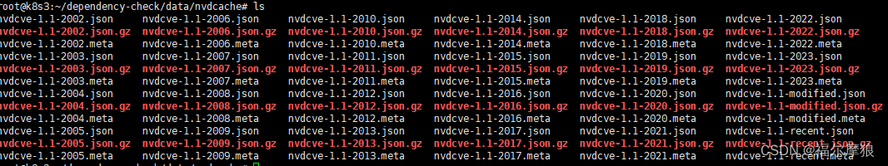

# 代码质量分析

- Java漏洞靶场是基于SpringBoot开发，目的是用来检测SAST工具的准确性[https://github.com/l4yn3/micro_service_seclab/](https://github.com/l4yn3/micro_service_seclab/)

## 代码质量

[Java代码检查工具的介绍](http://www.bjpowernode.com/hot/2157.html)

### 1.SonarQube 
是当前主流的开源代码质量扫描工具，支持自定义扫描规则，支持多种语言进行扫描
- SonarQube：[https://www.sonarqube.org/](https://www.sonarqube.org/)
- [Sonar介绍](https://blog.csdn.net/ZGL_cyy/article/details/131277109)
- [SonarQube代码质量管理教程](https://gitee.com/wst021sh/SonarQube-docs)
- [SonarQube 插件、权限、质量配置](https://blog.csdn.net/jlh21/article/details/106749216/)

### 2.CodeQL

CodeQL是GitHub代码扫描的核心工具（GitHub购买的），其利用QL语言对代码、执行流程等进行“查询”，以此实现对代码的安全性白盒审计，进行漏洞挖掘。
目前只开源了扫描规则和cli工具，引擎并未开源。

官网访问：[https://codeql.github.com/docs/codeql-overview/](https://codeql.github.com/docs/codeql-overview/)

核心工具：
- 规则仓库：[https://github.com/github/codeql](https://github.com/github/codeql)
- cli工具：下载后需要配置到环境变量中(path)[https://github.com/github/codeql-cli-binaries/releases](https://github.com/github/codeql-cli-binaries/releases)

介绍
- [「 CodeQL从入门到精通系列 」01.CodeQL简介](https://cheeker.blog.csdn.net/article/details/129569763)
- [「 CodeQL从入门到精通系列 」02.CodeQL安装指导及使用方式](https://cheeker.blog.csdn.net/article/details/129601588)
- [「 CodeQL从入门到精通系列 」03.CodeQL常用术语介绍](https://cheeker.blog.csdn.net/article/details/129743136)

使用案例：
- [CodeQL基础知识](https://zhuanlan.zhihu.com/p/479431942)
- vocode安装CodeQL插件。[vscode配置codeql使用教程](https://blog.csdn.net/Karka_/article/details/136170951)
- [java自动化审计](https://blog.csdn.net/Karka_/article/details/132823970)
- [CodeQL漏洞挖掘实战](https://blog.csdn.net/Karka_/article/details/134242491)
- [CodeQL分析XXL-JOB默认accessToken命令执行漏洞](https://zhuanlan.zhihu.com/p/666147730?utm_id=0)


原理：是把源代码转化成一个可查询的数据库，通过 Extractor 模块对源代码工程进行关键信息分析提取，构成一个关系型数据库。
CodeQL 的数据库并没有使用现有的数据库技术，而是一套基于文件的自己的实现。
对于编译型语言，Extractor 会监控编译过程，编译器每处理一个源代码文件，它都会收集源代码的相关信息，
如：语法信息（AST 抽象语法树）、语意信息（名称绑定、类型信息、运算操作等），控制流、数据流等，同时也会复制一份源代码文件。
而对于解释性语言，Extractor 则直接分析源代码，得到类似的相关信息。
关键信息提取完成后，所有分析所需的数据都会导入一个文件夹，这个就是 CodeQL database, 其中包括了源代码文件、关系数据、语言相关的 database schema（schema 定义了数据之间的相互关系）。

### 3.CodeDog

[https://github.com/Tencent/CodeAnalysis](https://github.com/Tencent/CodeAnalysis)
- 腾讯云代码分析（内部代号CodeDog）是集众多代码分析工具的云原生、分布式、高性能的代码综合分析跟踪管理平台， 其主要功能是持续跟踪分析代码，观测项目代码质量，支撑团队传承代码文化。


Java代码检查工具的介绍
http://www.bjpowernode.com/hot/2157.html
https://blog.csdn.net/ch98000/article/details/126664737

### 4.其他

1. PMD。官网[https://pmd.github.io/](https://pmd.github.io/)PMD是一个通过Github发布的免费、开源、静态代码审查工具
   - 评估java源代码的完整性，它还会报告一些降低代码效率的常见错误,发现出重复或不需要的代码部分和变量和不必要的对象。
   - 可以检测出可能危及安全性的硬编码代码或密码认证漏洞。
   - 发现了常见的代码漏洞，如未使用的变量、空的try语句、冗余的对象创建等等
   - 支持多种语言。
   - 当前很多主流的扫描工具底层会使用PMD，例如sonarQube
2. FindBugs[https://spotbugs.github.io/](https://spotbugs.github.io/)开源Java代码静态分析工具FindBugs是免费的
   - 发现代码部分中的缺陷和漏洞、逻辑前后不一致和安全威胁
   - SpotBugs工具是FindBugs的新版本
3. Checkstyle[https://checkstyle.sourceforge.io/](https://checkstyle.sourceforge.io/)
   - 可以定位于解决类设计不兼容、方法设计问题以及代码布局和格式错误。主要集中于代码的格式、命名规范等
4. SonarLint。SonarLint是另一个免费的开源Java代码检查工具，它根据自己的标准来检查代码以评估质量。是sonarQube的客户端工具
   - 该工具更适用于定位安全漏洞，并提供报告，和显示重复代码、给出代码复杂性和比较代码标准
5. Snyk。[https://snyk.io/product/snyk-code/](https://snyk.io/product/snyk-code/)
   - Snyk Code是一款新颖的静态Java代码审查工具，可以在开发人员编写代码时对Java源代码的安全漏洞进行漏洞分析。此工具可快速执行自动安全代码审查，在过程中很少有误报。
6. JArchitect：[官网](https://www.jarchitect.com/) ，静态Java源代码分析工具JArchitect会评估Java代码的复杂性。本地客户端，不适合大型项目使用
   - 它提供了一些功能，如代码查询、启用自定义代码、平台使用评估以确定修复代码漏洞的成本(与不修复代码漏洞的风险)以及通过代码审计检验过程。
   - 该工具还提供了代码标准的度量和统计分析。 
   - 识别代码度量，如算出代码复杂度(可能执行路径的数量)、源代码行、代码传入(传入)和传出(传出)耦合、嵌套和深度。
   - 生成报告，帮助找到可能出现的代码漏洞。

通常Checkstyle、FindBugs和PMD结合使用，以实现更强大专业的Java代码审计过程。

## 安全扫描
主要是针对项目中使用的依赖进行漏洞检查，需要扫描的内容比较多，所以并非每次CI流程都会进行该步骤，可以设置为定期检查。

主要包括：开源漏洞检查、开源协议检查等

### 1.dependency-check

相比其他工具准确率很高、误报率低、覆盖率高。

- [官网](https://owasp.org/www-project-dependency-check/)
- 源码：[https://github.com/jeremylong/DependencyCheck](https://github.com/jeremylong/DependencyCheck)
- [DependencyCheck+Jenkins扫描JAVA第三方依赖(CVE)漏洞](https://blog.csdn.net/u012280424/article/details/133296311)

#### 1.1.介绍
Dependency-Check 是 OWASP（Open Web Application Security Project）的一个实用开源程序，用于识别项目依赖项并检查是否存在任何已知的，公开披露的漏洞。
- 目前，已支持Java、.NET、Ruby、Node.js、Python等语言编写的程序，并为C/C++构建系统（autoconf和cmake）提供了有限的支持。
- 而且该工具还是OWASP Top 10的解决方案的一部分。 
- 支持面广（支持多种语言）、可集成性强，作为一款开源工具，已经支持和许多主流的软件进行集成，比如：命令行、Ant、Maven、Gradle、Jenkins、Sonar等；
- 具备使用方便，落地简单等优势。

工作原理：
1. 通过分析器对文件进行扫描搜集项目的依赖信息，包括vendor（供应商），product（产品）和version（版本）等，搜集到的信息被叫做迹象。
2. jarAnalyzer将从jar文件包中的Mainfest、pom.xml和包名进行信息搜集，然后把各种搜集到的源放到一个或者多个迹象表里。
3. 通过搜集到的迹象和CPE条目（NVD、CVE数据索引）进行匹配，分析器匹配到了就会给个标志发送到报告。
4. 目前不使用hash识别文件，因为第三方依赖从源码中的hash值构建通常不会匹配官方发布版本的hash。后续版本中可能会增加一些hash来匹配一些常用的第三方库，例如Spring, Struts等。

#### 1.2.安装使用
官网下载command line版本的解压后即可使用,提供了非常多的参数可以使用

```shell
查看详细的帮助文档：dependency-check.bat --advancedHelp


简单的使用案例：dependency-check.bat -n --project "my_project" -s "D:\my_project" -o D:\report\ -f JSON  --log scan.log
-n          不更新漏洞库，默认4小时自动拉取
--project   工程名，可与随意定义
–s          需要扫描的文件，可以是jar、war、zip、tar.gz、文件夹等。可以使用通配符表示多个，例如 **/*.jar
–o          报表生成的路径
-f          报表的输出格式，支持HTML, XML, CSV, JSON, JUNIT, SARIF, JENKINS, GITLAB or ALL
--disableRetireJS   不检查js，
--disableNodeJS     不检查nodejs
--log     记录日志

更新漏洞数据库：dependency-check.bat --updateonly
```

#### 1.3.扫描报告

报告中一些重要字段的含义：
- Dependency - 被扫描的第三依赖库名字
- CPE - 所有被识别出来的CPE.
- GAV - Maven 组, Artifact, 版本 (GAV).
- Highest Severity - 所有关联的cve的最高漏洞等级
- CVE Count - 关联的cve个数
- CPE Confidence - dependency-check正确识别cpe的程度
- Evidence Count - 识别CPE的数据个数

#### 1.4.内置缓存数据库
dependency-check默认使用内置的H2数据库，数据库文件是odc.mv.db，默认更新后再bin同级目录data下。

查看漏洞数据库，详情[https://jeremylong.github.io/DependencyCheck/data/cacheh2.html](https://jeremylong.github.io/DependencyCheck/data/cacheh2.html)
- 可以下载对应版本的h2数据库服务端，下载解压版，运行h2w.bat文件即可启动数据库。
- 将odc.mv.db复制到h2的bin目录
- 然后再浏览器自带打开控制台，jdbcurl中： jdbc:h2:{修改这里的名称} -> jdbc:h2:./odc
- 账号密码：dcuser  DC-Pass1337!

#### 1.5.搭建本地漏洞库
这里特指NVD数据库，可以使用工具[nist-data-mirror](https://github.com/stevespringett/nist-data-mirror)
一次性将NVD漏洞库（默认2020年以后的）,漏洞库就是JSON文件，一年一个文件。
```shell
java -jar /root/dependency-check/data/nist-data-mirror.jar /root/dependency-check/data/nvdcache
```


使用漏洞库
```shell
dependency-check.bat
   --cveUrlModified  本地nvd库地址，例如：D:/data/nvdcve-1.1-modified.json.gz
   --cveUrlBase      本地nvd库地址，例如 D:/data/nvdcve-1.1-2020.json.gz
   --project test -s D:\checkjar\ -o D:\report\
```

#### 1.6.常见问题

运行dependency-check.bat报错：[ERROR] Autoupdate is disabled and the database does not exist

通常首次运行时出现，执行updateonly命令即可。


### 2.OpenSCA-cli

悬镜开源的开源漏洞扫描工具：https://gitee.com/XmirrorSecurity/OpenSCA-cli


