# eclipse

官网[https://www.eclipse.org/](https://www.eclipse.org/)

## 1.新建工作空间之后的操作

1. General --> Workspace --> UTF-8

2. General --> Editors --> Associations --> JSP --> MyEclipse JSP Editor

3. 搜索jsp --> UTF-8

4. Java --> Installed JREs -->添加自己安装的jdk

5. 配置自己的Tomcat

6. 配置maven (1) installations 选择自己的maven (2)user settings 选择自己的配置，需要最后点击update settings。

7.关闭自动更新，windows->preferences->Inst all/Update取消勾选Automatically find new updates and notify me 即可

8. 关闭校验，可选。可以关闭关闭的校验

如果你是win7系统，还要修改字体：

[https://www.jetbrains.com/lp/mono/](https://www.jetbrains.com/lp/mono/)

推荐使用mono

第一步：C:\\Windows\\Fonts，找到Courier New，鼠标右键-->显示

第二步：Ceneral --> Appearance --> Colors and Fonts --> Basic --> Text Font --> Edit，选择 JetBrains Mono 字体

Eclipse在高分屏下图标过小的解决方法

[https://www.cnblogs.com/wenziii/p/5599310.html](https://www.cnblogs.com/wenziii/p/5599310.html)

## 2.规范类注释和方法注释

preferences-->java-->code style-->code templates

选中右边框内的comments-->Types,点击edit

推荐的模板：

```java
/**
 * @Project: ${project_name}
 * @Title: ${type_name}
 * @Description: ${todo}
 * @author: ${user}
 * @date: ${date}${time}
 * @company: webyun
 * @Copyright: Copyright (c) 2015
 * @version v1.0
 */
```

-->ok-->Apply

方法的注释
```java
/**
 * @Title: ${todo}
 * ${tags}
 * @Description: ${todo}
 * @date: ${date}${time}
 * @author: ${user}
 */
```

## 3.自定义代码自动补全

1.每次输入都自动提示

设置Window->preferences->Java->Editor->Content Assist

再右下角Auto activation triggers for Java里面改为

```text
abcdefghijklmnopqrstuvwxyzABCDEFGHIJKLMNOPQRSTUVWXYZ({[
```

这样每次输入上面字母都会自动提示了

你还可以修改下Auto activation delay,修改一下提示的延迟。


2.用alt+/手动控制自动提示（推荐）

Window->preferences->General->Keys 找到Content Assist

首先Remove Binding(移除绑定),然后再Binding（按下Alt+/）

When中选Editing Text就可以，OK

现在在写代码的时候按下Alt+/就会有自动提示了。


## 4.安装插件

eclipse marketplace加速

Preferences>General>Network Connections，如图中红色区域添加“8.8.8.8”谷歌dns即可解决

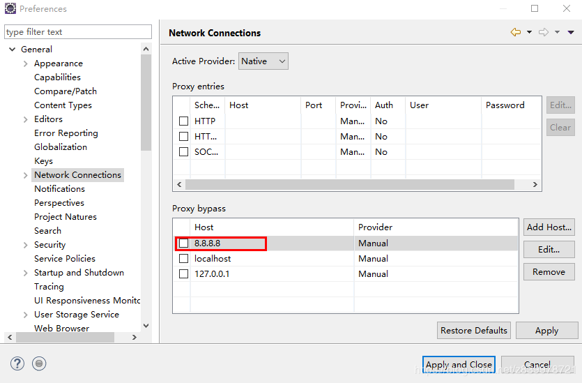

### 4.1.sts

spring 工具集，包括spring boot创建功能

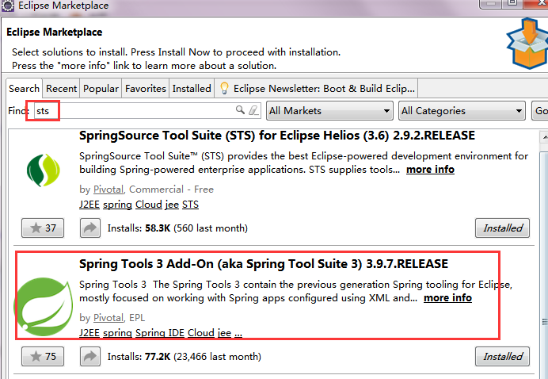


安装之后，修改配置和类的试试，会自动更新spring。需要配置下关闭自动更新，beans support ,选择 disable auto config detection。

### 4.2.mybatis插件mybatipse

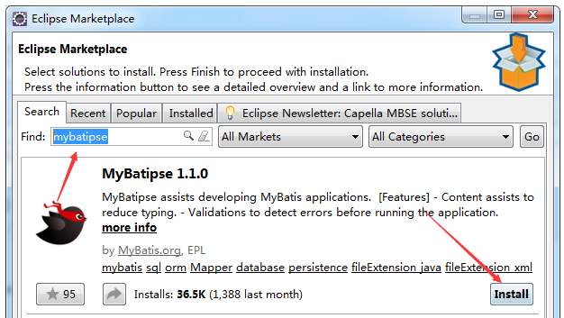


1：要查找某一个方法  

在dao接口中某一个方法中 按住 Ctrl键 鼠标指到方法名称上 选择open xml 就会自动跳转

2：自动生成resultMap  安装键盘 alt + / 会弹出提示框

3：引用resultMap

4：对mapper文件进行检查 会自动根据 domain文件进行检查 每次修改xml文件时都会进行检查 很费性能。等写完以后可以在进行检查 检查完以后可以在关闭


### 4.3.P3C

阿里巴巴的代码检验工具

Help >> Install New Software then enter this update site URL

[https://p3c.alibaba.com/plugin/eclipse/update](https://p3c.alibaba.com/plugin/eclipse/update)

### 4.4. MAT

分析JVM dump 文件

### 4.5.Decompiler

反编译插件
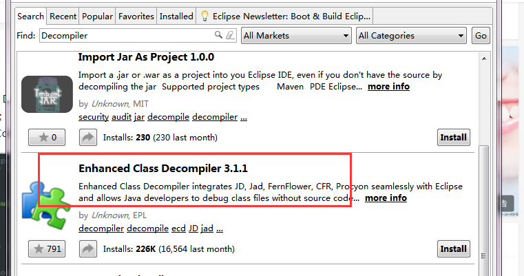

设置
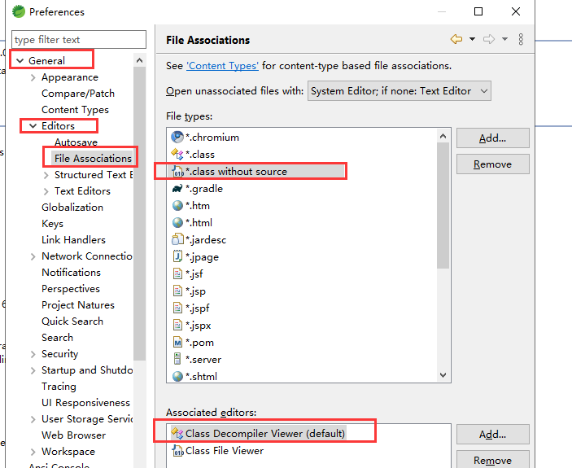

### 4.6.findbugs

Help->InstallNew Software

[http://findbugs.cs.umd.edu/eclipse](http://findbugs.cs.umd.edu/eclipse)

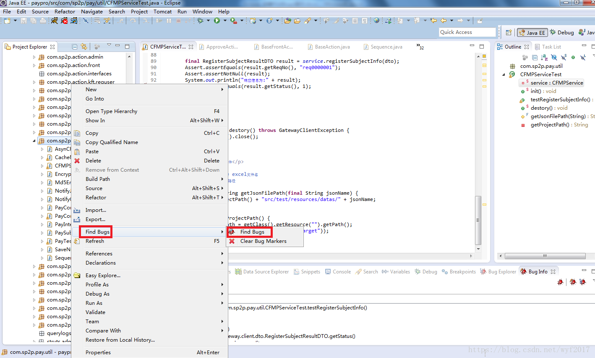

### 4.7.lombok

1.下载 lombok.jar(https://projectlombok.org/download.html)

2.将 lombok.jar  放在eclipse安装目录下，和 eclipse.ini 文件平级的。

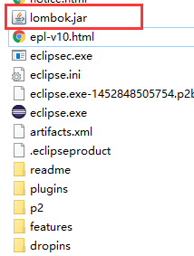


3.运行lombok.jar。在lombok.jar 的目录下，运行：

`java -jar lombok.jar`

a.运行后会弹框如下框，直接点确定

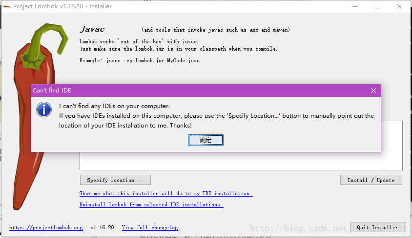

b.点specify location
按钮，选择eclipse的安装目录，选择到eclipse层即可。

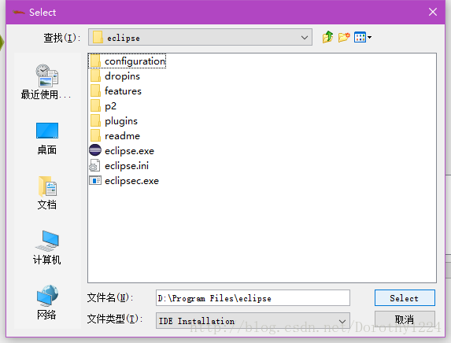

按如下图步骤点击install即可

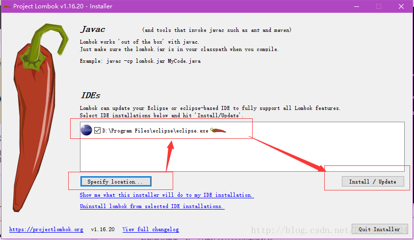

c.成功后如下图：

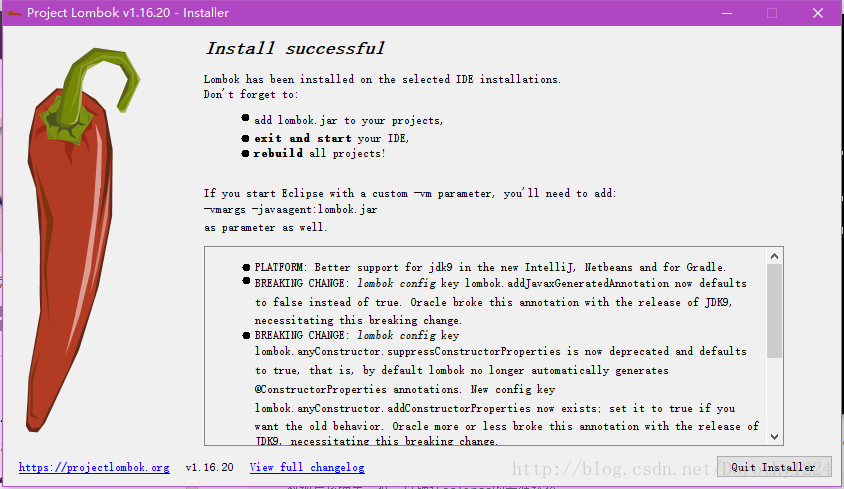

黑框框也多了很多log：

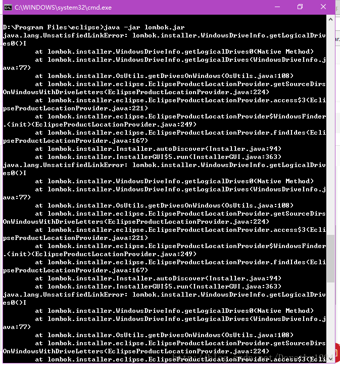


4.如果想看看是否真的安装成功，可以在
    eclipse.ini 中看看，我的环境是多了一行(-javaagent:D:\\Program
    Files\\eclipse\\lombok.jar)


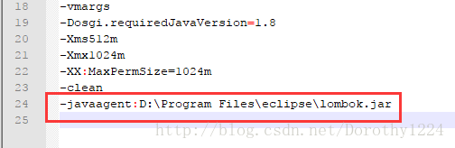


5.重启eclipse，再clean project。

### 4.8.uml

教程：[https://www.jianshu.com/p/6239c916fc83](https://www.jianshu.com/p/6239c916fc83)

安装GEF:[http://download.eclipse.org/tools/gef/gef4/updates/releases](http://download.eclipse.org/tools/gef/gef4/updates/releases)

安装AmaterasUML：[https://takezoe.github.io/amateras-update-site/](https://takezoe.github.io/amateras-update-site/)


## 5.书签

Eclipse中可以在编辑器的任意一行添加书签。您可以使用书签作为提示信息，或者使用书签快速定位到文件中的指定的行

### 5.1.添加书签

如果你想设置书签，你只需要在垂直标尺上右击鼠标并选择能 "Add Bookmark" 即可。

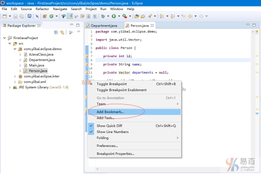

输入书签名称，如下图所示

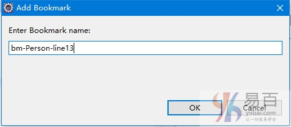

垂直标尺中会出现书签图标。 此外，在“书签(Bookmark)”视图中的表中添加了一行。

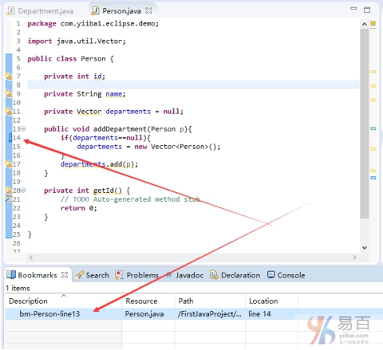

### 5.2.打开书签视图

要打开书签视图 - 单击窗口菜单，然后选择Show View → Other。

在过滤器文本框中输入Bookmark。

在General下，选择Bookmark。

单击确定(Ok)。

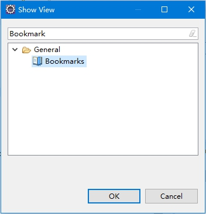


使用书签视图

“书签”视图显示在工作区中的资源中放置书签。

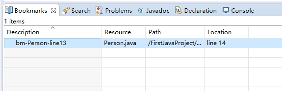


## 6.任务管理

程序员喜欢在它们的代码中放置TODO标记，用作对需要完成的任务的提醒。其中包含单词TODO的Java代码中的注释将被识别为任务，并显示在标记栏和任务视图中。

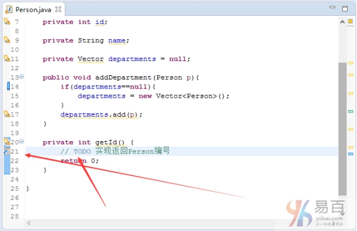

### 6.1.添加任务

Eclipse编辑器可用于通过右键单击标记栏并选择添加任务来将任务与正在编辑的文件相关联。
在出现的对话框中输入任务描述，并从优先级下拉列表中选择一个优先级，然后单击确定(Ok)按钮。

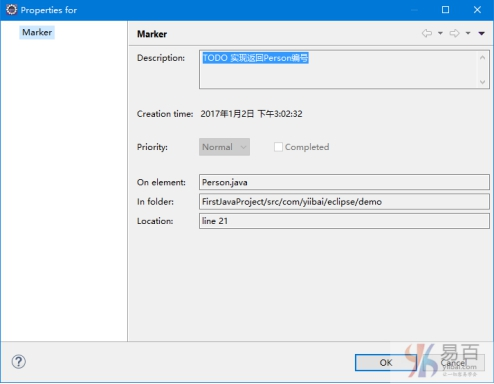

### 6.2.删除任务

要使用Eclipse编辑器删除任务，请右键单击标记栏中的任务图标，然后选择“删除任务(Remove task tag)”菜单项。

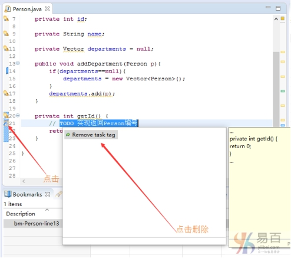

### 6.3.打开任务视图

要打开“任务(Tasks)”视图 - 单击窗口菜单，然后选择Show View → Other。

在过滤器文本框中输入Tasks。

在General下，选择Tasks。

单击“确定(OK)”。

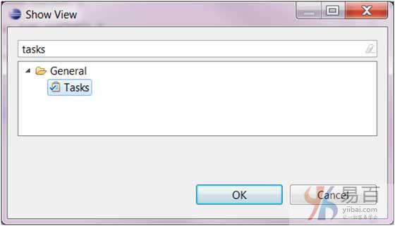

使用任务视图

任务视图可用于查看所有任务并添加与任何资源不相关的任务。

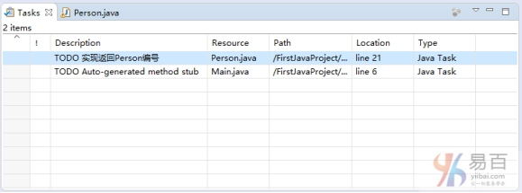

它也可以用于
- 更改与任务相关联的优先级。
- 将任务标记为已完成。
- 删除任务或所有已完成的任务。


## 7.其他

### 7.1.创建jsp模板

eclipse默认创建的jsp，很多的时候不是我们希望要的。所以需要我们去创建新的模板


设置步骤如下： eclipse -- >perferences - >web ->jsp - jsp files -Editor ->templates 在这里可以设置模板。

```java
######################################  代码如下  #################################################
<%@ page language="java" contentType="text/html; charset=UTF-8" pageEncoding="UTF-8"%>
<%
    String path = request.getContextPath();
    String basePath = request.getScheme()+"://"+request.getServerName()+":"+request.getServerPort()+path+"/";
    %>
<!DOCTYPE HTML PUBLIC "-//W3C//DTD HTML 4.01 Transitional//EN">
<html>
<head>
<base href="<%=basePath%>">
<title>标题</title>
<meta http-equiv="pragma" content="no-cache">
<meta http-equiv="cache-control" content="no-cache">
<meta http-equiv="expires" content="0">
<meta http-equiv="keywords" content="keyword1,keyword2,keyword3">
<meta http-equiv="description" content="This is my page">
</head>
<body>
	${cursor}
</body>
</html>
######################################  代码 end  #################################################
```
注意要将：context设置成New JSP,之后创建jsp的时候，选择自己创建的模板就可以啦。


