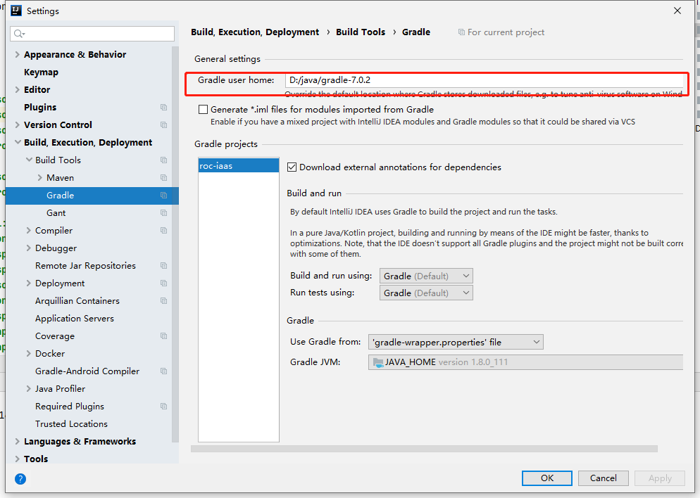
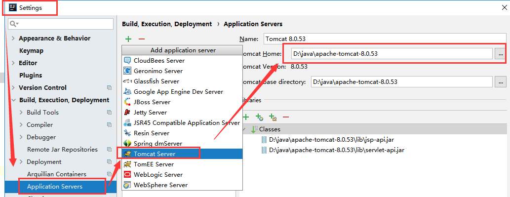
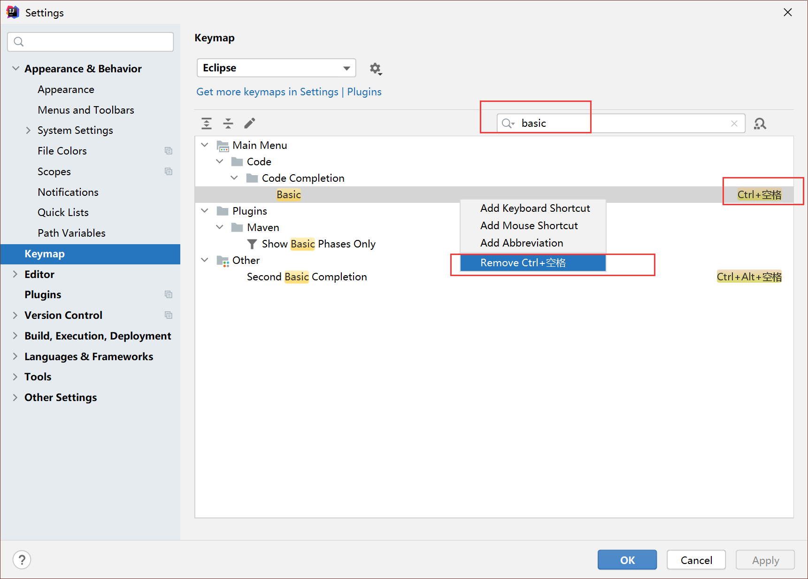
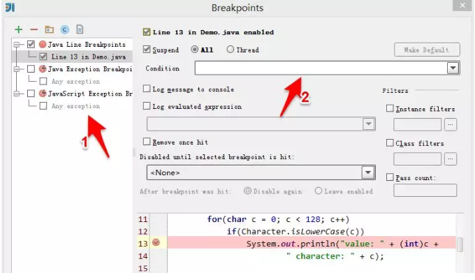

# idea

- [IDEA 2023.1 正式发布，新特性真香](https://mp.weixin.qq.com/s/E8nMygufsUCHGf-OtYRmRA)
- [IDEA 2022.3 发布，终于支持 redis 了](https://mp.weixin.qq.com/s/ZaZur67S1WbRZR00UIQllg)
- [IDEA 2022.2 发布](https://mp.weixin.qq.com/s/UNb-VQBqaeCSVTQAxWENdg)
- [IntelliJ IDEA 2022正式发布](https://mp.weixin.qq.com/s/zV_CjQ5iWcjm8oilLZhz-g)
- [IntelliJ IDEA 2021.3](https://mp.weixin.qq.com/s/EAIuCV78jCkD0SAmNpBm-Q)
- [IntelliJ IDEA 2021.2 正式发布](https://mp.weixin.qq.com/s/JHQkiHdx4E0MRvf_CeCALQ)
- [IDEA 2021.1版本正式发布，完美支持WSL 2](https://mp.weixin.qq.com/s/ku6T7fbCbVM0SDcf6ZPijw)

- [idea乱码解决方式大汇总](https://blog.csdn.net/weixin_43185154/article/details/131704184)

## 1.介绍

JetBrains成立于2000年，是家私人持股的公司（private company）。主要开发开发工具。为各种开发语音、开发环境、开发流程，
实现一站式解决方案。其提供的开发工具，有免费的社区版以及收费的商业版（非常贵）。

官网: [https://www.jetbrains.com/](https://https://www.jetbrains.com/)

## 2.配置

### 2.1. 同步配置

导出/导入配置功能无法满足基本需求，还是使用账户同步比较好 PS：很多配置都可以设置为全局配置，我们一般设置新增项目的配置即可。


### 2.2 Appearance & Behavior

#### 2.2.1 界面的字体

界面的字体，不是编辑器。


#### 2.2.2 主题颜色


#### 2.2.3 背景色


#### 2.2.4 取消默认开发项目


### 2.3 Keymap

看后面

### 2.4 Editor

#### 2.4.1 自动导包和智能移除


#### 2.4.2 取消大小写敏感


#### 2.4.3 调整字体类型和字体大小


#### 2.4.4 自动生成serialVersionUID

搜索serialization issues，勾选上即可。


#### 2.4.5 参数自动补全提示

Idea暂时不能做到像eclipse那样自动补全调用函数的参数，但是可以进行提示


效果如下：


#### 2.4.6 注释去掉斜体


#### 2.4.7 双斜杠注释改成紧跟代码头


#### 2.4.8 取消tab页单行显示


#### 2.4.9 显示行号和方法分割线


#### 2.4.10.不显示usage 和 author

新安装的idea显示usage 和 author，导致界面不够优雅，可以关闭


### 2.5 Plugins

见下面专题

### 2.6 Version Control

#### 2.6.1 Git


#### 2.6.2 优化版本控制的目录颜色展示


### 2.7 Build, Execution, Deployment

#### 2.7.1 Gradle



配置执行main/test方法时，不编译整个项目


#### 2.7.2 Maven


- 右侧直接点击 Maven Project 管理插件 ，记得先打开常用工具栏


- maven编译时跳过测试


- profiles多环境配置选择


- 查看依赖


#### 2.7.3 tomcat



- 当前项目的tomcat


- 选择要部署的内容


- 执行main/test方法时不编译整个项目


Delegate IDE build/run actions to maven 配置的影响:
[https://blog.csdn.net/wojiushiwo945you/article/details/108053337](https://blog.csdn.net/wojiushiwo945you/article/details/108053337)

#### 2.7.4 自动编译

说明：开启自动编译之后，结合Ctrl+Shift+F9 会有热更新效果。


运行时自动编译（Runtime），不要手动编译

具体步骤： 敲击 Ctrl + Shift + Alt + / 然后双击Shift搜索进入Registry ，找到compiler.automake.allow.when.app.running ，然后勾选上。


idea2021以后的版本，该配置放到了settings中。选择即可开启自动运行时编译


### 2.8 Languages & Frameworks

### 2.9 Tools

### 2.10 其他

#### 2.10.1 jdk


#### 2.10.2 打开常用工具栏


#### 2.10.3 重启

[重启](https://blog.csdn.net/che_j/article/details/90720716)

## 3.快捷键

### 3.1 常用快捷键

将快捷键设置为跟Eclipse一样：很多人可能并不习惯IDEA的快捷键，为了方便，这里我们将快捷键设置为跟 Eclipse一样。


我的快捷键（Eclipse风格）

| 功能                  | 快捷键                                            |
| ----------------------- | --------------------------------------------------- |
| 快速删除一行          | ctrl + D                                          |
| 撤销上一步操作        | ctrl + Z                                          |
| 快速复制一行数据      | ctrl + alt + ↓                                   |
| 移动一行数据          | alt + ↓                                          |
| 转为大写/小写         | ctrl + shift + x 或者 ctrl + shift + y            |
| 文件内快速查找        | ctrl + F 填写查询的内容， ctrl + K 迅速找到下一个 |
| 重新编译              | Ctrl+Shift+F9                                     |
| 智能编码              | alt + enter                                       |
| System.out.println(); | 快捷键sout                                        |

### 3.2 代码提示 Alt + /

idea默认的是Ctrl + 空格，但是这个和Windows中的快捷键切换冲突，所以我们还是改成Eclipse中的快捷键Alt + /

首先把默认的快捷键删除



然后修改为我们想要的快捷键


### 3.3 getter setter 构造器 tostring等

快捷键： alt + insert 或者 shift + alt + s


### 3.4 代码变量补全


## 4.使用技巧

### 4.1 Debug

#### 4.1.1 设置断点

选定要设置断点的代码行，在行号的区域后面单击鼠标左键即可。


#### 4.1.2 开启调试会话

IDE下方出现Debug视图，红色的箭头指向的是现在调试程序停留的代码行，方法f2()中，程序的第11行。 红色箭头悬停的区域是程序的方法调用栈区。在这个区域中显示了程序执行到断点处所调用过的所用方法，越下面的方法被调用的越早。


#### 4.1.3 单步调试

##### 4.1.3.1 step over


点击红色箭头指向的按钮，程序向下执行一行（如果当前行有方法调用，这个方法将被执行完毕返回，然后到下一行）

##### 4.1.3.2 step into


点击红色箭头指向的按钮，程序向下执行一行。如果该行有自定义方法，则运行进入自定义方法（不会进入官方类库的方法）。具体步骤如下：

在自定义方法发f1()处设置断点，执行调试


点击


##### 4.1.3.3  Force step into


该按钮在调试的时候能进入任何方法。

##### 4.1.3.4 step out


如果在调试的时候你进入了一个方法(如f2())，并觉得该方法没有问题，你就可以使用stepout跳出该方法，返回到该方法被调用处的下一行语句。值得注意的是，该方法已执行完毕。

##### 4.1.3.5 Drop frame


点击该按钮后，你将返回到当前方法的调用处（如上图，程序会回到main()中）重新执行，并且所有上下文变量的值也回到那个时候。只要调用链中还有上级方法，可以跳到其中的任何一个方法。

#### 4.1.4 高级调试

##### 4.1.4.1 跨断点调试

设置多个断点，开启调试。


想移动到下一个断点，点击如下图：


程序将运行一个断点到下一个断点之间需要执行的代码。如果后面代码没有断点，再次点击该按钮将会执行完程序。

##### 4.1.4.2 查看断点


点击箭头指向的按钮，可以查看你曾经设置过的断点并可设置断点的一些属性。



箭头1指向的是你曾经设置过的断点，箭头2可以设置条件断点（满足某个条件的时候，暂停程序的执行，如 c==97）。结束调试后，应该在箭头1处把所设的断点删除(选择要删除的断点后，点击上方的红色减号）。

##### 4.1.4.3 修改内存数据


调试开始后，右键弹框，选择“Evaludate Expression”。可以执行Java代码，修改现有的数据。


或者再debug窗口，在Variables中邮件选择“set Value”进行修改。


##### 4.1.4.4 可视化调试stream

Idea自带的可视化功能。正常debug即可


##### 4.1.4.5 查看某个变量

很多时候Variables中的内容非常多，我们可以在watches窗口，选择需要查看的变量。效果与Variables一样。


##### 4.1.4.6 查看内存中对象数量
通过类名字查询，count是对象数量，diff是两次查看时，数量的变化。


##### 4.1.4.7 查看断点执行的次数与耗时
Hits是执行册数，time是点断平均执行时长


##### 4.1.4.8 debug扩展功能
debug窗口最后的...打开后是如下功能，顾名思义可以强制返回方法，抛出异常，获得线程栈数据，执行表达式等操作。


### 4.3 后缀补全法

这个功能可以使用代码补全来模板式地补全语句，如遍历循环语句（for、foreach）、使用 String.format()
包裹一个字符串、使用类型转化包裹一个表达式、根据判（非）空或者其它判别语句生成 if 语句、用 instanceOf 生成分支判断语句等。 使用的方式也很简单，就是在一个表达式后按下点号 .
，然后输入一些提示或者在列表中选择一个候选项，常见的候选项下面会给出 GIF 演示。

1. var 声明
2. null 判空
3. notnull 判非空
4. nn 判非空
5. for 遍历
6. fori 带索引的遍历
7. not 取反
8. if 条件判断
9. cast 强转
10. return 返回值

### 4.4 coverage覆盖率

[使用教程](https://blog.csdn.net/qq_31702847/article/details/104866713)

设置use traceing可以查看覆盖到的代码命中次数


### 4.5 快速重构代码


### 4.6 将代码直接抽离出来独立方法


### 4.7 查看接口实现类

比如我们要查看put方法的实现（主要是想要看HashMap的实现）

```
Map<String, String> map=new HashMap<>();
    map.put("1","2");
```


或者将上面的内容选中固定，可以固定在左下角的find里面，结果会保存到下面，并且展示为包的结构


### 4.8 查看类的集成实现关系链

快捷键 F4


可以设置筛选范围：


选择自定义的scope就行了


### 4.9 查看方法的调用链

快捷键 ctrl + alt + h。 可以一层一层的查看调用链

第一个是向外的调用关系


第二个是向内的调用关系（方便学习源码）


方式二：IntelliJ IDEA的"Find Usage"可以查看一个Java类、方法或变量的直接使用情况。

快捷键是 ctrl + G


### 4.10 查看字段的使用情况

IntelliJ IDEA中可以在主菜单中选择Analyze | Dataflow from/to Here两个命令查看表达式、变量和方法参数的传递关系树。


### 4.11 查看一个类的实现与继承情况

[使用教程](https://mp.weixin.qq.com/s/F7Z_Sdcq-TNKp6FdAH9zog)


### 4.12 全局替换或搜索


### 4.13 生成环绕代码

快捷键： shift + alt + z


## 5.插件

### 5.1 GitToolBox


### 5.2 CheckStyle

- 安装插件


- 可以添加check规则


check文件：[tencent_checks.xml](./file/tencent_checks.xml)

- 使用方式


### 5.3 save actions

[save actions使用](https://blog.csdn.net/weixin_44712778/article/details/117332374)

- 安装插件，用于在保存的时候，触发事件。【当前是保存的时候格式化代码格式】


- 导入外部代码格式


style文件：[Idea-CodeStyle.xml](./file/Idea-CodeStyle.xml)

- 手动格式化代码


### 5.4 GenerateAllSetter


使用案例：


### 5.5 GsonFormat

Json生成Java实体类


### 5.6 Nyan Progress Bar

小火车彩虹进度条，冲冲冲！


### 5.7 Rainbow Brackets

彩虹括号

### 5.8 Translation

翻译工具


配置


使用


### 5.9 JRebel

[教程](https://blog.csdn.net/lianghecai52171314/article/details/105637251)

修改配置文件不生效问题解决：


### 5.10 MybatisX

[教程](https://mp.baomidou.com/guide/mybatisx-idea-plugin.html#%E5%8A%9F%E8%83%BD)

### 5.11 Codota 代码智能提示插件

需要绑定GitHub，它会学习你的代码，根据你的代码习惯自动提示，并给出使用频率


### 5.12 CodeGlance

显示代码缩略图插件

### 5.13 MetricsReloaded

代码复杂度检查插件


### 5.14 statistic

代码统计插件，安装后即可使用


### 5.15 SequenceDiagram

时序图，观察调用关系


### 5.16 Paste images into Markdown

Markdown 图片操作工具

教程： https://baijiahao.baidu.com/s?id=1711783245572302580&wfr=spider&for=pc

### 5.17 markdown edit

Markdown编辑工具

开源地址： https://github.com/shuzijun/markdown-editor/blob/main/README_ZH.md

### 5.18 Jump To Line

debug插件，方便我们debug时，可以在单个栈帧内跳转到任意一行代码。


### 5.19.spring boot helper
idea 社区版，无法创建spring boot项目。可以安装这个插件。

### 5.20.maven helper

以树状结构展示整个依赖，相比idea提供的树状图，能看到更加清晰的内容和依赖关系。


### 5.21.自动生成单测代码
- Squaretest。【idea插件，收费】非常好用、非常智能的单测代码生成工具。官网：[https://squaretest.com/](https://squaretest.com/)
- TestMe。【idea插件】自动生成 Java JUnit 4/5, TestNG 单元测试 自动生成 Mockito mocks 自动生成 测试参数和断言语句 自动生成相关 mock 方法

推荐使用TestMe。
- 优点：Spring 的 Bean 生成单测代码时，即使 @Component 这类注解标注，属性通过 Setter 注解注入时，也会自动给添加 @Mock 和 @InjectMock 这类属性。 
- 缺点：默认模板会在生成的方法上都加上 throws Exception

功能：
1. 支持生成多种单测框架的代码。
2. 支持自定义代码模板

## 6. 常见问题
<p style="color: red;">问题1：A problem occurred starting process 'command 'C:/Program Files/Java/jdk1.8.0_221/bin/java.exe''</p>

java启动命令行太长，修改执行命令的方式即可。


<p style="color: red;">问题2：idea 2020.1.1使用gradle构建项目build sync fail:Starting Gradle Daemon...问题的解决方法</p>

gradle在多jdk环境中无法正常使用

https://blog.csdn.net/qq_30019911/article/details/106696446

<p style="color: red;">问题3：Intellij IDEA 编译报错，忽略错误，运行</p>

https://blog.csdn.net/u012485012/article/details/59482292/

<p style="color: red;">问题4：Git 提交时，message窗口无法切换中文</p>

help -> edit custom vm options 增加下面的配置
```text
-Drecreate.x11.input.method=true
```

<p style="color: red;">问题5：spring boot 创建时连接超时</p>
可以换一个start，比如： https://start.aliyun.com


<p style="color: red;">问题6：官网下载JetBrains Mono字体</p>

[https://www.jetbrains.com/lp/mono/](https://www.jetbrains.com/lp/mono/)

<p style="color: red;">问题7：failed to transfer from http://0.0.0.0/ during a previous attempt</p>
拉取仓库的时候报错。 maven在3.8.1 的默认配置文件中增加了一组标签，如果仓库镜像是http 而不是https 就会被拦截禁止访问,而公司私服一般是http 而不支持https.

解决方案： 注释掉maven里的这个默认拦截配置

- Mac下idea自带maven文件路径/Applications/IntelliJ IDEA.app/Contents/plugins/maven/lib
- Linux 下idea自带maven文件路径 /opt/apps/IntelliJ IDEA/.....
- 配置文件位置./maven3/conf/settings.xml， 将该组mirror标签注释掉即可

<p style="color: red;">问题8：Terminal修改环境变量不生效</p>
问题：当修改了环境变量，但是IDEA的terminal中环境变量不生效 重启idea也不生效 

原因：idea会在开机首次打开时加载path并序列化到自己的配置文件中，即使重启IDEA也只是重新加载自己的配置文件

解决办法1：重启电脑

解决办法2：（1）用 path命令查看当前的环境变量（2）`set path= 。。。。。`命令写入修改后的环境变量

<p style="color: red;">问题7：markdown编辑代码块时，会提示各种错误</p>

关闭markdown的代码注入功能。顺带着语法校验就也没了。


## 7.进阶技巧

### 7.1.破解

最新激活工具：[http://www.idejihuo.com/](http://www.idejihuo.com/)

工具： [JetbrainsPatch_20210101.zip](file/JetbrainsPatch_20210101.zip)

1.将工具拖拽到idea的编辑窗口内。会提示安装成功是否重启。这里重启即可。

2.在hosts中加入
```text
127.0.0.1 jrebel.npegeek.com
```

3.输入激活码
Help → Regsiter → activtion code
```text
BISACXYELK-eyJsaWNlbnNlSWQiOiJCSVNBQ1hZRUxLIiwibGljZW5zZWVOYW1lIjoiQ2hpbmFOQiIsImFzc2lnbmVlTmFtZSI6IiIsImFzc2lnbmVlRW1haWwiOiIiLCJsaWNlbnNlUmVzdHJpY3Rpb24iOiIiLCJjaGVja0NvbmN1cnJlbnRVc2UiOmZhbHNlLCJwcm9kdWN0cyI6W3siY29kZSI6IklJIiwicGFpZFVwVG8iOiIyMDk5LTEyLTMxIiwiZXh0ZW5kZWQiOmZhbHNlfSx7ImNvZGUiOiJBQyIsInBhaWRVcFRvIjoiMjA5OS0xMi0zMSIsImV4dGVuZGVkIjpmYWxzZX0seyJjb2RlIjoiRFBOIiwicGFpZFVwVG8iOiIyMDk5LTEyLTMxIiwiZXh0ZW5kZWQiOnRydWV9LHsiY29kZSI6IlJTQyIsInBhaWRVcFRvIjoiMjA5OS0xMi0zMSIsImV4dGVuZGVkIjp0cnVlfSx7ImNvZGUiOiJQUyIsInBhaWRVcFRvIjoiMjA5OS0xMi0zMSIsImV4dGVuZGVkIjpmYWxzZX0seyJjb2RlIjoiUlNGIiwicGFpZFVwVG8iOiIyMDk5LTEyLTMxIiwiZXh0ZW5kZWQiOnRydWV9LHsiY29kZSI6IkdPIiwicGFpZFVwVG8iOiIyMDk5LTEyLTMxIiwiZXh0ZW5kZWQiOmZhbHNlfSx7ImNvZGUiOiJETSIsInBhaWRVcFRvIjoiMjA5OS0xMi0zMSIsImV4dGVuZGVkIjp0cnVlfSx7ImNvZGUiOiJDTCIsInBhaWRVcFRvIjoiMjA5OS0xMi0zMSIsImV4dGVuZGVkIjpmYWxzZX0seyJjb2RlIjoiUlMwIiwicGFpZFVwVG8iOiIyMDk5LTEyLTMxIiwiZXh0ZW5kZWQiOnRydWV9LHsiY29kZSI6IlJDIiwicGFpZFVwVG8iOiIyMDk5LTEyLTMxIiwiZXh0ZW5kZWQiOnRydWV9LHsiY29kZSI6IlJEIiwicGFpZFVwVG8iOiIyMDk5LTEyLTMxIiwiZXh0ZW5kZWQiOmZhbHNlfSx7ImNvZGUiOiJQQyIsInBhaWRVcFRvIjoiMjA5OS0xMi0zMSIsImV4dGVuZGVkIjpmYWxzZX0seyJjb2RlIjoiUlNWIiwicGFpZFVwVG8iOiIyMDk5LTEyLTMxIiwiZXh0ZW5kZWQiOnRydWV9LHsiY29kZSI6IlJTVSIsInBhaWRVcFRvIjoiMjA5OS0xMi0zMSIsImV4dGVuZGVkIjpmYWxzZX0seyJjb2RlIjoiUk0iLCJwYWlkVXBUbyI6IjIwOTktMTItMzEiLCJleHRlbmRlZCI6ZmFsc2V9LHsiY29kZSI6IldTIiwicGFpZFVwVG8iOiIyMDk5LTEyLTMxIiwiZXh0ZW5kZWQiOmZhbHNlfSx7ImNvZGUiOiJEQiIsInBhaWRVcFRvIjoiMjA5OS0xMi0zMSIsImV4dGVuZGVkIjpmYWxzZX0seyJjb2RlIjoiREMiLCJwYWlkVXBUbyI6IjIwOTktMTItMzEiLCJleHRlbmRlZCI6dHJ1ZX0seyJjb2RlIjoiUERCIiwicGFpZFVwVG8iOiIyMDk5LTEyLTMxIiwiZXh0ZW5kZWQiOnRydWV9LHsiY29kZSI6IlBXUyIsInBhaWRVcFRvIjoiMjA5OS0xMi0zMSIsImV4dGVuZGVkIjp0cnVlfSx7ImNvZGUiOiJQR08iLCJwYWlkVXBUbyI6IjIwOTktMTItMzEiLCJleHRlbmRlZCI6dHJ1ZX0seyJjb2RlIjoiUFBTIiwicGFpZFVwVG8iOiIyMDk5LTEyLTMxIiwiZXh0ZW5kZWQiOnRydWV9LHsiY29kZSI6IlBQQyIsInBhaWRVcFRvIjoiMjA5OS0xMi0zMSIsImV4dGVuZGVkIjp0cnVlfSx7ImNvZGUiOiJQUkIiLCJwYWlkVXBUbyI6IjIwOTktMTItMzEiLCJleHRlbmRlZCI6dHJ1ZX0seyJjb2RlIjoiUFNXIiwicGFpZFVwVG8iOiIyMDk5LTEyLTMxIiwiZXh0ZW5kZWQiOnRydWV9LHsiY29kZSI6IkRQIiwicGFpZFVwVG8iOiIyMDk5LTEyLTMxIiwiZXh0ZW5kZWQiOnRydWV9LHsiY29kZSI6IlJTIiwicGFpZFVwVG8iOiIyMDk5LTEyLTMxIiwiZXh0ZW5kZWQiOnRydWV9XSwibWV0YWRhdGEiOiIwMTIwMjAwNzI4RVBKQTAwODAwNiIsImhhc2giOiIxNTAyMTM1NC8wOi0xMjUxMTE0NzE3IiwiZ3JhY2VQZXJpb2REYXlzIjowLCJhdXRvUHJvbG9uZ2F0ZWQiOmZhbHNlLCJpc0F1dG9Qcm9sb25nYXRlZCI6ZmFsc2V9-H7NUmWcLyUNV1ctnlzc4P79j15qL56G0jeIYWPk/HViNdMg1MqPM7BR+aHR28yyuxK7Odb2bFDS8CeHNUtv7nT+4fUs85JJiqc3wc1psRpZq5R77apXLOmvmossWpbAw8T1hOGV9IPUm1f2O1+kLBxrOkdqPpv9+JanbdL7bvchAid2v4/dyQMBYJme/feZ0Dy2l7Jjpwno1TeblEAu0KZmarEo15or5RUNwtaGBL5+396TLhnw1qL904/uPnGftjxWYluLjabO/uRu/+5td8UA/39a1nvGU2nORNLk2IdRGIheiwIiuirAZrII9+OxB+p52i3TIv7ugtkw0E3Jpkw==-MIIDlzCCAn+gAwIBAgIBCTANBgkqhkiG9w0BAQsFADAYMRYwFAYDVQQDEw1KZXRQcm9maWxlIENBMCAXDTE4MTEwMTEyMjk0NloYDzIwOTkwODA5MDIyNjA3WjBoMQswCQYDVQQGEwJDWjEOMAwGA1UECBMFTnVzbGUxDzANBgNVBAcTBlByYWd1ZTEZMBcGA1UEChMQSmV0QnJhaW5zIHMuci5vLjEdMBsGA1UEAxMUcHJvZDN5LWZyb20tMjAxODExMDEwggEiMA0GCSqGSIb3DQEBAQUAA4IBDwAwggEKAoIBAQCdXyaNhhRySH1a8d7c8SlLLFdNcQP8M3gNnq7gudcpHC651qxRrN7Qks8gdXlIkA4u3/lp9ylp95GiIIDo4ydYje8vlTWDq02bkyWW/G7gZ3hkbBhRUK/WnNyr2vwWoOgwx5CfTRMjKkPkfD/+jffkfNfdGmGcg9yfnqPP9/AizKzWTsXSeS+0jZ8Nw5tiYFW+lpceqlzwzKdTHug7Vs0QomUPccRtZB/TBBEuiC7YzrvLg4Amu0I48ETAcch/ztt00nx/oj/fu1DTnz4Iz4ilrNY+WVIEfDz/n3mz+PKI9kM+ZeB0jAuyLsiC7skGpIVGX/2HqmZTtJKBZCoveAiVAgMBAAGjgZkwgZYwSAYDVR0jBEEwP4AUo562SGdCEjZBvW3gubSgUouX8bOhHKQaMBgxFjAUBgNVBAMMDUpldFByb2ZpbGUgQ0GCCQDSbLGDsoN54TAJBgNVHRMEAjAAMBMGA1UdJQQMMAoGCCsGAQUFBwMBMAsGA1UdDwQEAwIFoDAdBgNVHQ4EFgQUYSkb2hkZx8swY0GRjtKAeIwaBNwwDQYJKoZIhvcNAQELBQADggEBAJZOakWgjfY359glviVffBQFxFS6C+4WjYDYzvzjWHUQoGBFKTHG4xUmTVW7y5GnPSvIlkaj49SzbD9KuiTc77GHyFCTwYMz+qITgbDg3/ao/x/be4DD/k/byWqW4Rb8OSYCshX/fNI4Xu+hxazh179taHX4NaH92ReLVyXNYsooq7mE5YhR9Qsiy35ORviQLrgFrMCGCxT9DWlFBuiPWIOqN544sL9OzFMz+bjqjCoAE/xfIJjI7H7SqGFNrx/8/IuF0hvZbO3bLIz+BOR1L2O+qT728wK6womnp2LLANTPbwu7nf39rpP182WW+xw2z9MKYwwMDwGR1iTYnD4/Sjw=
```

### 7.2.同一个项目启动2个不同的端口

spring boot 项目想同时启动2个不同的端口。一个8001，另一个8002。首先需要复制2份配置文件


修改run configurations。复制一个启动配置，并设置active profiles。


### 7.3.profiler

1.idea自带的profiler查看运行程序消耗的资源，包括3中分析工具。配置一般不需要修改


2.运行时，我们选择需要的分析工具运行程序即可


3.右击程序，打开CPU和内存等资源消耗。通过自带的稍微简单的图形化界面查看资源消耗


4.运行后，自带一个火焰图


5.如果想要查看更详细的资源消耗情况，可以在win10上安装JProfiler，并在idea中安装JProfiler插件，可以查看更详细的信息


### 7.4.远程debug

[idea远程debug教程](https://mp.weixin.qq.com/s/bm6-wqE808e30z66tMlrug)

```java
// idea  的配置
jdk5~8： -agentlib:jdwp=transport=dt_socket,server=y,suspend=n,address=50055
jdk9+:  -agentlib:jdwp=transport=dt_socket,server=y,suspend=n,address=*:50055

// 服务端 的配置
nohup java \
    -agentlib:jdwp=transport=dt_socket,server=y,suspend=n,address=50055 \
    -jar remote-debug-0.0.1-SNAPSHOT.jar &
```


## 8.其他JetBrains

[pycharm快捷键](file/pycharm快捷键.txt)

如果不习惯pycharm 和 goland的快捷键，可以安装快捷键插件。搜索：  /tag:Keymap


