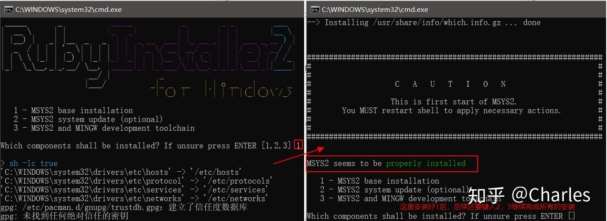
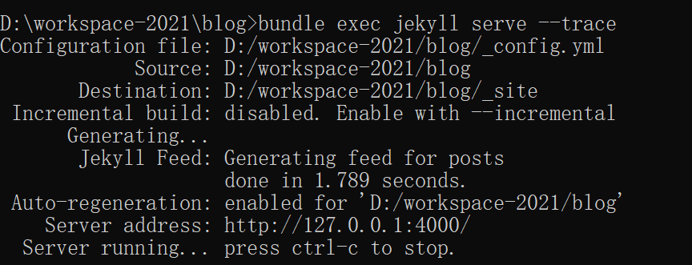

# jekyll

官网： [https://jekyllrb.com/ ](https://jekyllrb.com/ )  

中文官网：[http://jekyllcn.com/](http://jekyllcn.com/)

主题： [https://jekyllthemes.io/](https://jekyllthemes.io/)

jekyll 是一个简单的免费的Blog生成工具，类似WordPress。
但是和WordPress又有很大的不同，原因是jekyll只是一个生成静态网页的工具，不需要数据库支持。
但是可以配合第三方服务,例如Disqus。最关键的是jekyll可以免费部署在Github上，而且可以绑定自己的域名。
            
Jekyll使用教程笔记
- [一：简介、快速开始、基本用法、目录结构](https://juejin.cn/post/6844903623567081486)
- [二：配置](https://juejin.cn/post/6844903629246169096)
- [三：Front Matter、写文章](https://juejin.cn/post/6844903629682376711)
- [四：创建页面、静态文件、变量](https://juejin.cn/post/6844903629934084109)
- [五：合集、数据文件](https://juejin.cn/post/6844903630001160199)
- [六：资源、博客迁移、模版](https://juejin.cn/post/6844903632882630664)


## 1.安装

### 1.1 安装Ruby

jekyll使用Ruby实现的，所有我们使用的时候需要Ruby的运行环境。

Ruby官网： [https://rubyinstaller.org/](https://rubyinstaller.org/)

> PS: ruby安装路径不能有空格。否则部分Ruby程序运行不了

安装完成后，会自动弹出 cmd.exe 如下图所示， 提示安装 MSYS2，它是用来编译 Ruby 本地包的，
我们需要手动输入[1,2,3]，然后回车进行安装。国内网络环境的原因，会导致安装极慢，甚至安装失败，
但是这是必须的步骤，只能多试几次。这里如果没有弹出命令行 MSYS2 安装界面或者把它关掉了，
那么可以重新打开cmd命令行，输入 ridk install 来再次进入 MSYS2 安装界面。
分别输入 ruby -v和 gem -v 查看版本，确认安装完成。




### 1.2 安装 jekyll 和 bundler

> gem 是ruby插件的工具，bundler 是建立在gem上，用于管理插件间依赖关系的工具，类似于java的maven

```shell
gem install --user-install bundler jekyll
```

## 2.快速入门

1. 创建项目

```shell
jekyll new blog
```

2. 构建项目

```shell
cd blog
bundle add webrick
```

3. 启动项目

```shell
bundle exec jekyll serve --trace
```



目录结构

```text
├ about.md
├ _config.yml
├ css
│   └ main.scss
├ feed.xml
├ _includes
│   ├ footer.html
│   ├ header.html
│   ├ head.html
│   ├ icon-github.html
│   ├ icon-github.svg
│   ├ icon-twitter.html
│   └ icon-twitter.svg
├ index.html
├ _layouts
│   ├ default.html
│   ├ page.html
│   └ post.html
├ _posts
│   └ 2016-03-04-welcome-to-jekyll.markdown
└ _sass
```

4. 编写文章

我们进入_post目录，撰写的markdown语法的博文都放在这里

5. 修改文章

修改文章后不会立即刷新，所以我们可以手动编译

```shell
jekyll build
```

6. 启动参数

```text
-P 端口
-H 绑定ip， 0.0.0.0 允许远程访问
-w 监控目录，实时编译
-V 打印debug日志
```
```shell
# 端口 5555；  开启远程访问； 实时编译； 打印日志
bundle exec jekyll serve --trace -P 5555 -H 0.0.0.0 -w -V --trace
```


## 3.github pages

GitHub Pages 是通过 GitHub 托管和发布的公共网页。 启动和运行的最快方法是使用 Jekyll
主题选择器加载预置主题。 然后，您可以修改 GitHub Pages 的内容和样式。

官方教程： https://docs.github.com/cn/pages


## 4.gitee pages

码云 Pages 是一个免费的静态网页托管服务，您可以使用码云 Pages。托管博客、项目官网等静态网页。如果您使用过 Github Pages 那么您会很快上手使用码云的Pages服务。

官方教程： https://gitee.com/help/articles/4136

## 5.Liquid语法

Liquid 是一门开源的模板语言。Jekyll的模板中可以使用Liquid语法进行取值，计算和数据处理，如果仅仅只为了使用Jekyll撰写博客文章，你可以不需要了解liquid,
但是如果你需要定制Jekyll的主题，灵活的控制你的站点，你确实有必要了解一些liquid相关的语法。

英文官网： https://shopify.github.io/liquid/

中文官网： https://liquid.bootcss.com/


## 6.使用scss
> Sass（Syntactically Awesome Style Sheets）是一个相对新的编程语言，Sass为web前端开发而生，
> 可以用它来定义一套新的语法规则和函数，以加强和提升CSS。通过这种新的编程语言，你可以使用最高效的方式，
> 以少量的代码创建复杂的设计。它改进并增强了CSS的能力，增加了变量，局部和函数这些特性。

1.在_config.yml 下增加插件。Jekyll 3 已经自带Sass编译器了, 不需要额外安装

```yaml
plugins:
  - jekyll-sass-converter
```

2.重新编译项目（本地开发使用） 在项目根目录下执行命令

```shell
bound
```

3.增加目标文件。项目里新建一个文件夹_sass, 当然也可以用其他名字, 之后可以进行设置, 然后将实际.scss放到里面

```text
jekyll-project/
    ├── _includes/
    ├── _layouts/
    ├── _posts/
    └── _sass/
    │   └── styles.scss
    ├── _config.yml
    └── index.html
```

4.修改_config.yml以开启sass。 这里可以设置sass的默认路径

```yaml
sass:
    sass_dir: _sass
    style: compressed
```

5.创建样式文件。在自己的CSS文件夹下创建一个.scss, 里面只放一行

```sass
---
---

// Imports
@import "style";
```

注意:最顶上的两行横杠不能删除, 这个是为了让文件按照Jekyll标准进行读取

```text
jekyll-project/
   ├── _includes/
   ├── _layouts/
   ├── _posts/
   └── _sass/
   │   └── styles.scss
   └── css/
   │   └── styles.scss
   ├── _config.yml
   └── index.html
```

6.引入使用html照常使用css。最后文件会被自动转换成.css因此只需要引用.css即可

```html
<link rel="stylesheet" href="/css/styles.css">
```

## 7.最佳实践
<p style="color:red;">1.性能问题</p>
jekyll的本质是解析配置和模板生成静态页面，编译的过程效率较低。
所有在使用过程中，尽可能减少for循环，以及需要编译的文章数量。

<p style="color:red;">2.语法冲突</p>

想要在文章中展示 ，但是又不需要jekyll解析。

https://blog.csdn.net/qq_41437512/article/details/123031890


## 8.blog技巧

### 8.1.广告
通过流量变现的一种方式。

常见的方式是使用谷歌广告[https://www.google.com/adsense/new/](https://www.google.com/adsense/new/)

### 8.2.网站分析

谷歌的分析能力是最强的。

1. 谷歌：https://analytics.google.com/analytics/web/
2. 百度：http://zhanzhang.baidu.com/
3. 站长之家：http://seo.chinaz.com/
4. 爱站：http://www.aizhan.com/

### 8.3.流量统计
国内有个免费的统计平台，不蒜子 [http://busuanzi.ibruce.info/](http://busuanzi.ibruce.info/)

使用非常简单
```html
<script async src="//busuanzi.ibruce.info/busuanzi/2.3/busuanzi.pure.mini.js"></script>
<span id="busuanzi_container_site_pv">本站总访问量<span id="busuanzi_value_site_pv"></span>次</span>
```

### 8.4.评论

- 开源的技术方案：[https://disqus.com/](https://disqus.com/)
- 使用GitHub的issues。通过api的方式对接

### 8.5. cdn加速

我们可以使用免费的： [https://www.jsdelivr.com/](https://www.jsdelivr.com/)

### 8.6.代码块行号

下载prism.js和prism.css，可以自定义选择主题、支持语言、插件等。

支持的语言没必要选太多，不然体积会比较大，并且最上面最好选择Minified version。

网页拉到底下载js和css文件，下载后分别复制到js和css文件夹即可。

https://prismjs.com/download.html

使用教程：https://hugueliu.github.io/2019/12/28/add_line_number_for_code_block_in_jekyll/

插件列表
```text
线条突出显示 - Line Highlight
行号 - Line Numbers
显示隐形 - Show Invisibles
Autolinker - Autolinker
Web平台文档 - WebPlatform Docs
自定义类 - Custom Class
文件突出显示 - File Highlight
显示语言 - Show Language
JSONP亮点 - JSONP Highlight
突出显示关键字 - Highlight Keywords
删除初始换行符 - Remove initial line feed
预览器 - Previewers
自动加载磁带机 - Autoloader
保持标记 - Keep Markup
命令行 - Command Line
非转义标记 - Unescaped Markup
规范化空白 - Normalize Whitespace
数据URI突出显示 - Data-URI Highlight
工具栏 - Toolbar
复制到剪贴板按钮 - Copy to Clipboard Button
```


### 8.7.前端实现在线预览pdf、word、xls、ppt

https://www.cnblogs.com/cczlovexw/p/15338009.html

### 8.8.前端预览word文档

1.使用xdoc。在线的文档转换工具，支持多种文档类型。官网[https://view.xdocin.com/](https://view.xdocin.com/)

最大问题：只能试用，长期试用收费。

```html
<iframe scrolling="yes" width="100%" name="iframepage"
        src="https://view.xdocin.com/view?src=https://luckSnow1989.github.io/article/8.微服务/微服务.docx"></iframe>

<script type="text/javascript">
   var height=$(window).height()-183;
   var iframepage = $("iframe[name=iframepage]");
   if(iframepage != null && iframepage.length > 0) {
      iframepage.attr("height",height);
   }
</script>
```

2.微软官方提供的在线预览工具(限制较多，不推荐)

使用方式：https://view.officeapps.live.com/op/view.aspx?src=你的文件的地址

缺点： 文件的地址只能是域名，且不能包含端口号，路径不能有符号和空格

3.使用docx-preview插件

```html
<!--optional polyfill for promise-->
<script src="https://unpkg.com/promise-polyfill/dist/polyfill.min.js"></script>
<!--lib uses jszip-->
<script src="https://unpkg.com/jszip/dist/jszip.min.js"></script>
<script src="https://cdn.jsdelivr.net/npm/docx-preview@0.1.14/dist/docx-preview.min.js"></script>

<div name="wordShowDiv"  word-url="https://luckSnow1989.github.io/article/7.数据库/file/OceanBase分布式应用.docx">
</div>
<script type="application/javascript">
  function createWord() {
    var divs = $("div[name=wordShowDiv]");
    for (var i = 0; i < divs.length; i++) {
      let div = divs[i];
      let file_url = $(div).attr("word-url");
      let xhr = new XMLHttpRequest();
      xhr.open("get", file_url, true);
      xhr.responseType = "blob";
      xhr.onload = function () {
        if (this.status == 200) {
          //console.log(this.response);
          docx.renderAsync(this.response, div, null, {
            className: "docx", //默认和文档样式类的类名/前缀
            inWrapper: true, //启用围绕文档内容呈现包装器
            ignoreWidth: true, //禁用页面的渲染宽度
            ignoreHeight: true, //禁用页面的渲染高度
            ignoreFonts: false, //禁用字体渲染
            breakPages: true, //在分页符上启用分页
            ignoreLastRenderedPageBreak: true, //在lastRenderedPageBreak元素上禁用分页
            experimental: true, //启用实验功能（制表符停止计算）
            trimXmlDeclaration: true, //如果为true，则在解析之前将从xml文档中删除xml声明
            useBase64URL: true, //如果为true，图像、字体等将转换为base 64 URL，否则使用URL.createObjectURL
            useMathMLPolyfill: false, //包括用于铬、边等的MathML多填充。
            showChanges: true, //启用文档更改的实验渲染（插入/删除）
            debug: false, //启用额外的日志记录
          }).then(x => console.log("docx: finished"));
        }
      };
      xhr.send();
    }
  }
  createWord();
</script>
```

### 8.9.图片放大预览

使用fancybox。官网：[http://fancyapps.com/fancybox/](http://fancyapps.com/fancybox/)

```html
<!DOCTYPE html>
<html lang="en">
<head>
  <meta charset="UTF-8">
  <title>Title</title>
</head>
<script src="../js/jquery.min.js" type="text/javascript"></script>
<link href="https://cdn.jsdelivr.net/npm/jquery.fancybox@2.1.5/source/jquery.fancybox.css" media="all" rel="stylesheet"/>
<script src="https://cdn.jsdelivr.net/npm/jquery.fancybox@2.1.5/source/jquery.fancybox.pack.js" type="text/javascript"></script>
<body>

<div class="content">
  
</div>

<script>
  // 给图片添加链接
  $(document).ready(function () {
    let contentImgId = "contentImgId";
    let idx = 0;
    $(".content img").each(function () {
      var id = contentImgId + idx;
      var appendHtml = "<a id='" + id + "' href='" + this.src + "'></a>";
      $(this).wrapAll(appendHtml);
      $("#" + id).fancybox({
        openEffect: 'elastic',
        closeEffect: 'elastic',
      });
      idx++;
    });
  });
</script>
</body>
</html>
```


