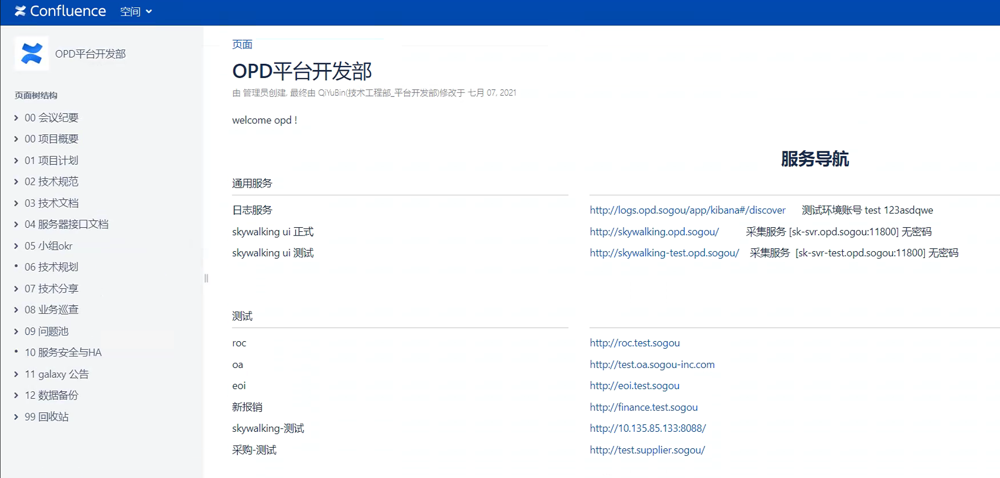

# wiki

## 1.Confluence

这里就是想说下， Confluence 是一个wiki管理、编辑软件。
是收费的。不过好用，可以小范围的使用破解版，不要对外声张

安装教程
https://blog.51cto.com/zengestudy/1926876

破解包：
https://github.com/ealebed/confluence

我们通常使用wiki

比较通用的wiki目录结构

## 2.wiki.js
教程: [https://www.jianshu.com/p/0b5e3b4e6ab1](https://www.jianshu.com/p/0b5e3b4e6ab1)     
源码: [https://github.com/requarks/wiki](https://github.com/requarks/wiki)   

wiki.js 是一个基于 Node.js 的现代而强大的 wiki 应用程序，使用 Wiki.js 漂亮而直观的界面，让编写 Wiki 文档成为一种乐趣！

特性：
- 随意安装，只要支持 Node.js 的环境都可运行。
- 功能齐全，可以管理 wiki 所有内容，数据保存到数据库中，支持大部分主流的数据库。
- 速度极快，Wiki.js 在速度极快的 Node.js 引擎上运行。
- 可定制外观，完全自定义界面，包含明暗模式。
- 保护性，可以选择将你的 wiki 内容公开、私密或是两者混合。
- 可扩展，无论是在什么环境，Wiki.js 都可以利用资源进行扩展。
- 支持同步github上的markdown文档。实现一份文档多端展示。

## 3.xwiki

XWiki 是一个由 Java 编写的基于 LGPL 协议发布的开源 wiki 和应用平台。操作与样式与Confluence非常相似，可以用来代替Confluence

官网：[http://www.xwiki.org/](http://www.xwiki.org/)

## 4.VuePress

Vue 驱动的静态网站生成器。

官网[https://vuepress.vuejs.org/zh/](https://vuepress.vuejs.org/zh/s)
[搭建教程](https://mp.weixin.qq.com/s/S7I-L7Dl4-aVa8n_aHNZJA)