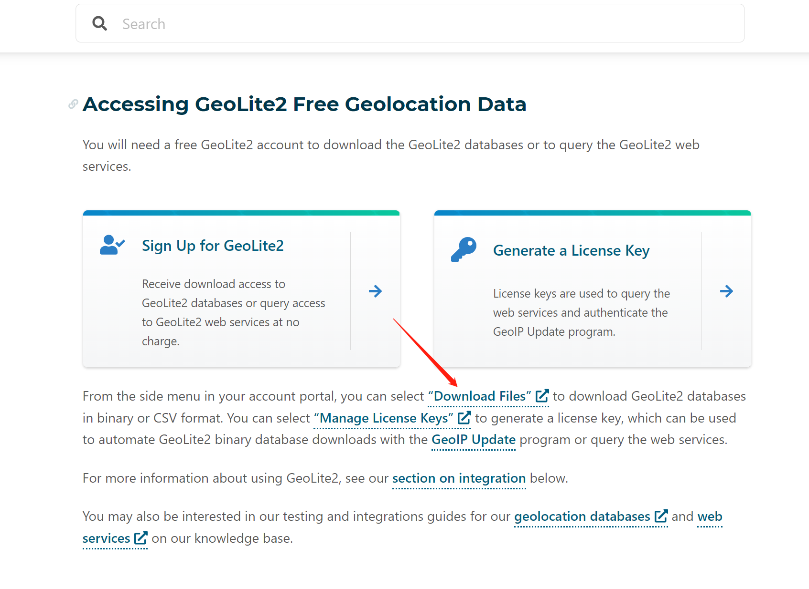
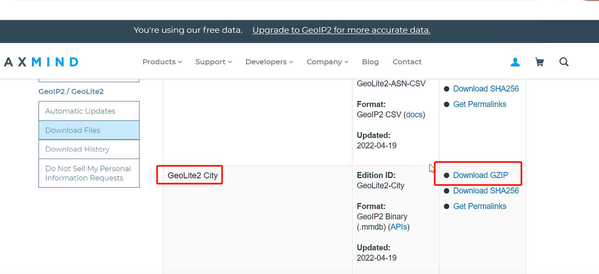

# GeoLite2

官网地址： https://www.maxmind.com/en/home

通过ip地址获取经纬度以及该ip地址所属地区，提供免费的基础数据库。


## 下载






解压之后，可以看到 geolite2-city.mmdb 就是我们需要的数据库文件了。


## 使用

文档： https://dev.maxmind.com/geoip/geolocate-an-ip/databases?lang=en

官方使用maven。

```xml
<dependency>
  <groupId>com.maxmind.geoip2</groupId>
  <artifactId>geoip2</artifactId>
  <version>2.15.0</version>
</dependency>
```


官方代码
```java
File database = new File("/path/to/maxmind-database.mmdb")

// This reader object should be reused across lookups as creation of it is
// expensive.
DatabaseReader reader = new DatabaseReader.Builder(database).build();

// If you want to use caching at the cost of a small (~2MB) memory overhead:
// new DatabaseReader.Builder(file).withCache(new CHMCache()).build();

InetAddress ipAddress = InetAddress.getByName("128.101.101.101");

CityResponse response = reader.city(ipAddress);

Country country = response.getCountry();
System.out.println(country.getIsoCode());
```

抽象出工具类
```java
    /**
     * 
     * @description: 获得国家 
     * @param reader GeoLite2 数据库
     * @param ip ip地址
     * @return
     * @throws Exception
     */
    public static String getCountry(DatabaseReader reader, String ip) throws Exception {
        return reader.city(InetAddress.getByName(ip)).getCountry().getNames().get("zh-CN");
    }

    /**
     * 
     * @description: 获得省份 
     * @param reader GeoLite2 数据库
     * @param ip ip地址
     * @return
     * @throws Exception
     */
    public static String getProvince(DatabaseReader reader, String ip) throws Exception {
        return reader.city(InetAddress.getByName(ip)).getMostSpecificSubdivision().getNames().get("zh-CN");
    }

    /**
     * 
     * @description: 获得城市 
     * @param reader GeoLite2 数据库
     * @param ip ip地址
     * @return
     * @throws Exception
     */
    public static String getCity(DatabaseReader reader, String ip) throws Exception {
        return reader.city(InetAddress.getByName(ip)).getCity().getNames().get("zh-CN");
    }
    
    /**
     * 
     * @description: 获得经度 
     * @param reader GeoLite2 数据库
     * @param ip ip地址
     * @return
     * @throws Exception
     */
    public static Double getLongitude(DatabaseReader reader, String ip) throws Exception {
        return reader.city(InetAddress.getByName(ip)).getLocation().getLongitude();
    }
    
    /**
     * 
     * @description: 获得纬度
     * @param reader GeoLite2 数据库
     * @param ip ip地址
     * @return
     * @throws Exception
     */
    public static Double getLatitude(DatabaseReader reader, String ip) throws Exception {
        return reader.city(InetAddress.getByName(ip)).getLocation().getLatitude();
    }
    
    public static void main(String[] args) throws Exception {
    	// String path = req.getSession().getServletContext().getRealPath("/WEB-INF/classes/GeoLite2-City.mmdb");
    	String path = "D:/CSDN/GeoLite2-City.mmdb";
    	// 创建 GeoLite2 数据库
    	File database = new File(path);
    	// 读取数据库内容
    	DatabaseReader reader = new DatabaseReader.Builder(database).build();
    	// 访问IP
    	String ip = "222.222.226.212";
    	String site = "国家："+GetAddress.getCountry(reader, ip) + "\n省份：" + GetAddress.getProvince(reader, ip) + "\n城市：" + GetAddress.getCity(reader, ip)+ "\n经度：" + GetAddress.getLongitude(reader, ip)+ "\n维度：" + GetAddress.getLatitude(reader, ip);
    	System.out.println(site);
    }
```

