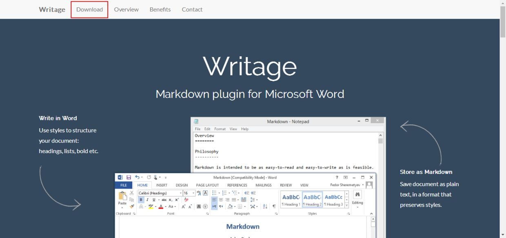
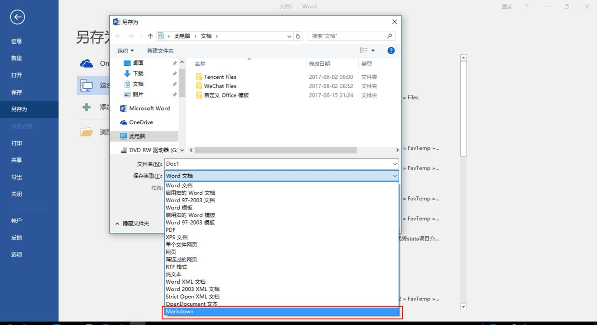
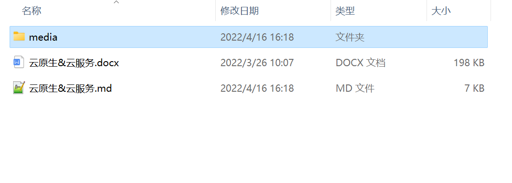
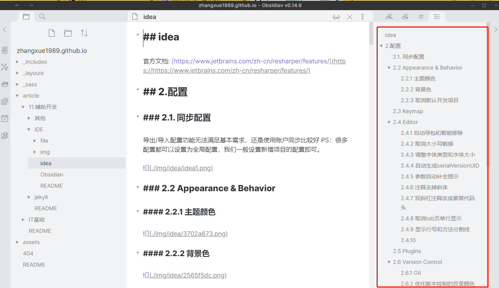
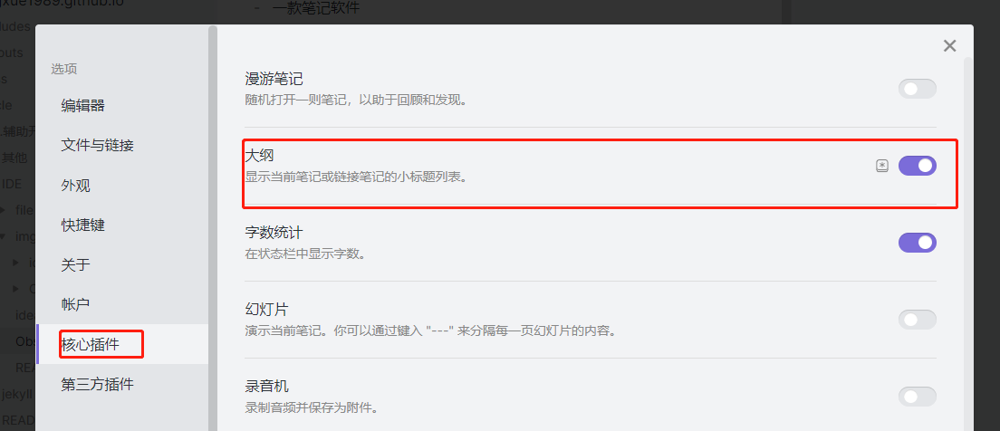
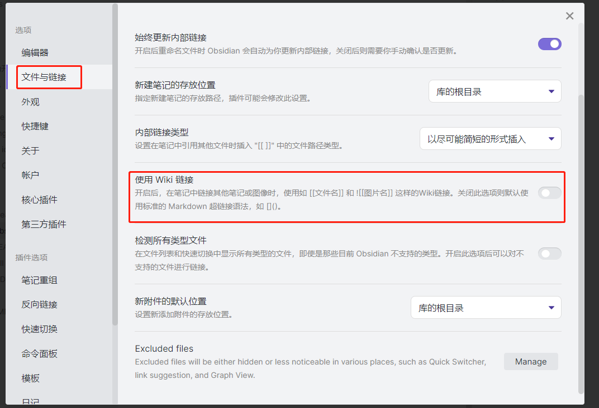

# markdown


## 1.教程
中文网[https://markdown.com.cn/](https://markdown.com.cn/)

## 2.word转Markdown

word转Markdown 网上的方案有一些，下面是一种比较稳定的方案。方案只能在window系统，且安装了office

### 2.1.Writage + Pandoc

Writage是一款word插件， 支持markdown与word互相转换

Pandoc，文档转换后台软件

实际上实现文档格式转换的是pandoc软件，Writage作为word插件，将pandoc的功能集成到了word选项中，避免了繁琐的cmd命令操作。

### 2.2.Writage下载与安装

- 下载地址：[http://www.writage.com/](http://www.writage.com/)
- 打开 Writage网页，点击Download，再点击Download Now完成下载



- 点击安装包，安装即可
- 重启电脑，新建或打开任一 Word 文档，在 文件 菜单栏下选 另存为，查看 【保存类型】 中是否有 Markdown 格式。
  （如果插件安装成功，就会自动出现Markdown选项；否则，重新安装一遍吧~）



### 2.3.Pandoc下载与安装

- 下载地址：[http://pandoc.org/installing.html](http://pandoc.org/installing.html)
- 点击安装包，安装即可

pandoc官方文档[可以查看常用命令]：[https://pandoc.org/MANUAL.html](https://pandoc.org/MANUAL.html)

### 2.4.导出markdown

打开需要导出的word稳定，另存为，选择格式为markdown即可

默认会将文档中的文件和图片都导入到media文件夹下面



### 2.5.pandoc的一些命令结合Writage

教程: [http://t.zoukankan.com/junge-mike-p-12761669.html](http://t.zoukankan.com/junge-mike-p-12761669.html)

命令： pandoc -f docx -t markdown --extract-media=./MySQL/ -o MySQL.md MySQL.docx

* -f: 指定输入格式，比如docx、epub、md、html等
* -t: 指定输出格式，比如docx、epub、md、html等
* -o: 输出到file文件

案例
```shell
# 页面转doc
pandoc -f html -t docx -o 1.docx https://developer.aliyun.com/article/1093816
```

## 3.客户端

### 3.1.Obsidian

1.是什么

- 一款笔记软件
- markdown编辑工具
- 文件都在本地，不会丢失
- 文件夹式管理

官网：[https://obsidian.md/](https://obsidian.md/)

中文论坛：[https://forum-zh.obsidian.md/](https://forum-zh.obsidian.md/)

使用笔记： [https://zhuanlan.zhihu.com/p/336678751](https://zhuanlan.zhihu.com/p/336678751)

插件介绍1： [https://zhuanlan.zhihu.com/p/401983868](https://zhuanlan.zhihu.com/p/401983868)

插件介绍2：[https://zhuanlan.zhihu.com/p/402091689](https://zhuanlan.zhihu.com/p/402091689)

插件介绍3：[https://zhuanlan.zhihu.com/p/360024811](https://zhuanlan.zhihu.com/p/360024811)

插件介绍4：[https://zhuanlan.zhihu.com/p/368487154](https://zhuanlan.zhihu.com/p/368487154)

2. 文章大纲

- 效果如下
  
- 设置
  

3.图片兼容性问题

obsidian 默认使用wiki格式的链接，如下

```shell
[[abc.png]]
```

与传统的Markdown格式不兼容。需要设置链接格式

