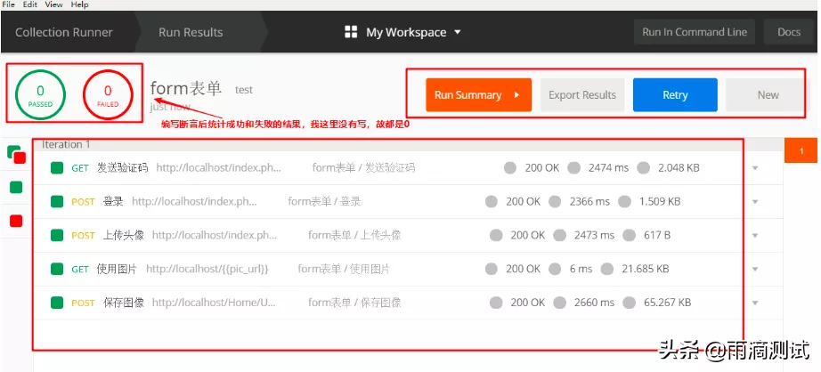
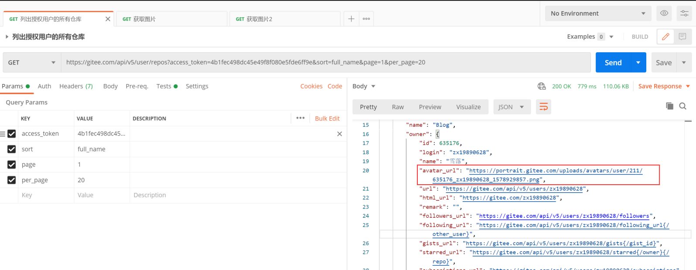
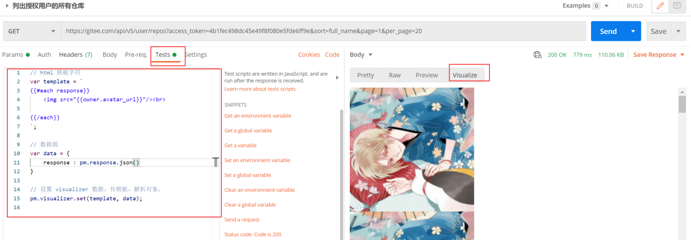
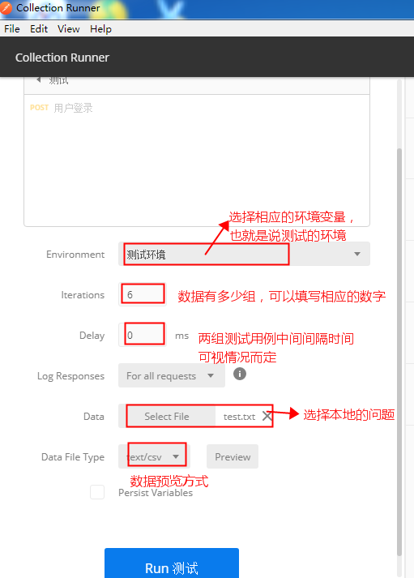

# postman

官方： [https://www.getpostman.com](https://www.getpostman.com)

教程：[https://mp.weixin.qq.com/s/Dzvs_bMjVmxaG1Ffq9Nd4w](https://mp.weixin.qq.com/s/Dzvs_bMjVmxaG1Ffq9Nd4w)

推荐使用Google账号登录，用来同步设备间的数据

## 1.基础使用

### 1.1.接口请求

#### 1.1.1.【重要】使用界面


#### 1.1.2.Get请求


#### 1.1.3.Post请求


#### 1.1.4.上传文件

- 请求方法：POST

- 请求类型：multipart/form-data

- 类型选File


#### 1.1.5.Json格式请求参数

请求方法：POST

请求体类型：json

请求体数据：{"account":"root","password":"123456"}


### 1.2.接口响应

#### 1.2.1.【重要】使用界面


#### 1.2.2.响应数据

- 状态行：Status：200 OK

- 响应头：Headers +
    Cookies，需要注意的是Cookies是包含在响应头中的，但是为了明显，工具会分开显示

- 响应体：Body


那么这些数据对我们做接口测试有什么作用呢 ？

- Body和Status是我们做接口测试的重点，一般来说我们都会验证响应体中的数据和响应状态码

- Test Results 是我们编写断言后，可以查看断言的执行结果
    ，所以这个对我们也很有用 。

- Time 和Size
    是我们做性能测试时，可以根据这两个参数来对所测接口的性能做一个简单的判断。

#### 1.2.3.Body的内容

- Pretty:翻译成中文就是漂亮 ， 也就是说返回的Body数据在这个标签中查看
    ，都是经过格式化的，格式化后的数据看起来更加直观，所以postman默认展示的也是这个选项。比如返回html页面，它会经过格式化成HTML格式后展示，比如返回json，那么也会格式化成json格式展示
    。

- Raw：翻译成中文未经过加工的，也就是原始数据
    ，原始数据一般都是本文格式的，未经过格式化处理的，一般在抓包工具中都有这个选项
    。

- Preview：翻译成中文就是预览，这个选项一般对返回HTML的页面效果特别明显，如请求百度后返回结果，点击这个选项后就直接能查看到的页面
    ，如下图 。同时这个选项和浏览器抓包中的Preview也是一样的 。

- Visualize
    可视化内容，一般可以配合tests等进行操作【后面进阶可以查看】

    
    

#### 1.2.4.日志调试

可以查看完整的请求/响应数据


在postman中编写日志打印语句使用的是JavaScript，编写的位置可以是Pre-request
Script 或Tests标签中。编写打印语句如：console.log("我是一条日志")


这里面有几个比较实用的功能：

- 搜索日志：输入URL或者打印的日志就能直接搜索出我们想要的请求和日志，这对我们在众多日志中查找某一条日志是非常方便的
    。

- 按级别搜索：可以查询log,info,warning,error级别的日志
    ，有助于我们更快定位到错误 。

- 查看原始报文(Show raw
    log)：如果习惯看原始请求报文的话，这个功能可能更方便些 。

- 隐藏请求(Hide network)：把请求都隐藏掉，只查看输出日志 。


## 2.接口管理

### 2.1.Workspace

是多组collection集合，一般我们认为用于区分不同类型的项目，而Workspace内部是相关的collection的集合


### 2.2.Collection

当我们对一个或多个系统中的很多用例进行维护时，首先想到的就是对用例进行分类管理，同时还希望对这批用例做回归测试
。在postman也提供了这样一个功能，就是Collection
。通过这个Collection就可以满足我们的上面说的需求。

我们一般可以按照下面的结构，管理我们的接口


### 2.3.批量执行接口（单元测试）

可以用来批量执行单元测试、完成复杂接口的测试

- 选中一个Collection，点击右三角，在弹出的界面点击RUN

    
    

- 这是会弹出一个叫Collection
    Runner的界面，默认会把Collection中的所有用例选中 。

    
    

- 点击界面下方的RUN
    Collection，就会对Collection中选中的所有测试用例运行 。

    
    

- 断言统计：左上角的两个0是统计当前Collection中断言成功的执行数和失败的执行数，如果没有编写断言默认都为0
    。

- Run Summary:
    运行结果总览，点击它可以看到每个请求中具体的测试断言详细信息
    。Export Result：导出运行结果，默认导出的结果json文件 。

- Retry: 重新运行，点击它会把该Collection重新运行一遍

- New：返回到Runner，可以重新选择用例的组合 。

## 3.变量

在postman常用的三种变量分别是全局变量，环境变量，集合变量 。

- 全局变量：一旦申明了全局变量，全局有效，也就是说postman中的任何集合，任何请求中都可以使用这个变量。它的作用域是最大的
    。

- 环境变量：要申明环境变量，首先的创建环境，然后在环境中才能创建变量
    。如果要想使用环境变量，必须先选择(导入)这个环境，这样就可以使用这个环境下的变量了
    。需要说明的是环境也可以创建多个 。每个环境下又可以有多个变量 。

- 集合变量：集合变量是针对集合的，也就是说申明的变量必须基于某个集合，它的使用范围也只是针对这个集合有效
    。

### 3.1.全局变量&环境变量

全局变量作用于所有workspace

环境变量作用于一个workspace内全部的collection中


### 3.2.集合变量


### 3.3.使用变量

#### 3.3.1.在请求中使用变量


#### 3.3.2.在响应中使用变量

在Tests，Pre-requests Script：

- 定义全局变量：pm.collectionVariables.set("变量名",变量值)

- 定义环境变量：pm.environment.set("变量名"，变量值)

- 定义集合变量：pm.variables.set("变量名",变量值)

- 获取环境变量：pm.environment.get(‘变量名’)

- 获取全局变量：pm.globals.get('变量名')

- 获取集合变量：pm.pm.collectionVariables.get.get('变量名')

## 4.进阶

### 4.1.Pre-requests Script

请求前置处理器

主要场景：一般情况下，在发送请求前需要对接口的数据做进一步处理，就都可以使用这个功能，比如说，登录接口的密码，在发送前需要做加密处理，那么就可以在前置脚本中做加密处理，再比如说，有的接口的输入参数有一些随机数，每请求一次接口参数值都会发送变化，就可以在前置脚本中编写生成随机数的代码
。总体来说，就是在请求接口之前对我们的请求数据进行进一步加工处理的都可以使用前置脚本这个功能。

#### 4.1.1.案例一

简单的案例，生成请求中的随机数。在请求成功之后我们可以查看随机数字

```javascript
// 生成随机数
var random = Math.random();
console.log("随机数", random);
// 将随机数字保存为环境变量
pm.environment.set("random", random);
```


#### 4.1.2.案例二

Md5验签
```javascript
var timestamp = new Date().getTime();
var appId = 'Roc';
var key = '05459bfd3b8e4c489d1a72608ae26155';
var sign = CryptoJS.MD5(appId + ":" + timestamp + ":" + key).toString();
pm.environment.set("timestamp", timestamp);
pm.environment.set("sign", sign);
pm.environment.set("appId", appId);
console.log(timestamp, sign, key, appId)
```


### 4.2.Tests（断言）

[https://zhuanlan.zhihu.com/p/98287516](https://zhuanlan.zhihu.com/p/98287516)

请求后置处理器，我们主要用于做单元测试（断言）

断言的一些特点

- 断言编写位置：Tests标签

- 断言所用语言：JavaScript

- 断言执行顺序：在响应体数据返回后执行 。

- 断言执行结果查看：Test Results

常见的使用案例

案例1：多层json嵌套, 获取user_id的值
```json
{
  "code": 0,
  "message": "请求成功！",
  "data": {
    "user_id": "1252163151781167104"
  }
}
```

```javascript
//获取json体数据
var jsonData = pm.response.json()

// 获取user_id的值,通过.获取
var user_id = jsonData.data.user_id
```

案例2：json中存在列表，获取points中的第二个元素
```json
{
  "code": 0,
  "message": "请求成功！",
  "data": {
    "roles": {
      "api": [
        "API-USER-DELETE"
      ],
      "points": [
        "point-user-delete",
        "POINT-USER-UPDATE",
        "POINT-USER-ADD"
      ]
    },
    "authCache": null
  }
}
```

```javascript
//获取json体数据
var jsonData = pm.response.json()

// 获取user_id的值,通过下标获取列表中某个元素
var user_id = jsonData.data.roles.points[1]
```

案例3：列表中取最后一个元素
```json
{
"code": 0,
"message": "请求成功！",
"data": {
  "total": 24,
  "rows": [
    {
      "id": "1066370498633486336",
      "mobile": "15812340003",
      "username": "zbz"
    },
    {
      "id": "1071632760222810112",
      "mobile": "16612094236",
      "username": "llx"
    },
    {
      "id": "1075383133106425856",
      "mobile": "13523679872",
      "username": "test001"
    }
  ]}  
}
```

```javascript
//获取json体数据
var jsonData = pm.response.json()

// 获取id的值,通过slice(-1)获取列表中最后一个元素。
var id = jsonData.data.rows.slice(-1)[0]
```

### 4.3.接口关联

在我们测试的接口中，经常出现这种情况
。上一个接口的返回数据是下一个接口的输入参数
，那么这俩个接口就产生了关联。这种关联在做接口测试时非常常见，那么在postman中，如何实现这种关联关系呢
？

实现思路：

- 提取上一个接口的返回数据值，

- 将这个数据值保存到环境变量或全局变量中

- 在下一个接口获取环境变量或全局变量

实现步骤：

- 获取上传头像接口返回url的值

- 将这个值保存成全局变量(环境变量也可以)

- 在图像预览中使用全局变量

 
    

### 4.4.Visualize （可视化）

对于接口数据有时候需要对其可视化后才能判断是否正常，比如接口返回了图片的地址、表格、甚至是曲线图等。所有我们需要借助Tests的处理能力，将数据可视化处理

案例1：[https://blog.csdn.net/qq_26462567/article/details/103567958](https://blog.csdn.net/qq_26462567/article/details/103567958)

案例2：
我们想要查看返回数据中的所有图片，可以采用下面的方式，对数据可视化处理







检测可视化数据，右键出现选项，选择后弹出一个Chrome的开发者工具


### 4.5.性能&压力测试

使用的是批量执行接口的功能

- 我们可以打开多个collection runner 作为并发的用户。比如打开10个窗口

- Iterations作为每个用户的请求次数。比如每个窗口都是请求100次

结合这两点达到测试的目的（其实postman不适合做这个）。




### 4.6.https接口方式

为啥需要特殊处理，https使用分为单向认证&双向认证。

单向认证：像平常一样访问就行，无需做任何处理，只需要把http://变成https://

双向认证：需要我们在调用https时，则需要我们对请求进行ssl处理

[https://blog.csdn.net/ONS_cukuyo/article/details/79172242](https://blog.csdn.net/ONS_cukuyo/article/details/79172242)

## 5.handlebars模板引擎

中文网： [https://www.handlebarsjs.cn/](https://www.handlebarsjs.cn/)

Postman使用handlebars作为解析模板工具，进行可视化处理
