# 画图

## 1.什么是系统架构师？

系统架构师是一个既需要掌控整体又需要洞悉局部瓶颈并依据具体的业务场景给出解决方案的团队领导型人物。一个架构师得需要足够的想像力,能把各种目标需求进行不同维度的扩展，为目标客户提供更为全面的需求清单。

架构师在软件开发的整个过程中起着很重要的作用。

## 2.如何才能成为系统架构师？

- 首先必须具有丰富的软件设计与开发经验，这有助于理解并解释所进行的设计是如何映射到实现中去。

- 其次要具有领导能力与团队协作技能，软件架构师必须是一个得到承认的技术领导，能在关键时候对技术的选择作出及时、有效的决定。

- 第三是具有很强的沟通能力，其实这一点好像什么角色都最好具备，软件架构师需要与各路人马经常打交道，客户、市场人员、开发人员、测试人员、项目经理、网络管理员、数据库工程师等等，而且在很多角色之间还要起沟通者的作用。

- 而设计图，它不是简单的供你欣赏，他其实是架构师，产品经理，开发工程师，测试工程师等各种角色之间进行沟通的语言，沟通的一个桥梁，让整个团队更能有效的协调工作。

- 设计图不单单是架构师要掌握的，在一个产品的开发过程中，任何一个环节，任何一个角色都可以通过掌握不同的设计图来完成沟通的。

### 2.1.流程图

流程是一系列的逻辑关系（包含因果关系、时间先后、必要条件、输入输出）产品经理做需求前一定要先把这些逻辑关系理清楚，如果非要用一句话概括的话“流程就是在特定的情境下满足用户特定需要的总结”。

图就是将你头脑中的逻辑关系以图形化的形式呈现出来，具有图形化、可视化的特点，因为是图，你可以像你的版本迭代一样，当你的逻辑需要修改的时候拿出来迭代一下，同时因为有图，你还可以更好的给项目成员进行宣讲。

产品中设计的流程图主要有三种，业务流程图、任务流程图、页面流程图，下面我们来一一介绍。

### 2.2.业务流程图

业务流程图又称为泳道图，就是描述那些个体在什么条件下做了什么事情，他们之间有何关联。主要分三个方面：

- 涉及到哪些主体？

- 每个主体都有哪些任务？

- 各个主体之间怎么联系的？一般涉及到多个主体，每个主体之间有联系。

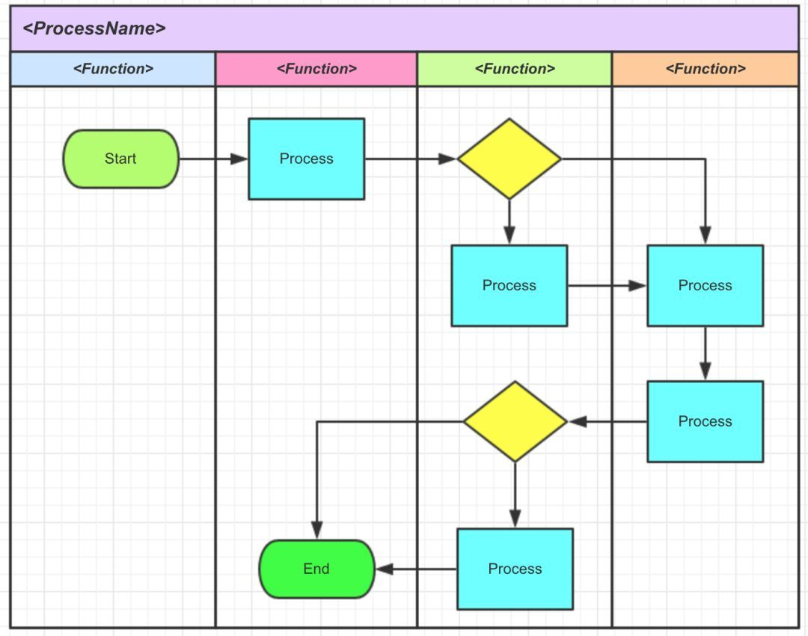

### 2.3.任务流程图

泳道图一般是从战略上分析整个业务流程，让你对公司所做的业务有个大概的了解，而任务流程图就是在你的产品操作上，用户通过什么样的操作来完成它的目标，比如你去银行ATM机器上取钱，你是如何一步步操作把钱取出来的。

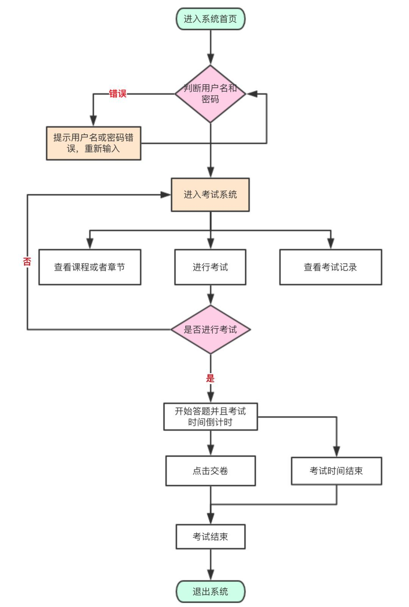

### 2.4.页面流程图

如果说业务流程图帮助你梳理战略，任务流程图帮助你梳理用户操作行为（主要给程序员看）、页面跳转流程在帮助你梳理各个页面之间的跳转关系（主要给UI和前端程序员看）这是一个逐步从整体到局部，从后端到前端的过程。

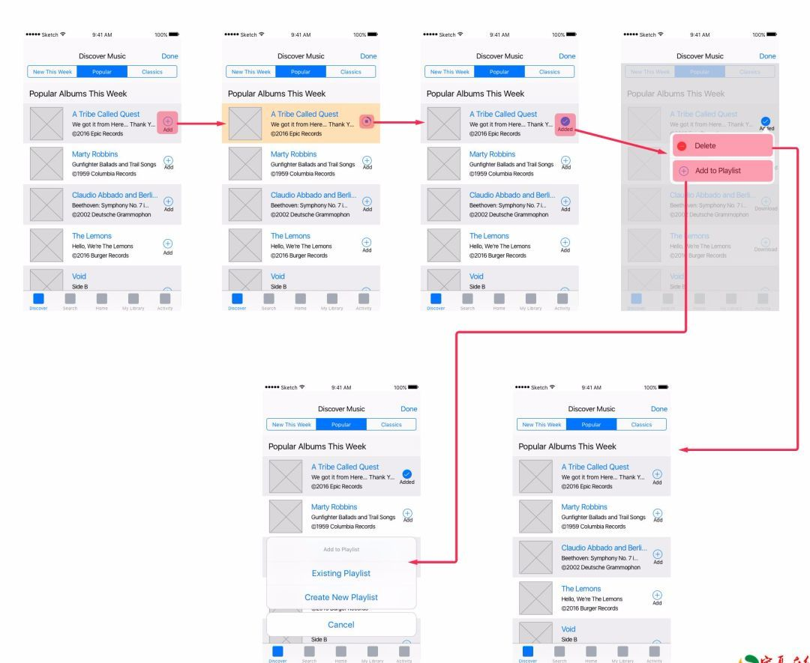

所有的产品都是由页面组成的，不论是APP、PC、H5都是由一个个页面组成的，页面流程图描述完成一个任务需要经过哪些步骤，你在画图的时候只需要清晰的表现出用户点击页面的什么地方，然后跳转到那个页面。主要由页面、行动点、连接线组成。

### 2.5.UI设计图标注

对于APP的页面，UI设计师会给出UI设计标注图，这样APP客户端开发人员，直接按照标注图进行页面的开发了。

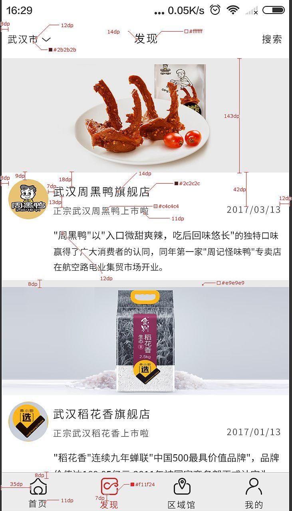

产品设计完成后，架构师需要对产品进行软件的架构设计。包括技术的选型，模块的划分，开发人员的任务分配，工作量的评估等等.....

### 2.6.系统架构设计图

构架将在一次又一次迭代中不断演化、改进、精炼。

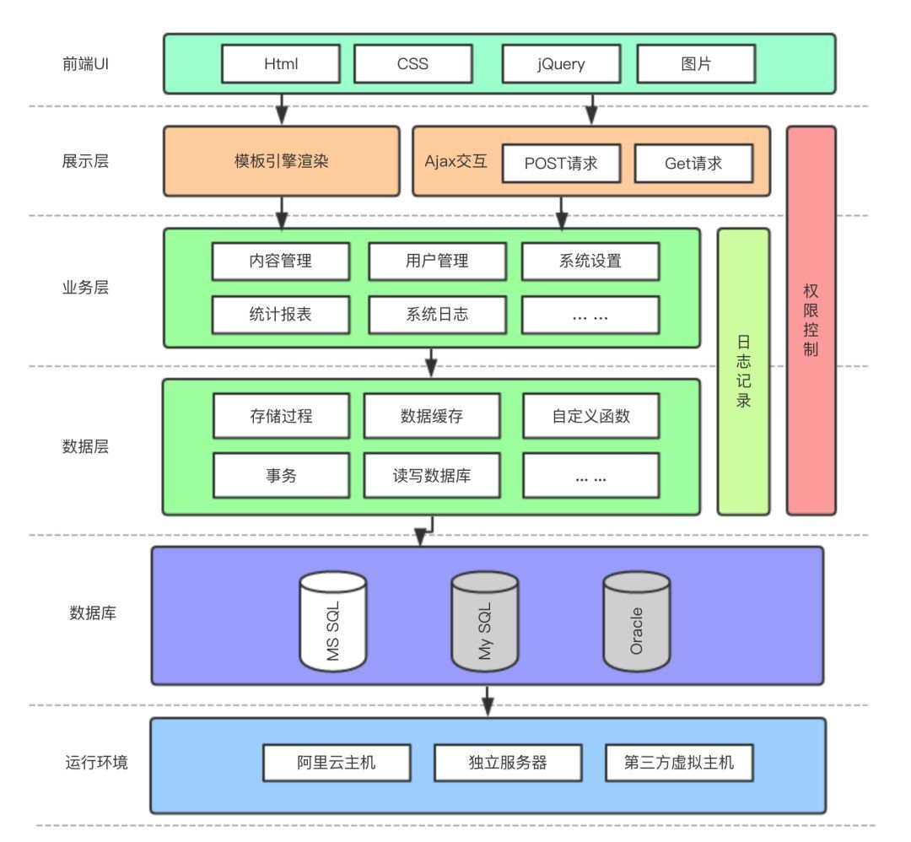

### 2.7.序列图

架构师一般在做详细设计的时候，会把程序模块之间的每一步调用过程很详细的画出来，这样开发人员拿到设计文档，就能直接开发。

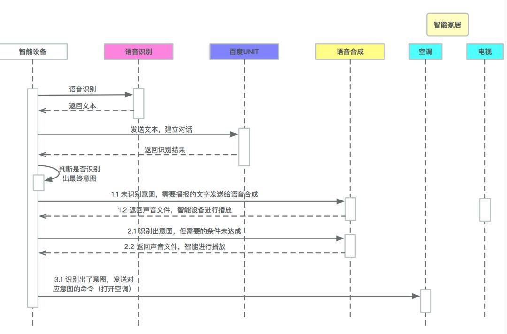

### 2.8.类图

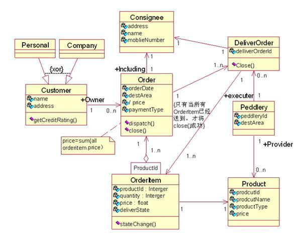

设计图有很多种，还包括用例图，状态图，活动图......
不再一一介绍。画什么样的设计图，不是绝对的，不同公司，不同项目，需要画的设计图也是不同的，有些项目需要画原型图，有些项目只是对外提供服务，没有页面也就不需要画原型图。另外还要根据项目的工期，预算等等因素考虑。如果一个项目的工期也就一个月甚至更短，那基本上就是怎么简单怎么快就怎么做。

## 3.画图工具

‘工欲善其事,必先利其器’，下面就为大家介绍几款常用设计图绘制工具。按照目前的发展方向，web端的工具优先使用。

### 3.1.Visio（推荐指数***）

是微软推出的一款流程图绘制工具，它有很多组件库，可以方便快捷的完成流程图、泳道图、结构图的绘制，但是不支持mac电脑。算是早期就存在的绘图工具了，对于比较新的版本来说，绘图效率有了很大的提高，比较推荐

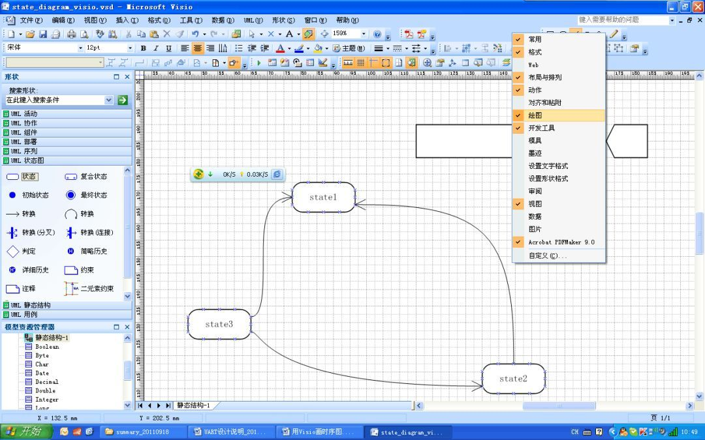

### 3.2.OmniGraffle

Mac下没有Visio很多人就用这个，这个一般流程图都能绘制，但是效率感觉没有Visio高，优点就是画出来的图形比较美，同时支持外部插件，缺点就是没有比较好的泳道流程图插件，画起泳道图来不是太方便，但也可以画，可以自己组装泳道。

另外一个缺点是收费的，只能免费试用15天，不过我已经为大家准备好了一个最新的破解版本。

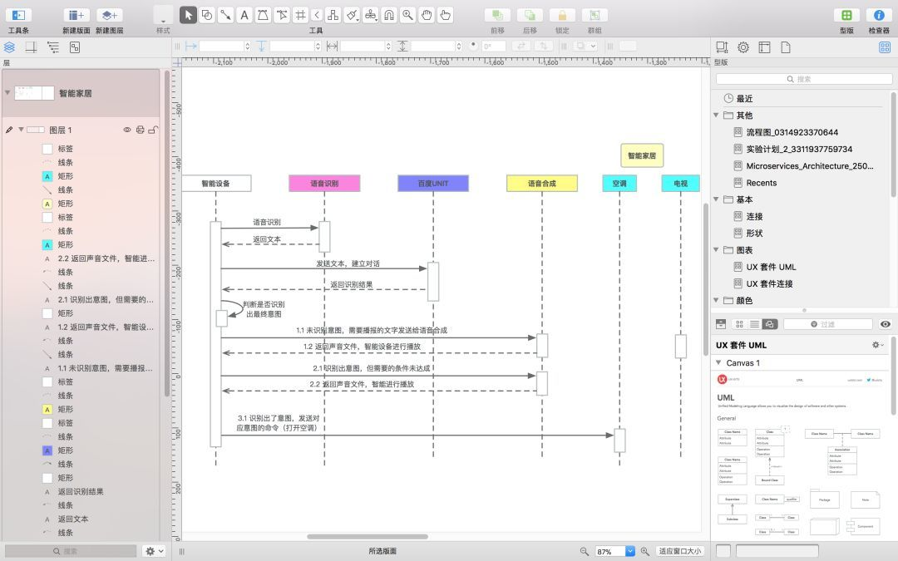

### 3.3.ProcessOn（推荐指数*****）

是一款网页版的在线作图工具，优点是无需下载安装、破解这些破事，同时支持在线协作，可以多人同时对一个文件协作编辑，
而且上手比较容易，它提供很多流程图模版，可以方便的画出流程图、思维导图、原型图、UML图，缺点就是在绘制泳道图需要增加泳道的时候，
只能在最后一列加入，不能在中间加入这一点有点麻烦，还有要吐槽的就是由于是在线的，有时候导出图片，导出来的并不太好，
流程图画的大的时候也无法截图。

在线地址：https://www.processon.com

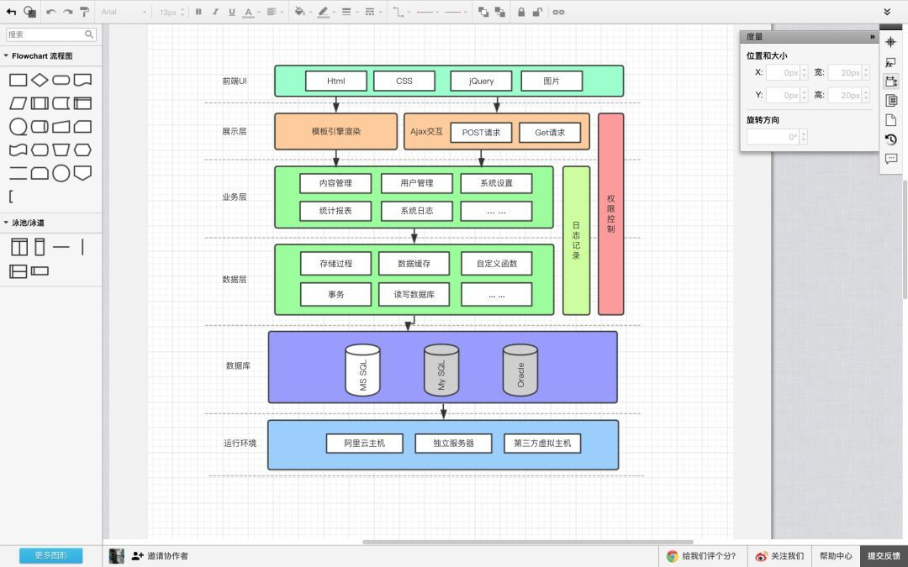

### 3.4.Axure RP（推荐指数****）

这是一款产品经理经常用来画原型的工具，它可以在页面里定义各种按钮点击事件，进行页面的跳转，模拟提交的过程，所以非常方便使用。画人物流程图的时候也可以用，但是要画泳道图、UML图的时候，没有对应的模版，需要自己画，效率不高，如果你觉得画原型，制作文档都在Axure里，不想来回切换软件的画，可以在里面自己制作一个组件，下次直接调用。

Axure RP是可以画出这样效果的原型图

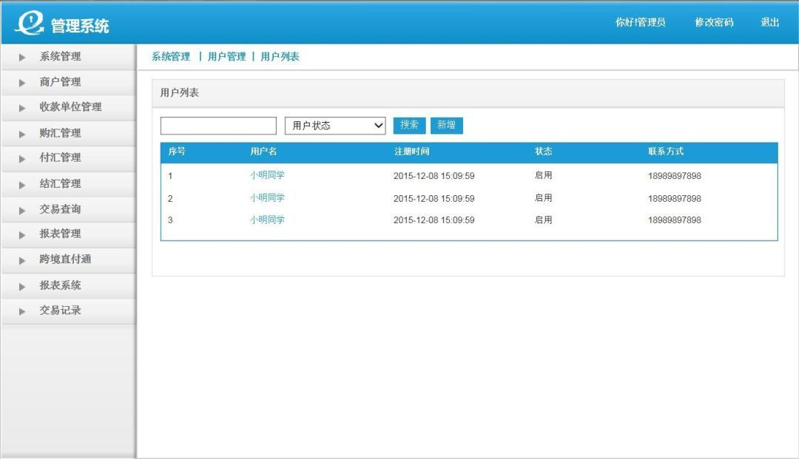

### 3.5.Edraw亿图图示（推荐指数****）

国内不错的绘制软件，有很多款软件，

[http://www.edrawsoft.cn/](http://www.edrawsoft.cn/)

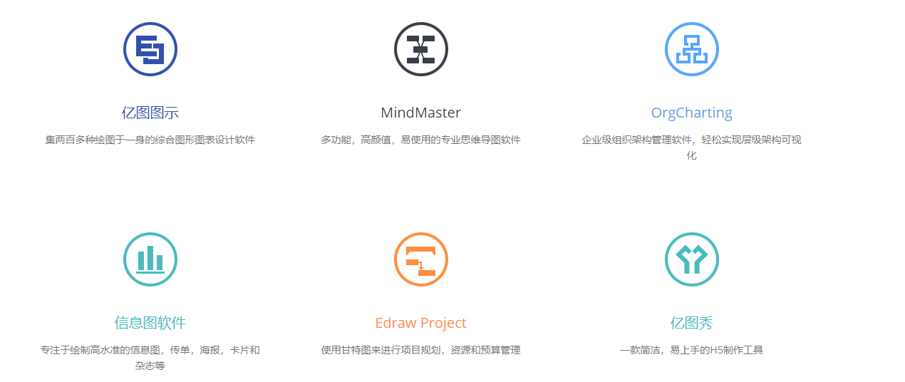

### 3.6.PxCook

一款还不错的标注工具.

优点：

- 成熟：跨平台——支持Windows和Mac

- 成熟2：支持PS和Sketch。

- 交互特别智能，也方便，一拖一放就标注完了。

- 相当需要说的一点：对于PSD文件或者Sketch进行了修改之后，PxCook里的标注会自动进行更新，免除了手动操作的过程。这是后面很多软件没有的。

- 支持移动设备的多单位切换。

缺点：

- 不能支持多个文件同时进行标注。

- 对于图层样式等信息，不能进行详细查看。

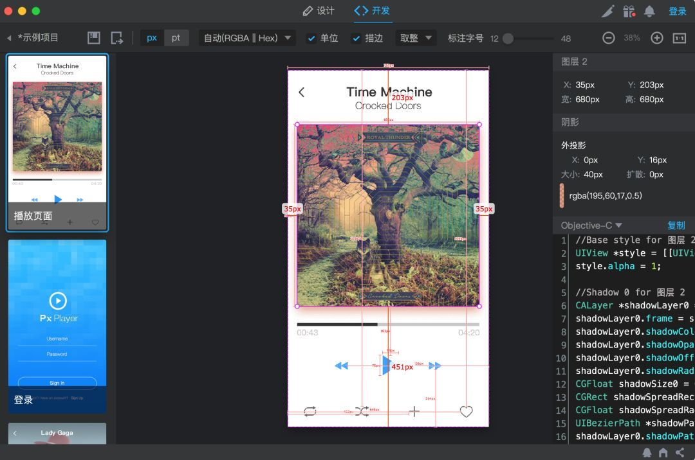

### 3.7.iThoughtsX 

优秀的思维导图工具

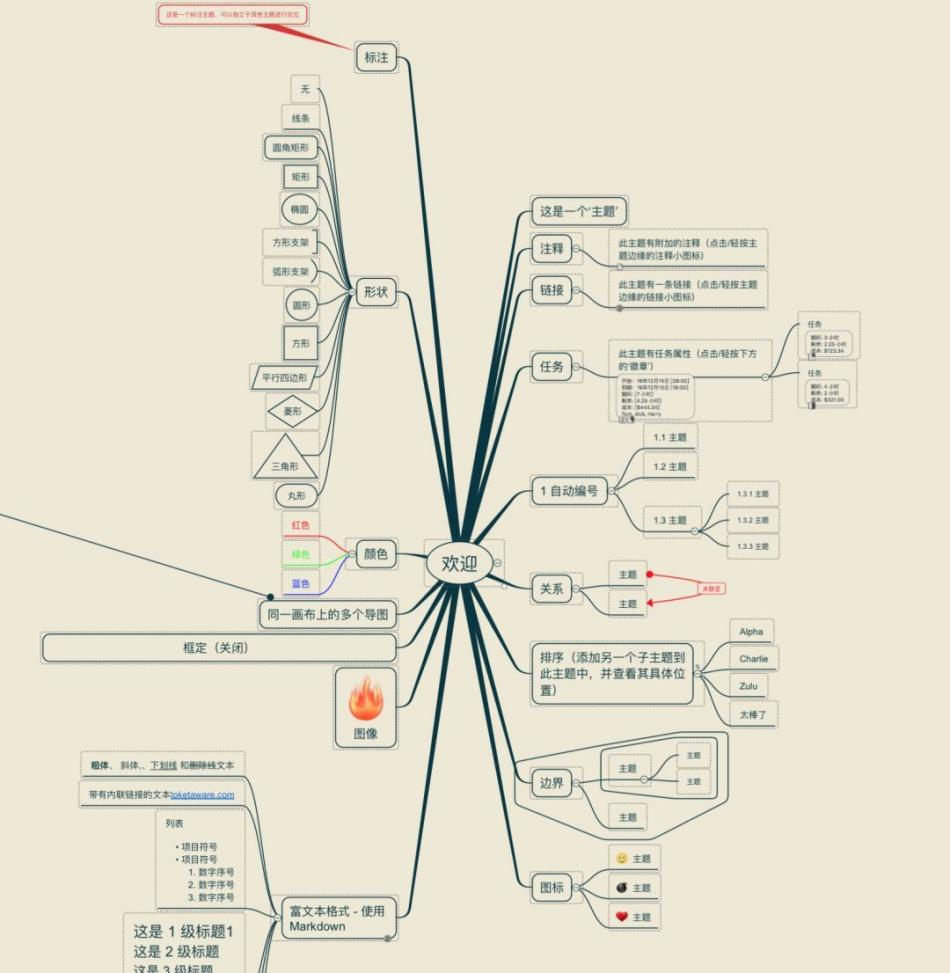

### 3.8.OmniPlan

最NB的项目管理流程软件，OmniPlan旨在帮助您可视化，维护和简化您的项目。分解任务，优化所需的资源，控制成本，并监控您的整个计划，都一目了然。协作与您的同事和分享每一个细节，更新日历与你的天关，或混搭。接受和拒绝一次过改变一个接一个或所有。

OmniPlan提供了像甘特图，时间表，摘要，里程碑和关键路径的功能突出显示，让您管理您的所有活动。从自定义的视图来快速输入数据，
OmniPlan帮助您管理，因为你需要他们，简单或复杂的项目是 - 不需要复杂。

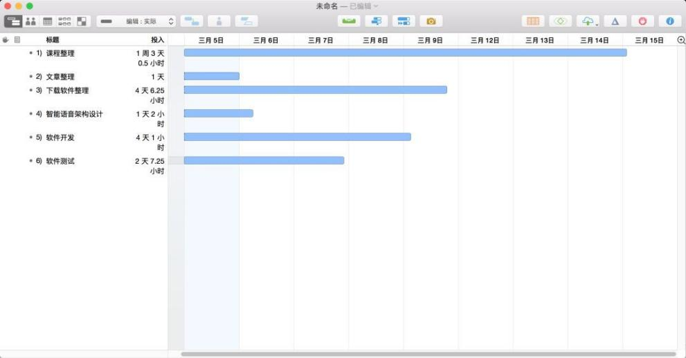

### 3.9.摹客

原型、UI 设计

https://www.mockplus.cn/

### 3.10.墨刀

原型、UI 设计

https://modao.cc/

原型、UI 设计

https://www.mockplus.cn/

## 4.案例

### 4.1.系统组成图

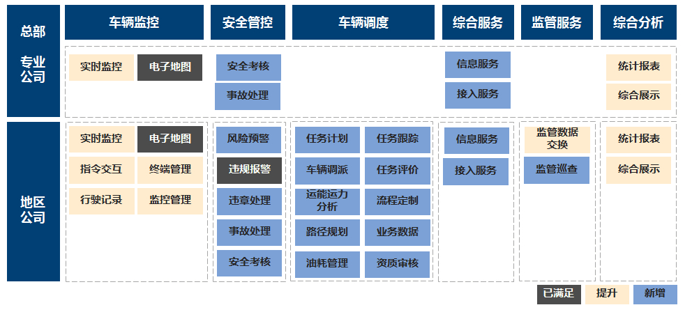

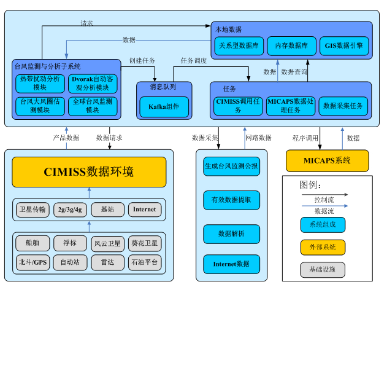

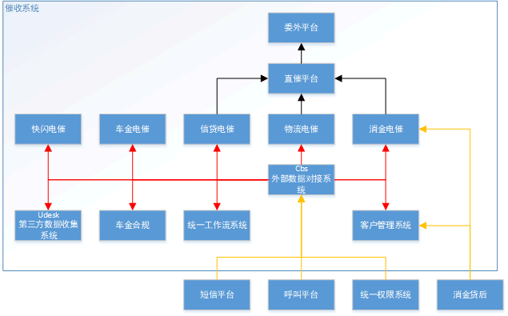

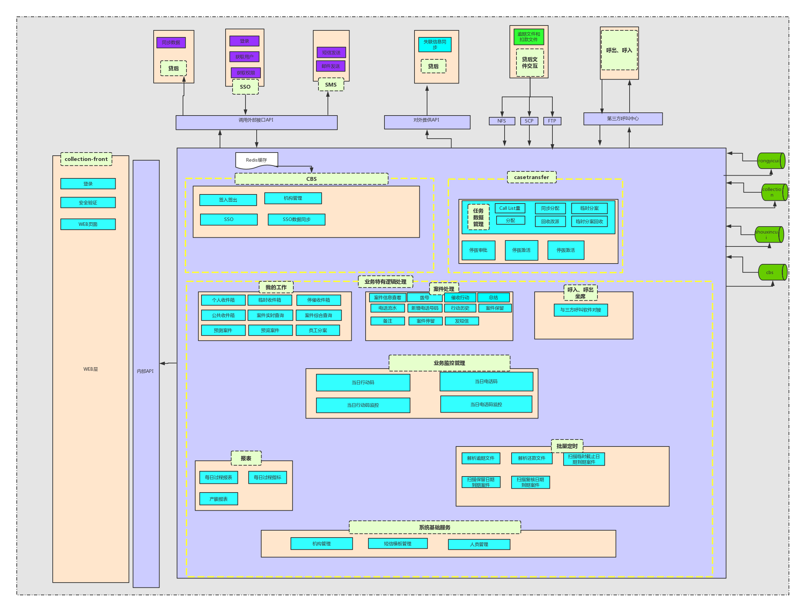

