# 0.架构入门

## 什么是架构

架构，其实是一个很学术的概念：架构是系统的基本结构，它由多个组件以及它们彼此间的关系而组成，并且在一定环境和原则下进行设计和演变。

简单理解，架构就是“框架”、“结构”。

对于任何一个系统来说，它都可以几个部分组成，组成这个系统的元素，专业术语就叫“组件”，而一个好的架构，除了要表达“构成”，还应表达组件之间的关系。就如下面这个火车的设计架构一样：
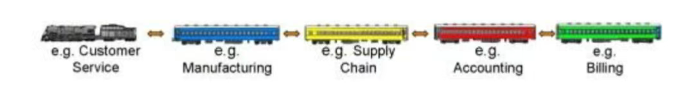

正是因为它采用了多节车厢通过“标准接口”互相连接的架构设计，才使得这个火车具有了这样的能力：当一节车厢被替换成另一节车厢时不会对整列火车造成什么影响，即使火车演化到今天，这个设计理念依然有效。

概念听起来有点学术的味道，但其实架构就在我们身边，比如城市的规划、建筑设计、工厂设计、企业数字化转型规划，甚至是国家的发展规划，都有用到架构的理念和方法。
2018年印度政府的国家发展规划就是完全采用了企业架构TOGAF9.2的ADM方法完成的。

既然城市有架构，国家有架构，那么整个世界也一定是有架构的。因为世界是一个复杂系统，所以对世界架构的构成有多种说法，这里采用的架构方法来源于下面这张架构图：
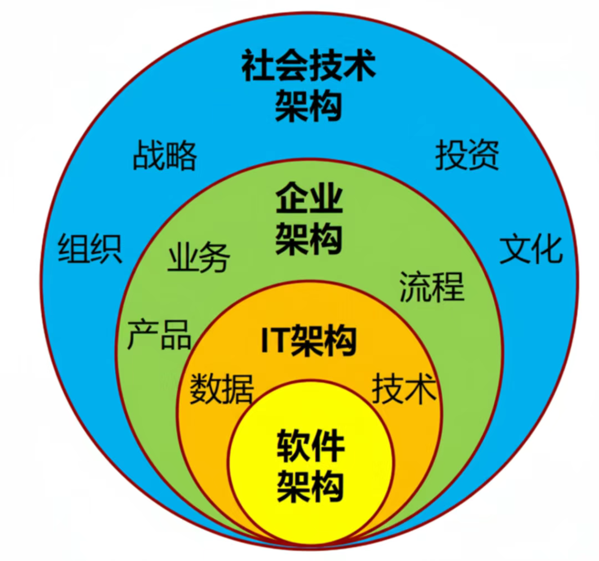

这是部分架构学者所提出的“社会-技术”架构框架，为简单表达，我重画下面这张图，或许更好理解一些：
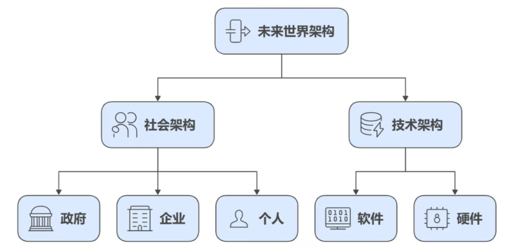

这里面，我把世界分成了两个大的维度：
1. 一是社会维度，其中又包含：
    - 政府维度：承担公共管理职能，制定规则（如法律、政策），提供公共服务（如教育、医疗、基础设施），维护社会秩序。
    - 企业维度：作为经济活动的核心载体，创造产品和服务，提供就业岗位，推动技术创新，是连接生产与消费的关键环节。
    - 个人维度：既是社会活动的参与者，也是最终受益者。个人通过就业、消费、社交等行为，与政府、企业产生关联，同时也会形成家庭、社群等更小的社会单元。
2. 二是技术维度，其中又包含：
   - 硬件技术：核心硬件、终端设备、通信与连接、工业与制造等。
   - 软件技术：操作系统、应用软件、开发运维、网络与安全软件等。

## 架构师

借用“陈皓”的话

1. 架构是妥协的艺术“没有完美的架构，只有适合当前团队、当前业务、当前资源的架构。”
2. 简单是终极的复杂“能用三个服务解决的问题，不要拆成十个。每多一个服务，就多十分复杂度。”
3. 代码是最终的权威“不写代码的架构师是在耍流氓。设计必须能落地，接口必须自己先实现一遍。”
4. 为失败而设计“先想好这个设计会怎么失败，而不是怎么成功。回滚方案比上线方案更重要。”

## 未来架构

### 1.AI架构

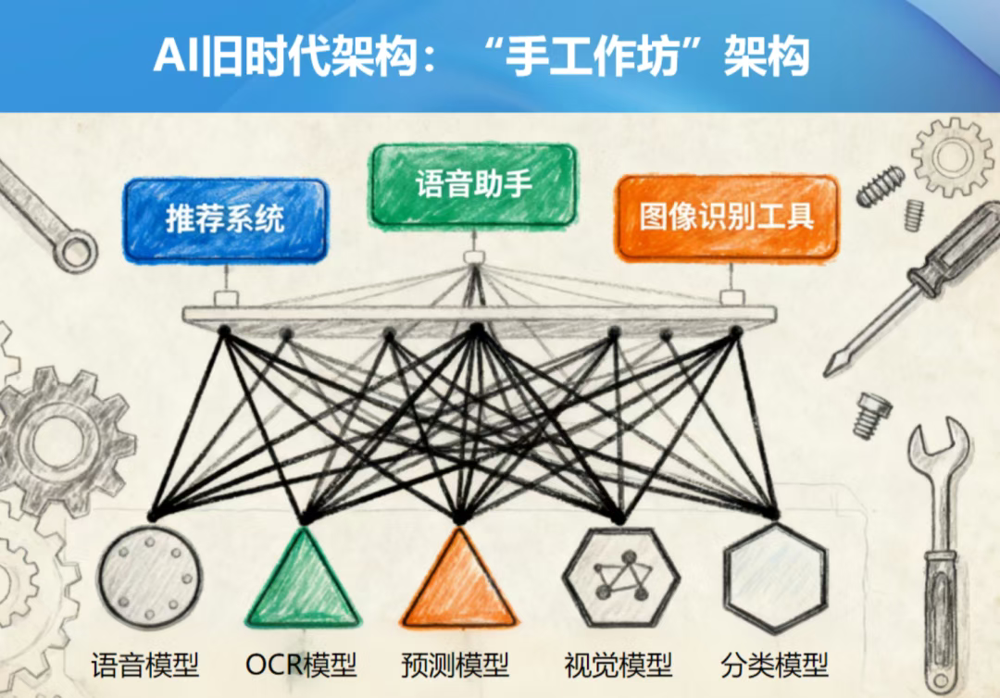

未来具有研发大模型能力企业，将成为大模型工厂，是基础模型的生产者，而使用这些大模型的企业和个人就是大模型的消费者，
而且有的企业已经开创性提出前“场”+后厂的架构：大模型工厂（或AI工厂）研发出基础大模型以后，
进入企业的“后厂”进行二次训练（垂直知识训练、微调）形成行业或专业大模型，然后对业务侧各种“场景”赋能。

### 2.AI人员发展路线

横轴越向左越偏技术，越向右越偏业务
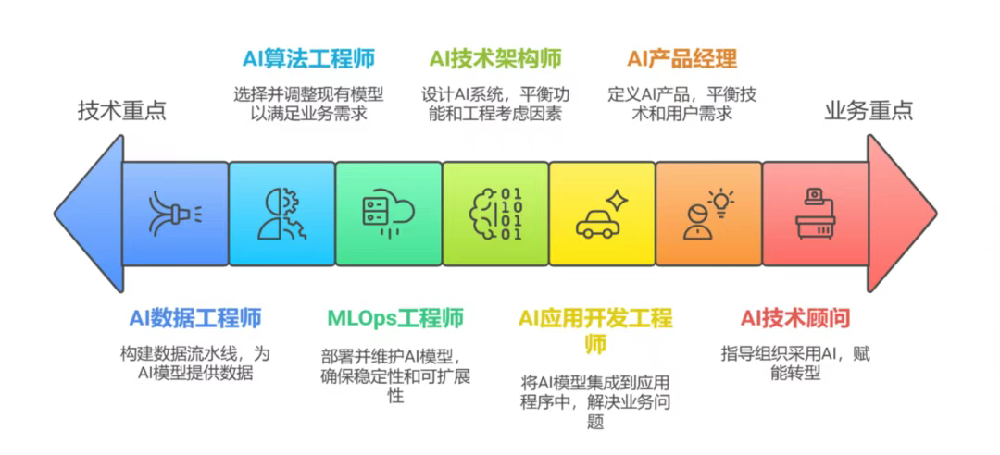

## 架构思维

### 1. 架构师的工作分类
在大型公司内部，架构师通常会根据业务规模、技术领域和职责范围，对架构进行细粒度的划分。
- 核心作用:通过专业分工提供架构设计的效率和质量，同时避免架构混乱（技术栈碎片化、集成难度高、扩展性差等问题）。
- 本质：架构应该是一个团队，而非个人，一个人容易陷入具体的事情中，需要大家合力完成共同的目标。

分类：
1. 基础架构师：为公司全部提供提供统一标准的技术底座，聚焦统一技术组件和基础设施，有时公司会继续划分为网路架构师、基础施设架构师、平台架构师等。
2. 业务架构师：通常会深入开发团队，在特定的业务领域中，帮助系统能够支持其业务的发展。
3. 数据架构师：聚焦数据的全生命周期，解决“数据散乱、不标准、不一致、难复用”等。
4. 云计算架构师：聚焦私/公/混和云的基础能力，为公司提供成本合理、可用性高的云资源。
5. 云原生架构师：基于容器技术，架构高可用架构，帮助系统架构演进。
6. 解决方案架构师：聚焦 “特定场景 / 项目” 的端到端架构方案，解决跨领域的复杂技术问题，通常为售前或者交付部门的职务。
7. 架构治理师：确保 “架构一致性”，避免多团队各自为战导致的技术债累积，制定架构规范，参与架构评审、推荐架构演进与知识沉淀。

### 2.技能要求
1. 系统架构设计能力：熟悉分布式架构、微服务架构，对DDD要有一定程度的理解。
2. 编程能力：精通主流的编程语言（Java、Golang、Python等），主流的框架。
3. 数据库设计与优化:熟悉主流的数据库（MySQL、Redis、ES等）
4. 网路与安全：了解网路通讯原理和安全机制。
5. 云计算与云原生：了解基础使用、成本、运行机制等
6. 监控：掌握系统性能调优，识别性能瓶颈，了解性能指标
7. 项目管理与团队协作：具备良好的项目管理能力，能够协助完成跨团队完成项目目标。
8. 技术管理与培养：具备良好的技术领导能力，能够指导培养普通开发人员。

所以架构师必须具备广博的技术实力，还得有一定的团队管理能力。

### 3.架构在团队中的作用
架构在团队中拥有全局的视角一个角色，主要作用分为几个方面
1. 技术架构设计：负责系统架构设计，包括架构设计（模块与DDD）、技术选型（框架、中间件、数据库等），确保架构能满足业务需求（高并发、高可用、低延迟等）。
2. 制定标准：帮助团队统一技术规范和技术标准，统一代码风格，降低技术负债，提升系统安全性等。
3. 解决技术难题：针对各类技术问题（系统复杂度、性能瓶颈、系统故障等）提供解决方案。
4. 项目质量把控：除了技术方案评审，还要深入开发团队，参与核心模块的开发评审中，识别技术分险点（例如扩展性不足、性能隐患等），制定应对策略，确保代码质量和架构稳定可靠。
5. 业务与技术之间的桥梁：深入理解业务，将业务目标 转换为 合理的技术架构设计，平衡技术与业务，满足业务快速发展迭代的同时，确保系统能够支持器业务的长期发展。
6. 技术引领与培养：架构作为团队的“布道者”，需要评估新技术的可行性，组织技术分享、培训活动，推进团队技术成长与知识沉淀。

架构在团队中实现 “个人价值→团队价值→业务价值” 的递进式落地。

### 4.架构主要的工作
架构的核心工作：就是服务于业务系统，解析系统性问题。

1. 深入业务，了解业务，以业务为抓手。
    1. 如何快速了解业务？业务形态（B端系统复杂C端高并发）；痛点（支付的事务一致性，社交要求实时性）；规模预期等。
    2. 业务如何影响技术选型？快速迭代springboot+微服务；事务一致性seata；
2. 系统化设计，要兼顾功能性 与 非功能性，也就是系统不仅要跑通还要跑的好。
    1. 先定“骨架”：例如DDD，整理核心领域、划分服务边界，约定接口设计规范等
    2. 再定“血肉”：主要是非功能性的设计，例如高可用（冗余部署、熔断降低）、高性能（缓存、异步、并行、MQ等）、可扩展（动态服务注册与发现）
3. 务实落地，具体的coding环节，保质保量。
    1. 运行单体架构快速迭代，但是必须保留模块化设计，预留微服务拆分的能力。
    2. 工程规范化，制定标准，例如Java代码规范、接口规范、数据库规范等。
    3. 测试。推进单元测试，性能测试，有能力的准备集成测试、webui测试等。
    4. 监控：JVM、宿主(服务器或者容器)、业务指标等，确保设计在运行时有效。
4. 拥抱变化，架构是“进化”，而非“固化”。技术与业务永远在变化，架构必须具备“可演进性”。
    1. 定期复盘架构，例如关于数据增长调整分片策略、根据性能指标优化性能等，以数据驱动优化，让架构随着业务一起成长。
    2. 基于Java技术趋势调整。例如从单体 到 微服务 再到 服务网格的演进。
5. 团队赋能：架构在团队中的角色是“布道者”而是“独裁者”。
    1. 知识积累，整理知识库，让团队有迹可循。
    2. 技术分享，协助开发，培养核心成员参与架构决策等过程可以帮助团队成长。

架构思维是什么？

如何培养架构思维？

从开发到架构，思维有哪些转变的地方？

如何培养架构的系统性思维？

## 架构图

常见架构图包括：技术架构、数据架构、业务架构、应用架构、产品架构和项目架构，这些架构图代表了系统设计和管理中的不同层面和视角。

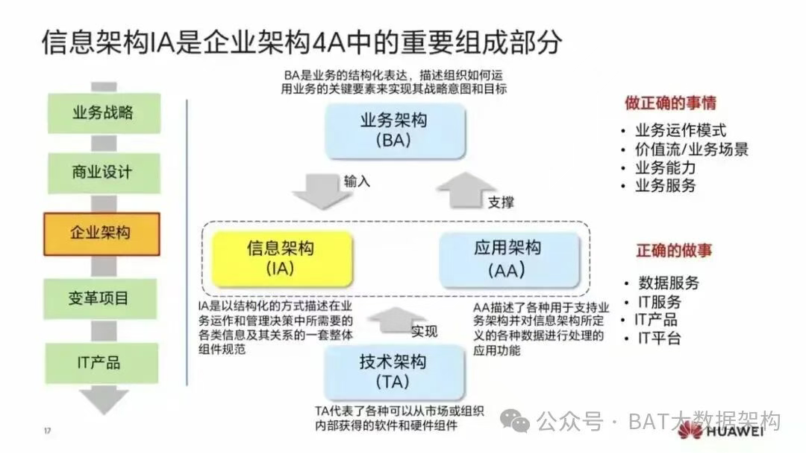

### 1. 业务架构
业务架构关注的是组织的业务战略、流程、能力和治理结构。它描述了企业“做什么”以及“为什么做”。

核心内容：包括企业的商业模式、战略目标、关键业务流程（如订单处理、客户服务）、组织结构和核心业务能力。

目的：确保IT系统与业务目标保持一致，为技术投资提供方向。

举例：一家电商公司的业务架构会定义其核心业务流程，如“用户下单 → 支付 → 仓储发货 → 物流配送 → 售后服务”。

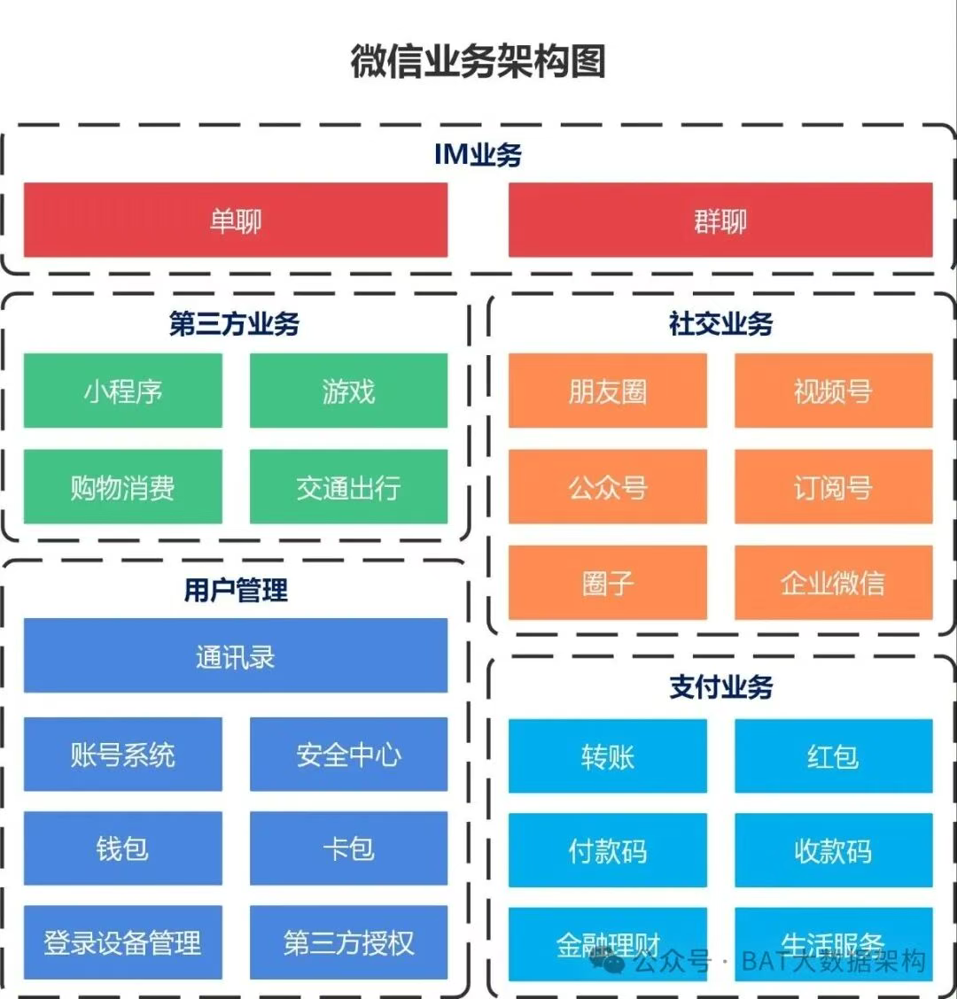

### 2.产品架构
产品架构针对的是一个具体的产品（尤其是软件产品），定义其内部的功能模块、组件结构和交互方式。

核心内容：包括产品的功能划分、模块之间的接口、用户体验流程、信息结构和技术选型对产品设计的影响。

目的：指导产品的设计、开发和迭代，确保产品结构清晰、可扩展、易于维护。

举例：一个移动App的产品架构可能包括“用户中心”、“订单管理”、“支付模块”、“推荐引擎”等组件及其交互逻辑。

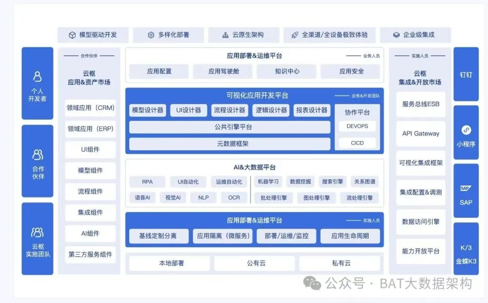

### 3.应用架构
应用架构描述组织内部各种软件应用系统的布局、功能、交互关系以及它们如何支持业务流程。

核心内容：包括应用系统的清单、功能边界、系统间的集成方式（如API、消息队列）、部署模式（如单体、微服务）等。

目的：优化应用组合，减少重复建设，提高系统间的互操作性和效率。举例：

企业可能有ERP、CRM、HR系统，应用架构会定义这些系统如何通过接口协同工作。

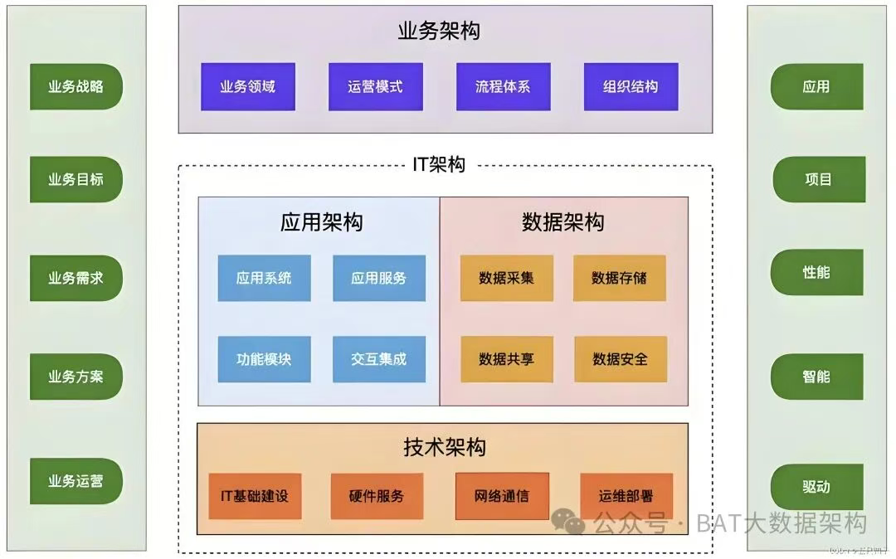

### 4. 数据架构
数据架构关注组织的数据资产，包括数据的结构、存储、流动、管理和治理。

核心内容：包括数据模型（概念、逻辑、物理）、数据库选型（如MySQL、MongoDB）、数据仓库、数据湖、ETL流程、元数据管理、数据安全和数据质量。

目的：确保数据的一致性、完整性、可用性和安全性，使数据成为可信赖的资产。

举例：企业的数据架构会设计客户数据如何从CRM系统抽取，经过清洗后存入数据仓库，供BI报表使用。

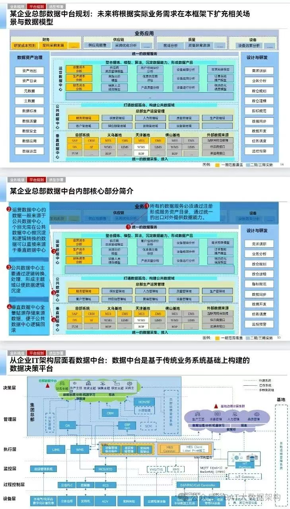

### 5.技术架构
技术架构也称为基础设施架构，描述支撑应用和数据运行的底层技术环境。

核心内容：包括服务器、网络、存储、操作系统、虚拟化、容器平台（如Kubernetes）、云计算服务（如AWS、阿里云）、中间件、安全设施等。

目的：提供稳定、安全、高性能、可扩展的技术基础。

举例：技术架构可能决定使用Kubernetes集群部署微服务，通过负载均衡和CDN提升访问性能。

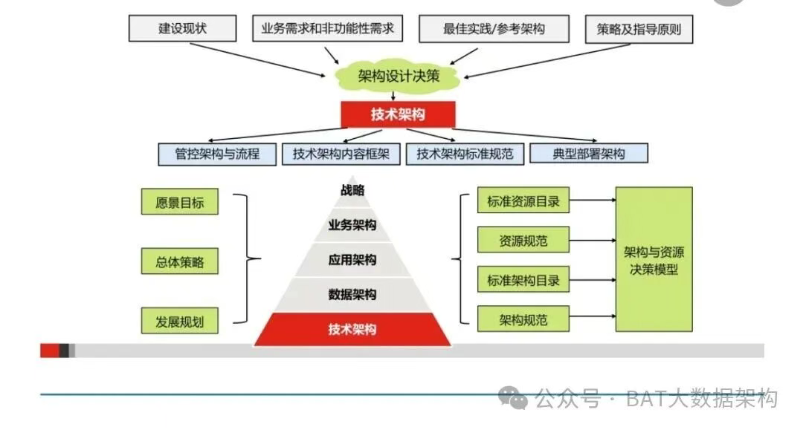

### 6.项目架构
项目架构是针对一个具体项目的临时性技术设计和组织方案，通常在项目启动时定义。

核心内容：包括项目的技术栈（如React + Spring Boot + MySQL）、代码结构、开发框架、CI/CD流程、团队分工和交付计划。

目的：为项目的顺利实施提供技术路线和组织保障。

举例：一个开发新功能的项目，其项目架构会明确使用的技术、开发流程和时间节点。

