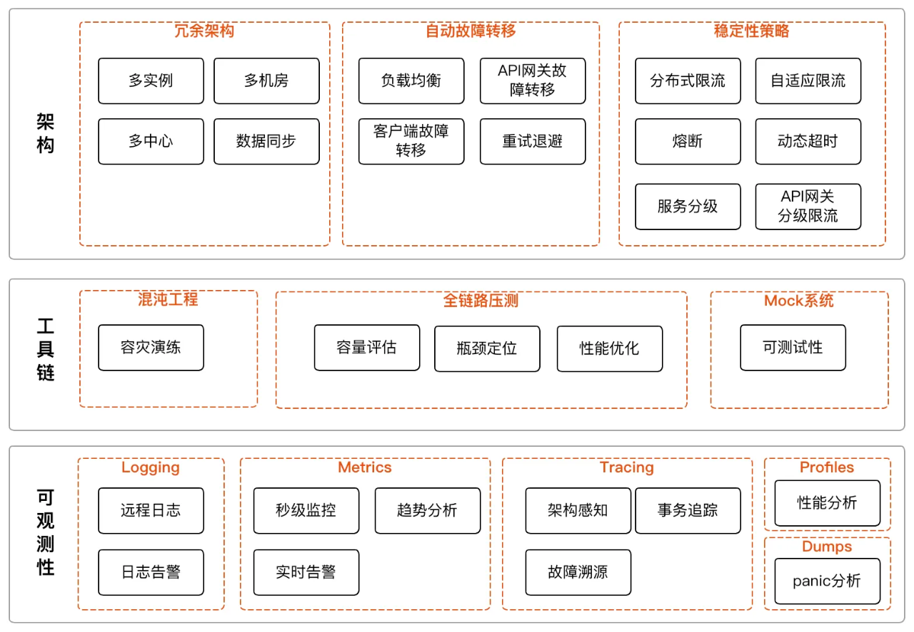
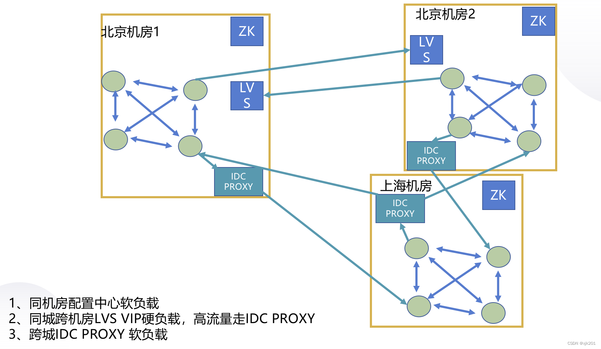
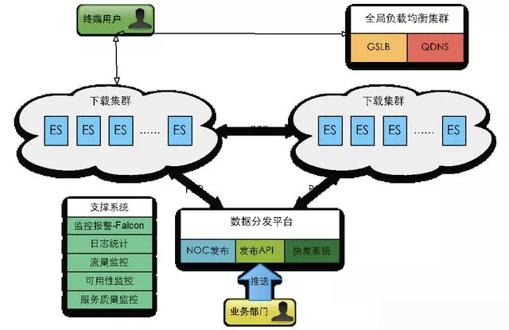
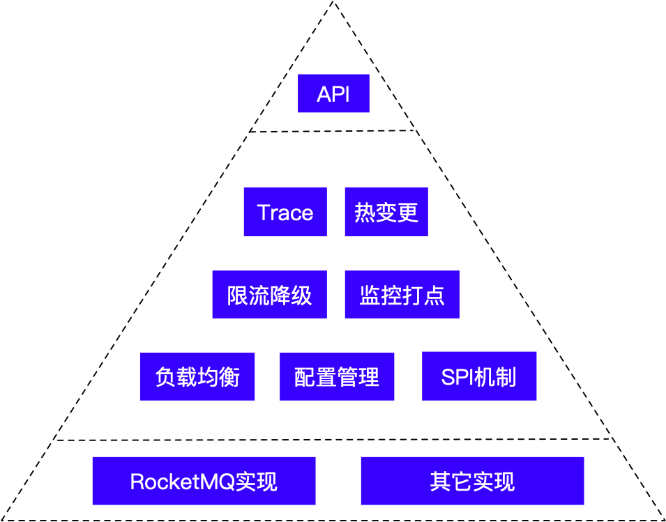
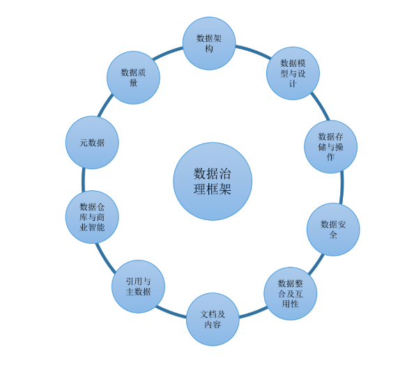

# 4.解决方案

## 架构方案

程序员技能图谱：[https://github.com/TeamStuQ/skill-map](https://github.com/TeamStuQ/skill-map)

程序员技能图谱是由极客邦科技 [Geekbang](https://www.geekbang.org/) 发起的一个技术社区开源项目，志在汇集、整理、共建泛IT技术领域
（人工智能，前端开发，移动开发，云计算，大数据，架构，运维，安全，后端开发，测试，智能硬件等）及互联网产品、运营等领域学习技能图谱，
帮助程序员梳理知识框架结构，并尝试提供路径指导和精华资源，方便技术人学习成长。

### 技术峰会

- infoq [https://www.infoq.cn/archives](https://www.infoq.cn/archives)
- qcon,全球软件开发大会 [https://qcon.infoq.cn](https://qcon.infoq.cn)

### 网络资源大全
《伯乐在线提供以下资源》
- Java资源大全中文版 [https://github.com/jobbole/awesome-java-cn](https://github.com/jobbole/awesome-java-cn)
- Go资源大全中文版 [https://github.com/jobbole/awesome-go-cn](https://github.com/jobbole/awesome-go-cn)
- MySQL 资源大全中文版 [https://github.com/jobbole/awesome-mysql-cn](https://github.com/jobbole/awesome-mysql-cn)
- Python 资源大全中文版 [https://github.com/jobbole/awesome-python-cn](https://github.com/jobbole/awesome-python-cn)
- Python 技术书 [https://github.com/jobbole/awesome-python-books](https://github.com/jobbole/awesome-python-books)
- 面试题大全 [https://github.com/jobbole/architect-awesome](https://github.com/jobbole/architect-awesome)
- 机器学习资源大全中文版 [https://github.com/jobbole/awesome-machine-learning-cn](https://github.com/jobbole/awesome-machine-learning-cn)
- 系统管理员资源大全中文版 [https://github.com/jobbole/awesome-sysadmin-cn](https://github.com/jobbole/awesome-sysadmin-cn)
- JavaScript 资源大全中文版 [https://github.com/jobbole/awesome-javascript-cn](https://github.com/jobbole/awesome-javascript-cn)
- 经典编程书籍大全 [https://github.com/jobbole/awesome-programming-books](https://github.com/jobbole/awesome-programming-books)

### 架构案例
- 互联网公司经典技术架构 [https://github.com/davideuler/architecture.of.internet-product](https://github.com/davideuler/architecture.of.internet-product)
- 大厂技术面试题目[https://github.com/0voice/interview_internal_reference](https://github.com/0voice/interview_internal_reference)
- QQ音乐高可用架构体系 [https://mp.weixin.qq.com/s/G00cwGYAr6l2Px6-DiwXLA](https://mp.weixin.qq.com/s/G00cwGYAr6l2Px6-DiwXLA)
- 腾讯财付通会计核算系统原理与架构 [https://mp.weixin.qq.com/s/j88jXaY6HXw6MYlIj0ThyA](https://mp.weixin.qq.com/s/j88jXaY6HXw6MYlIj0ThyA)
  
- [京东亿级商品详情页架构演进技术解密](https://mp.weixin.qq.com/s/EFENLWb_pzttU6iycQyZiQ)
### 事故

- 记一次SSL握手导致业务线程阻塞的案例分析 [https://heapdump.cn/article/5250641](https://heapdump.cn/article/5250641)
- 线程池bug导致系统卡顿 [https://mp.weixin.qq.com/s/-ff7Enr4AMUDi8MR1LQqzw](https://mp.weixin.qq.com/s/-ff7Enr4AMUDi8MR1LQqzw)

### 故事
- 七十年编程语言发展漫谈 [https://mp.weixin.qq.com/s/4MD4b673b1kkBGhYINSoNQ](https://mp.weixin.qq.com/s/4MD4b673b1kkBGhYINSoNQ)

## 脱敏

### 1.基础
- [Apache ShardingSphere数据脱敏全解决方案详解](https://my.oschina.net/u/3867294/blog/3089014)
- [基于注解实现数据脱敏](https://gitee.com/luckSnow/knowledge/tree/master/learn_code/src/main/java/com/zx/_04_安全/数据脱敏/基于程序控制)
- [大厂也在用的 6种 数据脱敏方案](https://mp.weixin.qq.com/s/zGVTi3_EG750yQ9FyYAT1A)

在应用中增加数据安全相关的功能，需要从以下几个方面考虑
- 敏感数据发现：通过被动感知和主动探测的方式，快速发现网页中的敏感数据，对敏感数据进行分类和分级，帮助企业从安全角度梳理数据资产，并满足符合行业法规的相关要求
- 废弃API识别：针对内部业务进行api智能梳理，识别异常和废弃API，防止数据泄漏风险的发生
- 智能数据脱敏：通过丰富的脱敏算法与灵活的脱敏配置，对身份证号、银行卡号、手机号等敏感数据进行智能脱敏，将管理员从繁琐的安全策略配置和安全事件处理中解放出来
- 水印溯源追踪：通过可以溯源的文档和图片水印，文档暗水印，有效提高员工安全红线意识，针对数据泄漏行为起到威慑作用
- 数据防拷贝：可以有效防止访问者通过复制、粘贴的方式拷贝网页上的敏感数据，进一步提高数据泄漏成本
- 敏感行为审计：数据安全网关记录操作敏感信息的行为，方便事后进行调查取证，同时也可以结合UEBA对异常行为预警，提前发现内部的数据泄漏事件
- 精准溯源：基于水印加码和行为审计，依托对泄露信息中唯一身份标识串码的追踪，结合大数据能力锁定泄密者实际身份，找到数据泄漏者
- 内网攻击防护：具备常见攻击防护能力，即使内网失陷，也可以有效感知到内网攻击并告警，通过防护能力加强内网系统自身的安全性，保护内网核心数据安全

脱敏类型：
1. 数据库脱敏。应用程序进行加密和解密。
2. 接口脱敏。dubbo过滤器+注解规则。
3. 日志脱敏。资源足够的可以使用正则对全量日志进行脱敏，通过对日志组件的扩展实现，日志落盘几位脱敏数据，资源有限可以在日志平台进行脱敏。
4. 页面层脱敏。第三方网关层次的正则匹配。请求发出后，经过脱敏平台处理，再返回给接收方。例如，

脱敏方案：
- 无效化。对数据值进行 截断、加密、隐藏 等操作
- 随机值。覆盖原始值
- 数据替换。使用固定数据进行局部替换。
- 对称加密。
- 平均值
- 偏移和取整

### 2.日志脱敏

不同与上面的脱敏，日志脱敏非常另类，既没有从根源上解决数据脱敏的问题，还平白无故的增加了大量的工作。

- [自定义脱敏组件（slf4j+logback）](https://blog.csdn.net/qq_40885085/article/details/113385261)
- [插件源码](https://gitee.com/liuchengyin_vae/LogbackDesensitization)

### 3.DLP
DLP数据泄露防护系统（Data leakage prevention），又称数据丢失防护，是通过技术手段防止企业指定数据违反安全策略外流的防护策略。

提供数据层面上的脱敏策略。例如：
1. 天空卫士的DLP系统。[http://www.skyguard.com.cn/](http://www.skyguard.com.cn/)
2. 百度的智能数据安全网关：[https://anquan.baidu.com/product/dpg](https://anquan.baidu.com/product/dpg)

## 埋点

[埋点与监控](https://blog.csdn.net/Jensen_Yao/article/details/105613419)

在互联网产品上线之后，产品和运营人员需要即时了解产品的使用情况，有多少用户，用户使用了哪些功能，停留时长，使用路径等等。
要回答这些问题，需要有数据，不能拍脑袋想当然。数据怎么得到呢？埋点就是采集数据的重要途径。

数据埋点不是新名词，在电脑网站出来之后就有统计工具，站长们很熟悉的谷歌、百度统计等工具，通过在 HTML 页面中嵌入它们提供的 js 代码实现数据采集。

多说几句，无论谷歌、百度还是其它的 Web 页面统计工具，技术实现原理通常都是由 Web 服务器端通过代码的方式向浏览器返回一张 1*1
像素的透明图片(在网页上人眼看不到这张图片)，图片的过期时间设置成立即过期，这样每次打开页面浏览器都会去请求这张图片，服务器端就可以记录下请求数据。
明白了原理，自己也可以写一个简单的统计工具。

在设计埋点方案之前需要确定收集哪些数据，将这些需求汇总，产品、运营、技术一起确定埋点方案。从埋点位置划分，可以分为：前端埋点和后端埋点。

### 1.前端埋点
顾名思义，就是在用户可见的那端(APP、网页、PC客户端、小程序)嵌入数据采集代码，像一些第三方的统计工具，比如友盟等，前端嵌入它们的 SDK，调用 SDK 提供的接口采集数据。

前端埋点能收集到用户在界面上的操作轨迹，这些数据后端没法收集，比如用户点击了哪个按钮，打开了哪些页面，页面之间的跳转次序等。目前常见的前端埋点技术，有下面三类：

#### 1.1.代码埋点
谷歌统计、百度统计、友盟等都是代码埋点的例子。在前端代码里嵌入数据采集代码，比如在APP启动时嵌入，在按钮点击事件里嵌入等。

代码埋点的优点是控制精准，采集的数据项精确。缺点：首先是需要开发人员到处添加采集代码，添加和修改的工作量大；其次变更采集策略，需要发布新版本，代价巨大；
此外对于APP来说还有耗电、消耗数据流量、丢失数据的风险。

#### 1.2.可视化埋点
从上面可知，代码埋点的缺点很多，最大的缺点是变更需要开发人员修改代码，不灵活。
为了改善，有的公司开发出了可视化埋点技术，产品与运营人员通过GUI界面，鼠标点击的方式随时调整埋点位置，增加、取消埋点，再也不需要开发人员的介入，而且不用发布新版本。
技术实现原理：基本原理就是将埋点位置信息做成可配置的资源，通过在后台管理端上操作生成这些配置，客户端启动或者定时从服务器端获取这些配置，
客户端根据最新的配置采集数据，发送给服务端。

#### 1.3.无埋点
原理跟可视化埋点几乎一样，唯一的不同就是，无埋点是先把所有控件的操作数据采集下来，发给服务器，数据分析人员在后台管理端设置对哪些数据进行分析。
由此可知，这个方案收集的数据量巨大，增加了网络传输和服务器存储负担。
无埋点比可视化方案优势的地方是收集的历史数据齐全，可以回溯分析过往数据。

### 2.后端埋点
后端埋点就是在服务端嵌入代码，收集数据，由于是在服务端采集数据，可以避免前端埋点的以下一些问题：
- 客户端采集数据，为了尽量减少对用户体验的影响，需要对采集的数据压缩、暂存，为减少移动端的数据流量，一般只在网络状况良好的情况下向服务器发送数据，
  因此数据会有延迟，丢数据等弊端。而在服务端采集数据，数据在内网传输，数据传输的即时性强，丢失数据的风险小。
- 客户端采集数据，如果要增加采集点或变更采集方案，需要修改客户端代码，这就需要发布新版本，受发布周期的影响，而且通常很多用户并不会及时更新版本，
  将导致新方案不能覆盖所有用户。在服务端采集数据则没有这些问题。

通过以上比较，实施时尽量采用后端埋点，除非后端没法采集到所需要的数据。

### 3.工具选择

国内不少数据服务公司提供了数据采集、分析工具，初创公司可以选择使用它们的服务，不过最好选择可以独立部署的提供方，方便控制，防止数据泄漏。

总结一下，数据埋点需要根据需求而定，灵活使用以上方案，扬长避短。

- 国内埋点分析平台：  https://www.growingio.com/
- 神策：			  https://www.sensorsdata.cn/manual/
- 百度统计：			  https://tongji.baidu.com/

## 缓存

使用缓存常见方案
1. 穿透写。在一个事务中，同步更新数据库和缓存，确保两者同时成功或失败。
   优点：实时性强。缺点：事务性无法100%保证。
2. 旁路缓存。常用的方案，就是缓存未命中时查询数据库，将数据写入缓存。
   优点：实现简单，适用读多写少场景。缺点：数据最终一直，缓存有延迟。且容易导致服务器压力。
3. 异步回写。先写入缓存、再异步将数据会写到数据库。
   优点：性能高，适合写密集场景。缺点：存在数据丢失风险（需持久化缓存或引入重试机制）。
4. 异步更新。先写入数据库，再异步更新到缓存。对热点数据使用永不过期 + 后台异步更新（需处理短暂脏数据）


需要防止出现问题：并发更新（分布式锁）、缓存击穿/雪崩。

思路：
1. 优先考虑最终一致性：多数场景可接受短暂不一致
2. 异步补偿机制：通过消息队列重试失败的缓存更新，数据要可靠，要最终一致性
3. 监控与报警：定期比对缓存与数据库数据，发现不一致时触发修复。

<p style="color: red">如何设计热点微博场景？</p>
其实绝大部分微博的查阅量都是几乎没有的。热点微博的数量其实非常的少，百万条中不一定有一条。
基本设计思路：缓存分层、热点监控、容灾设计等。
1. 采用本地缓存（如Caffeine）应对瞬时高频访问，结合分布式缓存（如Redis集群）承载海量热点数据，减少数据库压力。
2. 热点数据静态化。微博发文后不可修改内容，所有将微博静态化后，可以缓存到Nginx、CDN、客户端等。将压力前置与分散开。
3. 热点数据监控。
   - 实时监控：基于滑动窗口、流式计算（Flink/Storm）统计访问频次，识别突增流量。
   - 热度预判：运营预设（如热搜预热）、机器学习预测潜在热点，提前加载至缓存。
   - 动态淘汰策略：结合时间窗口热度排名（如Top-N），定期更新缓存内容，而非传统LRU/LFU。
4. 容灾设计。
   - 大量无状态服务部署（本地缓存）、redis多副本多节点集群、热key分片等
   - 降低,过载保护：通过限流算法、降低服务压力，并通过服务降低（放回默认页），延缓服务压力
   - 熔断：redis故障后开启限流，本地缓存兜底部分流量，保障系统可用性。
5. 并发写控制。
微博除了看之外，最大的部分是写评论。实际是我们评价之后，可以实时看到自己刚刚的评论，而且是在最上面第一个，但是别人看不到。因为微博评论是需要进行风控审核。评论之后只是写入，但是不会立即更新缓存，而是慢慢异步的更新。而自己查看时是将自己未进入缓存的评论+缓存一个拼接起来返回给客户端。

## 接口幂等性
幂等性即使同一个操作，无论操作多少次，每次生产的效果或者返回的结果都是一样的
- 前端控制：按钮禁用，等待响应后恢复。
- 唯一索引：比如订单号、全局ID等。
- Token：防止多次提交。
- 布隆过滤器：极大程度避免重复调用。
- 悲观锁+乐观锁：版本号控制

## 秒杀系统

案例：[https://mp.weixin.qq.com/s/ijw9_TudDTYg7Nyrc2NmMA](https://mp.weixin.qq.com/s/ijw9_TudDTYg7Nyrc2NmMA)

[https://developer.51cto.com/art/201909/602864.htm](https://developer.51cto.com/art/201909/602864.htm)

一个秒杀系统要满足3个基本要求:高并发、高可用、数据一致

解决的问题主要是两个：并发读、并发写

思考顺序如下，客户端→代理层→应用层→数据库→压力测试：
- 客户端 90% 静态 HTML+10% 动态 JS;配合 CDN 做好缓存工作。
- 接入层专注于过滤和限流。
- 应用层利用缓存+队列+分布式处理好订单。
- 并发读写：可以使用redis实现，将热点数据拆分为多个key，前端展示时将多个key进行合并。redis也可以使用集群模式，将key尽可能分散到不同的节点。做好数据的预估，隔离，合并。
- 提前做好压力测试。了解自己系统的瓶颈在哪里。

秒杀中使用的redis是经过定制的。利用 RocksDB 的存储特性，将 Redis 从 “纯内存缓存” 转型为 “内存 + 磁盘混合存储”，同时保持 Redis 的高并发处理能力，是应对秒杀等高流量场景的典型工程实践。

## 白名单&黑名单

为了封禁某些爬虫或者恶意用户对服务器的请求，我们需要建立一个动态的 IP 黑名单。对于黑名单之内的 IP ，拒绝提供服务。

架构实现 IP 黑名单的功能有很多途径：

1、在操作系统层面，配置 iptables，拒绝指定 IP 的网络请求；

2、在 Web Server 层面，通过 Nginx 自身的 deny 选项 或者 lua 插件 配置 IP 黑名单；
安装 Nginx+Lua模块，推荐使用 OpenResty，这是一个集成了各种 Lua 模块的 Nginx 服务器

3、在应用层面，在请求服务之前检查一遍客户端 IP 是否在黑名单。

## 短链

高性能短链系统： https://mp.weixin.qq.com/s/yIcQjeFfmqGBLrJPCvT_eQ

其实就是通过短域名与短的参数（一般是restfull风格）的URL，通过服务器端重定向到指定链接

比如： http://dl.cn/s/10Ganb

1. 域名：这个不用说了，就是越短越好。
2. 后缀参数：通常是使用URL计算hash值。如果遇到hash冲突就在URL中添加一个随机值继续计算hash。
3. 数值压缩。hash值长度可能也长，所以需要将其进行进制转换，例如 微博实现方案：Base62。
    以雪花算法分配一个id为例，转为62进制（0-9,a-z,A-Z），短链长度为7~9长度。
4. 优化点。使用布隆过滤器，将已经存在的短链参数保存进去，这样就不用去和数据库比较是否发生hash冲突了。

```java
public class Demo4 {
    public static void main(String[] args) {
        long n = 3002604296L;
        String s_36 = Long.toString(n, 36);
        System.out.println(s_36);//1dno8aw

        long s_10 = Long.parseLong(s_36, 36);
        System.out.println(s_10);//3002604296

        // 也可以自己定义
        System.out.println(to62(n));//3hcCxy
    }

    // 36 + 26 = 62 位
    final static char[] digits = {
            '0' , '1' , '2' , '3' , '4' , '5' ,
            '6' , '7' , '8' , '9' , 'a' , 'b' ,
            'c' , 'd' , 'e' , 'f' , 'g' , 'h' ,
            'i' , 'j' , 'k' , 'l' , 'm' , 'n' ,
            'o' , 'p' , 'q' , 'r' , 's' , 't' ,
            'u' , 'v' , 'w' , 'x' , 'y' , 'z',
            'A' , 'B' ,
            'C' , 'D' , 'E' , 'F' , 'G' , 'H' ,
            'I' , 'J' , 'K' , 'L' , 'M' , 'N' ,
            'O' , 'P' , 'Q' , 'R' , 'S' , 'T' ,
            'U' , 'V' , 'W' , 'X' , 'Y' , 'Z'
    };
    // 自定义 62位转换
    public static String to62(long i) {
        char[] buf = new char[65];
        int charPos = 64;
        boolean negative = (i < 0);

        if (!negative) {
            i = -i;
        }

        while (i <= -62) {
            buf[charPos--] = digits[(int)(-(i % 62))];
            i = i / 62;
        }
        buf[charPos] = digits[(int)(-i)];

        if (negative) {
            buf[--charPos] = '-';
        }

        return new String(buf, charPos, (65 - charPos));
    }
}
```

## 权限体系

[权限控制&登录控制](解决方案/权限控制&登录控制)

## 灰度发布

[常见发布策略优缺点](https://mp.weixin.qq.com/s/FgQgg9wANAvzNyJ4VmFmTQ)

什么是灰度发布：是一种平滑升级的策略，能够逐步将部分流量开放到全部流量，降低升级风险和范围，完成功能检验。核心就是灰度发布过程可控制、可监控、可回滚。

如何设计灰度部署策略：需要考虑三个方面，1、服务架构（单体/微服务）；2、部署方式（服务器/容器）；3、业务需求。

常见的发布策略：
- 停机发布：就是我们一般使用的部署方式。
- 金丝雀发布：只发布一部分，验证通过后，在部署剩余的部分。
- 灰度/滚动发布：金丝雀发布的延伸，可以自动回滚。对新版本进行小批量部署，小量流测试，没有问题后逐步加大部署量和引流量，最后把所有流量全部引导到新版本;
- 蓝绿发布：2套相同配置的环境，可进行切换。维护两个相同的主机环境，一个用户生产、一个用于预发布，轮换使用
- A/B测试：金丝雀发布的延伸，主要用与不用版本间进行差异对比和策略
- 流量隔离环境发布：相比灰度发布，只会影响固定的用户
- 暗箱发布:新版本被逐步测试和部署到生产环境中，用于开发人员分析与确认后，再通过开关系统开放给所有用户;

发布策略技术设计方案：分层考虑流量分发，重点是请求中的特殊表示，例如http header/cookie/param中的数据。
1. 接入层：通常选择网关实现，例如nginx（简单计算和配置）、gateway（断言和过滤器）、zuul等。
2. 配置层：通过nacos/Apollo等实现动态配置（Apollo的多环境多集群策略、路由策略、版本号）。
3. 应用层：dubbo等rpc框架，可以扩展器路由、集群和负载均衡策略，实现灰度发布、
4. 部署层：特指k8s，通过创建两个deployment，使用ingress实现两个任务之间的流量比例。
并且k8s官方提供了Argo Rollouts渐进式交互控制器，支持多种灰度发布的策略。

最佳实践。 1、明确发布策略；2、制定好监控和报警；3、自动化回滚以及自动化部署；4、流量验证；5、灰度数据隔离。

## 流量回放

详细见：[9.流量回放.md](/10.devOps/9.流量回放.md)

## 优雅停机

详细见：[1.微服务.md](/8.微服务/1.微服务.md)

## 双十一重大活动

[面对大促场景来临，如何从容进行性能测试](https://mp.weixin.qq.com/s/NRGZhlcUpocn7HvcjWiBQg)

- 服务降低，避免出现大面积的影响。
- 服务限流，尽可能的做好细粒度的限流。
- 系统核心全部。梳理全链路，当出现问题的时候能快速找到问题源头。对于关键的技术指标进行监控，比如流量、jvm、db的数据量、响应时间等
- 一致性，参与双十一的多是交易相关的，所以一定要梳理好整个链路的交易逻辑，避免出现不一致的问题。
- 全链路压测，有条件的需要搭建一个新的系统集群。

## 容灾模式

一般可分为同城容灾、异地容灾、双活数据中心、两地三中心、三地五中心等。前三个看名字就知道什么意思了，就不多解释。

一般说同城数据中心，指的是距离在200KM内的两个数据中心，当然条件好的地方，这个距离可以更大些，比如北京的数据中心。

### 1.两地三中心

两地三中心 ： 是指 同城双中心 加 异地灾备 一种商用容灾备份解决方案。

注意：同城双中心 可以是 双活节点 也可以是 一主一备。这样就出现两种架构
- 同城生产、同城灾备、异地灾备。中心化架构，2个灾备资源只做数据同步，比较浪费资源
- 同城生产1、同城生产2、异地灾备。生产1和2之间同步复制数据，1和2异步向灾备复制。1和2各占50%的流量
- 更加好的架构模式：集群节点互为主备，同时运行。

特指金融级别的高可用性和灾难备份的能力。至少要确保数据层面（数据库）上的架构

- [两地三中心案例](https://blog.csdn.net/haydenwang8287/article/details/113522741)
- [两地三中心及其灾备](https://blog.csdn.net/xjk201/article/details/125777537)

### 2.三地五中心

更高级别的灾备等级。如果说两地三种是城市级别的灾备，那么三地五中心就是省级灾备。

通常情况下，都会选择多活的方式进行灾备，以副本的方式进行数据存储。

如今很多分布式数据库都开始支持两地三中心和三地五中心，比如OceanBase、Tidb、巨杉等

[三地五中心（ldc(逻辑数据中心）单元化）和容灾](https://blog.csdn.net/xjk201/article/details/125798167)

### 3.异地调用问题

以上的容灾模式，一般选择多活的方案，就会出现异地调用的问题，比如北京机房的服务调用了上海机房的数据库，这样性能肯定低。

所有，一般的解决方案是，使用 vip。就是数据库的ip是同一个，但是ip对应的数据库是同机房内部的。



[OceanBase的容灾方案](https://www.oceanbase.com/docs/enterprise-oceanbase-database-cn-10000000000354512)

### 4.灾备级别

- 第一类，数据级灾备：主要关注的就是数据，在灾难发生之后，可以确保数据不受到损坏。对于级别较低的数据级灾备来说，
  可以通过将需要备份的数据以人工的方式保存到异地来实现。如将备份的磁带（盘或光盘）定时运送到异地保存就是方法之一。
  而较高级的数据灾备方案则依靠基于网络的数据复制工具，实现生产中心不同备份设备之间或生产中心与灾备中心之间的异步/同步的数据传输，
  如采用基于磁盘阵列的数据复制功能或存储级数据实时复制。
- 第二类，应用级灾备：建立在数据级灾备的基础上，对应用系统进行复制，也就是在异地灾备中心再构建一套应用支撑系统。
  支撑系统包括数据备份系统、备用数据处理系统、备用网络系统等部分。应用级灾备能提供应用系统接管能力，即在生产中心发生故障的情况下，
  灾备中心能够接管应用，从而尽量减少系统停机时间，提高业务连续性。
- 第三类，业务级灾备：是最高级别的灾备系统，它包括非 IT 系统。当发生大的灾难时，用户的办公场所可能会被损坏，用户除了需要原来的数据以外，还需要一个能够正常开展业务的备份工作场所。

## 视频网站
视频网站最特殊的地方，就是超大的网络流量。


### 1.抖音服务器带宽
[抖音服务器带宽有多大，才能供上亿人同时刷](https://mp.weixin.qq.com/s/4E7DLdN8mG8uOHmkais0MA)

1.想要同一时间有数亿人在线，TB 级别带宽，CDN 加速和多节点，负载均衡等等技术缺一不可。这个设计非常复杂，以下为简单的架构说明。


2.超大的数据中心总带宽。字节跳动2023年的总带宽在10TB左右，预计年底可超过15TB。
一般情况下：总出口带宽 1TB，实际机房出口带宽可能只有 100G 上下，这是采用双（多）链路设计，双出口实现动态流量分担，总的出口带宽可以达到 T 级别

3.超大量服务器，17年2W台 ->18年17W台 ->20年42W台

## 降本增效

- [降本增效的“本”到底是什么？万字长文！阿里云刘伟光剖析企业数字化的降“本”增效](https://mp.weixin.qq.com/s/_eSJYj-i0k9J2ZqQ8Dmr-Q)
- [有效降低数据库存储成本方案与实践](https://mp.weixin.qq.com/s/vW7p4ucCAqg75EwaYVN91w)

## 开放平台

[打造亿级流量开放平台的架构演进与工程实战](https://mp.weixin.qq.com/s/TW3Oe4POjAx6puqP0EcjgA)


阶段1：基础能力建设 (规模 0→1)在平台初创期，重心在于尽快搭建核心能力并验证模式：
1. 核心API开放： 选择最核心的几项能力（如用户认证、基础数据查询等）通过开放API形式输出，为开发者提供最小可行功能集。
2. 开发者门户1.0： 搭建简洁的开发者门户网站，提供应用注册、密钥发放、API文档查看等基础功能，降低开发者接入门槛。
3. 小规模高可用： 部署初步的监控告警体系，支持 千级QPS 量级的基本流量。此阶段流量不大，但要确保架构稳定，代码无明显漏洞，能够平稳支持最早的一批生态合作伙伴。
4. 快速迭代试错： 通过小范围合作伙伴的集成反馈，不断完善API设计和文档、优化开发者体验，为下一阶段规模扩张打下基础。

阶段2：性能优化提升 (规模 1→10)当开放平台进入成长期，接入的开发者和调用量快速上升，需要在架构上做针对性的优化以支撑 万级QPS 的中等流量：
1. 引入缓存和异步化： 这一阶段重点改造同步链路中的性能短板，比如增加Redis缓存来缓存热点数据、部署消息队列异步处理耗时任务 。通过“缓存+异步”两大手段，平台的吞吐能力可以上一个数量级。
2. 应用拆分与微服务： 将阶段1中构建的单体应用逐步拆分成微服务，按领域拆分能力模块，解决开发和部署瓶颈。完善服务注册发现、配置中心等基础设施，实现应用层面的水平扩展。
3. 中级流量治理： 完善网关的限流/熔断策略，针对部分热点接口制定更精细的限流规则；上线灰度发布机制，允许新接口在小范围流量下验证；准备好扩容预案，定期进行压力测试以找到瓶颈。
4. 支撑万级并发： 通过以上优化，开放平台应能从最初的千级并发提升到每秒数万级请求的处理能力。此时可服务的生态合作伙伴范围扩大，平台逐渐成熟稳定。

阶段3：生态扩展腾飞 (规模 10→N)当平台达到较大规模、承载亿级流量时，进入生态爆发阶段，需要进一步演进架构以支撑更高的并发和更复杂的场景：
1. 能力市场建设： 平台不再只是提供几项固定能力，而是允许更多第三方能力接入，形成开放能力市场/应用商店。例如开放平台像操作系统一样，让开发者提交应用或插件供客户使用，平台负责评估和集成。这需要完善的审核、计费、分成等机制支持。
2. 极致性能优化： 在此阶段，系统架构需要面对百万级QPS甚至更高的挑战。除了继续增加节点、提升硬件配置外，更强调架构优化路径。例如从 “千级流量 -> 通过缓存+异步 -> 万级流量 -> 引入分库分表+多活部署 -> 百万级流量” 这样的核心演进路径来逐步爬升。
3. 运营与精细化： 平台生态繁荣的同时，要提供更完善的运营支持，例如更智能的API版本管理策略（确保旧版接口平滑过渡到新版，兼容历史应用）；

## DSL

[DSL 领域特定语言](https://blog.csdn.net/u011487470/article/details/124583051)

DSL（Domain Specific Language）是针对某一领域，具有受限表达性的一种计算机程序设计语言。 常用于聚焦指定的领域或问题，这就要求 DSL 具备强大的表现力，同时在使用起来要简单。
说到DSL，大家也会自然的想到通用语言（如Java、C等）。

例如：使用Java编写的低代码平台，可以通过编写Groovy脚本实现某些特殊功能。

## SDK
[【架构设计】高扩展无侵入的SDK设计实战](https://mp.weixin.qq.com/s/cBYzQEtUeKuVICC3MDrO4g)

### 1.设计思想
我们的思维认知是封装一层可以减少研发人员使用第三方组件的心智投入，统一技术栈，也就如此了。

但是一个糟糕的封装却是灾难的开始，消息的SDK封装策略：

1. 对外只提供最基本的 API，所有访问必须经过SDK提供的接口。
   简洁的 API 就像冰山的一个角，除了对外的简单接口，下面所有的东西都可以升级更换，而不会破坏兼容性;
2. 业务开发起来也很简单，只要需要提供 Topic（全局唯一）和 Group
   就可以生产和消费，不用提供环境、NameServer 地址等。SDK 内部会根据
   Topic 解析出集群 NameServer
   的地址，然后连接相应的集群。生产环境和测试环境环境会解析出不同的地址，从而实现了隔离；
3. 上图分为 3 层，第二层是通用的，第三层才对应具体的 MQ
   实现，因此，理论上可以更换为其它消息中间件，而客户端程序不需要修改；
4. SDK 内部集成了热变更机制，可以在不重启 Client
   的情况下做动态配置，比如下发路由策略（更换集群 NameServer
   的地址，或者连接到别的集群去），Client 的线程数、超时时间等。通过
   Maven 强制更新机制，可以保证业务使用的 SDK 基本上是最新的。



### 2.短信服务

短信服务应用很广泛，比如用户注册登录验证码，营销短信，下单成功短信通知等等。最开始设计短信服务的时候，
我想学习业界是怎么做的。于是把目标锁定在腾讯云的短信服务上。腾讯云的短信服务有如下特点：

- 统一的SDK，后端入口是http/https服务 ， 分配appId/appSecret鉴权；
- 简洁的API设计：单发，群发，营销单发，营销群发，模板单发，模板群发。

于是，我参考了这种设计思路。

1. 模仿腾讯云的SDK设计，提供简单易用的短信接口；
2. 设计短信服务API端，接收发短信请求，发送短信信息到消息队列；
3. worker服务消费消息，按照负载均衡的算法，调用不同渠道商的短信接口；
4. Dashboard可以查看短信发送记录，配置渠道商信息。

## 服务私有化部署

很多优秀的项目，都采用了微服务架构，如果要部署到私有化环境，可能不满足客户对硬件的要求

[腾讯文档如何实现灵活架构切换](https://mp.weixin.qq.com/s/Hy7C5_1dgxvlkKvu6BMsBw)

## 跨域访问

[跨域访问](解决方案/跨域访问)

## 数据同步

如何同步大批量的数据。 

确认场景。离线还是在线。
1. 离线同步。使用dataX等etl工具即可
2. 在线同步，可以使用canal、flink cdc等。或者编写同步程序，例如jdbc batch、mybatis的batch 执行器。
3. 离线+在线方案。历史数据离线处理，实时数据（增量数据）采用双写或者同步工具。

使用程序同步注意事项 
1. 数据分片。
   1. 每次只同步一部分数据，例如每次100条等，防止内存溢出。
   2. 采用多线程。一个线程组装数据，提交给队列，然后多个线程从队列中获取数据进行同步。
   3. 服务分片。可以使用分布式定时任务的分配策略，比如Saturn、elastic-job、xxl-job支持、将任务分为对个任务，分配到不同的机器人上，拆分任务。甚至使用quartz自己实现一个简单的分配策略
2. 性能优化：
   1. 数据库隔离级别使用RC，RR会产生间隙锁影响效率，RC只有一个插入意向锁。
   2. 数据分片。将数据分片到多个表甚至数据库中，分担写入压力等。
   3. 优化索引。减少写入时维护索引的开销。

ETL工具：
1. 全量同步，例如DataX。
2. 增量同步，基于日志同步，例如canal。
3. 大数据处理，例如flink cdc。
4. 消息队列，例如kakfa。

## 抽奖系统
奖品ABCD，获得的概率分别是0.1、0.2、0.3、0.4。
1. 随机算法
   - 使用数据范围作为依据: 比如100以内的随机数字，[0, 9]是10%，[10, 29]是20%。
   - 大保底机制。假设1%中奖，则100次内没有中奖，则第100次必中。
2. 并发操作
   - 对于没有数量限制的物品，不需要并发限制，只需要控制好对于数据库的操作
   - 对于有数量限制的奖品，使用分布式锁的方式实现同时只有一个人进行抽奖。

## SPM/SCM 流量跟踪体系

[SPM/SCM 流量跟踪体系](https://zhuanlan.zhihu.com/p/670247927)

SPM（shopping page mark，导购页面标记） 是淘宝社区电商业务（xTao）为外部合作伙伴（外站）提供的跟踪引导成交效果数据的解决方案。

通常使用4或者5位元素构成，例如：spm=2014.123456789.1.2，用来跟踪页面模块位置的编码，标准 spm 编码由 4 段组成，采用 a.b.c.d 的格式（建议全部使用数字），具体如下：
- a 代表站点类型，对于 xTao 合作伙伴（外站）
- b 代表外站 ID（即外站所使用的 TOP appkey），比如您的站点使用的 TOP appkey=123456789，则 b=123456789
- c 代表 b 站点上的频道 ID，比如是外站某个团购频道，某个逛街频道，某个试用频道等
- d 代表 c 频道上的页面 ID，比如是某个团购详情页，某个宝贝详情页，某个试用详情页等

spm 针对的是用户位置分析，而 scm 针对的是内容分析，通过内容来源、投放算法、算法版本、对应人群四个参数标识当前用户的 feed 流推荐内容来源，
再针对性的计算不同类型的 CTR 就能够做到数据追踪与复盘。

## 数据治理

推荐看《华为的数据之道》



一般认为，数据治理框架包含以下10个部分的内容：数据架构、数据模型与设计、数据存储与操作、数据安全、数据整合及互用性、文档及内容、引用与主数据、数据仓库与商业智能、元数据、数据质量。
1. 数据架构：指数据及数据相关资源作为一个整体成为企业或组织的重要组成部分。
2. 数据模型与设计：指数据模型的分析、设计、构建、测试及维护。
3. 数据存储与操作：指物理数据资产的存储与管理。数据安全：指数据隐私，保密性及访问安全控制；
   计划、制定、执行相关安全策略和规程，确保数据在使用过程中有恰当的认证、授权、访问和升级等措施。
   数据安全管理通过建立对数据及相关信息系统进行保护的一系列措施，使数据免遭未经授权的访问、使用、修改或删除，确保数据完整性、保密性和可用性。
4. 数据整合及互用性：数据整合是指把不同来源、格式、特点性质的数据在逻辑上和物理上进行有机地集中，解决数据的分布性和异构性的问题，从而提供全面数据共享的构建过程。
5. 文档及内容：指存储、保护、索引和启用对非结构化数据的访问（电子文档和物理存储介质），并使这些数据可用于结构化（数据库）数据的集成和互操作性。
6. 引用与主数据：指通过标准化定义和数据规则来管理共享数据，以减少冗余并确保数据质量。主数据管理不会创建新的数据或新的数据纵向结构。
   相反，它提供了一种方法，使主体可以有效地管理存储在分布系统中的业务数据和管理数据，创建并维护数据的一致性、完整性、相关性和精确性。
   主数据管理包括管理、协调、监控与主要业务数据表相关联的一系列规则、技术、应用、策略和程序。根据不同整合方式，也可以分为应对型主数据管理和主动型主数据管理。
7. 数据仓库与商业智能：指为支持工作者做出有效的商业决策所提供的分析处理报告的支撑数据。
8. 元数据：指元数据的定义、收集、管理和发布的方法、工具及流程的集合，并以此保证数据的完整性、控制数据质量、
   减少业务术语歧义和建立数据管理相关人员的有效沟通平台，也被称为“关于数据的数据(Data about Data)”。
   数据质量：数据质量包括管理办法、组织、流程、评估考核规则的制定，以及及时发现并解决数据质量问题的技术手段，
   如数据分析、数据评估、数据清洗、数据监控、错误预警等内容，从而提升数据的完整性、及时性、准确性和一致性。