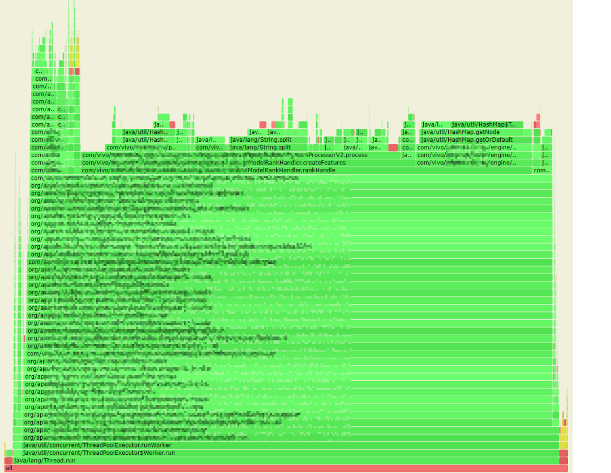
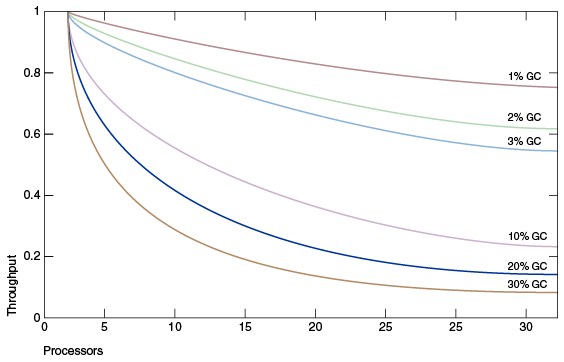
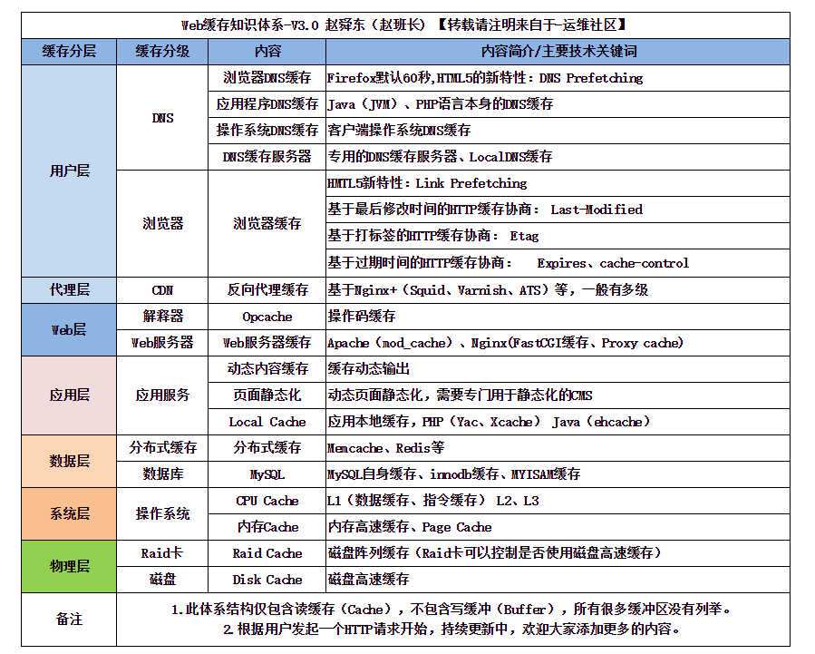

# 性能调优

## 1.线程类型
应用程序主要分为两种：
- IO密集型：特性为需要和第三方应用进行交互，比如操作文件、数据库、mq、其他的应用。在等待第三方回复之前，我们的应用程序为阻塞状态。
- CPU密集型：有应用程序单独完成整个程序，比如计算、缓存、策略等

所以性能瓶颈也有所不同
- IO密集型：网络、第三方的性能可能是性能瓶颈【不是本文重点】
- CPU密集型：热代码的性能、GC调优、堆外内存使用等【本文重点】

## 2.性能指标

一、服务端指标
- TPS：每秒钟处理完的事务次数，一般 TPS 是对整个系统来讲的。一个应用系统 1s 能完成多少事务处理，一个事务在分布式处理中，可能会对应多个请求，对于衡量单个接口服务的处理能力，用 QPS 比较多。
- QPS：每秒钟处理完请求的次数；注意这里是处理完。具体是指发出请求到服务器处理完成功返回结果。可以理解在 Server 中有个 Counter，每处理一个请求加 1，1 秒后 Counter = QPS。
- RT：响应时间，处理一次请求所需要的平均处理时间
- 并发量：系统能同时处理的请求数
- TP90：90%网络请求所需要的最低耗时[压力测试指标全解之TP指标](https://blog.csdn.net/CynthiaJuJu/article/details/126605391)

二、服务器端常用指标。包括：1、CPU占用率，2、磁盘使用率， 3、剩余内存等

测试工具：
1. 针对【CPU密集型】，可以使用JMH进行压测获得指标，
    - 提高并发数，比如提升单机的并行线程数，或者横向扩容机器数；
    - 降低平均响应时间 RT，包括应用线程（业务逻辑）执行时间，以及 JVM 本身的 GC 耗时。
2. jmeter等应用服务压测工具
3. sysbench等数据库、服务器压测工具

性能发现工具：
1. 透视宝、听云等（商用）具备trace功能
2. Skywalking抓取全链路栈响应信息
3. arthas的 trace 功能


性能改进案例： [性能指标有哪些](https://blog.csdn.net/javalingyu/article/details/125069066)

## 3.工具

### 3.1.分析工具

- Arthas：是一个开源的Java诊断工具，可以实时监控和诊断Java应用程序。它提供了丰富的命令和功能，用于分析应用程序的性能问题，包括启动过程中的资源消耗和加载时间。
- JVM Sandbox：是一种基于Java安全管理器的技术，用于隔离和限制Java应用程序的访问权限。它可以帮助减少启动时的资源消耗和加载时间，提高应用程序的启动速度。
- Async Profiler：是一个低开销的异步Java性能分析工具，用于收集和分析应用程序的性能数据。它可以帮助你找出启动过程中的性能瓶颈，以及其他影响启动速度的问题。
- 启动加速-异步初始化方法：异步初始化方法是一种启动加速的技术，通过将一些初始化任务异步执行，可以减少启动时间并提高应用程序的响应性。这可以通过使用线程池、异步框架或异步注解等方式来实现。
- Spring Boot Startup Report：是一个用于生成Spring Boot应用程序启动报告的工具。它可以提供详细的启动过程信息，包括每个bean的加载时间、自动配置的耗时等，帮助你分析和优化启动过程。
- Jaeger UI：是一个用于可视化和分析分布式追踪数据的工具。通过使用Jaeger UI，你可以监控和分析应用程序的启动过程，识别潜在的性能问题和瓶颈。
- Spring Startup Analyzer：是一个用于采集Spring应用程序启动过程数据并生成交互式分析报告的工具。它的目标是帮助分析Spring应用程序的启动卡点，并支持Spring Bean的异步初始化， 
   以减少优化Spring应用程序的启动时间。该工具支持在Linux、Mac和Windows操作系统上运行，并参考了spring-boot-startup-report实现其用户界面。
   使用Spring Startup Analyzer，可以收集应用程序的启动过程数据，并生成可视化的HTML报告，用于分析Spring应用程序的启动性能，并找出潜在的优化机会。

### 3.2.火焰图【寻找热代码】

火焰图说明：火焰图是基于 perf 结果产生的 SVG 图片，用来展示 CPU 的调用栈。
- y 轴表示调用栈，每一层都是一个函数。调用栈越深，火焰就越高，顶部就是正在执行的函数，下方都是它的父函数。
- x 轴表示抽样数，如果一个函数在 x 轴占据的宽度越宽，就表示它被抽到的次数多，即执行的时间长。注意，x 轴不代表时间，而是所有的调用栈合并后，按字母顺序排列的。

火焰图就是看顶层的哪个函数占据的宽度最大。只要有“平顶”（plateaus），就表示该函数可能存在性能问题。
颜色没有特殊含义，因为火焰图表示的是 CPU 的繁忙程度，所以一般选择暖色调。

工具推荐：
- 阿里巴巴开源的 arthas 工具，我们获取到线上服务的 CPU 火焰图。【缺点是只能采样已经运行的jvm进程】
- idea自带的profiler查看运行程序消耗的资源
- JProfiler。本地分析工具



### 3.3.Spring Startup Analyzer
使用
```shell
1. 在下压缩包后解压接口使用： https://github.com/linyimin0812/spring-startup-analyzer/tags
2. 添加JVM参数
-javaagent:D:/java/spring-startup-analyzer/lib/spring-profiler-agent.jar 
-Dproject.name=luck-flow
-Dspring-startup-analyzer.admin.http.server.port=9999
3. 启动后控制台打印：======= spring-startup-analyzer finished, click http://localhost:9999 to visit details. ======
4. 访问：http://localhost:999
```
可视化界面包括
1. Spring Bean初始化详情。以bean依赖树的形式展开，
   - bean Name
   - Duration with children (ms) ：Bean的引用加载时长
   - Duration (ms) ：Bean本身的加载时长
   - Detail：包含类加载器、加载该Bean的线程信息（异步加载的话会有多个不同的）
2. SpringBean 加载耗时 timeline 可视化分析。参看每个bean的初始化耗时
3. 应用启动过程线程wall clock火焰图。内容不够精确，太粗了
4. 应用未加载的jar包。只能判断启动过程没有使用到的jar，非常不准确


## 4.代码中的性能优化

### 4.1.尽量避免原生 String.split 方法 
  
原生 split 方法是性能杀手，效率比较低，频繁调用时会耗费大量资源。

性能低的原因：
- 业务中未使用正则表达式，而原生 split 在处理分隔符为 2 个及以上字符时，默认按正则表达式方式处理；众所周知，正则表达式的效率是低下的。
- 当分隔符为单个字符（且不为正则表达式字符）时，原生 String.split 进行了性能优化处理，但中间有些内部转换处理，在我们的实际业务场景中反而是多余的、消耗性能的。
其具体实现是：通过 String.indexOf 及 String.substring 方法来实现分割处理，将分割结果存入 ArrayList 中，最后将 ArrayList 转换为 string[] 输出。
而我们业务中，其实很多时候需要 list 型结果，多了 2 次 list 和 string[] 的互转。

可以选择自己实现
```java
import java.util.ArrayList;
import java.util.List;
import org.apache.commons.lang3.StringUtils;
  
/**
 * 自定义split工具
 * 1.放弃正则表达式的支持，仅支持按分隔符进行 split；
 * 2.出参直接返回 list。分割处理实现，与原生实现中针对单字符的处理类似，使用 string.indexOf 及 string.substring 方法，分割结果放入 list 中，出参直接返回 list，减少数据转换处理；
 * 3.提供 splitFirst 方法，业务场景只需要分隔符前第一段字符串时，进一步提升性能。
 */
public class SplitUtils {
  
    /**
     * 自定义分割函数，返回第一个
     *
     * @param str   待分割的字符串
     * @param delim 分隔符
     * @return 分割后的第一个字符串
     */
    public static String splitFirst(final String str, final String delim) {
        if (null == str || StringUtils.isEmpty(delim)) {
            return str;
        }
  
        int index = str.indexOf(delim);
        if (index < 0) {
            return str;
        }
        if (index == 0) {
            // 一开始就是分隔符，返回空串
            return "";
        }
  
        return str.substring(0, index);
    }
  
    /**
     * 自定义分割函数，返回全部
     *
     * @param str   待分割的字符串
     * @param delim 分隔符
     * @return 分割后的返回结果
     */
    public static List<String> split(String str, final String delim) {
        if (null == str) {
            return new ArrayList<>(0);
        }
  
        if (StringUtils.isEmpty(delim)) {
            List<String> result = new ArrayList<>(1);
            result.add(str);
  
            return result;
        }
  
        final List<String> stringList = new ArrayList<>();
        while (true) {
            int index = str.indexOf(delim);
            if (index < 0) {
                stringList.add(str);
                break;
            }
            stringList.add(str.substring(0, index));
            str = str.substring(index + delim.length());
        }
        return stringList;
    }
}
```

### 4.2.集合类初始化容量

HashMap、ArrayList等底层使用数组实现的集合类，在到达阈值时，都会有数组扩容的现象（创建新的数组，将旧数组的数据复制到新的数组中）。

这样不仅浪费的一部分内存也降低了性能。所以最好的处理方法是提前初始化好容量。

```java
new HashMap(num/0.75d + 1);
new ArrayList(num);
```

### 4.3.加快 map 的查表效率

针对，长度较大的字符串的key。我们知道 string 的 equals 方法其实是遍历比对 char[] 中的字符，key 越长则比对效率越低。

对于长度超过20，map entry 数据量大的map，性能明显。

所以，将 key 的长度缩短，或者甚至换成数值型，可以明显的提高性能。

### 4.4.GC的影响

在小型系统上开发时，GC 的性能开销可以忽略，但扩展到大型系统（尤其是那些具有大量数据、许多线程和高事务率的应用程序）时，GC 的开销不可忽视，甚至可能成为重要的性能瓶颈。



上图 模拟了一个理想的系统，除了垃圾收集之外，它是完全可伸缩的。红线表示在单处理器系统上只花费 1% 时间进行垃圾收集的应用程序。

这意味着在拥有 32 个处理器的系统上，吞吐量损失超过 20% 。洋红色线显示，对于垃圾收集时间为 10% 的应用程序(在单处理器应用程序中，
垃圾收集时间不算太长)，当扩展到 32 个处理器时，会损失 75% 以上的吞吐量。

一位的增加服务器配置是无法有效提高应用性能的。所以在jdk14新增G1 NUMA感知内存分配，提高多核服务器的应用性能。

建议：避免在配置太高的服务器上使用Java应用（在服务器上搭建虚拟机分配适当的资源），或者使用jdk14以上的版本并开启NUMA感知内存分配。

## 5.性能优化
- [软件设计杂谈——性能优化的十种手段（上篇）](https://code2life.top/2020/08/15/0055-performance/)
- [软件设计杂谈——性能优化的十种手段（中篇）](https://code2life.top/2020/08/14/0056-performance2/)
- [软件设计杂谈——性能优化的十种手段（下篇）](https://code2life.top/2020/08/13/0056-performance3/)

性能优化通常是“时间”与“空间”的互换与取舍
- 索引术。比如数据库中的索引技术，数据结构，字段类型，使用注意事项（聚簇索引、索引覆盖）
- 压缩术。时间换空间。操作系统内核与网络设备处理负担 vs 压缩解压的CPU/GPU负担
- 缓存术。DNS缓存、浏览器缓存、应用程序缓存、数据库缓存、操作系统缓存、CPU缓存。甚至一些复用技术也算是缓存的一种应用方式。
- 预取术。原理是在缓存空间换时间基础上，用事先预取的耗时，换取第一次加载的时间
- 削峰填谷术。原理也是“时间换时间”。预取是事先花时间做，削峰填谷是事后花时间做
- 批量处理术。批量处理同样可以看成“时间换时间”，其原理是减少了重复的事情，是一种对执行流程的压缩

提升并行能力
- 榨干计算资源。零拷贝技术，epool，CPU亲和性
- 水平扩容。水平扩容的前提是无状态
- 分片术。水平扩容针对无状态组件，分片针对有状态组件。二者原理都是提升并行度，但分片的难度更大。负载均衡也不再是简单的加权轮询了，而是进化成了各个分片的协调器
- 无锁术。不管是单机还是分布式微服务，锁都是制约并行度的一大因素

## 5.项目启动优化
线上业务jar都很大，几百MB，启动时间更是分钟级别，拖慢故障恢复、服务扩容、本地调试等效率
- [使用Spring Startup Analyzer优化应用启动效率](https://mp.weixin.qq.com/s/lzC62G8bCnh7ICJOOpUAlg)
- 源码：[https://github.com/linyimin0812/spring-startup-analyzer](https://github.com/linyimin0812/spring-startup-analyzer)

通常需要考虑的几个因素：
- Spring bean 加载耗时。可能是依赖复杂、或者进行操作。
- 应用未加载的jar包(Jar瘦身)
- class加载太多
- 缓存数据加载太多

包括以下几个方向：

### 5.1.数据库相关优化
1. 数据库初始化。比如Druid数据连接池，可用设置异步初始化。spring.datasource.druid.async-init=true
2. shardingJDBC启动慢。其中的SchemaMetaDataLoader加载、处理元数据效率低。分析与优化方案：[sharding-jdbc中的max.connections.size.per.query](https://blog.csdn.net/firstendhappy/article/details/126802491)

### 5.2.MQ
2. 连接消息队列。使用延迟加载

## 6.缓存

### 6.1.web缓存体系



### 6.2.堆外内存缓存

如何能尽量缓存较多的数据，同时避免过大的 GC 压力呢。推荐使用堆外内存。
我们想到了把缓存对象移到堆外，这样可以不受堆内内存大小的限制；并且堆外内存，并不受 JVM GC 的管控，避免了缓存过大对 GC 的影响。经过调研，我们决定采用成熟的开源堆外缓存组件 OHC 。
OHC 全称为 off-heap-cache，即堆外缓存，是 2015 年针对 Apache Cassandra 开发的缓存框架，后来从 Cassandra 项目中独立出来，成为单独的类库，其项目地址为：

https://github.com/snazy/ohc

其特性如下：
- 数据存储在堆外，只有少量元数据存储堆内，不影响 GC
- 支持为每个缓存项设置过期时间
- 支持配置 LRU、W_TinyLFU 驱逐策略
- 能够维护大量的缓存条目
- 支持异步加载缓存
- 读写速度在微秒级别

### 6.3.缓存预热

预热的作用:提升项目启动后的响应速度，降低对数据库的压力。

预热的方法:
1. 启动时加载：项目启动后直接就可以满载运行。
   - 缺点：项目启动速度会大大变慢。
   - 通常这种缓存不会设置过期时间，所以刷新机制需要考虑。可以结合guava或者coffe等
2. 定时任务加载：通常这种缓存不会设置过期时间。
3. 手动触发加载：在系统达到高峰期之前，手动触发加载常用数据到缓存中，以提高缓存命中率和系统性能。
4. 用时加载：在用户请求到来时，根据用户的访问模式和业务需求，动态地将数据加载到缓存中。

启动时预热实现方案：
1. 监听ApplicationReadyEvent
2. 实现CommandLineRunner和 ApplicationRunner 接口
3. 实现InitializingBean
4. 使用注解PostConstruct


### 6.4.缓存问题

1. 缓存穿透：某个缓存失效或者未命中，导致一个请求透过缓存层直接进入后端
2. 缓存击穿：大量的请求出现缓存穿透，原因还是一个缓存为命中导致的。
3. 缓存雪崩：大量的缓存失效或者未命中，导致大量请求透过缓存层直接进入后端。
   - 解决方案：缓存失效的可以设置随机的过期时间

### 6.5.缓存更新策略

[缓存更新的套路](https://coolshell.cn/articles/17416.html)

### 6.6.缓存一致性
要么通过2PC或是Paxos协议保证一致性，要么就是拼命的降低并发时脏数据的概率，但是2PC太慢，而Paxos太复杂，通常使用降低概率的方案。

