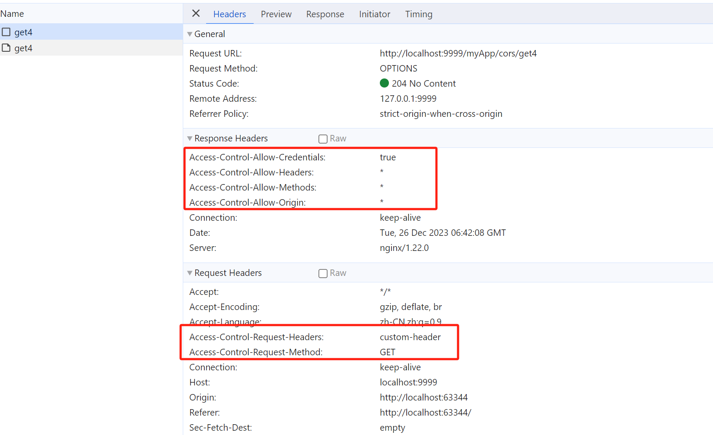
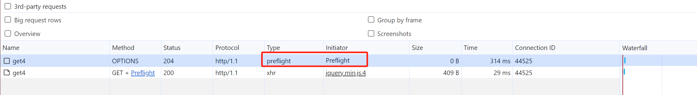

# 跨域访问

- [Nginx 轻松搞定跨域问题](https://mp.weixin.qq.com/s/QmBeN5vnzzCS5EV4mvwPGA)

## 同源策略

同源策略（Same-Origin Policy）是指浏览器安全策略中的一项重要规则，它规定了浏览器只允许当前网页的脚本与来自同一站点（协议、主机、端口号相同）的窗口进行交互，
而阻止与不同源（协议、主机、端口号任一不同）的窗口进行交互。同源策略的存在是 Web 安全的重要保障，是浏览器防范跨站脚本攻击（XSS）、跨站请求伪造（CSRF）、HTTP 首部注入攻击等安全威胁的关键措施。
可以说Web是构建在同源策略基础之上的，浏览器只是针对同源策略的一种实现。

同源策略主要表现在以下三个方面：DOM、Web数据和网络。

- DOM访问限制：同源策略限制了网页脚本（如 JavaScript）访问其他源的 DOM。这意味着通过脚本无法直接访问跨源页面的 DOM 元素、属性或方法。这是为了防止恶意网站从其他网站窃取敏感信息。
- Web数据限制：同源策略也限制了从其他源加载的 Web 数据，这有助于防止跨站点请求伪造（CSRF）等攻击。被限制的数据如下：
    - 浏览器限制从脚本内发起的跨源 HTTP 请求。在同源策略下，XMLHttpRequest 或 Fetch 请求只能发送到与当前网页具有相同源的目标。
    - Cookie、LocalStorage、SessionStorage、IndexedDB 等跨站点资源的访问，防止恶意网站窃取用户数据和攻击。
- 网络通信限制：同源策略还限制了跨源的网络通信。浏览器会阻止从一个源发出的请求获取来自其他源的响应。这样做是为了确保只有受信任的源能够与服务器进行通信，以避免恶意行为。

## 跨域问题

同源策略会导致跨域问题。协议、主机、端口号任一不同，则为跨域。如果需要进行跨域请求或共享数据，需要通过特定的手段（如 JSONP、CORS、代理等）来实现。
同时，Web 应用开发中应当严格遵守同源策略的原则，避免将敏感信息暴露在跨域页面中。

1.  jsonp【不推荐使用】
    - 跨域请求，通过ajax请求参数后面追加callback参数，后端请求到请求参数并将callback添加到JsonpObject中返回到前端，实现一次安全到握手。
    - 优点：没有兼容性问题
    - 缺点：1.只支持get请求。2.callback字段存在安全分险。3.前后端耦合严重。
2. springboot使用@CrossOrigin注解
    - 优点：精准控制允许跨域到方法级别，前端不需要任何修改。
    - 本质：对单个URL设置响应头信息
3. springboot自定义WebMvcConfigurer，重写addCrosMappings方法
    - 优点：可以对所有到controller方法都设置了CORS
4. springboot设置CorsFilter
    - 优点：部分URL可能不是controller，例如servlet等，可以使用这个方式
5. 使用Nginx反向代理【推荐】
    - 在location中添加代理 proxy_pass http://a; 让nginx代理不同域地址，这样浏览器就不会出现这种问题了。当然在nginx中也可以设置cors信息。

2，3，4都是设置响应头中添加信息，要求浏览器不低于IE10。

## CORS

### 1.CORS机制
CORS（Cross-Origin Resource Sharing）是最常用的跨域解决方案，也是W3C推荐的解决方案。CORS允许在浏览器中进行跨域资源请求。
这个机制涉及到两个方面：请求方（浏览器）和响应方（服务器）。
- 请求方会发送带有特定请求头的跨域请求，用于说明请求的来源和其他相关信息。如下图所示，包括请求的方法GET,自定义的header,网站的域Origin等
- 响应方则需要设置相应的响应头来告知浏览器是否允许跨域访问，并且可以限制跨域请求的访问权限。其实就是对请求方提供的信息，判断是否允许跨域访问。



这是因为浏览器执行CORS时，会首先发送一个预检请求（OPTIONS请求），来检查服务器是否允许跨域访问。 所以，为了允许跨域访问，响应方需要设置响应头，告知浏览器允许跨域请求的情况。

### 2.预检请求
当发生跨域时，浏览器先询问服务器，当前网页所在的域名是否允许跨域（包括http方法、请求头等信息）。只有响应值为200~204时，浏览器才会发出正式的XMLHttpRequest请求，否则就报错。
预检请求的http方法为OPTIONS，类型是preflight。



### 3.响应头
在CORS中，设置响应头是为了控制跨域访问的权限和安全性。为什么是响应头而不是请求头，因为请求头是浏览器自动进行设置的，不需要控制。

实现跨域主要涉及4个响应头：
- Access-Control-Allow-Origin：
    - 用于设置允许跨域请求源地址。多个域名以逗号分隔，可以设置通配符*
    - 预检请求和正式请求在跨域时候都会验证
- Access-Control-Allow-Headers：
    - 跨域允许携带的特殊头信息字段。多个字段以逗号分隔，可以设置通配符*
    - 只在预检请求验证
- Access-Control-Allow-Methods：
    - 跨域允许的请求方法或者说HTTP动词。多个方法以逗号分隔，可以设置通配符*
    - 只在预检请求验证
- Access-Control-Allow-Credentials：
    - 指定是否允许发送cookie等凭证信息，如果要跨域使用cookie，值设为true（设置或者不设置，都不会影响请求发送，只会影响在跨域时候是否要携带cookies，但是如果设置，预检请求和正式请求都需要设置）。
        不过不建议跨域使用（项目中用到过，不过不稳定，有些浏览器带不过去），除非必要，因为有很多方案可以代替。
- Access-Control-Max-Age：指定预检请求的有效期，减少预检请求的次数，提升请求效率和服务性能。单位秒，可选配置

### 4.后端配置

不同的场景，设置也会不同。根据是否携带cookie分为两种场景，以nginx配置为案例

#### 4.1.场景1:不带cookie

如下配置允许跨域操作，请求默认携带header，但是不会携带cookie。

```shell
add_header Access-Control-Allow-Origin '*';         # 允许所有源
add_header Access-Control-Allow-Credentials true;   # 允许携带cookie[只有Access-Control-Allow-Origin只有一个源的时候生效]
add_header Access-Control-Allow-Methods '*';        # 允许所有http方法
add_header Access-Control-Allow-Headers '*';        # 允许所有header
```
#### 4.2.场景2:携带cookie

cookie的安全等级很高，所以要求Access-Control-Allow-Origin必须设置明确的源，且只能设置一个。并且前后端都需要修改

```shell
location  / {
    #携带cookie跨域，安全等级非常高，所以Origin只能设置一个。这个源是web网站的源，可以是nginx或者其他web容器
    add_header Access-Control-Allow-Origin 'http://localhost:9999' always; 
    add_header Access-Control-Allow-Credentials true;
    add_header Access-Control-Allow-Methods '*';
    add_header Access-Control-Allow-Headers '*';
    
    # 携带cookie时，浏览器会进行请求的预校验，发送一个OPTIONS请求，设置响应头后直接返回状态即可，不需要转发到后端。
    if ($request_method = 'OPTIONS') {
        return 204;
    }
    # 后端服务
    proxy_pass  http://localhost:8080;
    proxy_set_header   Host    $host;  
    proxy_set_header   X-Real-IP   $remote_addr;   
    proxy_set_header   X-Forwarded-For $proxy_add_x_forwarded_for;  
}
```

前端：设置 withCredentials=true, crossDomain=true。8888 是nginx的服务地址。
```javascript
$.ajax({
    url: "http://localhost:8888/orders",
    type: "GET",
    xhrFields: {
        withCredentials: true
    },
    crossDomain: true,
    success: function (data) {
        render(data);
    }
});
```

#### 4.3.优化场景二

如果想所有的请求都允许跨域携带cookie，因为只能设置一个Origin，要所以这里使用变量$http_origin，动态设置请求头即可。
```shell
add_header Access-Control-Allow-Origin $http_origin always; 
```

如果想要允许多个源可跨域携带cookie，上面的方案几乎没有了限制，安全等级降低了，可以使用map设置多个允许的源。
```shell
# 如果源不是列表中，则$allow_origin为空，浏览器会提示不允许跨域
map $http_origin $allow_origin {
	~^http://localhost:63342$ 		$http_origin;
	~^http://(www\.)?example1\.com$ $http_origin;
	~^http://(www\.)?example2\.com$ $http_origin;
	~^http://(www\.)?example3\.com$ $http_origin;
}

location  / {
    add_header Access-Control-Allow-Origin $allow_origin always; 
}
```

### 5.最佳实践

#### 5.1.携带header

跨域时请求默认携带所有header。如果 Access-Control-Allow-Headers 设置为 *，这允许携带所有header。

在某些场景，对header的内容有所要求，比如为了降低header的体积、避免web攻击等。
```shell
add_header Access-Control-Allow-Headers 'Authorization;
```

配置的效果：
- 除了W3C规范的header外，只允许携带Authorization。
- W3C规范中的header会自动携带，不需要单独设置，只设置自定义的header即可。
- 如果请求中没有Authorization，允许跨域请求
- 如果请求中出现其他的非W3C规范的header，浏览器阻止跨域，提示错误信息如下：
```shell
Access to XMLHttpRequest at 'http://localhost:9999/XX' from origin 'http://localhost:63344' has been blocked by CORS policy: 
Request header field custom-header1 is not allowed by Access-Control-Allow-Headers in preflight response.
```

#### 5.2.多次设置跨域
后端服务和nginx都处理跨域，浏览器不允许如此操作，提示错误信息如下：
```shell
Access to XMLHttpRequest at 'http://localhost:22222/api/Login/TestGet' from origin 'http://localhost:8080' has been blocked by CORS policy: 
The 'Access-Control-Allow-Origin' header contains multiple values '*, http://localhost:8080', but only one is allowed.
```

