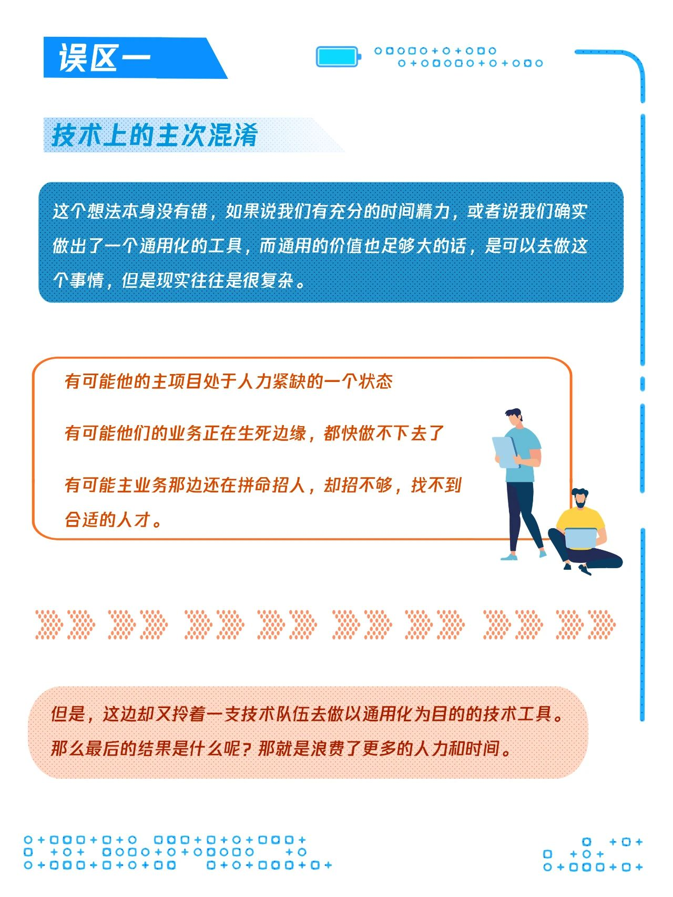

# 技术规范

## 开发规范

### 1.主流规范
参考阿里、腾讯、谷歌等公司的开发规范。见：E:\1.Java\规范\腾讯技术规范

- 阿里技术规范《码出高效：Java开发手册》
- 腾讯技术规范 
    1. 开发语言规范。包括Java、golang、python、c++等。虽然阿里的Java规范最流程，但是与Google的Java规范比较还是不够实用。
    2. 持续集成与持续部署。CI/CD、常用的各类流水线
    3. 代码质量与技术债。
    4. 测试。包括单元测试、集成测试、UI测试。接口自动化测试算是一种特殊的集成测试
    5. Code Review
    6. 重构

### 2.错误码

参考
- [腾讯云服务器API错误码](https://cloud.tencent.com/document/product/213/30435)
- [http状态码](https://baike.baidu.com/item/HTTP%E7%8A%B6%E6%80%81%E7%A0%81/5053660?fr=aladdin)
- [dubbo错误码机制的介绍](https://cn.dubbo.apache.org/zh-cn/overview/mannual/java-sdk/faq/intro/)

- 严格的错误码： 通过错误码统一整个项目的 code 和 message。缺点：文字提示过于笼统
- 中庸之道：强制固定 code、自定义 message

注意事项：异常信息的第一使用者是人，这里包括使用者（用户）和异常处理者（运营人员、程序员）

异常需要进行细分：业务异常和系统 bug

通过aop的方式统一处理异常。

## 安全开发规范

参考阿里、腾讯、谷歌等公司的开发规范

- 腾讯技术规范[E:\1.Java\规范\腾讯技术规范](E:\1.Java\规范\腾讯技术规范)
- 腾讯开源的面向开发人员梳理的代码安全指南[https://github.com/Tencent/secguide](https://github.com/Tencent/secguide)

## 重构

[如何重构](https://mp.weixin.qq.com/s/Wjw3N6m2z8D1cOALUkg9-Q)

## Code Review
Talk Is Cheap, Show Me The Code，  知易行难

架构师，就是掌握大量设计理念和原则、落地到各种语言及附带工具链（生态）下的实践方法、垂直行业模型理解，定制系统模型设计和工程实践规范细则。
进而控制 30+万行代码项目的开发便利性、可维护性、可测试性、运营质量。

[腾讯 Code Review 规范](https://mp.weixin.qq.com/s/BZ_fZYiOWiW-MpmrCD5Qpg)

## 接口设计规范

### 接口设计规范

- [优秀的 API 接口都是如何设计的](https://www.bilibili.com/read/cv18827925)
- [如何设计一个良好的接口](http://www.noobyard.com/article/p-eetbjijp-md.html)
- posix标准:https://www.jianshu.com/p/e9e3f17deb36
- oas规范:https://blog.csdn.net/HuaZi_Myth/article/details/104053585
- 深入理解云计算OpenAPI体系:https://mp.weixin.qq.com/s/zsBcikZpkeMzFxvzj1gmaw

后端接口规范：
1. 参数校验。
    - 业务层校验
    - Validator + BindResult校验
    - Validator + 自动抛出异常
2. 全局异常处理
3. 数据统一响应
4. 接口版本控制。当某个接口发生较大变化时，需要新增一个带有版本号的接口，而不是直接修改原有的接口。
5. API接口安全
    - Token授权认证，防止未授权用户获取数据；
    - 时间戳超时机制；
    - URL签名，防止请求参数被篡改；
    - 防重放，防止接口被第二次请求，防采集；
    - 采用HTTPS通信协议，防止数据明文传输；

### OpenAPI

#### 核心概念
- OpenAPI：狭义上指的是有swagger提出的web api规范。广义上是指对外提供的web api。
- API网关：为webapi提供鉴权、限流、负载均衡、日志、监控等多种功能中间件。
- API工具：方面快速生成webapi文档，方便简单功能开发等功能的工具。

三者直接具备如下关系。


#### OpenAPI 的作用
是定义 Web API 的标准接口描述和编程语言无关接口描述。 它使人类和计算机可以发现和了解服务的功能，而无需访问源代码、其他文档或检查网络流量。

#### OpenAPI的发展历史
- OpenAPI最初是在2007年由API工具商Swagger的创始人Tony Tam创造的。如今，OpenAPI是API设计和开发的标准之一，它已成为全球API生态系统中最受欢迎的工具和规范之一。
- OpenAPI最初是为解决API文档和交互的问题设计的，这些方案通常是定制、复杂和难以理解。OpenAPI的主要目标是提供API的统一、易于维护和理解的方式，同时支持多种语言和工具。
- 随着OpenAPI规范的发展，它逐渐被接受为API整个生命周期的标准，包括设计、开发、测试、文档化、部署、管理和监控。
- OpenAPI规范的开放性和可扩展性使其成为了各种API工具和框架的必备标准之一，例如API管理平台、客户端和服务端生成器、测试工具、文档生成器等。
- 于2015 年捐赠给 Linux 基金会后改名为 OpenAPI，并定义最新的规范为 OpenAPI 3.0

#### 厂商的OpenAPI
- 百度：https://cloud.baidu.com/doc/API/index.html
- QQ： https://wiki.connect.qq.com/%E8%AE%BF%E9%97%AEopenAPI%E6%8E%A5%E5%8F%A3
- Tapd：https://www.tapd.cn/help/show#1120003271001000055
- 腾讯云：https://cloud.tencent.com/document/api/213/15730

## 版本号命名

```text
首先看看某些常见软件的版本号：
	Linux Kernel： 0.0.1，1.0.0，2.6.32，3.0.18…，若用 X.Y.Z 表示，则偶数 Y 表示稳定版本，奇数 Y 表示开发版本。
	Windows：windows 98，windows 2000，windows xp，windows 7…，最大的特点是杂乱无章，毫无规律。
	SSH Client：0.9.8。
	OpenStack：2014.1.3，2015.1.1.dev8。
	从上可以看出，不同的软件版本号风格各异，随着系统的规模越大，依赖的软件越多，如果这些软件没有遵循一套规范的命名风格，容易造成 Dependency Hell。
	所以当我们发布版本时，版本号的命名需要遵循某种规则，其中 Semantic Versioning 2.0.0 定义了一套简单的规则及条件来约束版本号的配置和增长。
	本文根据 Semantic Versionning 2.0.0 和 Semantic Versioning 3.0.0 选择性的整理出版本号命名规则指南。

版本号命名规则指南
	版本号的格式为 X.Y.Z(又称 Major.Minor.Patch)，递增的规则为：
	X 表示主版本号，当 API 的兼容性变化时，X 需递增。
	Y 表示次版本号，当增加功能时(不影响 API 的兼容性)，Y 需递增。
	Z 表示修订号，当做 Bug 修复时(不影响 API 的兼容性)，Z 需递增。

详细的规则如下：
	X, Y, Z 必须为非负整数，且不得包含前导零，必须按数值递增，如 1.9.0 -> 1.10.0 -> 1.11.0
	0.Y.Z 的版本号表明软件处于初始开发阶段，意味着 API 可能不稳定；1.0.0 表明版本已有稳定的 API。
	当 API 的兼容性变化时，X 必须递增，Y 和 Z 同时设置为 0；
	当新增功能(不影响 API 的兼容性)或者 API 被标记为 Deprecated 时，Y 必须递增，同时 Z 设置为 0；
	当进行 bug fix 时，Z 必须递增。
	先行版本号(Pre-release)意味该版本不稳定，可能存在兼容性问题，其格式为：X.Y.Z.[a-c][正整数]，如 1.0.0.a1，1.0.0.b99，1.0.0.c1000。
	开发版本号常用于 CI-CD，格式为 X.Y.Z.dev[正整数]，如 1.0.1.dev4。
	版本号的排序规则为依次比较主版本号、次版本号和修订号的数值，如 1.0.0 < 1.0.1 < 1.1.1 < 2.0.0；对于先行版本号和开发版本号，有：1.0.0.a100 < 1.0.0，2.1.0.dev3 < 2.1.0；当存在字母时，以 ASCII 的排序来比较，如 1.0.0.a1 < 1.0.0.b1。
	注意：版本一经发布，不得修改其内容，任何修改必须在新版本发布！

一些修饰的词
	alpha：内部版本
	beta：测试版
	demo：演示版
	enhance：增强版
	free：自由版
	full version：完整版，即正式版
	lts：长期维护版本
	release：发行版
	rc：即将作为正式版发布
	standard：标准版
	ultimate：旗舰版
	upgrade：升级版
```

## 设计原则

### 1.方案设计原则
规则一、避免过度设计
内容：在设计中要警惕复杂的解决方案
用法：通过测试同事是否能够轻松地理解解决方案来验证是否存在过度设计
原因：复杂的解决方案实施成本过高，而且长期的维护费用昂贵
要点：复杂的系统限制了扩展性。简单的系统易维护，易扩展且成本低

规则二、方案中包括扩展
内容：提供及时可扩展性的DID方法
用法：Design(D)设计20倍的容量；Implement(I)实施3倍的容量；Deploy（D）部署1.5倍的容量
原因：DID为产品扩展提供了经济，有效，及时的方法
要点：在早期考虑可扩展性可以帮助团队节省时间和金钱。在需求发生大约一个月前实施（写代码），在客户蜂拥而至的几天前部署。

规则三-三次简化方案
内容：在设计复杂系统时，从项目的范围、设计和实施角度简化方案
用法：采用帕累托（Pareto）原则简化范围；考虑成本优化和可扩展性来简化设计；依靠其他人的经验来简化部署；
原因：只聚焦“不过度复杂”，并不能解决需求或历史发展与变革中的各种问题
要点：在产品研发的各个阶段都需要做好简化

### 2.具体原则

- [事件驱动](https://code2life.top/2020/08/12/0054-polling-to-event-driven/)
- [开闭原则](https://code2life.top/2020/08/11/0053-ocp/)
- [可伸缩性](https://code2life.top/2020/08/10/0052-scalability/)

## 代码分层设计

<div name="wordShowDiv" word-url="技术方案/项目分层架构.docx"></div>

- MVC
- 分层架构
- COLA

## 项目设计原则

### 1.设计上的误区
- 服务拆分的误解: 感觉自己被鼓励'每个服务搞一个 git'。
  - 你这个服务里访问 db 的代码，rpc 的代码，各种可以复用的代码，是用的大家都复用的 git 下的代码么？
  - 每次都重复写一遍，db 字段细节改了，每个使用过 db 的 server 对应的 git 都改一遍？
  - 这个通用 git 已经写好的接口应该不知道哪些 git 下的代码因为自己不向前兼容的修改而永远放弃了向前不兼容的修改？ 
  - 至少一类功能的数据放在一个db中，一个服务尽可能只访问一个db。一个db仅提供一个服务访问。否则项目复杂度会越来越高
- 早期有效的决策不再有效:将本来简单的逻辑，不断迭代复杂化，以至于无法重构
- 总是面向对象/总喜欢封装:
  - 即使是对简单的业务模型，也需要无数次'坏'的对象抽象实践，才能培养出一个具有合格的 class 抽象能力的同学，这对于大型却松散的团队协作，不是破坏性的？
  - 已经有了一套继承树，想要添加功能就只能在这个继承树里添加，以前的继承树不再适合新的需求，这个继承树上所有的 class，以及使用它们的地方，你都去改？
  - 不，是个正常人都会放弃，开始堆屎山。 
  - 使用者想知道细节，进来吧，我的实现很易读，你看看就明白，使用时不会迷路！对于逻辑复杂的函数，我们还要强调函数内部工作方式'可以让读者在大脑里想象呈现完整过程'的可现性，让使用者轻松读懂，有把握，使用时，不迷路

### 2.model设计

没读过 oauth2.0 RFC，就去设计第三方授权登陆的人，终归还要再发明一个撇脚的 oauth。
不懂 Unix 的人注定最终还要重复发明一个撇脚的 Unix。--Henry Spenncer, 1987.11

- 一个权限系统，你知道怎么做么？堆积一堆逻辑层次一维展开的 if else？
- 一个共享文件管理，你知道怎么做么？堆积一堆逻辑层次一维展开的 ife lse？
- 你联通有上万台服务器，你要怎么写一个管理平台？堆积一堆逻辑层次一维展开的 ife lse？

你必须要有 Domain 思考探索、model 拆解/抽象/构建的能力。
唯一回答就是，进入某个领域，就是首先去看前人的思考，站在前人的肩膀上，再用上自己的通识能力，去进一步思考。至于怎么建立好的通识思考能力，可能得去常青藤读个书吧：）或者，就在工程实践中思考和锻炼自己的这个能力！

案例：同时，基于 model 设计的代码，能更好地适应产品经理不断变更的需求。比如说，一个 calendar(日历)应用，简单来想，不要太简单！
以'userid_date'为 key 记录一个用户的每日安排不就完成了么？只往前走一步，设计了一个任务，上限分发给 100w 个人，创建这么一个任务，
是往 100w 个人下面添加一条记录？你得改掉之前的设计，换 db。再往前走一步，要拉出某个用户和某个人一起要参与的所有事务，是把两个人的所有任务来做 join？好像还行。
如果是和 100 个人一起参与的所有任务呢？100 个人的任务来 join？不现实了吧。好，你引入一个群组 id，那么，你最开始的'userid_date'为 key 的设计，
是不是又要修改和做数据迁移了？经常来一个需求，你就得把系统推翻重来，或者根本就只能拒绝用户的需求，这样的战斗力，还好意思叫自己工程师？
你一开始就应该思考自己面对的业务领域，思考自己的日历应用可能的模型边界，把可能要做的能力都拿进来思考，构建一个 model，设计一套通用的 store 层接口，
基于通用接口的逻辑代码。当产品不断发展，就是不停往模型里填内容，而不是推翻重来。这，思考模型边界，构建模型细节，就是两个很重要的能力，
也是绝大多数腾讯产品经理不具备的能力，你得具备，对整个团队都是极其有益的。你面对产品经理时，就听取他们出于对用户体验负责思考出的需求点，到你自己这里，用一个完整的模型去涵盖这些零碎的点。

### 3.KISS 原则

keep it simple stuped
首先，简单不是面对一个问题，我们印入眼帘第一映像的解法为简单。我说一句，感受一下。把一个事情做出来容易，把事情用最简单有效的方法做出来，是一个很难的事情。
比如，做一个三方授权，oauth2.0 很简单，所有概念和细节都是紧凑、完备、易用的。你觉得要设计到 oauth2.0 这个效果很容易么？
要做到简单，就要对自己处理的问题有全面的了解，然后需要不断积累思考，才能做到从各个角度和层级去认识这个问题，打磨出一个通俗、紧凑、完备的设计，
就像 ios 的交互设计。简单不是容易做到的，需要大家在不断的时间和 code review 过程中去积累思考，pk 中触发思考，交流中总结思考，才能做得愈发地好，接近'大道至简'。


### 4.代码设计

一直在做 Java 后端的项目，经常会有一些变动，我相信大家也都遇到过。
比如当我们写一段代码的时候，我们考虑将需求映射成代码的状态模式，突然有一天，状态模式里边又添加了很多行为变化的东西，这时候你就挠头了，你硬生生的将状态模式中添加过多行为和变化。
慢慢的你会发现这些状态模式，其实更像是一簇算法，应该使用策略模式，这时你应该已经晕头转向了。
说了这么多，我的意思是，只要你觉得合理，就请将状态模式改为策略模式吧，所有的模式并不是凭空想象出来的，都是基于重构。
Java 编程中没有银弹，请拥抱业务变化，一直思考重构，你就有一个更好的代码设计!

### 5.结对编程
国外流行一种编程方式，叫做结对编程，我相信国内很多公司都没有这么做，我就不在讲述结对编程带来的好处了，其实就是一边 code review，一边互相提高的一个过程。既然做不到这个，那如何让自己活在自己的世界中不断提高呢？
“平时开发的时候，做出的代码总认为是正确的，而且写法是完美的。”，我相信这是大部分人的心声，还回到刚刚的问题，如何在自己的世界中不断提高呢？ 答案就是:
1. 多看成熟框架的源码
2. 多回头看自己的代码
3. 勤于重构

## 架构模式

<div name="wordShowDiv" word-url="技术方案/软件框架模式.docx"></div>

## 公司技术委员会职责

<div name="wordShowDiv" word-url="技术方案/公司技术委员会职责.docx"></div>

## 软件开发避免陷入误区

软件研发架构的各种理论方法，其本质都是围绕着“实用”来进行设计的。
所以，事实上不应该有什么软件研发的工作方法是不属于实用主义的，一切的软件架构，软件设计，软件研发管理的方法，都应该是属于实用主义。
但常常，我们在以实用为目的去做事情的时候，很容易受到一些思维误区的干扰，自以为自己是追求实用的，但实际上早已经谬之千里，却不自知。常见的有四大误区。





