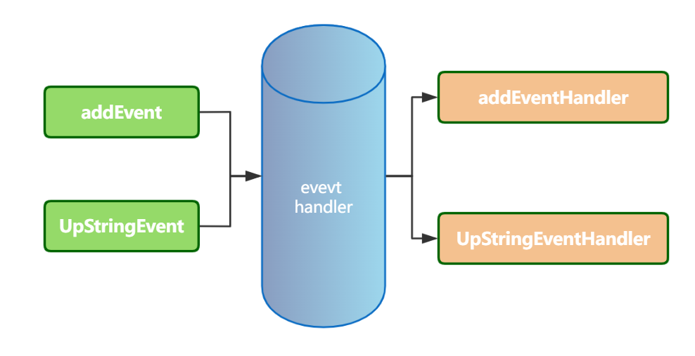
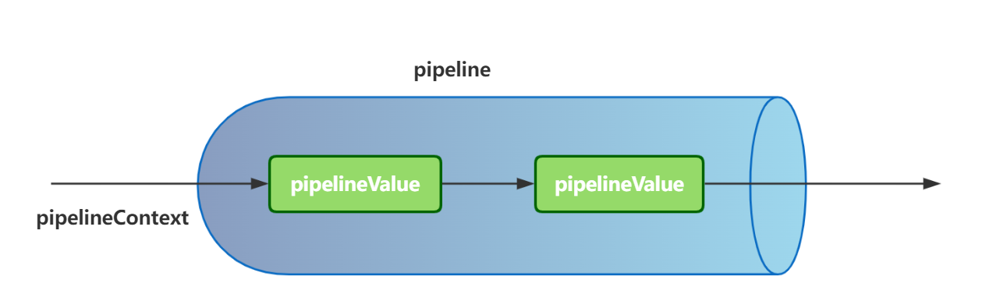

# 架构设计

[架构之道——人人都是架构师](https://mp.weixin.qq.com/s/6A42588A8MYILG0OYMA0NA)

## 设计模式
23种设计模式

## 设计原则
5大原则（单一职责、开闭原则、里氏替换、依赖倒转、接口隔离）
[https://mp.weixin.qq.com/s/DmWPBqfYqLZCC9XZuAUpRA](https://mp.weixin.qq.com/s/DmWPBqfYqLZCC9XZuAUpRA)

## 驱动模式

### 1.业务驱动技术 or 技术驱动业务
业务驱动技术 or 技术驱动业务 ？ 其实这是一个一直在争论的话题，但是很多人不这么认为，我觉得就是大家不愿意承认罢了。我来和大家大概分析一下作为一个 Java 程序员，我们应该如何判断自己所处于的位置.
- 业务驱动技术：如果你所在的项目是一个收益很小或者甚至没有收益的项目，请不要搞其他创新的东西，不要驱动业务要如何如何做，而是要熟知业务现在的痛点是什么？如何才能帮助业务盈利或者让项目更好，更顺利的进行。
- 技术驱动业务：如果你所在的项目是一个很牛的项目，比如淘宝这类的项目，我可以在满足业务需求的情况下，和业务沟通，使用什么样的技术能更好的帮助业务创造收益，
  比如说下单的时候要进队列，可能几分钟之后订单状态才能处理完成，但是会让用户有更流畅的体验，赚取更多的访问流量，那么我相信业务愿意被技术驱动，会同意订单的延迟问题，这样便是技术驱动业务。

我相信大部分人还都处于业务驱动技术的方向吧。 所以你既然不能驱动业务，那就请拥抱业务变化吧。

### 2.TDD-测试驱动

邪教！ 但是好用，人力成本增加，研发周期变长，对于重视软件质量的项目可以使用该模式。
容易产生极端，oracle数据库的单元测试全部执行一次需要

### 3.DDD-领域驱动

魔教！ 好用，但是人力成本增加，可以借鉴代码生成器

- [基于DDD的微服务设计和开发实战](https://mp.weixin.qq.com/s/orOF1EKYoc4Z_0pmGOYNVg)
- [一个电商供应链系统的DDD实战](https://mp.weixin.qq.com/s/xg2JhTvIaz8kbCJJwlMLTw)

### 4.事件驱动架构-EDA

- [【架构师基本功】事件驱动架构](https://blog.csdn.net/java_wxid/article/details/131283508)
- [事件驱动架构：构建实时响应的高效系统](https://baijiahao.baidu.com/s?id=1772938236612909522&wfr=spider&for=pc)
- [6种事件驱动的架构模式](https://cloud.tencent.com/developer/article/2255982)

事件驱动架构(Event Driven Architecture，EDA)是一种基于事件和消息的分布式系统架构。用于构建具有高可扩展性、高可用性和灵活性的分布式系统。
事件驱动架构旨在实现松散耦合、可靠性和可扩展性。它适用于许多场景，包括传统的企业级应用程序、云原生应用程序、实时数据分析、物联网、人工智能等。

#### 1.CloudEvents

- https://cloud.tencent.com/developer/article/1782917
- https://cloud.tencent.com/developer/article/1782918

#### 2.Eventbridge
是rocketmq实现了cloudevents协议，是一个云原生事件驱动引擎，基于DDD领域驱动模型实现

## 分布式一致性协议

## 微内核架构

## 基础架构设计原则

## 高可扩展设计原则

[高扩展代码设计套路](https://mp.weixin.qq.com/s/F42LqQncMDLQH-WWmZ28fA)  包括：pipeline、责任链、事件流、SPI等

1. event:事件流，事件分发。 
2. pipeline。 
   - Pipeline----将多个PipelineValue串联起来的管道
   - PipelineValue----实际的任务节点
   - PipelineContext----用于管道上下文中数据的扭转
   - 比如：netty框架中，例如ChannelPipeline、ChannelHandler、ChannelHandlerContext，分别用于处理tcp拆包、加解码等等之类
3. 其他
   1. 责任链：Java Servlet的filter。思想：所有filter都处理一遍，有一个不符合要求的就直接退出。
   2. 基于注解：spring提供了大量的扩展，比如aop，事务，缓存，限流，rpc调用等。
   3. SPI: Java提供的扩展机制，以接口名称为文件名称，放在META-INF/services，值为该接口的实现。例如 数据库的驱动程序。

## 高并发设计架构

高可用
<iframe frameborder="0" style="width:100%; height:500px;" src="https://docs.qq.com/mind/DQkJWZGNzSVRmRlJl"></iframe>

高并发
<iframe frameborder="0" style="width:100%; height:500px;" src="https://docs.qq.com/mind/DQllFU3dIa3JlcGZo"></iframe>

## 软件架构模型

C4模型是一种用于描述软件系统架构的轻量级模型，旨在通过简化、清晰和易于理解的方式来表达系统的不同层次的架构信息。
它由Simon Brown提出，并在其著作《Software Architecture for Developers》中首次得到定义。
C4代表了四个层次的抽象化，即：Context（上下文）、Containers（容器）、Components（组件）和Classes/Code（类或代码）。

- 上下文层次（Context）：描述了系统与外部实体（如用户、其他系统、硬件设备等）之间的关系，显示系统如何与其周围的环境交互以及其外部依赖关系。
- 容器层次（Container）：系统内的软件被分解成多个容器，如应用程序、数据库、文件系统等，容器图描述了这些容器之间的关系及它们如何共同工作以实现系统的功能。
- 组件层次（Component）：在容器的内部，每个容器被进一步拆分为组件，如类、模块、服务等，组件图描述了组件之间的关系和依赖关系，以及它们如何协同工作。
- 代码层次（Code）：这是最低层次，描述了每个组件的内部实现细节，通常可以是类图、包图等，用于展示组件内的代码结构。

C4模型提供了一种系统的、多角度的方式来描述软件系统的架构，有助于团队更好地理解和沟通软件架构设计，推进架构的演进升级。

- [C4模型理论与示例](https://blog.csdn.net/liudonglovehemin/article/details/129855167)
- ArchGuard 架构治理[https://gitee.com/archguard](https://gitee.com/archguard)

- 上下文：系统周边关系图、链路追踪图等
- 容器：数据库、Tomcat、redis等，也就是部署图。
- 组件：
- 类或代码：

## 4+1视角

1. 场景视图：从外部视角，描述系统的参与者（用户）与系统功能用例的关系。反映的是系统的最终用户需求和交互设计。

1. 逻辑视图：从结构化视角，描述该系统对用户提供的所需功能服务所具备的组件结构和数据结构，以及一些边界约束条件，清晰地描述给用户提供的功能需求服务是如何构建的。
   描述该系统内部所具备了哪些组织结构，以达到实现对外功能。
2. 开发视图：从结构化视角和行为视角，去描述实现系统功能的各个组件和模块是如何实现的。
3. 处理视图：从行为视角，描述系统各个组件和模块是如何进行通信的。
4. 物理视图：从交互视角，描述系统可以部署到哪些物理环境（如服务器、PC端、移动端等）上和软件环境（如虚拟机、容器、进程等）上。
