# 架构设计

[架构之道——人人都是架构师](https://mp.weixin.qq.com/s/6A42588A8MYILG0OYMA0NA)

## 架构演进

架构演进遵循"分-合-分-合"螺旋上升，本质是平衡"复杂性管控"与"业务敏捷性"，通过技术手段不断突破原有边界，支撑数字世界持续创新。

[重回单体，真的不是技术倒退](https://mp.weixin.qq.com/s/v0FqbNDbxjD_nOnjuIhAQQ)

### 1.架构演进全景
架构演进全景：从单体到云原生
1. 单体架构（1960-2000s）
   - 核心特征：所有功能模块打包为一个独立单元（如Java EE的WAR包），部署在单一服务器，单一数据库
   - 优势：开发部署简单，易于理解维护
   - 局限：扩展性差，修改一处需全量部署，单点故障风险高
2. 分布式架构（1990-2010s）
   - 垂直拆分：按功能划分（如用户、订单）部署到不同服务器，共享数据库
   - 水平扩展：主从复制、负载均衡（SLB）应对流量增长
   - 三层架构：表示层→业务逻辑层→数据层，解耦不同功能，提高复用性
3. SOA架构（面向服务，2000s）
   - 系统拆分为松耦合、可复用服务，通过企业服务总线(ESB)通信
   - 服务契约标准化（WSDL/SOAP），支持跨平台调用
   - 核心：服务自治、统一管控，解决"信息孤岛"问题
4. 微服务架构（2010s-至今）
   - 更细粒度拆分：每个服务专注单一业务，独立开发、部署、扩展
   - 独立数据："一个服务一个数据库"避免数据耦合
   - 轻量级通信：RESTful API替代重量级ESB
   - 代表技术：Netflix OSS、Spring Cloud
5. 云原生架构（2010s-至今）
   - 容器化：Docker实现"一次构建，到处运行"
   - 自动化编排：Kubernetes管理容器生命周期、弹性扩展
   - 服务网格：Istio统一管理服务间通信、流量控制、故障恢复
   - DevOps融合：CI/CD流水线实现分钟级交付，监控告警自动化
6. Serverless与事件驱动（2010s-至今）
   - 函数即服务(FaaS)：代码按函数粒度拆分，按需付费，无需管理服务器
   - 事件驱动：系统响应事件流（Kafka、RabbitMQ），实现异步解耦
   - 弹性极致：零管理、毫秒级扩缩，资源利用率最大化

### 2.演进逻辑：三大驱动
1. 业务增长：从支撑百万到亿级用户，架构不断突破性能瓶颈
2. 技术革新：硬件升级、虚拟化、容器、云服务推动架构质变
3. 效率追求：从手动运维到全链路自动化，降低人力成本

### 3.未来趋势
- AI融合：智能调度、异常预测、自动优化
- 边缘计算：云边协同，低延迟、本地化处理
- 模块化单体回归："分久必合"，大型系统采用模块化设计，兼具微服务灵活性与单体开发效率

## 23种设计模式
23种设计模式

## 设计原则

七大原则（单一职责、开闭原则、里氏替换、依赖倒转、接口隔离、迪米特法则、合成复用）
[https://mp.weixin.qq.com/s/DmWPBqfYqLZCC9XZuAUpRA](https://mp.weixin.qq.com/s/DmWPBqfYqLZCC9XZuAUpRA)

### 1.七大设计原则
1. 单一职责原则（Single Responsibility Principle，SRP） :一个类应该只有一个引起它变化的原因。也就是说，一个类应该只负责一项职责。如果一个类承担的职责过多，就会导致职责耦合，当其中一个职责发生变化时，可能会影响到其他职责。
2. 开闭原则（Open - Closed Principle，OCP）:软件实体（类、模块、函数等）应该对扩展开放，对修改关闭。这意味着在不修改现有代码的基础上，能够通过扩展来增加新的功能。
3. 里氏替换原则（Liskov Substitution Principle，LSP）:子类可以替换父类并且出现在父类能够出现的任何地方，而不会影响系统的正确性。这要求子类必须遵循父类的行为约定，即子类可以扩展父类的功能，但不能改变父类原有的功能。
4. 接口隔离原则（Interface Segregation Principle，ISP）：客户端不应该依赖它不需要的接口。也就是说，一个类对其他类的依赖应该建立在最小的接口上。
   - 尽量使用“接口继承”而非“实现继承”。接口关注对象的概貌，将对象中“不变”的信息抽象出来，不涉及细节，因此是“稳定”的。
   - 通过接口只将需要的操作“暴露”给客户类，而将不需要的操作隐藏起来。接口在这里充当类的视图
5. 依赖倒置原则（Dependency Inversion Principle，DIP）
   - 高层模块不应该依赖低层模块，两者都应该依赖抽象。
   - 抽象不应该依赖细节，细节应该依赖抽象。也就是说，要面向接口编程，而不是面向实现编程。
6. 迪米特法则（Law of Demeter，LoD）: 又叫做最少知道原则，一个软件实体应当尽可能少地与其他实体发生相互作用。也就是说，一个对象应该只与其直接的朋友通信，而不应与不相关的对象进行过多的交互。
7. 合成复用原则（Composite Reuse Principle，CRP）: 尽量使用合成/聚合的方式，而不是继承。也就是说，如果一个类需要用到另一个类的功能，可以通过组合的方式来达到目的，而不是通过继承来实现。

设计模式的 7 大设计原则，以实现“高内聚、松耦合”的软件系统为目标。

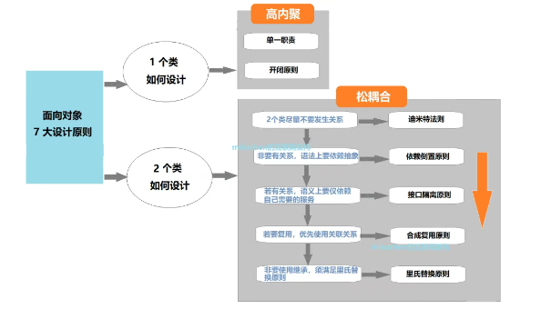

### 2.两个一般性设计原则

1. KISS（Keep It Simple Stupid）保持简单
2. YAGNI（You Ain't Gonna Need It）你不会需要它

### 2.与设计模式的关系
1. 单一职责原则（SRP）
   - 日志记录器类：在实际开发中，一个日志记录器类只负责日志的记录工作，如将日志信息写入文件或数据库，而不涉及其他业务逻辑。
    这遵循了单一职责原则，避免了将日志记录功能与其他业务功能混合在一个类中，提高了代码的可维护性。
2. 开闭原则（OCP）
   - 装饰器模式（Decorator Pattern）：装饰器模式允许在不修改现有对象结构的情况下，动态地给对象添加新的功能。通过创建一个装饰器类，它可以包装原始对象，并在调用原始对象的方法前后添加额外的行为。
      例如，在 Java 的输入输出流中，`BufferedInputStream` 可以装饰 `FileInputStream` 来添加缓冲功能，符合开闭原则。
   - 策略模式（Strategy Pattern）：策略模式定义了一系列的算法，并将每个算法封装起来，使它们可以相互替换。客户端可以根据需要选择不同的策略，而不需要修改原有的代码。
      例如，在一个电商系统中，根据不同的促销活动（如满减、折扣等）选择不同的计算价格的策略。
3. 里氏替换原则（LSP）
   - 继承关系的设计模式：在很多设计模式中都使用了继承，只要子类能够完全替换父类，就遵循了里氏替换原则。例如，在工厂模式中，具体的工厂类继承自抽象工厂类，具体工厂类可以替换抽象工厂类在代码中使用，而不会影响系统的正确性。
4. 接口隔离原则（ISP）
   - 代理模式（Proxy Pattern）：在代理模式中，代理类和真实对象通常实现同一个接口。为了遵循接口隔离原则，这个接口应该是最小化的，只包含客户端真正需要的方法。例如，在远程代理中，客户端只需要调用远程对象的部分方法，代理类和远程对象实现的接口就只包含这些必要的方法。
5. 依赖倒置原则（DIP）
   - 依赖注入模式（Dependency Injection）：依赖注入是依赖倒置原则的一种具体实现方式。它通过将依赖对象的创建和管理交给外部容器，使得高层模块不直接依赖低层模块，而是依赖抽象接口。
     例如，在 Spring 框架中，通过依赖注入可以将一个具体的 `UserService` 实现注入到 `UserController` 中，`UserController` 只依赖 `UserService` 接口，而不依赖具体的实现类。
   - 工厂模式（Factory Pattern）：工厂模式通过一个工厂类来创建对象，使得客户端代码不直接依赖具体的对象实现类，而是依赖工厂类和抽象接口。
     例如，通过一个 `ShapeFactory` 来创建不同类型的 `Shape` 对象，客户端只需要依赖 `Shape` 接口和 `ShapeFactory`，而不需要知道具体的 `Shape` 实现类。

## 8大高可用方案

核心思想：冗余、负载均衡、数据备份与恢复、限流、熔断降级、异地多活、devops、监控与报警等

## 架构设计

### 1.架构设计流程
包括：需求分析、概要设计、详细设计（包括技术选型）、编码、单元测试、集成测试、系统测试、验收测试等。

### 2.架构风格

在特定领域中系统架构组织方式也有所不同。
- 数据流风格：批处理序列、管道/过滤器
- 调用/返回风格：主程序/子程序、面向对象风格、层次结构
- 独立构件风格：进程通信、事件系统
- 虚拟机风格：解释器、基于规则的系统
- 仓库风格：数据库系统、超文本系统、黑板系统

### 3.架构模型
1. 单机应用。
2. 客户机/服务器模式。包括B/S、C/S两种。
3. 面向服务架构(SOA)模式。
4. 企业数据交换总线 BUS。不同的应用之间通过消息总线进行交互。

### 4.架构框架
1. 战略系统（战略层）
2. 业务系统+应用系统（战术层）
3. 信息基础设施EII（运行层，技术+信息+管理）

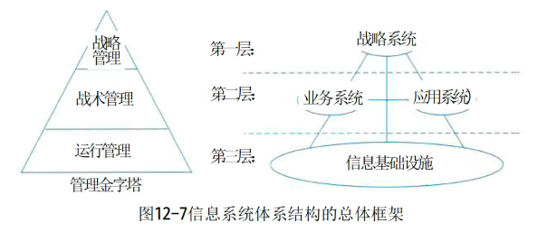

### 5.架构设计方法

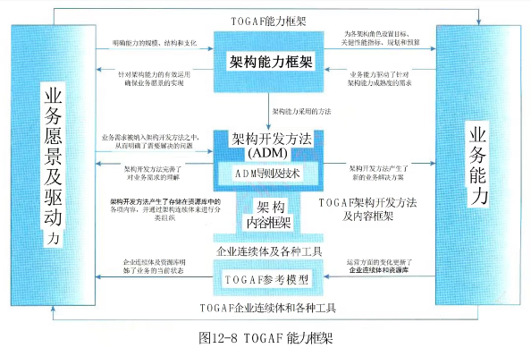

1. TOGAF开放式企业架构框架标准（The Open Group Architecture Framework）
   - 6个组件：ADM架构开发方法（核心）、ADM指南和技术、架构内容框架、企业连续体和工具、TOGAF参考模型、架构能力框
   - 架核心思想：模块化架构、内容框架、扩展指南、架构风格
2. ADM架构开发方法(Architecture Development Method)
   - 为开发企业架构所需要执行各个步骤以及它们之间的关系进行详细的定义
   - 由一组按照架构领域的架构开发顺序而排列成一个环的多个阶段所构成。
   - 架构开发阶段：准备、需求管理、架构愿望、业务架构、信息系统架构(应用和数据)、技术架构、机会和解决方案、迁移规划、实施治理、架构变更管理。

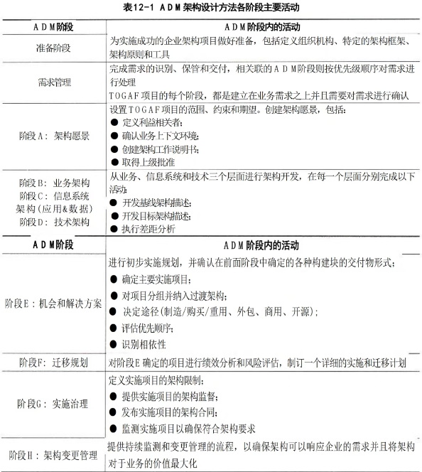

## 多场景架构设计

### 1.企业级信息化总体架构

1. 信息化7个主要平台：知识管理平台、日常办公平台、信息集成平台、信息发布平台、协同工作平台、公文流转平台和企业通信平台。
2. 信息化架构模式：数据导向架构 和 流程导向架构。

### 2.大数据架构

常见的两种：Lambda架构和Kappa架构。

1. Lambda架构：用于同时处理离线和实时数据的，可容错的，可扩展的分布式系统。架构可分解为三层，即批处理层、加速层和服务层。
2. Kappa架构：在Lambda的基础上进行了优化，删除了处理层的架构，将数据通道以消息队列进行替代。

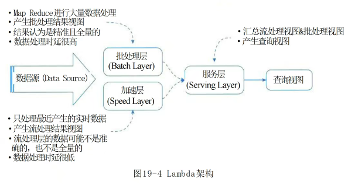

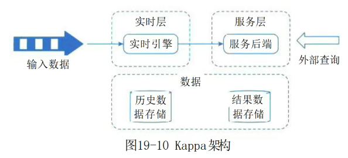

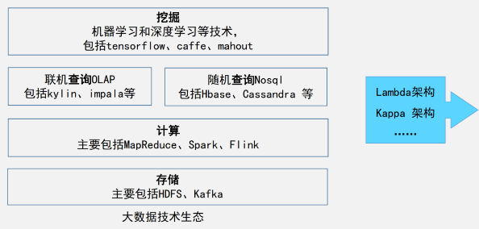

### 3.数据库管理系统DBMS架构

## 架构质量与评估

### 1.架构质量属性
根据 GB/T 16260.1 定义，从管理角度对软件系统质量进行度量，可将影响软件质量的主要因素划分为6种维度特性

开发期质量属性
1. 功能性包括适合性、准确性、互操作性、依从性、安全性；
2. 可靠性包括容错性、易恢复性、成熟性；
3. 易用性包括易学性、易理解性、易操作性；
4. 效率包括资源特性和时间特性；
5. 维护性包括可测试性、可修改性、稳定性和易分析性；
6. 可移植性包括适应性、易安装性、一致性和可替换性。

运行阶段所关注的质量属性
1. 性能：指软件系统及时提供相应服务的能力，如速度、吞吐量和容量等的要求
2. 安全性：指软件系统同时兼顾向合法用户提供服务，以及阻止非授权使用的能力。
3. 可伸缩性：指当用户数和数据量增加时，软件系统维持高服务质量的能力。例如，通过增加服务器来提高能力。
4. 互操作性：指本软件系统与其他系统交换数据和相互调用服务的难易程度。
5. 可靠性：软件系统在一定的时间内持续无故障运行的能力。
6. 可用性：指系统在一定时间内正常工作的时间所占的比例。可用性会受到系统错误，恶意攻击，高负载等问题的影响。

### 2.架构评估方法

架构评估方法
1. 基于调查问卷或检查表的方法。缺点是在很大程度上依赖于评估人员的主观推断。
2. 基于场景的评估方法。例如：架构权衡分析法，ATAM、软件架构分析方法，SAAM等。
3. 基于度量的评估方法。建立在软件架构度量的基础上的，就是分析架构已有的各种度量。

基于场景的评估方法（非功能质量属性的架构分析方法）
1. SAAM基于场景的架构分析方法：
   - 应用场景：包括空中交通管制、嵌入式音频系统、WRCS (修正控制系统)、KWIC (根据上下文查找关键词系统)
   - 步骤：场景开发、架构描述、单个场景评估、场景交互和总体评估。
2. ATAM架构权衡分析方法：一种非功能质量属性的架构分析方法。
   - 步骤：场景和需求收集、架构视图和场景实现、属性模型构造和分析、折中

## 驱动模式

### 1.DDD-领域驱动

领域驱动设计（Domain-Driven Design，DDD）是一种面向对象软件分析和设计的策略。

核心思想：通过建立精确的业务模型来驱动软件开发过程，而不是从技术角度出发。

- [基于DDD的微服务设计和开发实战](https://mp.weixin.qq.com/s/orOF1EKYoc4Z_0pmGOYNVg)
- [一个电商供应链系统的DDD实战](https://mp.weixin.qq.com/s/xg2JhTvIaz8kbCJJwlMLTw)

#### 1.1.组成元素
包括：实体、值对象、聚合根、领域事件、领域服务等。
1. 实体（Entity）:具有唯一标识的对象，拥有自己的生命周期，可以被创建、修改和删除。
   - 通常指的是数据库中的一条记录，唯一标识就是数据库主键。
2. 值对象（Value Object）:没有唯一标识的对象，主要用于表示实体的属性，一旦创建出来不能变更，只能被删除和替换。
   - 如果值对象是单一属性的，则定义为实体类的属性。例如user的性别属性。
   - 如果值对象是属性集合，则定义为属性类，例如user的地址属性，包括了省市县等属性，user对象只持有值对象的引用。
3. 聚合（Aggregate）:是由一个或多个强关联的实体和值对象组成的集合。
   - 例如：多个user聚合称为一个班级，里面包括多个学生user、老师user、班级的各种值对象的属性等。
4. 聚合根（Aggregate Root）:是聚合的入口，聚合的根实体，不仅是实体也是聚合的管理者（管理聚合内其他实体的生命周期）。
   - 例如：上面案例中的班级就是聚合根。 
5. 领域事件（Domain Event）:在业务操作过程中发生的事件，可以用于领域服务或跨限界上下文之间进行通讯，实现解耦和协作。
6. 领域服务（Domain Service）:封装业务逻辑的操作，不属于实体或值对象，主要用于处理那些不适合放在实体（Entity）或值对象（Value Object）中的业务逻辑。
   - 领域逻辑的封装：领域服务封装了领域特定的业务逻辑，这些逻辑通常涉及多个领域对象的交互，这种封装有助于保持实体和值对象的职责单一和清晰
   - 无状态：领域服务通常是无状态的，它们不保存任何业务数据，而是操作领域对象来完成业务逻辑。这有助于保持服务的可重用性和可测试性。
   - 独立性：领域服务通常与特定的实体或值对象无关，它们提供了一种独立于领域模型的其他部分的方式来实现业务规则
   - 重用性：领域服务可以被不同的应用请求重用，例如不同的应用服务编排或领域事件处理器
   - 接口清晰：领域服务的接口应该清晰的反映其提供的业务能力，参数的返回值应该是领域对象或基本数据类型

其他组成
1. 仓储（Repository）：用于管理领域对象的创建、更新和持久化的接口。仓储充当领域模型和数据存储之间的中介，隐藏了底层的数据访问细节，提供了一致的接口和抽象，使得领域对象的访问和持久化变得简单和统一。
2. 工厂（Factory）：是构建领域模型（实体或值对象）的类或方法。工厂可以利用不同的业务参数构建不同的领域模型。 对于简单的业务逻辑实现可以不使用工厂。工厂的实现不一定是类的形式，也可以是具备工厂功能的方法。

#### 1.2.分层架构

DDD本身就是一种分层架构设计的方法。包括：用户接口层、应用层、领域层、基础服务层。

通过不同的架构模型，将领域架构分为：洋葱分层架构 和 六边形分层架构


##### 1.2.1.分层架构组成

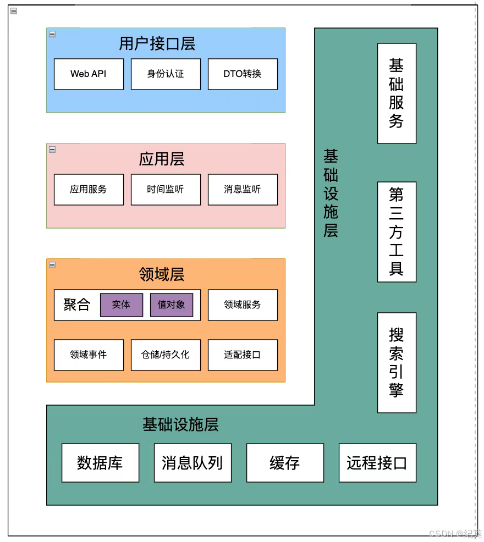

这种分层的结构的优点：
1. 开发人员可以只关注整个结构中的某一层。
2. 可以很容易的用新的实现来替换原有层次的实现。
3. 可以降低层与层之间的依赖。
4. 有利于标准化。利于各层逻辑的复用。

弊端：
1. 降低了系统的性能。这是显然的，因为增加了中间层，不过可以通过缓存机制来改善。
2. 可能会导致级联的修改。这种修改尤其体现在自上而下的方向，不过可以通过依赖倒置来改善。

##### 1.2.2.洋葱分层架构

洋葱架构，就是像洋葱一样的一层一层，从外到内的架构形式
1. 用户接口层：主要负责与用户的交互，例如Web界面、移动应用等。
2. 应用层：主要负责业务逻辑的处理，例如订单管理、库存管理等。
3. 领域层：主要负责核心的业务规则和模型的定义，例如商品实体、订单聚合根等。
4. 基础服务层：主要提供一些通用的功能支持，例如数据库访问、缓存操作等。

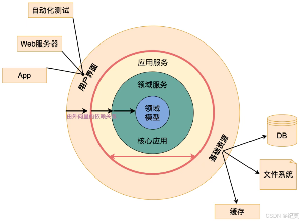

##### 1.2.3.六边形分层架构

六边形架构是 Alistair Cockburn 在2005年提出，解决了传统的分层架构所带来的问题，
实际上它也是一种分层架构，只不过不是上下或左右，而是变成了内部和外部。六边形架构又名“端口-适配器架构”：

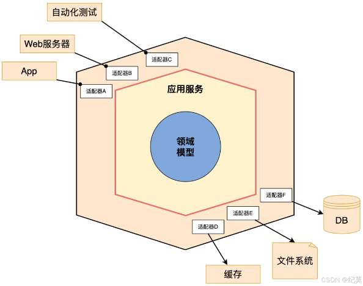

#### 1.3.领域模型设计
如何高质量设计领域模型？核心逻辑是 “以业务为锚点，从共识到落地，再到验证迭代”，最终实现 “业务与技术对齐、模型内聚且边界清晰”。
1. 统一语言。需要让业务专家（运营、销售等）、产品、开发、测试等对术语、规则、流程等达成共识。
   - 提取业务核心共识（例如，商品库存锁定），映射到领域模型中（实体类的方法）
2. 核心步骤：四步落地模型构建
   1. 用 “事件风暴” 梳理业务蓝本：先识别 “领域事件”（已发生的业务结果，如 “订单支付成功”“库存锁定完成”）反推触发事件的 “命令”（如 “支付订单”）
   2. 识别核心领域元素：明确实体、值对象、聚合根的区别，保证模型内聚且边界清晰。
   3. 建模领域行为，拒绝 “贫血模型”。让模型 “数据与行为绑定”，避免业务逻辑丢到服务层，遵循 “谁拥有数据，谁执行行为”的原则。
   4. 划分限界上下文，明确模型边界。避免 “大而全” 的混乱模型，实现业务解耦，
3. 关键保障：验证与迭代

核心：
1. 业务表达力：业务专家能看懂，无技术黑箱，可精准映射业务规则；
2. 内聚性：实体 / 聚合根 “数据 + 行为” 绑定，外部无法绕过规则操作数据；
3. 边界清晰：限界上下文划分合理，上下文间松耦合，变更仅影响局部。

#### 1.4.领域模型分类

分为：充血模型 与 贫血模型

1. 贫血模型则将数据与行为分离的模型，其中数据由对象持有，而行为则由外部服务提供。例如：实体类中没有业务逻辑。
2. 充血模型是一种设计模式，它强调在领域对象中封装数据和业务逻辑，将数据与行为结合在一起，使领域对象不仅仅是数据的容器，还能够包含与其状态相关的业务逻辑。

代码案例
```java
1. 贫血模型
@Data
public class Goods {
    private String name;
    private BigDecimal price;
    private int count;
}
public class GoodsService {
    public void updatePrice(Goods goods, BigDecimal price){
        if(Objects.isNull(price) || BigDecimal.ZERO.compareTo(price) > 0){
            throw new RuntimeException("价格不能小于0");
        }
        goods.setPrice(price);
    }
}

2. 充血模型 
@Data
public class Goods {
    private String name;
    private BigDecimal price;
    private int count;
    
    public void updatePrice(BigDecimal price){
        if(Objects.isNull(price) || BigDecimal.ZERO.compareTo(price) > 0){
            throw new RuntimeException("价格不能小于0");
        }
        this.setPrice(price);
    }
}
```

#### 1.5.防腐层

防腐层（Anticorruption Layer，ACL）是一种设计模式，用于在领域驱动设计中解决外部系统与核心域之间的不兼容问题，保护系统的内部模型和业务逻辑不受外部系统或服务的影响。

案例：当某个业务模块需要依赖第三方系统提供的数据或者功能时，我们常用的策略就是直接使用外部系统的API、数据结构。 
这样存在的问题就是，因使用外部系统，而被外部系统的质量问题影响，从而“腐化”本身设计的问题。

因此解决方案就是在两个系统之间加入一个中间层，隔离第三方系统的依赖，对第三方系统进行通讯转换和语义隔离，这个中间层，我们叫它防腐层。

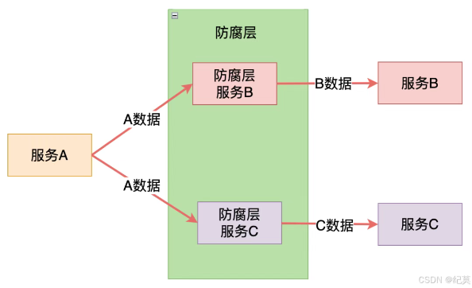

主要作用
- 模型隔离：将外部系统的模型（如 DTO、数据结构）与核心领域模型解耦，防止外部模型污染领域设计。
- 协议转换：处理不同系统间的通信协议差异（如 REST、SOAP、消息队列）。
- 异常处理：封装外部系统的不稳定因素（如超时、错误码），避免影响核心业务。
- 适配差异：解决外部系统与领域模型在数据结构、业务规则上的不匹配问题。


#### 1.6.项目实践

DDD是方法论，而CQRS和event source是具体应用。

架构设计之解析CQRS架构模式！：https://developer.aliyun.com/article/1624473
1. CQRS（命令查询职责分离）：是 DDD 的扩展，将读写分离，适合复杂查询场景（如订单读模型用 Elasticsearch，写模型用数据库）。 
2. Event Sourcing（事件溯源）：是 DDD 领域事件的极致应用，通过事件日志重建对象状态（如交易记录的安全审计）。

关系：DDD 是方法论，CQRS/Event Sourcing 是具体技术实现，可按需组合（如核心聚合用 Event Sourcing，查询用 CQRS）

### 2.TDD-测试驱动

邪教！ 但是好用，人力成本增加，研发周期变长，对于重视软件质量的项目可以使用该模式。
容易产生极端，oracle数据库的单元测试全部执行一次需要

### 3.事件驱动架构-EDA

- [【架构师基本功】事件驱动架构](https://blog.csdn.net/java_wxid/article/details/131283508)
- [事件驱动架构：构建实时响应的高效系统](https://baijiahao.baidu.com/s?id=1772938236612909522&wfr=spider&for=pc)
- [6种事件驱动的架构模式](https://cloud.tencent.com/developer/article/2255982)

事件驱动架构(Event Driven Architecture，EDA)是一种基于事件和消息的分布式系统架构。用于构建具有高可扩展性、高可用性和灵活性的分布式系统。
事件驱动架构旨在实现松散耦合、可靠性和可扩展性。它适用于许多场景，包括传统的企业级应用程序、云原生应用程序、实时数据分析、物联网、人工智能等。

#### 3.1.CloudEvents

- https://cloud.tencent.com/developer/article/1782917
- https://cloud.tencent.com/developer/article/1782918

#### 3.2.Eventbridge
是rocketmq实现了cloudevents协议，是一个云原生事件驱动引擎，基于DDD领域驱动模型实现

### 4.业务驱动技术 or 技术驱动业务
业务驱动技术 or 技术驱动业务 ？ 其实这是一个一直在争论的话题，但是很多人不这么认为，我觉得就是大家不愿意承认罢了。我来和大家大概分析一下作为一个 Java 程序员，我们应该如何判断自己所处于的位置.
- 业务驱动技术：如果你所在的项目是一个收益很小或者甚至没有收益的项目，请不要搞其他创新的东西，不要驱动业务要如何如何做，而是要熟知业务现在的痛点是什么？如何才能帮助业务盈利或者让项目更好，更顺利的进行。
- 技术驱动业务：如果你所在的项目是一个很牛的项目，比如淘宝这类的项目，我可以在满足业务需求的情况下，和业务沟通，使用什么样的技术能更好的帮助业务创造收益，
  比如说下单的时候要进队列，可能几分钟之后订单状态才能处理完成，但是会让用户有更流畅的体验，赚取更多的访问流量，那么我相信业务愿意被技术驱动，会同意订单的延迟问题，这样便是技术驱动业务。

我相信大部分人还都处于业务驱动技术的方向吧。 所以你既然不能驱动业务，那就请拥抱业务变化吧。

## 分布式一致性协议

## 微内核架构

## 基础架构设计原则

## 高可扩展设计原则

[高扩展代码设计套路](https://mp.weixin.qq.com/s/F42LqQncMDLQH-WWmZ28fA)  包括：pipeline、责任链、事件流、SPI等

1. event:事件流，事件分发。 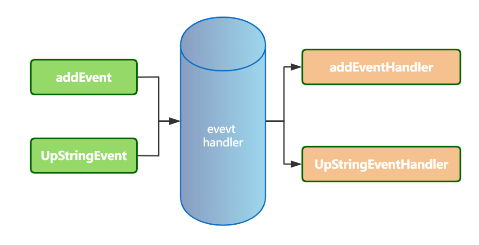
2. pipeline。 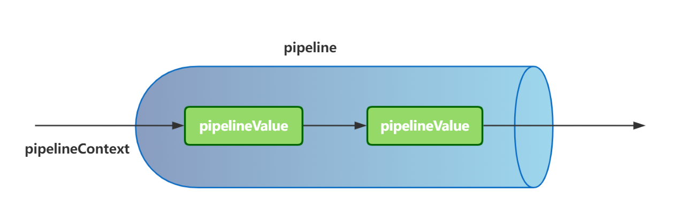
   - Pipeline----将多个PipelineValue串联起来的管道
   - PipelineValue----实际的任务节点
   - PipelineContext----用于管道上下文中数据的扭转
   - 比如：netty框架中，例如ChannelPipeline、ChannelHandler、ChannelHandlerContext，分别用于处理tcp拆包、加解码等等之类
3. 其他
   1. 责任链：Java Servlet的filter。思想：所有filter都处理一遍，有一个不符合要求的就直接退出。
   2. 基于注解：spring提供了大量的扩展，比如aop，事务，缓存，限流，rpc调用等。
   3. SPI: Java提供的扩展机制，以接口名称为文件名称，放在META-INF/services，值为该接口的实现。例如 数据库的驱动程序。

## 高并发设计架构

高可用
<iframe frameborder="0" style="width:100%; height:500px;" src="https://docs.qq.com/mind/DQkJWZGNzSVRmRlJl"></iframe>

高并发
<iframe frameborder="0" style="width:100%; height:500px;" src="https://docs.qq.com/mind/DQllFU3dIa3JlcGZo"></iframe>

## 软件架构模型

C4模型是一种用于描述软件系统架构的轻量级模型，旨在通过简化、清晰和易于理解的方式来表达系统的不同层次的架构信息。
它由Simon Brown提出，并在其著作《Software Architecture for Developers》中首次得到定义。
C4代表了四个层次的抽象化，即：Context（上下文）、Containers（容器）、Components（组件）和Classes/Code（类或代码）。

- 上下文层次（Context）：描述了系统与外部实体（如用户、系统周边关系图、硬件设备等）之间的关系，显示系统如何与其周围的环境交互以及其外部依赖关系。
- 容器层次（Container）：系统内的软件被分解成多个容器，如应用程序、数据库、文件系统等，容器图描述了这些容器之间的关系及它们如何共同工作以实现系统的功能。
- 组件层次（Component）：在容器的内部，每个容器被进一步拆分为组件，如类、模块、服务等，组件图描述了组件之间的关系和依赖关系，以及它们如何协同工作。
- 代码层次（Code）：这是最低层次，描述了每个组件的内部实现细节，通常可以是类图、包图等，用于展示组件内的代码结构。

C4模型提供了一种系统的、多角度的方式来描述软件系统的架构，有助于团队更好地理解和沟通软件架构设计，推进架构的演进升级。

- [C4模型理论与示例](https://blog.csdn.net/liudonglovehemin/article/details/129855167)
- ArchGuard 架构治理[https://gitee.com/archguard](https://gitee.com/archguard)

## 4+1视角

1. 场景视图：从外部视角，描述系统的参与者（用户）与系统功能用例的关系。反映的是系统的最终用户需求和交互设计。


1. 逻辑视图：从结构化视角，描述该系统对用户提供的所需功能服务所具备的组件结构和数据结构，以及一些边界约束条件，清晰地描述给用户提供的功能需求服务是如何构建的。
   描述该系统内部所具备了哪些组织结构，以达到实现对外功能。
2. 开发视图：从结构化视角和行为视角，去描述实现系统功能的各个组件和模块是如何实现的。
3. 处理视图：从行为视角，描述系统各个组件和模块是如何进行通信的。
4. 物理视图：从交互视角，描述系统可以部署到哪些物理环境（如服务器、PC端、移动端等）上和软件环境（如虚拟机、容器、进程等）上。

## B端 与 C端对比

B端 C端 在架构设计上有哪些不同？

1.业务场景与用户需求

| 维度       | B端（企业级应用）                          | C端（消费者应用）                          |
|----------------|---------------------------------------------|---------------------------------------------|
| 用户群体    | 企业员工、管理者（用户量通常在几千到几万）         | 普通消费者（用户量可达千万级甚至亿级）           |
| 核心目标    | 提升企业效率、优化流程、管控成本                    | 提升用户体验、促进用户活跃、实现商业转化            |
| 业务特点    | 流程复杂（如审批流、工作流）、业务逻辑固化（较少变更） | 功能迭代快（如营销活动、用户增长功能）、场景碎片化      |

2.架构设计侧重点

| 维度       | B端架构特点                          | C端架构特点                          |
|----------------|---------------------------------------|---------------------------------------|
| 性能需求    | 并发量较低（通常几百QPS），但要求稳定可靠（如7×24小时不中断） | 高并发（数万到百万QPS）、低延迟（响应时间＜500ms）      |
| 可扩展性    | 侧重模块化扩展（如插件化架构），适应企业定制需求           | 侧重水平扩展（分布式架构），应对流量波动和功能快速迭代    |
| 安全性      | 严格的权限控制（如RBAC/ABAC模型）、数据加密、审计日志         | 防刷策略（如限流、验证码）、用户隐私保护（如数据脱敏）     |
| 稳定性      | 优先保证事务一致性（如金融类B端应用）                    | 允许最终一致性（如分布式事务），侧重可用性（如熔断降级）   |

3.技术栈与组件选型

| 模块       | B端常用技术                          | C端常用技术                          |
|----------------|---------------------------------------|---------------------------------------|
| 架构模式    | 单体架构（早期）或轻量级微服务（如Spring Boot + Spring Cloud） | 分布式微服务（如Spring Cloud Alibaba）、Service Mesh       |
| 数据存储    | 关系型数据库（MySQL/Oracle）+ 缓存（Redis）             | 分库分表（Sharding-JDBC）+ 分布式缓存（Redis Cluster）+ 时序数据库（InfluxDB） |
| 消息中间件  | ActiveMQ/RocketMQ（处理异步任务，如邮件通知）            | Kafka（高吞吐量，处理用户行为日志、实时数据流）           |
| 前端集成    | 前后端分离（Vue/React + 企业级UI框架如Element UI）         | 多端适配（H5/小程序/APP）+ 动态化页面（如Flutter/NativeScript） |
| 监控与运维  | 侧重业务指标监控（如流程进度、数据报表）                | 全链路监控（Pinpoint/Skywalking）、实时告警（Prometheus + Grafana） |
