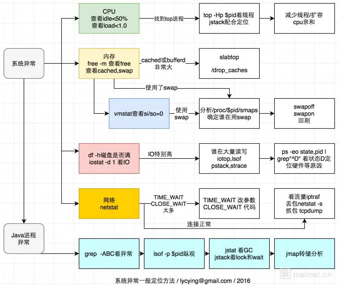

# 生产事故

## 系统异常分析思路



如何排查问题：https://mp.weixin.qq.com/s/we0aP5MwVp73U4DW13lrHQ

### 1.线上操作三板斧
```shell
1. top(看CPU)
出现这种 CPU 飙升的情况，要么走到了死循环，要么就是在做大量的 GC。
  PID USER      PR  NI    VIRT    RES    SHR S %CPU %MEM     TIME+ COMMAND
29892 root       0 -20  137376   9692   6040 S  0.7  1.0 136:04.75 AliYunDun
10142 root      20   0   97488   6892   5948 S  0.3  0.7   0:00.02 sshd
10183 root      20   0   41780   3536   2960 R  0.3  0.3   0:00.02 top
25271 root      20   0  734440  23116   4624 S  0.3  2.3 270:30.16 CmsGoAgent.+
    1 root      20   0  120284   4400   1968 S  0.0  0.4   0:36.25 systemd
    2 root      20   0       0      0      0 S  0.0  0.0   0:00.01 kthreadd
    3 root      20   0       0      0      0 R  0.0  0.0   2:51.56 ksoftirqd/0
    5 root       0 -20       0      0      0 S  0.0  0.0   0:00.00 kworker/0:0H
    7 root      20   0       0      0      0 R  0.0  0.0  18:19.50 rcu_sched
    8 root      20   0       0      0      0 S  0.0  0.0   0:00.00 rcu_bh
    9 root      rt   0       0      0      0 S  0.0  0.0   0:00.00 migration/0
   10 root      rt   0       0      0      0 S  0.0  0.0   0:43.21 watchdog/0
   11 root      20   0       0      0      0 S  0.0  0.0   0:00.00 kdevtmpfs
   12 root       0 -20       0      0      0 S  0.0  0.0   0:00.00 netns
   13 root       0 -20       0      0      0 S  0.0  0.0   0:00.00 perf
   14 root      20   0       0      0      0 S  0.0  0.0   0:04.29 khungtaskd
   15 root       0 -20       0      0      0 S  0.0  0.0   0:00.00 writeback

2. free -m(看内存)
                  total        used        free      shared  buff/cache   available
    Mem:            992         683          86           3         221         144
    Swap:             0           0           0

3. df -h(看磁盘)
    Filesystem      Size  Used Avail Use% Mounted on
    udev            477M     0  477M   0% /dev
    tmpfs           100M  3.0M   97M   4% /run
    /dev/vda1        40G  8.3G   30G  23% /
    tmpfs           497M  116K  496M   1% /dev/shm
    tmpfs           5.0M     0  5.0M   0% /run/lock
    tmpfs           497M     0  497M   0% /sys/fs/cgroup
    tmpfs           100M   16K  100M   1% /run/user/114
    tmpfs           100M  4.0K  100M   1% /run/user/0
```

### 2.JVM详情

#### 2.1.找到进程
```shell
0. 查看进程：jps -mlvV

1. jstat -gc pid [interval] 命令查看了 Java 进程的 GC 状态

2. jstack pid > jstack.log 保存了线程栈的现场。（主要是看下当前的线程是block的）

3. 保存堆的信息： jmap -dump:format=b,file=heap.dump pid

4. 查看JVM启动参数
```

#### 2.2.分析数据

```shell
1. 分析栈
（1） 分析线程的数量： grep 'java.lang.Thread.State' jstack.log  | wc -l
（2）  查看线程最多的几个：grep -A 1 'java.lang.Thread.State' jstack.log  | grep -v 'java.lang.Thread.State' | sort | uniq -c |sort -n

2. 堆文件分析：文件是上面的文件是经过压缩的（gzip压缩）
（1）使用eclipse工具 MAT 
```


#### 2.3.分析代码（先确认jdk的版本）
基本上面的步骤就能分析出问题在哪里。
1. 一般容易出现问题的是非线程安全的集合，尤其是hashMap，hashSet，ArrayList等。 
   当然，线程安全的集合也会出现不安全的问题，尤其是concurrentHashMap在 add,remove的场景可能出现这个问题
2. 大对象，某些对象太大，无法回收，直到内存泄露
3. MySQL IO太多。主要表现为与数据库的交互太多


### 3.其他操作
```text
1. 查看日志（主要是针对没有线上日志监控的系统）
    tail -300f shopbase.log

2、grep
    grep forest f.txt     				#文件查找
    grep forest f.txt cpf.txt 			#多文件查找
    grep 'log' /home/admin -r -n 		#目录下查找所有符合关键字的文件
    cat f.txt | grep -i shopbase    
    grep 'shopbase' /home/admin -r -n --include *.{vm,java} #指定文件后缀
    grep 'shopbase' /home/admin -r -n --exclude *.{vm,java} #反匹配
    seq 10 | grep 5 -A 3   				 #上匹配
    seq 10 | grep 5 -B 3    			#下匹配
    seq 10 | grep 5 -C 3    			#上下匹配，平时用这个就妥了
    cat f.txt | grep -c 'SHOPBASE'		# 关键词

3.jar包冲突
    每个人或多或少都处理过这种烦人的case。我特么下边这么多方案不信就搞不定你?
    
    打出所有依赖：   mvn dependency:tree > ~/dependency.txt
    只打出指定groupId和artifactId的依赖关系： mvn dependency:tree -Dverbose -Dincludes=groupId:artifactId
    
    vm启动脚本加入：  -XX:+TraceClassLoading
    在tomcat启动脚本中可见加载类的详细信息
    
    vm启动脚本加入： -verbose
    在tomcat启动脚本中可见加载类的详细信息
    
    greys的sc命令也能清晰的看到当前类是从哪里加载过来的：  greys:sc
    
    tomcat-classloader-locate
    通过以下url可以获知当前类是从哪里加载的
    curl http://localhost:8006/classloader/locate?class=org.apache.xerces.xs.XSObject
```

## tcp问题分析

### 1.TcpListenOverflows报警
https://blog.csdn.net/puma_dong/article/details/46669499

现象：http服务报500错误
原因：请求太多（对内或对外的请求、过多的线程），导致单台服务器处理能力不足
应用处理网络请求的能力，由两个因素决定：
1、应用的QPS容量（本例中是 就是我们的jetty应用：controller和thrift的处理能力）
2、Socket等待队列的长度（这个是os级别的，cat /proc/sys/net/core/somaxconn 可以查看，默认是128，可以调优成了4192，有的公司会搞成32768）

当这两个容量都满了的时候，应用就不能正常提供服务了，TcpListenOverflows就开始计数，zabbix监控设定了>5发警报，于是就收到报警短信和邮件了。

这个场景下，如果我们到服务器上看看 listen情况，watch "netstat -s | grep listen"，会看到“xxx times the listen queue of a socket overflowed”，并且这个xxx在不断增加，这个xxx就是我们没有对网络请求正常处理的次数。


### 2.http连接过多，造成一些请求丢失
如何判断是否丢掉用户请求：http://blog.sina.com.cn/s/blog_5374d6e30101lex3.html
可能会出现请求丢失的点：
1. 交换机：上下连的流量跑满了或者链路出现问题。
2. 负载均衡：与交换机相似
3. 服务器：os处理不过来

一是网卡见操作系统处理不过来，丢数据包，可以读取下面的文件： /proc/net/dev

每个网络接口一行统计数据，4列是接收出错的数据包数量，5列是接收不过来丢弃的数量。

第二部分是传统非NAPI接口实现的网卡驱动，每个cpu有一个队列，当在队列中缓存的数据包数量超过netdev_max_backlog(sysctl -w net.core.netdev_max_backlog可以修改)限制时，网卡驱动程序会丢掉数据包，这个见下面的文件：
/proc/net/softnet_stat
每个cpu有一行统计数据，第二列是对应cpu丢弃的数据包数量。

4. 应用程序处理不过来

内核中记录了两个计数器：ListenOverflows，ListenDrops
ListenOverflows：对应socket的listen queue已满的情况下，需要新增一个连接时的情况，一般是应用程序处理不过来的情况；
ListenDrops：包含上面的情况，也就是说当出现ListenOverflows时，它也会增加1；除此之外，当内存不够无法为新的连接分配socket相关的数据结构时，也会增加1，当然还有别的异常情况下会增加1。
对应的数据在下面的文件中： /proc/net/netstat

21列是ListenOverflows值，22列是ListenDrops值。
用下面命令，可以直接显示这两个数：
```shell
cat /proc/net/netstat | awk '/TcpExt/ { print $21,$22 }'
```

如果是netstat命令，则看“times the listen queue of a socket overflowed”， “SYNs to LISTEN sockets ignored”对应行前面的数字。
如果没有对应的行，则表明对应的数值为0。如果是0，netstat则不会输出对应的行。
