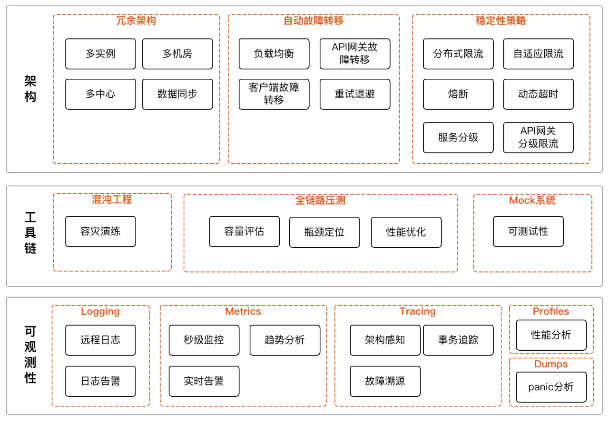
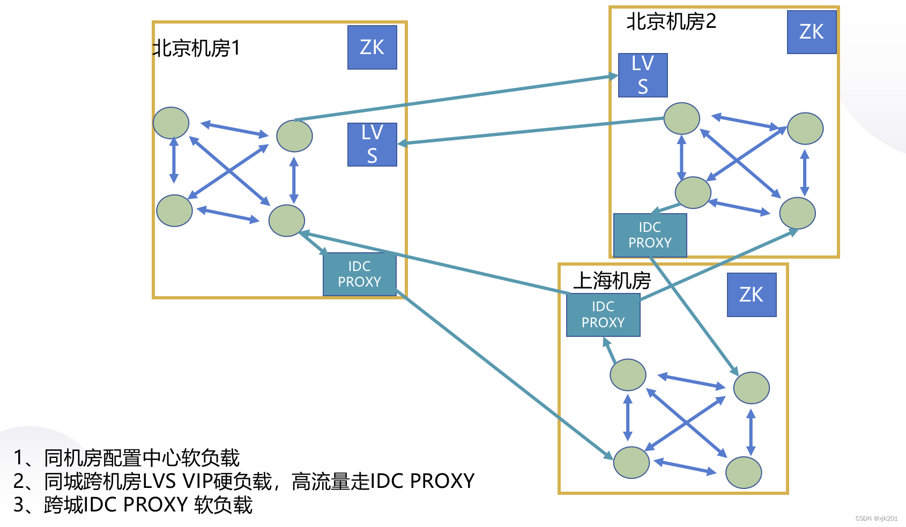
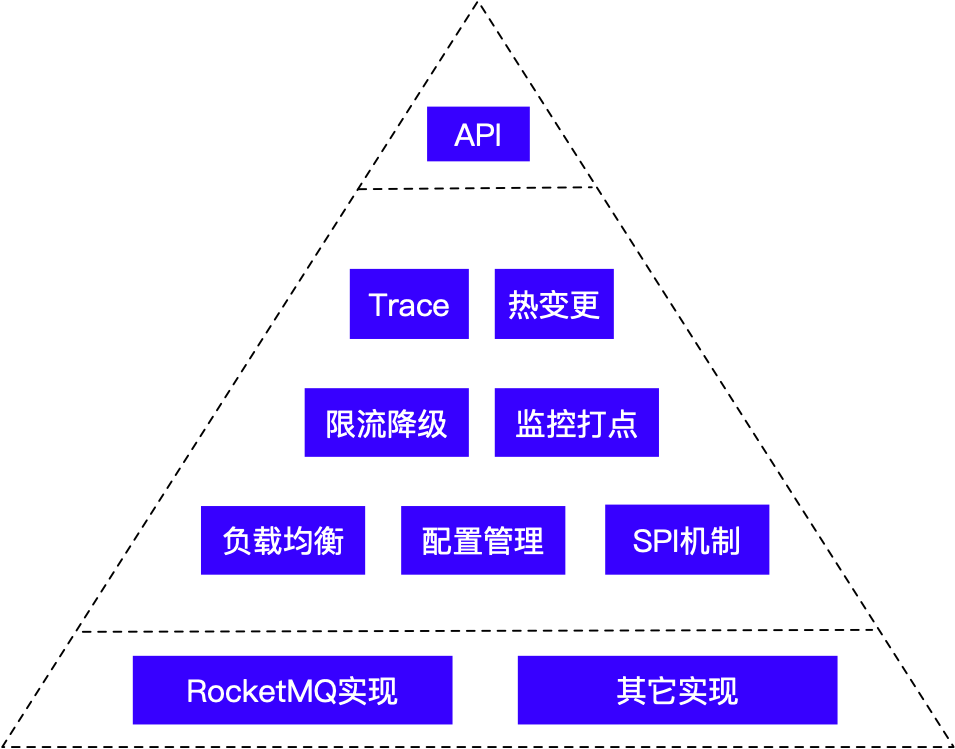

# 解决方案

## 架构方案

程序员技能图谱：[https://github.com/TeamStuQ/skill-map](https://github.com/TeamStuQ/skill-map)

程序员技能图谱是由极客邦科技 [Geekbang](https://www.geekbang.org/) 发起的一个技术社区开源项目，志在汇集、整理、共建泛IT技术领域
（人工智能，前端开发，移动开发，云计算，大数据，架构，运维，安全，后端开发，测试，智能硬件等）及互联网产品、运营等领域学习技能图谱，
帮助程序员梳理知识框架结构，并尝试提供路径指导和精华资源，方便技术人学习成长。


### 技术峰会

- infoq [https://www.infoq.cn/archives](https://www.infoq.cn/archives)
- qcon,全球软件开发大会 [https://qcon.infoq.cn](https://qcon.infoq.cn)

### 网络资源大全
《伯乐在线提供以下资源》
- Java资源大全中文版 [https://github.com/jobbole/awesome-java-cn](https://github.com/jobbole/awesome-java-cn)
- Go资源大全中文版 [https://github.com/jobbole/awesome-go-cn](https://github.com/jobbole/awesome-go-cn)
- MySQL 资源大全中文版 [https://github.com/jobbole/awesome-mysql-cn](https://github.com/jobbole/awesome-mysql-cn)
- Python 资源大全中文版 [https://github.com/jobbole/awesome-python-cn](https://github.com/jobbole/awesome-python-cn)
- Python 技术书 [https://github.com/jobbole/awesome-python-books](https://github.com/jobbole/awesome-python-books)
- 面试题大全 [https://github.com/jobbole/architect-awesome](https://github.com/jobbole/architect-awesome)
- 机器学习资源大全中文版 [https://github.com/jobbole/awesome-machine-learning-cn](https://github.com/jobbole/awesome-machine-learning-cn)
- 系统管理员资源大全中文版 [https://github.com/jobbole/awesome-sysadmin-cn](https://github.com/jobbole/awesome-sysadmin-cn)
- JavaScript 资源大全中文版 [https://github.com/jobbole/awesome-javascript-cn](https://github.com/jobbole/awesome-javascript-cn)
- 经典编程书籍大全 [https://github.com/jobbole/awesome-programming-books](https://github.com/jobbole/awesome-programming-books)

### 架构案例
- 互联网公司经典技术架构 [https://github.com/davideuler/architecture.of.internet-product](https://github.com/davideuler/architecture.of.internet-product)
- 大厂技术面试题目[https://github.com/0voice/interview_internal_reference](https://github.com/0voice/interview_internal_reference)
- QQ音乐高可用架构体系 [https://mp.weixin.qq.com/s/G00cwGYAr6l2Px6-DiwXLA](https://mp.weixin.qq.com/s/G00cwGYAr6l2Px6-DiwXLA)
- 腾讯财付通会计核算系统原理与架构 [https://mp.weixin.qq.com/s/j88jXaY6HXw6MYlIj0ThyA](https://mp.weixin.qq.com/s/j88jXaY6HXw6MYlIj0ThyA)
  
- [京东亿级商品详情页架构演进技术解密](https://mp.weixin.qq.com/s/EFENLWb_pzttU6iycQyZiQ)
### 事故

- 记一次SSL握手导致业务线程阻塞的案例分析 [https://heapdump.cn/article/5250641](https://heapdump.cn/article/5250641)
- 线程池bug导致系统卡顿 [https://mp.weixin.qq.com/s/-ff7Enr4AMUDi8MR1LQqzw](https://mp.weixin.qq.com/s/-ff7Enr4AMUDi8MR1LQqzw)

### 故事
- 七十年编程语言发展漫谈 [https://mp.weixin.qq.com/s/4MD4b673b1kkBGhYINSoNQ](https://mp.weixin.qq.com/s/4MD4b673b1kkBGhYINSoNQ)

## 脱敏

### 1.数据脱敏
- [Apache ShardingSphere数据脱敏全解决方案详解](https://my.oschina.net/u/3867294/blog/3089014)
- [基于注解实现数据脱敏](https://gitee.com/luckSnow/knowledge/tree/master/learn_code/src/main/java/com/zx/_04_安全/数据脱敏/基于程序控制)
- [大厂也在用的 6种 数据脱敏方案](https://mp.weixin.qq.com/s/zGVTi3_EG750yQ9FyYAT1A)

在应用中增加数据安全相关的功能，需要从以下几个方面考虑
- 敏感数据发现：通过被动感知和主动探测的方式，快速发现网页中的敏感数据，对敏感数据进行分类和分级，帮助企业从安全角度梳理数据资产，并满足符合行业法规的相关要求
- 废弃API识别：针对内部业务进行api智能梳理，识别异常和废弃API，防止数据泄漏风险的发生
- 智能数据脱敏：通过丰富的脱敏算法与灵活的脱敏配置，对身份证号、银行卡号、手机号等敏感数据进行智能脱敏，将管理员从繁琐的安全策略配置和安全事件处理中解放出来
- 水印溯源追踪：通过可以溯源的文档和图片水印，文档暗水印，有效提高员工安全红线意识，针对数据泄漏行为起到威慑作用
- 数据防拷贝：可以有效防止访问者通过复制、粘贴的方式拷贝网页上的敏感数据，进一步提高数据泄漏成本
- 敏感行为审计：数据安全网关记录操作敏感信息的行为，方便事后进行调查取证，同时也可以结合UEBA对异常行为预警，提前发现内部的数据泄漏事件
- 精准溯源：基于水印加码和行为审计，依托对泄露信息中唯一身份标识串码的追踪，结合大数据能力锁定泄密者实际身份，找到数据泄漏者
- 内网攻击防护：具备常见攻击防护能力，即使内网失陷，也可以有效感知到内网攻击并告警，通过防护能力加强内网系统自身的安全性，保护内网核心数据安全

分层脱敏：
1. 数据库层次的脱敏。
2. 接口层的脱敏，dubbo过滤器+注解规则
3. 页面层脱敏，第三方网关层次。例如，百度的智能数据安全网关：https://anquan.baidu.com/product/dpg

脱敏方案：
- 无效化。对数据值进行 截断、加密、隐藏 等操作
- 随机值。覆盖原始值
- 数据替换。使用固定数据进行局部替换。
- 对称加密。
- 平均值
- 偏移和取整

### 2.日志脱敏

不同与上面的脱敏，日志脱敏非常另类，既没有从根源上解决数据脱敏的问题，还平白无故的增加了大量的工作。

- [自定义脱敏组件（slf4j+logback）](https://blog.csdn.net/qq_40885085/article/details/113385261)
- [插件源码](https://gitee.com/liuchengyin_vae/LogbackDesensitization)

## 埋点

在互联网产品上线之后，产品和运营人员需要即时了解产品的使用情况，有多少用户，用户使用了哪些功能，停留时长，使用路径等等。
要回答这些问题，需要有数据，不能拍脑袋想当然。数据怎么得到呢？埋点就是采集数据的重要途径。

数据埋点不是新名词，在电脑网站出来之后就有统计工具，站长们很熟悉的谷歌、百度统计等工具，通过在 HTML 页面中嵌入它们提供的 js 代码实现数据采集。

多说几句，无论谷歌、百度还是其它的 Web 页面统计工具，技术实现原理通常都是由 Web 服务器端通过代码的方式向浏览器返回一张 1*1
像素的透明图片(在网页上人眼看不到这张图片)，图片的过期时间设置成立即过期，这样每次打开页面浏览器都会去请求这张图片，服务器端就可以记录下请求数据。
明白了原理，自己也可以写一个简单的统计工具。

在设计埋点方案之前需要确定收集哪些数据，将这些需求汇总，产品、运营、技术一起确定埋点方案。从埋点位置划分，可以分为：前端埋点和后端埋点。

### 1.前端埋点
顾名思义，就是在用户可见的那端(APP、网页、PC客户端、小程序)嵌入数据采集代码，像一些第三方的统计工具，比如友盟等，前端嵌入它们的 SDK，调用 SDK 提供的接口采集数据。

前端埋点能收集到用户在界面上的操作轨迹，这些数据后端没法收集，比如用户点击了哪个按钮，打开了哪些页面，页面之间的跳转次序等。目前常见的前端埋点技术，有下面三类：

#### 1.1.代码埋点
谷歌统计、百度统计、友盟等都是代码埋点的例子。在前端代码里嵌入数据采集代码，比如在APP启动时嵌入，在按钮点击事件里嵌入等。

代码埋点的优点是控制精准，采集的数据项精确。缺点：首先是需要开发人员到处添加采集代码，添加和修改的工作量大；其次变更采集策略，需要发布新版本，代价巨大；
此外对于APP来说还有耗电、消耗数据流量、丢失数据的风险。

#### 1.2.可视化埋点
从上面可知，代码埋点的缺点很多，最大的缺点是变更需要开发人员修改代码，不灵活。
为了改善，有的公司开发出了可视化埋点技术，产品与运营人员通过GUI界面，鼠标点击的方式随时调整埋点位置，增加、取消埋点，再也不需要开发人员的介入，而且不用发布新版本。
技术实现原理：基本原理就是将埋点位置信息做成可配置的资源，通过在后台管理端上操作生成这些配置，客户端启动或者定时从服务器端获取这些配置，
客户端根据最新的配置采集数据，发送给服务端。

#### 1.3.无埋点
原理跟可视化埋点几乎一样，唯一的不同就是，无埋点是先把所有控件的操作数据采集下来，发给服务器，数据分析人员在后台管理端设置对哪些数据进行分析。
由此可知，这个方案收集的数据量巨大，增加了网络传输和服务器存储负担。
无埋点比可视化方案优势的地方是收集的历史数据齐全，可以回溯分析过往数据。

### 2.后端埋点
后端埋点就是在服务端嵌入代码，收集数据，由于是在服务端采集数据，可以避免前端埋点的以下一些问题：
- 客户端采集数据，为了尽量减少对用户体验的影响，需要对采集的数据压缩、暂存，为减少移动端的数据流量，一般只在网络状况良好的情况下向服务器发送数据，
  因此数据会有延迟，丢数据等弊端。而在服务端采集数据，数据在内网传输，数据传输的即时性强，丢失数据的风险小。
- 客户端采集数据，如果要增加采集点或变更采集方案，需要修改客户端代码，这就需要发布新版本，受发布周期的影响，而且通常很多用户并不会及时更新版本，
  将导致新方案不能覆盖所有用户。在服务端采集数据则没有这些问题。

通过以上比较，实施时尽量采用后端埋点，除非后端没法采集到所需要的数据。

### 3.工具选择

国内不少数据服务公司提供了数据采集、分析工具，初创公司可以选择使用它们的服务，不过最好选择可以独立部署的提供方，方便控制，防止数据泄漏。

总结一下，数据埋点需要根据需求而定，灵活使用以上方案，扬长避短。

- 国内埋点分析平台：  https://www.growingio.com/
- 神策：			  https://www.sensorsdata.cn/manual/

## 白名单&黑名单

为了封禁某些爬虫或者恶意用户对服务器的请求，我们需要建立一个动态的 IP 黑名单。对于黑名单之内的 IP ，拒绝提供服务。

架构实现 IP 黑名单的功能有很多途径：

1、在操作系统层面，配置 iptables，拒绝指定 IP 的网络请求；

2、在 Web Server 层面，通过 Nginx 自身的 deny 选项 或者 lua 插件 配置 IP 黑名单；
安装 Nginx+Lua模块，推荐使用 OpenResty，这是一个集成了各种 Lua 模块的 Nginx 服务器

3、在应用层面，在请求服务之前检查一遍客户端 IP 是否在黑名单。

## 短链

高性能短链系统： https://mp.weixin.qq.com/s/yIcQjeFfmqGBLrJPCvT_eQ

其实就是通过短域名与短的参数（一般是restfull风格）的URL，通过服务器端重定向到指定链接

比如： http://dl.cn/s/10Ganb

1. 域名：这个不用说了，就是越短越好
2. 压缩算法。进制转换 Base62(微博实现方案)，使用雪花算法分配一个id再转为62进制（0-9,a-z,A-Z），短链长度为7~9长度。

其他
- 使用MySQL自增主键，位数转换
- 使用Snowflake算法，位数转换
- Redis的数字类型的自增，位数转换
- 短uuid（将32位转为8位）

这样数据库中保存的映射的参数就可以是数字了（提高数据库索引的查询效率）
```java
public class Demo4 {
    public static void main(String[] args) {
        long n = 3002604296L;
        String s_36 = Long.toString(n, 36);
        System.out.println(s_36);//1dno8aw

        long s_10 = Long.parseLong(s_36, 36);
        System.out.println(s_10);//3002604296

        // 也可以自己定义
        System.out.println(to62(n));//3hcCxy
    }

    // 36 + 26 = 62 位
    final static char[] digits = {
            '0' , '1' , '2' , '3' , '4' , '5' ,
            '6' , '7' , '8' , '9' , 'a' , 'b' ,
            'c' , 'd' , 'e' , 'f' , 'g' , 'h' ,
            'i' , 'j' , 'k' , 'l' , 'm' , 'n' ,
            'o' , 'p' , 'q' , 'r' , 's' , 't' ,
            'u' , 'v' , 'w' , 'x' , 'y' , 'z',
            'A' , 'B' ,
            'C' , 'D' , 'E' , 'F' , 'G' , 'H' ,
            'I' , 'J' , 'K' , 'L' , 'M' , 'N' ,
            'O' , 'P' , 'Q' , 'R' , 'S' , 'T' ,
            'U' , 'V' , 'W' , 'X' , 'Y' , 'Z'
    };
    // 自定义 62位转换
    public static String to62(long i) {
        char[] buf = new char[65];
        int charPos = 64;
        boolean negative = (i < 0);

        if (!negative) {
            i = -i;
        }

        while (i <= -62) {
            buf[charPos--] = digits[(int)(-(i % 62))];
            i = i / 62;
        }
        buf[charPos] = digits[(int)(-i)];

        if (negative) {
            buf[--charPos] = '-';
        }

        return new String(buf, charPos, (65 - charPos));
    }
}
```

## 权限体系

[权限控制&登录控制](技术方案/权限控制&登录控制)

## 双十一重大活动

[面对大促场景来临，如何从容进行性能测试](https://mp.weixin.qq.com/s/NRGZhlcUpocn7HvcjWiBQg)

- 服务降低，避免出现大面积的影响。
- 服务限流，尽可能的做好细粒度的限流。
- 系统核心全部。梳理全链路，当出现问题的时候能快速找到问题源头。对于关键的技术指标进行监控，比如流量、jvm、db的数据量、响应时间等
- 一致性，参与双十一的多是交易相关的，所以一定要梳理好整个链路的交易逻辑，避免出现不一致的问题。
- 全链路压测，有条件的需要搭建一个新的系统集群。

## 容灾模式

一般可分为同城容灾、异地容灾、双活数据中心、两地三中心、三地五中心等。前三个看名字就知道什么意思了，就不多解释。

一般说同城数据中心，指的是距离在200KM内的两个数据中心，当然条件好的地方，这个距离可以更大些，比如北京的数据中心。

### 1.两地三中心

两地三中心 ： 是指 同城双中心 加 异地灾备 一种商用容灾备份解决方案。

注意：同城双中心 可以是 双活节点 也可以是 一主一备。这样就出现两种架构
- 同城生产、同城灾备、异地灾备。中心化架构，2个灾备资源只做数据同步，比较浪费资源
- 同城生产1、同城生产2、异地灾备。生产1和2之间同步复制数据，1和2异步向灾备复制。1和2各占50%的流量
- 更加好的架构模式：集群节点互为主备，同时运行。

特指金融级别的高可用性和灾难备份的能力。至少要确保数据层面（数据库）上的架构

- [两地三中心案例](https://blog.csdn.net/haydenwang8287/article/details/113522741)
- [两地三中心及其灾备](https://blog.csdn.net/xjk201/article/details/125777537)

### 2.三地五中心

更高级别的灾备等级。如果说两地三种是城市级别的灾备，那么三地五中心就是省级灾备。

通常情况下，都会选择多活的方式进行灾备，以副本的方式进行数据存储。

如今很多分布式数据库都开始支持两地三中心和三地五中心，比如OceanBase、Tidb、巨杉等

[三地五中心（ldc(逻辑数据中心）单元化）和容灾](https://blog.csdn.net/xjk201/article/details/125798167)

### 3.异地调用问题

以上的容灾模式，一般选择多活的方案，就会出现异地调用的问题，比如北京机房的服务调用了上海机房的数据库，这样性能肯定低。

所有，一般的解决方案是，使用 vip。就是数据库的ip是同一个，但是ip对应的数据库是同机房内部的。



[OceanBase的容灾方案](https://www.oceanbase.com/docs/enterprise-oceanbase-database-cn-10000000000354512)

### 4.灾备级别

- 第一类，数据级灾备：主要关注的就是数据，在灾难发生之后，可以确保数据不受到损坏。对于级别较低的数据级灾备来说，
  可以通过将需要备份的数据以人工的方式保存到异地来实现。如将备份的磁带（盘或光盘）定时运送到异地保存就是方法之一。
  而较高级的数据灾备方案则依靠基于网络的数据复制工具，实现生产中心不同备份设备之间或生产中心与灾备中心之间的异步/同步的数据传输，
  如采用基于磁盘阵列的数据复制功能或存储级数据实时复制。
- 第二类，应用级灾备：建立在数据级灾备的基础上，对应用系统进行复制，也就是在异地灾备中心再构建一套应用支撑系统。
  支撑系统包括数据备份系统、备用数据处理系统、备用网络系统等部分。应用级灾备能提供应用系统接管能力，即在生产中心发生故障的情况下，
  灾备中心能够接管应用，从而尽量减少系统停机时间，提高业务连续性。
- 第三类，业务级灾备：是最高级别的灾备系统，它包括非 IT 系统。当发生大的灾难时，用户的办公场所可能会被损坏，用户除了需要原来的数据以外，还需要一个能够正常开展业务的备份工作场所。

## 视频网站
视频网站最特殊的地方，就是超大的网络流量。


### 1.抖音服务器带宽
[抖音服务器带宽有多大，才能供上亿人同时刷](https://mp.weixin.qq.com/s/4E7DLdN8mG8uOHmkais0MA)

1.想要同一时间有数亿人在线，TB 级别带宽，CDN 加速和多节点，负载均衡等等技术缺一不可。这个设计非常复杂，以下为简单的架构说明。


2.超大的数据中心总带宽。字节跳动2023年的总带宽在10TB左右，预计年底可超过15TB。
一般情况下：总出口带宽 1TB，实际机房出口带宽可能只有 100G 上下，这是采用双（多）链路设计，双出口实现动态流量分担，总的出口带宽可以达到 T 级别

3.超大量服务器，17年2W台 ->18年17W台 ->20年42W台

## 降本增效

- [降本增效的“本”到底是什么？万字长文！阿里云刘伟光剖析企业数字化的降“本”增效](https://mp.weixin.qq.com/s/_eSJYj-i0k9J2ZqQ8Dmr-Q)
- [有效降低数据库存储成本方案与实践](https://mp.weixin.qq.com/s/vW7p4ucCAqg75EwaYVN91w)

## DSL

[DSL 领域特定语言](https://blog.csdn.net/u011487470/article/details/124583051)

DSL（Domain Specific Language）是针对某一领域，具有受限表达性的一种计算机程序设计语言。 常用于聚焦指定的领域或问题，这就要求 DSL 具备强大的表现力，同时在使用起来要简单。
说到DSL，大家也会自然的想到通用语言（如Java、C等）。

例如：使用Java编写的低代码平台，可以通过编写Groovy脚本实现某些特殊功能。

## SDK

### 1.设计思想
我们的思维认知是封装一层可以减少研发人员使用第三方组件的心智投入，统一技术栈，也就如此了。

但是一个糟糕的封装却是灾难的开始，消息的SDK封装策略：

1. 对外只提供最基本的 API，所有访问必须经过SDK提供的接口。
   简洁的 API 就像冰山的一个角，除了对外的简单接口，下面所有的东西都可以升级更换，而不会破坏兼容性;
2. 业务开发起来也很简单，只要需要提供 Topic（全局唯一）和 Group
   就可以生产和消费，不用提供环境、NameServer 地址等。SDK 内部会根据
   Topic 解析出集群 NameServer
   的地址，然后连接相应的集群。生产环境和测试环境环境会解析出不同的地址，从而实现了隔离；
3. 上图分为 3 层，第二层是通用的，第三层才对应具体的 MQ
   实现，因此，理论上可以更换为其它消息中间件，而客户端程序不需要修改；
4. SDK 内部集成了热变更机制，可以在不重启 Client
   的情况下做动态配置，比如下发路由策略（更换集群 NameServer
   的地址，或者连接到别的集群去），Client 的线程数、超时时间等。通过
   Maven 强制更新机制，可以保证业务使用的 SDK 基本上是最新的。



### 2.短信服务

短信服务应用很广泛，比如用户注册登录验证码，营销短信，下单成功短信通知等等。最开始设计短信服务的时候，
我想学习业界是怎么做的。于是把目标锁定在腾讯云的短信服务上。腾讯云的短信服务有如下特点：

- 统一的SDK，后端入口是http/https服务 ， 分配appId/appSecret鉴权；
- 简洁的API设计：单发，群发，营销单发，营销群发，模板单发，模板群发。

于是，我参考了这种设计思路。

1. 模仿腾讯云的SDK设计，提供简单易用的短信接口；
2. 设计短信服务API端，接收发短信请求，发送短信信息到消息队列；
3. worker服务消费消息，按照负载均衡的算法，调用不同渠道商的短信接口；
4. Dashboard可以查看短信发送记录，配置渠道商信息。

## 服务私有化部署

很多优秀的项目，都采用了微服务架构，如果要部署到私有化环境，可能不满足客户对硬件的要求

[腾讯文档如何实现灵活架构切换](https://mp.weixin.qq.com/s/Hy7C5_1dgxvlkKvu6BMsBw)

## 跨域访问

[跨域访问](技术方案/跨域访问)