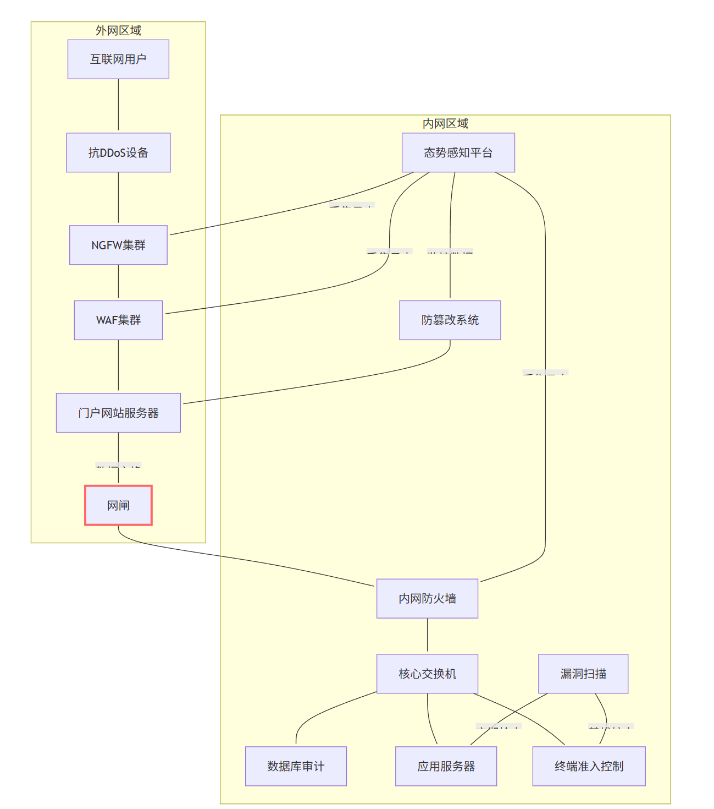
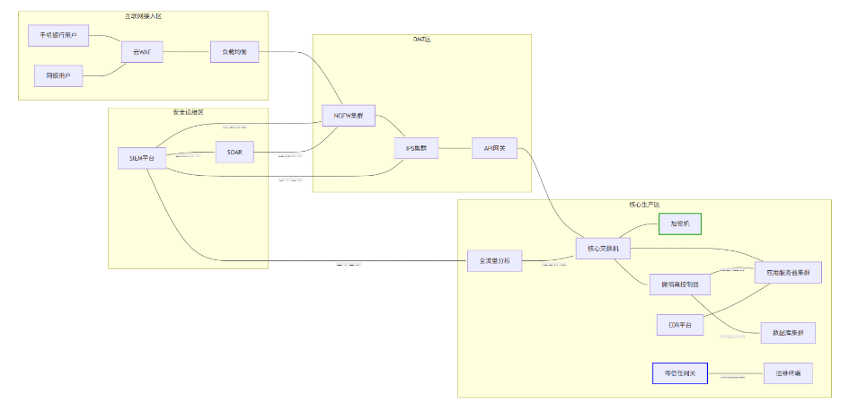
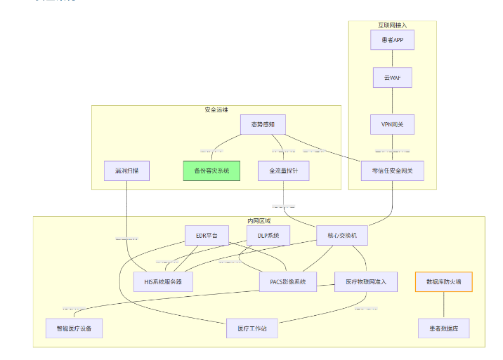

# 系统安全架构设计

## 政府单位（等保三级合规场景）

核心需求：
- 满足等保三级要求
- 内外网物理隔离
- 门户网站防篡改
- 敏感数据防泄露

部署产品与作用：
1. 网闸：实现内外网物理隔离，仅允许指定数据单向流动
2. 防篡改系统：实时监控网站文件变化，自动恢复被篡改内容
3. 数据库审计：记录所有敏感数据访问行为，满足等保审计要求
4. 终端准入：确保接入设备符合安全策略，防止非法接入
5. 态势感知：集中分析安全事件，实现攻击链可视化

## 银行核心系统（金融级防护）

核心需求：
- 支付系统高可用性（99.999%）
- 符合PCI-DSS标准
- 防APT攻击
- 交易数据加密保护

## 三甲医院（医疗数据防护）

核心需求：
- HIPAA合规患者隐私保护
- 医疗设备安全接入
- 防勒索软件
- 互联网医疗应用防护

特色防护方案
1. 医疗物联网准入：
   - 自动识别设备类型（CT机/心电监护仪）
   - 建立设备白名单通信策略
   - 监控异常设备行为
2. 防勒索专项：
   - EDR部署勒索行为拦截模块
   - 关键系统采用防篡改技术
   - 医疗数据实时备份至隔离存储
3. 患者数据保护：
   - DLP系统监控敏感数据（病历/检验报告）
   - 数据库防火墙阻断未授权访问
   - 所有外发数据自动脱敏处理