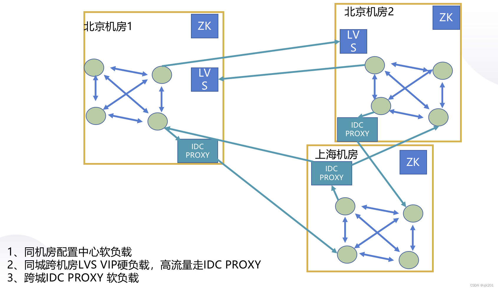

# 应用方案

## 一、脱敏

### 1.数据脱敏
- [Apache ShardingSphere数据脱敏全解决方案详解](https://my.oschina.net/u/3867294/blog/3089014)
- [基于注解实现数据脱敏](https://gitee.com/luckSnow/knowledge/tree/master/learn_code/src/main/java/com/zx/_04_安全/数据脱敏/基于程序控制)
- [大厂也在用的 6种 数据脱敏方案](https://mp.weixin.qq.com/s/zGVTi3_EG750yQ9FyYAT1A)

在应用中增加数据安全相关的功能，需要从以下几个方面考虑
- 敏感数据发现：通过被动感知和主动探测的方式，快速发现网页中的敏感数据，对敏感数据进行分类和分级，帮助企业从安全角度梳理数据资产，并满足符合行业法规的相关要求
- 废弃API识别：针对内部业务进行api智能梳理，识别异常和废弃API，防止数据泄漏风险的发生
- 智能数据脱敏：通过丰富的脱敏算法与灵活的脱敏配置，对身份证号、银行卡号、手机号等敏感数据进行智能脱敏，将管理员从繁琐的安全策略配置和安全事件处理中解放出来
- 水印溯源追踪：通过可以溯源的文档和图片水印，文档暗水印，有效提高员工安全红线意识，针对数据泄漏行为起到威慑作用
- 数据防拷贝：可以有效防止访问者通过复制、粘贴的方式拷贝网页上的敏感数据，进一步提高数据泄漏成本
- 敏感行为审计：数据安全网关记录操作敏感信息的行为，方便事后进行调查取证，同时也可以结合UEBA对异常行为预警，提前发现内部的数据泄漏事件
- 精准溯源：基于水印加码和行为审计，依托对泄露信息中唯一身份标识串码的追踪，结合大数据能力锁定泄密者实际身份，找到数据泄漏者
- 内网攻击防护：具备常见攻击防护能力，即使内网失陷，也可以有效感知到内网攻击并告警，通过防护能力加强内网系统自身的安全性，保护内网核心数据安全

分层脱敏：
1. 数据库层次的脱敏。
2. 接口层的脱敏，dubbo过滤器+注解规则
3. 页面层脱敏，第三方网关层次。例如，百度的智能数据安全网关：https://anquan.baidu.com/product/dpg

脱敏方案：
- 无效化。对数据值进行 截断、加密、隐藏 等操作
- 随机值。覆盖原始值
- 数据替换。使用固定数据进行局部替换。
- 对称加密。
- 平均值
- 偏移和取整

### 2.日志脱敏

- [自定义脱敏组件（slf4j+logback）](https://blog.csdn.net/qq_40885085/article/details/113385261)
- [插件源码](https://gitee.com/liuchengyin_vae/LogbackDesensitization)


## 二、埋点

在互联网产品上线之后，产品和运营人员需要即时了解产品的使用情况，有多少用户，用户使用了哪些功能，停留时长，使用路径等等。
要回答这些问题，需要有数据，不能拍脑袋想当然。数据怎么得到呢？埋点就是采集数据的重要途径。

数据埋点不是新名词，在电脑网站出来之后就有统计工具，站长们很熟悉的谷歌、百度统计等工具，通过在 HTML 页面中嵌入它们提供的 js 代码实现数据采集。

多说几句，无论谷歌、百度还是其它的 Web 页面统计工具，技术实现原理通常都是由 Web 服务器端通过代码的方式向浏览器返回一张 1*1
像素的透明图片(在网页上人眼看不到这张图片)，图片的过期时间设置成立即过期，这样每次打开页面浏览器都会去请求这张图片，服务器端就可以记录下请求数据。
明白了原理，自己也可以写一个简单的统计工具。

在设计埋点方案之前需要确定收集哪些数据，将这些需求汇总，产品、运营、技术一起确定埋点方案。从埋点位置划分，可以分为：前端埋点和后端埋点。

### 1.前端埋点
顾名思义，就是在用户可见的那端(APP、网页、PC客户端、小程序)嵌入数据采集代码，像一些第三方的统计工具，比如友盟等，前端嵌入它们的 SDK，调用 SDK 提供的接口采集数据。

前端埋点能收集到用户在界面上的操作轨迹，这些数据后端没法收集，比如用户点击了哪个按钮，打开了哪些页面，页面之间的跳转次序等。目前常见的前端埋点技术，有下面三类：

#### 1.1.代码埋点
谷歌统计、百度统计、友盟等都是代码埋点的例子。在前端代码里嵌入数据采集代码，比如在APP启动时嵌入，在按钮点击事件里嵌入等。

代码埋点的优点是控制精准，采集的数据项精确。缺点：首先是需要开发人员到处添加采集代码，添加和修改的工作量大；其次变更采集策略，需要发布新版本，代价巨大；
此外对于APP来说还有耗电、消耗数据流量、丢失数据的风险。

#### 1.2.可视化埋点
从上面可知，代码埋点的缺点很多，最大的缺点是变更需要开发人员修改代码，不灵活。
为了改善，有的公司开发出了可视化埋点技术，产品与运营人员通过GUI界面，鼠标点击的方式随时调整埋点位置，增加、取消埋点，再也不需要开发人员的介入，而且不用发布新版本。
技术实现原理：基本原理就是将埋点位置信息做成可配置的资源，通过在后台管理端上操作生成这些配置，客户端启动或者定时从服务器端获取这些配置，
客户端根据最新的配置采集数据，发送给服务端。

#### 1.3.无埋点
原理跟可视化埋点几乎一样，唯一的不同就是，无埋点是先把所有控件的操作数据采集下来，发给服务器，数据分析人员在后台管理端设置对哪些数据进行分析。
由此可知，这个方案收集的数据量巨大，增加了网络传输和服务器存储负担。
无埋点比可视化方案优势的地方是收集的历史数据齐全，可以回溯分析过往数据。

### 2.后端埋点
后端埋点就是在服务端嵌入代码，收集数据，由于是在服务端采集数据，可以避免前端埋点的以下一些问题：
- 客户端采集数据，为了尽量减少对用户体验的影响，需要对采集的数据压缩、暂存，为减少移动端的数据流量，一般只在网络状况良好的情况下向服务器发送数据，
  因此数据会有延迟，丢数据等弊端。而在服务端采集数据，数据在内网传输，数据传输的即时性强，丢失数据的风险小。
- 客户端采集数据，如果要增加采集点或变更采集方案，需要修改客户端代码，这就需要发布新版本，受发布周期的影响，而且通常很多用户并不会及时更新版本，
  将导致新方案不能覆盖所有用户。在服务端采集数据则没有这些问题。

通过以上比较，实施时尽量采用后端埋点，除非后端没法采集到所需要的数据。

### 3.工具选择

国内不少数据服务公司提供了数据采集、分析工具，初创公司可以选择使用它们的服务，不过最好选择可以独立部署的提供方，方便控制，防止数据泄漏。

总结一下，数据埋点需要根据需求而定，灵活使用以上方案，扬长避短。

- 国内埋点分析平台：  https://www.growingio.com/
- 神策：			  https://www.sensorsdata.cn/manual/

## 三、白名单&黑名单

为了封禁某些爬虫或者恶意用户对服务器的请求，我们需要建立一个动态的 IP 黑名单。对于黑名单之内的 IP ，拒绝提供服务。

架构实现 IP 黑名单的功能有很多途径：

1、在操作系统层面，配置 iptables，拒绝指定 IP 的网络请求；

2、在 Web Server 层面，通过 Nginx 自身的 deny 选项 或者 lua 插件 配置 IP 黑名单；
安装 Nginx+Lua模块，推荐使用 OpenResty，这是一个集成了各种 Lua 模块的 Nginx 服务器

3、在应用层面，在请求服务之前检查一遍客户端 IP 是否在黑名单。

## 四、短链

高性能短链系统： https://mp.weixin.qq.com/s/yIcQjeFfmqGBLrJPCvT_eQ

其实就是通过短域名与短的参数（一般是restfull风格）的URL，通过服务器端重定向到指定链接

比如： http://dl.cn/s/10Ganb

1.域名：这个不用说了，就是越短越好

2.后缀参数：
通过URL计算hash值。比如murmurhash算法，如果遇到hash冲突（其实也就是唯一约束冲突），可以选择在URL后面增加一个随机参数，
比如hash_conflict_random=153154487，重新计算hash值
这样计算出来的hash值应该是一串数字：3002604296
想要更短的换，我们可以进行进制转换，比如转为36位或62位等

这样数据库中保存的映射的参数就可以是数字了（提高数据库索引的查询效率）
```java
public class Demo4 {
    public static void main(String[] args) {
        long n = 3002604296L;
        String s_36 = Long.toString(n, 36);
        System.out.println(s_36);//1dno8aw

        long s_10 = Long.parseLong(s_36, 36);
        System.out.println(s_10);//3002604296

        // 也可以自己定义
        System.out.println(to62(n));//3hcCxy
    }

    // 36 + 26 = 62 位
    final static char[] digits = {
            '0' , '1' , '2' , '3' , '4' , '5' ,
            '6' , '7' , '8' , '9' , 'a' , 'b' ,
            'c' , 'd' , 'e' , 'f' , 'g' , 'h' ,
            'i' , 'j' , 'k' , 'l' , 'm' , 'n' ,
            'o' , 'p' , 'q' , 'r' , 's' , 't' ,
            'u' , 'v' , 'w' , 'x' , 'y' , 'z',
            'A' , 'B' ,
            'C' , 'D' , 'E' , 'F' , 'G' , 'H' ,
            'I' , 'J' , 'K' , 'L' , 'M' , 'N' ,
            'O' , 'P' , 'Q' , 'R' , 'S' , 'T' ,
            'U' , 'V' , 'W' , 'X' , 'Y' , 'Z'
    };
    // 自定义 62位转换
    public static String to62(long i) {
        char[] buf = new char[65];
        int charPos = 64;
        boolean negative = (i < 0);

        if (!negative) {
            i = -i;
        }

        while (i <= -62) {
            buf[charPos--] = digits[(int)(-(i % 62))];
            i = i / 62;
        }
        buf[charPos] = digits[(int)(-i)];

        if (negative) {
            buf[--charPos] = '-';
        }

        return new String(buf, charPos, (65 - charPos));
    }
}
```
3.优化点

使用布隆过滤器，将已经存在的短链参数保存进去，这样就不用去和数据库比较是否发生hash冲突了
还有别的计算短参数的方法，比如
- 使用MySQL自增主键
- 使用Snowflake算法
- Redis的数字类型的自增
- 短uuid（将32位转为8位）

## 五、权限体系

[权限控制&登录控制](权限控制&登录控制)

## 六、双十一技术支持

- 服务降低，避免出现大面积的影响。
- 服务限流，尽可能的做好细粒度的限流。
- 系统核心全部。梳理全链路，当出现问题的时候能快速找到问题源头。对于关键的技术指标进行监控，比如流量、jvm、db的数据量、响应时间等
- 一致性，参与双十一的多是交易相关的，所以一定要梳理好整个链路的交易逻辑，避免出现不一致的问题。
- 全链路压测，有条件的需要搭建一个新的系统集群。

## 七、容灾模式

一般可分为同城容灾、异地容灾、双活数据中心、两地三中心、三地五中心等。前三个看名字就知道什么意思了，就不多解释。

一般说同城数据中心，指的是距离在200KM内的两个数据中心，当然条件好的地方，这个距离可以更大些，比如北京的数据中心。

### 1.两地三中心

两地三中心 ： 是指 同城双中心 加 异地灾备 一种商用容灾备份解决方案。

注意：同城双中心 可以是 双活节点 也可以是 一主一备。这样就出现两种架构
- 同城生产、同城灾备、异地灾备。中心化架构，2个灾备资源只做数据同步，比较浪费资源
- 同城生产1、同城生产2、异地灾备。生产1和2之间同步复制数据，1和2异步向灾备复制。1和2各占50%的流量
- 更加好的架构模式：集群节点互为主备，同时运行。

特指金融级别的高可用性和灾难备份的能力。至少要确保数据层面（数据库）上的架构

- [两地三中心案例](https://blog.csdn.net/haydenwang8287/article/details/113522741)
- [两地三中心及其灾备](https://blog.csdn.net/xjk201/article/details/125777537)


### 2.三地五中心

更高级别的灾备等级。如果说两地三种是城市级别的灾备，那么三地五中心就是省级灾备。

通常情况下，都会选择多活的方式进行灾备，以副本的方式进行数据存储。

如今很多分布式数据库都开始支持两地三中心和三地五中心，比如OceanBase、Tidb、巨杉等

[三地五中心（ldc(逻辑数据中心）单元化）和容灾](https://blog.csdn.net/xjk201/article/details/125798167)

### 3.异地调用问题

以上的容灾模式，一般选择多活的方案，就会出现异地调用的问题，比如北京机房的服务调用了上海机房的数据库，这样性能肯定低。

所有，一般的解决方案是，使用 vip。就是数据库的ip是同一个，但是ip对应的数据库是同机房内部的。




[OceanBase的容灾方案](https://www.oceanbase.com/docs/enterprise-oceanbase-database-cn-10000000000354512)