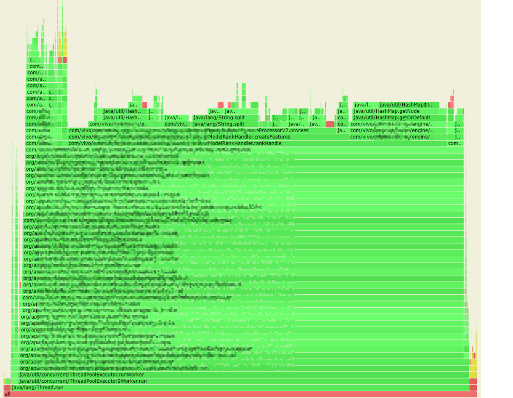
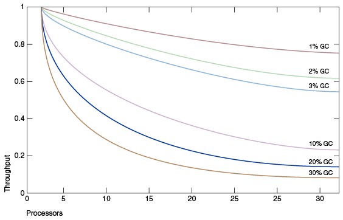

# 性能调优

## 1.介绍
应用程序主要分为两种：
- IO密集型：特性为需要和第三方应用进行交互，比如操作文件、数据库、mq、其他的应用。在等待第三方回复之前，我们的应用程序为阻塞状态。
- CPU密集型：有应用程序单独完成整个程序，比如计算、缓存、策略等

所以性能瓶颈也有所不同
- IO密集型：网络、第三方的性能可能是性能瓶颈【不是本文重点】
- CPU密集型：热代码的性能、GC调优、堆外内存使用等【本文重点】

## 2.性能指标

【CPU密集型】 可以使用JMH进行压测获得指标，性能衡量指标是吞吐量 TPS ，由经典公式 TPS = 并发数 / 平均响应时间RT  可以知道，若需提高 TPS，可以有 2 种方式：

- 提高并发数，比如提升单机的并行线程数，或者横向扩容机器数；
- 降低平均响应时间 RT，包括应用线程（业务逻辑）执行时间，以及 JVM 本身的 GC 耗时。

实际情况中，我们的机器 CPU 利用率已经很高，达到 80% 以上，提升单机并发数的预期收益有限，故把主要精力投入到降低 RT 上。

## 3.工具

### 3.1.火焰图【寻找热代码】

火焰图说明：火焰图是基于 perf 结果产生的 SVG 图片，用来展示 CPU 的调用栈。
- y 轴表示调用栈，每一层都是一个函数。调用栈越深，火焰就越高，顶部就是正在执行的函数，下方都是它的父函数。
- x 轴表示抽样数，如果一个函数在 x 轴占据的宽度越宽，就表示它被抽到的次数多，即执行的时间长。注意，x 轴不代表时间，而是所有的调用栈合并后，按字母顺序排列的。

火焰图就是看顶层的哪个函数占据的宽度最大。只要有“平顶”（plateaus），就表示该函数可能存在性能问题。
颜色没有特殊含义，因为火焰图表示的是 CPU 的繁忙程度，所以一般选择暖色调。

工具推荐：
- 阿里巴巴开源的 arthas 工具，我们获取到线上服务的 CPU 火焰图。【缺点是只能采样已经运行的jvm进程】
- idea自带的profiler查看运行程序消耗的资源
- JProfiler。本地分析工具




### 3.2.JMH【性能压测工具】

详情看[JMH](/article/9.框架/JMH)


## 4.常见的性能优化点

### 4.1.尽量避免原生 String.split 方法 
  
原生 split 方法是性能杀手，效率比较低，频繁调用时会耗费大量资源。

性能低的原因：
- 业务中未使用正则表达式，而原生 split 在处理分隔符为 2 个及以上字符时，默认按正则表达式方式处理；众所周知，正则表达式的效率是低下的。
- 当分隔符为单个字符（且不为正则表达式字符）时，原生 String.split 进行了性能优化处理，但中间有些内部转换处理，在我们的实际业务场景中反而是多余的、消耗性能的。
其具体实现是：通过 String.indexOf 及 String.substring 方法来实现分割处理，将分割结果存入 ArrayList 中，最后将 ArrayList 转换为 string[] 输出。
而我们业务中，其实很多时候需要 list 型结果，多了 2 次 list 和 string[] 的互转。

可以选择自己实现
```java
import java.util.ArrayList;
import java.util.List;
import org.apache.commons.lang3.StringUtils;
  
/**
 * 自定义split工具
 * 1.放弃正则表达式的支持，仅支持按分隔符进行 split；
 * 2.出参直接返回 list。分割处理实现，与原生实现中针对单字符的处理类似，使用 string.indexOf 及 string.substring 方法，分割结果放入 list 中，出参直接返回 list，减少数据转换处理；
 * 3.提供 splitFirst 方法，业务场景只需要分隔符前第一段字符串时，进一步提升性能。
 */
public class SplitUtils {
  
    /**
     * 自定义分割函数，返回第一个
     *
     * @param str   待分割的字符串
     * @param delim 分隔符
     * @return 分割后的第一个字符串
     */
    public static String splitFirst(final String str, final String delim) {
        if (null == str || StringUtils.isEmpty(delim)) {
            return str;
        }
  
        int index = str.indexOf(delim);
        if (index < 0) {
            return str;
        }
        if (index == 0) {
            // 一开始就是分隔符，返回空串
            return "";
        }
  
        return str.substring(0, index);
    }
  
    /**
     * 自定义分割函数，返回全部
     *
     * @param str   待分割的字符串
     * @param delim 分隔符
     * @return 分割后的返回结果
     */
    public static List<String> split(String str, final String delim) {
        if (null == str) {
            return new ArrayList<>(0);
        }
  
        if (StringUtils.isEmpty(delim)) {
            List<String> result = new ArrayList<>(1);
            result.add(str);
  
            return result;
        }
  
        final List<String> stringList = new ArrayList<>();
        while (true) {
            int index = str.indexOf(delim);
            if (index < 0) {
                stringList.add(str);
                break;
            }
            stringList.add(str.substring(0, index));
            str = str.substring(index + delim.length());
        }
        return stringList;
    }
}
```

### 4.2.集合类初始化容量

HashMap、ArrayList等底层使用数组实现的集合类，在到达阈值时，都会有数组扩容的现象（创建新的数组，将旧数组的数据复制到新的数组中）。

这样不仅浪费的一部分内存也降低了性能。所以最好的处理方法是提前初始化好容量。

```java
new HashMap(num/0.75d + 1);
new ArrayList(num);
```

### 4.3.加快 map 的查表效率

针对，长度较大的字符串的key。我们知道 string 的 equals 方法其实是遍历比对 char[] 中的字符，key 越长则比对效率越低。

对于长度超过20，map entry 数据量大的map，性能明显。

所以，将 key 的长度缩短，或者甚至换成数值型，可以明显的提高性能。


### 4.4.GC的影响

在小型系统上开发时，GC 的性能开销可以忽略，但扩展到大型系统（尤其是那些具有大量数据、许多线程和高事务率的应用程序）时，GC 的开销不可忽视，甚至可能成为重要的性能瓶颈。



上图 模拟了一个理想的系统，除了垃圾收集之外，它是完全可伸缩的。红线表示在单处理器系统上只花费 1% 时间进行垃圾收集的应用程序。

这意味着在拥有 32 个处理器的系统上，吞吐量损失超过 20% 。洋红色线显示，对于垃圾收集时间为 10% 的应用程序(在单处理器应用程序中，
垃圾收集时间不算太长)，当扩展到 32 个处理器时，会损失 75% 以上的吞吐量。

一位的增加服务器配置是无法有效提高应用性能的。所以在jdk14新增G1 NUMA感知内存分配，提高多核服务器的应用性能。

建议：避免在配置太高的服务器上使用Java应用（在服务器上搭建虚拟机分配适当的资源），或者使用jdk14以上的版本并开启NUMA感知内存分配。

### 4.5.大量缓存

如何能尽量缓存较多的数据，同时避免过大的 GC 压力呢。推荐使用堆外内存。【只能单机版】

我们想到了把缓存对象移到堆外，这样可以不受堆内内存大小的限制；并且堆外内存，并不受 JVM GC 的管控，避免了缓存过大对 GC 的影响。经过调研，我们决定采用成熟的开源堆外缓存组件 OHC 。

OHC 全称为 off-heap-cache，即堆外缓存，是 2015 年针对 Apache Cassandra 开发的缓存框架，后来从 Cassandra 项目中独立出来，成为单独的类库，其项目地址为：

https://github.com/snazy/ohc

其特性如下：
- 数据存储在堆外，只有少量元数据存储堆内，不影响 GC
- 支持为每个缓存项设置过期时间
- 支持配置 LRU、W_TinyLFU 驱逐策略
- 能够维护大量的缓存条目
- 支持异步加载缓存
- 读写速度在微秒级别