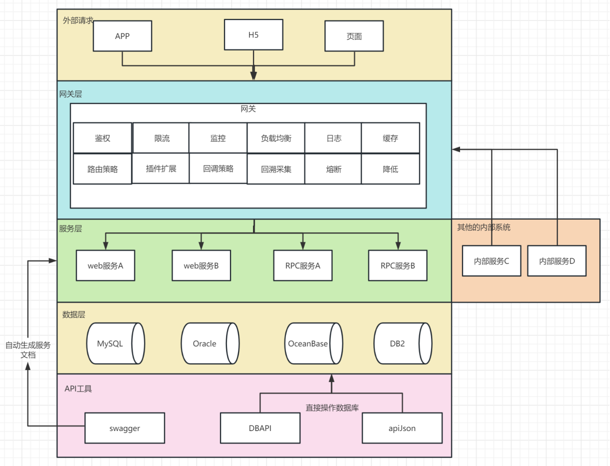

# 技术规范

## 开发规范

参考阿里、腾讯、谷歌等公司的开发规范。见：E:\1.Java\规范\腾讯技术规范

- 阿里技术规范《码出高效：Java开发手册》
- 腾讯技术规范 
    1. 开发语言规范。包括Java、golang、python、c++等。虽然阿里的Java规范最流程，但是与Google的Java规范比较还是不够实用。
    2. 持续集成与持续部署。CI/CD、常用的各类流水线
    3. 代码质量与技术债。
    4. 测试。包括单元测试、集成测试、UI测试。接口自动化测试算是一种特殊的集成测试
    5. Code Review
    6. 重构

## 安全开发规范

参考阿里、腾讯、谷歌等公司的开发规范

- 腾讯技术规范[E:\1.Java\规范\腾讯技术规范](E:\1.Java\规范\腾讯技术规范)
- 腾讯开源的面向开发人员梳理的代码安全指南[https://github.com/Tencent/secguide](https://github.com/Tencent/secguide)

## TDD

邪教！ 但是好用。人力成本增加

## DDD

魔教！ 但是好用。但是人力成本增加，可以借鉴代码生成器

- [基于DDD的微服务设计和开发实战](https://mp.weixin.qq.com/s/orOF1EKYoc4Z_0pmGOYNVg)
- [一个电商供应链系统的DDD实战](https://mp.weixin.qq.com/s/xg2JhTvIaz8kbCJJwlMLTw)

## 错误码

参考
- [腾讯云服务器API错误码](https://cloud.tencent.com/document/product/213/30435)
- [http状态码](https://baike.baidu.com/item/HTTP%E7%8A%B6%E6%80%81%E7%A0%81/5053660?fr=aladdin)
- [dubbo错误码机制的介绍](https://cn.dubbo.apache.org/zh-cn/overview/mannual/java-sdk/faq/intro/)

- 严格的错误码： 通过错误码统一整个项目的 code 和 message。缺点：文字提示过于笼统
- 中庸之道：强制固定 code、自定义 message

注意事项：异常信息的第一使用者是人，这里包括使用者（用户）和异常处理者（运营人员、程序员）

异常需要进行细分：业务异常和系统 bug

通过aop的方式统一处理异常。

## Code Review
Talk Is Cheap, Show Me The Code，  知易行难

架构师，就是掌握大量设计理念和原则、落地到各种语言及附带工具链（生态）下的实践方法、垂直行业模型理解，定制系统模型设计和工程实践规范细则。
进而控制 30+万行代码项目的开发便利性、可维护性、可测试性、运营质量。

[腾讯 Code Review 规范](https://mp.weixin.qq.com/s/BZ_fZYiOWiW-MpmrCD5Qpg)

## OpenAPI

### 核心概念
- OpenAPI：狭义上指的是有swagger提出的web api规范。广义上是指对外提供的web api。
- API网关：为webapi提供鉴权、限流、负载均衡、日志、监控等多种功能中间件。
- API工具：方面快速生成webapi文档，方便简单功能开发等功能的工具。

三者直接具备如下关系。

### OpenAPI 的作用
是定义 Web API 的标准接口描述和编程语言无关接口描述。 它使人类和计算机可以发现和了解服务的功能，而无需访问源代码、其他文档或检查网络流量。

### OpenAPI的发展历史
- OpenAPI最初是在2007年由API工具商Swagger的创始人Tony Tam创造的。如今，OpenAPI是API设计和开发的标准之一，它已成为全球API生态系统中最受欢迎的工具和规范之一。
- OpenAPI最初是为解决API文档和交互的问题设计的，这些方案通常是定制、复杂和难以理解。OpenAPI的主要目标是提供API的统一、易于维护和理解的方式，同时支持多种语言和工具。
- 随着OpenAPI规范的发展，它逐渐被接受为API整个生命周期的标准，包括设计、开发、测试、文档化、部署、管理和监控。
- OpenAPI规范的开放性和可扩展性使其成为了各种API工具和框架的必备标准之一，例如API管理平台、客户端和服务端生成器、测试工具、文档生成器等。
- 于2015 年捐赠给 Linux 基金会后改名为 OpenAPI，并定义最新的规范为 OpenAPI 3.0

### 厂商的OpenAPI
- 百度：https://cloud.baidu.com/doc/API/index.html
- QQ： https://wiki.connect.qq.com/%E8%AE%BF%E9%97%AEopenAPI%E6%8E%A5%E5%8F%A3
- Tapd：https://www.tapd.cn/help/show#1120003271001000055
- 腾讯云：https://cloud.tencent.com/document/api/213/15730

## 接口设计规范

- [优秀的 API 接口都是如何设计的](https://www.bilibili.com/read/cv18827925)
- [如何设计一个良好的接口](http://www.noobyard.com/article/p-eetbjijp-md.html)
- posix标准:https://www.jianshu.com/p/e9e3f17deb36
- oas规范:https://blog.csdn.net/HuaZi_Myth/article/details/104053585
- 深入理解云计算OpenAPI体系:https://mp.weixin.qq.com/s/zsBcikZpkeMzFxvzj1gmaw