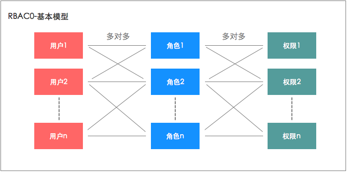
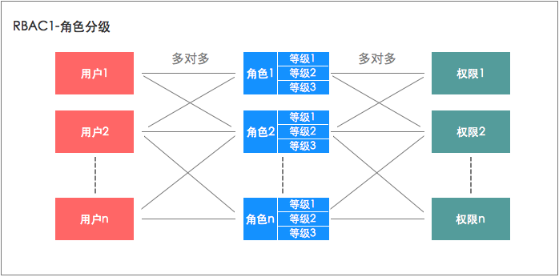
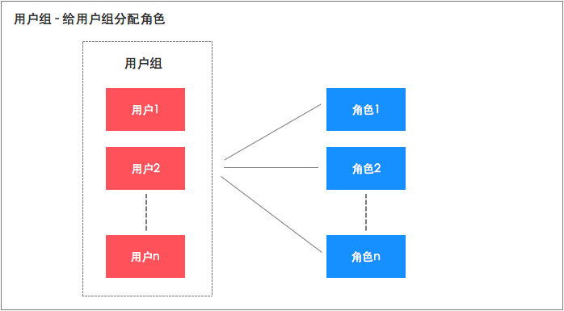

# 权限控制

## 1.介绍

权限控制（AC）即 Access Control，一句话介绍：「谁（Who）可以对什么资源（What）进行什么操作（How）」

权限控制属于系统设计的一部分，常见于几乎所有 ToB 的系统内。尤其是一些传统的层级很多的企业内，权限控制非常重要

### 1.1.基础概念：
- 什么是资源：资源是一个非常宽泛的概念，任何需要控制的实体都可以定义为资源，如：页面、链接、接口、数据
- 操作有什么：读写，或者更详细一些：增删改查
- 什么是权限：对某种资源的某个操作，称为权限

### 1.2.常见的权限模型：
1. 基于角色的访问控制(RBAC，Role-Based Access control)，最常用的模型。
2. 基于属性的访问控制（ABAC，Attribute Base Access Control）
3. 访问控制列表(ACL，Access Control List)
4. 自主访问控制（DAC）
5. 强制访问控制（MAC）
6. 基于任务和工作流的访问控制(TBAC)
7. 基于任务和角色的访问控制(T-RBAC)
8. 基于对象的访问控制（OBAC）
9. 使用控制模型(UCON)

### 1.3.开源项目

权限控制，灵活多变，并不存在灵活通用任意场景的开源项目。所有几乎所有的公司都是自己开发或者使用开源的OA系统。

## 2.RBAC-基于角色的访问控制

[RBAC权限系统设计](https://zhuanlan.zhihu.com/p/104849603?utm_id=0)

[RBAC权限管理](https://blog.csdn.net/cs_zhao18/article/details/121712830)

RBAC是一套成熟的权限模型。在传统权限模型中，我们直接把权限赋予用户。而在RBAC中，增加了“角色”的概念，我们首先把权限赋予角色，再把角色赋予用户。
这样，由于增加了角色，授权会更加灵活方便。在RBAC中，根据权限的复杂程度，又可分为RBAC0、RBAC1、RBAC2、RBAC3。
其中，RBAC0是基础，RBAC1、RBAC2、RBAC3都是以RBAC0为基础的升级。我们可以根据自家产品权限的复杂程度，选取适合的权限模型。

基础概念：
- User，用户
- Role，角色
- Permission，权限
- User to Role，用户-角色之间的映射关系
- Role to Permission，角色-权限之间的映射关系

### 2.1.RBAC0【基本模型】

RBAC0是基础，很多产品只需基于RBAC0就可以搭建权限模型了。在这个模型中，我们把权限赋予角色，再把角色赋予用户。用户和角色，角色和权限都是多对多的关系。
用户拥有的权限等于他所有的角色持有权限之和。



### 2.2.RBAC1【角色分层模型】

RBAC1建立在RBAC0基础之上，在角色中引入了继承的概念。
简单理解就是，给角色可以分成几个等级，每个等级权限不同，从而实现更细粒度的权限管理。



### 2.3.RBAC2【角色限制模型】
RBAC2同样建立在RBAC0基础之上，仅是对用户、角色和权限三者之间增加了一些限制。 这些限制可以分成两类。

静态职责分离 SSD(Static Separation of Duty)：
- 互斥角色限制：角色间存在互斥关系，用户只能选择其中一个角色；
- 基数限制：一个用户拥有的角色数量是有上限的，一个角色对应的权限数量也是有上限的；
- 先决条件限制：角色之间存在前置依赖关系，用户必须先获得低级角色才能拥有高级角色；

动态职责分离 DSD(Dynamic Separation of Duty)：
- 如果用户拥有两个及以上角色，则同一时间段内有且只有一个角色可以生效

限制条件有些抽象，举几个例子
- 出纳和会计就是两个互斥的角色，不能由同一个人同时担任（互斥角色一般是两者权限存在串通或者监督关系）
- 一些体系内角色有高级和低级区别，比如专员和经理


### 2.4.RBAC3【统一模型】

也是最完善的模型：RBAC3 = RBAC1 + RBAC2


### 2.5.用户组【基于RBAC的延展】



我们可以把一个部门看成一个用户组，如销售部，财务部，再给这个部门直接赋予角色，使部门拥有部门权限，这样这个部门的所有用户都有了部门权限。
用户组概念可以更方便的给群体用户授权，且不影响用户本来就拥有的角色权限。

本质是，在用户和角色之间增加一层对于关系-用户组。用户组可以是部门、岗位、职级。

- 优势：只需要维护用户组和角色的关系，用户组的数量少，便于维护
- 缺点：不够灵活，无法针对某个人单独分配权限

## 3.ABAC-基于属性的访问控制

[ABAC解释](https://blog.csdn.net/qq_31960623/article/details/120528589)

传统的 RBAC 与 ACL 等访问控制机制中，可以认为是 ABAC 的子集，对于 RBAC，只是我们的访问机制的实现只是基于属性 role 而已，ACL 则是基于属性是 identity 的 AC。

属性包括很多，比如 岗位(研发、产品、管理、运营等)，职级（P1、P2、P3、P4等），公司（总公司、子公司、分公司、外包等）

本质上与RBAC的用户组概念是一样的，只是概念更加抽象。

基础概念：
- attribute，属性。可以是角色、岗位、职级等任意的 kv结构数据
- subject，科目，一般指的是用户。
- object，对象。一般指的是需要管理的资源。比如，某个系统的某个菜单的功能
- operation，操作。表示subject可以的操作。比如，读、写、修改、下载等
- policy，策略。对operation进行更细维度的判断，可以理解为数据权限。
- environment conditions，语境 或者 上下文条件。比如当前时间是否运行操作、数据状态是否运行操作。

## 4.ACL-访问控制列表

目前在 Linux/Unix 文件系统中使用，也是使用最广泛的权限控制方式。 是一种粗粒度的文件系统权限控制模式。

### 4.1.Linux的控制方式

一个文件拥有三种用户关系，所有者、所属组和其他，这也意味着这个文件的权限只有三种，当我们想给一个特殊用户设置第四种权限时，就可以使用acl权限去设置。

acl主要分为3个方面可以控制。

1.权限模式（Scheme）
- IP：从 IP 地址粒度进行权限控制
- Digest：最常用，用类似于 username:password 的权限标识来进行权限配置， 便于区分不同应用来进行权限控制
- World：最开放的权限控制方式，是一种特殊的 digest 模式，只有一个权限标识“world:anyone”
- Super：超级用户

2.授权对象
- 授权对象指的是权限赋予的用户或一个指定实体，例如 IP 地址或是机器灯。

3.权限 Permission
- CREATE：数据节点创建权限，允许授权对象在该 Znode 下创建子节点
- DELETE：子节点删除权限，允许授权对象删除该数据节点的子节点
- READ：数据节点的读取权限， 允许授权对象访问该数据节点并读取其数据内容或子节点列表等
- WRITE：数据节点更新权限，允许授权对象对该数据节点进行更新操作
- ADMIN：数据节点管理权限，允许授权对象对该数据节点进行 ACL 相关设置操作

### 4.2.云产品

访问管理（Cloud Access Management，CAM），是各类云厂商使用的权限管理方式。

以腾讯云为例：

[支持CAM的业务接口-概览](https://cloud.tencent.com/document/product/598/67350)

可以通过访问管理（CAM）创建、管理和销毁用户（组），操作不同的资源的不同的权限。

## 5.登录

### 5.1.登录控制

但是可以借助开源工具，实现控制。比如：
- Apache Shrio：[https://shiro.apache.org/](https://shiro.apache.org/)
- oltu：[https://oltu.apache.org/](https://oltu.apache.org/)
- Spring Security
- MaxKey：[https://gitee.com/maxkeytop/MaxKey](https://gitee.com/maxkeytop/MaxKey)
  单点登录认证系统(Single Sign On System)，寓意是最大钥匙,是业界领先的企业级IAM身份管理和身份认证产品。
  支持OAuth 2.0/OpenID Connect、SAML 2.0、JWT、CAS、SCIM等标准协议，
  提供简单、标准、安全和开放的用户身份管理(IDM)、身份认证(AM)、单点登录(SSO)、RBAC权限管理和资源管理等。
- oauth2-shiro：[https://gitee.com/mkk/oauth2-shiro](https://gitee.com/mkk/oauth2-shiro)
  整合Apache Oltu 与 Shiro，提供一个轻量的OAUTH2应用框架，并根据不同的应用场景提供不同的实现(如web场景,移动设备)
- spring-lhbauth：[https://gitee.com/lvhaibao/spring-lhbauth](https://gitee.com/lvhaibao/spring-lhbauth)
  基于OAuth2和JWT实现认证授权。
- oauth2：[https://gitee.com/lyric/oauth2](https://gitee.com/lyric/oauth2)
  Golang实现的OAuth 2.0服务端，依照协议RFC 6749实现，具有简单使用、灵活、模块化的特点；支持内存存储、文件存储、redis存储、mongodb存储。
- oauthserver：[https://gitee.com/jeesun/oauthserver](https://gitee.com/jeesun/oauthserver)
  是一个基于Spring Boot Oauth2的完整的独立的Oauth2 Server微服务。项目的目的是，仅仅需要创建相关数据表，修改数据库的连接信息，你就可以得到一个Oauth2 Server微服务。
- JustAuth：[https://gitee.com/yadong.zhang/JustAuth](https://gitee.com/yadong.zhang/JustAuth)
  是一个第三方授权登录的工具类库，它可以让我们脱离繁琐的第三方登录 SDK。
  集成了诸如：Github、Gitee、支付宝、新浪微博、微信、Google、Facebook、Twitter、StackOverflow等国内外数十家第三方平台。


### 5.2.登录安全问题

1.使用HTTPS。不要使用get请求发送敏感信息

2.WEB前端可以通过某种算法，对密码字段进行加密后，在将密码作为Http请求的内容进行提交，常见的包括对称和非对称加密。
- 对称加密:采用对称密码编码技术，它的特点是文件加密和解密使用相同的密钥加密。
- 非对称加密:需要两个密钥，公开密钥（publickey）和私有密钥（privatekey）。
  公开密钥与私有密钥是一对，如果用公开密钥对数据进行加密，只有用对应的私有密钥才能解密；如果用私有密钥对数据进行加密，那么只有用对应的公开密钥才能解密。

3.防获取

- 方案一：验证码。MVC场景。控制器将把数据的Model封装到View中，这种存在Session的连接方式，允许了在Session中存取信息。
  
那么我们可以利用一些开源的验证码生成工具，例如JAVA中的Kaptcha，在服务端存放生成一个验证码值以及一个验证码的生成图片，
将图片以Base64编码，并返回给View，在View中解码Base64并加载图片，并于用户下次登录时再进行比对。

- 方案二：token令牌
  
前后端分离场景。现在非常流行的前后端分离的开发模式大大提高了项目的开发效率。职责、分工明确，但是由于HTTP是无状态的，
当用户登录时，根据用户的username作为key，生成随机令牌（例如UUID）作为value缓存在Redis中，并且将token返回给客户端，
当客户端登录时，将完成校验，并且删除Redis中的那条缓存记录。

那么每次从服务器中获取认证的token，确实能保证HTTP请求是由前端传回来的了，因为token在每次登陆后都会删除并被重置，
会导致黑客尝试重放账号密码数据信息来登陆的时候导致无法成功登陆。

总而言之，就是我拿到了账号以及密码的密文也登陆不了，因为，如果请求不包含后台认证的令牌token，是个非法请求。

4.防篡改

假如发送方想把一份报文发送给接收方，在发送报文前，发送方用一个哈希函数从报文文本中生成报文摘要,然后用自己的私人密钥对这个摘要进行加密，
这个加密后的摘要将作为报文的”签名“和报文一起发送给接收方，接收方首先用与发送方一样的哈希函数从接收到的原始报文中计算出报文摘要，
接着再用发送方的公用密钥来对报文附加的数字签名进行解密，如果这两个摘要相同、那么接收方就能确认报文是从发送方发送且没有被遗漏和修改过！
这就是结合“非对称密钥加解密”和“数字摘要“技术所能做的事情，这也就是人们所说的“数字签名”技术。

在这个过程中，对传送数据生成摘要并使用私钥进行加密地过程就是生成”数字签名“的过程，经过加密的数字摘要，就是”数字签名“。

因此，我们可以在WEB端对之前案例中提到的username+MD5(password)+token通过签名，得到一个字段checkCode，并将checkCode发送给服务器，
服务器根据用户发送的checkCode以及自身对原始数据签名进行运算比对，从而确认数据是否中途被篡改，以保持数据的完整性。

5.补充1：JS加密函数存在被破解
```text
完整性检验中关于JS加密函数存在被破解的问题：
问题描述：如果黑客通过阅读前端js源码,发现加密算法,是否意味他可以构造可以被服务端解密的checkCode 来欺骗服务端呢?

采取的策略：
摘要或加密JS算法不直接以静态文件的形式存在浏览器中，而是让WEB端去请求Server，服务器可以根据随机令牌token值决定返回一个相应随机的加密策略，
以JS代码响应的方式返回，在异步请求响应中，加载JS摘要算法，这样客户端就可以动态加载数字摘要策略，保证无法仿造。
```

6.补充2：MD5存在隐患的问题
```text
问题描述： 用MD5、SHA256 处理密码的过时了，并且存在不安全的问题。。。现在 PBKDF、bcrypt 都在过时中。

主要思想是： 对于MD5的破解，实际上都属于【碰撞】。比如原文A通过MD5可以生成摘要M，我们并不需要把M还原成A，只需要找到原文B，生成同样的摘要M即可。

设MD5的哈希函数是MD5()，那么：
MD5(A) = M
MD5(B) = M
任意一个B即为破解结果。
B有可能等于A，也可能不等于A。
大概意思也就是，截获了MD5加密后的密文，一样可以，找到一个不是原密码，但是加密后可以登陆成功的“伪原文”。
```

### 5.3.扫描登录案例
微信和淘宝扫码登录背后的实现原理：
https://mp.weixin.qq.com/s/_ZKxZAK5OCVMojnR5wwI2w	

## 6.JWT

常用的技术方案： java-jwt

解析JWT以及如何实现跨域： http://www.lzhpo.com/article/82

这里特指web服务登录。而http是无状态的，无法记录用户状态。所有就出现了session与cookie两种方案。
session数据保存在服务端与cookie数据保存在客户端。cookie 目前主流的技术方案就是jwt

认证流程

- 基于session的认证流程
  - 用户在浏览器中输入用户名和密码，服务器通过密码校验后生成一个session并保存到数据库
  - 服务器为用户生成一个sessionId，并将具有sesssionId的cookie放置在用户浏览器中，在后续的请求中都将带有这个cookie信息进行访问
  - 服务器获取cookie，通过获取cookie中的sessionId查找数据库判断当前请求是否有效

- 基于JWT的认证流程
  - 用户在浏览器中输入用户名和密码，服务器通过密码校验后生成一个token并保存到数据库
  - 前端获取到token，存储到cookie或者local storage中，在后续的请求中都将带有这个token信息进行访问
  - 服务器获取token值，通过查找数据库判断当前token是否有效

优缺点:

JWT保存在客户端，在分布式环境下不需要做额外工作。而session因为保存在服务端，分布式环境下需要实现多机数据共享 session，
一般需要结合Cookie实现认证，所以需要浏览器支持cookie，因此移动端无法使用session认证方案

安全性：

JWT的payload使用的是base64编码的，如果在JWT中存储了敏感信息，可以解码出来非常的不安全，因此在JWT中不能存储敏感数据。
在实际开发中需要用下列手段来增加JWT的安全性：

因为JWT是在请求头中传递的，所以为了避免网络劫持，推荐使用HTTPS来传输，更加安全
JWT的哈希签名的密钥是存放在服务端的，所以只要服务器不被攻破，理论上JWT是安全的。因此要保证服务器的安全JWT可以使用暴力穷举来破解，
所以为了应对这种破解方式，可以定期更换服务端的哈希签名密钥(相当于盐值)。

性能：

经过编码之后JWT将非常长，cookie的限制大小一般是4k，cookie很可能放不下，所以JWT一般放在local storage里面。
并且用户在系统中的每一次http请求都会把JWT携带在Header里面，HTTP请求的Header可能比Body还要大。
而sessionId只是很短的一个字符串，因此使用JWT的HTTP请求比使用session的开销大得多