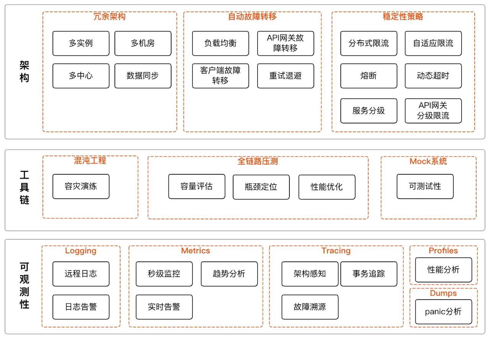

# 架构案例

程序员技能图谱：[https://github.com/TeamStuQ/skill-map](https://github.com/TeamStuQ/skill-map)

程序员技能图谱是由极客邦科技 [Geekbang](https://www.geekbang.org/) 发起的一个技术社区开源项目，志在汇集、整理、共建泛IT技术领域
（人工智能，前端开发，移动开发，云计算，大数据，架构，运维，安全，后端开发，测试，智能硬件等）及互联网产品、运营等领域学习技能图谱，
帮助程序员梳理知识框架结构，并尝试提供路径指导和精华资源，方便技术人学习成长。

## 技术峰会

- infoq [https://www.infoq.cn/archives](https://www.infoq.cn/archives)
- qcon,全球软件开发大会 [https://qcon.infoq.cn](https://qcon.infoq.cn)

## 网络资源大全
《伯乐在线提供以下资源》
- Java资源大全中文版 [https://github.com/jobbole/awesome-java-cn](https://github.com/jobbole/awesome-java-cn)
- Go资源大全中文版 [https://github.com/jobbole/awesome-go-cn](https://github.com/jobbole/awesome-go-cn)
- MySQL 资源大全中文版 [https://github.com/jobbole/awesome-mysql-cn](https://github.com/jobbole/awesome-mysql-cn)
- Python 资源大全中文版 [https://github.com/jobbole/awesome-python-cn](https://github.com/jobbole/awesome-python-cn)
- Python 技术书 [https://github.com/jobbole/awesome-python-books](https://github.com/jobbole/awesome-python-books)
- 面试题大全 [https://github.com/jobbole/architect-awesome](https://github.com/jobbole/architect-awesome)
- 机器学习资源大全中文版 [https://github.com/jobbole/awesome-machine-learning-cn](https://github.com/jobbole/awesome-machine-learning-cn)
- 系统管理员资源大全中文版 [https://github.com/jobbole/awesome-sysadmin-cn](https://github.com/jobbole/awesome-sysadmin-cn)
- JavaScript 资源大全中文版 [https://github.com/jobbole/awesome-javascript-cn](https://github.com/jobbole/awesome-javascript-cn)
- 经典编程书籍大全 [https://github.com/jobbole/awesome-programming-books](https://github.com/jobbole/awesome-programming-books)

## 架构案例
- 互联网公司经典技术架构 [https://github.com/davideuler/architecture.of.internet-product](https://github.com/davideuler/architecture.of.internet-product)
- 大厂技术面试题目[https://github.com/0voice/interview_internal_reference](https://github.com/0voice/interview_internal_reference) 
- QQ音乐高可用架构体系 [https://mp.weixin.qq.com/s/G00cwGYAr6l2Px6-DiwXLA](https://mp.weixin.qq.com/s/G00cwGYAr6l2Px6-DiwXLA)
- 腾讯财付通会计核算系统原理与架构 [https://mp.weixin.qq.com/s/j88jXaY6HXw6MYlIj0ThyA](https://mp.weixin.qq.com/s/j88jXaY6HXw6MYlIj0ThyA)
  

## 事故

- 记一次SSL握手导致业务线程阻塞的案例分析 [https://heapdump.cn/article/5250641](https://heapdump.cn/article/5250641)
- 线程池bug导致系统卡顿 [https://mp.weixin.qq.com/s/-ff7Enr4AMUDi8MR1LQqzw](https://mp.weixin.qq.com/s/-ff7Enr4AMUDi8MR1LQqzw)

## 故事
- 七十年编程语言发展漫谈 [https://mp.weixin.qq.com/s/4MD4b673b1kkBGhYINSoNQ](https://mp.weixin.qq.com/s/4MD4b673b1kkBGhYINSoNQ)
