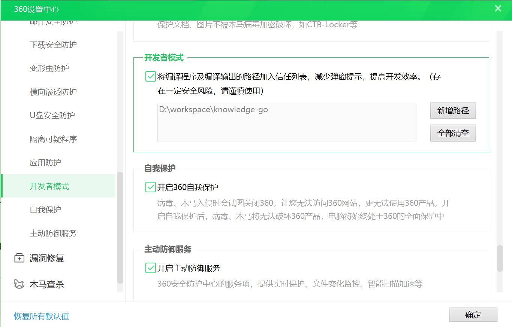
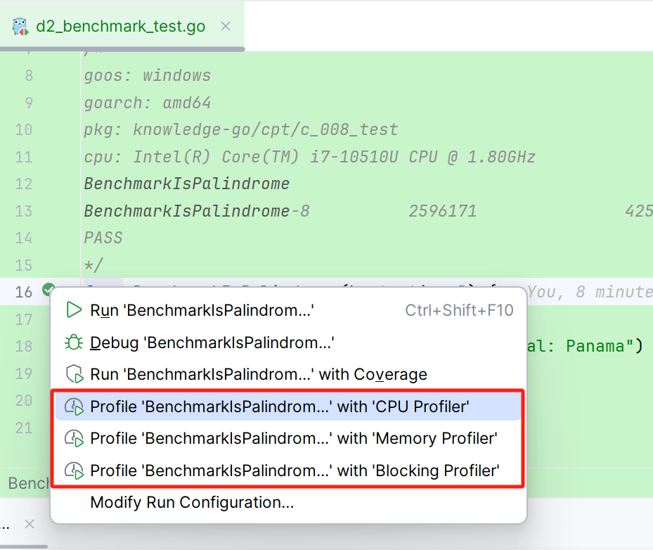
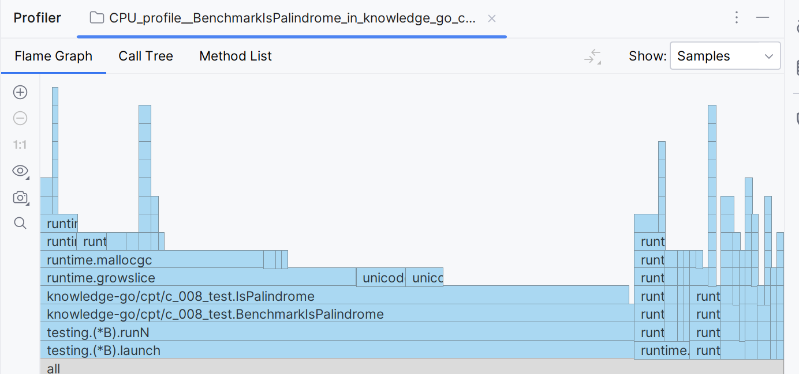
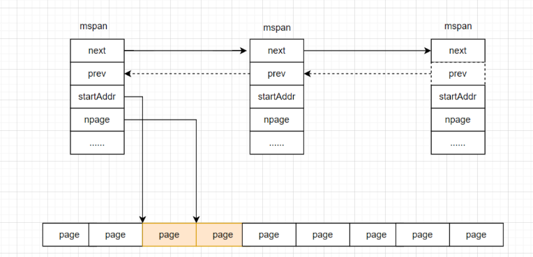

# golang

## 1.教程
- 官网：[https://pkg.go.dev/](https://pkg.go.dev/)

基础教程
- golang中文网【可以在线执行代码】[https://tour.go-zh.org/list](https://tour.go-zh.org/list)
- [Go语言圣经（中文版）](https://books.studygolang.com/gopl-zh/)
- [简单教程](https://www.runoob.com/go/go-tutorial.html)
- [Go 语言编程之旅：一起用 Go 做项目](https://golang2.eddycjy.com/)

高级教程
- [学习参考博客](https://www.liwenzhou.com/posts/Go/golang-menu/)
- [案例](https://www.cnblogs.com/zhanchenjin/category/2166310.html?page=1)

实现原理：
- Go 语言设计与实现[https://draveness.me/golang/](https://draveness.me/golang/)
- golang 内存模型[https://go.dev/ref/mem](https://go.dev/ref/mem)
- [接口实现原理](https://blog.csdn.net/Sheena997/article/details/129556912)

## 2.介绍

1.Go 是一个开源的编程语言，它能让构造简单、可靠且高效的软件变得容易。【没有继承、多态，没有复杂设计思想，没有复杂设计模式】

2.Go 语言特色
- 简洁、快速、安全
- 并行、有趣、开源
- 内存管理、数组安全、编译迅速

3.Go 语言用途
   
Go语言被设计成一门应用于搭载 Web 服务器，存储集群或类似用途的巨型中央服务器的系统编程语言。
对于高性能分布式系统领域而言，Go语言无疑比大多数其它语言有着更高的开发效率。
它提供了海量并行的支持，这对于游戏服务端的开发而言是再好不过了。

## 3.安装
- window：安装即可，自动配置环境变量：GOROOT=c:/go/
- 为了开发方便增加环境变量：GOPATH=C:/go/workspace/(开发项目的工作空间)

Linux安装
```shell
## 下载解压即可
cd /data/golang
wget https://go.dev/dl/go1.20.linux-amd64.tar.gz
tar -zxvf go1.20.linux-amd64.tar.gz
mv go go1.20
mkdir workspace

## 配置环境变量
vim /etc/profile
export GOROOT=/data/golang/go1.20
export GOPATH=/data/golang/workspace
export GOBIN=$GOROOT/bin
export PATH=$PATH:$GOBIN

source /etc/profile

## 验证环境
go version
go env
```

## 4.使用

### 4.1.命令集
golang 提供了一整套工具箱：下载、格式化、构建、测试和安装等工具，通过go命令可以查看有哪些命令
```shell
C:\Users\zhangxue>go
Go is a tool for managing Go source code.
Usage:
        go <command> [arguments]
The commands are:
        bug         start a bug report
        build       compile packages and dependencies
        clean       remove object files and cached files
        doc         # 查看文档：Go语言中的文档注释一般是完整的句子，第一行通常是摘要说明，以被注释者的名字开头
        env         print Go environment information
        fix         update packages to use new APIs
        fmt         gofmt (reformat) package sources
        generate    generate Go files by processing source
        get         # 可以下载一个单一的包或者用...下载整个子目录里面的每个包
        install     compile and install packages and dependencies
        list        # 可以查询可用包的信息
        mod         module maintenance
        work        workspace maintenance
        run         compile and run Go program
        test        test packages
        tool        run specified go tool
        version     print Go version
        vet         report likely mistakes in packages
Use "go help <command>" for more information about a command.
Additional help topics:
        buildconstraint build constraints
        buildmode       build modes
        c               calling between Go and C
        cache           build and test caching
        environment     environment variables
        filetype        file types
        go.mod          the go.mod file
        gopath          GOPATH environment variable
        gopath-get      legacy GOPATH go get
        goproxy         module proxy protocol
        importpath      import path syntax
        modules         modules, module versions, and more
        module-get      module-aware go get
        module-auth     module authentication using go.sum
        packages        package lists and patterns
        private         configuration for downloading non-public code
        testflag        testing flags
        testfunc        testing functions
        vcs             controlling version control with GOVCS
Use "go help <topic>" for more information about that topic.
```

### 4.2.环境变量
使用命令查看全部环境变量
```shell
go env

set GO111MODULE=on
set GOARCH=amd64
set GOBIN=
set GOCACHE=C:\Users\zhangxue\AppData\Local\go-build
set GOENV=C:\Users\zhangxue\AppData\Roaming\go\env
set GOEXE=.exe
set GOEXPERIMENT=
set GOFLAGS=
set GOHOSTARCH=amd64
set GOHOSTOS=windows
set GOINSECURE=
set GOMODCACHE=D:\workspace\knowledge-go\pkg\mod
set GONOPROXY=
set GONOSUMDB=
set GOOS=windows
set GOPATH=D:\workspace\knowledge-go;D:\workspace\knowledge-go\src
set GOPRIVATE=
set GOPROXY=https://goproxy.cn,direct
set GOROOT=D:\Program Files\go\go1.19.2
set GOSUMDB=sum.golang.org
set GOTMPDIR=
set GOTOOLDIR=D:\Program Files\go\go1.19.2\pkg\tool\windows_amd64
set GOVCS=
set GOVERSION=go1.19.2
set GCCGO=gccgo
set GOAMD64=v1
set AR=ar
set CC=gcc
set CXX=g++
set CGO_ENABLED=1
set GOMOD=D:\workspace\knowledge-go\src\go.mod
set GOWORK=
set CGO_CFLAGS=-g -O2
set CGO_CPPFLAGS=
set CGO_CXXFLAGS=-g -O2
set CGO_FFLAGS=-g -O2
set CGO_LDFLAGS=-g -O2
set PKG_CONFIG=pkg-config
set GOGCCFLAGS=-m64 -mthreads -fno-caret-diagnostics -Qunused-arguments -Wl,--no-gc-sections -fmessage-length=0 -fdebug-prefix-map=C:\Users\zhangxue\AppData\Local\Temp\go-build2436557959=/tmp/go-build -gno-record-gcc-switches
```

- GOPATH：每个项目都有自己的工作空间，对于golang的项目只需要配置GOPATH的环境变量就可以运行。
```shell
export GOPATH=D:\workspace\my-prjects
```

- GOROOT：用来指定Go的安装目录，还有它自带的标准库包的位置
```shell
export GOROOT=D:\Program Files\go\go1.19.2
```

- GOOS：设置目标操作系统（例如android、linux、darwin或windows）。默认为本系统。

### 4.3.工程结构
当前主流的项目结构,包括bin、pkg、src三个根目录为如下
```text
# 下载代码
go get gopl.io/...

GOPATH/
    src/         源码：一个GOPATH工作区的src目录中可能有多个独立的版本控制系统
        gopl.io/
            .git/
            ch1/
                helloworld/
                    main.go
                dup/
                    main.go
        golang.org/x/net/
            .git/
            html/
                parse.go
                node.go
                ...
    bin/        bin子目录用于保存编译后的可执行程序
        helloworld
        dup
    pkg/        pkg子目录用于保存编译后的包的目标文件,y
        darwin_amd64/
```

### 4.4.360报警

window系统使用golang编译后生成exe文件，因为没有数字签名，被判断为不安全应用，会报警并移除文件。
可以在360里：360设置中心->安全防护中心->开发者模式，设置忽略某个文件、或者文件夹。



## 5.依赖管理

Go1.14版本之后，推荐使用go mod模式来管理依赖了，也不再强制我们把代码必须写在GOPATH下面的src目录了，你可以在你电脑的任意位置编写go代码

```shell
# 1. 初始化go mod：新建的项目，在根目录下执行，自动创建一个go.mod文件，其中包含项目名称和当前使用的Go版本
go mod init <module-name>

# 2.在go.mod文件中添加依赖，自动下载需要的资源，并将依赖配置增加到go.mod文件中。
go get <dependency>

# 3.构建和运行您的项目：
go build

# 4.更新依赖项：这将更新您的依赖项到最新版本。
go get -u

# 5. 删除项目中未使用的依赖项（用go mod tidy 处理冲突的包）
go mod tidy

# 6. 这将列出所有当前使用的依赖项及其版本信息
go list -m all

# 7.清理依赖关系缓存：
go clean -modcache

# 8. 使用私有存储库：如果您使用的是私有存储库，您可以使用以下命令来进行身份验证：
go env -w GOPRIVATE=<repository-url>
将<repository-url>替换为您的私有存储库URL
```

和Java中使用maven一样，go也是有自己的库的仓库，但是地址在国外访问很慢，可以设置为国内的代理
```shell
默认GoPROXY配置是：GOPROXY=https://proxy.golang.org,direct，

由于国内访问不到，所以我们需要换一个PROXY，这里推荐使用https://goproxy.io 或 https://goproxy.cn。

命令如下：go env -w GOPROXY=https://goproxy.cn,direct
```

## 6.测试

### 6.1.单元测试

[GoLand 运行选定的测试或测试文件夹](https://www.javatiku.cn/feed/atom/goland/2653.html)

以 _test.go 为后缀名的源文件在执行 go build 时不会被构建成包的一部分。
分为三种类型的函数：
- 测试函数:以Test为函数名前缀的函数，用于功能测试，go test命令会调用这些测试函数并报告测试结果是PASS或FAIL
- 基准测试函数：以Benchmark为函数名前缀的函数，用于性能测试，go test命令会多次运行基准测试函数以计算一个平均的执行时间
- 示例函数：以Example为函数名前缀的函数，提供一个由编译器保证正确性的示例文档

go test命令会遍历所有的*_test.go文件中符合上述命名规则的函数，生成一个临时的main包用于调用相应的测试函数，
接着构建并运行、报告测试结果，最后清理测试中生成的临时文件。

```shell
## -v可用于打印每个测试函数的名字和运行时间
go test -v

## -run对应一个正则表达式，只有测试函数名被它正确匹配的测试函数才会被go test测试命令运行
go test -v -run="TestFail"

## 单元测试覆盖率，使用coverprofile
go tool cover  -html=c.out

## 基准测试
# -benchmem命令行标志参数将在报告中包含内存的分配数据统计
go test -bench=. -benchmem
```

性能观察：使用goland观察本地代码性能，可以使用Profiler功能，目前为单独分离的三个功能



profiler包括火焰图、函数调用链、过程涉及的方法列表



工具实现:本质是调用了golang提供的工具
```shell
$ go test -cpuprofile=cpu.out
$ go test -memprofile=mem.out
$ go test -blockprofile=block.out
```

### 6.2.性能测试

go-wrk： [https://github.com/adjust/go-wrk](https://github.com/adjust/go-wrk)

使用命令：
```shell
go-wrk -c=400 -t=8 -d=30 -n=100000 http://localhost:8080/index.html

-c=100：最大连接数
-t=1：  线程数
-n=100000：总请求次数
-d=30   执行30s
-H=“用户代理：go wrk 0.1 bechmark\n内容类型：text/html；”：发送的http标头以'\n'分隔
-k=true：如果禁用保留生存
-i=false：如果禁用TLS安全检查
-m=“GET”：http请求方法
-b=“”http请求主体
-s=“”如果指定，则统计搜索字符串s包含在响应中的频率
```

有很多工具可以代替，所以这个工具已经多年没有更新了

## 7.性能分析

[Golang性能调优(go-torch, go tool pprof)](https://cloud.tencent.com/developer/article/1096382)

- [Golang程序性能分析（一）pprof和go-torch](https://zhuanlan.zhihu.com/p/299246195)
- [Golang程序性能分析（二）在Echo和Gin框架中使用](https://zhuanlan.zhihu.com/p/313297045)
- [Golang程序性能分析（三）用pprof分析gRPC服务的性能](https://zhuanlan.zhihu.com/p/325878313)

实际项目中，多数情况是本地开发时或者优化代码的时候会使用pprof，go-torch用处很大但不好用，所以很多时候使用开发工具自带的profiler工具。

### 7.1.pprof

golang内置了性能分析工具：pprof， 在程序运行过程中，可以记录程序的运行信息，可以是CPU使用情况、内存使用情况、goroutine运行情况等

使用pprof有多种方式，Go已经现成封装好了1个：net/http/pprof，使用简单的几行命令，就可以开启pprof，记录运行信息，并且提供了Web服务，能够通过浏览器和命令行2种方式获取运行数据。


使用方式1：浏览器打开http://localhost:6060/debug/pprof/

```golang
package main
import (
    "fmt"
    "net/http"
    _ "net/http/pprof"
)
func main() {
    // 开启pprof，监听请求
    ip := "0.0.0.0:6060"
    if err := http.ListenAndServe(ip, nil); err != nil {
        fmt.Printf("start pprof failed on %s\n", ip)
    }
}
```

- allocs：程序启动之后内存分配的情况
- block：导致阻塞操作的一些堆栈跟踪信息
- cmdline：当前程序启动的命令行
- goroutine：所有goroutine的信息，下面的full goroutine stack dump是输出所有goroutine的调用栈，是goroutine的debug=2，后面会详细介绍。
- heap：程序在当前堆上内存分配的情况
- mutex：锁的信息
- profile: CPU profile文件。可以在 debug/pprof?seconds=x秒 GET 参数中指定持续时间。获取pprof文件后，使用 go tool pprof x.prof命令分析pprof文件。
- threadcreate：线程信息
- Trace：当前系统的代码执行的链路情况

方式2：使用命令行，执行以下命令后会进入命令行模式，可以输入命令对进行进行分析
```shell
go tool pprof http://localhost:6060/debug/pprof/allocs
go tool pprof http://localhost:6060/debug/pprof/block
go tool pprof http://localhost:6060/debug/pprof/goroutine
go tool pprof http://localhost:6060/debug/pprof/heap
go tool pprof http://localhost:6060/debug/pprof/mutex
go tool pprof http://localhost:6060/debug/pprof/threadcreate
# cpu profile分析，默认从当前开始收集30s的cpu使用情况，需要等待30s。
go tool pprof http://localhost:6060/debug/pprof/profile                  # 30-second CPU profile
go tool pprof http://localhost:6060/debug/pprof/profile?seconds=120      # wait 120s

# 如果需要下载对应的图片，只需要在后面添加png即可，例如获取heap的图片
go tool pprof -png http://localhost:6060/debug/pprof/heap > heap.png
```

使用命令行的方式并不需要服务开启pprof。所以使用的时候会更加灵活。

### 7.2.性能分析

使用go tool pprof后，会进去一个命令行模式，可以输入命令对进行进行分析。以上几种命令都支持这种模式，且内部命令相同。

以下是几个常用的命令：

> 1.topN  查看CPU最耗时的几个函数。 

```shell
(pprof) top10
130ms of 360ms total (36.11%)
Showing top 10 nodes out of 180 (cum >= 10ms)
      flat  flat%   sum%        cum   cum%
      20ms  5.56%  5.56%      100ms 27.78%  encoding/json.(*decodeState).object
      20ms  5.56% 11.11%       20ms  5.56%  runtime.(*mspan).refillAllocCache
```

> 2.list+正则表达式。 用于分析函数性能，列出函数代码以及对应的取样数据

```shell
(pprof) list podFitsOnNode
Total: 120ms
ROUTINE ======================== k8s.io/kubernetes/plugin/pkg/scheduler.podFitsOnNode in /home/cizixs/go/src/k8s.io/kubernetes/_output/local/go/src/k8s.io/kubernetes/plugin/pkg/scheduler/generic_scheduler.go
         0       20ms (flat, cum) 16.67% of Total
         .          .    230:
         .          .    231:// Checks whether node with a given name and NodeInfo satisfies all predicateFuncs.
         .          .    232:func podFitsOnNode(pod *api.Pod, meta interface{}, info *schedulercache.NodeInfo, predicateFuncs map[string]algorithm.FitPredicate) (bool, []algorithm.PredicateFailureReason, error) {
         .          .    233:    var failedPredicates []algorithm.PredicateFailureReason
         .          .    234:    for _, predicate := range predicateFuncs {
         .       20ms    235:        fit, reasons, err := predicate(pod, meta, info)
         .          .    236:        if err != nil {
         .          .    237:            err := fmt.Errorf("SchedulerPredicates failed due to %v, which is unexpected.", err)
         .          .    238:            return false, []algorithm.PredicateFailureReason{}, err
         .          .    239:        }
```

> 3.web 自动生成一个 svg 文件。并跳转到浏览器打开，生成了一个函数调用图（这个功能需要安装graphviz后才能使用）

> 4.traces 显示所有 goroutine 的调用栈。

> 5.base。这个不也是内部命令，而是工具的命令，可以对比两次heap文件的变化。

```shell
以1文件作为基准，对比1和2文件heap的不同
go tool pprof -base 1.pb.gz 2.pb.gz
```

### 7.3.go-torch

uber开源的工具，可以读取 pprof 的 profiling 数据，并生成一个火焰图的 svg 文件。

```shell
go-torch -u http://localhost:6060 -t 30
```

### 7.4.内存泄漏排查
- [golang 内存泄漏分析案例](https://www.cnblogs.com/zhanchenjin/p/17101573.html)
- [golang 内存泄漏总结](https://www.cnblogs.com/zhanchenjin/p/17098100.html)

### 7.5.监控

golang提供的监控和性能分析工具，远不能提供全方面的监控能力，所以需要结合第三方工具实现。方式如下：
1. SDK：嵌入到

## 8.内存模型与分配机制

[Golang 内存模型与分配机制](https://blog.csdn.net/m0_46198325/article/details/138142862)

### 8.1.内存结构
golang应用启动后，会直接申请一块内存，将其分割为三部分：spans、bitmap、arean。
1. arean。堆内存，内部包括mspan 和 page
   - page。最小的存储单元，堆内存继续分割，每个page 8kb。
   - mspan。最小的管理单元，一个mspan管理多个page，根据可以分配对象的大小，从 8B 到 80 KB 被划分为 67 种不同的规格。
2. spans。存储mspan的指针，用于管理堆内存。
3. bitmqp。用于GC

mspan 与 page 的关系



#### 8.1.1.mspan
mspan的特点；
1. 每个 mspan 管理多个page，mspan之间管理的page数量是不同的。
2. 每个 mspan 根据管理page的数量及面向分配对象的大小，会被划分为67个不同的规格。
3. 同等级的 mspan 会从属同一个 mcentral，最终会被组织成链表，因此带有前后指针（prev、next）
   也就是说堆内存中有67条存储mspan的链表。
4. 由于同等级的 mspan 内聚于同一个 mcentral，所以会基于同一把互斥锁管理
5. mspan 会基于 bitMap 辅助快速找到空闲内存块（块大小为对应等级下的 object 大小），此时需要使用到 Ctz64 算法


mspan源码：runtime/mheap.go
```golang
type mspan struct {
    // 标识前后节点的指针 
    next *mspan     
    prev *mspan    
    // ...
    // 起始地址
    startAddr uintptr 
    // 包含几页，页是连续的
    npages    uintptr 


    // 标识此前的位置都已被占用 
    freeindex uintptr
    // 最多可以存放多少个 object
    nelems uintptr // number of object in the span.
	allocBits *gcBits //分配位图， 每一位代表一个块是否已分配
	allocCount uint16 // 已分配块的个数
    // bitmap 每个 bit 对应一个 object 块，标识该块是否已被占用
    allocCache uint64
    // ...
    // 标识 mspan 等级，包含 class 和 noscan 两部分信息
    spanclass             spanClass   
    elemsize uintptr // class表中的对象大小， 也即块大小
    // ...
}
```

mspan的规格。以下为66种，还有一种隐藏的 0 级，用于处理超大对象
```shell
   规格   分配对象大小  mspan大小    分配对象数量
// class  bytes/obj  bytes/span  objects  waste bytes
//     1          8        8192     1024            0
//     2         16        8192      512            0
//     3         32        8192      256            0
//     4         48        8192      170           32
//     5         64        8192      128            0
//     6         80        8192      102           32
//     7         96        8192       85           32
//     8        112        8192       73           16
//     9        128        8192       64            0
//    10        144        8192       56          128
//    11        160        8192       51           32
//    12        176        8192       46           96
//    13        192        8192       42          128
//    14        208        8192       39           80
//    15        224        8192       36          128
//    16        240        8192       34           32
//    17        256        8192       32            0
//    18        288        8192       28          128
//    19        320        8192       25          192
//    20        352        8192       23           96
//    21        384        8192       21          128
//    22        416        8192       19          288
//    23        448        8192       18          128
//    24        480        8192       17           32
//    25        512        8192       16            0
//    26        576        8192       14          128
//    27        640        8192       12          512
//    28        704        8192       11          448
//    29        768        8192       10          512
//    30        896        8192        9          128
//    31       1024        8192        8            0
//    32       1152        8192        7          128
//    33       1280        8192        6          512
//    34       1408       16384       11          896
//    35       1536        8192        5          512
//    36       1792       16384        9          256
//    37       2048        8192        4            0
//    38       2304       16384        7          256
//    39       2688        8192        3          128
//    40       3072       24576        8            0
//    41       3200       16384        5          384
//    42       3456       24576        7          384
//    43       4096        8192        2            0
//    44       4864       24576        5          256
//    45       5376       16384        3          256
//    46       6144       24576        4            0
//    47       6528       32768        5          128
//    48       6784       40960        6          256
//    49       6912       49152        7          768
//    50       8192        8192        1            0
//    51       9472       57344        6          512
//    52       9728       49152        5          512
//    53      10240       40960        4            0
//    54      10880       32768        3          128
//    55      12288       24576        2            0
//    56      13568       40960        3          256
//    57      14336       57344        4            0
//    58      16384       16384        1            0
//    59      18432       73728        4            0
//    60      19072       57344        3          128
//    61      20480       40960        2            0
//    62      21760       65536        3          256
//    63      24576       24576        1            0
//    64      27264       81920        3          128
//    65      28672       57344        2            0
//    66      32768       32768        1            0
```

### 8.2.内存模型
根据数据存储的位置不同，分为三个部分。
1. 栈内存。以栈帧为单元，用于存储函数的参数、返回值、局部变量等
2. 堆内存。用于运行时动态分配对象的存储空间。
3. 全局数据区。存储全局变量，用于应用整个生命周期

### 8.3.内存分配器
内存分配器有三种。
- mcache：线程私有cache，可以实现无锁分配内存，内存结构也是mspan。作用类似于Java的TLAB
- mcentral：中央内存，是已经从系统申请成功的内存。因为该区域内存是线程共享的，所以分配内存需要加锁。
    golang内部将此区域按照分配对象大小划分成67种规格的mspan，同规格mspan形成链路，链表内部使用同一个锁。
- mheap：全局内存，直接管理page，内存不足时向系统申请，访问要加全局锁。

#### 8.3.1.mcache
1. 线程私有内存，线程创建时，golang为了防止分配内存时锁竞争，提升内存分配效率。mcache 内部拥有每种规格的span各2个。也就是67*2=134个mspan。
2. mcache内部有一个微对象分配器 tiny allocator。专门协助线程从mcache中分配小于16B大小的对象。
3. mcache并非不会变的，如果内存不足的时候，会可以向上级内存申请新的mspan。这点与Java不同。

mcache 源码： runtime/mcache.go
```golang
const numSpanClasses = 136
type mcache struct {
    // 微对象分配器相关
    tiny       uintptr
    tinyoffset uintptr
    tinyAllocs uintptr
    
    // mcache 中缓存的 mspan，每种 spanClass 各一个
    alloc [numSpanClasses]*mspan 
    // ...
}
```

#### 8.3.2.mcentral
- 管理已经从系统申请成功的内存，是线程共享区域，所以分配内存时需要加锁。
- 根据管理mspan规格不同，会有67个mcentral，每个mcentral管理一个规格的mspan，每个mcentral都只有一把锁。


mcentral 源码：runtime/mcache.go
```golang
type mcentral struct {
    // 对应的 spanClass
    spanclass spanClass
    // 有空位的 mspan 集合，数组长度为 2 是用于抗一轮 GC
    partial [2]spanSet 
    // 无空位的 mspan 集合
    full    [2]spanSet 
}
```

#### 8.3.3.mheap
堆内存真正的管理工具。管理page，存储mspan 和mcentral。内存不够时，向操作系统申请，申请单位为 heapArena（64M）

mheap源码： runtime/mheap.go
```golang
type mheap struct {
    // 堆的全局锁
    lock mutex

    // 空闲页分配器，底层是多棵 基数 树组 成的索引，每棵树对应 16 GB 内存空间
    pages pageAlloc 

    // 记录了所有的 mspan. 需要知道，所有 mspan 都是经由 mheap，使用连续空闲页组装生成的
    allspans []*mspan

    // heapAreana 记录所有page 到 mspan 的映射关系。
    // heapAreana 数组，64 位系统下，二维数组容量为 [1][2^22]
    // 每个 heapArena 大小 64M，因此理论上，Golang 堆上限为 2^22*64M = 256T
    arenas [1 << arenaL1Bits]*[1 << arenaL2Bits]*heapArena

    // ...
    // 记录所有mcentral，共67个
    central [numSpanClasses]struct {
        mcentral mcentral
        // 用于内存地址对齐
        pad      [cpu.CacheLinePadSize - unsafe.Sizeof(mcentral{})%cpu.CacheLinePadSize]byte
    }
    // ...
}
```

### 8.4.内存分配流程

1. 计算需要分配对象的大小。
2. 小于16B且不包含指针的对象Tiny分配，包含指针的对象从mcache分配。
3. 不符合2的先从mcache分配。在 mspan 中，基于 Ctz64 算法，根据 mspan.allocCache 的 bitMap 信息快速检索到空闲的 object 块
4. 当 mspan 无可用的 object 内存块时，会步入 mcache.nextFree 方法进行兜底。
   - 如果是 mcache 内存不足，则向mcentral申请新的mspan。
   - mcentral根据需求的规格，分配一个空闲的mspan给线程。
   - 如果mcentral中找不到该规格的mspan，则会向mheap申请新的mspan。
   - mheap向系统申请内存。

### 8.5.内存优化建议

首先看下哪些对象会分配到堆上？
- 堆上的指针只能指向堆上的对象
- interface、chan、map所持有或转化为interface的对象都会在堆上
- 函数内返回指针类型的，指针指向的对象会逃逸到堆上。
- string类型一定在堆上
- 切片扩容和拷贝

原则上，减少GC就是减少在堆上分配对象。
- 切片和map知道大小的，预先分配足够的大小，避免扩容。
- 尽量少生成string，使用切片的方式复用string。
- 少用反射，被反射的对象都会分配到堆上。
- 使用sync.Pool复用对象，避免重复生产销毁对象。
- 尽量让chan传递较小的对象，所有chan传递的对象都会分配到堆上。

## 9.垃圾回收

golang是高级计算机语言，可以自动实现heap的自动垃圾回收。

- 官网解释垃圾回收[A Guide to the Go Garbage Collector](https://tip.golang.org/doc/gc-guide)
- [浅析GO语言的垃圾回收机制](https://www.jb51.net/jiaoben/291317pny.htm)
- [图解Golang的GC垃圾回收算法](https://www.jb51.net/article/157744.htm)

### 9.1.触发条件

1. 手动执行。调用 runtime.GC()
2. 系统触发。
   1. gcTriggerHeap ：堆内存的分配达到达控制器计算的触发堆大小；
   2. gcTriggerTime ：如果一定时间内没有触发，就会触发新的循环，该出发条件由 runtime.forcegcperiod 变量控制，默认为 2 分钟；
   3. gcTriggerCycle：如果当前没有开启垃圾收集，则触发新的循环；
   4. runtime.gcpercent 是触发垃圾收集的内存增长百分比，默认情况下为 100，即堆内存相比上次垃圾收集增长 100% 时应该触发 GC，并行的垃圾收集器会在到达该目标前完成垃圾收集。

```golang
package main

import (
	"log"
	"runtime"
	"time"
)

var lastTotalFreed uint64
var intMap map[int]int
var cnt = 8192

func printMemStats() {
	log.Println("###################")
	var m runtime.MemStats
	runtime.ReadMemStats(&m)
	log.Printf("Alloc = %v TotalAlloc=%v Just Freed = %v Sys = %v NumGc=%v\n",
		m.Alloc/1024, m.TotalAlloc/1024, ((m.TotalAlloc-m.Alloc)-lastTotalFreed)/1024, m.Sys/1024, m.NumGC)
	lastTotalFreed = m.TotalAlloc - m.Alloc
}

func initMap() {
	intMap = make(map[int]int, cnt)

	for i := 0; i < cnt; i++ {
		intMap[i] = i
	}
}

func main() {
	// 打印内存分配信息
	printMemStats()

	// 1.分配内存后，手动执行GC
	initMap()
	runtime.GC()
	// 1.打印内存分配信息
	printMemStats()

	// 2.删除数据，手动执行GC
	log.Println(len(intMap))
	for i := 0; i < cnt; i++ {
		delete(intMap, i)
	}
	log.Println(len(intMap))
	runtime.GC()
	// 2.打印内存分配信息
	printMemStats()

	// 3.置空对象，等待2分钟自动gc
	intMap = nil
	for {
		time.Sleep(1 * time.Minute)
		printMemStats()
	}
}
```

```shell
2024/06/24 21:29:55 ###################   刚进入main方法
2024/06/24 21:29:55 Alloc = 185 TotalAlloc=185 Just Freed = 0 Sys = 10416 NumGc=0
2024/06/24 21:29:55 ###################   1.分配内存后有455KB
2024/06/24 21:29:55 Alloc = 455 TotalAlloc=505 Just Freed = 50 Sys = 10736 NumGc=1
2024/06/24 21:29:55 8192
2024/06/24 21:29:55 0
2024/06/24 21:29:55 ###################   2.删除数据后，手动回收，还是455KB，因为intMap数组还在被强引用
2024/06/24 21:29:55 Alloc = 455 TotalAlloc=507 Just Freed = 1 Sys = 10800 NumGc=2
2024/06/24 21:30:55 ###################   
2024/06/24 21:30:55 Alloc = 456 TotalAlloc=508 Just Freed = 0 Sys = 10800 NumGc=2
2024/06/24 21:31:55 ###################   3.对象=null,强制将强引用去掉，2分钟后自动回收了，剩余内存144KB。
2024/06/24 21:31:55 Alloc = 144 TotalAlloc=510 Just Freed = 313 Sys = 10800 NumGc=3

```

### 9.2.GC root
GC root 是GC扫描阶段第一个需要拿到的数据，根据GC root 进行可达性分析，采用三色标记法对存活对象进行标记。

主要分为三部分。
1. 全局变量：程序在编译期就能确定的那些存在于程序整个生命周期的变量。
2. 执行栈：每个 goroutine 都包含自己的执行栈，这些执行栈上包含栈上的变量及指向分配的堆内存区块的指针。
3. 寄存器：寄存器的值可能表示一个指针，参与计算的这些指针可能指向某些赋值器分配的堆内存区块。

### 9.3.垃圾回收算法
golang的垃圾回收器没有名字。通过下面分析，golang的GC发展也才刚刚开始，很多细节处理的还不够好，性能也一般。
- 垃圾回收算法 使用的是 标记清除算法（mark sweep）
- 对象存活算法 使用的是 可达性分析法

- v1.3以前，只有STW。实际项目根本无法使用，STW时间太久。
- v1.3 Mark STW, Sweep 并行。标记阶段STW，降低了STW时间。
- v1.5 增加三色标记法，增加了并发标记阶段。
- v1.8 写屏障。防止漏标，降低了重新标记阶段的扫描量。

写屏障，作用与GC 并发标记阶段开启，作用如下：
1. 可以标记指针发生变化的对象。预先标记为可达，防止漏标导致对象误删。
2. 新创建的对象，标记为可达，本轮GC不回收。

辅助GC(Mutatos Assist)：
在GC执行过程中，为了防止内存分配过快，如果goroutine需要分配内存，那么这个goroutine会参与一部分GC的工作，即帮助GC做一部分工作。

### 9.4.参数调优

[GoLand GC(垃圾回收机制)简介及调优](https://blog.csdn.net/qq_42824983/article/details/134089165)

GOGC 决定了 GC CPU 和内存之间的权衡。不可能两边兼顾。

1. 参数调优只有一个参数：GOGC。垃圾回收器的触发阈值，当已分配的内存达到 Target heap memory 的一定百分比时，垃圾回收将被触发，默认值是100。也就是100%
2. Go 的 runtime/debug 包提供了一些用于调试、诊断和管理 Go 程序的功能。允许开发者控制内存管理、运行时参数以及获取当前运行时的一些状态信息
```golang
package main

import (
	"fmt"
	"runtime"
	"runtime/debug"
)

func main() {
	// 设置gc频率： 30s 一次
	debug.SetGCPercent(30)

	// 强制gc 将尽可能多的内存返回给操作系统
	debug.FreeOSMemory()

	// 设置最大堆大小, 2G
	debug.SetMaxStack(1024 * 1024 * 2)

	// 设置最大线程数：控制并发执行的最大 OS 线程数，主要用于限制并发线程的数量。
	debug.SetMaxThreads(12)

	//控制 Go 可以并行使用的最大逻辑处理器数量(不是物理核)，影响 goroutines 的调度和并行执行。
	runtime.GOMAXPROCS(runtime.NumCPU())
	fmt.Println("cpu num:", runtime.NumCPU())
}

```

### 9.5.查看gc日志

GODEBUG变量可以控制运行时内的调试变量，设置gctrace=1 后使得垃圾收集器向标准错误流发出 GC 运行信息，以此来观察程序的 GC 运行情况。

```shell
# GODEBUG=gctrace=1 go run debug.go

# 第一部分：gc
gc 1 @0.049s 0%: 0.016+0.26+0.015 ms clock, 0.19+0.13/0.33/0.18+0.19 ms cpu, 4->4->0 MB, 5 MB goal, 12 P
gc 2 @0.816s 0%: 0.11+0.39+0.003 ms clock, 1.3+0.19/0.65/0.62+0.037 ms cpu, 4->4->0 MB, 5 MB goal, 12 P
gc 3 @0.824s 0%: 0.15+0.33+0.002 ms clock, 1.8+0/0.39/0.51+0.024 ms cpu, 4->4->0 MB, 5 MB goal, 12 P

# 第二部分：清除
scvg: 0 MB released
scvg: inuse: 3, idle: 60, sys: 63, released: 59, consumed: 4 (MB)
scvg: inuse: 1, idle: 61, sys: 63, released: 59, consumed: 4 (MB)
scvg: inuse: 2, idle: 61, sys: 63, released: 59, consumed: 3 (MB)
scvg: inuse: 2, idle: 61, sys: 63, released: 59, consumed: 3 (MB)
```

1. GC部分结构
   - gc#：GC 执行次数的编号，每次叠加。
   - @#s：自程序启动后到当前的具体秒数。
   - #%：自程序启动以来在 GC 中花费的时间百分比。
   - #+…+#：GC 的标记工作共使用的 CPU 时间占总 CPU 时间的百分比。
   - #->#-># MB：分别表示 GC 启动时, GC 结束时, GC 活动时的堆大小.
   - #MB goal：下一次触发 GC 的内存占用阈值。
   - #P：当前使用的处理器 P 的数量
2. 清除部分结构
   - scvg# ：Scavenging 执行次数的编号，每次在清除时递增。
   - inuse: #：正在占用的内存大小，单位均为 MB。
   - idle: # ：等待被清理的内存大小。
   - sys: #：从系统映射的内存大小。
   - released: #：已经释放的系统内存大小。
   - consumed: #：已经从系统所申请分配的内存大小。