# 2.Django

## 1.介绍

教程：https://www.runoob.com/django/django-tutorial.html

代码案例：https://gitee.com/luckSnow/django_demo/tree/master/

- Python下有许多款不同的 Web 框架。Django是重量级选手中最有代表性的一位。许多成功的网站和APP都基于 Django。
- Django是一个开放源代码的Web应用框架，由Python写成。
- Django遵守BSD版权，初次发布于2005年7月, 并于2008年9月发布了第一个正式版本1.0 。
- Django采用了MVC的软件设计模式，即模型M，视图V和控制器C。

### 1.1.1. web框架介绍

具体介绍Django之前，必须先介绍WEB框架等概念。

web框架：别人已经设定好的一个web网站模板，你学习它的规则，然后“填空”或“修改”成你自己需要的样子。

一般web框架的架构是这样的：

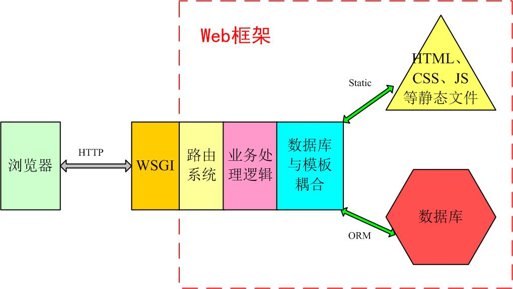


其它基于python的web框架，如tornado、flask、webpy都是在这个范围内进行增删裁剪的。
例如tornado用的是自己的异步非阻塞“wsgi”，flask则只提供了最精简和基本的框架。
Django则是直接使用了WSGI，并实现了大部分功能。

### 1.2.2. MVC/MTV介绍

MVC百度百科：全名Model View Controller，是模型(model)－视图(view)－控制器(controller)的缩写，一种软件设计典范，
用一种业务逻辑、数据、界面显示分离的方法组织代码，将业务逻辑聚集到一个部件里面，在改进和个性化定制界面及用户交互的同时，
不需要重新编写业务逻辑。

通俗解释：一种文件的组织和管理形式！不要被缩写吓到了，这其实就是把不同类型的文件放到不同的目录下的一种方法，然后取了个高大上的名字。当然，它带来的好处有很多，比如前后端分离，松耦合等等，就不详细说明了。

- 模型(model)：定义数据库相关的内容，一般放在models.py文件中。
- 视图(view)：定义HTML等静态网页文件相关，也就是那些html、css、js等前端的东西。
- 控制器(controller)：定义业务逻辑相关，就是你的主要代码。

MTV:有些WEB框架觉得MVC的字面意思很别扭，就给它改了一下。view不再是HTML相关，而是主业务逻辑了，相当于控制器。
html被放在Templates中，称作模板，于是MVC就变成了MTV。这其实就是一个文字游戏，和MVC本质上是一样的，换了个名字和叫法而已，换汤不换药。

### 1.3.3.Django的MTV模型组织

目录分开，就必须有机制将他们在内里进行耦合。在Django中，urls、orm、static、settings等起着重要的作用。一个典型的业务流程是如下图所示：

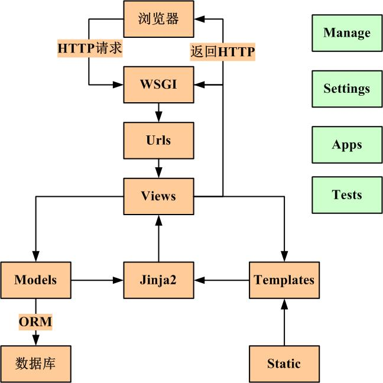

那么我们学Django学的是什么？

1. 目录结构规范
2. urls路由方式
3. settings配置
4.ORM操作
5. jinja2模板渲染
6.其它

## 2.项目实例

### 2.1.程序安装

python3.5、pip3及pycharm专业版自行安装。pycharm不要使用免费版，它不支持Django。

这里只介绍较为简单的pip3命令安装方式。自动安装Pypi提供的最新版本。
```shell
pip3 install django
```

安装完成后如下图所示：

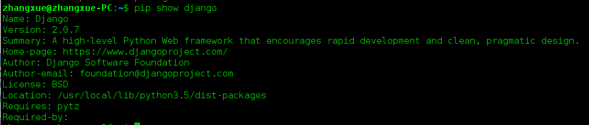

### 2.2.创建django项目

在linux等命令行界面下，使用django提供的命令和vim也能进行项目开发。但是，这里推荐使用pycharm这个目前最好的python开发IDE，它功能强大，界面友好。（下面所有的操作都在pycharm中进行。）

点击：file-->new project，出现下面的对话框。

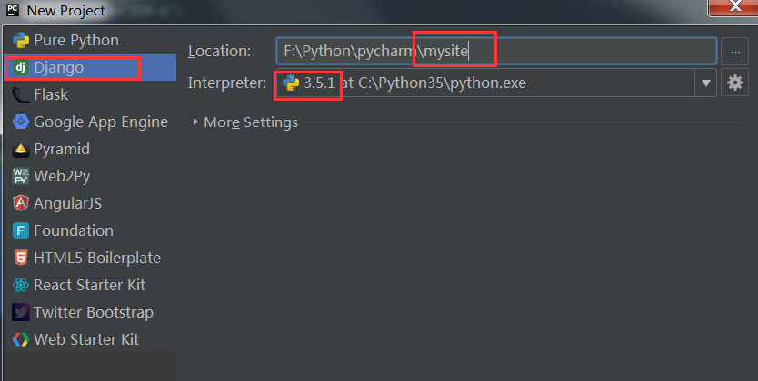

选择Django栏目，输入项目名称，这里采用国际惯例的mysite。选择python解释器版本，点击create创建。

Django将自动生成下面的目录结构：

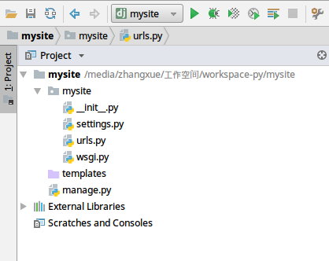

与项目同名的目录中是配置文件，templates目录是html文件存放也就是MTV中的T。manage.py是django项目管理文件。
- settings.py 主配置文件（比如数据库配置，请求的中间件等等）
- urls.py URL路由文件
- wsgi.py 网络通信借口
- templates HTML模板文件
- manage.py django 管理主程序

### 2.3.创建一个应用

在每个django项目中可以包含多个APP，相当于一个大型项目中的分系统、子模块、功能部件等等，相互之间比较独立，但也有联系。

所有的APP共享项目资源。

pycharm下方的terminal终端中输入命令：

python manage.py startapp appOne

这样就创建了一个叫做cmdb的APP，django自动生成“appOne”文件夹。

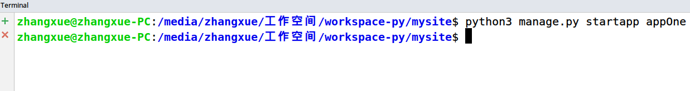

刷新项目后，目录如下

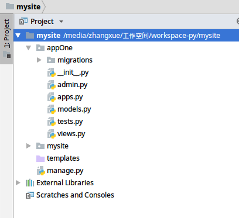


### 2.4. 编写路由

路由都在urls文件里，它将浏览器输入的url映射到相应的业务处理逻辑。

简单的urls编写方法如下图：

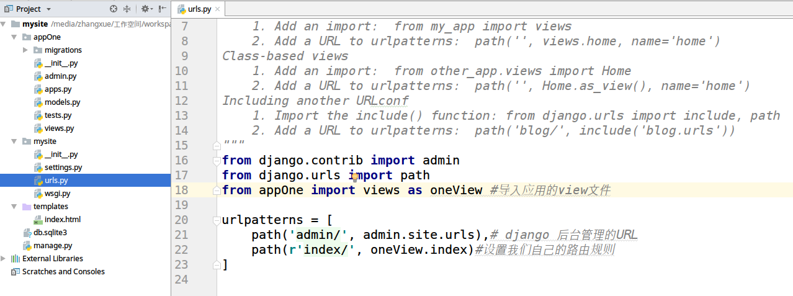

### 2.5. 编写业务处理逻辑

业务处理逻辑都在views.py文件里。

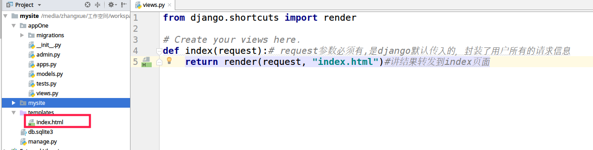

通过上面两个步骤，我们将index这个url指向了views里的index（）函数，它接收用户请求，相应到对应的页面上。

### 2.6. 运行web服务

现在我们已经可以将web服务运行起来了。

命令行的方式是：python manage.py runserver 127.0.0.1:8000

但在pycharm中，你可以这么干：

在上部工具栏中找到下面图示的图标。

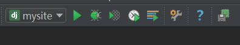

点击下拉箭头

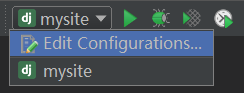

点击edit configurations


在host中填入：127.0.0.1 　　port中填入：8000

OK确定之后，点击绿色的三角，web服务就运行起来了。

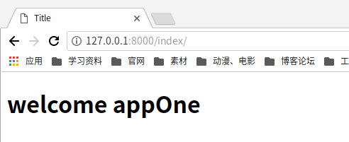

## 3.请求的处理

### 3.1.http请求

```python
## 1. 跳转到页面
def demo1(request):
  return render(request, 'demo1.html')

## 2. 向页面返回数据
def demo2(request):
    context = {}
    context['hello'] = 'demo2'
    return render(request, 'demo2.html', context)

## 3. 向页面返回多种数据
def demo3(request):
    context = {}
    context['text'] = '1234567890'
    context['user'] = {'id': 1, 'name': '张三', 'sex': 3}
    context['list'] = ['AAA', 'BBB', 'CCC', 'DDD']
    context['pub_date'] = datetime.datetime.now()
    return render(request, 'demo3.html', context)

## 4. 响应ajax
def demo4(request):
  return render(request, 'demo4.html')

def demo4_ajax(request):
  return HttpResponse(json.dumps({'id': 1, 'name': '张三', 'sex': 3}),
                      content_type='application/json;charset=UTF-8')

## 5. 接受页面的传值
def demo5(request):
  return render(request, 'demo5.html')

def demo5_form(request):
  context = {}
  if request.method == "POST":
    name = request.POST.get("name", None)
    print(name)
    context["msg"] = "提交成功"
  else:
    context["msg"] = "提交失败"
    return render(request, 'demo5.html', context)
```

注意：当我们使用post请求的时候。会报错，因为django有一个跨站请求保护机制，我们在settings文件中将它关闭。

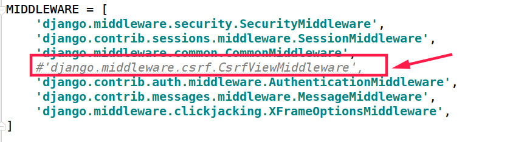

### 3.2.Django内置对象

Django使用最多的请求处理方式

from django.shortcuts import render 处理请求

from django.shortcuts import redirect 将请求重定向

from django.shortcuts import HttpResponse 对请求相应数据

#### 3.2.1.render

方法如下：
```python
render(request, template_name, context=None, content_type=None, status=None, using=None)
```

```text
request 由django自动封装的对象，保存用户的请求。
template_name 响应的页面
context 请求响应的对象。是个map
content_type 响应数据的类型，比如，json/application;charset=utf-8
status 状态码，比如404,500等
Using 不知道干嘛的
```

使用方式：
```python
def index(request):# request参数必须有,是django默认传入的，封装了用户所有的请求信息
  return render(request, "index.html")
```

#### 3.2.2.redirect

```python
def redirect(to, *args, permanent=False, **kwargs)
```

主要的参数是 to, 指的是重定向到某个页面。比如 to : ‘/index.html’

#### 3.2.3.HttpResponse
```python
HttpResponse继承至HttpResponseBase。
(self, content_type=None, status=None, reason=None, charset=None)
```

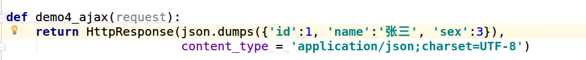

## 4.四、静态文件处理

### 4.1.HTML文件

1.配置HTML模板的存放位置

为了让django知道我们的html文件在哪里，需要修改settings文件的相应内容。但默认情况下，它正好适用，你无需修改。正Template目录下的文件都不能被URL直接访问到，必须请求views中的方法才能响应这个文件。


### 4.2.静态文件

我们已经可以将html文件返还给用户了，但是还不够，前端三大块，html、css、js还有各种插件，它们齐全才是一个完整

的页面。在django中，一般将静态文件放在static目录中。接下来，在mysite中新建个static目录。

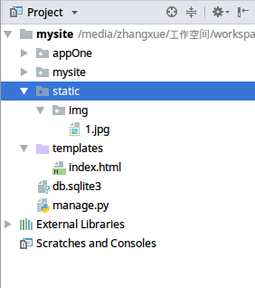

你的CSS,JS和Image都可以放置在这个目录里。

为了让django找到这个目录，依然需要对settings进行配置：

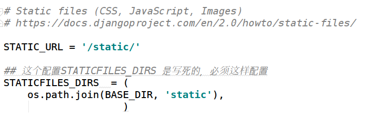

直接访问：[http://127.0.0.1:8000/static/img/1.jpg，显示图片](http://127.0.0.1:8000/static/img/1.jpg，显示图片)

页面使用方式一：

```html

{# 加载静态文件方式二，加载static，动态拼接url #}

<script src=""></script>
```


## 5.Django模板 

django采用jinja2语言编写动态模板，jinja2会根据提供的数据，替换掉html中的相应部分。

比如下面的代码，后端转发大量的数据到模板上，这些数据需要我们去处理。

```python
def demo3(request):
    context = {}
    context['text'] = '1234567890'
    context['user'] = {'id': 1, 'name': '张三', 'sex': 3}
    context['list'] = ['AAA', 'BBB', 'CCC', 'DDD']
    context['pub_date'] = datetime.datetime.now()
    return render(request, 'demo3.html', context)
```

### 5.1.注释

1. {# 这是单行注释 #}
2. 
这是多行注释


### 5.2.2. if判断

1. if 语句，if 标签接受 and ， or 或者 not 关键字来对多个变量做判断，或者对变量取反（ not ),这是单行注释


```html

    id: {{ user.id }}<br/>
    name: {{ user.name }}<br/>
    sex:
        
            男
        
            女
        
            未知
        

```


### 5.3.for 语句

```html
<ul>
    
        <li>{{ item }}</li>
    
</ul>


{#  for循环反转遍历  #}
<ul>
    
        <li>{{ item }}</li>
    
</ul>
```

### 5.4.ifequal/ifnotequal


 标签比较两个值，当他们相等时，显示在  和  之中所有的值。

```html
111<br>
222<br>
333<br>
444<br>
555<br>
666<br>
```


### 5.5.过滤器

模板过滤器可以在变量被显示前修改它，过滤器使用管道字符，其实就是调用一些内置的方法

过滤管道可以被* 套接*，既是说，一个过滤器管道的输出又可以作为下一个管道的输入

```text
大写-->小写{{ 'AAA'|lower }}<br>
小写-->大写{{ 'aaa'|upper }}<br>
多个过滤器管道(last最后一个/first第一个){{ list|last|lower }}<br>
list前2个元素{{ list|truncatewords:2 }}<br>
单词之间必须空格隔开,后面的省略{{ "显 示 前 5 个 单词"|truncatewords:"5" }}<br>
字符串的长度{{ text|length }}<br>
list的长度{{ list|length }}<br>
添加反斜杠到任何反斜杠、单引号或者双引号前面{{"\\a\\\\b\\\\\\c"|addslashes }}<br>
按指定的格式字符串参数格式化 date 或者 datetime 对象{{pub_date|date:"Y-m-d" }}<br>
```

### 5.6.include 包含其它的模板的内容




## 6.数据库操作

上面我们虽然和用户交互得很好，但并没有保存任何数据，页面一旦关闭，或服务器重启，一切都将回到原始状态。

### 6.1.注册应用

使用数据库是毫无疑问的，django通过自带的ORM框架操作数据库，并且自带轻量级的sqlite3数据库。下面我们来看一看：

首先是注册app：在settings.py中增加一行

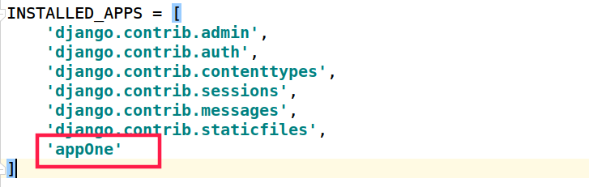

不注册它，你的数据库就不知道该给哪个app创建表（我们不建议使用创建表的功能）。

### 6.2.配置数据库

然后我们在settings中，配置数据库相关的参数，如果使用自带的sqlite，不需要修改。
```python
DATABASES = {
    # 'default': {
    #     'ENGINE': 'django.db.backends.sqlite3', #指定想要使用的数据库类型
    #     'NAME': os.path.join(BASE_DIR, 'db.sqlite3'),
    # }

    # 数据库迁移
    # python3不支持MySQLdb，可用pymysql代替。cmd安装pymysql：pip3 install pymysql。
    # 在项目文件夹mysite下的_init_.py添加如下代码即可。
    #   import pymysql
    #   pymysql.install_as_MySQLdb()

    'default': {
        'ENGINE': 'django.db.backends.mysql',   # 数据库引擎
        'NAME': 'django_db',       # 你要存储数据的库名，事先要创建之
        'USER': 'root',         # 数据库用户名
        'PASSWORD': '4100107223',     # 密码
        'HOST': 'localhost',    # 主机
        'PORT': '3306',         # 数据库使用的端口
        'OPTIONS':{'init_command': 'SELECT 1 FROM DUAL'}
    }
}
```

### 6.3.编写实体类

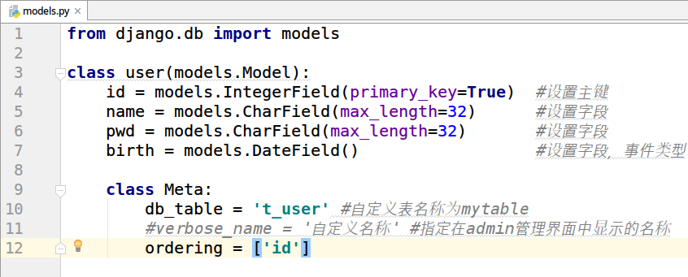

### 6.4.生产数据库表

然后在Terminal中执行数据库迁移命令： 和 python manage.py migrate

1.执行命令： python3 manage.py makemigrations

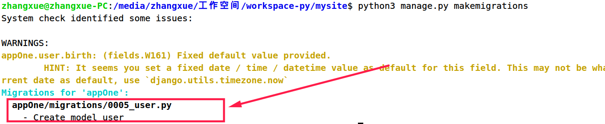

2. python3 manage.py migrate

这个命令是创建表

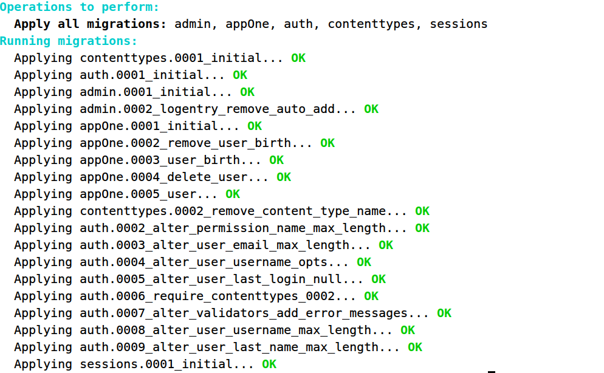

### 6.5.编写业务

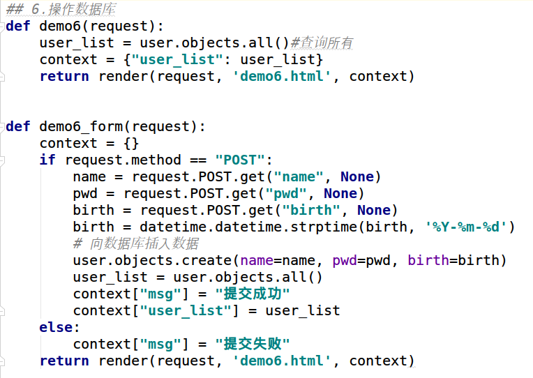

### 6.6.编写页面

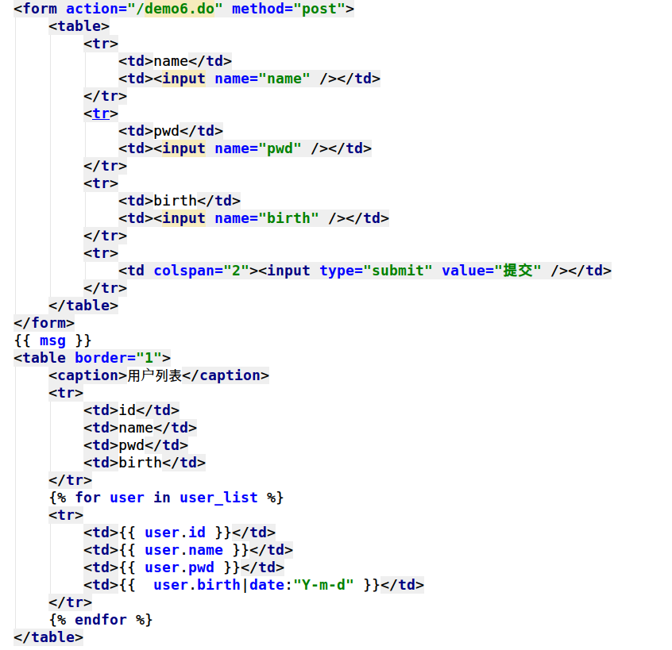

### 6.7.启动项目

重启web服务后，刷新浏览器页面，之后和用户交互的数据都能保存到数据库中。任何时候都可以从数据库中读取数据，展示到页面上。

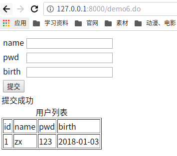

## 7.总结

作为python必须web框架的Django，它的功能强大，内容全面，但同时也意味着限制颇多，灵活性低，可修改性差，这就是鱼和熊掌不可兼得了。
我们学习Django，其实就是学习一个软件，要理解它的基本原理，把握它整体框架，牢记一些基本规则，剩下的就是不断深入细节，
然后熟能生巧、经验多少的问题了，不存在多高深的不可掌握技术。

关于学习方法的建议：学习任何东西，不要直接扎入细节，应该先了解它的外围知识，看看它的整体架构，再学习它的基本内容，然后才是深入学习，打磨技巧！
