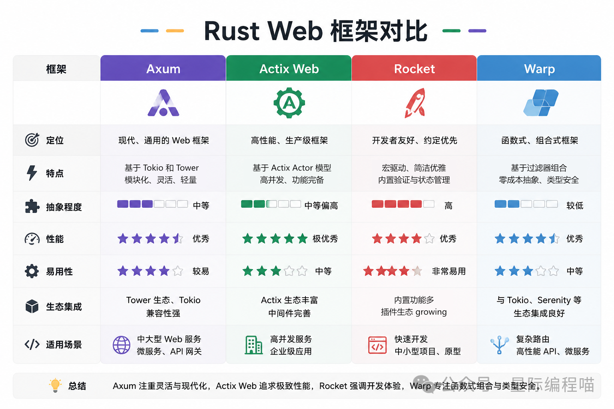

# 其他语言

## Lua

### 1.引言
Lua 是一种强大的、高效的、轻量级的、可嵌入的脚本语言。它支持过程（procedural）编程、面向对象编程、函数式编程以及数据描述。
Lua 是动态类型的，运行速度快，支持自动内存管理，因此被广泛用于配置、脚本编写等场景。

Lua 是一个小巧的脚本语言。是巴西里约热内卢天主教大学（Pontifical Catholic University of Rio de Janeiro）里的一个研究小组，
由Roberto Ierusalimschy、Waldemar Celes 和 Luiz Henrique de Figueiredo所组成并于1993年开发。
其设计目的是为了嵌入应用程序中，从而为应用程序提供灵活的扩展和定制功能。Lua由标准C编写而成，几乎在所有操作系统和平台上都可以编译，运行。
Lua并没有提供强大的库，这是由它的定位决定的。所以Lua不适合作为开发独立应用程序的语言。Lua 有一个同时进行的JIT项目，提供在特定平台上的即时编译功能。
Lua脚本可以很容易的被C/C++ 代码调用，也可以反过来调用C/C++的函数，这使得Lua在应用程序中可以被广泛应用。不仅仅作为扩展脚本，
也可以作为普通的配置文件，代替XML,ini等文件格式，并且更容易理解和维护。 Lua由标准C编写而成，代码简洁优美，几乎在所有操作系统和平台上都可以编译，运行。
一个完整的Lua解释器不过200k，在目前所有脚本引擎中，Lua的速度是最快的。这一切都决定了Lua是作为嵌入式脚本的最佳选择。

### 2.特性
- 轻量级：Lua 是一种小巧的语言。它的解释器完全用 C 语言编写，可以方便地嵌入到其他应用程序中。
- 可扩展：Lua 提供了一系列扩展机制，例如元表（metatable）和元方法（metamethod）等。
- 动态类型：Lua 是动态类型语言，不需要在声明变量时指定其类型。
- 内存管理：Lua 有自己的垃圾回收机制，可以自动管理内存，防止内存泄漏。

### 3.使用场景

- 游戏开发：Lua 是许多游戏开发者的首选脚本语言。例如，"World of Warcraft" 和 "Angry Birds" 这样的游戏就使用了 Lua 脚本。
- 嵌入式系统：Lua 轻量级的特性使其在嵌入式系统中得到了广泛应用。
- Web开发：通过 Lua 的 web 框架，如 OpenResty、Lapis 等，开发者可以快速构建高性能的 web 应用。
- 配置管理：许多应用程序使用 Lua 作为配置语言。

### 4.使用Lua脚本的好处
1. 减少网络开销：可以将多个请求通过脚本的形式一次发送，减少网络时延和请求次数。
2. 原子性的操作：Redis会将整个脚本作为一个整体执行，中间不会被其他命令插入。因此在编写脚本的过程中无需担心会出现竞态条件，无需使用事务。
3. 代码复用：客户端发送的脚步会永久存在redis中，这样，其他客户端可以复用这一脚本来完成相同的逻辑。
4. 速度快：还有一个 JIT编译器可以显著地提高多数任务的性能; 对于那些仍然对性能不满意的人, 可以把关键部分使用C实现, 然后与其集成, 这样还可以享受其它方面的好处。
5. 可以移植：只要是有ANSI C 编译器的平台都可以编译，你可以看到它可以在几乎所有的平台上运行:从 Windows 到Linux，同样Mac平台也没问题, 再到移动平台. 游戏主机，甚至浏览器也可以完美使用 (翻译成JavaScript).
6. 源码小巧：20000行C代码，可以编译进182K的可执行文件，加载快，运行快。

### 5.安装&语法

- 官网： http://www.lua.org/
- 语法： http://www.runoob.com/lua/lua-tutorial.html
- [windows安装教程lua](https://blog.csdn.net/susu1083018911/article/details/125130070)

```text
系统可能自带了lua。一般都是高本版的。我们可以继续安装低版本的lua，多个版本可以共存

1.下载 ：
  wget http://luajit.org/download/LuaJIT-2.0.5.tar.gz
2.解压编译：
    tar -zxvf  LuaJIT-2.0.5.tar.gz
    cd LuaJIT-2.0.5
    make install
    
    安装成功的信息，我们可以看到安装的位置
    ==== Installing LuaJIT 2.0.5 to /usr/local ====
    mkdir -p /usr/local/bin /usr/local/lib /usr/local/include/luajit-2.0 /usr/local/share/man/man1 /usr/local/lib/pkgconfig /usr/local/share/luajit-2.0.5/jit /usr/local/share/lua/5.1 /usr/local/lib/lua/5.1
    cd src && install -m 0755 luajit /usr/local/bin/luajit-2.0.5
    cd src && test -f libluajit.a && install -m 0644 libluajit.a /usr/local/lib/libluajit-5.1.a || :
    rm -f /usr/local/bin/luajit /usr/local/lib/libluajit-5.1.so.2.0.5 /usr/local/lib/libluajit-5.1.so /usr/local/lib/libluajit-5.1.so.2
    cd src && test -f libluajit.so && \
      install -m 0755 libluajit.so /usr/local/lib/libluajit-5.1.so.2.0.5 && \
      ldconfig -n /usr/local/lib && \
      ln -sf libluajit-5.1.so.2.0.5 /usr/local/lib/libluajit-5.1.so && \
      ln -sf libluajit-5.1.so.2.0.5 /usr/local/lib/libluajit-5.1.so.2 || :
    cd etc && install -m 0644 luajit.1 /usr/local/share/man/man1
    cd etc && sed -e "s|^prefix=.*|prefix=/usr/local|" -e "s|^multilib=.*|multilib=lib|" luajit.pc > luajit.pc.tmp && \
      install -m 0644 luajit.pc.tmp /usr/local/lib/pkgconfig/luajit.pc && \
      rm -f luajit.pc.tmp
    cd src && install -m 0644 lua.h lualib.h lauxlib.h luaconf.h lua.hpp luajit.h /usr/local/include/luajit-2.0
    cd src/jit && install -m 0644 bc.lua v.lua dump.lua dis_x86.lua dis_x64.lua dis_arm.lua dis_ppc.lua dis_mips.lua dis_mipsel.lua bcsave.lua vmdef.lua /usr/local/share/luajit-2.0.5/jit
    ln -sf luajit-2.0.5 /usr/local/bin/luajit
    ==== Successfully installed LuaJIT 2.0.5 to /usr/local ====
    
3.环境变量
    vim /etc/profile
    
    export LUAJIT_LIB=/usr/local/lib
    export LUAJIT_INC=/usr/local/include/luajit-2.0
    
    soource    /etc/profile
    
4.查看版本： lua -v
    Lua 5.1.4  Copyright (C) 1994-2008 Lua.org, PUC-Rio
```

## erlang

- [Erlang语言简介](https://zhuanlan.zhihu.com/p/85734735)
- [世界上最低调的编程语言，高并发的王者，程序员翻身的秘密武器！](https://mp.weixin.qq.com/s/CRiae9vB1gC1pXzs1atADQ)

Erlang是一种通用的面向并发的编程语言，其创立者是Joe Armstrong，在1987年由瑞典电信设备制造商爱立信于主持开发。
Erlang的开发目的是创造一种可以应对大规模并发活动的编程语言和运行环境，从而简化交换机的开发工作，提高电话交换机的稳定性和可扩展性。

Erlang是一个结构化，动态类型编程语言，内建并行计算支持，非常适合于构建分布式，实时软并行计算系统。
使用Erlang编写出的应用运行时通常由成千上万个轻量级进程组成，并通过消息传递相互通讯。
Erlang使用用户态抢占式协作线程来完成Erlang进程的调度，这比起C程序的线程切换要高效得多得多了。

rabbitmq就是使用erlang实现的。

但是Erlang并不是主流的编程语音，主要原因是它的设计精巧，实现复杂，系统不利于修改。

## ruby

Ruby 是一种简单快捷的面向对象脚本语言，以优雅、简洁、易读著称。它常被用于 Web 开发（如 Ruby on Rails 框架）、自动化脚本、DevOps、命令行工具等领域。

Ruby 支持跨平台运行，包括 Windows、macOS、Linux 系统。推荐使用版本管理工具 rbenv 或 RVM 进行安装和管理。

安装
```shell
1. Windows 安装
访问官网：   https://rubyinstaller.org/
下载推荐的   Ruby+DevKit 安装包
安装时勾选添加到系统环境变量

2. Linux安装
git clone https://github.com/rbenv/rbenv.git ~/.rbenv
echo 'export PATH="$HOME/.rbenv/bin:$PATH"' >> ~/.bashrc
source ~/.bashrc
rbenv init

# 安装 ruby-build 插件
git clone https://github.com/rbenv/ruby-build.git ~/.rbenv/plugins/ruby-build

# 安装 Ruby
rbenv install 3.2.2
rbenv global 3.2.2
```


Ruby 常用命令
```shell
ruby -v	            查看 Ruby 版本
irb	                启动交互式 Ruby Shell
gem install xxx	    安装 gem 包
gem list	        查看已安装 gem
ruby script.rb	    执行 Ruby 脚本
```

推荐工具与框架
- Ruby on Rails：全栈 Web 开发框架
- Bundler：Ruby 包依赖管理工具
- Rake：任务管理工具，类似 Makefile
- Pry：交互式调试器，增强 IRB 功能

修改源：建议使用淘宝源
```shell
gem sources --remove https://rubygems.org/
gem sources -a https://gems.ruby-china.com/
gem sources -l
```

## rust

Rust是一种不需要GC的语言，常用于系统开发、网络服务、嵌入式开发、云计算等领域。尤其是其无GC性能接近原生，所以也常用于web、游戏等领域。

官网提供了大量的中文学习资源，非常友好。
- 官网:[https://rust-lang.org/zh-CN/](https://rust-lang.org/zh-CN/)
- 入门教程：[https://rust-lang.org/zh-CN/learn/get-started/](https://rust-lang.org/zh-CN/learn/get-started/)
- 基础教程:[https://rustwiki.org/zh-CN/rust-by-example/index.html](https://rustwiki.org/zh-CN/rust-by-example/index.html)
- 进阶教程《Rust 秘典》:[https://nomicon.purewhite.io/](https://nomicon.purewhite.io/)


特点:
1. 内存安全（无 GC 也能保证安全）：Rust 最核心的特性是通过所有权系统（Ownership）、借用检查器（Borrow Checker） 和生命周期（Lifetimes） 实现内存安全，且无需垃圾回收（GC）。
   - 所有权：每个值在 Rust 中都有一个唯一的所有者，当所有者离开作用域时，值会被自动释放（避免内存泄漏）。例如：let a=1, let b=a。这时a已经将引用的数据转移给b，a已经被回收，无法继续使用。
   - 借用规则：允许通过 &T（不可变引用）或 &mut T（可变引用）临时访问值，但严格限制：要么只能有一个可变引用，要么可以有多个不可变引用（彻底避免悬垂指针、数据竞争等内存错误）。
        也就是数据可以被引用或者借用，需要该数据需要实现Copy或者Clone。
   - 这些规则在编译期生效，不影响运行时性能，既保证了 C/C++ 级别的内存控制能力，又避免了手动管理内存的风险。
2. 高性能（接近 C/C++）。Rust 是编译型语言，直接编译为机器码，没有 GC 带来的运行时开销，也没有虚拟机（如 Java）的中间层，性能可与 C/C++ 媲美。
3. 并发安全（编译期阻止数据竞争）。Rust 的所有权模型天然适配并发场景，能在编译期阻止数据竞争。
4. 强大的类型系统与抽象能力。
   - 静态类型检查：编译期严格检查类型，提前发现错误（如类型不匹配、空指针使用等）。
   - Trait 系统：类似接口，但更灵活，支持静态分发（高性能）和动态分发（灵活性），可实现代码复用和多态。
   - 泛型：支持类型参数化（如 Vec<T>），既能保证类型安全，又能编写通用代码（如容器、算法）。
5. 模式匹配与枚举（处理复杂状态）。Rust 的 enum（枚举）和 match（模式匹配）功能异常强大，远超其他语言的简单枚举。
6. 完善的工具链与生态。官方提供管理和构建Cargo，库非常丰富，文档也友好。
7. 跨平台。与golang相似，直接编译成多平台直接运行的库。

### 1.安装

```shell
windows:  https://rust-lang.org/tools/install/

linux:    curl --proto '=https' --tlsv1.2 -sSf https://sh.rustup.rs | sh

安装过程提示如下：（默认安装就行）
1) Proceed with selected options (default - just press enter)
2) Customize installation
3) Cancel installation

info: profile set to 'default'
info: setting default host triple to x86_64-pc-windows-msvc
info: syncing channel updates for 'stable-x86_64-pc-windows-msvc'
info: latest update on 2025-09-18, rust version 1.90.0 (1159e78c4 2025-09-14)
info: downloading component 'cargo'
info: downloading component 'clippy'
info: downloading component 'rust-docs'
info: downloading component 'rust-std'
info: downloading component 'rustc'
info: downloading component 'rustfmt'
info: installing component 'cargo'
info: installing component 'clippy'
info: installing component 'rust-docs'
 20.5 MiB /  20.5 MiB (100 %)   2.5 MiB/s in 13s
info: installing component 'rust-std'
 20.7 MiB /  20.7 MiB (100 %)   8.5 MiB/s in  2s
info: installing component 'rustc'
 76.2 MiB /  76.2 MiB (100 %)   8.5 MiB/s in  9s
info: installing component 'rustfmt'
info: default toolchain set to 'stable-x86_64-pc-windows-msvc'

  stable-x86_64-pc-windows-msvc installed - rustc 1.90.0 (1159e78c4 2025-09-14)

Rust is installed now. Great!

To get started you may need to restart your current shell.
This would reload its PATH environment variable to include
Cargo's bin directory (%USERPROFILE%\.cargo\bin).
```

### 2.Cargo

通常使用cargo来包管理、构建工具。cargo常用命令如下：

```rust
cargo new 项目名称        创建项目
cargo init              初始化项目（创建项目结构）

cargo build             可以构建项目
cargo build --release   多环境构建
cargo run               可以运行项目
cargo test              可以测试项目
cargo clean             清空构建结果
cargo check             校验项目代码
cargo doc               可以为项目构建文档
cargo publish           可以将库发布到 crates.io。
cargo expand            需要使用cargo install cargo-expand先安装
cargo --version         查看版本
```

### 3.依赖管理

rust官方提供包管理平台。 [https://crates.io/](https://crates.io/)

便于cargo管理依赖。

国内网速差，可以使用：https://rsproxy.cn/作为代理 。

### 4.入门案例

使用命令常见一个项目：cargo new greplite

项目结构
```text
greplite
  src
    main.rs
  Cargo.toml    用来定义项目的依赖关系、版本号等信息。
  Cargo.lock
```

main.rs文件内容如下：
```rust
use std::env;
use std::fs::File;
use std::io::{self, BufRead, BufReader};

// cargo run -- main src/main.rs
fn main() -> io::Result<()> {
    let args = env::args().collect::<Vec<_>>();
    if args.len() < 3 {
        eprintln!("Usage: greplite <search_string> <file_path>");
        std::process::exit(1);
    }

    let search_string = &args[1];
    let file_path = &args[2];

    run(search_string, file_path)
}

fn run(search_string: &str, file_path: &str) -> io::Result<()> {
    let file = File::open(file_path)?;
    let reader = BufReader::new(file);

    for line in reader.lines() {
        let line = line?;
        if line.contains(search_string) {
            println!("{line}");
        }
    }

    Ok(())
}
```

### 5.web框架

Axum、Actix Web、Rocket、Warp


