# 1.前端基础

## 1.基础

### 1.1.HTML

- [HTML常用声明.txt](课件/1.html/HTML常用声明.txt)
- [HTML常用标签.txt](课件/1.html/HTML常用标签.txt)

### 1.2.JavaScript

- [1基础语法.txt](课件/2.JavaScript/1基础语法.txt)
- [2基本对象与BOM.txt](课件/2.JavaScript/2基本对象与BOM.txt)
- [3DOM与事件.txt](课件/2.JavaScript/3DOM与事件.txt)

### 1.3.Ajax

- [AJAX.txt](课件/3.ajax/AJAX.txt)
- [获取xmlhttpQequest对象.txt](课件/3.ajax/获取xmlhttpQequest对象.txt)

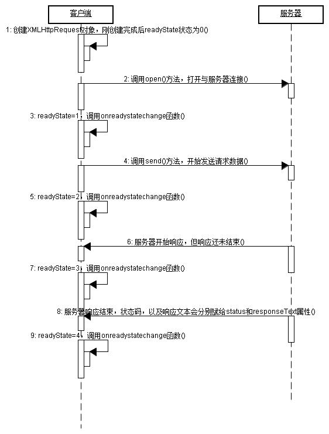

<div name="wordShowDiv" word-url="课件/./3.ajax/AJAX.docx"></div>

### 1.4.jQuery

- [1CSS风格选择器.txt](课件/4.jQuery/1CSS风格选择器.txt)
- [2对DOM访问，操作.txt](课件/4.jQuery/2对DOM访问，操作.txt)
- [3功能与事件.txt](课件/4.jQuery/3功能与事件.txt)
- [4动态效果.txt](课件/4.jQuery/4动态效果.txt)
- [5ajax.txt](课件/4.jQuery/5ajax.txt)
- [6json.txt](课件/4.jQuery/6json.txt)

### 1.5.前端模板

- [BUI前端框架模板.zip](模板/BUI前端框架模板.zip)
- [layui-admin.zip](模板/layui-admin.zip)
- [气象局项目原型.zip](模板/气象局项目原型.zip)

## 2.JavaScript库

为了调整困难且耗时的JavaScript高级程序设计而产生的；所有js框架都提供针对常见JavaScript任务的函数，包括动画、DOM 操作以及Ajax处理。

也就对JavaScript进行了高级封装，更像是一种新的语音。

### 2.1.vue

VueJS是一个渐进的JavaScript框架，用于开发交互式Web界面。聚焦更多的是视图，也就是前端部分。与其他项目和类库整合是非常容易的。
VueJS的安装非常简单，初学者可以轻松理解并开始构建自己的用户界面。内容分为不同的章节，包含相关的主题，简单而有用的例子。

- 官方中文网:[https://cn.vuejs.org/](https://cn.vuejs.org/)
- 简单教程： https://www.yiibai.com/vuejs/

Vue3项目搭建
- [手把手教你搭建基于 Vue3 的前端 UI 组件库 - 域名配置](https://mp.weixin.qq.com/s/wB1Q2o12MhzkcD40NGauSg)
- [手把手教你搭建基于 Vue3 的前端 UI 组件库 - 完工部署](https://mp.weixin.qq.com/s/Mspwx5IQRSO_8W4T6xf-mw)
- [手把手教你搭建基于 Vue3 的前端 UI 组件库 - 优化代码](https://mp.weixin.qq.com/s/O3ubHgnmAsVjO0DgW0_baA)
- [手把手教你搭建基于 Vue3 的前端 UI 组件库 - 完善](https://mp.weixin.qq.com/s/RNQNw3zSexgK6dLufyAJ1w)
- [手把手教你搭建基于 Vue3 的前端 UI 组件库 - 打包发布](https://mp.weixin.qq.com/s/I6W0uCdmZFLNFkc9dxESDw)

### 2.2.React

React 是市场上最大的前端 JavaScript 框架（完美的前端 Web 开发工具）之一，因其易用性和高性能而广受欢迎。
中文网[http://react.caibaojian.com.cn/](http://react.caibaojian.com.cn/)

### 2.3.Angular

Angular 使用一种称为 TypeScript 的脚本语言，与其他 JavaScript 框架相比，它更直观、更易于使用。但也是最复杂的。
中文网[https://angular.cn/](https://angular.cn/)

### 2.4.jQuery

中文网[https://www.jquery123.com/](https://www.jquery123.com/)

## 3.UI 类库

对常用的功能页面进行了封装，通常会提供vue、React、Angular、原生js等的支持。

### 3.1.EasyUI

easyui是一种基于jQuery、Angular、Vue和React的用户界面插件集合。 功能齐全、但是页面非常简约，适合做办公类的应用。
官网[https://www.jeasyui.net/](https://www.jeasyui.net/)

### 3.2.Bootstrap

支持多种语音，但是操作比较繁琐。中文网[https://www.bootcss.com/](https://www.bootcss.com/)

### 3.3.layui

Layui 是一套开源的 Web UI 组件库，采用自身轻量级模块化规范，遵循原生态的 HTML/CSS/JavaScript 开发模式，极易上手，拿来即用。 其风格简约，而内在丰盈，利于实现网页界面的快速构建。
国内做开源项目失败，已经转为完全的开源项目。
中文网[https://layui.github.io/](https://layui.github.io/)

### 3.4.ant design【UI设计器】
Ant Design 源自蚂蚁金服体验技术部的后台产品开发。是基于 Ant Design 设计体系的 React UI 组件库，主要用于研发企业级中后台产品。
中文网[https://ant.design/index-cn](https://ant.design/index-cn)

### 3.5.element ui【UI设计器】

是一套基于VUE2.0的桌面端组件库，ElementUI提供了丰富的组件帮助开发人员快速构建功能强大、风格统一的页面
中文网[https://element.eleme.cn/#/zh-CN](https://element.eleme.cn/#/zh-CN)

## 4.前端组件

### 4.1.图表
- highcharts： https://www.highcharts.com.cn/
- echarts： https://echarts.apache.org/zh/index.html

## 5.node.js

### 5.1.介绍
Node.js 就是运行在服务端的 JavaScript。
Node.js 是一个基于 Chrome JavaScript 运行时建立的一个平台。

官网： [https://nodejs.org/zh-cn/](https://nodejs.org/zh-cn/)

NPM是随同NodeJS一起安装的包管理工具，能解决NodeJS代码部署上的很多问题，常见的使用场景有以下几种：
- 允许用户从NPM服务器下载别人编写的第三方包到本地使用。
- 允许用户从NPM服务器下载并安装别人编写的命令行程序到本地使用。
- 允许用户将自己编写的包或命令行程序上传到NPM服务器供别人使用。

我们可能不会用到nodejs，但是npm是前端的重要的使用工具

```shell
npm install
npm run build ## 自定义后面的构建内容，命令会不同
npm config get registry #查看仓库地址
npm config set registry http://registry.npm.taobao.org/repository/npm-public # 切换阿里源
```

### 5.2.多版本管理
- nvm下载: [https://github.com/coreybutler/nvm-windows/releases](https://github.com/coreybutler/nvm-windows/releases)
- 安装教程：[http://www.manongjc.com/detail/26-nbmqbsbnrxxzspj.html](http://www.manongjc.com/detail/26-nbmqbsbnrxxzspj.html)

```shell
下载版本：nvm install 16
切换版本：nvm use 16
```

### 5.3.依赖引入流程

- npm install命令输入 > 
- 检查node_modules目录下是否存在指定的依赖 > 
- 如果已经存在则不必重新安装 > 
- 若不存在，继续下面的步骤 > 
- 向 registry（本地电脑的.npmrc文件里有对应的配置地址）查询模块压缩包的网址 > 
- 下载压缩包，存放到根目录里的.npm目录里 > 
- 解压压缩包到当前项目的node_modules目录中。

## 6.性能优化

[京东亿级体量微信小程序优化实践](https://mp.weixin.qq.com/s/jK2j281Ymo2vimY8DyL6pw)


## 经典的配色方案
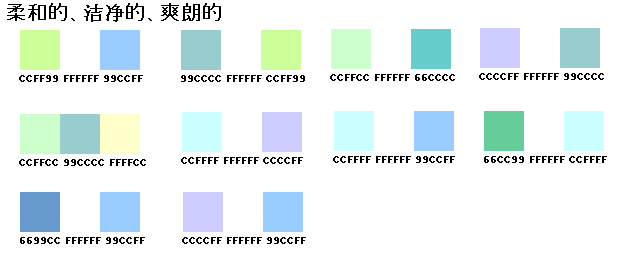
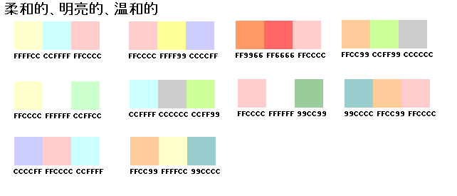
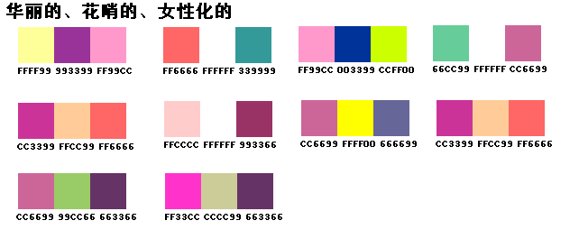
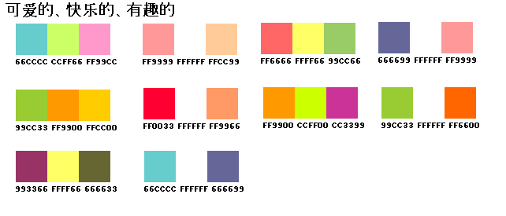
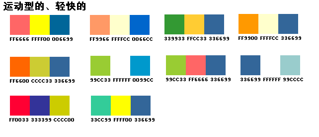
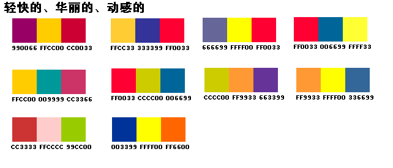
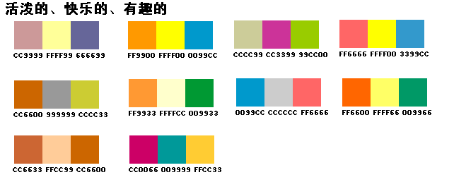
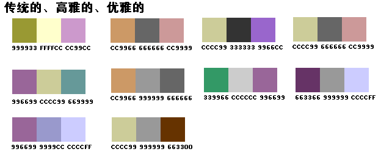
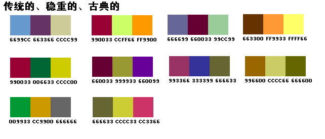
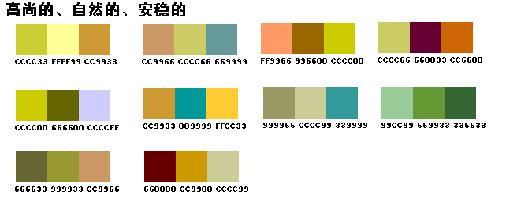
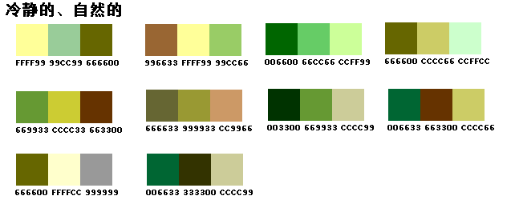
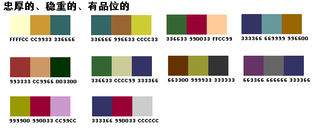
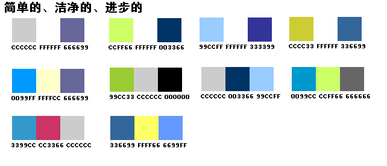
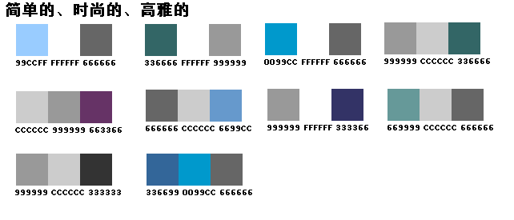
