# 1.Linux内核

- 基础教程：[https://www.runoob.com/linux/linux-tutorial.html](https://www.runoob.com/linux/linux-tutorial.html)
- Linux性能优化大师Brendan Gregg: [https://www.brendangregg.com/](https://www.brendangregg.com/)

## 1.基础

时间单元
- 1秒=1000毫秒,   单位/s
- 1毫秒=1000微秒, 单位/ms
- 1微秒=1000纳秒, 单位/us
- 1纳秒=1000皮秒, 单位/ns
- 1皮秒=1000飞秒
- 在C#中，1Ticks = 100纳秒

### 1.1.基本概念

- 协议：任何人都可以修改和发行，但是必须开放源码。
- 内核：系统中唯一有操作硬件权限的部分，协议只针对内核。
- 库: .so 共享对象，windows：dll 动态链接库
- 应用程序

### 1.2.linux基本原则

1. 由目的单一的小程序组成；组合小程序完成复杂任务；
2. 一切皆文件；
3. 尽量避免捕获用户接口；
4. 配置文件保存为纯文本格式；

其中第一条详细来讲就是系统中的所有都归结为一个文件，包括命令、硬件、软件设备、操作系统、进程、网络连接等等对于操作系统内核而言，
都被视为拥有各自特性或类型的文件。

### 1.3.多用户、多任务

Linux支持多用户，各个用户对于自己的文件设备有自己特殊的权利，保证了各用户之间互不影响。多任务则是现代电脑最主要的一个特点，
Linux可以使多个程序同时并独立地运行。

### 1.4.系统内核的路由转发

Linux操作系统嵌入了TCP/IP协议栈，协议软件具有路由转发功能。路由转发依赖作为路由器的主机中安装多块网卡，当某一块网卡接收到数据包后，
系统内核会根据数据包的目的IP地址，查询路由表，然后根据查询结果将数据包发送到另外一块网卡，最后通过此网卡把数据包发送出去。
此主机的处理过程就是路由器完成的核心功能。

### 1.6.Linux目录

```text
/bin: 可执行文件， 用户命令
/boot: 系统启动相关的文件，如内核、initrd，以及grub(bootloader)
/dev: 设备文件
    设备文件：
        块设备：随机访问，数据块
        字符设备：线性访问，按字符为单位
        设备号：主设备号（major）和次设备号（minor）
/etc：配置文件
/home：用户的家目录，每一个用户的家目录通常默认为/home/USERNAME
/root：管理员的家目录；
/lib：库文件
    静态库，  .a
    动态库， .dll， .so (shared object)
    /lib/modules：内核模块文件
/lib64
/media：挂载点目录，移动设备
/mnt：挂载点目录，额外的临时文件系统
/opt：可选目录，第三方程序的安装目录
/proc：伪文件系统，虚拟目录，内核映射文件
/sys：伪文件系统，跟硬件设备相关的属性映射文件
/tmp：临时文件， /var/tmp
/var：可变化的文件
/usr： usr 是 unix shared resources(共享资源) 的缩写，这是一个非常重要的目录，用户的很多应用程序和文件都放在这个目录下，类似于 windows 下的 program files 目录。
    /usr/bin： 系统用户使用的应用程序。
    /usr/sbin： 超级用户使用的比较高级的管理程序和系统守护程序。
    /usr/src： 内核源代码默认的放置目录。
/sbin：管理命令
```

绝对路径：以跟目录为起点到目标的路径。
相对路径：以当前目录为起点到目标的路径。

### 1.7.系统启动过程

- BIOS。当计算机打开电源后，首先是BIOS开机自检，按照BIOS中设置的启动设备（通常是硬盘）来启动。
- 内核的引导。/boot 目录下的内核程序
- 运行 init。init进程是系统所有进程的父进程，开启自启的进程一般放在这里。boot -> init进程
- 系统初始化。boot -> init进程 -> /etc/init.d
- 建立终端 。
- 用户登录系统。

### 1.8.文件描述符

在Linux下，一切都是基于文件的，网络通信使用的是socket，在Linux下也就基于socket文件。

- socket：就是两个服务器之间传输数据时，一端提供出口，一端提供入口。这个出入口就是socket，学名套接字，俗名插座
- fd：文件描述符。是linux管理文件的方式，是一个非负整数，可以理解为文件的索引。

下面使用mysql为例子：图中mysql的进程pid=2416。在/proc/2416是这个进程相关的内容。
fd是文件描述符，每当这个进程打开一个文件的时候，/proc/2416/fd目录下就会增加一个文件描述符。
我们从截图中可以看到，fd就是一个数字的文件，它指向对应的文件，比如socket、日志文件、数据库文件等

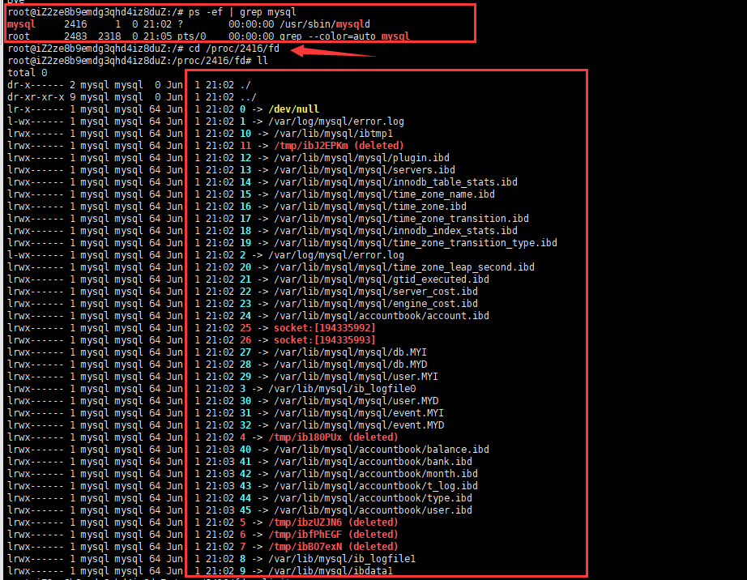

每个用户（不限制root用户）对于系统资源的使用都是有限的，比如用户开启的文件数量、进程数量、栈的总大小

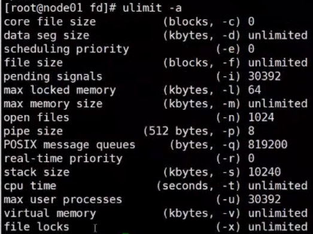

/proc/2416/task是这个进程中所有的线程。（线程id和进程id其实对于操作系统是公用的。）

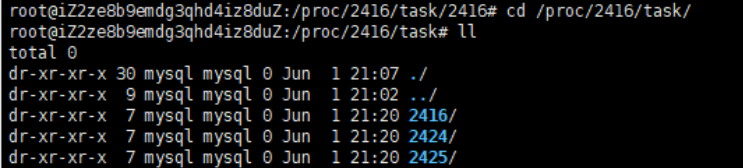

每个线程的目录下的内容和进程是一样的，其实线程的本质就是一种轻量的进程

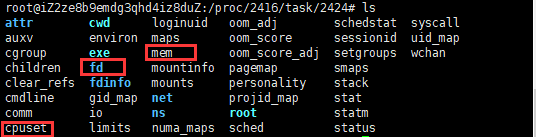

## 2.进程与线程

### 2.1.关系与区别

1. 什么是进程
   进程是资源（CPU、内存等）分配的基本单位，它是程序执行时的一个实例。
   程序运行时系统就会创建一个进程，并为它分配资源，然后把该进程放入进程就绪队列
   进程调度器选中它的时候就会为它分配CPU时间，程序开始真正运行。
2. 什么是线程
   线程是程序执行时的最小单位，它是进程的一个执行流，是CPU调度和分派的基本单位。
   一个进程可以由很多个线程组成，线程间共享进程的所有资源，每个线程有自己的堆栈和局部变量。
   线程由CPU独立调度执行，在多CPU环境下就允许多个线程同时运行。同样多线程也可以实现并发操作，每个请求分配一个线程来处理。

通过ps -ax命令我们可以看到进程的状态，包括 
- R(就绪、运行中) 
- S(休眠)，暂停运行的进程，不占用CPU
- Z(僵死)，待系统回收的进程

### 2.2.fork函数与你execve函数

fork系统调用用于创建一个新进程，称为子进程，它与进程（称为系统调用fork的进程）同时运行，此进程称为父进程。
创建新的子进程后，两个进程将执行fork（）系统调用之后的下一条指令。子进程使用相同的pc（程序计数器），相同的CPU寄存器，在父进程中使用的相同打开文件。

execve在父进程中fork一个子进程，在子进程中调用exec函数启动新的程序，用于替换父进程。

### 2.3.时间片

是分时操作系统分配给每个正在运行的进程微观上的一段CPU时间（在抢占内核中是：从进程开始运行直到被抢占的时间）。
现代操作系统（如：Windows、Linux、Mac OS X等）允许同时运行多个进程。

虽然一台计算机通常可能有多个CPU，但是同一个CPU永远不可能真正地同时运行多个任务。
在只考虑一个CPU的情况下，这些进程“看起来像”同时运行的，实则是轮番穿插地运行，由于时间片通常很短（在Linux上为纳秒级别），用户不会感觉到。

linux将cpu沿着时间线，分为多段，每一段都是一个时间片。用于分配给线程使用。以此达到即使是单核cpu也能实现多线程并发运行的效果。

换言之，单CPU这么频繁，多核CPU一定程度上可以减少上下文切换，大大提高效率

Linux下使用的是相对平均的轮询方式，window下使用的是抢占式。两者都有优先级可以设置。

java使用的线程调使用抢占式调度，Java中线程会按优先级分配CPU时间片运行，且优先级越高越优先执行，
但优先级高并不代表能独自占用执行时间片，可能是优先级高得到越多的执行时间片，反之，优先级低的分到的执行时间少但不会分配不到执行时间

### 2.4.上下文切换

- 上下文切换：是进程或者线程之间争夺CPU使用权限(争夺时间片)
- 状态转换：一个进程或者线程，应用程序执行环境的切换，例如从内核态切换到用户态

1.什么是上下文

   上下文是指某一时间点 CPU 寄存器和程序计数器的内容。
   寄存器是 CPU 内部的数量较少但是速度很快的内存（与之对应的是 CPU 外部相对较慢的 RAM 主内存）。寄存器通过对常用值（通常是运算的中间值）的快速访问来提高计算机程序运行的速度。
   程序计数器是一个专用的寄存器，用于表明指令序列中 CPU 正在执行的位置，存的值为正在执行的指令的位置或者下一个将要被执行的指令的位置，具体依赖于特定的系统。

2.什么是上下文切换

   上下文切换（有时也称做进程切换或任务切换）是指 CPU 从一个进程或线程切换到另一个进程或线程。
   进程（有时候也称做任务）是指一个程序运行的实例。在 Linux 系统中，线程就是能并行运行并且与他们的父进程（创建他们的进程）共享同一地址空间（一段内存区域）和其他资源的轻量级的进程。

3.上下文切换的过程

   稍微详细描述一下，上下文切换可以认为是内核（操作系统的核心）在 CPU 上对于进程（包括线程）进行以下的活动：
   （1）挂起一个进程，将这个进程在 CPU 中的状态（上下文）存储于内存中的某处，
   （2）在内存中检索下一个进程的上下文并将其在 CPU 的寄存器中恢复，
   （3）跳转到程序计数器所指向的位置（即跳转到进程被中断时的代码行），以恢复该进程。

4.上下文切换与状态转换

   内核态与用户态，与其说是状态，不如说这是cpu的工作模式。
   上下文切换只能发生在内核态中。内核态是 CPU 的一种有特权的模式，在这种模式下只有内核运行并且可以访问所有内存和其他系统资源。
   其他的程序，如应用程序，在最开始都是运行在用户态，但是他们能通过系统调用来运行部分内核的代码。
   系统调用在类 Unix 系统中是指活跃的进程（正在运行在 CPU 上的进程）对于内核所提供的服务的请求，例如输入/输出（I/O）和进程创建（创建一个新的进程）。
   I/O 可以被定义为任何信息流入或流出 CPU 与主内存（RAM）。也就是说，一台电脑的 CPU和内存与该电脑的用户（通过键盘或鼠标）、存储设备（硬盘或磁盘驱动）还有其他电脑的任何交流都是 I/O。

   这两种模式（用户态和内核态）在类 Unix 系统中共存意味着当系统调用发生时 CPU 切换到内核态是必要的。这应该叫做模式切换而不是上下文切换，因为没有改变当前的进程。
   上下文切换在多任务操作系统中是一个必须的特性。多任务操作系统是指多个进程运行在一个 CPU 中互不打扰，看起来像同时运行一样。
   这个并行的错觉是由于上下文在高速的切换（每秒几十上百次）。当某一进程自愿放弃它的 CPU 时间或者系统分配的时间片用完时，就会发生上下文切换。
   上下文切换有时也因硬件中断而触发。硬件中断是指硬件设备（如键盘、鼠标、调试解调器、系统时钟）给内核发送的一个信号，该信号表示一个事件（如按键、鼠标移动、从网络连接接收到数据）发生了。
   英特尔的 80386 和更高级的 CPU 都支持硬件上下文切换。然而，大多数现代的操作系统通过软件实现上下文切换，而非使用硬件上下文切换，这样能够运行在任何 CPU 上。
   同时，使用软件上下文切换可以尝试获得更好的性能。软件的上下文切换最先在 Linux 2.4 中实现。 软件上下文切换号称的一个主要优点是，
   硬件的机制保存了几乎所有 CPU 的状态，软件能够有选择性的保存需要被保存的部分并重新加载。然而这个行为对于提升上下文切换的性能到底有多重要，
   还有一点疑问。其拥护者还宣称，软件上下文切换有提高切换代码的可能性，它有助于提高正在加载的数据的有效性，从而进一步提高性能。

5.上下文切换耗时
   上下文切换通常是计算密集型的。也就是说，它需要相当可观的处理器时间，在每秒几十上百次的切换中，每次切换都需要纳秒量级的时间。
   所以，上下文切换对系统来说意味着消耗大量的 CPU 时间，事实上，可能是操作系统中时间消耗最大的操作。
   Linux相比与其他操作系统（包括其他类 Unix 系统）有很多的优点，其中有一项就是，其上下文切换和模式切换的时间消耗非常少

6.查看上下文切换

vmstat可以对系统中的上下文切换进行查看。 其中cs列就是指上下文切换的数目（一般情况下, 空闲系统的上下文切换每秒大概在1500以下）

```shell
[root@m162p201 ~]# vmstat
procs -----------memory---------- ---swap-- -----io---- -system-- ------cpu-----
 r  b   swpd   free   buff  cache   si   so    bi    bo   in   cs us sy id wa st
 1  0      0 1946188      0 1363404 0    0     0     6    0    0  2  1 97  0  0

# 各项解释
r:	（Running or Runnable）是就绪队列的长度，也就是正在运行和等待 CPU 的进程数。
b:	（Blocked）则是处于不可中断睡眠状态的进程数。
Memory	
   swpd	使用的虚拟内存的总量
   free	空闲内存的数量
   buff	使用的buffers的内存的数量
   cache	使用的caches内存的数量
   inact	非活动的内存量，使用-a参数显示
   active	活动的内存量，使用-a参数显示
Swap	
   si	每秒从交换分区写入内存的大小。
   so	每秒从内存写入交换分区的大小。
IO	
   bi	每秒从设备读取的块数量
   bo	每秒从设备写入的块数量
System	
   in	每秒中断的次数。
   cs	每秒上下文切换的次数。
CPU	
   us	运行非内核代码花费的时间。
   sy	运行内核代码花费的时间。
   id	空闲时间。
   wa	等待IO的时间。
   st	从虚拟机窃取的时间。
```

pidstat。vmstat 给出了系统总体的上下文切换情况。而pidstat 的-w选项，可以查看每个进程的上下文切换的情况。

```shell
[root@m162p201 ~]# pidstat -w 
Linux 3.10.0-514.el7.x86_64 (m162p201)  07/21/2021  _x86_64_    (2 CPU)
 
06:26:00 PM   UID       PID   cswch/s nvcswch/s  Command
06:26:00 PM     0         1      0.88      0.00  systemd
06:26:00 PM     0         2      0.00      0.00  kthreadd
06:26:00 PM     0         3      0.73      0.00  ksoftirqd/0
06:26:00 PM     0         7      0.01      0.00  migration/0
06:26:00 PM     0         8      0.00      0.00  rcu_bh
06:26:00 PM     0         9     41.54      0.00  rcu_sched
06:26:00 PM     0        10      0.25      0.00  watchdog/0
06:26:00 PM     0        11      0.25      0.00  watchdog/1
```

这个输出中最关键的两个指标：cswch/s 和nvcswch/s。
- cswch/s 表示每秒自愿上下文切换的次数。（voluntary context switches）指进程无法获得所需的资源，导致的上下文切换，如I/O,内存不足等情况。
- nvcswch/s 表示每秒非自愿上下文切换的次数。（non voluntary context switches） 指进程由于时间片已到，被系统强制调度，
  而发生的上下文切换。如大量进程都争抢CPU，这就很容易导致非自愿的上下文切换，说明CPU是性能的瓶颈
  

7.引起线程上下文切换的因素

当前执行任务（线程）的时间片用完之后，系统CPU正常调度下一个任务

中断处理，在中断处理中，其他程序”打断”了当前正在运行的程序。当CPU接收到中断请求时，会在正在运行的程序和发起中断请求的程序之间进行一次上下文切换。中断分为硬件中断和软件中断，软件中断包括因为IO阻塞、未抢到资源或者用户代码等原因，线程被挂起。

用户态切换，对于一些操作系统，当进行用户态切换时也会进行一次上下文切换，虽然这不是必须的。

多个任务抢占锁资源，在多任务处理中，CPU会在不同程序之间来回切换，每个程序都有相应的处理时间片，CPU在两个时间片的间隔中进行上下文切换

因此优化手段有：

无锁并发编程，多线程处理数据时，可以用一些办法来避免使用锁，如将数据的ID按照Hash取模分段，不同的线程处理不同段的数据

CAS算法，Java的Atomic包使用CAS算法来更新数据，而不需要加锁

使用最少线程

协程，单线程里实现多任务的调度，并在单线程里维持多个任务间的切换

合理设置线程数目既可以最大化利用CPU，又可以减少线程切换的开销。

高并发，低耗时的情况，建议少线程。

低并发，高耗时的情况：建议多线程。

高并发高耗时，要分析任务类型、增加排队、加大线程数

### 2.5.协程

[协程](https://mp.weixin.qq.com/s/IO4ynnKEfy2Rt-Me7EIeqg)

## 3.内存

[【Linux 内核 内存管理】](https://blog.csdn.net/shulianghan/category_11700760.html)

### 3.1.物理页

这里的内存指的是外部存储（内存条）

内存的管理结构为三级的树形结构 [内存管理系统三级结构](https://blog.csdn.net/shulianghan/article/details/124243959)

1. 内存结构 node
2. 内存区域 zone
3. 物理页  page

MMU 内存管理单元的作用

1. 将 虚拟地址 映射到真实的 物理地址。物理地址 是连续的，整个服务器都不会重复。而虚机地址为进程内连续的。
2. 以物理页为基本的管理单元
3. 物理页的大小。32位系统默认为4kb，64位系统默认为8kb

### 3.2.虚拟内存

#### 3.2.1.基础

[https://blog.csdn.net/qq_53144843/article/details/120592456](https://blog.csdn.net/qq_53144843/article/details/120592456)

虚拟内存是计算机系统内存管理的一种技术。它使得应用程序认为它拥有连续的可用的内存（一个连续完整的地址空间）。
而实际上，它通常是被分隔成多个物理内存碎片，还有部分暂时存储在外部磁盘存储器上，在需要时进行数据交换。
目前，大多数操作系统都使用了虚拟内存，如Windows的“虚拟内存”；Linux的“交换空间”等。

<p style="color: red">虚拟内存的作用</p>

1. 为进程提供独立的内存，实现进程之间内存的隔离，简化程序的链接、加载过程并通过动态库共享内存。
2. 能够在物理内存不足时，自动使用硬盘的空间，用来暂时替代不够的内存工作(虚拟内存可以使用硬盘空间)

实际上，目前绝大部分的应用程序都使用的是虚拟内存的特性，方便应用程序自己管理自己的内存。例如，Java、Python、Golang、C++、Redis等，
同时也衍生出了各种各样的垃圾回收算法。

<p style="color: red">Linux内存分配</p>

>  c语言标准库中分配内存的函数主要是 malloc，在linux系统中调用底层的mmap函数。
> 工作原理：mmap函数是以页为单位获得内存，而malloc函数以字节为单位获取内存。所以glibc事先通过系统调用mmap向内核请求一大块内存，
> 程序调用malloc时从这块内存中获得资源给程序，这块内存不够时再调用mmap请求新的内存块。

<p style="color: red">页面、页表、页表项</p>

- 页面：通过页的方式使用物理内存，页面就是物理页。
- 页表：虚拟内存与物理内存的映射关系，因为虚拟内存与物理内存都是以页的方式维护，所以映射关系就是页表
- 页表项：一个页面在页表中映射关系所对应的页表数据

<p style="color: red">虚拟内存的应用场景</p>

- 文件映射。现将文件读取到内存(page cache)中，再将内存映射到虚拟内存上。
- 请求分页。作用，用于防止内存浪费的一种分配机制。进程先创建虚拟内存(不分配物理内存)，当程序需要内存时，发现页表中没有对于的物理内存地址。
  于是就发生内存中断，触发分配物理内存
- 利用写时复制快速创建进程。
  fork进程时将父进程的页表复制到子进程，降低内存使用，加快进程创建。
- swap：物理内存不足时，使用硬盘作为内存的载体
- 多级页表：所有的Linux都使用了多级页表。通过层级关系，在未发生缺页中断前，减少页表项数量，从而达到降低页表占用内存的效果。
- 标准大页：相同的页表项，映射的页面范围更大，减少页表项数量，从而达到降低页表占用内存的效果。


#### 3.2.2.页表

进程持有的虚拟地址(Virtual Address)会经过内存管理单元MMU(Memory Mangament Unit)的转换变成物理地址，然后再通过物理地址访问内存。

页表是虚拟内存中的一种重要的数据结构，每一个进程的页表存储了从虚拟内存页到物理内存页框的映射关系。

虚拟内存按一定的大小被分割，每一份称为页。物理内存按一定的大小被分割，每一份称为页框。

#### 3.2.3.虚拟内存调度方式

虚拟内存调度的方式：分页式、段式、段页式3种。本质上就是如何维度 物理内存 与 虚拟内存 的映射关系。页表是维护关系的最小维度数据

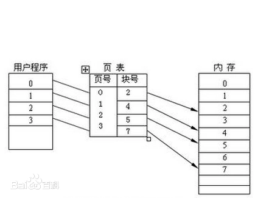

1. 页式调度是将逻辑和物理地址空间都分成固定大小的页。主存按页顺序编号，而每个独立编址的程序空间有自己的页号顺序，
   通过调度辅存中程序的各页可以离散装入主存中不同的页面位置，并可据表一一对应检索。
   页式调度的优点是页内零头小，页表对程序员来说是透明的，地址变换快，调入操作简单；
   缺点是各页不是程序的独立模块，不便于实现程序和数据的保护。
2. 段式调度是按程序的逻辑结构划分地址空间，段的长度是随意的，并且允许伸长，
   它的优点是消除了内存零头，易于实现存储保护，便于程序动态装配；
   缺点是调入操作复杂。
3. 将这两种方法结合起来便构成段页式调度。在段页式调度中把物理空间分成页，程序按模块分段，每个段再分成与物理空间页同样小的页面。
   段页式调度综合了段式和页式的优点。其缺点是增加了硬件成本，软件也较复杂。大型通用计算机系统多数采用段页式调度。

#### 3.2.4.案例

<p style="color: red">案例1.Java程序在Linux上运行虚拟内存耗用很大</p>

当我们配置使用2G堆内存的时候。虚拟机实际占用内存可能有20G。主要是因为Linux分配虚拟内存过大了。（正常没事，是glibc分配内存的机制问题）

[https://blog.csdn.net/u010686469/article/details/77319599](https://blog.csdn.net/u010686469/article/details/77319599)

我们使用Java写一个hello world，查看进程中内存映射的信息（使用pmap命令）。这里服务器的页表采用段式调度。

每一行都是一个段的虚拟内存地址开始。接下来是段大小、权限和段的来源。最后一项是文件或“anon”，表示通过mmap分配的内存块。

我们可以看到，除了我们显示的声明了堆内存大小，jvm实际还使用了很多匿名内存。

```text
## 1.命令参数说明
-x, --extended          显示扩展格式。
-d, --device            显示设备格式。
-q, --quiet             不显示某些页眉或页脚行。
-A, --range <low>,<high> 将结果限制在给定范围内的低地址和高地址。
-X                         显示比 -x 选项更多的细节。 警告：根据 /proc/PID/smaps 改变格式。
-XX                        显示内核提供的所有内容。
-p, --show-path            在映射列中显示文件的完整路径。
-c, --read-rc              读取默认配置。
-C, --read-rc-from <file>  从指定文件读取配置。
-n, --create-rc            创建新的默认配置。
-N, --create-rc-to file    创建新配置到指定文件。
-h, --help                 现实帮助信息并退出。
-V, --version              显示版本信息并退出。

pmap -dp 1710
1710:   java -jar my_demo-0.0.1-SNAPSHOT.jar
Address           Kbytes Mode  Offset           Device    Mapping
0000000000400000       4 r-x-- 0000000000000000 0fd:00000 /usr/local/java/jdk1.8/bin/java
0000000000600000       4 rw--- 0000000000000000 0fd:00000 /usr/local/java/jdk1.8/bin/java
00000000008d2000     132 rw--- 0000000000000000 000:00000   [ anon ]
00000000c4c00000   29696 rw--- 0000000000000000 000:00000   [ anon ]
00000000c6900000  617472 ----- 0000000000000000 000:00000   [ anon ]
00007f2768054000    4112 rw--- 0000000000000000 000:00000   [ anon ]
00007f2768458000    1848 r--s- 0000000003be3000 0fd:00000 /usr/local/java/jdk1.8/jre/lib/rt.jar
00007f27808cf000       8 r-x-- 0000000000000000 0fd:00000 /usr/lib64/libdl-2.17.so
00007f2780ad3000      84 r-x-- 0000000000000000 0fd:00000 /usr/local/java/jdk1.8/lib/amd64/jli/libjli.so
00007f278111f000      16 r--s- 0000000001174000 0fd:00000 /usr/local/data/my_demo-0.0.1-SNAPSHOT.jar
mapped: 3507728K    writeable/private: 439936K    shared: 2176K
# 2.最后一行的值
# mapped                   表示该进程映射的虚拟地址空间大小，也就是该进程预先分配的虚拟内存大小，即 ps 出的 vsz。
# writeable/private        表示进程所占用的私有地址空间大小，也就是该进程实际使用的内存大小。
# shared                   表示进程和其他进程共享的内存大小。

# 3.字段说明
Address: 内存开始地址
Kbytes: 占用内存的字节数（KB）
RSS: 保留内存的字节数（KB）
Dirty: 脏页的字节数（包括共享和私有的）（KB）
Mode: 内存的权限：read、write、execute、shared、private (写时复制)
Mapping: 占用内存的文件、或[anon]（分配的内存）、或[stack]（堆栈）
Offset: 文件偏移
Device: 设备名 (major:minor)
```

### 3.3.文件映射

<p style="color: red">具体实现见后面的零拷贝</p>

[mmap实现原理与注意事项](https://mp.weixin.qq.com/s/JxiNo7RQ6xqswm3sK8hQ9g)

[消息中间件与 MMAP、PageCache 的故事](https://zhuanlan.zhihu.com/p/365396239)

是一种内存映射文件的方法，即将一个文件或者其他对象映射到进程的地址空间，实现文件磁盘地址和进程虚拟地址空间中一段虚拟地址的一一映射关系。

实现这样的映射关系后，进程就可以采用指针的方式读写操作这一段内存，而系统会自动回写脏页面到对应的文件磁盘上，即完成了对文件的操作而不必调用read,write等系统调用函数。
相反，内核空间的这段区域的修改也直接反应用户空间，从而可以实现不同进程的文件共享。

作用：为了能让用户态的应用程序操作磁盘的文件，而不需要将文件复制到用户态，通过内核提供的api直接操作文件。
内核将文件复制到物理内存的高速缓存区（page cache）中，实现操作文件的速度，像操作内存一样的快。

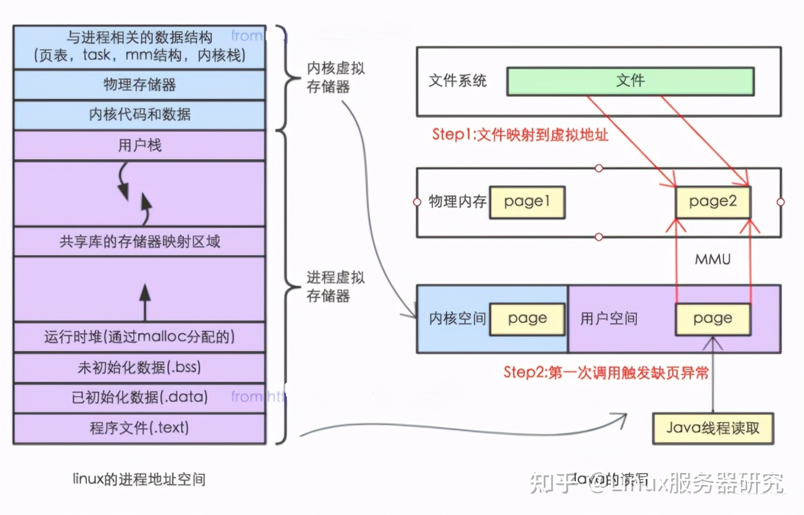

mmap 把文件映射到用户空间里的虚拟内存，省去了从内核缓冲区复制到用户空间的过程，文件中的位置在虚拟内存中有了对应的地址，
可以像操作内存一样操作这个文件，相当于已经把整个文件放入内存，但在真正使用到这些数据前却不会消耗物理内存，也不会有读写磁盘的操作，
只有真正使用这些数据时，出现缺页异常的时候才会加载文件，且只加载部分文件（一般只有几KB）

问题

- MMAP 使用时必须实现指定好内存映射的大小，并且一次 map 的大小限制在 1.5G 左右，重复 map 又会带来虚拟内存的回收、重新分配的问题，对于文件不确定大小的情形实在是太不友好了。
- MMAP 使用的是虚拟内存，和 PageCache 一样是由操作系统来控制刷盘的，虽然可以通过 force() 来手动控制，但这个时间把握不好，在小内存场景下会很令人头疼。
- 它只有在一次写入很小量数据的场景下才能表现出比 FileChannel 稍微优异的性能

### 3.4.页面缓存 page cache

[Linux中buff/cache内存占用过高解决办法](https://blog.csdn.net/c_pace/article/details/125141816)

#### 3.4.1.Page Cache 与 buffer cache

<p style="color: red">buff/cache 指的就是buffer cache 和 page cache，两者共同实现了高速缓冲功能。两者的特点如下：</p>

- page cache，页面缓存
   - 读写文件（调用read／write等系统调用）时，用于缓存文件，从而加快对磁盘数据的访问。
   - 这部分内存被内核直接管理，应用程序写入时先写入缓存区产生脏页，会被内核同步到磁盘。
   - page cache的大小为一页，通常为4K
   - mmap分配内存的单位是页，所有映射文件到缓存时，使用的也是page cache。
- buffer cache，缓冲区缓存
   - 主要是设计用来在系统对块设备进行读写的时候，对块进行数据缓存的系统来使用。
     
简单来说：Page Cache 用于缓存文件的页数据，buffer cache 用于缓存块设备（如磁盘）的块数据。

<p style="color: red">高速缓冲区的进化史</p>  

- 在 Linux 2.4 版本的内核之前，Page Cache 与 buffer cache 是完全分离的。但是，块设备大多是磁盘，磁盘上的数据又大多通过文件系统来组织，
这种设计导致很多数据被缓存了两次，浪费内存。
- 所以在 2.4 版本内核之后，两块缓存近似融合在了一起，配合实现高速缓存的功能：如果一个文件的页加载到了 Page Cache， 那么同时 buffer cache 只需要维护块指向页的指针就可以了。

比如当我们对一个文件进行写操作的时候，page cache的内容会被改变， 而buffer cache则可以用来将page标记为不同的缓冲区，并记录是哪一个缓冲区被修改了。
这样，内核在后续执行脏数据的回写（writeback）时， 就不用将整个page写回，而只需要写回修改的部分即可。实际上page cache也负责了大部分的块设备文件的缓存工作

<p style="color: red">不同Linux内核版本的 free 命令</p>

- 在 Linux 2.4 以前的。执行 free 命令，注意到会有两列名为 buffers 和 cached，也有一行名为 “-/+ buffers/cache”。
```shell
~ free -m
             total       used       free     shared    buffers     cached
Mem:        128956      96440      32515          0       5368      39900
-/+ buffers/cache:      51172      77784
Swap:        16002          0      16001
```
- 在 Linux 2.4 之后，合并了两者的数据
```shell
              total        used        free      shared  buff/cache   available
Mem:           3789         219        3117           8         452        3347
Swap:          3967           0        3967
```

<p style="color: red">Linux 的文件 I/O 系统如下</p>

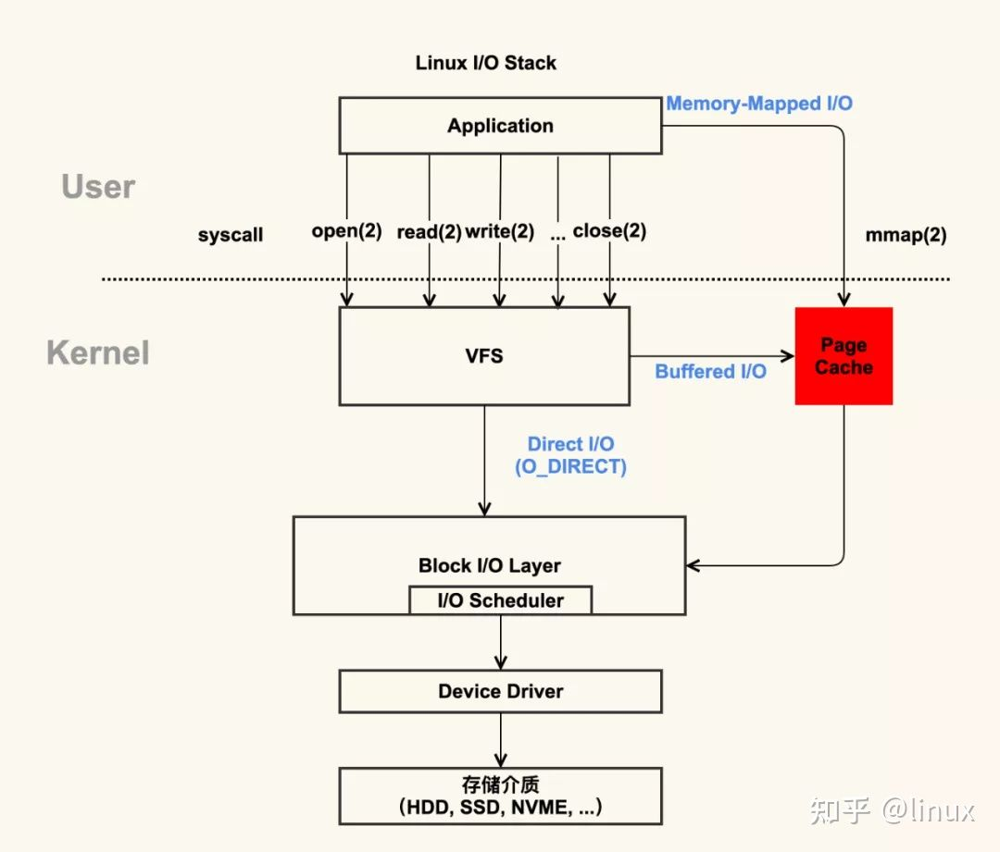

红色部分为 Page Cache。可见 Page Cache 的本质是由 Linux 内核管理的内存区域。
我们通过 mmap 以及 buffered I/O 将文件读取到内存空间实际上都是读取到 Page Cache 中。

操作系统的io操作类型
- buffered io。 通过 VFS，将文件加载到page cache中。内核态进程操作io的方式。我们一般将其称为 buffer cache
- memory mapped io(mmap)。用户态程序操作io的方式，将文件加载到page cache中。通过虚拟机内存、页表的方式，实现文件的快速读写。
- direct io。通过 VFS 直接操作磁盘文件，其实就是我们常说的普通io，这个操作不经过缓冲区，性能较差。

<p style="color: red">VFS是什么？</p>

[vfs的概念及作用](https://blog.csdn.net/qq_73151288/article/details/126958872)

虚拟文件系统。除了Linux标准的文件系统Ext2/Ext3/Ext4外，还有很多种文件系统 。linux通过叫做VFS的中间层对这些文件系统提供了完美的支持。
在大部分情况下，用户通过libc和kernel的VFS交互，不需要关心底层文件系统的具体实现

我们常说的系统调用open()、read()、write()，就是调用的VFS提供的功能。

#### 3.4.2.缓存构建过程

- 应用程序调用mmap，调用内核函数do_mmap_pgoff。
- 该函数从应用程序的地址空间中分配一段区域作为映射的内存地址，并使用一个VMA（vm_area_struct）结构代表该区域，之后就返回到应用程序。
- 当应用程序访问mmap所返回的地址指针时，由于虚实映射尚未建立，会触发缺页中断。
- 之后系统会调用缺页中断处理函数，在缺页中断处理函数中，内核通过相应区域的VMA结构判断出该区域属于文件映射，
- 于是调用具体文件系统的接口读入相应的Page Cache项，并填写相应的虚实映射表。

经过这些步骤之后，应用程序就可以正常访问相应的内存区域了。 在这个过程中，内存管理系统和VFS与page cache交互，
内存管理系统负责维护每项page cache的分配和回收，同时在使用mmap方式访问时负责建立映射； VFS负责page cache与用户空间的数据交换。

#### 3.4.3.page cache的实现机制

在Linux内核中，文件的每个数据块最多只能对应一个page cache项，它通过两个数据结构来管理这些cache项，一个是radix tree，另一个是双向链表。

- Radix tree是一种搜索树，Linux内核利用这个数据结构，快速查找脏的(dirty)和回写的（writeback）页面，得到其文件内偏移，
  从而对page cache进行快速定位。radix tree的分叉为4(22)，树高为4，用来快速定位8位文件内偏移。
- 另一个数据结构是双向链表，Linux内核为每一片物理内存区域(zone)维护active_list和 inactive_list两个双向链表，
  这两个list主要用来实现物理内存的回收。这两个链表上除了文件Cache之外，还包括其它匿名 (Anonymous)内存，如进程堆栈等。

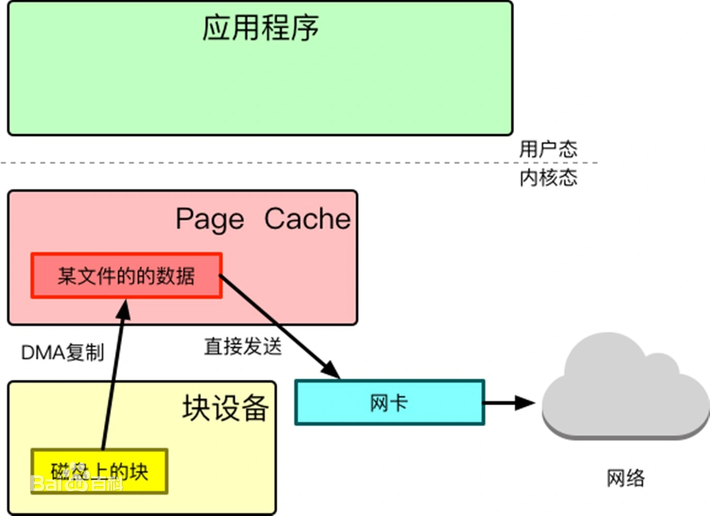

#### 3.4.4.刷盘策略

操作Page Cache产生脏页，内核就会同步到磁盘上。 一切内存缓存都存在一致性问题，为了保证 文件持久化的一致性&可靠性，所有有了刷盘策略

Linux 下以两种方式实现文件一致性：

- Write Through（写穿）：向用户层提供特定接口，应用程序可主动调用接口来保证文件一致性（异步刷盘或者同步刷盘）；没啥好说的，就是主动调用
- Write back（写回）：系统中存在定期任务（表现形式为内核线程），周期性地同步文件系统中文件脏数据块，这是默认的 Linux 一致性方案；

以下为回写的策略。

使用命令查看主要参数。

```shell
sysctl -a |grep dirty
```

```properties
# 1.后台异步刷盘
# 脏页的数据量达到阈值时处理，单位B，默认0，表示关闭根据量刷盘
vm.dirty_background_bytes = 0
# 如果脏页的比例是整个页缓存的10%，进行一次writeback。防止writeback的内存过大导致服务器io激烈增加，性能下降
vm.dirty_background_ratio = 10

# 2.同步刷盘。与上面的配置相同，只是在系统调用时，触发的话，会导致调用的性能下降
vm.dirty_bytes = 0
vm.dirty_ratio = 20

# 3.其他刷盘策略
# 时间过期刷盘： 表示如果脏数据在内存中驻留时间超过该值，pdflush进程在下一次将把这些数据写回磁盘。 默认值：3000（1/100秒）
vm.dirty_expire_centisecs = 3000
# 定期刷盘： pdflush进程的唤醒间隔，周期性把超过dirty_expire_centisecs时间的脏数据写回磁盘。 缺省设置：500（1/100秒），就是5秒钟执行一次刷盘
vm.dirty_writeback_centisecs = 500

# 缓存最大过期时间。
vm.dirtytime_expire_seconds = 43200
```

page cache的回写策略

- 周期性回写
- 占用空间超过后台阈值回写
- 占用空间超过进程最大限制触发回写，该场景会阻塞进程

#### 3.4.5.Swap 与 缺页中断

Swap 机制指的是当物理内存不够用，MMU提供调度算法来回收相关内存空间，然后将清理出来的内存空间给当前内存申请方。
Swap 机制存在的本质原因是 Linux 系统提供了虚拟内存管理机制，每一个进程认为其独占内存空间，因此所有进程的内存空间之和远远大于物理内存。
所有进程的内存空间之和超过物理内存的部分就需要交换到磁盘上。

缺页中断：操作系统以 page 为单位管理内存，当进程发现需要访问的数据不在内存时，就会通过系统调用将 page 再次读到内存中。

但主内存的空间是有限的，当主内存不足时，操作系统会从选择合适的物理内存页驱逐回磁盘，为新的内存页让出位置，
选择待驱逐页的过程在操作系统中叫做页面替换（Page Replacement），替换操作又会触发 swap 机制。 如果物理内存足够大，那么可能不需要 Swap 机制。

但是 Swap 在这种情况下还是有一定优势：对于有发生内存泄漏几率的应用程序（进程），Swap 交换分区更是重要，
这可以确保内存泄露不至于导致物理内存不够用，最终导致系统崩溃。但内存泄露会引起频繁的 swap，此时非常影响操作系统的性能。

#### 3.4.6.预读

操作系统为基于 Page Cache 的读缓存机制提供预读机制（PAGE_READAHEAD）。应用程序利用 read 系统调动读取 4KB 数据，
实际上内核使用 readahead 机制完成了 16KB 数据的读取。

#### 3.4.7.优缺点

优点：
1. 磁盘的速度明显低于内存，系统通过page cache的使用，可以大大提升文件的读写速度
2. 减少 I/O 次数，提高系统磁盘 I/O 吞吐量。在SSD中，将多次少量的写入合并为一次大量的写入，提供磁盘寿命。

缺点：
1. 最直接的缺点是需要占用额外物理内存空间，物理内存在比较紧俏的时候可能会导致频繁的 swap 操作，最终导致系统的磁盘 I/O 负载的上升。
2. 对于应用层并没有提供很好的管理 API，几乎是透明管理。应用层即使想优化 Page Cache 的使用策略也很难进行。
   因此一些应用选择在用户空间实现自己的 page 管理，例如 MySQL InnoDB 存储引擎以 16KB 的页进行管理。
3. 当然速度提升带来的副作用就是如果机器宕机，那么未刷到磁盘的数据可能就会丢失。因此用户需要根据不同的场景来决定page cache的刷盘策略。

### 3.5.写时复制

应用程序在使用虚拟内存的时候，维护着 虚拟内存 与 物理内存 的映射关系（页表）。本质是一种内存共享机制，可能提高Linux创建进程的效率。

比如，Redis的 RDB，需要将内存持久化到磁盘上，就会用到写时复制。
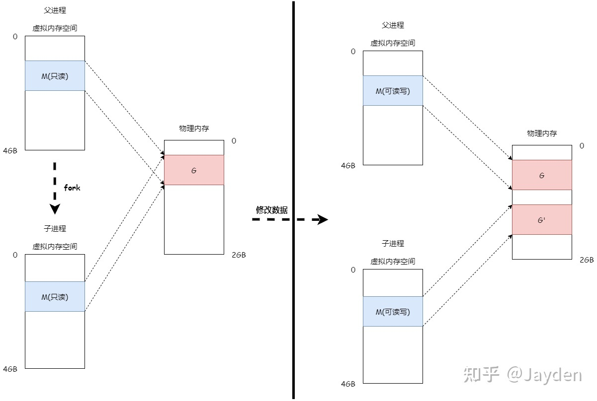

实现原理

1. 调用内核函数 fork()。创建子进程时，将父进程的 虚拟内存 与 物理内存 映射关系复制到子进程中，并将内存设置为只读（设置为只读是为了当对内存进行写操作时触发 缺页异常）。
2. 当子进程或者父进程对内存数据进行修改时，便会触发 写时复制 机制：将原来的内存页复制一份新的，并重新设置其内存映射关系，将父子进程的内存读写权限设置为可读写。

作用：

1. 降低内存消耗。子进程只保留 页表，使用的内存空间不多，加速创建子进程的速度（fork的作用）
2. 确保在子进程操作的过程中，数据尽可能的保持最新的

### 3.6.内存大页 HugePage

[HugePages的原理](https://mp.weixin.qq.com/s/oOki5zw_Y0BL0KaehvcGrw)

[HugePages实现解析](https://cloud.tencent.com/developer/article/1822138?from=article.detail.1055041)

[JVM启用HugePages](https://blog.csdn.net/xihuanyuye/article/details/83930703)

内存分页是将虚拟内存和物理内存按照固定大小切割成一段一段，这样一段尺寸固定的内存空间，就称为一个页(Page)。默认一页4K。
虚拟内存和物理内存之间通过页表来存储其映射关系，然后CPU在使用内存的时候，内存管理单元(MMU)在页表中找到虚拟内存所以映射的物理内存，然后将物理内存告诉CPU来完成内存调度。

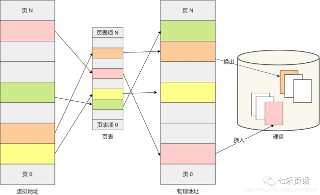

在MMU查找虚拟和物理内存映射关系，为了减少直接访问页表，就有了TLB(Translation Lookaside Buffer)的缓存机制，
TLB是一块儿高速缓存，它缓存了使用过的虚拟和物理内存映射关系，当MMU想要查找内存映射关系的时候首先从TLB里查找，如果找不到再去访问页表。

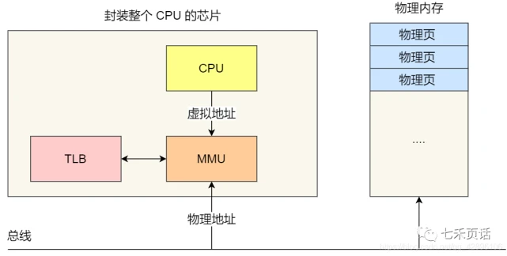

那么我可以看到页的大小，直接影响了页表的大小，这也间接地造成了内存的消耗(页表也要占内存的)。
因此页越大，映射关系越少，页表也就越小，页表也小，TLB的失效情况也就越小，那么在MMU查找关系的时候直接访问TLB查到的几率也就越大，速度也就更快了。
大部分处理器默认的页大小是4KB，也有8KB、16KB或者64KB，显而易见这样的页太小了，尤其是在云和虚拟化中，这样的页大小将大大降低相应速度，
因此就引入了HugePage的概念，将页扩大到2M甚至1G，目前Linux常用的HugePage大小为2M和1GB。

使用场景:

1. Openstack
2. K8s

### 3.7.缓存缓存
Linux内核会在内存将要耗尽的时候，触发内存回收的工作，以便释放出内存给急需内存的进程使用。
一般情况下，这个操作中主要的内存释放都来自于对buffer／cache的释放。尤其是被使用更多的cache空间。
既然它主要用来做缓存，只是在内存够用的时候加快进程对文件的读写速度，那么在内存压力较大的情况下，当然有必要清空释放cache，
作为free空间分给相关进程使用。所以一般情况下，我们认为buffer/cache空间可以被释放，这个理解是正确的。

但是这种清缓存的工作也并不是没有成本。理解cache是干什么的就可以明白清缓存必须保证cache中的数据跟对应文件中的数据一致，才能对cache进行释放。
所以伴随着cache清除的行为的，一般都是系统IO飙高。因为内核要对比cache中的数据和对应硬盘文件上的数据是否一致，如果不一致需要写回，之后才能回收。

人工触发回收缓存
```shell
echo 1 > /proc/sys/vm/drop_caches  #表示清除pagecache。
echo 2 > /proc/sys/vm/drop_caches  #表示清除回收slab分配器中的对象（包括目录项缓存和inode缓存）。slab分配器是内核中管理内存的一种机制，其中很多缓存数据实现都是用的pagecache。
echo 3 > /proc/sys/vm/drop_caches  #表示清除pagecache和slab分配器中的缓存对象。
```

## 4.文件系统

### 4.1.常见文件系统

Linux 下的文件系统主要有 ext2、ext3、ext4 等文件系统。Linux 还支持其他的 UNIX 文件系统，比如 XFS、JFS、UFS 等，
也支持 Windows 的 FAT 文件系统和网络文件系统 NFS 等。主要讲一下 Linux 自带的 ext2、ext3 和 ext4 文件系统。

各自的特点

- ext2具有极快的速度和极小的CPU占用率，可用于硬盘和移动存储设备。一般的服务器使用
- ext3增加日志功能，可回溯追踪
- ext4日志式文件系统，支持1EB（1024*1024TB），最大单文件16TB，支持连续写入可减少文件碎片。rhel6默认文件系统
- xfs可以管理500T的硬盘。rhel7默认文件系统
- brtfs文件系统针对固态盘做优化

### 4.2.顺序读写与随机读写

1. 磁盘是如何存储数据的
   信息存储在硬盘里，把它拆开也看不见里面有任何东西，只有些盘片。
   假设，你用显微镜把盘片放大，会看见盘片表面凹凸不平，凸起的地方被磁化，凹的地方是没有被磁化；
   凸起的地方代表数字1(磁化为1)，凹的地方代表数字0。因此硬盘可以以二进制来存储表示文字、图片等信息。
2. 机械盘和固态盘的区别
   - 机械盘：数据是存储的扇区的，读写是依靠磁头的摆动寻址的。顺序读写主要时间花费在了传输时间，随机读写需要多次寻道和旋转延迟。
   - 固态盘：是由控制单元和固态存储单元(DRAM或FLASH芯片)组成，存储单元负责存储数据，控制单元负责读取、写入数据。
     由于固态硬盘没有普通硬盘的机械结构，也不存在机械硬盘的寻道问题。
     随机读写是相对顺序读写而言的，所谓随机读写，是指可以在任何时候将存取文件的指针指向文件内容的任何位置。一般情况下SAS机械硬盘主要是看顺序读写性能，SSD固态盘主要看随机读写性能。
3. 文件的操作方式
   - 顺序读写：文件指针只能从头移动到尾。调用内核的append()函数实现数据的快速写入。
   - 随机读写：文件指针可以随意移动，根据需要。
4. 最佳实践
   在日常项目开发中在设计存储时，一定要考虑顺序和随机，优化其性能达到最高。
   例如，当前大多数数据库使用的都是传统的机械磁盘，因此，整个系统设计要尽可能顺序I/O，避免昂贵的寻道时间和旋转延迟的开销。
   
高性能HHD大概性能：顺序写600MB/S, 随机写100KB/S。相差6000倍。 
SSD大概性能：顺序写1000MB/S, 随机写500MB/S。相差一半左右。

### 4.3.零拷贝技术

- [从Linux零拷贝深入了解Linux-I/O](https://mp.weixin.qq.com/s/j1KjR5bRQV6oGrU5tsyHgg)
- [深入学习IO多路复用 select/poll/epoll 实现原理](https://mp.weixin.qq.com/s/5xj42JPKG8o5T7hjXIKywg)
- [虚拟内存 & I/O & 零拷贝](https://mp.weixin.qq.com/s/DMWfSxrbu4kgCh4JCQ4XIQ)

#### 4.3.1.内核态与用户态

在常见的操作系统中，为了保护系统中的核心资源，于是将系统设计为四个区域。区域越往里，需要的权限越大。所以Ring0 被称为内核空间，Ring3 被称为用户空间。

- 线程处于内核空间称之为内核态。通常认为系统内核运行在内核态。
- 线程处于用户空间属于用户态。通常认为应用程序运行在用户态。

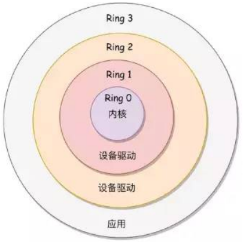

应用程序想要读取磁盘的文件，需要触发 系统调用（内核暴露的接口），通过系统调用Linux核心会把磁盘数据复制到内核态，再复制到用户态。
这个过程中，线程还是同一个，应用程序发起系统调用时，操作系统会将应用程序的线程从用户态切换到内核态，以便操作系统内核能够执行文件读取操作。
一旦内核完成文件读取操作，将结果返回给应用程序后，应用程序的线程再次切换回用户态。
这种用户态和内核态之间的切换是为了保障系统的安全性和稳定性，同时实现对系统资源的有效管理。


#### 4.3.2.什么是零拷贝

零拷贝技术是一种用于提高数据传输效率的优化策略（并非特指某一种技术），因为在数据传输过程中需要将数据拷贝到不同的缓存区中才能最终到达目标，
过程中涉及到CPU执行多次拷贝以及占用多份内存的现象，浪费CPU和内存资源。

零拷贝技术可以利用 Linux 下的 MMap、sendFile 等手段来实现，使得数据能够直接从磁盘映射到内核缓冲区，
然后通过 DMA 传输到网卡缓存，整个过程中 CPU 只负责管理和调度，而无需执行实际的数据复制指令。

现存的比较常用的零拷贝方法有下面几个：

- sendfile：利用DMA，将磁盘的文件 复制到 socket
- mmap + write：文件映射，像操作内存一样操作文件
- splice：用于在两个文件描述符之间移动数据
- Direct I/O：  不同的技术使用的场景也是不同的，使用时请结合业务逻辑。

#### 4.3.3.标准IO(传统IO)

传统IO的工作方式是，数据读取和写入从用户空间到内核空间来回赋值，内核空间数据通过IO接口从磁盘读取/写入。

这个场景下会发生4次数据复制+4次上下文切换：
1. read系统调用，进程 从 用户态 切换到 内核态  ，CPU从磁盘 复制 数据到内核pagecache。
2. read返回，进程 从 内核态 切换到 用户态，CPU从pagecache 复制 数据到用户缓冲区。
3. send，可以看作write，write系统调用，从 用户态 切换到 内核态，CPU从 用户缓冲区 复制数据到 内核socket缓冲区
4. CPU从内核socket缓冲区复制数据到网卡上
5. 最后write返回，从内核态 切换到 用户态。

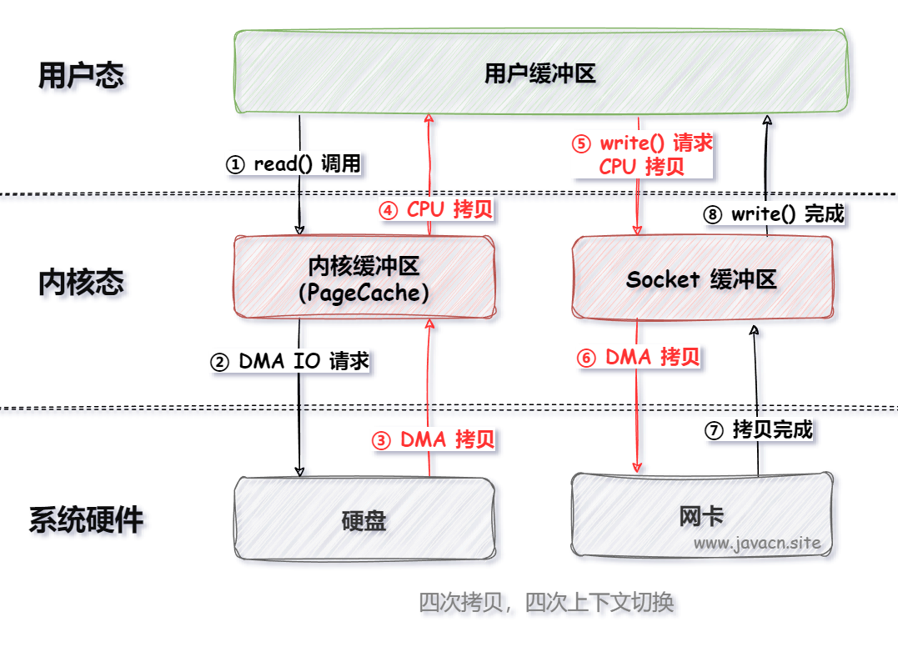

#### 4.3.4.DMA技术

DMA(Direct Memory Access)，是一种独立的电子元件，不需要CPU参与，直接内存访问，负责内存和外部设备之间进行数据传输(内存中的数据传输不能使用DMA)。应用场景：
- 应用内存和网卡数据缓冲区的数据传输
- 音频/视频设备直接读取内存的数据进行播放
- 存储设备可以直接将数据读取或写入内存。这可以提高数据传输的效率和系统的整体性能。
- 高速总线（如PCIe）上的数据传输。在CPU和其他设备之间进行高速数据传输，提高系统的性能和吞吐量。

DMA是可以降低CPU在数据传输过程的性能消耗，提升CPU处理效率。但是并不能完全取代CPU在数据处理中的作用。例如，数据的解析、处理等操作仍然需要CPU来完成。

这样优化下来会发生2次CPU数据复制+2次DMA数据复制+4次上下文切换。

DMA 本身不是零拷贝技术，而是释放了CPU拷贝的压力，提高CPU的工作效率。
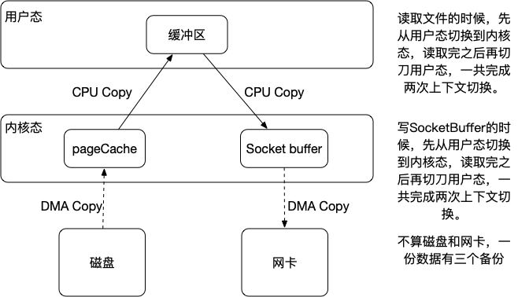


<p style="color: red">DMA 在 零拷贝中的意义</p>

如果我们要把读取到的io流写到磁盘上的话，需要将文件再复制到另一个io流中，将文件从用户态重新写会内核态，这样一个文件就存在了三份。

整个过程，磁盘文件 通过DMA复制到 内核态 -> 内核态 复制到 用户态 -> 用户态 复制到 内核态 ->  内核态 通过DMA复制到 磁盘（或者socket）
整个过程复制了4次，占用的5份数据的资源，造成的很大程度的资源浪费。而DMA省去了2和3两次复制，一共2次复制，占用3份数据的资源。


#### 4.3.5.sendfile

应用场景：用户从磁盘读取文件数据后不需要经过CPU计算/处理就直接通过网络传输出去

典型应用：MQ

```shell
ssize_t sendfile(int out_fd, int in_fd, off_t *offset, size_t count);
// out_fd:目的端文件描述符
// in_fd:源端文件描述符
// offset:源端偏移量
// count:数据长度
// 返回值:实际复制数据的长度
```

流程：
- 用户态程序进行系统调用
- 文件从磁盘  复制到  page cache（内核态）          （DMA复制）
- page cache（内核态） 复制到 socket buffer（内核态）（CPU复制）
- socket buffer 复制到 网卡上进行发送，中间省略掉用户态。（DMA复制）

1次系统调用，2次上下文切换，1次CPU数据复制，2次DMA数据复制

优点：操作简单，直接将文件的部分内容进行复制，适合大数据库的发送。

缺点：无法对数据进行操作，比如加密、解密、编码等。

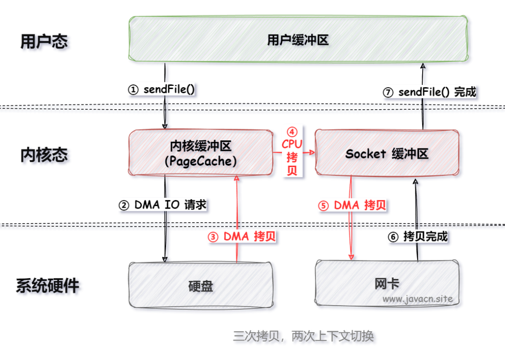

如果网卡支持 SG-DMA （The Scatter-Gather Direct Memory Access）技术，还可以再去除 Socket 缓冲区的拷贝，
这样一共只有 2 次内存拷贝。

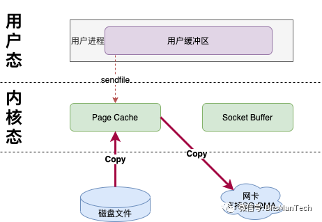

#### 4.3.6.mmap + write

文件映射的方式。通过将程序虚拟页面映射到页缓存中，程序通过映射地址和偏移量来直接操作pageCache，不用调用read和write和系统调用，文件不用复制到用户态。
修改之后的数据会被标记为脏页，系统自动回写脏页到对应的文件磁盘上。
同时内核空间对这段区域的修改也直接反映在了用户空间，从而实现不同进程间的文件共享（通过 page cache 实现低延迟）

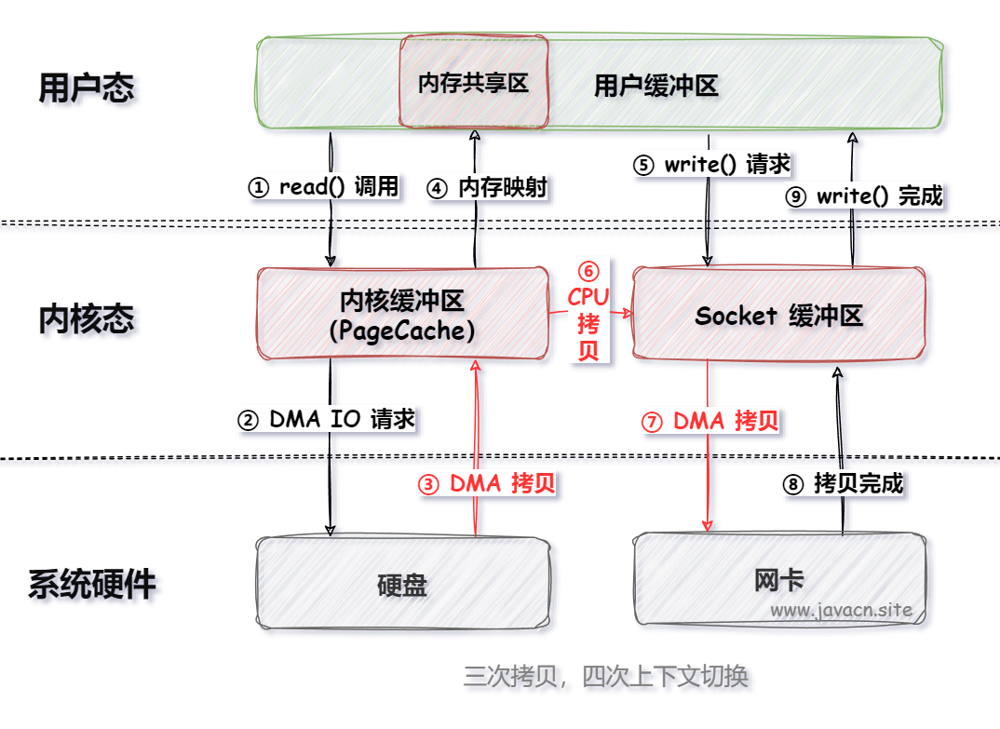

特点：
1. 用户空间的mmap使用虚拟内存。
2. mmap需要配合write，才是零拷贝。
3. mmap 仅仅避免 内核空间 到 用户空间 的CPU复制数据，但是 内核空间 内部 还是需要 CPU复制数据
4. 进行文件映射后，并不会将整个文件全部映射，只有当我们read/write时，出现缺页中断后，才真实的开始复制数据。

流程：
1. 用户调用mmap，进程 从 用户态 切换到 内核态，将 内核缓冲区 映射到 用户缓存区（系统调用，上下文切换）
2. DMA 将数据从 磁盘 复制到 内核缓冲区（DMA复制）
3. mmap返回，从内核态切换到用户态（上下文切换）
4. 用户进程调用write，尝试把文件数据写到内核socket buffer中，从用户态切换到内核态（CPU复制、上下文切换）
5. CPU将内核缓冲区数据复制到socket buffer（CPU复制）
6. DMA控制器将数据从socket buffer复制到网卡（DMA复制）
7. write返回（上下文切换）

2次系统调用、4次上下文切换、1次CPU数据复制、2次DMA数据复制

应用场景:
1. 多个线程以只读方式同时访问一个文件，mmap机制下的多线程共享同一个物理内存空间，节约了内存。
   例子：多个进程可以依赖于同一个动态链接库，利用mmap可以实现内存仅仅加载一份动态链接库，多个进程共享此库
2. mmap可用于进程间通信，对于同一个文件对应的mmap分配的物理内存天然多线程共享，可以依赖于操作系统的同步原语
3. mmap比sendfile多了一次CPU参与的内存复制，但是用户空间与内核空间之间不需要数据复制，所以效率也很高
4. mmap默认映射的文件大小为4K（Java中），适合小文本数据的复制。

缺点：
1. mmap映射整个文件，我们是通过offset和length，读取某个返回的数据，数据不存在时会发生缺页中断，这样内核会把对应的数据读取到page cache。
   所有，当我们并发乱序 通过 mmap 读取数据时，会生成大量的页表，造成用户内存的碎片化，以及虚拟内存使用增大。极大程度上会造成物理内存空间不足，
   触发淘汰算法进行内存回收，此时可能服务器性能会产生抖动，造成短时的毛刺现象。
2. 物理内存不足时，可能使用swap，极大影响服务器的性能。

#### 4.3.7.splice

```shell
#include <fcntl.h>
ssize_t splice(int fd_in, loff_t *off_in, int fd_out, loff_t *off_out, size_t len, unsigned int flags);
# fd_in参数是待输入描述符。如果它是一个管道文件描述符，则off_in必须设置为NULL；否则off_in表示从输入数据流的何处开始读取，此时若为NULL，则从输入数据流的当前偏移位置读入。
# fd_out/off_out与上述相同，不过是用于输出。
# len参数指定移动数据的长度。
# flags参数则控制数据如何移动：
#    SPLICE_F_NONBLOCK：splice 操作不会被阻塞。然而，如果文件描述符没有被设置为不可被阻塞方式的 I/O ，那么调用 splice 有可能仍然被阻塞。
#    SPLICE_F_MORE：告知操作系统内核下一个 splice 系统调用将会有更多的数据传来。
#    SPLICE_F_MOVE：如果输出是文件，这个值则会使得操作系统内核尝试从输入管道缓冲区直接将数据读入到输出地址空间，这个数据传输过程没有任何数据复制操作发生。
```

1次splice系统调用、1次pipe调用、2次上下文切换、2次DMA数据复制

局限性：

1. 用户程序不能对数据进行操作，与sendfile类似
2. Linux管道缓冲机制，可以用于任意两个文件描述符中传输数据，但是其中一个必须是管道设备

#### 4.3.8.Direct I/O

- 缓存文件I/O：用户空间要读取一个文件并不是直接与磁盘进行交互，而是中间夹了一层缓存，即page cache
- 直接文件I/O：用户空间读取文件直接与磁盘交互，数据直接存储在用户空间中，不经过内核态，没有中间page cache，直接复制到用户态。

部分操作系统中，在直接文件I/O模式下，write虽然能够保证文件数据落盘，但是文件元数据不一定落盘，所以还需要执行一次fsync操作。

优点：

1. 帮助应用程序实现自己的缓存机制，比如mysql 的 buffer pool。
2. 大文件难以命中 PageCache 缓存，又带来额外的内存拷贝，同时还挤占了小文件使用 PageCache 时需要的内存。这时应该使用Direct IO

局限性：

1. 设备之间数据传输通过DMA，所以用户空间的数据缓冲区内存页必须进行页锁定，这是为了防止 物理页地址 被交换到 磁盘 或者 被移动到新的地址，
   导致DMA去复制数据时在指定地址找不到内存页从而引发缺页异常。而页锁定的开销也不小，所以应用程序必须分配和注册一个持久的内存池，用户数据缓冲。（应用程序手动做缓存池）
2. 不经过内核态缓存区直接进行磁盘读写操作，必然会引起阻塞，因而需要将Direct IO与异步IO一起使用
3. 应用层引入缓存管理以及底层硬件管理（页锁定），很麻烦

#### 4.3.9.使用场景

1. NIO（New I/O）通道：FileChannel 提供了 transferTo() 和 transferFrom() 方法，可以直接将数据从一个通道传输到另一个通道。
例如从文件通道直接传输到 Socket 通道，整个过程无需将数据复制到用户空间缓冲区，从而实现了零拷贝。
2. Socket Direct Buffer：在 JDK 1.4 及更高版本中，Java NIO 支持使用直接缓冲区（DirectBuffer），这类缓冲区是在系统堆外分配的，
可以直接由网卡硬件进行 DMA 操作，减少数据在用户态与内核态之间复制次数 ，提高网络数据发送效率。
3. Apache Kafka 或者 Netty 等高性能框架：这些框架在底层实现上通常会利用 Java NIO 的上述特性来优化数据传输，
如 Kafka 生产者和消费者在传输消息时会用到零拷贝技术以提升性能。


### 4.4.文件系统管理方式

[文件管理方式](https://mp.weixin.qq.com/s/r6ZouXRKKOKalNwphYiaSA)

文件系统底层，使用block保存数据，大小固定，比如512B。block可以理解为容器，用来存储数据，所以文件数据量分为文件大小和占用物理空间大小。

我们下载1G的文件的时候，可以先创建1G的空文件。其实就是在文件的头尾各自插入一个block的数据，然后我们通过指针的方式写入数据即可。

### 4.5.IO多路复用

IO多路复用：是一种同步的IO模型，是指内核负责监听多个fd，当任何一个fd处于就绪状态（可读或可写）时都会通知进程，去处理fd对于的文件。
- IO： 是的是数据在内核态和用户态之间的读写操作
- 多路：通常指的是多个网络连接
- 复用：指的是复用同一个线程

作用：
- 真正解决的多线程/多进程之间，避免频繁的上下文切换，
- 减少线程/进程资源的创建，节省线程资源

Linux系统有多种多路复用实现方式：select、poll、epoll。
1. select和poll：系统调用时需要将用户态的fd集合复制到内核态，然后由内核进行遍历和检查。这个过程是阻塞的，如果内核变量发现有就绪的IO，就会返回就绪的fd，否则就阻塞。
2. epoll：是Linux特有的I/O多路复用技术，它支持大规模并发连接。与select和poll不同，epoll使用回调机制，当IO操作完成后，内核会通过回调函数通知应用程序。
   - epoll支持阻塞和非阻塞两种模式。在阻塞模式下，如果注册的fd没有就绪的IO操作，进程就会被阻塞；在非阻塞模式下，如果fd没有就绪的IO操作，内核会将结果返回给进程，进程可以继续执行其他任务。
   - 在某种角度看，epoll算是一种异步IO模型，因为除了回调机制外，还有DMA进行数据传输，CPU处于异步状态。

#### 4.5.1.select

1.内核核心方法

```java
// 返回值为就绪状态的fd数量
// select需要每次将所有需要监听的fd封装为集合，作为入参去进行判断
int select (
    int __nfds,  //指定被监听的文件描述符总数
    fd_set *__readfds, //可读事件文件描述符集合
    fd_set *__writefds, //可写事件文件描述符集合
    fd_set *__exceptfds, //异常事件文件描述符集合
    struct timeval *__timeout //该函数的超时时间
);
```

实现原理：轮询+遍历。如果有客户端的请求过来，就会将请求的socket的fd保存数组中，进程通过轮询的方式去监听fd，当fd就绪后通知进程处理。
ps: 这里采用的阻塞式的读取方式，类似于http的长连接。不断的轮询所有的fd，在系统调用之后，会阻塞式的等待fd就绪，直到超时为止，再继续下一次调用。

优点:
- 不需要每个FD都进行一次系统调用,解决了频繁的用户态内核态切换问题
- select是POSIX提供的， 一般的操作系统都有支撑，跨系统性好

缺点:
- 单进程监听的FD存在限制，数据结构为数组，只能监听1024个fd。并且FD数目剧增后，遍历的性能太差。
- 每次调用需要涉及到fd的复制。比如参数中的fd集合，都需要把fd集合从用户态拷贝到内核态，效率低，浪费CPU资源
- 存在线程安全问题

#### 4.5.2.poll

对select进行优化，比如没有了监测的fd数量限制（采用数据结构为链表），但是也通过轮询的方式遍历所有fd，存在性能问题

#### 4.5.3.epoll

优点
- 基于事件，将轮询改为回调，提高CPU执行效率
- 通过注册一个epoll监听（通常为某个端口），这个监听被触发的时候进行回调，将事件的fd发送给程序，这样fd内核态切换到用户态只有一次
- 没有最大操作fd的数量限制，只有进程的最大文件打开数量的限制，所以对并发支持的好。通常1G内存可以操作10万个fd操作  

缺点：但是只有linux平台支持

实现原理：[https://zhuanlan.zhihu.com/p/481200040](https://zhuanlan.zhihu.com/p/481200040)

1.内核核心方法

```java
/**
 * 1.创建一个 epoll 句柄
 * @param  size epoll需要监听的fd数量
 * @return  epoll的fd
 */
int epoll_create(int size);

设置事件的处理模式
struct epoll_event event;
event.events = EPOLLIN | EPOLLET; // 设置事件类型为可读，并设置触发模式为ET
event.data.fd = your_file_descriptor; // 设置相关的文件描述符
/**
 * 2.注册事件
 * @param   epfd    epoll的fd
 * @param   op      操作类型，1新增，2删除，3更新
 * @param   fd      需要epoll监听的fd
 * @param   event   需要监听的事件类型，读事件。写事件
 * @return  返回调用成功与否，0成功，-1失败
 */
int epoll_ctl(int epfd, int op, int fd, struct epoll_event *event);

/**
 * 3.获得就绪的事件【进程调用本方法，进行阻塞式等待事件唤醒】
 * @param   epfd        epoll的fd，进程想要从epoll中获得数据
 * @param   events      需要监听的事件类型，读事件。写事件
 * @param   maxevents   每次能处理的最大时间量
 * @param   timeout     等待超时的时间，-1就是立刻要拿到结果
 * @return  已就绪的fd数量；等于0，超时；小于0，失败
 */
int epoll_wait(int epfd, struct epoll_event * events, int maxevents, int timeout);
```

2.socket流程

```text
1. 调用epoll_create进程创建epoll(fd = 1)，用于监听客户端请求
2. 创建socket用于接受客户端请求，将socket的fd(fd = 2)注册到epoll(fd = 1)上。
3. 进程分配线程T1处理请求，T1调用epoll_wait开始阻塞式的等待请求过来
4. 客户端请求发送过来，socket的fd状态就绪后调用回调函数，通知线程T1(intepoll_wait返回fd数量)可以处理数量了
```

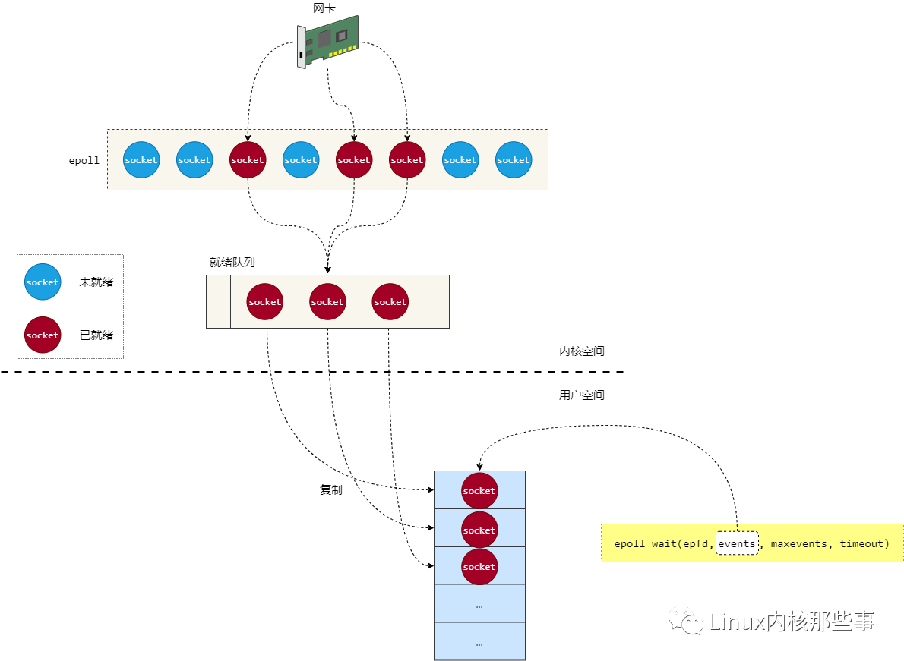

3.数据结构

- epoll内部使用红黑树来保存所有监听的socket，socket 句柄来作为 key，通过 socket 句柄快速找到对应的 socket 对象。
  红黑树是一种平衡二叉树，添加和查找元素的时间复杂度为 O(log n)，在单个服务器C10K内性能理想。

- 另外，epoll 还维护着一个就绪队列。当 epoll 监听的 socket 状态发生改变时，会发生通知给 epoll，epoll 会将当前 socket 添加到就绪队列中，
  并且唤醒等待中(调用了epoll_wait函数)的进程，进程依次处理这个队列中的socket。

一般情况下，每次就绪的fd数量不会太多，就绪队列从内核态复制到用户态的数据量相对较小，而且都是有效的，不会造成资源浪费。

4.线程安全
- epoll_ctl 方法中，需要写入红黑树，这里使用互斥锁，确保线程安全
- epoll_wait 方法中，对就绪队列加入自旋锁，也方便超时退出。

5.ET与LT模式。与IO模型的概念不同，这两种模式是事件的处理方式不同。
- LT模式是水平触发。默认模式。只要监控的事件处于就绪状态，就会持续触发事件通知。也就是说，只要事件处于就绪状态，就会反复触发事件通知。
  LT模式允许应用程序在事件通知到来后选择性地处理事件，可以在一段时间内持续处理事件，而不会错过事件。所以性能会比ET模式差，但是稳定性高。
- ET模式是边缘触发。只有当监控的事件状态发生改变时，才会触发相应的事件通知。也就是说，只有在事件从未就绪变为就绪时，才会触发一次事件通知。
  所以ET模式在大流量高并发场景性能会很好。但是要求应用程序在接收到事件通知后必须立即处理事件，否则可能丢失事件。

6.epoll高性能的原因
1. 红黑树红黑树提高epoll事件增删查改效率。
2. 回调通知机制:当epoll监听套接字有数据读或者写时，会通过注册到socket的回调函数通知epoll，epoll检测到事件后，将事件存储在就绪队列（rdllist）。
3. 就绪队列：epoll_wait返回成功后，会将所有就绪事件存储在事件数组，用户不需要进行无效的轮询，从而提高了效率。

#### 4.5.4.evport

是Solaris系统内核提供支持的

#### 4.5.5.kqueue

是Mac 系统提供支持的

#### 4.5.6.总结

1.单路存在的问题
- 每个请求响应独占一个连接，并独占连接网络读写；这样导致连接在有大量时间被闲置无法更好地利用网络资源。
- 由于是独占读写IO，这样导致RPS处理量由必须由IO承担,IO操作起来比较损耗性能，这样在高RPS处理就出现性能问题。
- 由于不能有效的合并IO也会导致在通讯中的带宽存在浪费情况，特别对于比较小的请求数据包。
- 通讯上的延时当要持大量的RPS那就必须要有更多连接支撑，连接数增加也对资源的开销有所增加。

2.多路复用的优点
- 多路复用可以在一个连接上同时处理多个请求响应，这样可以大大的减少连接的数量，降低上下文切换，并提高了网络的处理能力。
- 由于是共享连接不同请求响应数据包可以合并到一个IO上处理，这样可以大大降低IO的处理量，让性能表现得更出色。

3.使用场景
- Redis，基于内存操作，使用单线程实现多路复用。降低频繁线程上下文切换导致的性能损耗
- nginx，实现百万QPS的web服务器
- Nety，单主的reactor模型，使用一个线程处理连接
- http2，使用多路复用，将多个请求同时发往服务端，提供连接的使用效率，降低服务端的连接数

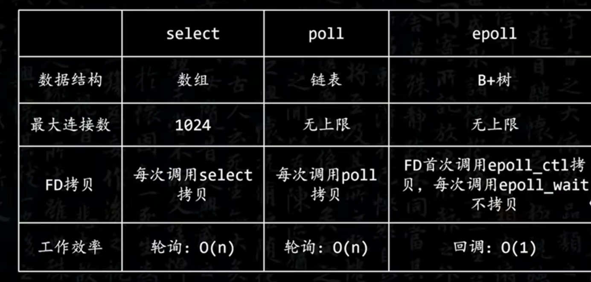

## 5.CPU

### 5.1.三级缓存

CPU缓存系统中是以缓存行（cache line）为单位存储的。目前主流的CPU Cache的Cache Line大小都是64Bytes。
当一个CPU修改了某个共享的内存资源后，其他CPU的缓存也应该同步修改，所以就有需要缓存一致性协议。

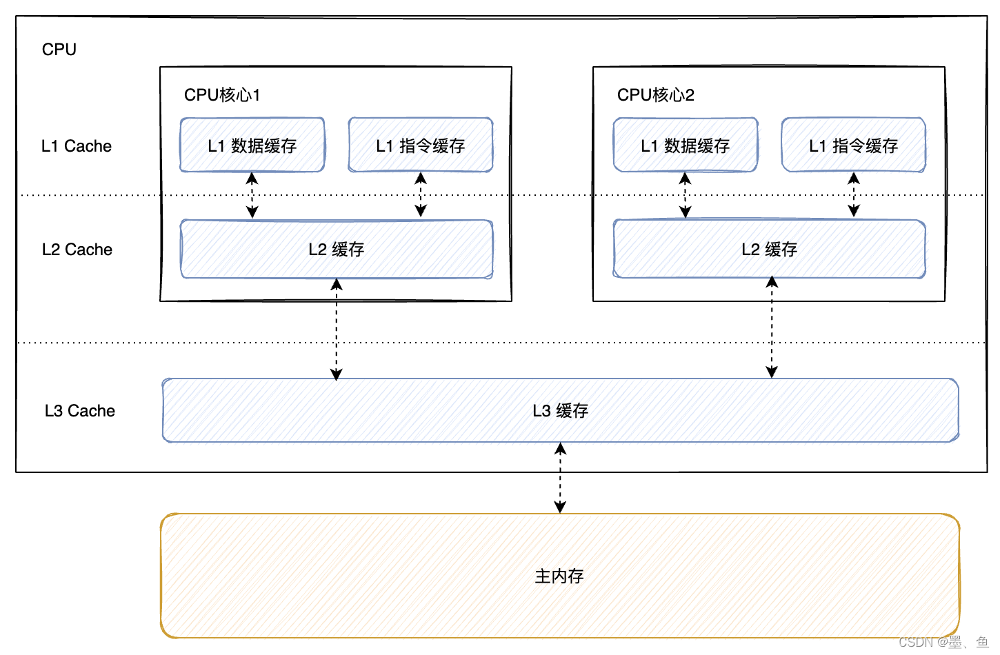

确保cache line 与 主内存 数据一致的方式；

1. 数据的可见性

- 直写：保持内存与Cache一致性最简单的方式是，把数据同时写入内存和Cache中。缺点就是每次都操作两次，造成性能浪费。
- 回写：当写入cache line时，会将内存中的数据标记为dirty。读取时，会进行校验，如果为dirty的数据时，会重新load数据到cache line。

2. 原子性

- 写传播：某个 CPU 核心里的 Cache line 数据更新时，必须要传播到其他CPU的Cache line。无法保证原子性操作。
- 事务串行化：某个 CPU 核心里对数据的操作顺序，必须在其他核心看起来顺序是一样的。
  引入锁，通过CPU命令总线，实现原子性

总线嗅探：写传播最常见实现的方式是总线嗅探（Bus Snooping）。
工作机制：当CPU修改Cache line中的数据后，将广播事件发布到总线。所有CPU订阅事件，等接收到事件后，判断使用用于更新Cache line。
缺点：发布订阅机制，增加了总线的负担。并且不能保证原子性

<p style="color:red;">为什么需要CPU缓存</p>

因为CPU的频率非常快，快到主存跟不上，在处理器的时钟周期内，CPU常常需要等待主存，浪费处理器的资源。
所以CPU自己有缓存，提供CPU的运行效率。（运行效率CPU>Cache>memory）

### 5.2.缓存一致性协议

实现缓存一致性，关键是要满足两点：写传播、事物的串行化。

[MESI协议](https://blog.csdn.net/qq_18515155/article/details/122172842)

[MESI状态变化](https://blog.csdn.net/sinde5/article/details/105224984)

MESI协议基于总线嗅探机制实现了事务串形化，也用状态机机制降低了总线带宽压力，做到了 CPU 缓存一致性。

### 5.3.CPU模式

cpu内核模式与用户模式。 进程管理，调度，内存管理，网络，文件系统等与外部设备通信的功能，必须由内核操作。

用户程序可以通过系统调用，向内核发出申请。系统调用需要执行特殊的cpu命令实现，并发生cpu中断，这时出现cpu模式切换。

- strace命令
   - 通过strace命令可以看到程序中系统调用的过程。strace -o log.log python hello.py
   - 可以看到，一个简单的helloworld，c语言31次系统调用，python700次，java300次，也反应了应用程序的性能

- sar命令
   - 使用sar -P ALL 1一秒钟查看一次用户/内核态cpu运行的时间比例

cpu在空闲时候，会执行特殊指令，让cpu进入休眠状态，直到有就绪状态的进程才会唤醒cou，休眠过程cpu不费电。

## 6.内核

### 6.1.介绍
Linux内核是Linux操作系统的核心组成部分，负责管理系统的进程、内存、设备驱动程序、文件和网络系统，决定着系统的性能和稳定性。它负责在硬件和应用程序之间分配资源，提供硬件抽象，管理硬件访问权限，以及为应用程序提供一致的服务接口。

Linux内核是开源的，这意味着任何人都可以查看、修改和分发其源代码。这种开放性使得Linux内核能够持续得到全球开发者的贡献和改进，从而不断提升其性能、安全性和功能。

Linux内核具有模块化设计的特点，允许开发者根据需要添加或移除功能模块，从而使其能够适应不同的硬件平台和应用场景。这种灵活性使得Linux系统能够在各种设备上运行，从超级计算机到智能手机，甚至是家用电器。

此外，Linux内核还提供了丰富的设备驱动程序和网络协议栈，使得系统能够支持各种硬件设备和网络通信协议。这使得Linux系统成为服务器、网络设备、嵌入式系统等领域的理想选择。

内核设计的两大流派：微内核与宏内核。从根本上讲，将一个事情拆成各个小问题，然后每个小问题只复杂一个任务是linux的设计哲学之一，按道理，linux是微内核，但恰恰不是。

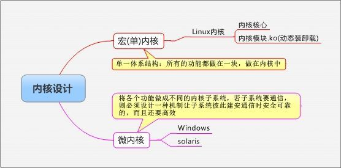

### 6.1.linux内核设计

早期设计的时没有使用微内核的思想，linux是一步步扩展而来后来，有呼声，要将linux改为微内核，但linus拒绝，能稳定的工作，就OK。
更重要的是，虽然微内核是一种优良的设计思想，但时下，他跑起来一点不比单内核高效更高级，不过微内核有更优良的线程，linux则表现一般。

之后linux在一步步的发展中吸取了微内核的设计经验，虽然是单内核，但是兼具微内核的特性。
linux通过使用模块化内核设计来兼具微内核特性，但这样的模块化设化设计并不是像微内核一样是各个子系统，而是由核心加外围的功能性模块组成内核。
而微内核子系统都是各自独立运行的，不需要依赖其他部分就能工作。而linux各模块必许依赖核心，只是能在使用时进行装载，不用时被动态卸载。
linux下的模块外在表现为类型程序的库文件，只是程序库文件为.so，而内核模块为.ko(kernel object),被内核调用。

linux内核参数都在  /etc/sysctl.conf 文件中，修改之后执行 sysctl -p 就可以生效了。

### 6.2.内核程序
linux内核非常重要，可以和硬件设备进行交互。因为程序指令都是通过CPU执行的，所以CPU模式就分为内核模式与用户模式。
非内核的程序都是用户模式，并且使用虚拟内存与内核进行交互。

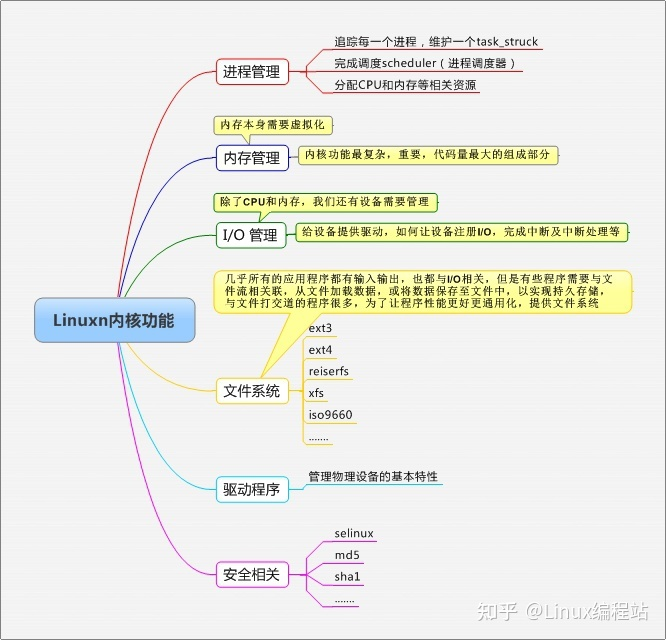

### 6.3.内核参数优化

#### 6.3.1.网络内核参数优化

tcp相关配置：[/article/4.网络&通讯协议/2.网络协议](/article/4.网络&通讯协议/2.网络协议)

- **vm.max_map_count**
> 这是ElasticSearch推荐配置的一个内核参数，因为ES使用mmapfs，大量分片索引数据需要映射到虚拟内存中，
> 链接：https://www.elastic.co/guide/en/elasticsearch/reference/current/vm-max-map-count.html

```shell
vm.max_map_count=262144
```
 
- **fs.file-max 与 ulimit**

是Linux系统最大能打开的File Descriptor数量，用Windows的是”最大句柄数“

这个参数非常常用，因为Linux下一切皆文件，你以为你只是打开了一个TCP连接，虽然不存在读写磁盘文件，但也是要占用文件描述符的！

推荐配置: fs.file-max=65536
fs.file-max是操作系统层面的；而ulimit是限制用户级别的, 二者是需要搭配一起修改的：
- 修改当前登录session的最大打开文件数： “ulimit -n 4096”
- 持久化修改某用户的最大打开文件数，在 /etc/security/limits.conf 添加 “user hard/soft nofile 4096”, nofile意思就是number of open files.

- **fs.inotify.max_user_watches**

可以watch的文件最大数量，默认值比较小，在开发或使用nodejs相关工具的时候会经常用到，比如：
- nodemon，webpack等工具会监听文件变化来Hot reload
- 使用chokidar等文件监听库开发相关应用

当然涉及到文件watch都有可能需要在linux下修改此参数，只是nodejs生态圈对file watch使用更加普遍，Linux下安装VSCode也会提示最好修改此参数，推荐把这个参数设置大一些：

fs.inotify.max_user_watches=524288


#### 6.3.2.OOM Killer机制

OOM机制导致服务进程被杀。分配内存的时候，如果发现物理内存不足，会尝试回收缓存（比如读取文件产生的page cache），如果还不够，
就触发swapping机制，会将某些进程不常用的内存页写入到交换区（硬盘分区或文件）中，然后释放掉这些内存页，从而达到缓解内存不足的情况。
如果还是不行的话。内核将会调用pagefault_out_of_memory()函数来杀掉系统中占用物理内存最多的进程（init进程和内核进程是不能被杀的）。

<p style="color: red">禁止进程被 OOM 杀掉</p>
例如 MySQL 进程如果被 OOM killer 杀掉的话，那么可能导致数据丢失的情况。将oom_score_adj设置为-1000时，
那么系统将会禁止 OOM killer 杀死，参考如下

```shell
$echo-1000>/proc/2000/oom_score_adj
```

#### 6.3.3.page cache内核参数
参考《page cache/刷盘策略》

### 6.4.计算机启动过程

- [计算机是如何启动的？](https://www.ruanyifeng.com/blog/2013/02/booting.html)
- [Grub的概述](https://blog.csdn.net/y3over/article/details/51395765)
- [Linux内核概述](https://blog.csdn.net/y3over/article/details/48438819)
- [initrd&init进程](https://blog.csdn.net/y3over/article/details/53689885)
- [Linux rootfs](https://blog.csdn.net/y3over/article/details/130626506)
- [【Linux】网络原理](https://blog.csdn.net/y3over/article/details/131067078)

1. 按开机键后，程序员能控制的第一个程序并不是内核，而是引导器程序。GNU GRUB是的最灵活的、功能最强大的、加载速度最快的、最精炼的引导器。
2. grub程序会引导kernel启动，kernel会创建一个内存的namespace叫做rootfs，运行initrd，
3. initrd是一个内存系统，在kernel启动时，依次执行init脚本，作用：设置系统参数、环境变量、启动必要的服务和系统检查等


### 6.5.namespace

- [Linux NameSpace 虚拟化 资源隔离](https://blog.csdn.net/taugast/article/details/132030093)
- [Linux namespace](https://blog.csdn.net/y3over/article/details/128863060)

namespace 是一种Linux资源隔离机制，不同的namespace之间是相互独立的，相互看不到对方的。

在用户侧看来，每个namespace都像是一个独立的Linux系统，都有自己的init进程（PID=1）。父namespace可以查看所有
子namespace的运行情况，而子namespace之间是隔离的。

|资源|描述            | 实现思路                                                                             |
|--|---|----------------------------------------------------------------------------------|                            
|进程|隔离进程ID        | Linux通过命名空间管理进程号，同一个进程，在不同的命名空间进程号不同. 进程命名空间是一个父子结构，子空间对于父空间可见                   |
|网络|隔离网络设备、协议栈、端口等| 通过网络命名空间，实现网络隔离 docker采用虚拟网络设备，将不同命名空间的网络设备连接到一起                                 |
|IPC|隔离进程间通信进程间交互方法| PID命名空间和IPC命名空间可以组合起来用， 同一个IPC名字空间内的进程可以彼此看见，允许进行交互，不同空间进程无法交互                   |
|磁盘|隔离挂载点隔离文件目录  | 进程运行时可以将挂载点与系统分离，使用这个功能时，我们可以达到 chroot 的功能，而在安全性方面比 chroot 更高                    |
|UTS|隔离Hostname和NIS域名|     让容器拥有独立的主机名和域名，从而让容器看起来像个独立的主机 目的是独立出主机名和网络信息服务（NIS）                        |
|用户|隔离用户和group ID| 每个容器内上的用户跟宿主主机上不在一个命名空间 同进程 ID 一样，用户 ID 和组 ID 在命名空间内外是不一样的，并且在不同命名空间内可以存在相同的 ID  |


### 6.6.cgroups

- [Linux cgroup](https://blog.csdn.net/y3over/article/details/127667877)
- [docker配置CPU资源 docker cgroup配置](https://blog.51cto.com/u_16099189/8798620)

Cgroup和namespace类似，也是将进程进程分组，但是目的与namespace不一样，namespace是为了隔离进程组之间的资源，使之相互隔离不干扰，而Cgroup是为了对一组进程进行统一的资源监控和限制。

主要针对CPU、内存、磁盘io等。如果需要控制GPU的话，需要单独安装对应GPU型号的驱动才可以。docker一般是将驱动封装到镜像中