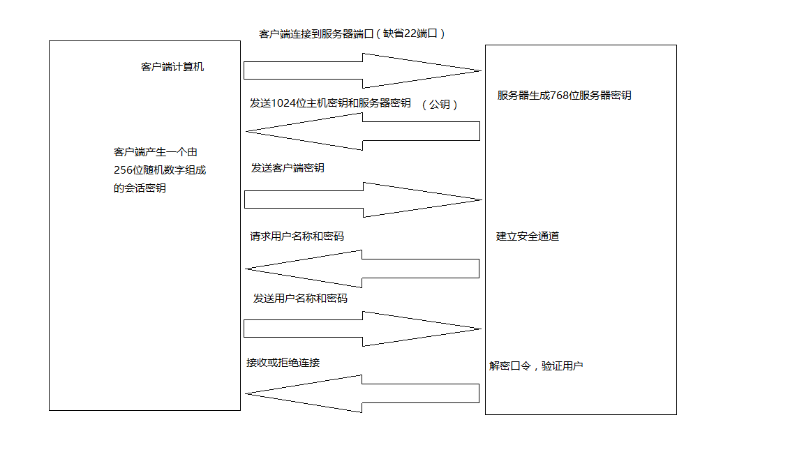

# Linux系统安装与开发环境


## 0.Linux 发行版

随着中美关系变化，我们会逐步推进使用信创的软件。

八款精美的 Linux 发行版！https://www.linuxprobe.com/eight-linux-distribution.html

2018年10大最漂亮的 Linux 发行版 https://www.cnbeta.com/articles/soft/695605.htm

展望2017年的七款好用Linux发行版 https://www.linuxidc.com/Linux/2017-01/139414.htm

- Deepin：国产的基于 Debian 的Linux发行版。是目前国内呼声最高的Linux系统。-> 目前处于可用的程度

## 1.Centos

### 1.1.下载与安装

安装centos7.9

下载地址：mini版

[http://mirrors.ustc.edu.cn/centos/7.9.2009/isos/x86_64/CentOS-7-x86_64-Minimal-2009.iso](http://mirrors.ustc.edu.cn/centos/7.9.2009/isos/x86_64/CentOS-7-x86_64-Minimal-2009.iso)

创建root用户：安装过程有提示设置root账号的密码。

### 1.2.安装ifconfig

```shell
yum search ifconfig
yum install net-tools.x86_64
```

### 1.3.防火墙配置

#### 1.3.1.Centos6

默认使用的是iptables

```shell
1.重启后生效
开启： chkconfig iptables on
关闭： chkconfig iptables off

2.即时生效，重启后失效
开启： service iptables start
关闭： service iptables stop

3.开启端口
/sbin/iptables -I INPUT -p tcp --dport 8080 -j ACCEPT

4.重启防火墙以便改动生效:(或者直接重启系统)
/etc/init.d/iptables restart

5.查看打开的端口和状态：
/etc/init.d/iptables status
```

#### 1.3.2.CentOS 7

默认使用的是firewall作为防火墙

1、firewall防火墙：
```shell
systemctl stop firewalld.service #停止firewall
systemctl disable firewalld.service #禁止firewall开机启动
firewall-cmd --state #查看默认防火墙状态（关闭后显示not running，开启后显示running）
```

2、iptables防火墙【可选】（这里iptables已经安装，下面进行配置）
```shell
vim /etc/sysconfig/iptables #编辑防火墙配置文件


# sampleconfiguration for iptables service
# you can edit thismanually or use system-config-firewall
# please do not askus to add additional ports/services to this default configuration
*filter
:INPUT ACCEPT [0:0]
:FORWARD ACCEPT[0:0]
:OUTPUT ACCEPT[0:0]
-A INPUT -m state--state RELATED,ESTABLISHED -j ACCEPT
-A INPUT -p icmp -jACCEPT
-A INPUT -i lo -jACCEPT
-A INPUT -p tcp -mstate --state NEW -m tcp --dport 22 -j ACCEPT
-A INPUT -p tcp -m state --state NEW -m tcp --dport 80 -jACCEPT
-A INPUT -p tcp -m state --state NEW -m tcp --dport 8080-j ACCEPT
-A INPUT -j REJECT--reject-with icmp-host-prohibited
-A FORWARD -jREJECT --reject-with icmp-host-prohibited
COMMIT
:wq! #保存退出
```


备注：这里使用80和8080端口为例。***部分一般添加到
```-A INPUT -p tcp -m state --state NEW -m tcp--dport 22 -j ACCEPT```
行的上面或者下面，切记不要添加到最后一行，否则防火墙重启后不生效。

```shell
systemctlrestart iptables.service #最后重启防火墙使配置生效
systemctlenable iptables.service #设置防火墙开机启动
```

### 1.4.固定ip

在官网下载的mini版7中默认上网是关闭的。

### 1.3.固定ip

在官网下载的mini版7中默认上网是关闭的。

1. 找到配置文件位置

```shell
cd /etc/sysconfig/network-scripts
```

虚机的名称类似ifcfg-ens33，实机是一般是ifcfg-eth0

2. 修改配置文件

```properties
TYPE=Ethernet
PROXY_METHOD=none
BROWSER_ONLY=no
DEFROUTE=yes
IPV4_FAILURE_FATAL=no

# 将IPV6…..协议都注释；
#IPV6INIT=yes
#IPV6_AUTOCONF=yes
#IPV6_DEFROUTE=yes
#IPV6_FAILURE_FATAL=no
#IPV6_ADDR_GEN_MODE=stable-privacy

NAME=enp0s3
UUID=f39ef946-a862-4d51-b717-f8a8f45235c7
DEVICE=enp0s3

#开机协议，有dhcp及static
BOOTPROTO=static

#设置为开机启动
ONBOOT=yes

#这个是国内的DNS地址，是固定的
DNS1=114.114.114.114

#你想要设置的固定IP
IPADDR=10.129.205.80

#子网掩码，不需要修改,使用ifconfig可以查看
NETMASK=255.255.252.0

#网关，配置子网网关，使用netstat -rn 或 route -n可查看
GATEWAY=10.129.207.254
```

3. 重启网络服务

```shell
service network restart
```

### 1.4.配置ssh

修改配置/etc/ssh/sshd_config

将下面三个值打开，并且设置为yes

```shell
# Authentication:
LoginGraceTime 2m
PermitRootLogin yes
StrictModes yes
#MaxAuthTries 6
#MaxSessions 10
RSAAuthentication yes
PubkeyAuthentication yes
```

设置开机自动启动ssh服务

```shell
systemctl enable sshd.service
```

启动ssh的服务

```shell
systemctl start sshd.service
```

### 1.5.登录安全
清空/etc/issue，/etc/issue.net，/etc/motd。因为issue文件是系统的版本号信息，当登录到系统的时候会进行提示，
motd文件在登录时会显示里面的字符串，可能包含敏感字符。

```shell
[root@server tmp]# > /etc/motd
[root@server tmp]# >/etc/issue
[root@server tmp]# >/etc/issue.net
```


### 1.6.必装软件
```shell
yum update
yum install tree telnet dos2unix sysstat lrzsz vim man gcc-c++ wget
```

### 1.7.关闭selinux
1、查看状态

```shell
/usr/sbin/sestatus -v

SELinux status: disabled
```

2、临时关闭

```shell
setenforce 0
```

3、永久关闭

```shell
vi /etc/selinux/config
```

将SELINUX=enforcing改为SELINUX=disabled

重启后生效

问题：修改后，可能导致重启的时候卡在启动界面

https://blog.csdn.net/guojun8446/article/details/102671871

### 1.8.文件描述符（ulimit -n）

该值为每个进程可以打开文件的数量。默认为1024，我们可以设置为65535。

```shell
# 方案1：临时生效
# ulimit命令可用来增加在shell中打开文件的数量。这个命令是系统内置命令，因此它只影响bash和从它启动的程序。
ulimit -n 65535

# 方案2：【推荐】使用PAM模块
# 最好通过名为pam_limits的PAM模块实现这种限制。需要通过编辑/etc/security/limits.conf文件来配置它。
echo ' * - nofile 65535 ' >> /etc/security/limits.conf

# 需要编辑文件/etc/pam.d/login配置文件，在最后添加以下一条内容：
session    required pam_limits.so

# 方案2：【不推荐】修改系统最大打开文件描述符数量
# 1.临时设置该值：
echo "1000000" > /proc/sys/fs/file-max
# 2.永久性设置
echo "fs.file-max = 1000000" >> /etc/sysctl.conf 
```

### 1.9.同步时钟
```shell
yum install ntp -y
ntpdate 1.cn.pool.ntp.org
crontab -e
```
编辑文本
```shell
*/20 * * * * ntpdate 1.cn.pool.ntp.org
```

crontab -l
或者可以直接操作文件
其中crontab的配置文件在/var/spool/cron/root

因此可以：
```shell
echo '*/20 * * * * ntpdate 1.cn.pool.ntp.org'
>>/var/spool/cron/root
```

### 1.10.【日常】清理sendmail临邮件
```shell
find /var/spool/clientmqueue -type f |xargs rm -f
```

### 1.11.【可选】设置300秒不使用进入超时
```shell
export TMOUT=300
echo "export TMOUT=300" >>/etc/profile
```


### 1.12.【可选】禁ping

不过要小心处理，虽然可以防止ping***，但是自己调试也不方便，一般用防火墙

echo " net.ipv4.icmp_eth0_ignore_all=1" >>/etc/sysctl.conf

sysctl -p 配置生效

### 1.13.【可选】Docker

安装最新版本的docker
```shell
curl -fsSL https://get.docker.com/ | sh
```

重启Docker
```shell
systemctl restart docker
```

设置Docker开机自启
```shell
systemctl enable docker
```

查看Docker版本信息
```shell
docker version
```

安装之后可能出现：
```shell
Cannot connect to the Docker daemon at unix:///var/run/docker.sock. Is the d
```

原因1：没有daemon.json 文件
```shell
cd /etc/docker
vim daemon.json
{
  "registry-mirrors": ["https://registry.docker-cn.com"]
}
```


### 1.14.【可选】升级内核

Centos默认内核版本是：3.10.0
```shell
uname -r
3.10.0-1160.59.1.el7.x86_64
```

## 2.Ubuntu 系统

### 2.1.下载与安装

Ubuntu service mini版（无界面） Ubuntu 16.04.4 LTS

官网下载即可

### 2.2.创建root用户

于ubuntu安装完后只有普通用户,没有超级ROOT用户,所以在实现一些功能上需要反复的输入密码.

因此,人个用最好创建一个ROOT管理,创建ROOT帐号及密码很简单,只要设定ROOT密码后,注销重进,用ROOT帐号登录就行!

```shell
sudo passwd root
```

输入密码和确认，注销系统并用ROOT重新登录即可

### 2.4.防火墙配置

Ubuntu使用的防护墙是ufw

ufw防火墙命令： https://www.cnblogs.com/jiu0821/p/8544042.html

ufw防火使用技巧：https://linux.cn/article-8087-1.html

1.关闭防火墙： sudo ufw disable

2.启动防火墙： sudo ufw enable

3.查看防火墙状态： sudo ufw status

4.开启/禁用相应端口或服务举例

```shell
sudo ufw allow 80 允许外部访问80端口
sudo ufw delete allow 80 禁止外部访问80 端口
sudo ufw allow from 192.168.1.1 允许此IP访问所有的本机端口
sudo ufw deny smtp 禁止外部访问smtp服务
sudo ufw delete allow smtp 删除上面建立的某条规则
sudo ufw deny proto tcp from 10.0.0.0/8 to 192.168.0.1 port 22 
  要拒绝所有的TCP流量从10.0.0.0/8 到192.168.0.1地址的22端口
```

5.安装：sudo apt-get install ufw

### 2.5.管理服务

方式一：
```text
查看服务列表代码 service --status-all
启动开机时的服务代码 sudo update-rc.d -f myservice default
停止开机时的服务代码 sudo update-rc.d -f myservice remove
```

方式二：
```text
安装代码 sudo install sysv-rc-conf
执行代码 sudo sysv-rc-conf
```

### 2.6.远程界面访问

- https://blog.csdn.net/qq_28284093/article/details/80166614
- https://blog.csdn.net/zhangfuliang123/article/details/51598552
- http://server.zol.com.cn/521/5218194.html

安装vnc教程
- https://blog.csdn.net/weixin_44543463/article/details/113846220
- https://www.likecs.com/show-887927.html#sc=2304
- https://blog.csdn.net/jiexijihe945/article/details/126222983

远程界面访问，常用的方案有vnc、远程桌面、远程控制软件（向日葵、teamview），这里介绍vnc

软件类型：
- tightvnc（已于2009年停止更新）
- tigervnc
- x11vnc（推荐）

安装流程：
```text
1. 进行VNC设置之前，需要有图形界面，没有的可以执行以下代码安装图形界面（桌面版系统忽略）
    sudo apt install ubuntu-desktop
    apt-get install gnome-panel gnome-settings-daemon metacity nautilus gnome-terminal
    sudo reboot #重启即可看到图形界面

2. 安装lightdm
    因为使用的是gnome图形界面，为了保证x11vnc与图形界面的兼容性，这里需要安装lightdm
    sudo apt-get install lightdm
    安装过程中会跳出一个界面，选择lightdm即可   (gdm3:标准桌面，lightdm：轻量级桌面)

3. 安装x11vnc程序
    sudo apt-get install x11vnc

4. 安装完成给它设置个密码保证安全性需要。注意密码一定要记住，忘了就连不上了，就需要执行以上命令重新设置。设置完之后需要重启下x11vnc
    sudo x11vnc -storepasswd /etc/x11vnc.pass
    
5. 安装完x11vnc之后需要给它配置个service，让它可以自动重启。创建service文件。 
将下面的内容写入上面创建的service文件，并保存。注意这个地方默认都是Ubuntu系统自带的组件，如果你的桌面不是gdm，下面的命令就可能不生效，所以维持操作系统原样就行。

sudo vim /etc/systemd/system/x11vnc.service
[Unit]
Description=Start x11vnc at startup.
After=multi-user.target
[Service]
Type=simple
ExecStart=/usr/bin/x11vnc -auth guess -forever -noxdamage -repeat -rfbauth  /etc/x11vnc.pass -rfbport 5900 -shared
[Install]
WantedBy=multi-user.target  

6. 配置好service之后还需要手动启动下【之后必须重启操作系统】
    sudo systemctl daemon-reload
    sudo systemctl enable x11vnc.service
    sudo systemctl start x11vnc.service

7. 启动之后去看下状态，如果美有报错就是成功了，可以使用软件测试了。查看状态不需要sudo权限，普通权限就行了。

systemctl status x11vnc
    
● x11vnc.service - Start x11vnc at startup.
     Loaded: loaded (/etc/systemd/system/x11vnc.service; enabled; vendor preset: enabled)
     Active: active (running) since Mon 2023-01-09 21:47:56 CST; 1h 14min ago
   Main PID: 3296 (x11vnc)
      Tasks: 1 (limit: 15335)
     Memory: 16.1M
        CPU: 2min 21.944s
     CGroup: /system.slice/x11vnc.service
             └─3296 /usr/bin/x11vnc -auth guess -forever -noxdamage -repeat -rfbauth /etc/x11vnc.pass -rfbport 5900 -shared

1月 09 22:57:10 zx-SER x11vnc[3296]: 09/01/2023 22:57:10  RichCursor          :   2290 |   5483736/  5483736 (  0.0%)
1月 09 22:57:10 zx-SER x11vnc[3296]: 09/01/2023 22:57:10  TOTALS              :  57322 | 121362359/-1400605462 (  0.0%)
1月 09 22:57:10 zx-SER x11vnc[3296]: 09/01/2023 22:57:10 Statistics             events    Received/ RawEquiv ( saved)
1月 09 22:57:10 zx-SER x11vnc[3296]: 09/01/2023 22:57:10  ClientCutText       :      4 |        99/       99 (  0.0%)
1月 09 22:57:10 zx-SER x11vnc[3296]: 09/01/2023 22:57:10  KeyEvent            :   1610 |     12880/    12880 (  0.0%)
1月 09 22:57:10 zx-SER x11vnc[3296]: 09/01/2023 22:57:10  PointerEvent        :  79090 |    474540/   474540 (  0.0%)
1月 09 22:57:10 zx-SER x11vnc[3296]: 09/01/2023 22:57:10  FramebufferUpdate   :  16533 |    165330/   165330 (  0.0%)
1月 09 22:57:10 zx-SER x11vnc[3296]: 09/01/2023 22:57:10  SetPixelFormat      :      2 |        40/       40 (  0.0%)
1月 09 22:57:10 zx-SER x11vnc[3296]: 09/01/2023 22:57:10  SetEncodings        :      4 |       224/      224 (  0.0%)
1月 09 22:57:10 zx-SER x11vnc[3296]: 09/01/2023 22:57:10  TOTALS              :  97243 |    653113/   653113 (  0.0%)

8. 远程访问
在window上。下载vnc client 即可访问。
```
<p style="color: red">远程服务器黑屏：远程服务器是没有显示器的，所以显卡没有任何的输出，也就没有桌面，vnc等远程软件都没办法使用。</p>

[ubuntu18.04服务器配置VNC解决去掉显示器之后黑屏大鼠标问题](https://blog.csdn.net/weixin_43878078/article/details/121754786)

解决方案有两个
- 第一个是物理上的，使用显卡欺骗器（10元以内），模拟在连接显示器，这样让显卡有输出来解决。
- 第二个是软件上去解决，我用软件构建一个虚拟的显示器，让桌面显示出来。

1.安装虚拟显示器的软件
```shell
sudo apt-get install  xserver-xorg-core-hwe-18.04
sudo apt-get install  xserver-xorg-video-dummy-hwe-18.04  --fix-missing
```

2.创建配置文件
```shell
sudo vi /usr/share/X11/xorg.conf.d/xorg.conf

Section "Monitor"
  Identifier "Monitor0"
  HorizSync 28.0-80.0
  VertRefresh 48.0-75.0
  Modeline "1920x1080_60.00" 172.80 1920 2040 2248 2576 1080 1081 1084 1118 -HSync +Vsync
EndSection
Section "Device"
  Identifier "Card0"
  Driver "dummy"
  VideoRam 256000
EndSection
Section "Screen"
  DefaultDepth 24
  Identifier "Screen0"
  Device "Card0"
  Monitor "Monitor0"
  SubSection "Display"
    Depth 24
    Modes "1920x1080_60.00"
  EndSubSection
EndSection
```
重启服务器：reboot或者sudo reboot、等待重启，我这里vnc设置好了开机自启动，这个虚拟显示器也是开机自启的

### 2.7.Ubuntu创建桌面应用

设置快捷启动方式

在Ubuntu下，每次都要找到pycharm.sh所在的文件夹，执行./pycharm.sh，非常麻烦。最好能创建一个快捷方式。

Ubuntu的快捷方式都放在/usr/share/applications，首先在该目录下创建一个Pycharm.desktop
```shell
sudo gedit /usr/share/applications/Pycharm.desktop
```

然后输入以下内容，注意Exec和Icon需要找到正确的路径
```shell
[Desktop Entry]
Type=Application
Name=Pycharm
GenericName=Pycharm3
Comment=Pycharm3:The Python IDE
Exec="/XXX/pycharm-community-3.4.1/bin/pycharm.sh" %f
Icon=/XXX/pycharm-community-3.4.1/bin/pycharm.png
Terminal=pycharm
Categories=Pycharm;
```

然后再到/usr/share/applications中找到相应的启动，复制到桌面即可；或者在搜索中找到pycharm的图标拉到左侧栏锁定就好。

### 2.8.固定IP

1.虚拟机使用VirtualBox，网络使用： 桥接模式

2.修改配置文件【ubuntu服务器配置方式，桌面版的不一样】

```sudo vim /etc/network/interfaces```

修改内容
```shell
# This file describes the network interfaces available on your system
# and how to activate them. For more information, see interfaces(5).
source /etc/network/interfaces.d/*
# The loopback network interface
# 下面的两个是DCHP动态IP地址的配置
auto lo
iface lo inet loopback

# The primary network interface
auto enp0s3

# 1. DCHP动态IP地址，先注释掉，enp0s3这个名字先不要改
# iface enp0s3 inet dhcp
iface enp0s3 inet static

# 2. 要固定的IP地址
address 192.168.3.31

# 3. ifconf可以查看的子网掩码
netmask 255.255.255.0

# 4. 配置子网网关，使用netstat -rn 或 route -n可查看
# 设置网关是为了连接到外网
gateway 192.168.3.1

# 5.配置DNS服务
dns-nameservers 180.76.76.76
```

3.修改
```shell
sudo vim /run/resolvconf/resolv.conf
nameserver 180.76.76.76
```

4.重启网卡
```shell
sudo /etc/init.d/networking restart
```

## 3.开发环境

### 3.1.环境变量与用户
Linux基于用户权限最小原则，可以一定程度上实现服务器的安全。
所以，生产中使用的都是普通用户角色，这样就导致我们安装的各种软件，配置的环境变量，没有权限配置为全局的，只能设置为当前用户。

- 案例1

pip安装依赖，因为默认的安装路径是/usr/local。普通用户是没有权限的，所以我们使用--user，安装到当前用户主目录中。

- 案例2

安装环境变量。
```shell
/etc/profile        全局用户，应用于所有的Shell。
/$HOME/.profile     当前用户，应用于所有的Shell。
/etc/bash_bashrc    全局用户，应用于Bash Shell。
~/.bashrc           局部当前，应用于Bash Sell。

source 环境变量文件   刷新环境变量

echo  $PATH         查看某个环境变量
```

### 3.2.安装ssh




1.安装
```shell
yum install -y openssl openssh-server
```

2.修改配置/etc/ssh/sshd_config

将下面三个值打开，并且设置为yes
```shell
# Authentication:
LoginGraceTime 2m
PermitRootLogin yes
StrictModes yes
#MaxAuthTries 6
#MaxSessions 10
RSAAuthentication yes
PubkeyAuthentication yes
```

3.设置开机自动启动ssh服务

```systemctl enable sshd.service```

4.启动ssh的服务

```systemctl start sshd.service```

5.ssh配置

ssh配置文件目录：/etc/ssh/sshd_config
```shell
Port　22　　ssh预设的端口，可以重复使用Port定义多个端口
Protocol　2　ssh的协定版本，可以是2或1
ListenAddress　0.0.0.0　ssh监听地址默认为全部监听
PermitRootLogin　yes　　　是否允许以root用户登陆，默认是允许yes，
UserLogin　yes　　　　　在ssh下是否接受login登陆
```

### 3.3.服务器间免密访问

配置ssh免密登录

1.以下两种方式任选其一。

（1）dsa加密方式
```shell
cd /home/zhangxue/ -- 进入用户目录
ssh-keygen -t dsa -P '' -f ~/.ssh/id_dsa
cat ~/.ssh/id_dsa.pub >> ~/.ssh/authorized_keys
chmod 644 authorized_keys --权限修改为rw-r-r
```

（2）rsa加密方式【推荐】
```shell
cd /home/zhangxue/ -- 进入用户目录
ssh-keygen -t rsa
cd .ssh
cp id_rsa.pub authorized_keys
```

将authorized_keys的内容相互复制到其他的的authorized_keys中

2.设置权限【注意：这一步很重要，不然免密登录会失败】
```shell
chmod 700 /root/.ssh
chmod 600 /root/.ssh/authorized_keys
```

3.重启 sshd 服务

```shell
systemctl restart sshd.service
```

4.测试

在主机A 上 用 ssh 命令连接测试下，，，结果是：不用输入密码的
```shell
ssh root@192.168.1.2
```

### 3.4.配置host

使用root权限
```shell
vim /etc/hosts
```

里面默认是：
```shell
127.0.0.1 localhost
127.0.1.1 ubuntu
```

在下面添加以下内容。使用本机使用以下的计算机名称，可以访问以下ip

```shell
192.168.159.128 master
192.168.159.129 node1
192.168.159.130 node2
192.168.159.131 node3
```

### 3.5.JDK

Openjdk： https://openjdk.org/

1.下载jdk.tar.gz

2.传输压缩包到/usr/local目录下

3.解压缩：tar.gz文件 tar -zxvf /usr/local/jdk1.7.40.tar.gz

4.修改文件夹名称：mv jdk1.7.40 jdk

5.设置环境变量，执行vi /etc/profile

关于文本编辑软件：

字符界面下使用vi或vim进行编辑，命令形式：vim /etc/profile

图形界面下可用gedit进行编辑，命令形式：gedit /etc/profile

```shell
export JAVA_HOME=/usr/local/jdk
export JAVA_BIN=/usr/local/jdk/bin
export PATH=$PATH:$JAVA_HOME/bin
export CLASSPATH=.:$JAVA_HOME/lib/dt.jar:$JAVA_HOME/lib/tools.jar
export JAVA_HOME JAVA_BIN PATH CLASSPATH
```

6.立即生效 source /etc/profile

7.验证成功：执行java -version

### 3.6.Python

Linux下默认系统自带python2.7的版本，注意别卸载python2，因为被系统很多程序所依赖，所以不能删除！

如果使用最新的Python3那么我们知道编译安装源码包和系统默认包之间是没有任何影响的，所以可以安装python3和python2共存。

依赖：
```shell
yum install zlib-devel                  # setuptools的依赖
yum install openssl-devel  openssl      # pip3的依赖
yum install libffi-devel                # Python3的外部函数库模块
```

这里安装python3.10.9

1.检测openssl版本，python3.10依赖 1.1.1以上的版本
```shell
1. openssl version
OpenSSL 1.0.2k-fips  26 Jan 2017

2. 下载： wget https://www.openssl.org/source/openssl-1.1.1n.tar.gz --no-check-certificate
    
3. 解压： tar -zxf openssl-1.1.1n.tar.gz
    
4. 设置安装目录 可以自定义 但是要记住，后面会用到    
    cd openssl-1.1.1n
    ./config --prefix=/data/soft/openssl --openssldir=/data/soft/openssl
  
5. 编译并安装【注意：这里这是安装到一个目录，只为python提供ssl功能，不用设置全局变量，不用修改旧的openssl】  
    make -j && make install
```

2.安装python3

```shell
1. 下载：   wget https://www.python.org/ftp/python/3.10.9/Python-3.10.9.tar.xz

2. 解压：   tar xvf Python-3.5.0.tar.xz
3. 设置安装目录。注意这里强依赖openssl 1.1.1 以上的版本，所以这里必须指定我们上面安装的openssl，
    并设置auto，否则设置openssl位置的不生效，pip就不能正常使用了
    ./configure --prefix=/data/python/python3 --with-openssl=/data/soft/openssl --with-openssl-rpath=auto
    
    观察输出的日志，最后几行 openssl 相关的check必须是也是。
    checking for openssl/ssl.h in /data/soft/openssl... yes
    checking whether compiling and linking against OpenSSL works... yes
    checking for --with-openssl-rpath... auto
    
4. 编译并安装:  make -j && make install
```

3.配置环境变量


```shell
1.配置运行脚本。 系统中原来的python在/usr/bin/python， 通过ls -l可以看到，python是一个软链接，链接到本目录下的python2.7
ln -s /data/python/python3/bin/python3 /usr/bin/python3

2.配置pip3
vim  /etc/profile
export PATH=$PATH:/data/python/python3/bin
```

<p style="color: red">Caused by SSLError(“Can‘t connect to HTTPS URL because the SSL module is not available.“)</p>

[处理方案](https://www.pudn.com/news/6237f5f602838802c31cb2a2.html)

## 4.FTP

### 4.1.安装服务

```shell
1.更新软件源，保证源是最新的，这样有利于下面在线通过apt-get install命令安装ftp。
    apt-get install

2.使用sudo apt-get install vsftp命令安装vsftp，安装软件需要root权限，我们使用sudo来暂时获取。
    sudo apt-get install vsftp

3.vsftpd服务器的启动、停止、重启、状态
    service vsftpd start 或/etc/init.d/vsftpd start
    service vsftpd stop 或/etc/init.d/vsftpd stop
    service vsftpd restart 或/etc/init.d/vsftpd restart
    service vsftpd status 或/etc/init.d/vsftpd status

4.查询当前ftp进程：
    ps -ef|grep vsftpd

5.安装好ftp后默认是会自动创建ftp用户的，然后我们设置ftp用户的密码，输入
    sudo passwd ftp
    然后输入密码，再确认密码。

6.创建ftp用户的家目录
    sudo mkdir /home/ftp

7.设置ftp家目录的权限，我这里为方便直接使用命令将权限设置为777，当然你可以根据自己需求进行设置。
    sudo chmod 777 /home/ftp
    修改ftp用户对主目录的读写权限：chmod a-w /home/ftp
    否则会出现：500 OOPS: vsftpd: refusing to run with writable root inside chroot()
```

### 4.2.常见的设置 

对/etc/vsftpd.conf配置文件进行一定的修改

vim /etc/vsftpd.conf

````properties
****chroot_list_enable=YES（是否启动限制用户的名单）
****chroot_list_file=/etc/vsftpd.chroot_list（可在文件中设置多个账号）	
****anonymous_enable=YES //启用匿名用户
****local_enable=YES //允许本地用户访问vsftpd服务器
****write_enable=YES //允许上传
****download_enable=YES //允许下载
****chroot_local_user=YES //用户登录后不能访问自己目录以外的文件或目录
anon_upload_enable=YES //允许匿名用户上传
anon_mkdir_write_enable=YES //允许匿名用户创建目录和上传
anon_other_write_enable=NO //不允许匿名用户删除和改名
local_max_rate=20000 //本地用户的最大传输速率，单位是字节/秒
anon_max_rate=5000 //匿名用户的最大传输速率，单位是字节/秒
local_umask=022 //去掉写的权限
file_open_mode=0666 //上传文件的权限
xferlog_enable=YES //维护日志文件，详细记录上传和下载操作
xferlog_std_format=YES //传输日志文件将以标准的xferlog格式书写，日志文件默认为/var/log/xferlog
hide_ids=YES //隐藏文件夹和目录属主
port_enable=YES //允许使用主动传输模式
pasv_min_port=(1024 pasv_max_port=(1024 connect_from_port_20=YES //定义FTP传输数据的端口，默认是20
ascii_download_enable=NO //设置不可使用ASCII模式下载
listen=YES //让FTP工作在独立模式下
pam_service_name=vsftpd //用户配置文件认证
userlist_enable=YES 
tcp_wrappers=YES //将使用wrappers作为主机访问控制方式
idle_session_timeout=600 //表明空闲时间为600秒
data_connection_timeout=120 //表明数据连接超时时间为120秒
listen_port=4444 //修改FTP服务器的端口号
````

### 4.3.vsftpd虚拟用户账号

(1).建立虚拟用户口令库文件

```shell
vi /pub/vu_list.txt
wang5
123
zhao6
456
```

(2).生成vsftpd的认证文件
```shell
db_load -T -t hash -f /pub/vu_list.txt /etc/vsftpd/vu_list.db
chmod 600 /etc/vsftpd/vu_list.db
```

(3).建立虚拟用户所需的PAM配置文件
```shell
vi /etc/pam.d/vsftpd.vu
auth required /lib/security/pam_userdb.so db=/etc/vsftpd/vu_list
account required /lib/security/pam_userdb.so db=/etc/vsftpd/vu_list
```

(4).建立虚拟用户所要访问的目录并设置相应权限
```shell
useradd ftpuser
```

(5).设置vsftpd.conf配置文件
```shell
guest_username=ftpuser
pam_service_name=vsftpd.vu
```

(6).重启vsftpd服务器
```shell
service vsftpd restart
```

### 4.4.对虚拟用户设置不同权限

(1).设置vsftpd.conf文件
```shell
user_config_dir=/etc/vsftpd_vu
```

(2).创建目录
```shell
mkdir /etc/vsftpd_vu
```

(3).进入目录进行编辑
```shell
cd /etc/vsftpd_vu
vi wang5
anon_world_readable_only=NO
anon_upload_enable=YES
anon_mkdir_write_enable=YES
anon_other_write_enable=YES
vi zhao6
anon_world_readable_only=YES
anon_upload_enable=NO
anon_mkdir_write_enable=NO
anon_other_write_enable=NO
```

### 4.5.配置基于IP的虚拟ftp服务器

(1).绑定其它IP
```shell
ifconfig eth0:0 192.168.1.71
```

(2).建立虚拟FTP服务器目录
```shell
mkdir -p /var/ftp2/pub1
```

(3).创建虚拟服务器的匿名用户所映射的本地用户
```shell
ftp2
useradd -d /var/ftp2 -M ftp2
```

(4).修改原独立运行服务器的配置文件
```shell
listen_address=192.168.1.70
```

(5).复制生成虚拟服务器的主配置文件
```shell
cp /etc/vsftpd.conf /etc/vsftpd/vsftpd2.conf
```

(6).设定虚拟服务器的IP并使虚拟服务器的匿名用户映射到本地用户ftp2
```shell
vi /etc/vsftpd/vsftpd2.conf
pam_service_name=vsftpd
listen_address=192.168.1.71
ftp_username=ftp2
```


(7).重启服务生效：service vsftpd restart

### 4.6.window下使用ftp命令

1. 切换到指定目录下

2. 连接目标ftp服务器：ftp 10.137.97.29

3. 输入帐号、密码

4. 切换传输方式，二进制传输使用bin命令

5. 上传文件：put test_setup.zip

下载文件：get **.zip

6. 退出ftp：bye

7. cd 切换目录

8. del 删除文件

9. dir 查看远程主机当前目录

10. ascii 使用ascii方式传输文件

11. mput、mget： 将多个文件上传、下载

12. mkdir 在远程主机中建立目录

13. pwd 显示远程主机的当前工作目录路径

### 4.7.客户连接常见故障

现象0：

> ftp: connect :连接被拒绝

原因： 服务没启动

解决： # chkconfig vsftpd on

现象1：

500 OOPS: cannot open user list file

原因： 不存在文件“/etc/vsftpd.user_list”或文件中不存在该帐户

解决: # echo username >> /etc/vsftpd.user_list

现象2：

530 Permission denied.

Login failed.

原因： “/etc/vsftpd.user_list”文件中不存在当前登陆用户

解决： # echo username >> /etc/vsftpd.user_list

现象3：

500 OOPS: cannot open chroot() user list file

Login failed.

原因： 不存在文件“/etc/vsftpd.chroot_list”

解决： # echo username >> /etc/vsftpd.chroot_list

现象4：

500 OOPS: missing value in config file

Connection closed by remote host.

原因： “=”等号前值有问题，或只有一个空格

解决： 修正相应的值即可，可能过 diff 来比较查找

现象5：

500 OOPS: bad bool value in config file

Connection closed by remote host.

原因： “=”等号后值有问题

解决: 将“=”等号后值确认修改

现象6:

500 OOPS: unrecognised variable in config file

Connection closed by remote host.

原因： 参数前有空格

解决： 将参数前空格删除

现象7、

确认存在“local_enable=YES”，但本地用户无法登陆

原因： 验证参数被误删除

解决： 添加“pam_service_name=vsftpd”

现象8、

500 OOPS: chdir

500 OOPS: child died

Connection closed by remote host.

原因： 用户主目录没有权限或没有主目录

解决： 正确设置用户主目录权限

## 5.Chkconfig【不推荐】

推荐使用默认的systemctl

chkconfig是管理系统服务(service)的命令行工具。所谓系统服务(service)，就是随系统启动而启动，随系统关闭而关闭的程序。

chkconfig可以更新(启动或停止)和查询系统服务(service)运行级信息。更简单一点，chkconfig是一个用于维护/etc/rc[0-6].d目录的命令行工具。

### 5.1.chkconfig 提供5个功能

1. 设置service启动信息
```shell
chkconfig name on/off/reset
```

on、off、reset用于改变service的启动信息。

on表示开启，off表示关闭，reset表示重置。

默认情况下，on和off开关只对运行级2，3，4，5有效，reset可以对所有运行级有效。
```shell
chkconfig httpd on
```

2. 设置service运行级别
```shell
chkconfig --level levels
chkconfig --level 2345 httpd on
```

指定运行级为2,3,4,5

等级0表示：表示关机

等级1表示：单用户模式

等级2表示：无网络连接的多用户命令行模式

等级3表示：有网络连接的多用户命令行模式

等级4表示：不可用

等级5表示：带图形界面的多用户模式

等级6表示：重新启动

3. 添加service
```shell
chkconfig --add name
```

添加一个chkconfig管理的service，并在/etc/rc[0-6].d
目录下添加相应的符号链接(symbolic links)。

4. 移除service
```shell
chkconfig --del name
```

从chkconfig 管理名单中删除该service，并且删除 /etc/rc[0-6].d。目录下所有与之关联的符号链接(symbolic links)。

5. 列出service的启动信息
```shell
chkconfig --list [name]
```

如果不指定name，会列出所有services的信息。

每个service每个运行级别都会有一个启动和停止脚本；当切换运行级别时，init不会重启已经启动的service，也不会重新停止已经停止的service。

### 5.2.操作案例

(1).列出所有服务的启动情况
```shell
$ chkconfig --list
auditd 0:off 1:off 2:on 3:on 4:on 5:on 6:off
redis 0:off 1:off 2:off 3:off 4:off 5:off 6:off
restorecond 0:off 1:off 2:off 3:off 4:off 5:off 6:off
rpcbind 0:off 1:off 2:on 3:on 4:on 5:on 6:off
rpcgssd 0:off 1:off 2:off 3:on 4:on 5:on 6:off
rpcsvcgssd 0:off 1:off 2:off 3:off 4:off 5:off 6:off
rsyslog 0:off 1:off 2:on 3:on 4:on 5:on 6:off
saslauthd 0:off 1:off 2:off 3:off 4:off 5:off 6:off
smb 0:off 1:off 2:off 3:on 4:off 5:on 6:off
。。。
xinetd based services:
rsync: off
swat: off
```

(2)增加mysqld服务
```shell
$ chkconfig --add mysqld
```

(3)删除mysqld服务
```shell
$ chkconfig --del mysqld
```

(4)将mysql设置开机启动
```shell
chkconfig mysql on
```

(5)设置mysqld运行级别为2,3,4,5
```shell
$ chkconfig --level 2345 httpd on
```

(6)列出mysqld 服务启动信息情况
```shell
$ chkconfig --list mysqld
mysqld 0:off 1:off 2:on 3:on 4:on 5:on 6:off
```

(7)设置启动信息
```shell
$ chkconfig mysqld on
```

默认的运行级别为2,3,4,5

实际上，与4中命令作用是一样的。

## 6.Systemctl

教程：[https://linux.cn/article-5926-1.html](https://linux.cn/article-5926-1.html)

命令列表：[https://www.cnblogs.com/zwcry/p/9602756.html](https://www.cnblogs.com/zwcry/p/9602756.html)

### 6.1.传统服务管理

历史上，Linux 的启动一直采用init进程。

下面的命令用来启动服务。我们添加自动启动服务的时候，将启动脚本放到/etc/init.d/目录下就行

```shell
$ sudo /etc/init.d/apache2 start
```

```shell
$ service apache2 start
```

这种方法有两个缺点。
- 一是启动时间长。init进程是串行启动，只有前一个进程启动完，才会启动下一个进程。
- 二是启动脚本复杂。init进程只是执行启动脚本，不管其他事情。脚本需要自己处理各种情况，这往往使得脚本变得很长。

### 6.2.常用功能
```shell
启动： sudo systemctl start docker
停止： sudo systemctl stop docker
重启： sudo systemctl restart docker
查看底层参数： sudo systemctl show docker
重载所有修改过的配置文件： sudo systemctl daemon-reload
开启禁止启动服务：sudo systemctl disable docker
```
    
### 6.3.开启启动服务

以docker为例子

1.配置服务
```shell
systemctl enable docker
```

2.将Docker的docker.service服务移动到系统服务中
```shell
cp /usr/lib/systemd/system/docker.service /etc/systemd/system/
systemctl daemon-reload
systemctl restart docker
```

3.查看
```shell
ll /etc/systemd/system/multi-user.target.wants/docker.service
```

## 7.ssh客户端

1.putty
> windows上的远程ssh客户端工具，小巧是它的最大特点，可以直接使用的它仅有600多k，让它无论是携带还是安装都非常便捷

2.terminus
> 一款颜值担当的ssh工具，它拥有免费版和收费版，免费版对于个人使用者来说已经足够。可跨平台使用

官网:[https://www.termius.com/](https://www.termius.com/)

3.tabby
> 与terminus类型，但是完全开源。可跨平台使用

- 源码：[https://github.com/Eugeny/tabby](https://github.com/Eugeny/tabby)
- 教程：[https://mp.weixin.qq.com/s/kOws9qy4ewmJ2ya9v_EcVg](https://mp.weixin.qq.com/s/kOws9qy4ewmJ2ya9v_EcVg)

4.FinalShell
> 国产的ssh工具，ssh功能和文件功能都不错，还自带监控，但是运行久了之后内存经常几个G

官网：[http://www.hostbuf.com/](http://www.hostbuf.com/)

5.terminal
> 国产SSH，但是不仅有xshell 的易用性，而且UI比较美观，也不会有finalshell 的吃内存的副作用

官网：[https://terminal.icu/](https://terminal.icu/)

6.SecureCRT
> 功能强大，支持多个平台，适用于Windows、Mac和Linux的 ssh 客户端软件。收费软件

7.xshell
> 功能强大，支持多个平台，适用于Windows、Mac和Linux的 ssh 客户端软件。收费软件

8.WinSCP
> Windows环境下使用SSH的开源图形化SFTP客户端。同时支持SCP协议，可以继承putty。完全开源

官网：[https://winscp.net/eng/index.php](https://winscp.net/eng/index.php)

## 8.Deepin桌面使用技巧

Deepin是目前国产操作系统中使用最广的【能用的程度】

### 8.1.使用wine创建window应用

[官方wine使用教程](https://bbs.chinauos.com/zh/post/12566)

[wine处理中文乱码](https://blog.csdn.net/Steven_Start/article/details/117594570)

以安装notepadd++为例子。

```text
1.安装exe程序
    WINEARCH=win32 WINEPREFIX=~/.deepinwine/npp deepin-wine6-stable ~/1.work/anzhuangbao/安装包/开发辅助工具/npp.7.8.9.Installer.exe
    安装64失败的话，删除目录重新安装32位试试

2.运行已安装到容器的exe主程序
    WINEPREFIX=~/.deepinwine/npp deepin-wine6-stable "c:/Program Files/Notepad++/notepad++.exe"
    需要自己进入目录查看执行的文件是哪个。且盘符必须是小写的 c:/

3.winecfg设置
    可设置windows版本、替换dll函数、窗口修饰、显示分辨率等。
    默认的windows版本是windows7，有的exe安装时提示系统版本太低的话，就需要利用winecfg修改为windows10。有的exe软件在windows xp表现更好，就需要用winecfg修改为windows xp。
    WINEPREFIX=~/.deepinwine/npp /opt/deepin-wine6-stable/bin/winecfg

4.给exe软件制作一个桌面图标
    自己在桌面上创建一个文件名字是 notepad++.desktop
    icon需要自己从网上找
    [Desktop Entry]
    Categories=Application
    Exec=sh -c 'WINEPREFIX=~/.deepinwine/npp deepin-wine6-stable "c:/Program Files/Notepad++/notepad++.exe"'
    Icon=/opt/apps/org.deepin.chineseime/entries/icons/chineseime-logo.png
    MimeType=
    Name=notepad++
    StartupNotify=true
    Type=Application
    X-Deepin-Vendor=user-custom

5.卸载
  WINEPREFIX=~/.deepinwine/npp deepin-wine6-stable "c:/Program Files/Notepad++/uninstall.exe"

6.总结
   软件可以使用，但是用一会就崩溃，设置为默认软件后无法正常打开文本，无法记录。
   总之问题时比较多的。  
```

## 9.其他

### 9.0.yum源

[centos7配置国内yum源](https://blog.csdn.net/xiaojin21cen/article/details/84726193)

### 9.1.制作镜像

使用mondo生成iso镜像。主要作用是备份系统。
[https://zhuanlan.zhihu.com/p/262982738](https://zhuanlan.zhihu.com/p/262982738)

iso是实体机的镜像。ovf/ova是虚拟机镜像

### 9.2.磁盘扩容
[动态扩容Linux根目录：/dev/mapper/centos-home分配部分空间给/dev/mapper/centos-root](https://blog.csdn.net/weixin_39447365/article/details/127535769)


### 9.3.docker安装centos

```shell
sudo docker run -it -d -p 50001:22 --privileged=true --name centos-node1 \
    -v /home/zhangxue/docker/centos/data/:/data \
    -v /etc/localtime:/etc/localtime \
    -v /etc/timezone:/etc/timezone \
    centos /usr/sbin/init
```

```text
安装后的操作：PS:这里安装的是centos 8
1. 进入容器内部：	sudo docker exec -it centos-node1  /bin/bash
2. 安装ssh服务和网络必须软件
    yum install net-tools.x86_64 -y
    yum install -y openssh-server
3. 重启网络： systemctl restart sshd
4. 安装passwd软件。默认启动后没有root账号:yum install passwd -y 
5. 设置root用户密码： passwd root
```
	
	
<p style="color: red">Error: Failed to download metadata for repo 'appstream': Cannot prepare internal mirr</p>

原因：CentOS-8于2021年12月31日停止了源的服务。

解决办法：
```text
备份原有的yum源配置文件
    cd /etc/yum.repo.d/
    mkdir bak; cp *.repo bak/

执行如下命令，替换配置文件内容
    sed -i 's/$releasever/8-stream/g' CentOS*repo

刷新yum缓存即可
    yum clean; yum makecache
```

### 9.4.Linux服务器性能压力测试
- [UnixBench](https://cloud.tencent.com/developer/article/1027466)
- [sysbench](https://www.lxlinux.net/1392.html)
- [sysbench教程](https://www.cnblogs.com/chengyunblogs/p/16168331.html)
- [sysbench安装](https://www.cnblogs.com/syw20170419/p/16918087.html)
- [Linux性能测试之性能测试指标详解](https://cloud.tencent.com/developer/article/1977987)

[Linux服务器性能测试.xlsx](课件/Linux服务器性能测试.xlsx)